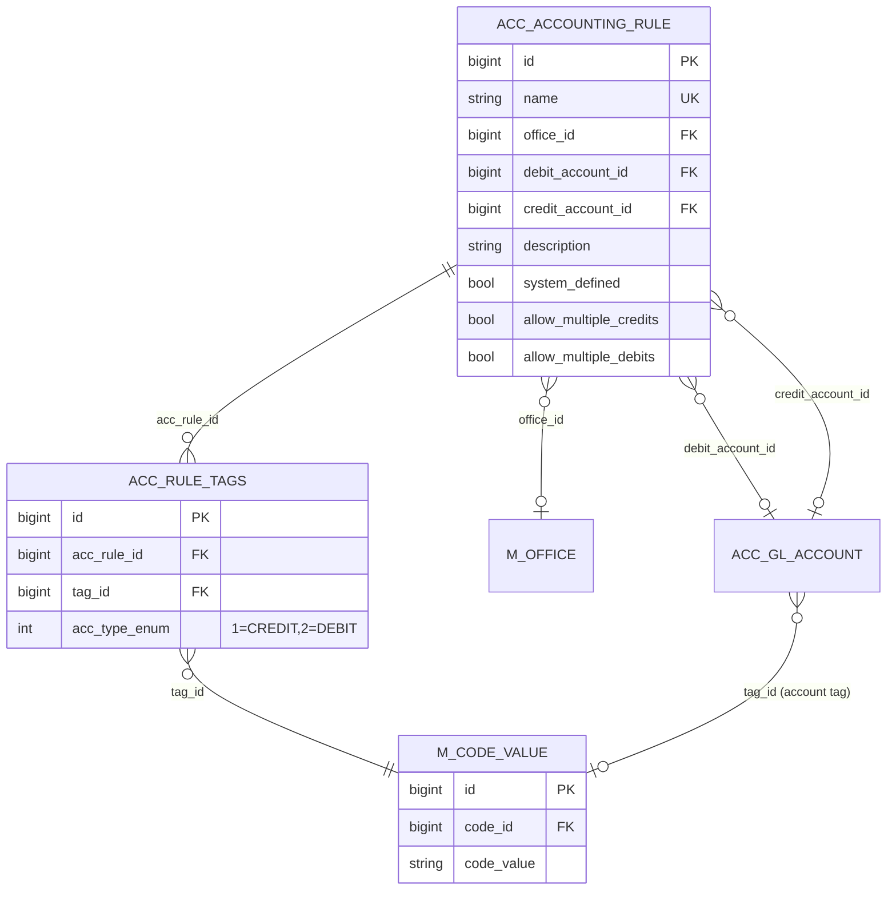

Manual journal entries against the chart of accounts (`POST /v1/journalentries`) require the user to know exactly which GL account to debit and which to credit. In a microfinance setting, branch staff posting routine cash deposits, fund transfers, or expense allocations rarely have that level of accounting domain knowledge. The Apache Fineract accounting subsystem solves this with `AccountingRule` — a saved, parameterised template that fixes either the debit side, the credit side, or both (or constrains them to a *set* of allowed accounts via tags), so the operator only has to enter the amount, narration, and reference.

All code lives under `fineract-accounting/src/main/java/org/apache/fineract/accounting/rule/` with no `fineract-provider` add-on — the rule is purely a metadata entity backed by REST + read/write services + a small handler chain. The deserialiser later expands a `useAccountingRule=true` journal-entry POST into a balanced concrete entry.

## AccountingRule entity

```java accounting/rule/domain/AccountingRule.java
@Entity
@Table(name = "acc_accounting_rule", uniqueConstraints = {
        @UniqueConstraint(columnNames = { "name" }, name = "accounting_rule_name_unique") })
public class AccountingRule extends AbstractPersistableCustom<Long> {

    @Column(name = "name", nullable = false, length = 500)
    private String name;

    @ManyToOne
    @JoinColumn(name = "office_id", nullable = true)
    private Office office;

    @ManyToOne
    @JoinColumn(name = "debit_account_id", nullable = true)
    private GLAccount accountToDebit;

    @ManyToOne
    @JoinColumn(name = "credit_account_id", nullable = true)
    private GLAccount accountToCredit;

    @Column(name = "description", nullable = true, length = 500)
    private String description;

    @Column(name = "system_defined", nullable = false)
    private Boolean systemDefined;

    @OneToMany(cascade = CascadeType.ALL, mappedBy = "accountingRule",
               orphanRemoval = true, fetch = FetchType.EAGER)
    private List<AccountingTagRule> accountingTagRules = new ArrayList<>();

    @Column(name = "allow_multiple_credits", nullable = false)
    private boolean allowMultipleCreditEntries;

    @Column(name = "allow_multiple_debits", nullable = false)
    private boolean allowMultipleDebitEntries;
    ...
}
```

| Column                  | Purpose                                                                                                  |
|-------------------------|----------------------------------------------------------------------------------------------------------|
| `name`                  | Unique human-readable name; used as the dropdown label. The unique constraint is `accounting_rule_name_unique`. |
| `office_id`             | Optional; when set, restricts the rule's visibility to users whose office hierarchy descends from this branch. |
| `debit_account_id`      | Fixed debit GL account, OR null when the debit side is tag-driven.                                       |
| `credit_account_id`     | Fixed credit GL account, OR null when the credit side is tag-driven.                                     |
| `description`           | Free-form documentation surfaced in the API and UI.                                                      |
| `system_defined`        | True for built-in rules created by data setup (cannot be edited or deleted).                             |
| `allow_multiple_credits`| When the credit side is tag-driven, whether multiple credit lines are allowed against the same tag set.  |
| `allow_multiple_debits` | Same for debit side.                                                                                     |

### Modelling the four shapes

The combination of `accountToDebit`/`accountToCredit` plus `accountingTagRules` encodes four shapes:

| Shape                                  | `accountToDebit` | `accountToCredit` | Tag rules                         |
|----------------------------------------|------------------|-------------------|-----------------------------------|
| Fully fixed simple entry               | set              | set               | none                              |
| Fixed debit, debit set is constrained  | null             | set               | rules with `acc_type_enum = DEBIT`|
| Fixed credit, debit constrained by tag | set              | null              | rules with `acc_type_enum = CREDIT`|
| Compound — both sides constrained      | null             | null              | rules with both DEBIT and CREDIT  |

When both sides are constrained and `allowMultipleDebitEntries` / `allowMultipleCreditEntries` are true, the rule represents a *compound* journal entry: any subset of the allowed accounts on each side, any amount per line, provided debits and credits balance.

## AccountingTagRule entity

The tag rules sit in `acc_rule_tags`:

```java accounting/rule/domain/AccountingTagRule.java
@Entity
@Table(name = "acc_rule_tags", uniqueConstraints = {
        @UniqueConstraint(columnNames = { "acc_rule_id", "tag_id", "acc_type_enum" },
                          name = "UNIQUE_ACCOUNT_RULE_TAGS") })
public class AccountingTagRule extends AbstractPersistableCustom<Long> {

    @ManyToOne
    @JoinColumn(name = "acc_rule_id", nullable = false)
    private AccountingRule accountingRule;

    @ManyToOne
    @JoinColumn(name = "tag_id", nullable = false)
    private CodeValue tagId;

    @Column(name = "acc_type_enum", nullable = false)
    private Integer accountType;          // 1 = CREDIT, 2 = DEBIT (JournalEntryType)

    public static AccountingTagRule create(final CodeValue tagId, final Integer accountType) {
        return new AccountingTagRule().setTagId(tagId).setAccountType(accountType);
    }
}
```

The tag references a `m_code_value` row. Tag codes are tied back to GL-account `tag_id` so the API can expand a tag into the *set* of `GLAccount`s sharing that tag. The standard tags ship as code values inside the `Asset Account Tags`, `Liability Account Tags`, `Equity Account Tags`, `Income Account Tags`, and `Expense Account Tags` codes; tenants can add their own.

The split between `CREDIT` (1) and `DEBIT` (2) values mirrors `JournalEntryType`. The unique constraint `UNIQUE_ACCOUNT_RULE_TAGS` ensures the same `(rule, tag, type)` triple can only appear once.

### Domain helpers

`AccountingRule` provides three useful helpers used by both the validator and the read service:

```java accounting/rule/domain/AccountingRule.java
public void updateAccountingRuleForTags(final List<AccountingTagRule> debitAccountingTagRules) {
    for (final AccountingTagRule t : debitAccountingTagRules) {
        t.setAccountingRule(this);
        this.accountingTagRules.add(t);
    }
}

public void updateTags(final JournalEntryType type) {
    // splits existing tags into existedCredit/existedDebit and retains only the side being updated
    ...
}

public Set<AccountingTagRule> getAccountingTagRulesByType(final JournalEntryType type) {
    final Set<AccountingTagRule> existedTags = new HashSet<>();
    for (final AccountingTagRule t : this.accountingTagRules) {
        if (t.getAccountType().equals(type.getValue())) existedTags.add(t);
    }
    return existedTags;
}
```

The `updateTags` helper makes partial updates safe — you can replace just the debit-tag set without losing the credit-tag set or vice versa.

## REST: AccountingRuleApiResource

Mounted at `/v1/accountingrules` (`fineract-accounting/.../rule/api/AccountingRuleApiResource.java`):

| Method  | Path                                | Operation                                                                                              |
|---------|-------------------------------------|--------------------------------------------------------------------------------------------------------|
| `GET`   | `/v1/accountingrules/template`      | Defaults + dropdown lists (`GLAccount` for both debit and credit, `Office` list, tag code values).      |
| `GET`   | `/v1/accountingrules`               | List rules visible to the current user. Filtered by office hierarchy: `hierarchySearchString = currentUser.office.hierarchy + "%"`. Pass `?associations=all` to also load the `AccountingTagRule` collections. |
| `GET`   | `/v1/accountingrules/{ruleId}`      | Retrieve one. `?template=true` augments the response with allowed dropdown values.                      |
| `POST`  | `/v1/accountingrules`               | Create. Mandatory: `name`, `officeId`, `accountToDebit` *or* `debitTags`, `accountToCredit` *or* `creditTags`. Optional: `description`. |
| `PUT`   | `/v1/accountingrules/{ruleId}`      | Update — only non-`systemDefined` rules. Same payload as create.                                        |
| `DELETE`| `/v1/accountingrules/{ruleId}`      | Delete — only non-`systemDefined` rules and only if not referenced by any historical journal entry.    |

The hierarchy-scoped list query is what makes branch-scoped rules work:

```java accounting/rule/api/AccountingRuleApiResource.java
final String hierarchy = currentUser.getOffice().getHierarchy();
final String hierarchySearchString = hierarchy + "%";
...
return accountingRuleReadPlatformService.retrieveAllAccountingRules(hierarchySearchString,
        isAssociationParametersExists);
```

The underlying SQL keeps rules whose `office_id` is NULL (tenant-wide) or whose office hierarchy starts with the current user's branch hierarchy prefix.

### Validator

`accounting/rule/serialization/AccountingRuleCommandFromApiJsonDeserializer.java`:

- `name` required, ≤ 500 chars.
- `officeId` required (long).
- Exactly one of `accountToDebit` *or* `debitTags` must be present per side; same for credit.
- `debitTags` and `creditTags` are arrays of `tagId` ints.
- `description` ≤ 500.
- `allowMultipleDebitEntries` / `allowMultipleCreditEntries` are booleans, only meaningful when the corresponding fixed account is null.

The deserialiser also enforces that you cannot simultaneously specify `accountToDebit` *and* `debitTags` — those are mutually exclusive sources of the debit side.

### Handlers

The action handlers under `accounting/rule/handler/`:

```text
CreateAccountingRuleCommandHandler   (CommandType entity="ACCOUNTINGRULE", action="CREATE")
UpdateAccountingRuleCommandHandler   (...,                                  action="UPDATE")
DeleteAccountingRuleCommandHandler   (...,                                  action="DELETE")
```

Each is a thin `NewCommandSourceHandler` that delegates to `AccountingRuleWritePlatformService`.

### Write service

`AccountingRuleWritePlatformServiceJpaRepositoryImpl`:

- On create — resolves the optional office, optional debit/credit accounts, optional tag lists; constructs `AccountingRule.fromJson(...)`, attaches the tag-rule list with `updateAccountingRuleForTags`, and saves.
- On update — applies `AccountingRule.update(JsonCommand)`, then for each side decides whether tags need to be replaced. The `updateTags(JournalEntryType)` helper preserves the unchanged side.
- On delete — refuses if `systemDefined=true` or any `acc_gl_journal_entry` row exists with this rule's name as a reference. The rule's id itself is not stored on the journal entry, so the check is by name-based lookup (the manual-entry workflow stamps the rule name into the `description` when expanding).

### Read service

`AccountingRuleReadPlatformServiceImpl` is JDBC-based:

```sql
SELECT rule.id, rule.name, rule.office_id, office.name AS officeName,
       rule.debit_account_id, debit_account.name, debit_account.gl_code, debit_account.classification_enum,
       rule.credit_account_id, credit_account.name, credit_account.gl_code, credit_account.classification_enum,
       rule.description, rule.allow_multiple_credits, rule.allow_multiple_debits, rule.system_defined
  FROM acc_accounting_rule rule
  LEFT JOIN m_office office ON office.id = rule.office_id
  LEFT JOIN acc_gl_account debit_account  ON debit_account.id  = rule.debit_account_id
  LEFT JOIN acc_gl_account credit_account ON credit_account.id = rule.credit_account_id
 WHERE office.hierarchy LIKE ? OR rule.office_id IS NULL
```

When `?associations=all` is passed the call expands every rule with two extra queries:

```sql
SELECT t.id, t.tag_id, cv.code_value, t.acc_type_enum
  FROM acc_rule_tags t JOIN m_code_value cv ON cv.id = t.tag_id
 WHERE t.acc_rule_id = ? AND t.acc_type_enum = ?    -- per side
```

## Expansion at journal-entry POST time

When `POST /v1/journalentries` is called with `useAccountingRule=true` and an `accountingRule` id, the journal-entry validator looks up the rule, then:

1. **Fixed-side resolution** — if `accountToDebit` is set, that's the debit account; otherwise the request must include explicit `debits[]` whose `glAccountId` values are in the union of the rule's debit tag set.
2. **Tag expansion** — for each tag rule on the constrained side, every `acc_gl_account` row whose `tag_id` matches becomes a candidate; the requester picks specific ones in the `debits[]` (or `credits[]`) array.
3. **Multiplicity check** — if `allowMultipleDebitEntries=false` and the user supplied >1 debit row, the request is rejected. Same for credits.
4. **Balance check** — the totals must still equal, exactly as for an unparameterised entry.
5. **Persistence** — the resulting entries are written as normal `JournalEntry` rows, with the rule's `name` copied into `description` so the audit log preserves which rule produced the entry.

```mermaid
flowchart LR
    UI[Branch user POST /v1/journalentries<br/>useAccountingRule=true, amount=100] --> Validator[JournalEntryCommandFromApi<br/>JsonDeserializer]
    Validator --> Lookup[AccountingRuleRepositoryWrapper.<br/>findOneWithNotFoundDetection]
    Lookup --> Resolve{Fixed sides?}
    Resolve -- both fixed --> Build[Build balanced debit+credit pair]
    Resolve -- debit fixed,<br/>credit tagged --> ExpandC[Validate credits[] ⊆<br/>tagged GLAccount set]
    Resolve -- credit fixed,<br/>debit tagged --> ExpandD[Validate debits[] ⊆<br/>tagged GLAccount set]
    Resolve -- both tagged --> ExpandBoth[Validate both sides]
    ExpandC --> Build
    ExpandD --> Build
    ExpandBoth --> Build
    Build --> Persist[JournalEntryRepository.saveAll]
```

## Entity-relationship view



## Permissions

```text
READ_ACCOUNTINGRULE
CREATE_ACCOUNTINGRULE, CREATE_ACCOUNTINGRULE_CHECKER
UPDATE_ACCOUNTINGRULE, UPDATE_ACCOUNTINGRULE_CHECKER
DELETE_ACCOUNTINGRULE, DELETE_ACCOUNTINGRULE_CHECKER
```

## Example payloads

### Simple fixed rule

```json
{
  "name": "Daily Cash Deposit to Bank",
  "officeId": 1,
  "accountToDebit": 18,
  "accountToCredit": 7,
  "description": "Branch-end-of-day cash deposit"
}
```

### Compound rule (both sides tagged)

```json
{
  "name": "Operating Expense Allocation",
  "officeId": 1,
  "debitTags":  [42, 43],
  "creditTags": [50],
  "allowMultipleDebitEntries": true,
  "allowMultipleCreditEntries": false,
  "description": "Allocate expense to selected expense GL accounts from cash/clearing"
}
```

### Journal entry using a rule

```json
{
  "officeId": 1,
  "transactionDate": "01 March 2025",
  "currencyCode": "USD",
  "locale": "en", "dateFormat": "dd MMMM yyyy",
  "useAccountingRule": true,
  "accountingRule": 4,
  "amount": "350.00",
  "debits":  [{ "glAccountId": 71, "amount": "350.00" }],
  "credits": [{ "glAccountId": 80, "amount": "350.00" }],
  "referenceNumber": "REF-EXP-2025-03-001"
}
```

If rule `4` is the compound expense-allocation example above, the validator will:

- check `71 ∈ tag(42) ∪ tag(43)` and reject if not,
- check `80 ∈ tag(50)`,
- check totals balance,
- persist the two rows as a normal manual journal entry, with `description = "Operating Expense Allocation"`.

## Operational notes

- **System rules**: the data setup migrations ship a handful of `system_defined=true` rules (look in `fineract-provider/src/main/resources/db/changelog/tenant/` for `accounting_rule` insertions). These cannot be updated or deleted.
- **Office scoping**: leave `officeId` null when you want a rule available organisation-wide. Otherwise pick the *highest* branch in the hierarchy at which the rule should be available; child branches inherit it through the `LIKE 'hierarchy%'` SQL match.
- **Tag housekeeping**: when you add a new GL account, attach its `tag_id` carefully — any rule referencing that tag will immediately allow postings to the new account. Conversely, removing a tag from an account quietly removes it from the rule's allowed set.
- **Audit**: every rule creation and modification is logged as a command source row (table `m_portfolio_command_source`) so the maker/checker workflow has full traceability.

For the journal-entry validator and the broader posting flow see `accounting/journal-entries.mdx`. For how the same GL accounts are bound to *automatic* loan and savings postings — a different mechanism — see `accounting/product-account-mapping.mdx`.
