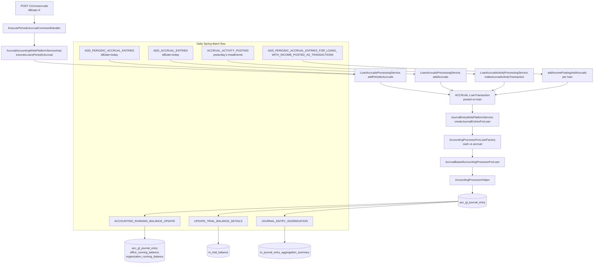

Cash-based accounting in Apache Fineract is simple: every loan or savings transaction emits a balanced journal entry the instant it is posted. Accrual-based accounting is harder — interest, fees, and penalties have to be *accrued* on the income side at the moment the underlying obligation is recognised, even if no cash has changed hands, and the offsetting receivable balance has to be debited. Posting that accrual transaction has to happen reliably, idempotently, and on a schedule, for every loan in the portfolio.

The accrual subsystem solves this with a small REST API (`/v1/runaccruals`) for on-demand execution and a family of Spring Batch jobs that run nightly. A handful of supplementary jobs maintain denormalised data structures the rest of the platform reads from: the running balance per GL account per office and the daily trial balance.

This page covers the `accrual/` package and the five accounting-side jobs declared in `JobName`:

```java fineract-core/.../infrastructure/jobs/service/JobName.java
ACCOUNTING_RUNNING_BALANCE_UPDATE("Update Accounting Running Balances"),
ADD_ACCRUAL_ENTRIES("Add Accrual Transactions"),
ADD_PERIODIC_ACCRUAL_ENTRIES("Add Periodic Accrual Transactions"),
ADD_PERIODIC_ACCRUAL_ENTRIES_FOR_LOANS_WITH_INCOME_POSTED_AS_TRANSACTIONS("..."),
ACCRUAL_ACTIVITY_POSTING("Accrual Activity Posting"),
UPDATE_TRIAL_BALANCE_DETAILS("Update Trial Balance Details"),
```

Plus the related `JOURNAL_ENTRY_AGGREGATION` covered in `accounting/journal-entries.mdx`.

## The /v1/runaccruals REST endpoint

`fineract-accounting/.../accrual/api/AccrualAccountingApiResource.java`:

```java accounting/accrual/api/AccrualAccountingApiResource.java
@Path("/v1/runaccruals")
@Component
@Tag(name = "Periodic Accrual Accounting",
     description = "Periodic Accrual is to accrue the loan income till the specific date or till batch job scheduled time.\n")
@RequiredArgsConstructor
public class AccrualAccountingApiResource {

    private final PortfolioCommandSourceWritePlatformService commandsSourceWritePlatformService;
    private final DefaultToApiJsonSerializer<String> apiJsonSerializerService;

    @POST
    @Consumes({ MediaType.APPLICATION_JSON })
    @Produces({ MediaType.APPLICATION_JSON })
    @Operation(summary = "Executes Periodic Accrual Accounting",
        operationId = "executePeriodicAccrualAccounting", method = "POST",
        description = "Mandatory Fields\n\ntillDate\n")
    public CommandProcessingResult executePeriodicAccrualAccounting(
            AccrualAccountRequest accrualAccountRequest) {
        final CommandWrapper commandRequest = new CommandWrapperBuilder().excuteAccrualAccounting()
                .withJson(apiJsonSerializerService.serialize(accrualAccountRequest)).build();
        return commandsSourceWritePlatformService.logCommandSource(commandRequest);
    }
}
```

A single `POST /v1/runaccruals` with `{"tillDate":"01 March 2025","locale":"en","dateFormat":"dd MMMM yyyy"}` is enough. The constants live in `accounting/accrual/api/AccrualAccountingConstants.java`:

```java accounting/accrual/api/AccrualAccountingConstants.java
public static final String ACCRUE_TILL_PARAM_NAME = "tillDate";
public static final String LOCALE_PARAM_NAME = "locale";
public static final String DATE_FORMAT_PARAM_NAME = "dateFormat";

public static final String PERIODIC_ACCRUAL_ACCOUNTING_RESOURCE_NAME = "periodicaccrual";
public static final String PERIODIC_ACCRUAL_ACCOUNTING_EXECUTION_ERROR_CODE = "execution.failed";
```

The handler routes the command:

```java accounting/accrual/handler/ExecutePeriodicAccrualCommandHandler.java
@Service
@CommandType(entity = "PERIODICACCRUALACCOUNTING", action = "EXECUTE")
@RequiredArgsConstructor
public class ExecutePeriodicAccrualCommandHandler implements NewCommandSourceHandler {
    private final AccrualAccountingWritePlatformService writePlatformService;

    @Transactional
    @Override
    public CommandProcessingResult processCommand(final JsonCommand command) {
        return this.writePlatformService.executeLoansPeriodicAccrual(command);
    }
}
```

And the implementation in `fineract-provider/.../accrual/service/AccrualAccountingWritePlatformServiceImpl.java` delegates to `LoanAccrualsProcessingService`:

```java fineract-provider/.../accrual/service/AccrualAccountingWritePlatformServiceImpl.java
@Override
public CommandProcessingResult executeLoansPeriodicAccrual(JsonCommand command) {
    this.accountingDataValidator.validateLoanPeriodicAccrualData(command.json());
    LocalDate tillDate = command.localDateValueOfParameterNamed(ACCRUE_TILL_PARAM_NAME);
    try {
        this.loanAccrualsProcessingService.addPeriodicAccruals(tillDate);
    } catch (MultiException e) {
        // wraps and rethrows as PlatformApiDataValidationException("execution.failed", ...)
        ...
    }
    return CommandProcessingResult.empty();
}
```

`LoanAccrualsProcessingService` (in `fineract-loan/.../portfolio/loanaccount/service/`) iterates over loans needing accruals, computes the accrual amounts based on the schedule and the elapsed days, and posts the corresponding `LoanTransaction` of type `ACCRUAL`. The resulting transactions are then bridged to the accounting subsystem via `JournalEntryWritePlatformService.createJournalEntriesForLoan(...)`, which selects `AccrualBasedAccountingProcessorForLoan` (because the product's `AccountingRuleType` is `ACCRUAL_PERIODIC` or `ACCRUAL_UPFRONT`).

The processor produces balanced postings such as:

```text
DR  Interest Receivable      ← AccrualAccountsForLoan.INTEREST_RECEIVABLE (7)
    CR  Interest Income      ← AccrualAccountsForLoan.INTEREST_ON_LOANS (3)
DR  Fees Receivable          ← AccrualAccountsForLoan.FEES_RECEIVABLE (8)
    CR  Income from Fees     ← AccrualAccountsForLoan.INCOME_FROM_FEES (4)
DR  Penalties Receivable     ← AccrualAccountsForLoan.PENALTIES_RECEIVABLE (9)
    CR  Income from Penalties ← AccrualAccountsForLoan.INCOME_FROM_PENALTIES (5)
```

The mappings between buckets (e.g. `INTEREST_RECEIVABLE`) and real GL accounts come from `acc_product_mapping` rows — see `accounting/product-account-mapping.mdx`.

## Service contract

```java fineract-loan/.../portfolio/loanaccount/service/LoanAccrualsProcessingService.java
public interface LoanAccrualsProcessingService {

    void addPeriodicAccruals(@NonNull LocalDate tillDate) throws MultiException;
    void addPeriodicAccruals(@NonNull LocalDate tillDate, @NonNull Loan loan) throws MultiException;

    void addAccruals(@NonNull LocalDate tillDate) throws MultiException;

    void reprocessExistingAccruals(@NonNull Loan loan, boolean addEvent);
    void processAccrualsOnInterestRecalculation(@NonNull Loan loan,
            boolean isInterestRecalculationEnabled, boolean addJournal);

    void addIncomePostingAndAccruals(Long loanId) throws Exception;
    void processIncomePostingAndAccruals(@NonNull Loan loan, boolean addEvent);

    void processAccrualsOnLoanClosure(@NonNull Loan loan, boolean addJournal);
    void processAccrualsOnLoanForeClosure(@NonNull Loan loan, @NonNull LocalDate foreClosureDate, ...);
    ...
}
```

Two key methods drive the daily jobs:

- `addAccruals(tillDate)` — *upfront* accrual mode (`ACCRUAL_UPFRONT`): when a loan disburses, the full expected interest/fees/penalties for the entire schedule are accrued at once, and this method tops up any newly-disbursed loans through `tillDate`.
- `addPeriodicAccruals(tillDate)` — *periodic* accrual mode (`ACCRUAL_PERIODIC`): accrual amounts are recognised installment-by-installment, and this method generates one `ACCRUAL` loan transaction per installment whose due date has passed but has not yet been accrued.

## The Spring Batch jobs

### ADD_ACCRUAL_ENTRIES

`fineract-provider/.../portfolio/loanaccount/jobs/addaccrualentries/AddAccrualEntriesTasklet.java`:

```java AddAccrualEntriesTasklet.java
public class AddAccrualEntriesTasklet implements Tasklet {

    private final LoanAccrualsProcessingService loanAccrualsProcessingService;

    @Override
    public RepeatStatus execute(StepContribution contribution, ChunkContext chunkContext) throws Exception {
        try {
            addAccruals(DateUtils.getBusinessLocalDate());
        } catch (MultiException e) {
            throw new JobExecutionException(e);
        }
        return RepeatStatus.FINISHED;
    }

    private void addAccruals(final LocalDate tillDate) throws MultiException {
        loanAccrualsProcessingService.addAccruals(tillDate);
    }
}
```

This is the *upfront* accrual job. Run it for products with `accountingRuleType = ACCRUAL_UPFRONT`. The tasklet uses the current business date (from `DateUtils.getBusinessLocalDate()` — see `fineract-core` business-date docs) as the `tillDate`. Schedule it daily; in upfront mode each loan only needs accrual top-ups when newly disbursed.

### ADD_PERIODIC_ACCRUAL_ENTRIES

`fineract-loan/.../portfolio/loanaccount/jobs/addperiodicaccrualentries/AddPeriodicAccrualEntriesTasklet.java`:

```java AddPeriodicAccrualEntriesTasklet.java
public class AddPeriodicAccrualEntriesTasklet implements Tasklet {

    private final LoanAccrualsProcessingService loanAccrualsProcessingService;

    @Override
    public RepeatStatus execute(StepContribution contribution, ChunkContext chunkContext) throws Exception {
        try {
            addPeriodicAccruals(DateUtils.getBusinessLocalDate());
        } catch (MultiException e) {
            throw new JobExecutionException(e);
        }
        return RepeatStatus.FINISHED;
    }

    private void addPeriodicAccruals(final LocalDate tilldate) throws MultiException {
        loanAccrualsProcessingService.addPeriodicAccruals(tilldate);
    }
}
```

The *periodic* counterpart, the equivalent of calling `POST /v1/runaccruals` with `tillDate = today`. Schedule it nightly; for products with `ACCRUAL_PERIODIC` accounting it is the canonical way to keep the receivables current.

### ADD_PERIODIC_ACCRUAL_ENTRIES_FOR_LOANS_WITH_INCOME_POSTED_AS_TRANSACTIONS

`fineract-provider/.../portfolio/loanaccount/jobs/addperiodicaccrualentriesforloanswithincomepostedastransactions/AddPeriodicAccrualEntriesForLoansTasklet.java`:

```java AddPeriodicAccrualEntriesForLoansTasklet.java
public class AddPeriodicAccrualEntriesForLoansTasklet implements Tasklet {

    private final LoanReadPlatformService loanReadPlatformService;
    private final LoanAccrualsProcessingService loanAccrualsProcessingService;

    @Override
    public RepeatStatus execute(StepContribution contribution, ChunkContext chunkContext) throws Exception {
        Collection<Long> loanIds = loanReadPlatformService.retrieveLoanIdsWithPendingIncomePostingTransactions();
        if (!CollectionUtils.isEmpty(loanIds)) {
            for (Long loanId : loanIds) {
                try {
                    loanAccrualsProcessingService.addIncomePostingAndAccruals(loanId);
                } catch (Exception e) {
                    errors.add(e);
                }
            }
            ...
        }
        return RepeatStatus.FINISHED;
    }
}
```

This variant is for the "income posted as transactions" accounting style — used for products where interest income is realised as a portfolio transaction (e.g., capitalised interest) rather than being directly accrued into income. The tasklet asks the loan read service for ids of loans with pending income postings and processes them one by one, collecting per-loan errors and aggregating them into a single `MultiException` rather than failing the whole job.

### ACCRUAL_ACTIVITY_POSTING

`fineract-provider/.../portfolio/loanaccount/jobs/accrualactivityposting/AccrualActivityPostingTasklet.java`:

```java AccrualActivityPostingTasklet.java
public class AccrualActivityPostingTasklet implements Tasklet {

    private final LoanAccrualActivityProcessingService loanAccrualActivityProcessingService;
    private final LoanAccrualActivityRepository loanAccrualActivityRepository;

    @Override
    public RepeatStatus execute(StepContribution contribution, ChunkContext chunkContext) throws Exception {
        final LocalDate yesterday = DateUtils.getBusinessLocalDate().minusDays(1);
        Set<Long> loanAccounts = loanAccrualActivityRepository
            .fetchLoanIdsForAccrualActivityPosting(yesterday,
                LoanTransactionType.ACCRUAL_ACTIVITY, LoanStatus.ACTIVE);
        for (Long accountId : loanAccounts) {
            try {
                loanAccrualActivityProcessingService.makeAccrualActivityTransaction(accountId, yesterday);
            } catch (Exception e) { ... }
        }
        ...
    }
}
```

This posts the `ACCRUAL_ACTIVITY` loan transaction type on installment due-dates. It runs daily, computes the previous business day (`yesterday`), fetches active loans whose schedule needs an accrual-activity entry for that date, and posts the transaction. The associated COB business step `AccrualActivityPostingBusinessStep` (`fineract-provider/.../cob/loan/AccrualActivityPostingBusinessStep.java`) is the *per-loan* hook used by the COB engine; this Spring Batch job is the *bulk* equivalent for tenants that don't run the loan-COB pipeline.

### ACCOUNTING_RUNNING_BALANCE_UPDATE

`fineract-provider/.../accounting/jobs/accountrunningbalanceupdate/AccountRunningBalanceUpdateTasklet.java`:

```java AccountRunningBalanceUpdateTasklet.java
public class AccountRunningBalanceUpdateTasklet implements Tasklet {

    private final JournalEntryRunningBalanceUpdateService journalEntryRunningBalanceUpdateService;

    @Override
    public RepeatStatus execute(StepContribution contribution, ChunkContext chunkContext) throws Exception {
        journalEntryRunningBalanceUpdateService.updateRunningBalance();
        return RepeatStatus.FINISHED;
    }
}
```

The interesting code is in `JournalEntryRunningBalanceUpdateServiceImpl`:

```java accounting/journalentry/service/JournalEntryRunningBalanceUpdateServiceImpl.java
@Override
public void updateRunningBalance() {
    String dateFinder = "select MIN(je.entry_date) as entityDate from acc_gl_journal_entry je "
                      + "where je.is_running_balance_calculated=false ";
    try {
        LocalDate entityDate = this.jdbcTemplate.queryForObject(dateFinder, LocalDate.class);
        updateOrganizationRunningBalance(entityDate);
    } catch (EmptyResultDataAccessException e) {
        log.debug("No results found for updation of running balance ");
    }
}
```

It finds the earliest `entry_date` that has unprocessed rows (`is_running_balance_calculated=false`), then walks forward through every journal entry, accumulating per-account and per-account-per-office running totals into two columns: `organization_running_balance` and `office_running_balance`. The same service also implements `updateOfficeRunningBalance(JsonCommand)` (the manual `POST /v1/journalentries?command=updateRunningBalance` path) which only re-balances a single office.

Schedule this job after the daily accrual jobs so the running balances reflect the freshly posted accruals.

### UPDATE_TRIAL_BALANCE_DETAILS

The trial-balance materialisation job is configured in `fineract-accounting/.../glaccount/jobs/updatetrialbalancedetails/`. See `accounting/trial-balance.mdx` for the full breakdown — at a glance:

```java accounting/glaccount/jobs/updatetrialbalancedetails/UpdateTrialBalanceDetailsTasklet.java
@Override
public RepeatStatus execute(StepContribution contribution, ChunkContext chunkContext) throws Exception {
    final JdbcTemplate jdbcTemplate = new JdbcTemplate(
        dataSourceServiceFactory.determineDataSourceService().retrieveDataSource());
    processTrialBalanceGaps(jdbcTemplate);
    updateClosingBalances(jdbcTemplate);
    return RepeatStatus.FINISHED;
}
```

It (a) inserts missing per-day trial-balance rows for any transaction date past the last-aggregated date, then (b) walks each `(office_id, account_id)` pair to backfill the `closing_balance` column.

## End-to-end accrual flow



## Scheduling guidance

A typical nightly batch order:

```text
1. ADD_PERIODIC_ACCRUAL_ENTRIES (or ADD_ACCRUAL_ENTRIES for upfront products)
2. ADD_PERIODIC_ACCRUAL_ENTRIES_FOR_LOANS_WITH_INCOME_POSTED_AS_TRANSACTIONS
3. ACCRUAL_ACTIVITY_POSTING
4. GENERATE_LOANLOSS_PROVISIONING            (see accounting/provisioning-entries.mdx)
5. ACCOUNTING_RUNNING_BALANCE_UPDATE
6. UPDATE_TRIAL_BALANCE_DETAILS
7. JOURNAL_ENTRY_AGGREGATION                 (optional, if enabled)
```

Each job is idempotent in the same business day — running them twice produces no double-postings because:

- Accrual processing checks the latest accrued installment per loan before posting.
- Running-balance updates only touch rows with `is_running_balance_calculated = false`.
- Trial-balance gaps are detected from the max `created_date` watermark.
- Journal-entry aggregation has the dedicated `JournalEntryAggregationJobExecutionDecider` that no-ops when the date window has already been aggregated.

## Tables and columns touched

| Table                              | Job                                                 | Column / row updates                               |
|------------------------------------|-----------------------------------------------------|----------------------------------------------------|
| `m_loan_transaction`               | ADD_*ACCRUAL_ENTRIES, ACCRUAL_ACTIVITY_POSTING      | New `ACCRUAL` / `ACCRUAL_ACTIVITY` rows            |
| `acc_gl_journal_entry`             | All accrual jobs (via the bridge)                   | New balanced rows tied to those transactions       |
| `acc_gl_journal_entry`             | ACCOUNTING_RUNNING_BALANCE_UPDATE                   | `office_running_balance`, `organization_running_balance`, `is_running_balance_calculated` |
| `m_trial_balance`                  | UPDATE_TRIAL_BALANCE_DETAILS                        | New per-day rows, then `closing_balance` backfill  |
| `m_journal_entry_aggregation_summary` | JOURNAL_ENTRY_AGGREGATION                       | Pre-aggregated daily debit/credit totals           |
| `m_journal_entry_aggregation_tracking` | JOURNAL_ENTRY_AGGREGATION                      | Tracking of which date windows have run            |

## Failure handling

- Per-loan failures in the bulk tasklets (`ADD_PERIODIC_ACCRUAL_ENTRIES_FOR_LOANS_WITH_INCOME_POSTED_AS_TRANSACTIONS`, `ACCRUAL_ACTIVITY_POSTING`) are collected into a `List<Throwable>` and wrapped in `MultiException`/`JobExecutionException` at the end of the run, so one bad loan does not stop the rest. The Spring Batch step is marked `FAILED` but the partial work is committed.
- The `/v1/runaccruals` REST path catches `MultiException` from the same service and turns it into a `PlatformApiDataValidationException` with code `execution.failed` (constant `PERIODIC_ACCRUAL_ACCOUNTING_EXECUTION_ERROR_CODE`).
- The `ACCOUNTING_RUNNING_BALANCE_UPDATE` tasklet swallows `EmptyResultDataAccessException` ("no entries to process") and exits cleanly.

For the actual posting of journal entries from the bridge see `accounting/journal-entries.mdx`. For the GL-account/closure mechanics underneath see `accounting/gl-accounts-and-closures.mdx`. For the trial-balance materialisation specifically see `accounting/trial-balance.mdx`.
