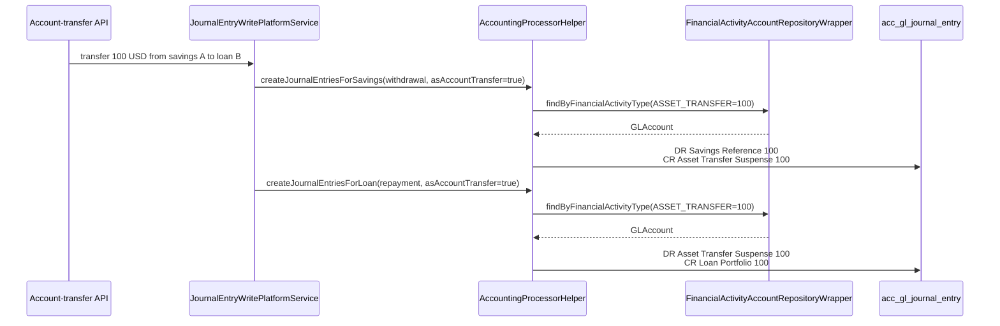
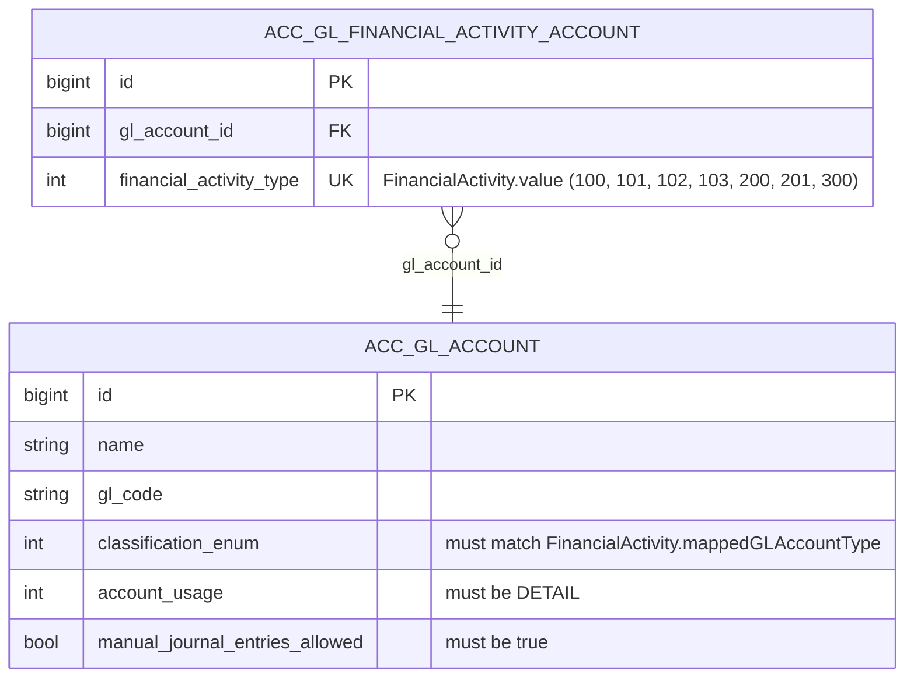

Apache Fineract uses `ProductToGLAccountMapping` for *product-scoped* GL bindings — every loan or savings product has its own fund-source, portfolio control, interest-income, fee-income, and so on. But some accounting bindings are not product-scoped: they apply to the whole organisation. When a savings-to-loan account transfer fires, the platform needs to know which suspense account to use *for the tenant*, not for each product separately. When a teller hands cash to the main vault, the cash-at-teller and cash-at-vault accounts are organisation-level. When the institution declares a dividend, the payable-dividends liability account is organisation-level too.

The `FinancialActivityAccount` entity and the `/v1/financialactivityaccounts` REST resource implement this organisation-level mapping. Code lives entirely in `fineract-accounting/src/main/java/org/apache/fineract/accounting/financialactivityaccount/`.

## The FinancialActivity enum

The list of activities that can be mapped is defined in `AccountingConstants.FinancialActivity` (`fineract-core/src/main/java/org/apache/fineract/accounting/common/AccountingConstants.java`):

```java accounting/common/AccountingConstants.java
public enum FinancialActivity {

    ASSET_TRANSFER(100, "assetTransfer", GLAccountType.ASSET),
    LIABILITY_TRANSFER(200, "liabilityTransfer", GLAccountType.LIABILITY),
    CASH_AT_MAINVAULT(101, "cashAtMainVault", GLAccountType.ASSET),
    CASH_AT_TELLER(102, "cashAtTeller", GLAccountType.ASSET),
    OPENING_BALANCES_TRANSFER_CONTRA(300, "openingBalancesTransferContra", GLAccountType.EQUITY),
    ASSET_FUND_SOURCE(103, "fundSource", GLAccountType.ASSET),
    PAYABLE_DIVIDENDS(201, "payableDividends", GLAccountType.LIABILITY);

    private final Integer value;
    private final String code;
    private final GLAccountType mappedGLAccountType;
    ...
}
```

Each constant declares three things: its integer id (persisted in `financial_activity_type`), its API code (the string the JSON uses on read), and the `GLAccountType` it must be bound to (so the validator can reject a payable-dividends mapping pointing at an asset account, for example).

The seven activities cover the four broad scenarios Fineract supports natively:

| Family                            | Activity                                   | Bound type | Used for                                                                                             |
|-----------------------------------|--------------------------------------------|------------|------------------------------------------------------------------------------------------------------|
| Inter-account transfers           | `ASSET_TRANSFER` (100)                     | ASSET      | Savings-to-loan, loan-to-savings, savings-to-savings transfers (the asset-side suspense).            |
|                                   | `LIABILITY_TRANSFER` (200)                 | LIABILITY  | Same family, when the source/destination is a liability-side savings account.                        |
| Teller / vault cash               | `CASH_AT_MAINVAULT` (101)                  | ASSET      | Main-vault cash account for inter-teller / teller-to-vault transfers.                                |
|                                   | `CASH_AT_TELLER` (102)                     | ASSET      | Per-teller cash account.                                                                             |
| Opening balances                  | `OPENING_BALANCES_TRANSFER_CONTRA` (300)   | EQUITY     | The single equity-side contra account used when an office's opening balances are first established.  |
| Fund source fallback              | `ASSET_FUND_SOURCE` (103)                  | ASSET      | Organisation-wide default fund source when neither product nor payment-type mapping resolves.        |
| Dividends                         | `PAYABLE_DIVIDENDS` (201)                  | LIABILITY  | Share-account dividend declaration.                                                                  |

Within the `FinancialActivity` enum, two static caches expose:

```java accounting/common/AccountingConstants.java
public static FinancialActivity fromInt(final int financialActivityId);
public static FinancialActivityData toFinancialActivityData(final int financialActivityId);
public static List<FinancialActivityData> getAllFinancialActivities();
```

`getAllFinancialActivities()` is what the `/v1/financialactivityaccounts/template` endpoint returns as the dropdown values for the New Mapping form.

## The FinancialActivityAccount entity

```java accounting/financialactivityaccount/domain/FinancialActivityAccount.java
@Entity
@Table(name = "acc_gl_financial_activity_account")
@NoArgsConstructor(access = AccessLevel.PROTECTED)
@AllArgsConstructor
@Getter
public class FinancialActivityAccount extends AbstractPersistableCustom<Long> {

    @ManyToOne(fetch = FetchType.EAGER)
    @JoinColumn(name = "gl_account_id")
    private GLAccount glAccount;

    @Column(name = "financial_activity_type", nullable = false)
    private Integer financialActivityType;

    public static FinancialActivityAccount createNew(final GLAccount glAccount,
                                                     final Integer financialAccountType) {
        return new FinancialActivityAccount(glAccount, financialAccountType);
    }

    public void updateGlAccount(final GLAccount glAccount)        { this.glAccount = glAccount; }
    public void updateFinancialActivityType(final Integer t)      { this.financialActivityType = t; }
}
```

It is a minimal two-column table `acc_gl_financial_activity_account` with a unique `financial_activity_type` (only one row per activity) and a foreign-key to `acc_gl_account`. The `EAGER` fetch on `glAccount` matters — every lookup of an activity mapping immediately materialises the bound GL account, because the calling processor needs both.

## Repository wrapper

```java accounting/financialactivityaccount/domain/FinancialActivityAccountRepositoryWrapper.java   (illustrative)
public FinancialActivityAccount findOneWithNotFoundDetection(Long id);
public FinancialActivityAccount findByFinancialActivityTypeWithNotFoundDetection(int activity);
public FinancialActivityAccount findByFinancialActivityType(int activity);
```

The `findByFinancialActivityType` returns null when no mapping is configured — most processors call this and gracefully fall back when the org has not set the activity up. `*WithNotFoundDetection` throws `FinancialActivityAccountNotFoundException` and is reserved for the read/update endpoints that explicitly require the mapping to exist.

## REST: FinancialActivityAccountsApiResource

Mounted at `/v1/financialactivityaccounts` (`fineract-accounting/.../financialactivityaccount/api/FinancialActivityAccountsApiResource.java`):

| Method  | Path                                          | Operation                                                                                  |
|---------|-----------------------------------------------|--------------------------------------------------------------------------------------------|
| `GET`   | `/v1/financialactivityaccounts/template`      | Dropdown values: the seven `FinancialActivity` values plus the list of postable GL accounts. |
| `GET`   | `/v1/financialactivityaccounts`               | List existing mappings.                                                                    |
| `GET`   | `/v1/financialactivityaccounts/{mappingId}`   | Retrieve one; `?template=true` augments with allowed dropdown values.                       |
| `POST`  | `/v1/financialactivityaccounts`               | Create — mandatory `financialActivityId` (the integer value), `glAccountId`.                |
| `PUT`   | `/v1/financialactivityaccounts/{mappingId}`   | Update one. Either the activity or the GL account can be re-pointed.                        |
| `DELETE`| `/v1/financialactivityaccounts/{mappingId}`   | Delete one (no posting consults this activity afterwards).                                  |

The OpenAPI tag in the source captures the intent precisely:

```java accounting/financialactivityaccount/api/FinancialActivityAccountsApiResource.java
@Tag(name = "Mapping Financial Activities to Accounts", description = """
        Organization Level Financial Activities like Asset and Liability Transfer can be mapped to GL Account.
        Integrated accounting takes these accounts into consideration when an Account transfer is made between
        a savings to loan/savings account and vice-versa
        ...""")
```

The write path uses `CommandWrapperBuilder().createOfficeToGLAccountMapping()` / `updateOfficeToGLAccountMapping(id)` / `deleteOfficeToGLAccountMapping(id)` — the command verb is "officeToGLAccountMapping" for legacy reasons even though the mapping is now organisation-wide rather than per-office.

### Validator

`FinancialActivityAccountDataValidator` (`accounting/financialactivityaccount/serialization/`) checks:

- `financialActivityId` is required and must be one of the `FinancialActivity.value`s.
- `glAccountId` is required.
- The resolved `GLAccount` must have `usage = DETAIL` and `manualEntriesAllowed = true`.
- The `GLAccount.classification_enum` must match the `FinancialActivity.mappedGLAccountType` (e.g. `PAYABLE_DIVIDENDS` requires a LIABILITY account).
- No existing row already exists for the same `financialActivityType` — the unique constraint is enforced before save.

Failed validation produces `FinancialActivityAccountInvalidException` (in `accounting/financialactivityaccount/exception/`) with an error code that the global mapper turns into a 400.

### Write service

`FinancialActivityAccountWritePlatformServiceImpl` (`accounting/financialactivityaccount/service/`):

```java FinancialActivityAccountWritePlatformServiceImpl.java   (illustrative)
@Override
public CommandProcessingResult createGLAccount(final JsonCommand command) {
    this.validator.validateForCreate(command.json());
    final Long glAccountId = command.longValueOfParameterNamed("glAccountId");
    final int activity = command.integerValueSansLocaleOfParameterNamed("financialActivityId");
    final GLAccount glAccount = glAccountRepository.findOneWithNotFoundDetection(glAccountId);
    final FinancialActivityAccount entity = FinancialActivityAccount.createNew(glAccount, activity);
    repository.save(entity);
    return CommandProcessingResultBuilder.withId(entity.getId()).build();
}
```

Updates use `updateGlAccount` / `updateFinancialActivityType` on the entity (the entity provides setters specifically so the helper can mutate state controlled by the validator).

### Read service

`FinancialActivityAccountReadPlatformServiceImpl` is a simple JDBC fetch with `JOIN m_office_to_gl_account_mapping`'s sibling table. Each row's `FinancialActivityData` carries the activity description (e.g. `assetTransfer`) and the `GLAccountData` summary.

## Resolution at posting time

A typical posting flow that consults `FinancialActivityAccount`:

### Account transfer

When a savings-to-loan transfer fires, the savings withdrawal side debits the savings account and credits an *asset transfer suspense* (so the receipt side can balance against it):



Both sides see the same suspense GL account and balance out at the organisation level.

### Cash at teller / vault

The teller/vault inter-account movement uses `CASH_AT_TELLER` (102) and `CASH_AT_MAINVAULT` (101) as the asset accounts for the two locations. Without these mappings the `teller` module cannot post a vault deposit.

### Opening balance contra

When `POST /v1/journalentries?command=defineOpeningBalance` runs, every asset/expense GL gets debited and every liability/equity/income GL gets credited as of the office's opening date, all against the single `OPENING_BALANCES_TRANSFER_CONTRA` equity account. Without that mapping the opening-balance endpoint cannot produce a balanced set.

### Payable dividends

When a share-product dividend is declared via `POST /v1/products/share/{productId}/dividend`, the resulting liability is booked against the `PAYABLE_DIVIDENDS` GL account.

## Entity-relationship view



## Example payloads

### Map asset transfer

```json
{
  "financialActivityId": 100,
  "glAccountId": 43
}
```

### Map opening balances contra

```json
{
  "financialActivityId": 300,
  "glAccountId": 91
}
```

### Update an existing mapping

```json PUT /v1/financialactivityaccounts/3
{
  "glAccountId": 92
}
```

## Permissions

```text
READ_FINANCIALACTIVITYACCOUNT
CREATE_FINANCIALACTIVITYACCOUNT, CREATE_FINANCIALACTIVITYACCOUNT_CHECKER
UPDATE_FINANCIALACTIVITYACCOUNT, UPDATE_FINANCIALACTIVITYACCOUNT_CHECKER
DELETE_FINANCIALACTIVITYACCOUNT, DELETE_FINANCIALACTIVITYACCOUNT_CHECKER
```

## Operational notes

- **Unique per activity**: the table allows at most one row per `financial_activity_type`. If you want to swap an activity to a different GL account, PUT against the existing mapping; do not POST a new one (the unique constraint will reject the duplicate).
- **Validator-time GL-type check**: the validator hard-rejects an asset GL being bound to `LIABILITY_TRANSFER` or vice versa. If you change a GL account's type after creating the mapping the *update* path will fail when you try to re-save; older entries continue to post against the historical mapping until you fix it.
- **Hidden vs missing**: a missing mapping is not the same as a missing setting — the processors call `findByFinancialActivityType(...)` (which returns null) and either fall through (`ASSET_FUND_SOURCE`) or raise `FinancialActivityAccountNotFoundException` (`CASH_AT_TELLER` during a teller deposit). The intent: optional fallbacks vs hard prerequisites.
- **Backstop for product mapping**: when `AccountingProcessorHelper` cannot find a `ProductToGLAccountMapping` for `FUND_SOURCE`, it falls back to `FinancialActivityAccount` with `ASSET_FUND_SOURCE` (103). This lets a tenant skip configuring fund source on every individual product as long as the org-level fallback is in place.
- **Audit**: each create/update/delete is logged as a `m_portfolio_command_source` row so maker-checker works the same way as for `GLAccount` or `JournalEntry`.

For how product-level mappings layer on top of these org-level ones see `accounting/product-account-mapping.mdx`. For the inter-account transfer flows that actually consume `ASSET_TRANSFER` and `LIABILITY_TRANSFER` see the savings and loans portfolio docs (`portfolio/`).
