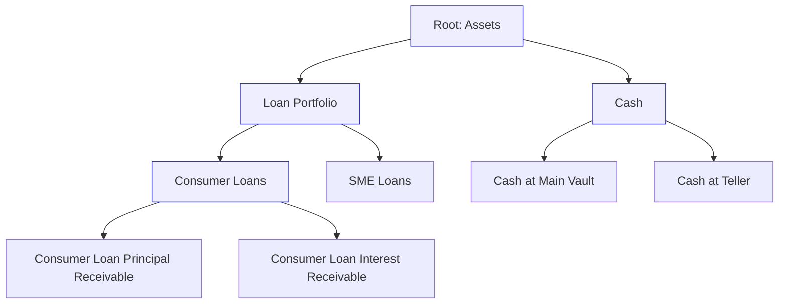
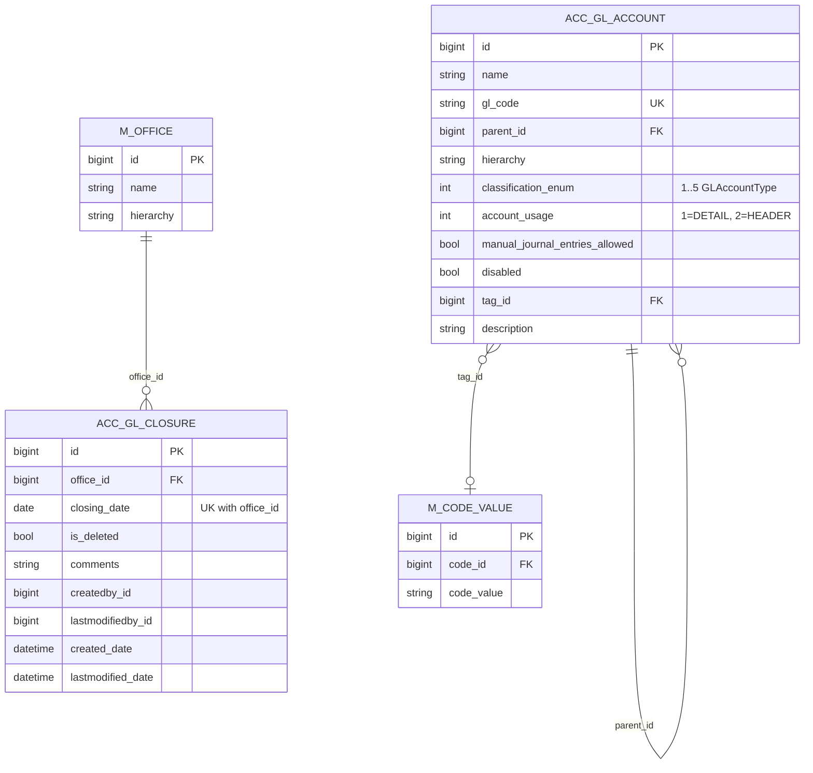

The Apache Fineract accounting subsystem is built around two foundational entities: `GLAccount` — the chart-of-accounts node — and `GLClosure` — the period-close record that freezes the journal as of a given date per office. Everything else in the accounting code (`JournalEntry`, `AccountingRule`, `ProductToGLAccountMapping`, `FinancialActivityAccount`, `TrialBalance`, the provisioning entries, the accrual jobs) ultimately points at a `GLAccount`, and almost every write path consults `GLClosure` before persisting to make sure it is not posting into a closed period.

Both entities live in `fineract-accounting/src/main/java/org/apache/fineract/accounting/` (with `GLAccount` actually placed in `fineract-core/src/main/java/org/apache/fineract/accounting/glaccount/domain/` so the loan and savings modules can reference it without pulling the full accounting module). They are exposed by two REST resources mounted at `/v1/glaccounts` and `/v1/glclosures`.

## GLAccount — the chart of accounts

### Entity

`GLAccount` is the single source of truth for every postable (or grouping) ledger node. It maps the `acc_gl_account` table:

```java fineract-core/.../glaccount/domain/GLAccount.java
@Entity
@Table(name = "acc_gl_account", uniqueConstraints = {
        @UniqueConstraint(columnNames = { "gl_code" }, name = "acc_gl_code") })
public class GLAccount extends AbstractPersistableCustom<Long> {

    @ManyToOne(fetch = FetchType.LAZY)
    @JoinColumn(name = "parent_id")
    private GLAccount parent;

    @Column(name = "hierarchy", nullable = true, length = 50)
    private String hierarchy;

    @OneToMany(fetch = FetchType.LAZY)
    @JoinColumn(name = "parent_id")
    private List<GLAccount> children = new ArrayList<>();

    @Column(name = "name", nullable = false, length = 45)
    private String name;

    @Column(name = "gl_code", nullable = false, length = 100)
    private String glCode;

    @Column(name = "disabled", nullable = false)
    private boolean disabled;

    @Column(name = "manual_journal_entries_allowed", nullable = false)
    private boolean manualEntriesAllowed = true;

    @Column(name = "classification_enum", nullable = false)
    private Integer type;          // GLAccountType ordinal

    @Column(name = "account_usage", nullable = false)
    private Integer usage;         // GLAccountUsage ordinal

    @Column(name = "description", nullable = true, length = 500)
    private String description;

    @ManyToOne(fetch = FetchType.LAZY)
    @JoinColumn(name = "tag_id")
    private CodeValue tagId;
    ...
}
```

Key invariants:

- **`gl_code` is unique** (enforced both by the JPA `@UniqueConstraint` and by a unique DB index named `acc_gl_code`). Every external system or import integrating with Fineract identifies a ledger account by its code.
- **`type` is the `GLAccountType` ordinal** (1=ASSET, 2=LIABILITY, 3=EQUITY, 4=INCOME, 5=EXPENSE). It is materialised as an integer rather than a string so old enum migrations are stable. See `fineract-core/src/main/java/org/apache/fineract/accounting/glaccount/domain/GLAccountType.java`.
- **`usage` is the `GLAccountUsage` ordinal** — `DETAIL` (1, postable leaf) or `HEADER` (2, grouping node). Manual entries against a HEADER account are rejected.
- **`manualEntriesAllowed`** lets you create system-managed accounts (e.g. an interest-receivable account driven only by accrual jobs) that humans cannot touch.
- **`hierarchy`** is a denormalised path string (e.g. `.1.4.18.`) of the ancestor chain. It lets the read service produce a fully ordered tree without recursive SQL and lets the validator check whether two accounts share an ancestor.
- **`tagId`** is a `CodeValue` reference into the `m_code_value` codes registry. Each `GLAccountType` has a paired code (`AssetAccountTags`, `LiabilityAccountTags`, …) so a tenant can sub-classify accounts.

Construction goes through the static factory `GLAccount.fromJson(parent, command, glAccountTagType)` which pulls every input parameter from `JsonCommand` using the names defined in `accounting/glaccount/api/GLAccountJsonInputParams.java` (`name`, `glCode`, `parentId`, `type`, `usage`, `manualEntriesAllowed`, `disabled`, `description`, `tagId`). Updates go through `GLAccount.update(JsonCommand)` which returns the map of actual changes for the audit log.

### Repository

`GLAccountRepository` (Spring Data `JpaRepository`) and `GLAccountRepositoryWrapper` are in `fineract-core/.../glaccount/domain/`. The wrapper adds `findOneWithNotFoundDetection(Long id)` which throws `GLAccountNotFoundException` — the platform convention so the global exception mapper can turn a missing account into a clean 404.

### Type enum

```java fineract-core/.../glaccount/domain/GLAccountType.java
public enum GLAccountType {
    ASSET(1, "accountType.asset"),
    LIABILITY(2, "accountType.liability"),
    EQUITY(3, "accountType.equity"),
    INCOME(4, "accountType.income"),
    EXPENSE(5, "accountType.expense");
    ...
    public boolean isAssetType()     { return this.value.equals(ASSET.getValue()); }
    public boolean isLiabilityType() { return this.value.equals(LIABILITY.getValue()); }
    public boolean isEquityType()    { return this.value.equals(EQUITY.getValue()); }
    public boolean isIncomeType()    { return this.value.equals(INCOME.getValue()); }
    public boolean isExpenseType()   { return this.value.equals(EXPENSE.getValue()); }
}
```

The `fromInt(Integer)` factory is used by every JDBC `RowMapper` to lift the persisted integer back into an enum. The processors call the predicate methods (`isAssetType()` and friends) when deciding whether a debit or credit increases the running balance for a particular account.

### Usage enum

```java fineract-core/.../glaccount/domain/GLAccountUsage.java
public enum GLAccountUsage {
    DETAIL(1, "accountUsage.detail"),
    HEADER(2, "accountUsage.header");
    ...
}
```

`HEADER` accounts cannot receive postings — they exist purely to group their `DETAIL` children in the tree the UI renders.

### Hierarchy

The `parent` / `children` self-references combined with the `hierarchy` string materialise a chart of accounts that can be arbitrarily deep:



Where `A`, `B`, `C`, `D` are `HEADER` accounts and `F`, `G`, `H`, `I` are `DETAIL` accounts whose `glCode` would be referenced from `ProductToGLAccountMapping` or `FinancialActivityAccount`.

## GLAccountsApiResource — REST surface

Mounted at `/v1/glaccounts`, the `GLAccountsApiResource` (`fineract-accounting/.../glaccount/api/GLAccountsApiResource.java`) exposes:

| Method  | Path                                | Operation                                                |
|---------|-------------------------------------|----------------------------------------------------------|
| `GET`   | `/v1/glaccounts/template`           | Defaults + allowed-values for the New Account form. Accepts `?type=1..5` to filter the parent-account dropdown to a single classification. |
| `GET`   | `/v1/glaccounts`                    | List, with filters `type`, `searchParam`, `usage`, `manualEntriesAllowed`, `disabled`. |
| `GET`   | `/v1/glaccounts/{glAccountId}`      | Retrieve one account, optionally with running balance (`?runningBalance=true`). |
| `POST`  | `/v1/glaccounts`                    | Create — dispatches `createGLAccount` command. |
| `PUT`   | `/v1/glaccounts/{glAccountId}`      | Update — dispatches `updateGLAccount` command. |
| `DELETE`| `/v1/glaccounts/{glAccountId}`      | Delete (only when no journal entries reference the account). |
| `GET`   | `/v1/glaccounts/downloadtemplate`   | Excel bulk-import template. |
| `POST`  | `/v1/glaccounts/uploadtemplate`     | Multipart upload of completed template (forwarded to `BulkImportWorkbookService`). |

The constant `RESOURCE_NAME_FOR_PERMISSION = "GLACCOUNT"` ties each method into the role-based permission system; the typical permissions are `READ_GLACCOUNT`, `CREATE_GLACCOUNT`, `UPDATE_GLACCOUNT`, and `DELETE_GLACCOUNT` (the suffix `_CHECKER` and `_MAKER_CHECKER` variants are added by the maker-checker subsystem).

Writes go through `PortfolioCommandSourceWritePlatformService` (logged into the `m_portfolio_command_source` audit table) and then to the corresponding handler under `accounting/glaccount/handler/` (e.g. `CreateGLAccountCommandHandler`, `UpdateGLAccountCommandHandler`, `DeleteGLAccountCommandHandler`), which delegate to `GLAccountWritePlatformService`.

### Validator

`accounting/glaccount/serialization/GLAccountCommandFromApiJsonDeserializer.java` does the JSON-level validation:

- `name`, `glCode`, `type`, `usage` are mandatory on create.
- `type` must be 1..5.
- `usage` must be 1..2.
- `name` ≤ 45 chars; `glCode` ≤ 100 chars; `description` ≤ 500 chars.
- A `HEADER` account cannot be created under a `DETAIL` parent (enforced inside the write service when the parent is resolved).

### Write service

`GLAccountWritePlatformServiceJpaRepositoryImpl` (under `accounting/glaccount/service/`) calls `GLAccount.fromJson(...)`, persists, then re-reads to populate the `hierarchy` string (`<parent.hierarchy><id>.`). On update it walks the hierarchy to maintain consistency if the `parent_id` changes.

### Read service

`GLAccountReadPlatformServiceImpl` (same package) drives the list and the running-balance queries via raw JDBC + `RowMapper`. Running balance is computed by joining `acc_gl_account` against `acc_gl_journal_entry` aggregated per office.

## GLClosure — period close

### Entity

A `GLClosure` is a per-office, per-date marker that says: "no journal entries with a `transactionDate <= closingDate` may be created or reversed for this office from this point on." It maps `acc_gl_closure`:

```java accounting/closure/domain/GLClosure.java
@Entity
@Table(name = "acc_gl_closure", uniqueConstraints = {
        @UniqueConstraint(columnNames = { "office_id", "closing_date" },
                          name = "office_id_closing_date") })
public class GLClosure extends AbstractAuditableCustom {

    @ManyToOne
    @JoinColumn(name = "office_id", nullable = false)
    private Office office;

    @Column(name = "is_deleted", nullable = false)
    private boolean deleted = true;

    @Column(name = "closing_date")
    private LocalDate closingDate;

    @Column(name = "comments", nullable = true, length = 500)
    private String comments;
    ...
}
```

Notes:

- Closure rows are scoped to an `Office` (`office_id` is mandatory). Different branches close on different schedules.
- The `(office_id, closing_date)` pair is unique — you cannot close the same office twice for the same date.
- `is_deleted` is a soft-delete flag. The `DELETE /v1/glclosures/{id}` endpoint sets it true rather than removing the row, so the closure history is preserved.
- The constructor seeds `deleted = false` when a closure is actually created; the no-args constructor sets `deleted = true` (defensive default for JPA reflection).

### Effect on writes

Every write path that touches `acc_gl_journal_entry` calls `GLClosureRepository.getLatestGLClosureByBranch(officeId)` and verifies that the transaction date is strictly after the latest non-deleted closure's `closingDate`. `JournalEntryWritePlatformServiceJpaRepositoryImpl` raises `JournalEntryInvalidException("error.msg.journalentry.invalid.closure.date", …)` if the check fails. The same check fires on reversals: you cannot reverse a journal entry that sat in a closed period, because the reversal would post into a closed period.

## GLClosuresApiResource — REST surface

Mounted at `/v1/glclosures`, the `GLClosuresApiResource` (`fineract-accounting/.../closure/api/GLClosuresApiResource.java`) exposes the closure CRUD:

| Method  | Path                              | Operation                                                                                  |
|---------|-----------------------------------|--------------------------------------------------------------------------------------------|
| `GET`   | `/v1/glclosures`                  | List, optionally filtered by `?officeId=`.                                                 |
| `GET`   | `/v1/glclosures/{glClosureId}`    | Retrieve one; `?template=true` augments the response with the list of allowed offices for dropdowns. |
| `POST`  | `/v1/glclosures`                  | Create — mandatory fields `officeId`, `closingDate`; optional `comments`, `locale`, `dateFormat`. Builds `GLClosure.fromJson(office, command)`. |
| `PUT`   | `/v1/glclosures/{glClosureId}`    | Update — only `comments` is editable post-creation; everything else returns an empty change set. |
| `DELETE`| `/v1/glclosures/{glClosureId}`    | Soft delete. Only the latest closure for an office may be deleted.                          |

The resource source confirms the "comments only" rule on update:

```java accounting/closure/api/GLClosuresApiResource.java
@Operation(summary = "Update an Accounting closure",
           description = "Once an accounting closure is created, only the comments associated with it may be edited")
```

`GLClosure.update(JsonCommand)` implements exactly that — the property update map only ever contains `comments`:

```java accounting/closure/domain/GLClosure.java
public Map<String, Object> update(final JsonCommand command) {
    final Map<String, Object> actualChanges = new LinkedHashMap<>(5);
    handlePropertyUpdate(command, actualChanges,
        GLClosureJsonInputParams.COMMENTS.getValue(), this.comments);
    return actualChanges;
}
```

### Validator & write service

`accounting/closure/serialization/GLClosureCommandFromApiJsonDeserializer.java` validates `officeId` (long, required), `closingDate` (local date, required), `comments` (≤500 chars).

`accounting/closure/service/GLClosureWritePlatformServiceJpaRepositoryImpl.java`:

- On create — resolves the `Office`, looks up the *latest* closure for the same office, and rejects the new request if its `closingDate` is not strictly greater than the existing one (closures must monotonically advance). It then verifies that no manual journal entry in the office is dated after `closingDate` but already exists for an office whose date is on/before the new closing date — i.e., the closure cannot be in the future of any unposted entry that has to be considered.
- On delete — only allows deleting the closure with the maximum `closingDate` for the office (otherwise prior reversals would corrupt the historical ledger).

### Read service

`GLClosureReadPlatformServiceImpl` joins `acc_gl_closure` with `m_office` to expose office name + closing date in the response payload.

## Entity-relationship view



## Permissions

The standard permission codes auto-created by the platform are:

```text
READ_GLACCOUNT
CREATE_GLACCOUNT, CREATE_GLACCOUNT_CHECKER
UPDATE_GLACCOUNT, UPDATE_GLACCOUNT_CHECKER
DELETE_GLACCOUNT, DELETE_GLACCOUNT_CHECKER

READ_GLCLOSURE
CREATE_GLCLOSURE, CREATE_GLCLOSURE_CHECKER
UPDATE_GLCLOSURE, UPDATE_GLCLOSURE_CHECKER
DELETE_GLCLOSURE, DELETE_GLCLOSURE_CHECKER
```

The `_CHECKER` variant allows the user to *approve* a maker-checker change after a different user with the non-checker permission submits it.

## Operational notes

- **Disabling vs deleting**: deleting a GL account is only possible while no journal entry references it. Once an account has been posted into, only `disabled = true` is allowed (set via PUT), which removes it from new dropdowns but keeps historical journal entries valid.
- **Reparenting**: changing `parentId` recomputes `hierarchy` for the account *and* every descendant — the write service updates the materialised path in one bulk update so the read tree stays consistent.
- **Bulk import**: `GET /v1/glaccounts/downloadtemplate` returns an Excel file generated by `GLAccountsBulkImportPopulator`; `POST /v1/glaccounts/uploadtemplate` ingests it through `BulkImportWorkbookService` and returns an import document id you can poll for status.
- **Running balance**: passing `?runningBalance=true` on the detail or list endpoints joins against `acc_gl_journal_entry` aggregated up to the request date to compute an as-of balance per account per office. This is a relatively expensive query — the dedicated `ACCOUNTING_RUNNING_BALANCE_UPDATE` job (covered in `accounting/accrual-engine.mdx`) materialises a denormalised running balance instead.
- **Closures and reversals**: because a closure blocks reversals into the period, the standard recovery from a missed transaction is to (a) delete the latest closure (if you are the maker), (b) post or reverse the entry, (c) recreate the closure. Multi-office banks therefore close branches independently to minimise the surface area for re-opens.

The next page — `accounting/journal-entries.mdx` — covers the `JournalEntry` rows that ultimately collect against these accounts.
