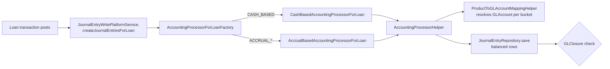
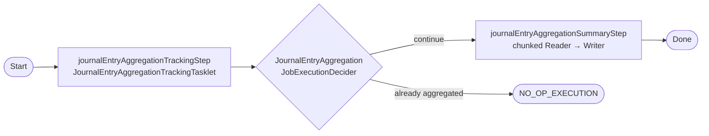

The Apache Fineract accounting subsystem records every GL-affecting movement as one or more rows in `acc_gl_journal_entry`. A single business transaction (loan disbursement, savings deposit, manual entry from the UI) is materialised as a *set* of `JournalEntry` rows sharing a `transactionId`, with the sum of `DEBIT` lines equal to the sum of `CREDIT` lines for each currency. This page covers the entity, the REST surface at `/v1/journalentries`, the posting service that the loan/savings processors call into, the reversal mechanics, and the `JOURNAL_ENTRY_AGGREGATION` Spring Batch job that materialises a daily summary table.

## JournalEntry entity

`fineract-accounting/src/main/java/org/apache/fineract/accounting/journalentry/domain/JournalEntry.java`:

```java accounting/journalentry/domain/JournalEntry.java
@Entity
@Getter
@Table(name = "acc_gl_journal_entry")
public class JournalEntry extends AbstractAuditableWithUTCDateTimeCustom<Long> {

    @ManyToOne
    @JoinColumn(name = "office_id", nullable = false)
    private Office office;

    @ManyToOne()
    @JoinColumn(name = "payment_details_id")
    private PaymentDetail paymentDetail;

    @ManyToOne
    @JoinColumn(name = "account_id", nullable = false)
    private GLAccount glAccount;

    @Column(name = "currency_code", length = 3, nullable = false)
    private String currencyCode;

    @Setter
    @ManyToOne(fetch = FetchType.LAZY)
    @JoinColumn(name = "reversal_id")
    private JournalEntry reversalJournalEntry;

    @Column(name = "transaction_id", nullable = false, length = 50)
    private String transactionId;

    @Column(name = "loan_transaction_id")     private Long loanTransactionId;
    @Column(name = "savings_transaction_id")  private Long savingsTransactionId;
    @Column(name = "client_transaction_id")   private Long clientTransactionId;
    @Column(name = "share_transaction_id")    private Long shareTransactionId;

    @Setter @Column(name = "reversed", nullable = false)
    private boolean reversed = false;

    @Column(name = "manual_entry", nullable = false)
    private boolean manualEntry = false;

    @Column(name = "entry_date")
    private LocalDate transactionDate;

    @Column(name = "type_enum", nullable = false)
    private Integer type;                     // 1 = CREDIT, 2 = DEBIT

    @Column(name = "amount", scale = 6, precision = 19, nullable = false)
    private BigDecimal amount;

    @Column(name = "description", length = 500)
    private String description;

    @Column(name = "entity_type_enum", length = 50)
    private Integer entityType;
    @Column(name = "entity_id")
    private Long entityId;
    @Column(name = "ref_num")
    private String referenceNumber;

    @Column(name = "submitted_on_date", nullable = false)
    private LocalDate submittedOnDate;
    ...

    public boolean isDebitEntry()  { return JournalEntryType.DEBIT.getValue().equals(this.type); }
    public boolean isCreditEntry() { return JournalEntryType.CREDIT.getValue().equals(this.type); }
}
```

What every column means:

- **`office`** — the branch the entry belongs to. `GLClosure` is keyed by `(office, closingDate)`, so the office determines which closure check applies.
- **`paymentDetail`** — optional pointer to `m_payment_detail`, populated for cash transactions where the payment-type-driven cash/clearing account is selected.
- **`glAccount`** — the leaf `GLAccount` (must be `DETAIL`-usage and `manualEntriesAllowed=true` for manual postings; system entries bypass the manual flag).
- **`currencyCode`** — 3-letter ISO code. Cross-currency journal entries are not allowed inside one `transactionId`; the validator enforces the same `currencyCode` across all debit/credit lines.
- **`reversalJournalEntry`** — self-reference. When entry `X` is reversed, a new row `X'` is created with the opposite `type_enum`, and both `X.reversed = true; X.reversal_id = X'.id` and `X'.reversed = true; X'.reversal_id = X.id` are set so the pair is symmetric.
- **`transactionId`** — application-generated string (loan transaction id, savings transaction id, or a generated id like `S{savingsTxn}` / `L{loanTxn}` / `P{provisioningEntryId}` for portfolio-originated entries, or a custom prefix for manual entries). Lookup by transaction id is the primary way the journal is grouped on the read side.
- **`type_enum`** — 1=CREDIT, 2=DEBIT, defined in `fineract-core/.../journalentry/domain/JournalEntryType.java`.
- **`manualEntry`** — true if the entry came in via `POST /v1/journalentries`, false if it was system-generated from a portfolio processor.
- **`entityType` / `entityId`** — refer back to the portfolio entity that produced the entry (loan id, savings account id, share account id, provisioning entry id, …). `PortfolioProductType` integer values are used here (`LOAN`, `SAVING`, `CLIENT`, `SHARES`, `PROVISIONING`).
- **`loanTransactionId` / `savingsTransactionId` / `clientTransactionId` / `shareTransactionId`** — direct join columns to the underlying portfolio transaction so the read service can JOIN once and surface the linked transaction in a `transactionDetails=true` response.
- **`submittedOnDate`** — server's business-local date when the row was inserted (often different from `transactionDate` for back-dated postings).

### Factory

```java accounting/journalentry/domain/JournalEntry.java
public static JournalEntry createNew(
        final Office office, final PaymentDetail paymentDetail, final GLAccount glAccount,
        final String currencyCode, final String transactionId, final boolean manualEntry,
        final LocalDate transactionDate, final JournalEntryType journalEntryType,
        final BigDecimal amount, final String description, final Integer entityType,
        final Long entityId, final String referenceNumber,
        final Long loanTransaction, final Long savingsTransaction,
        final Long clientTransaction, Long shareTransactionId) {
    return new JournalEntry(office, paymentDetail, glAccount, currencyCode, transactionId,
            manualEntry, transactionDate, journalEntryType.getValue(), amount, description,
            entityType, entityId, referenceNumber, loanTransaction, savingsTransaction,
            clientTransaction, shareTransactionId);
}
```

`AccountingProcessorHelper` (in `fineract-provider/.../journalentry/service/`) calls this for every leg of every balanced posting.

## Posting service

`JournalEntryWritePlatformService` (`fineract-provider/.../journalentry/service/JournalEntryWritePlatformService.java`) is the interface every other module uses to write to the GL:

```java accounting/journalentry/service/JournalEntryWritePlatformService.java
public interface JournalEntryWritePlatformService {

    CommandProcessingResult createJournalEntry(JsonCommand command);
    CommandProcessingResult revertJournalEntry(JsonCommand command);

    void createJournalEntriesForLoan(AccountingBridgeDataDTO accountingBridgeData);
    void createJournalEntriesForSavings(Map<String, Object> accountingBridgeData);
    void createJournalEntriesForClientTransactions(Map<String, Object> accountingBridgeData);
    void createJournalEntriesForShares(Map<String, Object> accountingBridgeData);

    CommandProcessingResult defineOpeningBalance(JsonCommand command);

    void createJournalEntryForReversedLoanTransaction(LocalDate transactionDate,
                                                     String loanTransactionId, Long officeId);

    String revertProvisioningJournalEntries(LocalDate reversalTransactionDate,
                                            Long entityId, Integer entityType);
    String createProvisioningJournalEntries(ProvisioningEntry entry);

    void revertShareAccountJournalEntries(ArrayList<Long> transactionId, LocalDate transactionDate);

    void createJournalEntriesForLoanTransaction(LoanTransaction loanTransaction,
                                                boolean isAccountTransfer,
                                                boolean isLoanToLoanTransfer);
    void createJournalEntriesForExternalOwnerTransfer(Loan loan,
                                                     ExternalAssetOwnerTransfer transfer,
                                                     ExternalAssetOwner previousOwner);
}
```

The JPA implementation `JournalEntryWritePlatformServiceJpaRepositoryImpl` is the heart of the accounting subsystem. For a manual POST it:

1. Deserialises the JSON into a `JournalEntryCommand` via `JournalEntryCommandFromApiJsonDeserializer`.
2. Validates: office exists, currency exists, debits and credits both non-empty (unless `useAccountingRule=true` with a tag-rule expansion), debit total equals credit total, all GL accounts exist, are `DETAIL`-usage, and have `manualEntriesAllowed=true`.
3. Looks up the latest `GLClosure` for the office and rejects if `transactionDate <= latestClosure.closingDate`.
4. Optionally creates a single `PaymentDetail` (if a `paymentTypeId` is supplied) shared by every line.
5. Creates one `JournalEntry` row per debit and per credit with the same generated `transactionId` (UUID-shaped, all rows share it).
6. Returns a `CommandProcessingResult` whose `resourceIdentifier` is the `transactionId` and whose `resourceId` is the id of the first row.

For portfolio entries the bridge methods route to the appropriate processor:



## Reversal

Two flavours:

### Manual reversal of a manual entry

`POST /v1/journalentries/{transactionId}?command=reverse` produces a `CommandWrapperBuilder().reverseJournalEntry(transactionId)` which routes to `ReverseJournalEntryCommandHandler`:

```java accounting/journalentry/handler/ReverseJournalEntryCommandHandler.java
@Service
@CommandType(entity = "JOURNALENTRY", action = "REVERSE")
@RequiredArgsConstructor
public class ReverseJournalEntryCommandHandler implements NewCommandSourceHandler {

    private final JournalEntryWritePlatformService writePlatformService;

    @Transactional
    @Override
    public CommandProcessingResult processCommand(final JsonCommand command) {
        return this.writePlatformService.revertJournalEntry(command);
    }
}
```

`revertJournalEntry` looks up every row with the given `transactionId`, checks none are already reversed, ensures the original transaction date is still past the latest closure, then inserts mirrored rows with the opposite `type_enum`, links each new row back through `reversal_id`, and sets `reversed = true` on both sides. A new `transactionId` (the original prefixed with a marker) is assigned to the reversal set.

### System reversal of a portfolio entry

When a loan or savings transaction itself is reversed, the corresponding service calls `createJournalEntryForReversedLoanTransaction(...)` or `revertShareAccountJournalEntries(...)`. The semantics are the same — symmetric mirrored rows — but the new `transactionId` and entity-back-pointers tie to the reversed portfolio transaction.

You cannot reverse an entry whose `transactionDate` falls inside or before a closed period: the closure check fires again on the reversal posting.

## REST: JournalEntriesApiResource

`fineract-provider/src/main/java/org/apache/fineract/accounting/journalentry/api/JournalEntriesApiResource.java` is mounted at `/v1/journalentries`:

| Method | Path                                  | Action                                                                                                 |
|--------|---------------------------------------|--------------------------------------------------------------------------------------------------------|
| `GET`  | `/v1/journalentries`                  | Paginated list with filters: `officeId`, `glAccountId`, `manualEntriesOnly`, `fromDate`, `toDate`, `submittedOnDateFrom`, `submittedOnDateTo`, `transactionId`, `entityType`, `loanId`, `savingsId`, `runningBalance`, `transactionDetails`. |
| `GET`  | `/v1/journalentries/{journalEntryId}` | Retrieve one. Supports `?runningBalance=true&transactionDetails=true`.                                  |
| `POST` | `/v1/journalentries`                  | Create — default `command` creates a balanced (compound) journal entry. `?command=updateRunningBalance` re-runs the running-balance materialisation for one or all offices. `?command=defineOpeningBalance` posts the office's opening balances. |
| `POST` | `/v1/journalentries/{transactionId}?command=reverse` | Reverse all rows sharing the transaction id.                                            |
| `GET`  | `/v1/journalentries/provisioning`     | List entries for a provisioning entry (`?entryId=`); used by the provisioning UI.                       |
| `GET`  | `/v1/journalentries/openingbalance`   | Read the materialised opening balance per office and currency.                                          |
| `GET`  | `/v1/journalentries/downloadtemplate` | Excel bulk-import template for `GL_JOURNAL_ENTRIES`.                                                    |
| `POST` | `/v1/journalentries/uploadtemplate`   | Multipart upload of completed template.                                                                 |

The required input parameters when posting are enumerated in `accounting/journalentry/api/JournalEntryJsonInputParams.java`:

```java accounting/journalentry/api/JournalEntryJsonInputParams.java
OFFICE_ID("officeId"), TRANSACTION_DATE("transactionDate"), COMMENTS("comments"),
CREDITS("credits"), DEBITS("debits"),
LOCALE("locale"), DATE_FORMAT("dateFormat"),
REFERENCE_NUMBER("referenceNumber"),
USE_ACCOUNTING_RULE("useAccountingRule"), ACCOUNTING_RULE("accountingRule"),
AMOUNT("amount"), CURRENCY_CODE("currencyCode"),
PAYMENT_TYPE_ID("paymentTypeId"), ACCOUNT_NUMBER("accountNumber"),
CHECK_NUMBER("checkNumber"), ROUTING_CODE("routingCode"),
RECEIPT_NUMBER("receiptNumber"), BANK_NUMBER("bankNumber"),
EXTERNAL_ASSET_OWNER("externalAssetOwner");
```

A simple manual entry payload looks like:

```json
{
  "officeId": 1,
  "transactionDate": "01 March 2025",
  "currencyCode": "USD",
  "locale": "en", "dateFormat": "dd MMMM yyyy",
  "debits":  [{ "glAccountId": 17, "amount": "100.00" }],
  "credits": [{ "glAccountId": 18, "amount": "100.00" }],
  "referenceNumber": "REF-001",
  "comments": "Cash receipt for fee waiver"
}
```

With an accounting rule:

```json
{
  "officeId": 1, "transactionDate": "01 March 2025",
  "currencyCode": "USD", "locale": "en", "dateFormat": "dd MMMM yyyy",
  "useAccountingRule": true,
  "accountingRule": 4,
  "amount": "100.00",
  "credits": [{ "glAccountId": 33, "amount": "100.00" }]
}
```

In this case the validator expands the rule's tag-driven debit side, resolves the single fixed credit side from the rule, and verifies the totals match. See `accounting/accounting-rules.mdx`.

## Read service

`JournalEntryReadPlatformServiceImpl` (`fineract-provider/.../journalentry/service/`) is JDBC-based. Its `retrieveAll(SearchParameters, ...)` builds a parameterised SQL with optional joins on `m_loan_transaction`, `m_savings_account_transaction`, `m_client_transaction`, and `m_share_account_transaction` when `transactionDetails=true`. Running balance is provided either:

- **On-the-fly** when `runningBalance=true` — joins against a sub-query summing prior-dated entries for the same `(office_id, account_id, currency_code)`.
- **From the materialised columns** populated by `ACCOUNTING_RUNNING_BALANCE_UPDATE` job — `office_running_balance` and `organization_running_balance` on `acc_gl_journal_entry` (see `accounting/accrual-engine.mdx`).

## JOURNAL_ENTRY_AGGREGATION job

Fineract maintains an optional denormalised aggregation table that summarises journal-entry totals per `(product, gl_account, office, entity_type, aggregated_on_date)` for analytics and accounting-system feeds. The job is wired only when the feature flag is on:

```java fineract-provider/.../infrastructure/jobs/service/aggregationjob/JournalEntryAggregationJobConfiguration.java
@Configuration
@ConditionalOnProperty(value = "fineract.job.journal-entry-aggregation.enabled", havingValue = "true")
public class JournalEntryAggregationJobConfiguration { ... }
```

The job name (`JOURNAL_ENTRY_AGGREGATION`) is declared on `JobName` (`fineract-core/.../infrastructure/jobs/service/JobName.java`). It is built as a two-step Spring Batch flow:



The tracking step records the `(aggregated_on_date_from, aggregated_on_date_to)` window into `m_journal_entry_aggregation_tracking` (`JournalEntryAggregationTracking`). The decider then checks the most recent tracking row:

```java fineract-provider/.../aggregationjob/JournalEntryAggregationJobExecutionDecider.java
final LocalDate aggregatedOnDate = (LocalDate) jobExecution.getExecutionContext()
        .get(JournalEntryAggregationJobConstant.AGGREGATED_ON_DATE);
final LocalDate lastAggregatedOnDate = (LocalDate) jobExecution.getExecutionContext()
        .get(JournalEntryAggregationJobConstant.LAST_AGGREGATED_ON_DATE);

if (aggregationAlreadyExist(lastAggregatedOnDate, aggregatedOnDate)) {
    jobExecution.setExitStatus(ExitStatus.NOOP);
    return new FlowExecutionStatus(JournalEntryAggregationJobConstant.NO_OP_EXECUTION);
}
return new FlowExecutionStatus(JournalEntryAggregationJobConstant.CONTINUE_JOB_EXECUTION);
```

If the window has already been aggregated the job is a no-op; otherwise it runs the chunked summary step. `JournalEntryAggregationJobReader` pages over the source data, the writer inserts `JournalEntrySummary` rows into `m_journal_entry_aggregation_summary`:

| Column                  | Meaning                                                            |
|-------------------------|--------------------------------------------------------------------|
| `product_id`            | Originating loan/savings/share product (or 0 for manual).          |
| `gl_account_id`         | The leaf GL account aggregated against.                            |
| `office_id`             | Branch.                                                            |
| `entity_type_enum`      | `PortfolioProductType` ordinal of the originating entity.          |
| `aggregated_on_date`    | The date the row sums.                                             |
| `external_owner_id`     | External-asset-owner id if any.                                    |
| `debit_amount`          | Sum of debit lines.                                                |
| `credit_amount`         | Sum of credit lines.                                               |
| `manual_entry`          | Whether the source rows were manual entries.                       |
| `job_execution_id`      | Foreign key into Spring Batch job-execution table for traceability.|
| `submitted_on_date`     | Job submission date.                                               |

The tunable chunk size is `fineract.job.journal-entry-aggregation.chunk-size` in `FineractProperties`.

## Other journal-entry commands

The same handler chain serves three other commands:

- **`updateRunningBalance`** — `UpdateRunningBalanceCommandHandler`. Invokes `JournalEntryRunningBalanceUpdateService.updateRunningBalance(officeId)` directly (also reachable via the `ACCOUNTING_RUNNING_BALANCE_UPDATE` Spring Batch job described in `accounting/accrual-engine.mdx`). Materialises `office_running_balance` and `organization_running_balance` columns.
- **`defineOpeningBalance`** — `DefineOpeningBalanceCommandHandler`. Creates the special opening-balance entry pair for an office: a debit per asset/expense account and a credit per liability/income/equity account, against the `OPENING_BALANCES_TRANSFER_CONTRA` financial-activity account.
- **`reverse`** — `ReverseJournalEntryCommandHandler` as described above.

```mermaid
flowchart TD
    A[POST /v1/journalentries] --> B[JournalEntriesApiResource]
    B -->|command=null| C1[createJournalEntry]
    B -->|command=updateRunningBalance| C2[updateRunningBalanceForJournalEntry]
    B -->|command=defineOpeningBalance| C3[defineOpeningBalanceForJournalEntry]
    B -->|/{tx}?command=reverse| C4[reverseJournalEntry]
    C1 --> H1[CreateJournalEntryCommandHandler]
    C2 --> H2[UpdateRunningBalanceCommandHandler]
    C3 --> H3[DefineOpeningBalanceCommandHandler]
    C4 --> H4[ReverseJournalEntryCommandHandler]
    H1 --> W[JournalEntryWritePlatformServiceJpaRepositoryImpl]
    H2 --> W
    H3 --> W
    H4 --> W
```

## Cash vs accrual processors

The actual conversion from a portfolio event to balanced journal rows happens in the processors:

- `CashBasedAccountingProcessorForLoan` — debits/credits cash and loan-portfolio at disbursement/repayment, no interest receivable.
- `AccrualBasedAccountingProcessorForLoan` — additionally posts interest receivable, fees receivable, penalties receivable and books income on accrual.
- `CashBasedAccountingProcessorForSavings` / `AccrualBasedAccountingProcessorForSavings` — equivalents for savings.
- `CashBasedAccountingProcessorForShares` — for share-account purchases / redemptions.
- `CashBasedAccountingProcessorForWorkingCapitalLoan` — specialised loan variant for working-capital products.
- `CashBasedAccountingProcessorForClientTransactions` — for direct client-level transactions (e.g. fee payments via `/v1/clients/{id}/transactions`).

Each processor implements `AccountingProcessorForLoan` / `AccountingProcessorForSavings` / `AccountingProcessorForShares` / `AccountingProcessorForClientTransactions`. Their factories (`AccountingProcessorForLoanFactory`, etc.) look at the product's `accountingRuleType` and return the right one.

All of them ultimately call helpers on `AccountingProcessorHelper`:

```java accounting/journalentry/service/AccountingProcessorHelper.java   (illustrative)
public void createJournalEntriesForLoan(Office office, String currencyCode, /* GL account */ Long bucketId,
        Long loanProductId, PaymentDetail paymentDetail, Long loanId, String transactionId,
        LocalDate transactionDate, BigDecimal totalAmount, Boolean isReversal,
        List<ChargePaymentDTO> chargesPaid) { ... }
```

`AccountingProcessorHelper` is also where the linkage to `ProductToGLAccountMapping` and `FinancialActivityAccount` lives — given a bucket like `CashAccountsForLoan.FUND_SOURCE` and the loan product id (and optionally a `paymentType`), it walks the `acc_product_mapping` and `acc_gl_financial_activity_account` tables to find the right GL account.

## Permissions

```text
READ_JOURNALENTRY
CREATE_JOURNALENTRY, CREATE_JOURNALENTRY_CHECKER
REVERSE_JOURNALENTRY, REVERSE_JOURNALENTRY_CHECKER
UPDATERUNNINGBALANCE_JOURNALENTRY, UPDATERUNNINGBALANCE_JOURNALENTRY_CHECKER
DEFINEOPENINGBALANCE_JOURNALENTRY, DEFINEOPENINGBALANCE_JOURNALENTRY_CHECKER
```

## Practical pointers

- A single `transactionId` can have many rows — when filtering by `transactionId` always expect a `List<JournalEntryData>`, not a single row.
- When a manual entry is posted with `paymentTypeId`, a *single* `m_payment_detail` row is created and shared by all leg rows; the joined detail is what you display when the user clicks into a transaction.
- The `ref_num` (reference number) is free-form and is the natural place to stash an external system's transaction id when bridging into another general ledger.
- `entity_type_enum` is the `PortfolioProductType` integer value, not a `GLAccountType`. See `fineract-core/.../portfolio/PortfolioProductType.java` for the mapping.
- The `provisioning` and `openingbalance` GET endpoints are filtered views over the same underlying read service — they are convenience routes used by the UI rather than separate persistence stores.
- For high-volume tenants the `JOURNAL_ENTRY_AGGREGATION` job is the recommended source for downstream reports — it materialises pre-aggregated daily debit/credit per GL account per product so that BI tools do not need to scan the raw `acc_gl_journal_entry` table.

For how processors map portfolio buckets to GL accounts see `accounting/product-account-mapping.mdx`. For the manual-entry tag/rule expansion see `accounting/accounting-rules.mdx`. For the running-balance and trial-balance materialisation jobs see `accounting/accrual-engine.mdx` and `accounting/trial-balance.mdx`.
