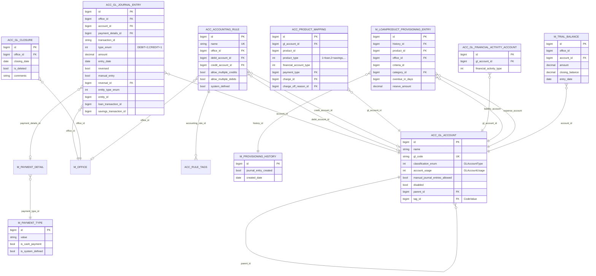
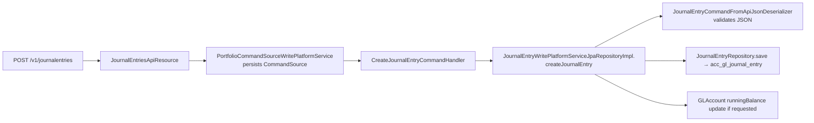

Apache Fineract carries a full double-entry general-ledger inside the platform. Every loan disbursement, repayment, savings deposit, fee charge, share purchase, and inter-office transfer eventually lands as one or more rows in `acc_gl_journal_entry`. The code that produces, posts, reverses, and aggregates those rows is split across two Gradle modules — `fineract-accounting` (the entities, REST resources, validators, and read services) and `fineract-provider` (the accounting *processors* that translate portfolio events into balanced journal entries, plus the Spring Batch jobs that run accruals, running-balance updates, trial-balance materialisation, and provisioning).

This page is the map. The remaining pages in this group are deep dives into each sub-area.

## Two modules, one subsystem

The accounting subsystem is intentionally split:

```text
fineract-accounting/src/main/java/org/apache/fineract/accounting/
├── accrual/                  ← periodic accrual REST + serialization + command handler
├── closure/                  ← GLClosure entity, API, write service, validator
├── common/                   ← AccountingValidations, AccountingDropdownReadPlatformService
├── financialactivityaccount/ ← FinancialActivityAccount entity + API + services
├── glaccount/                ← GLAccount entity, type/usage enums, jobs (trial balance)
├── journalentry/             ← JournalEntry entity, command, JsonInputParams enum, mapper
├── producttoaccountmapping/  ← ProductToGLAccountMapping entity + helpers + serializer
├── provisioning/             ← ProvisioningEntry API, read service, validators
└── rule/                     ← AccountingRule + AccountingTagRule entities, API, services
```

```text
fineract-provider/src/main/java/org/apache/fineract/accounting/
├── accrual/                  ← AccrualAccountingWritePlatformServiceImpl, starter wiring
├── common/                   ← AccountingDropdownReadPlatformServiceImpl
├── jobs/
│   └── accountrunningbalanceupdate/  ← Spring Batch job for running balances
├── journalentry/             ← Cash/Accrual processors, AccountingProcessorHelper,
│                                JournalEntryWritePlatformServiceJpaRepositoryImpl,
│                                JournalEntriesApiResource, command handlers
├── productaccountmapping/    ← ProductToGLAccountMappingWritePlatformServiceImpl
└── provisioning/             ← ProvisioningEntriesWritePlatformServiceJpaRepositoryImpl,
                                LoanProductProvisioningEntry / ProvisioningEntry entities,
                                command handlers, Spring Batch starter
```

`fineract-accounting` only depends on `fineract-core` and a handful of portfolio interfaces — it exposes *what* the GL looks like (JPA entities, DTOs, REST resources) and the validation contracts (`AccountingValidations`, `AccountingDataValidator`, …). `fineract-provider` provides the *how*: the family of `AccountingProcessorForLoan` / `AccountingProcessorForSavings` / `AccountingProcessorForShares` / `AccountingProcessorForClientTransactions` implementations that consume a portfolio "accounting bridge" event and produce balanced `JournalEntry` rows; the Spring Batch jobs that automate accruals, running balances, trial balance, and provisioning; and the `JournalEntryWritePlatformService` JPA implementation that persists everything inside one transaction.

This separation also keeps the entity layer reusable. A custom module can pull `fineract-accounting`, depend on `GLAccount`, `JournalEntry`, and `ProductToGLAccountMapping`, and post entries through the `JournalEntryWritePlatformService` interface without needing the loan/savings processors.

## The four accounting rule types

Every product (loan or savings) in Fineract is tagged with one of four accounting modes, modelled by the `AccountingRuleType` enum in `fineract-core/src/main/java/org/apache/fineract/accounting/common/AccountingRuleType.java`:

| Value | Enum constant       | Description                  |
|-------|---------------------|------------------------------|
| 1     | `NONE`              | No accounting                |
| 2     | `CASH_BASED`        | Cash based accounting        |
| 3     | `ACCRUAL_PERIODIC`  | Periodic accrual accounting  |
| 4     | `ACCRUAL_UPFRONT`   | Upfront accrual accounting   |

`AccountingValidations` (`fineract-accounting/src/main/java/org/apache/fineract/accounting/common/AccountingValidations.java`) is the small helper that every processor uses to branch:

```java accounting/common/AccountingValidations.java
public static boolean isCashBasedAccounting(final Integer accountingRuleType) {
    return AccountingRuleType.CASH_BASED.getValue().equals(accountingRuleType);
}

public static boolean isAccrualPeriodicBasedAccounting(final Integer accountingRuleType) {
    return AccountingRuleType.ACCRUAL_PERIODIC.getValue().equals(accountingRuleType);
}

public static boolean isUpfrontAccrualAccounting(final Integer accountingRuleType) {
    return AccountingRuleType.ACCRUAL_UPFRONT.getValue().equals(accountingRuleType);
}

public static boolean isAccrualBasedAccounting(final Integer accountingRuleType) {
    return AccountingRuleType.ACCRUAL_PERIODIC.getValue().equals(accountingRuleType)
            || AccountingRuleType.ACCRUAL_UPFRONT.getValue().equals(accountingRuleType);
}
```

That distinction drives which `AccountingProcessorForLoan` / `AccountingProcessorForSavings` implementation gets selected by `AccountingProcessorForLoanFactory` / `AccountingProcessorForSavingsFactory` (in `fineract-provider/.../journalentry/service/`). Concretely:

- **Cash**: `CashBasedAccountingProcessorForLoan`, `CashBasedAccountingProcessorForSavings`, `CashBasedAccountingProcessorForShares`, `CashBasedAccountingProcessorForClientTransactions`, plus the working-capital-loan specialisation `CashBasedAccountingProcessorForWorkingCapitalLoan`.
- **Accrual** (periodic or upfront): `AccrualBasedAccountingProcessorForLoan`, `AccrualBasedAccountingProcessorForSavings`.

Each processor produces a list of `(GLAccount, debit-or-credit, amount)` triples and hands them to `AccountingProcessorHelper`, which writes balanced `JournalEntry` rows for the transaction.

## GL account types

`GLAccountType` (`fineract-core/src/main/java/org/apache/fineract/accounting/glaccount/domain/GLAccountType.java`) is the five-valued classification of every chart-of-accounts node:

| Value | Name        | Normal side | Typical examples in Fineract                              |
|-------|-------------|-------------|-----------------------------------------------------------|
| 1     | `ASSET`     | Debit       | Fund source, loan portfolio, interest receivable, cash    |
| 2     | `LIABILITY` | Credit      | Savings control, overdraft portfolio, deferred income     |
| 3     | `EQUITY`    | Credit      | Opening balances transfer contra                          |
| 4     | `INCOME`    | Credit      | Interest income, fee income, penalty income, recovery     |
| 5     | `EXPENSE`   | Debit       | Charge-off expense, losses written off, fraud expense     |

`GLAccountType` exposes type predicates (`isAssetType()`, `isLiabilityType()`, …) used throughout the processors and `GLAccountUsage` (same package) distinguishes `DETAIL` (postable leaf, value 1) from `HEADER` (grouping node, value 2) accounts.

The chart of accounts is hierarchical — `GLAccount` has a `@ManyToOne parent` and an `@OneToMany children` self-reference plus a `hierarchy` string materialising the ancestry path:

```java accounting/glaccount/domain/GLAccount.java
@Entity
@Table(name = "acc_gl_account", uniqueConstraints = {
        @UniqueConstraint(columnNames = { "gl_code" }, name = "acc_gl_code") })
public class GLAccount extends AbstractPersistableCustom<Long> {

    @ManyToOne(fetch = FetchType.LAZY)
    @JoinColumn(name = "parent_id")
    private GLAccount parent;

    @Column(name = "hierarchy", nullable = true, length = 50)
    private String hierarchy;

    @OneToMany(fetch = FetchType.LAZY)
    @JoinColumn(name = "parent_id")
    private List<GLAccount> children = new ArrayList<>();
    ...
    @Column(name = "classification_enum", nullable = false)
    private Integer type;          // GLAccountType ordinal

    @Column(name = "account_usage", nullable = false)
    private Integer usage;         // GLAccountUsage ordinal

    @Column(name = "manual_journal_entries_allowed", nullable = false)
    private boolean manualEntriesAllowed = true;
    ...
}
```

`manualEntriesAllowed` controls whether the GL is open to the manual `POST /v1/journalentries` flow or only to system-posted entries from the portfolio processors. See `accounting/gl-accounts-and-closures.mdx` for details.

## Entity-relationship overview

The core relationships across `acc_*` tables look like this:



## Where each page lives

| Page                                          | What it covers                                                                                  | Code root |
|-----------------------------------------------|--------------------------------------------------------------------------------------------------|-----------|
| `accounting/gl-accounts-and-closures.mdx`     | `GLAccount` chart-of-accounts entity, `GLClosure` period close, REST APIs at `/v1/glaccounts` and `/v1/glclosures` | `fineract-accounting/.../glaccount/`, `.../closure/` |
| `accounting/journal-entries.mdx`              | `JournalEntry` double-entry rows, `JournalEntriesApiResource`, the `JOURNAL_ENTRY_AGGREGATION` job, reversal flow | `fineract-accounting/.../journalentry/`, `fineract-provider/.../journalentry/` |
| `accounting/accounting-rules.mdx`             | `AccountingRule` + `AccountingTagRule` for parameterised manual journal entries                  | `fineract-accounting/.../rule/` |
| `accounting/accrual-engine.mdx`               | Periodic accrual REST + Spring Batch jobs (`ADD_ACCRUAL_ENTRIES`, `ADD_PERIODIC_ACCRUAL_ENTRIES`, `ACCRUAL_ACTIVITY_POSTING`, `ACCOUNTING_RUNNING_BALANCE_UPDATE`, `UPDATE_TRIAL_BALANCE_DETAILS`) | `fineract-accounting/.../accrual/`, `fineract-provider/.../accrual/` |
| `accounting/product-account-mapping.mdx`      | `ProductToGLAccountMapping` — how loan/savings products bind their accounting buckets to GL accounts | `fineract-accounting/.../producttoaccountmapping/` |
| `accounting/financial-activity-mapping.mdx`   | `FinancialActivityAccount` for org-level mappings (asset transfer, cash at vault, payable dividends) | `fineract-accounting/.../financialactivityaccount/` |
| `accounting/provisioning-entries.mdx`         | `LoanProductProvisioningEntry`, `ProvisioningEntry`, `GENERATE_LOANLOSS_PROVISIONING` job        | `fineract-accounting/.../provisioning/`, `fineract-provider/.../provisioning/` |
| `accounting/payment-types.mdx`                | `PaymentType` + `PaymentDetail`, `PaymentTypeApiResource`, payment-type-driven account mapping    | `fineract-core/.../paymenttype/`, `.../paymentdetail/` |
| `accounting/trial-balance.mdx`                | `TrialBalance` entity and the `UPDATE_TRIAL_BALANCE_DETAILS` job                                  | `fineract-accounting/.../glaccount/jobs/updatetrialbalancedetails/` |

## Read services, write services, validators

For every entity in this group the package layout follows the Fineract conventions established in `fineract-core`:

- `domain/` — JPA entities and their `JpaRepository` interfaces. `GLAccountRepositoryWrapper`, `TrialBalanceRepositoryWrapper`, `FinancialActivityAccountRepositoryWrapper`, `AccountingRuleRepositoryWrapper` add `findOneWithNotFoundDetection(...)` style helpers.
- `serialization/` — `*DataValidator` classes that parse JSON command payloads, validating mandatory parameters before the write services touch the DB. E.g. `GLAccountCommandFromApiJsonDeserializer` and `JournalEntryCommandFromApiJsonDeserializer`.
- `service/` — read services (`*ReadPlatformService`, JDBC `RowMapper`-based) and write services (`*WritePlatformService`, JPA-based).
- `api/` — Jersey `*ApiResource` classes registered with the JAX-RS application. The `JsonInputParams` enums in this folder enumerate every JSON field name the API will accept.
- `handler/` — `NewCommandSourceHandler` implementations under each action so Fineract's command-source / audit framework knows how to dispatch a `JsonCommand`.
- `command/` and `data/` — request DTOs and response DTOs.

This separation is why a single CREATE-journal-entry request flows:



## How portfolio events become journal entries

Loan, savings, shares, and client-charge modules don't call the journal-entry write service directly. They publish a portfolio-event "accounting bridge" payload (`AccountingBridgeDataDTO` for loans, `Map<String, Object>` for savings/shares/client transactions) into one of the entry points on `JournalEntryWritePlatformService`:

```java accounting/journalentry/service/JournalEntryWritePlatformService.java
void createJournalEntriesForLoan(AccountingBridgeDataDTO accountingBridgeData);
void createJournalEntriesForSavings(Map<String, Object> accountingBridgeData);
void createJournalEntriesForClientTransactions(Map<String, Object> accountingBridgeData);
void createJournalEntriesForShares(Map<String, Object> accountingBridgeData);
void createJournalEntriesForLoanTransaction(LoanTransaction loanTransaction,
                                           boolean isAccountTransfer,
                                           boolean isLoanToLoanTransfer);
```

The impl in `fineract-provider/.../journalentry/service/JournalEntryWritePlatformServiceJpaRepositoryImpl.java` looks up the product's `AccountingRuleType` (cash vs accrual), selects the right processor via `AccountingProcessorForLoanFactory` / `AccountingProcessorForSavingsFactory` / `AccountingProcessorForSharesFactory`, and lets the processor delegate balanced postings to `AccountingProcessorHelper`. The helper, in turn, looks up the appropriate GL account through `ProductToGLAccountMappingHelper` and `FinancialActivityAccountRepositoryWrapper`, then constructs `JournalEntry` rows via `JournalEntry.createNew(...)`.

This pluggable design is why the chart of accounts can be reorganised per tenant without touching loan/savings code: the product-to-account mapping table is the only place the binding lives.

## Common cross-cutting code

A handful of helper classes show up almost everywhere in this group; you will find them referenced repeatedly in the deep-dive pages:

- `AccountingProcessorHelper` (`fineract-provider/.../journalentry/service/`) — central facade for constructing `JournalEntry` rows from `(GLAccount, type, amount)` tuples. Knows how to look up the mapped GL account for a `(product, financialAccountType, paymentType?, chargeId?)` key.
- `LoanCommonAccountingHelper` (`fineract-provider/.../journalentry/service/`) — loan-specific helper shared between the cash and accrual loan processors.
- `AccountingDropdownReadPlatformService` (`fineract-accounting/.../common/`) — the API behind every "give me dropdown values for the New Account form" endpoint; lists `GLAccountType`, currency codes, account tags, etc.
- `AccountingConstants` (`fineract-core/.../common/AccountingConstants.java`) — the single source of truth for the `CashAccountsForLoan`, `AccrualAccountsForLoan`, `CashAccountsForSavings`, `AccrualAccountsForSavings`, `CashAccountsForShares`, and `FinancialActivity` enums that every product-mapping page reads from.

Read the deep-dive pages with this map in hand, and the rest of the accounting subsystem stops looking like a sprawl of unrelated entities and becomes a small set of well-isolated concerns.
