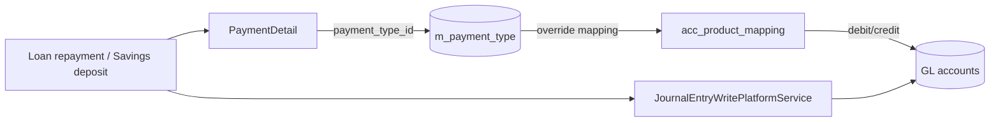

Apache Fineract models the channel and instrument used for every monetary
movement as a first-class **Payment Type**. A payment type identifies whether
a transaction was cash, a cheque, a bank transfer or any custom instrument
the institution wants to recognise, and a per-transaction **Payment Detail**
record captures the optional cheque/account/routing/receipt numbers that
banks need for reconciliation. The same `PaymentType` entity also drives the
GL mapping that the accounting engine uses when it posts journal entries.

## Module layout

The payment-type domain lives in the core module, alongside the rest of the
portfolio code that consumes it:

```text
fineract-core/src/main/java/org/apache/fineract/portfolio/paymenttype/
├── api/
│   └── PaymentTypeApiResource.java
├── command/
│   ├── PaymentTypeCreateCommand.java
│   ├── PaymentTypeUpdateCommand.java
│   └── PaymentTypeDeleteCommand.java
├── data/
│   ├── PaymentTypeCreateRequest.java / Response
│   ├── PaymentTypeUpdateRequest.java / Response
│   ├── PaymentTypeDeleteRequest.java / Response
│   └── PaymentTypeData.java
├── domain/
│   ├── PaymentType.java
│   ├── PaymentTypeRepository.java
│   └── PaymentTypeRepositoryWrapper.java
├── handler/
│   ├── PaymentTypeCreateCommandHandler.java
│   ├── PaymentTypeUpdateCommandHandler.java
│   └── PaymentTypeDeleteCommandHandler.java
└── exception/
    └── PaymentTypeNotFoundException.java
```

The `PaymentDetail` aggregate lives one package over because it is owned by
the transaction, not the catalog:

```text
fineract-core/src/main/java/org/apache/fineract/portfolio/paymentdetail/
├── PaymentDetailConstants.java
├── data/PaymentDetailData.java
└── domain/
    ├── PaymentDetail.java
    └── PaymentDetailAssembler.java
```

## The `PaymentType` entity

`PaymentType` is a small JPA entity mapped to the `m_payment_type` table
(`fineract-core/src/main/java/org/apache/fineract/portfolio/paymenttype/domain/PaymentType.java`):

```java
@Entity
@Table(name = "m_payment_type")
public class PaymentType extends AbstractPersistableCustom<Long> {

    @Column(name = "value")
    private String name;

    @Column(name = "description")
    private String description;

    @Column(name = "is_cash_payment")
    private Boolean isCashPayment;

    @Column(name = "order_position")
    private Long position;

    @Column(name = "code_name")
    private String codeName;

    @Column(name = "is_system_defined")
    private Boolean isSystemDefined;
}
```

Field-by-field meaning:

<ResponseField name="value (name)" type="String">
Display name shown in client UIs (`Cash`, `Cheque`, `Bank Transfer`,
`Mobile Money`).
</ResponseField>

<ResponseField name="description" type="String">
Optional long-form description for back-office staff.
</ResponseField>

<ResponseField name="isCashPayment" type="Boolean">
Marks the type as cash for tellers and cash management. The teller / cash
in-hand workflows, as well as the loan and savings transaction handlers,
inspect this flag to decide whether a `CashIn`/`CashOut` movement is needed.
</ResponseField>

<ResponseField name="position" type="Long">
Ordering hint so UIs can present types in a deterministic sequence.
</ResponseField>

<ResponseField name="codeName" type="String">
Optional link to a `m_code` entry — when present, the available payment
types are scoped by a code-value rather than by the raw `m_payment_type`
table. The `?onlyWithCode=true` query parameter on the list endpoint uses
this.
</ResponseField>

<ResponseField name="isSystemDefined" type="Boolean">
Set to `true` for types created by the platform's own bootstrap scripts so
that they cannot be deleted from the API.
</ResponseField>

## The `PaymentDetail` entity

A `PaymentDetail` is attached to a specific monetary transaction (loan
repayment, savings deposit, share purchase, journal entry, etc.) and carries
the instrument metadata captured at the point of sale. From
`fineract-core/src/main/java/org/apache/fineract/portfolio/paymentdetail/domain/PaymentDetail.java`:

```java
@Entity
@Table(name = "m_payment_detail")
public class PaymentDetail extends AbstractPersistableCustom<Long> {

    @ManyToOne
    @JoinColumn(name = "payment_type_id", nullable = false)
    private PaymentType paymentType;

    @Column(name = "account_number", length = 50) private String accountNumber;
    @Column(name = "check_number",  length = 50) private String checkNumber;
    @Column(name = "routing_code",  length = 50) private String routingCode;
    @Column(name = "receipt_number",length = 50) private String receiptNumber;
    @Column(name = "bank_number",   length = 50) private String bankNumber;
}
```

The static factory `PaymentDetail.generatePaymentDetail(paymentType, command,
changes)` parses these fields off a `JsonCommand` using parameter names from
`PaymentDetailConstants`, only populating them if non-blank. The companion
`PaymentDetailAssembler` (same package) is the entry point used by the loan,
savings and journal-entry write services to build a detail from an incoming
JSON command — it is `@Nullable` because most transaction APIs treat the
detail as optional.

## REST surface — `PaymentTypeApiResource`

The REST surface is exposed at `/v1/paymenttypes` and is defined in
`fineract-core/src/main/java/org/apache/fineract/portfolio/paymenttype/api/PaymentTypeApiResource.java`:

```java
@Path("/v1/paymenttypes")
@Component
@Tag(name = "Payment Type", description = "This defines the payment type")
@RequiredArgsConstructor
public class PaymentTypeApiResource {

    private final PaymentTypeReadService readPlatformService;
    private final CommandDispatcher dispatcher;
    private final DefaultToApiJsonSerializer<PaymentTypeData> jsonSerializer;

    @GET
    public List<PaymentTypeData> getAllPaymentTypes(
            @QueryParam("onlyWithCode") final boolean onlyWithCode) {
        return onlyWithCode
                ? readPlatformService.retrieveAllPaymentTypesWithCode()
                : readPlatformService.retrieveAllPaymentTypes();
    }
```

The five endpoints map cleanly to the catalog CRUD lifecycle:

| Method | Path                          | Operation        | Handler / read service |
| ------ | ----------------------------- | ---------------- | ---------------------- |
| GET    | `/v1/paymenttypes`            | List all         | `PaymentTypeReadService` |
| GET    | `/v1/paymenttypes/{id}`       | Retrieve one     | `PaymentTypeReadService.retrieveOne` |
| POST   | `/v1/paymenttypes`            | Create           | `PaymentTypeCreateCommandHandler` |
| PUT    | `/v1/paymenttypes/{id}`       | Update           | `PaymentTypeUpdateCommandHandler` |
| DELETE | `/v1/paymenttypes/{id}`       | Delete           | `PaymentTypeDeleteCommandHandler` |

POST/PUT/DELETE go through Fineract's command-dispatcher (`CommandDispatcher.dispatch(command)`)
so they participate in maker-checker, idempotency and audit logging exactly
like every other write API. The request/response DTOs are
`PaymentTypeCreateRequest`, `PaymentTypeUpdateRequest` and
`PaymentTypeDeleteRequest` under
`fineract-core/.../portfolio/paymenttype/data/`.

### Create request

```json
POST /fineract-provider/api/v1/paymenttypes
{
  "name":          "Mobile Money",
  "description":   "Push payments via mobile wallet partner",
  "isCashPayment": false,
  "position":      30,
  "codeName":      "PaymentType"
}
```

The handler chain resolves to `PaymentTypeCreateCommandHandler`, which uses
the JPA repository to persist the row and returns the new identifier in the
`PaymentTypeCreateResponse`.

### Repository wrapper

Look-ups inside services go through `PaymentTypeRepositoryWrapper`
(`.../paymenttype/domain/PaymentTypeRepositoryWrapper.java`) instead of the
plain Spring Data repository so that a missing identifier raises a typed
`PaymentTypeNotFoundException` rather than an `Optional.empty()`. This is the
same pattern Fineract uses across the codebase (client, loan, savings,
office, code-value …).

## Cash handling

The `isCashPayment` flag drives behaviour in a few places:

- **Cashier / teller module** — loan repayments and savings deposits using a
  cash payment type debit/credit the configured cashier till. The teller
  write services in `fineract-provider/src/main/java/org/apache/fineract/organisation/teller/`
  filter transactions by `paymentType.isCashPayment == true`.
- **GL mapping** — the GL account override on a product can pin cash
  movements to a specific till account using `PaymentTypeToGLAccountMapper`
  (see below). Non-cash types still flow through the product's default
  fund-source.
- **Reporting** — standard cash-flow and till-reconciliation reports use
  `m_payment_type.is_cash_payment` as the bucket discriminator.

## Linkage to journal entries

Every accounting move that originates from a portfolio transaction can carry
a `payment_type_id` so the GL posting can be steered to a payment-specific
account. The override comes from
`fineract-core/src/main/java/org/apache/fineract/accounting/producttoaccountmapping/data/PaymentTypeToGLAccountMapper.java`:

```java
public final class PaymentTypeToGLAccountMapper {
    private final PaymentTypeData paymentType;
    private final GLAccountData glAccount;
    // ...
}
```

These mappings are stored in `acc_product_mapping` rows (with
`payment_type_id` populated) and resolved by the loan/savings product
read services when their accounting rule is anything other than `NONE`.
At posting time the journal-entry write service inspects the originating
transaction's `PaymentDetail`, looks up the mapper for the product +
payment-type pair, and falls back to the product default if none exists.



The same `PaymentDetail` row is referenced by both the loan/savings
transaction record **and** the resulting journal entries, which is what
makes Fineract's bank-reconciliation reports possible: a query joins
`acc_gl_journal_entry → m_payment_detail → m_payment_type` to group
postings by instrument.

## Common operational tasks

<AccordionGroup>
<Accordion title="Seed a new payment type">
`POST /v1/paymenttypes` with `isCashPayment=false`. The new identifier can
immediately be referenced from loan, savings and journal-entry create
requests via the `paymentTypeId` field.
</Accordion>

<Accordion title="Restrict a payment type to a code-value list">
Set `codeName` to the name of an `m_code` entry (`PaymentType` by
convention). Client UIs query `?onlyWithCode=true` and present the
code-value choices instead of the raw catalog.
</Accordion>

<Accordion title="Override the GL account for one instrument">
Use the product's accounting endpoint with `paymentChannelToFundSourceMappings`
to insert a `PaymentTypeToGLAccountMapper` row. The next journal-entry
post for that product+payment-type pair will hit the override account.
</Accordion>

<Accordion title="Reconcile cheques">
Capture `checkNumber`, `routingCode` and `bankNumber` on the original
deposit's `PaymentDetail`. The reconciliation report can then group by
cheque number using `m_payment_detail.check_number`.
</Accordion>
</AccordionGroup>

## Validation and exceptions

The handler chain raises:

- `PlatformApiDataValidationException` — missing `name` on create, or
  attempting to update a system-defined entry, surfaced via the standard
  `errors[]` envelope used elsewhere in Fineract.
- `PaymentTypeNotFoundException` — thrown by `PaymentTypeRepositoryWrapper`
  when a referenced `paymentTypeId` cannot be located.
  (`.../paymenttype/exception/PaymentTypeNotFoundException.java`)
- `PlatformDataIntegrityException` — raised on delete when the type is
  still referenced by `m_payment_detail` rows or by an
  `acc_product_mapping`.

## Related reading

- Journal entries and GL mapping: see the accounting overview pages.
- Loan / savings transaction APIs — every payment-type-aware POST body
  accepts a `paymentTypeId` plus the optional `checkNumber`, `routingCode`,
  `receiptNumber`, `bankNumber` and `accountNumber` fields that populate the
  `PaymentDetail`.
- Teller and cashier module — uses `isCashPayment` to drive till
  balancing.
