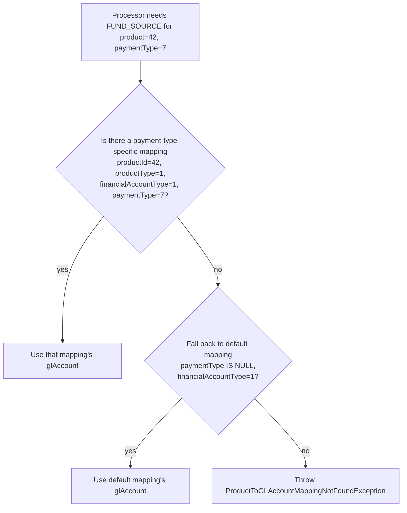
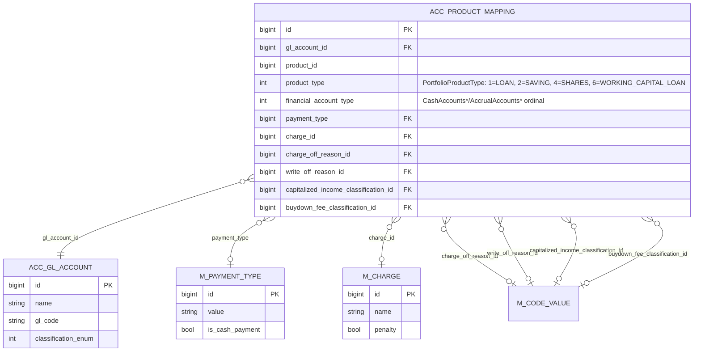

When a loan disbursement, savings withdrawal, or share purchase posts in Apache Fineract, the accounting processor needs to know *which* GL account to debit and credit. The mapping is intentionally not hard-coded — instead, each product (loan product, savings product, share product) ships with a set of `ProductToGLAccountMapping` rows that bind named *accounting buckets* (like `FUND_SOURCE`, `LOAN_PORTFOLIO`, `INTEREST_ON_LOANS`, `INCOME_FROM_FEES`, …) to concrete `GLAccount` ids. The processors then look up these rows at posting time. The mapping is rich enough to support payment-type-driven cash accounts, per-charge income accounts, and per-charge-off-reason expense accounts.

This page covers the mapping entity in `fineract-accounting/src/main/java/org/apache/fineract/accounting/producttoaccountmapping/`, the helpers that resolve a `(product, bucket)` pair to a GL account, and the JSON shape the loan/savings/share product create/update endpoints accept.

## The ProductToGLAccountMapping entity

```java accounting/producttoaccountmapping/domain/ProductToGLAccountMapping.java
@Entity
@Table(name = "acc_product_mapping",
    uniqueConstraints = {
        @UniqueConstraint(columnNames = {
            "product_id", "product_type", "financial_account_type", "payment_type"
        }, name = "financial_action") })
public class ProductToGLAccountMapping extends AbstractPersistableCustom<Long> {

    @ManyToOne(optional = true)
    @JoinColumn(name = "gl_account_id")
    private GLAccount glAccount;

    @Column(name = "product_id", nullable = true)
    private Long productId;

    @ManyToOne
    @JoinColumn(name = "payment_type", nullable = true)
    private PaymentType paymentType;

    @ManyToOne
    @JoinColumn(name = "charge_id", nullable = true)
    private Charge charge;

    @Column(name = "product_type", nullable = true)
    private int productType;            // PortfolioProductType value

    @Column(name = "financial_account_type", nullable = true)
    private int financialAccountType;   // CashAccountsForLoan / AccrualAccountsForLoan / ... ordinal

    @ManyToOne
    @JoinColumn(name = "charge_off_reason_id", nullable = true)
    private CodeValue chargeOffReason;

    @ManyToOne
    @JoinColumn(name = "write_off_reason_id", nullable = true)
    private CodeValue writeOffReason;

    @ManyToOne
    @JoinColumn(name = "capitalized_income_classification_id", nullable = true)
    private CodeValue capitalizedIncomeClassification;

    @ManyToOne
    @JoinColumn(name = "buydown_fee_classification_id", nullable = true)
    private CodeValue buydownFeeClassification;

    public static ProductToGLAccountMapping createNew(final GLAccount glAccount, final Long productId,
            final int productType, final int financialAccountType,
            final CodeValue chargeOffReason, final CodeValue capitalizedIncomeClassification,
            final CodeValue buydownFeeClassification) {
        return new ProductToGLAccountMapping().setGlAccount(glAccount).setProductId(productId)
                .setProductType(productType).setFinancialAccountType(financialAccountType)
                .setChargeOffReason(chargeOffReason)
                .setCapitalizedIncomeClassification(capitalizedIncomeClassification)
                .setBuydownFeeClassification(buydownFeeClassification);
    }
}
```

Key facts:

- The table is `acc_product_mapping`.
- The unique constraint `financial_action` is `(product_id, product_type, financial_account_type, payment_type)` — the same `(product, bucket)` can have at most one *default* row plus one row per non-null `payment_type`.
- `productType` is the `PortfolioProductType` integer:

```java fineract-core/.../portfolio/PortfolioProductType.java
LOAN(1, "productType.loan"),
SAVING(2, "productType.saving"),
CLIENT(5, "productType.client"),
PROVISIONING(3, "productType.provisioning"),
SHARES(4, "productType.shares"),
WORKING_CAPITAL_LOAN(6, "productType.workingCapitalLoan");
```

- `financialAccountType` is the ordinal of the *bucket* enum specific to the product type:
  - For `LOAN` cash products: `CashAccountsForLoan` (1=FUND_SOURCE, 2=LOAN_PORTFOLIO, 3=INTEREST_ON_LOANS, …).
  - For `LOAN` accrual products: `AccrualAccountsForLoan` (adds 7=INTEREST_RECEIVABLE, 8=FEES_RECEIVABLE, 9=PENALTIES_RECEIVABLE).
  - For `SAVING` cash products: `CashAccountsForSavings` (1=SAVINGS_REFERENCE, 2=SAVINGS_CONTROL, 3=INTEREST_ON_SAVINGS, …).
  - For `SAVING` accrual products: `AccrualAccountsForSavings`.
  - For `SHARES`: `CashAccountsForShares` (1=SHARES_REFERENCE, 2=SHARES_SUSPENSE, …).

- The four optional discriminators (`paymentType`, `charge`, `chargeOffReason`, `writeOffReason`, `capitalizedIncomeClassification`, `buydownFeeClassification`) split a single bucket into *multiple* sub-mappings keyed by the relevant axis. Different lookup queries fire depending on what the processor needs.

## The bucket enums

The complete list of cash-mode buckets for loans (`fineract-core/.../accounting/common/AccountingConstants.java`):

```java accounting/common/AccountingConstants.java
public enum CashAccountsForLoan {
    FUND_SOURCE(1),
    LOAN_PORTFOLIO(2),
    INTEREST_ON_LOANS(3),
    INCOME_FROM_FEES(4),
    INCOME_FROM_PENALTIES(5),
    LOSSES_WRITTEN_OFF(6),
    TRANSFERS_SUSPENSE(10),
    OVERPAYMENT(11),
    INCOME_FROM_RECOVERY(12),
    GOODWILL_CREDIT(13),
    INCOME_FROM_CHARGE_OFF_INTEREST(14),
    INCOME_FROM_CHARGE_OFF_FEES(15),
    CHARGE_OFF_EXPENSE(16),
    CHARGE_OFF_FRAUD_EXPENSE(17),
    INCOME_FROM_CHARGE_OFF_PENALTY(18),
    INCOME_FROM_GOODWILL_CREDIT_INTEREST(19),
    INCOME_FROM_GOODWILL_CREDIT_FEES(20),
    INCOME_FROM_GOODWILL_CREDIT_PENALTY(21),
    CLASSIFICATION_INCOME(22),
    DEFERRED_INCOME_LIABILITY(23),
    INCOME_FROM_DISCOUNT_FEE(24),
    FEES_RECEIVABLE(25),
    PENALTIES_RECEIVABLE(26);
}
```

Accrual mode for loans (`AccrualAccountsForLoan`) is a superset and adds:

```java accounting/common/AccountingConstants.java
INTEREST_RECEIVABLE(7),
FEES_RECEIVABLE(8),
PENALTIES_RECEIVABLE(9),
INCOME_FROM_CAPITALIZATION(22),
DEFERRED_INCOME_LIABILITY(23),
BUY_DOWN_EXPENSE(24),
INCOME_FROM_BUY_DOWN(25),
```

Cash mode for savings (`CashAccountsForSavings`):

```java accounting/common/AccountingConstants.java
SAVINGS_REFERENCE(1),
SAVINGS_CONTROL(2),
INTEREST_ON_SAVINGS(3),
INCOME_FROM_FEES(4),
INCOME_FROM_PENALTIES(5),
TRANSFERS_SUSPENSE(10),
OVERDRAFT_PORTFOLIO_CONTROL(11),
INCOME_FROM_INTEREST(12),
LOSSES_WRITTEN_OFF(13),
ESCHEAT_LIABILITY(14);
```

Accrual mode for savings adds `FEES_RECEIVABLE(15)`, `PENALTIES_RECEIVABLE(16)`, `INTEREST_PAYABLE(17)`, `INTEREST_RECEIVABLE(18)`.

These bucket *values* are exactly what gets persisted in the `financial_account_type` column. So when the cash-based loan processor needs "the GL account where this product books interest income", it asks for the mapping with `productType = 1` and `financialAccountType = 3` (`INTEREST_ON_LOANS`).

## The JSON parameter enums

The loan product create/update endpoint (`POST /v1/loanproducts`) accepts a flat JSON map of bucket → GL account id. The accepted parameter names are the `LoanProductAccountingParams` enum values:

```java accounting/common/AccountingConstants.java
public enum LoanProductAccountingParams {
    FUND_SOURCE("fundSourceAccountId"),
    LOAN_PORTFOLIO("loanPortfolioAccountId"),
    INTEREST_ON_LOANS("interestOnLoanAccountId"),
    INCOME_FROM_FEES("incomeFromFeeAccountId"),
    INCOME_FROM_PENALTIES("incomeFromPenaltyAccountId"),
    LOSSES_WRITTEN_OFF("writeOffAccountId"),
    GOODWILL_CREDIT("goodwillCreditAccountId"),
    OVERPAYMENT("overpaymentLiabilityAccountId"),
    INTEREST_RECEIVABLE("receivableInterestAccountId"),
    FEES_RECEIVABLE("receivableFeeAccountId"),
    PENALTIES_RECEIVABLE("receivablePenaltyAccountId"),
    TRANSFERS_SUSPENSE("transfersInSuspenseAccountId"),

    PAYMENT_CHANNEL_FUND_SOURCE_MAPPING("paymentChannelToFundSourceMappings"),
    PAYMENT_TYPE("paymentTypeId"),
    FEE_INCOME_ACCOUNT_MAPPING("feeToIncomeAccountMappings"),
    PENALTY_INCOME_ACCOUNT_MAPPING("penaltyToIncomeAccountMappings"),
    CHARGE_ID("chargeId"),
    INCOME_ACCOUNT_ID("incomeAccountId"),
    INCOME_FROM_RECOVERY("incomeFromRecoveryAccountId"),

    INCOME_FROM_CHARGE_OFF_INTEREST("incomeFromChargeOffInterestAccountId"),
    INCOME_FROM_CHARGE_OFF_FEES("incomeFromChargeOffFeesAccountId"),
    CHARGE_OFF_EXPENSE("chargeOffExpenseAccountId"),
    CHARGE_OFF_FRAUD_EXPENSE("chargeOffFraudExpenseAccountId"),
    INCOME_FROM_CHARGE_OFF_PENALTY("incomeFromChargeOffPenaltyAccountId"),

    INCOME_FROM_GOODWILL_CREDIT_INTEREST("incomeFromGoodwillCreditInterestAccountId"),
    INCOME_FROM_GOODWILL_CREDIT_FEES("incomeFromGoodwillCreditFeesAccountId"),
    INCOME_FROM_GOODWILL_CREDIT_PENALTY("incomeFromGoodwillCreditPenaltyAccountId"),

    CHARGE_OFF_REASON_TO_EXPENSE_ACCOUNT_MAPPINGS("chargeOffReasonToExpenseAccountMappings"),
    WRITE_OFF_REASON_TO_EXPENSE_ACCOUNT_MAPPINGS("writeOffReasonsToExpenseMappings"),
    EXPENSE_GL_ACCOUNT_ID("expenseAccountId"),
    CHARGE_OFF_REASON_CODE_VALUE_ID("chargeOffReasonCodeValueId"),
    WRITE_OFF_REASON_CODE_VALUE_ID("writeOffReasonCodeValueId"),

    DEFERRED_INCOME_LIABILITY("deferredIncomeLiabilityAccountId"),
    INCOME_FROM_CAPITALIZATION("incomeFromCapitalizationAccountId"),
    BUY_DOWN_EXPENSE("buyDownExpenseAccountId"),
    INCOME_FROM_BUY_DOWN("incomeFromBuyDownAccountId"),
    INCOME_FROM_DISCOUNT_FEE("incomeFromDiscountFeeAccountId"),
    CAPITALIZED_INCOME_CLASSIFICATION_TO_INCOME_ACCOUNT_MAPPINGS("..."),
    BUYDOWN_FEE_CLASSIFICATION_TO_INCOME_ACCOUNT_MAPPINGS("..."),
    CLASSIFICATION_CODE_VALUE_ID("classificationCodeValueId");
}
```

The `*_MAPPINGS` entries are arrays of nested objects, each `{paymentTypeId|chargeId|chargeOffReasonId, ..AccountId}` pair. The companion enum `LoanProductAccountingDataParams` defines the response-side names (without the `Id` suffix) used when reading the mapping back.

Equivalent enums exist for savings (`SavingProductAccountingParams`) and shares (`SharesProductAccountingParams`).

## Write path: helpers

`ProductToGLAccountMappingWritePlatformServiceImpl` (`fineract-provider/.../productaccountmapping/service/`) is the entry point. It delegates to one of three helpers depending on the product type:

```java fineract-provider/.../productaccountmapping/service/ProductToGLAccountMappingWritePlatformServiceImpl.java
private final LoanProductToGLAccountMappingHelper    loanProductToGLAccountMappingHelper;
private final SavingsProductToGLAccountMappingHelper savingsProductToGLAccountMappingHelper;
private final ShareProductToGLAccountMappingHelper   shareProductToGLAccountMappingHelper;
```

Each helper has methods like `saveLoanToAssetAccountMapping`, `saveLoanToIncomeAccountMapping`, `mergePaymentChannelToFundSourceMappings`, etc. They all ultimately call into `ProductToGLAccountMappingHelper` (`fineract-accounting/.../producttoaccountmapping/service/ProductToGLAccountMappingHelper.java`), which builds a `ProductToGLAccountMapping.createNew(...)` and saves it through `ProductToGLAccountMappingRepository`.

The helpers' three responsibilities are:

1. **Top-level bucket mappings** — direct `(financialAccountType → glAccountId)` entries with `paymentType`, `charge`, `chargeOffReason`, `writeOffReason`, `capitalizedIncomeClassification`, `buydownFeeClassification` all NULL.
2. **Sub-mappings** — additional rows when the JSON contains `paymentChannelToFundSourceMappings`, `feeToIncomeAccountMappings`, `penaltyToIncomeAccountMappings`, `chargeOffReasonToExpenseAccountMappings`, `writeOffReasonsToExpenseMappings`, `capitalizedIncomeClassificationToIncomeAccountMappings`, or `buydownfeeClassificationToIncomeAccountMappings`. Each becomes a row with the relevant discriminator populated.
3. **Updates / merges** — on PUT, the helpers diff the incoming list against the existing rows and `merge*Mappings(...)` (delete removed, insert new, update changed).

## Repository — the read queries

`ProductToGLAccountMappingRepository` is where the lookup logic lives. The queries make the lookup pattern explicit:

```java accounting/producttoaccountmapping/domain/ProductToGLAccountMappingRepository.java
// 1) Default mapping for a bucket — no discriminator set
@Query("select mapping from ProductToGLAccountMapping mapping " +
       "where mapping.productId =:productId and mapping.productType =:productType " +
       "and mapping.financialAccountType=:financialAccountType " +
       "and mapping.paymentType is NULL and mapping.charge is NULL " +
       "and mapping.chargeOffReason is NULL and mapping.writeOffReason is NULL " +
       "and mapping.capitalizedIncomeClassification is NULL and mapping.buydownFeeClassification is NULL")
ProductToGLAccountMapping findCoreProductToFinAccountMapping(Long productId, int productType, int financialAccountType);

// 2) Payment-type-specific override for fund source (financialAccountType=1)
@Query("select mapping from ProductToGLAccountMapping mapping " +
       "where mapping.productId =:productId and mapping.productType =:productType " +
       "and mapping.financialAccountType=1 and mapping.paymentType is not NULL")
List<ProductToGLAccountMapping> findAllPaymentTypeToFundSourceMappings(Long productId, int productType);

// 3) Per-charge fee income mapping (financialAccountType=4)
@Query("select mapping from ProductToGLAccountMapping mapping " +
       "where mapping.productId =:productId and mapping.productType =:productType " +
       "and mapping.financialAccountType=4 and mapping.charge is not NULL")
List<ProductToGLAccountMapping> findAllFeeToIncomeAccountMappings(Long productId, int productType);

// 4) Per-charge penalty income mapping (financialAccountType=5)
@Query("... and mapping.financialAccountType=5 and mapping.charge is not NULL")
List<ProductToGLAccountMapping> findAllPenaltyToIncomeAccountMappings(Long productId, int productType);

// 5) Charge-off reason → expense account
@Query("... and mapping.chargeOffReason is not NULL")
List<ProductToGLAccountMapping> findChargeOffMappings(Long productId, int productType);

// 6) Capitalized-income / buydown-fee classification mappings
@Query("... and mapping.capitalizedIncomeClassification is not NULL")
List<ProductToGLAccountMapping> findCapitalizedIncomeMappings(Long productId, int productType);

@Query("... and mapping.buydownFeeClassification is not NULL")
List<ProductToGLAccountMapping> findBuydownFeeMappings(Long productId, int productType);
```

The findOne with `paymentType` variant is what `AccountingProcessorHelper` calls when the loan transaction came in via a specific payment type (cheque, bank transfer, mobile money, …):

```java
ProductToGLAccountMapping findByProductIdAndProductTypeAndFinancialAccountTypeAndPaymentTypeId(
        Long productId, int productType, ...);
```

The lookup logic the processor uses for the cash account at disbursement/repayment time:



The same pattern is repeated for fee income (per-charge override fallback to the default `INCOME_FROM_FEES`), penalty income (per-charge override fallback to `INCOME_FROM_PENALTIES`), and charge-off expense (per-charge-off-reason override fallback to `CHARGE_OFF_EXPENSE`).

## Cash-mode vs accrual-mode mapping payload

A cash-mode loan product typically configures only the cash buckets:

```json
{
  "accountingRule": 2,
  "fundSourceAccountId": 12,
  "loanPortfolioAccountId": 18,
  "interestOnLoanAccountId": 34,
  "incomeFromFeeAccountId": 35,
  "incomeFromPenaltyAccountId": 36,
  "writeOffAccountId": 71,
  "overpaymentLiabilityAccountId": 22,
  "transfersInSuspenseAccountId": 23
}
```

A periodic-accrual loan product adds the three receivable accounts:

```json
{
  "accountingRule": 3,
  "fundSourceAccountId": 12,
  "loanPortfolioAccountId": 18,
  "interestOnLoanAccountId": 34,
  "incomeFromFeeAccountId": 35,
  "incomeFromPenaltyAccountId": 36,
  "writeOffAccountId": 71,
  "overpaymentLiabilityAccountId": 22,
  "transfersInSuspenseAccountId": 23,
  "receivableInterestAccountId": 25,
  "receivableFeeAccountId": 26,
  "receivablePenaltyAccountId": 27
}
```

A product also commonly carries the payment-channel and per-charge overrides:

```json
{
  ...
  "paymentChannelToFundSourceMappings": [
    { "paymentTypeId": 7, "fundSourceAccountId": 13 },
    { "paymentTypeId": 8, "fundSourceAccountId": 14 }
  ],
  "feeToIncomeAccountMappings": [
    { "chargeId": 4, "incomeAccountId": 40 }
  ],
  "penaltyToIncomeAccountMappings": [
    { "chargeId": 9, "incomeAccountId": 41 }
  ],
  "chargeOffReasonToExpenseAccountMappings": [
    { "chargeOffReasonCodeValueId": 12, "expenseAccountId": 73 }
  ]
}
```

The validator (`accounting/producttoaccountmapping/serialization/ProductToGLAccountMappingFromApiJsonDeserializer.java`) enforces that the required buckets for the chosen `accountingRule` are present:

- `accountingRule = NONE (1)` → mapping section must be empty.
- `accountingRule = CASH_BASED (2)` → required: `fundSourceAccountId`, `loanPortfolioAccountId`, `interestOnLoanAccountId`, `incomeFromFeeAccountId`, `incomeFromPenaltyAccountId`, `transfersInSuspenseAccountId`, `writeOffAccountId`, `overpaymentLiabilityAccountId`.
- `accountingRule = ACCRUAL_PERIODIC (3)` or `ACCRUAL_UPFRONT (4)` → all of the cash-mode required fields, plus `receivableInterestAccountId`, `receivableFeeAccountId`, `receivablePenaltyAccountId`.

## Entity-relationship view



## Read service

`ProductToGLAccountMappingReadPlatformServiceImpl` (`fineract-accounting/.../producttoaccountmapping/service/`) is what the loan/savings/share product read endpoints call to populate the `accountingMappings` and the nested `paymentChannelToFundSourceMappings` / `feeToIncomeAccountMappings` / etc. arrays on a product detail response. It groups the rows by their discriminator pattern and emits a structured JSON. The `WorkingCapitalLoanProductAdvancedAccountingReadHelper` adds the extra buckets specific to working-capital loans (`CashBasedAccountingProcessorForWorkingCapitalLoan` uses these).

## Resolution at posting time

When a loan transaction is bridged into the accounting subsystem, `AccountingProcessorHelper` runs a tiered lookup:

1. **Specific match** — does an exact mapping exist for `(loanProductId, LOAN, financialAccountType, paymentTypeId)` (for cash-side accounts) or `(loanProductId, LOAN, financialAccountType, chargeId)` (for charge income)?
2. **Default match** — fall back to the row with all discriminators NULL.
3. **Org-level fallback** — for cash and asset-transfer accounts, `FinancialActivityAccount` is consulted last (see `accounting/financial-activity-mapping.mdx`).

The same hierarchy is followed during accrual postings; the difference is only the bucket enum (`AccrualAccountsForLoan` instead of `CashAccountsForLoan`) used as `financialAccountType`.

## Operational notes

- **Bucket-to-enum drift**: adding a new posting bucket means adding (i) the integer value to `CashAccountsForLoan` / `AccrualAccountsForLoan`, (ii) the parameter name to `LoanProductAccountingParams`, (iii) the data parameter name to `LoanProductAccountingDataParams`, (iv) validator entry, and (v) helper logic in `LoanProductToGLAccountMappingHelper`. Skipping any one leaves the bucket invisible in the API or unsaved in the DB.
- **Switching accountingRule**: if a tenant changes a product from cash to accrual, the new receivable accounts must be supplied; the write helper deletes mappings that no longer apply. Historical journal entries are left untouched — only new transactions use the new mappings.
- **Per-charge mappings**: deleting a charge from a product without removing the corresponding mapping leaves an orphan; the helpers detect this on PUT and prune.
- **Compound delete protection**: deleting a `GLAccount` referenced by any `acc_product_mapping` row is rejected by the GL account write service.

For the actual posting flow that consumes these mappings see `accounting/journal-entries.mdx`. For the cash-vs-clearing account that fires when neither product nor payment-type mapping resolves see `accounting/financial-activity-mapping.mdx`.
