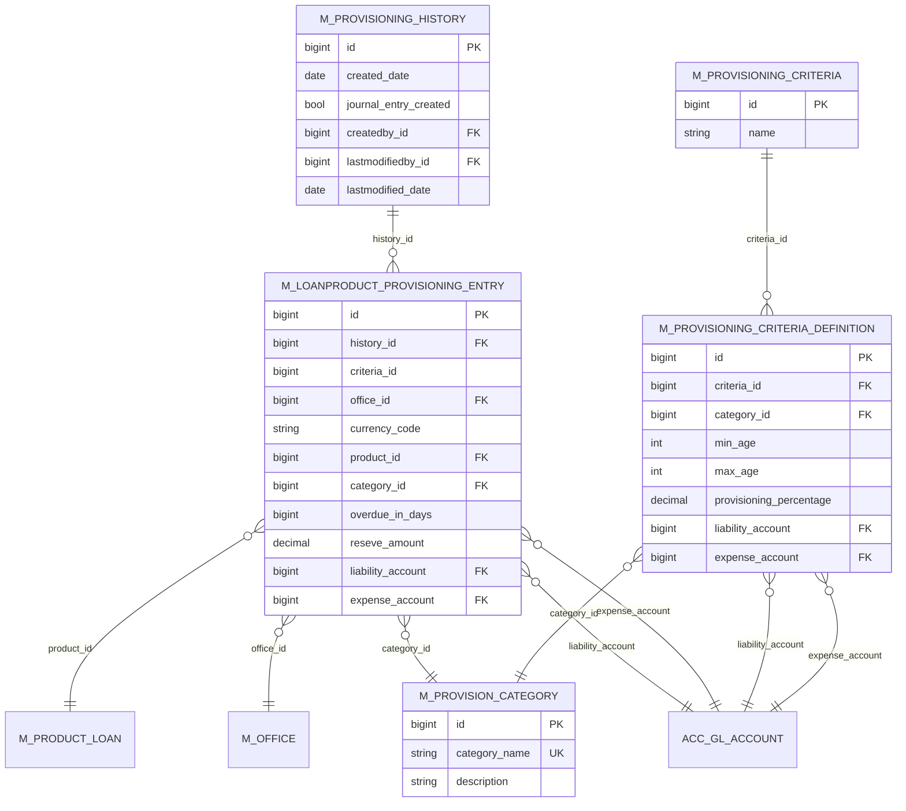
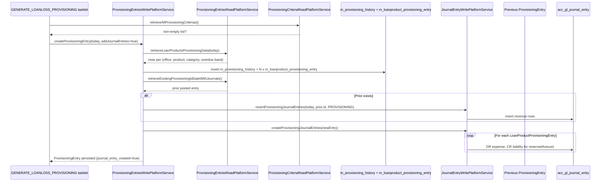

In a microfinance institution every overdue loan represents a credit risk. Accounting standards (e.g. IFRS 9, local central-bank rules) require that an *expected loss* be recognised as an expense and a corresponding *liability* (or contra-asset reserve) be carried on the books, in proportion to how delinquent the underlying loan is. Apache Fineract supports this with a two-step engine:

1. **Provisioning criteria** — a tenant-defined table of "if a loan is overdue between *N₁* and *N₂* days, reserve *p%* of its outstanding principal, expensing against GL `E` and crediting GL `L`". One row per category (e.g. *Standard*, *Substandard*, *Doubtful*, *Loss*).
2. **Provisioning entries** — a snapshot of all overdue loans across the portfolio at a given date, classified by criterion, summarised per `(loan product, office, category, overdue band)` into rows of type `LoanProductProvisioningEntry`. The aggregated snapshot is a `ProvisioningEntry` (history record). Optionally, posting the snapshot fires balanced journal entries against the configured liability/expense GL accounts.

The code for the snapshotting and posting lives in `fineract-accounting/src/main/java/org/apache/fineract/accounting/provisioning/` (API, read service, validator, constants) and `fineract-provider/src/main/java/org/apache/fineract/accounting/provisioning/` (entities, write service, command handlers, Spring Batch starter). The nightly job that fires snapshots automatically is `GENERATE_LOANLOSS_PROVISIONING` in the loan-product jobs package.

This page covers all of that.

## Provisioning criteria (the inputs)

A `ProvisioningCriteria` (`fineract-provider/.../organisation/provisioning/domain/ProvisioningCriteria.java`, table `m_provisioning_criteria`) is composed of:

- One or more `ProvisioningCategory` rows (table `m_provision_category`) — e.g. *Standard*, *Substandard*, *Doubtful*, *Loss*.
- One `ProvisioningCriteriaDefinition` per category, which carries:
  - `min_age` / `max_age` — overdue-days band
  - `provisioning_percentage`
  - `liability_account` (GLAccount FK)
  - `expense_account` (GLAccount FK)
- A list of loan products the criteria applies to.

The criteria are managed via the `/v1/provisioningcriteria` REST API (covered in `organisation/` docs). What the provisioning *entry* engine cares about is that these criteria already exist and have been mapped to loan products before any snapshot is run.

## ProvisioningEntry — the snapshot history

```java fineract-provider/.../accounting/provisioning/domain/ProvisioningEntry.java
@Entity
@Table(name = "m_provisioning_history")
public class ProvisioningEntry extends AbstractPersistableCustom<Long> {

    @Column(name = "journal_entry_created")
    private Boolean isJournalEntryCreated;

    @OneToMany(cascade = CascadeType.ALL, mappedBy = "entry",
               orphanRemoval = true, fetch = FetchType.EAGER)
    private Set<LoanProductProvisioningEntry> provisioningEntries = new HashSet<>();

    @OneToOne
    @JoinColumn(name = "createdby_id")
    private AppUser createdBy;

    @Column(name = "created_date")
    private LocalDate createdDate;

    @OneToOne
    @JoinColumn(name = "lastmodifiedby_id")
    private AppUser lastModifiedBy;

    @Column(name = "lastmodified_date")
    private LocalDate lastModifiedDate;
    ...
}
```

The table is `m_provisioning_history`. Each row is one snapshot — a per-date aggregation of the portfolio's provisioning state. `isJournalEntryCreated` flips to `true` once the journal-entry posting succeeds.

## LoanProductProvisioningEntry — the per-bucket reserve line

```java fineract-provider/.../accounting/provisioning/domain/LoanProductProvisioningEntry.java
@Entity
@Table(name = "m_loanproduct_provisioning_entry")
public class LoanProductProvisioningEntry extends AbstractPersistableCustom<Long> {

    @ManyToOne(optional = false)
    @JoinColumn(name = "history_id", referencedColumnName = "id", nullable = false)
    private ProvisioningEntry entry;

    @Column(name = "criteria_id", nullable = false)
    private Long criteriaId;

    @ManyToOne
    @JoinColumn(name = "office_id", nullable = false)
    private Office office;

    @Column(name = "currency_code", length = 3)
    private String currencyCode;

    @ManyToOne
    @JoinColumn(name = "product_id", nullable = false)
    private LoanProduct loanProduct;

    @ManyToOne
    @JoinColumn(name = "category_id", nullable = false)
    private ProvisioningCategory provisioningCategory;

    @Column(name = "overdue_in_days", nullable = false)
    private Long overdueInDays;

    @Column(name = "reseve_amount", nullable = false)         // (sic: "reseve")
    private BigDecimal reservedAmount;

    @ManyToOne
    @JoinColumn(name = "liability_account", nullable = false)
    private GLAccount liabilityAccount;

    @ManyToOne
    @JoinColumn(name = "expense_account", nullable = false)
    private GLAccount expenseAccount;
    ...
}
```

The table is `m_loanproduct_provisioning_entry`. One row per `(office, loan product, criteria, category, overdue band)`. Each row carries the `reservedAmount` to recognise *and* the specific `liabilityAccount` and `expenseAccount` to use, so the posting service does not need to re-resolve criteria at journal-time.

`equals` / `hashCode` / `partialHashCode` are deliberately deep (over `entry.id, criteriaId, office.id, currencyCode, loanProduct.id, category.id, overdueInDays, liability.id, expense.id, [reservedAmount]`). `partialHashCode` excludes `reservedAmount` and is used to group rows that should be summed together before posting.

## REST: ProvisioningEntriesApiResource

Mounted at `/v1/provisioningentries` (`fineract-accounting/.../provisioning/api/ProvisioningEntriesApiResource.java`):

| Method | Path                                                            | Operation                                                                                  |
|--------|-----------------------------------------------------------------|--------------------------------------------------------------------------------------------|
| `POST` | `/v1/provisioningentries`                                       | Create a new snapshot. Mandatory `date`, `dateFormat`, `locale`; optional `createjournalentries` (boolean). |
| `POST` | `/v1/provisioningentries/{entryId}?command=createjournalentry`  | Post journal entries for an existing snapshot whose `journal_entry_created` is still false. |
| `POST` | `/v1/provisioningentries/{entryId}?command=recreateprovisioningentry` | Recompute the line items for an existing snapshot (does not re-post journals).        |
| `GET`  | `/v1/provisioningentries/{entryId}`                             | Retrieve one snapshot's metadata.                                                          |
| `GET`  | `/v1/provisioningentries/entries`                               | Retrieve the per-product lines for a snapshot. Filters: `entryId`, `officeId`, `productId`, `categoryId`, `offset`, `limit`. |
| `GET`  | `/v1/provisioningentries`                                       | Paginated list of all snapshots.                                                           |

Command constants:

```java accounting/provisioning/constant/ProvisioningEntriesApiConstants.java
String JSON_DATE_PARAM               = "date";
String JSON_DATEFORMAT_PARAM         = "dateFormat";
String JSON_LOCALE_PARAM             = "locale";
String JSON_CREATEJOURNALENTRIES_PARAM = "createjournalentries";

String CREATE_JOURNAL_ENTRY          = "createjournalentry";
String RECREATE_PROVISION_IN_ENTRY   = "recreateprovisioningentry";
```

The dispatch logic:

```java accounting/provisioning/api/ProvisioningEntriesApiResource.java
private CommandProcessingResult getResultByCommandParam(String commandParam, Long entryId, String jsonBody) {
    final CommandWrapperBuilder builder = new CommandWrapperBuilder().withJson(jsonBody);
    switch (commandParam) {
        case CREATE_JOURNAL_ENTRY -> {
            return commandsSourceWritePlatformService
                .logCommandSource(builder.createProvisioningJournalEntries(entryId).build());
        }
        case RECREATE_PROVISION_IN_ENTRY -> {
            return commandsSourceWritePlatformService
                .logCommandSource(builder.reCreateProvisioningEntries(entryId).build());
        }
        default -> throw new UnrecognizedQueryParamException("command", commandParam);
    }
}
```

### Handlers

Under `fineract-provider/.../accounting/provisioning/handler/`:

```text
CreateProvisioningEntriesRequestCommandHandler         (entity=PROVISIONJOURNALENTRY, action=CREATE)
CreateProvisioningJournalEntriesRequestCommandHandler  (...,                          action=CREATEENTRIES)
ReCreateProvisioningEntryRequestCommandHandler         (...,                          action=RECREATE)
```

Each dispatches to the corresponding method on `ProvisioningEntriesWritePlatformService`.

### Write service

```java fineract-provider/.../accounting/provisioning/service/ProvisioningEntriesWritePlatformService.java
public interface ProvisioningEntriesWritePlatformService {
    CommandProcessingResult createProvisioningEntries(JsonCommand command);
    ProvisioningEntry createProvisioningEntry(LocalDate date, boolean addJournalEntries);
    CommandProcessingResult reCreateProvisioningEntries(Long provisioningEntryId, JsonCommand command);
    CommandProcessingResult createProvisioningJournalEntries(Long provisioningEntryId, JsonCommand command);
}
```

The JPA impl `ProvisioningEntriesWritePlatformServiceJpaRepositoryImpl` (`fineract-provider/.../provisioning/service/`):

- **createProvisioningEntries** — validates the request, reads the criteria collection (rejects with `NoProvisioningCriteriaDefinitionFound` if empty), and calls `createProvisioningEntry(date, addJournalEntries)`.

```java service/ProvisioningEntriesWritePlatformServiceJpaRepositoryImpl.java
@Override
public CommandProcessingResult createProvisioningEntries(JsonCommand command) {
    this.fromApiJsonDeserializer.validateForCreate(command.json());
    LocalDate createdDate = parseDate(command);
    boolean addJournalEntries = isJournalEntriesRequired(command);
    try {
        Collection<ProvisioningCriteriaData> criteriaCollection = this.provisioningCriteriaReadPlatformService
            .retrieveAllProvisioningCriterias();
        if (criteriaCollection == null || criteriaCollection.isEmpty()) {
            throw new NoProvisioningCriteriaDefinitionFound();
        }
        ProvisioningEntry requestedEntry = createProvisioningEntry(createdDate, addJournalEntries);
        return new CommandProcessingResultBuilder().withCommandId(command.commandId())
                .withEntityId(requestedEntry.getId()).build();
    } catch (final JpaSystemException | DataIntegrityViolationException e) {
        return CommandProcessingResult.empty();
    }
}
```

- **createProvisioningEntry** — refuses a duplicate snapshot for the same date (throws `ProvisioningEntryAlreadyCreatedException`), constructs the `ProvisioningEntry` aggregate, then calls `generateLoanProvisioningEntry(parent, date)` to fan out per-product per-office per-category rows.

```java service/ProvisioningEntriesWritePlatformServiceJpaRepositoryImpl.java
@Override
public ProvisioningEntry createProvisioningEntry(LocalDate date, boolean addJournalEntries) {
    ProvisioningEntry existingEntry = this.provisioningEntryRepository.findByProvisioningEntryDate(date);
    if (existingEntry != null) {
        throw new ProvisioningEntryAlreadyCreatedException(existingEntry.getId(),
                                                          existingEntry.getCreatedDate());
    }
    AppUser currentUser = this.platformSecurityContext.authenticatedUser();
    ProvisioningEntry requestedEntry = new ProvisioningEntry()
        .setCreatedBy(currentUser).setCreatedDate(date);
    Collection<LoanProductProvisioningEntry> entries = generateLoanProvisioningEntry(requestedEntry, date);
    requestedEntry.setProvisioningEntries(entries);
    if (addJournalEntries) {
        ProvisioningEntryData existingProvisioningEntryData = this.provisioningEntriesReadPlatformService
            .retrieveExistingProvisioningIdDateWithJournals();
        revertAndAddJournalEntries(existingProvisioningEntryData, requestedEntry);
    } else {
        this.provisioningEntryRepository.saveAndFlush(requestedEntry);
    }
    return requestedEntry;
}
```

- **generateLoanProvisioningEntry** — the heavy lift. It calls `ProvisioningEntriesReadPlatformService.retrieveLoanProductsProvisioningData(date)` which runs a single SQL aggregation joining `m_loan`, `m_loan_repayment_schedule`, `m_loan_arrears_aging` (or the equivalent overdue computation), `m_product_loan`, and `m_provisioning_criteria_definition`. Each output row carries `(officeId, productId, currencyCode, categoryId, overdueInDays, outstandingAmount, percentage, liabilityAccountId, expenseAccountId)`. The service builds one `LoanProductProvisioningEntry` per row, computing `reservedAmount = outstandingAmount * percentage / 100`. A bulk `findAllById` against `LoanProductRepository`, `OfficeRepository`, `GLAccountRepository`, and `ProvisioningCategoryRepository` avoids the N+1 problem.

- **revertAndAddJournalEntries** — before posting the new snapshot's journal entries, looks for the most recent snapshot whose journals are already posted (`existingEntryData`). If one exists and is older than the new one, the helper reverses its journal entries (via `journalEntryWritePlatformService.revertProvisioningJournalEntries(...)`), so only one provisioning snapshot is "live" in the ledger at any time. It then sets `isJournalEntryCreated` appropriately on the new entry and calls `journalEntryWritePlatformService.createProvisioningJournalEntries(requestedEntry)`.

```java service/ProvisioningEntriesWritePlatformServiceJpaRepositoryImpl.java
private void revertAndAddJournalEntries(ProvisioningEntryData existingEntryData, ProvisioningEntry requestedEntry) {
    if (existingEntryData != null) {
        validateForCreateJournalEntry(existingEntryData, requestedEntry);
        this.journalEntryWritePlatformService.revertProvisioningJournalEntries(
            requestedEntry.getCreatedDate(), existingEntryData.getId(),
            PortfolioProductType.PROVISIONING.getValue());
    }
    if (requestedEntry.getLoanProductProvisioningEntries() == null
            || requestedEntry.getLoanProductProvisioningEntries().size() == 0) {
        requestedEntry.setIsJournalEntryCreated(Boolean.FALSE);
    } else {
        requestedEntry.setIsJournalEntryCreated(Boolean.TRUE);
    }
    this.provisioningEntryRepository.saveAndFlush(requestedEntry);
    this.journalEntryWritePlatformService.createProvisioningJournalEntries(requestedEntry);
}
```

- **reCreateProvisioningEntries** — clears the existing `LoanProductProvisioningEntry` set, regenerates from the current portfolio state at the snapshot's date, and saves. Useful when the criteria changed between the snapshot's creation and the operator deciding to post.

- **createProvisioningJournalEntries** — second-step posting. Looks up the snapshot by id, finds the previously posted entry (if any) and reverses it, then posts the new one.

## Journal-entry posting

When `journalEntryWritePlatformService.createProvisioningJournalEntries(ProvisioningEntry)` runs (impl in `JournalEntryWritePlatformServiceJpaRepositoryImpl`), each `LoanProductProvisioningEntry` produces a balanced pair:

```text
DR  <expense_account>    reservedAmount         ← expense / loss provisioned
    CR  <liability_account>   reservedAmount    ← reserve / contra-asset
```

The rows are tagged with:

- `transactionId = "P" + provisioningEntry.id`
- `entityType = PortfolioProductType.PROVISIONING.value()` (3)
- `entityId = provisioningEntry.id`
- `office = provisioningEntry.office`
- `currencyCode = lineItem.currencyCode`
- `transactionDate = provisioningEntry.createdDate`

The `transactionId` shape (`"P" + entryId`) is also what the read endpoint `GET /v1/journalentries/provisioning?entryId=…` uses to filter the journal:

```java accounting/journalentry/api/JournalEntriesApiResource.java
@GET @Path("provisioning")
public String retrieveJournalEntries(@QueryParam("entryId") final Long entryId, ...) {
    String transactionId = "P" + entryId;
    SearchParameters params = SearchParameters.builder().limit(limit).offset(offset).build();
    Page<JournalEntryData> entries = this.journalEntryReadPlatformService.retrieveAll(params, ...,
            transactionId, PortfolioProductType.PROVISIONING.getValue(), null);
    ...
}
```

## GENERATE_LOANLOSS_PROVISIONING Spring Batch job

The fully automated nightly job lives under `fineract-provider/.../portfolio/loanaccount/jobs/generateloanlossprovisioning/`. It is wired by `GenerateLoanlossProvisioningConfig` and runs the tasklet:

```java fineract-provider/.../portfolio/loanaccount/jobs/generateloanlossprovisioning/GenerateLoanlossProvisioningTasklet.java
public class GenerateLoanlossProvisioningTasklet implements Tasklet {

    private final ProvisioningCriteriaReadPlatformService provisioningCriteriaReadPlatformService;
    private final ProvisioningEntriesWritePlatformService provisioningEntriesWritePlatformService;

    @Override
    public RepeatStatus execute(StepContribution contribution, ChunkContext chunkContext) throws Exception {
        LocalDate currentDate = DateUtils.getBusinessLocalDate();
        boolean addJournalEntries = true;
        try {
            Collection<ProvisioningCriteriaData> criteriaCollection = provisioningCriteriaReadPlatformService
                .retrieveAllProvisioningCriterias();
            if (CollectionUtils.isNotEmpty(criteriaCollection)) {
                provisioningEntriesWritePlatformService.createProvisioningEntry(currentDate, addJournalEntries);
            }
        } catch (ProvisioningEntryAlreadyCreatedException e) {
            log.error("Provisioning entry already created", e);
        } catch (Exception e) {
            log.error("Problem occurred when generating provisioning entries", e);
        }
        return RepeatStatus.FINISHED;
    }
}
```

Important behaviour:

- The job uses today's *business* date (via `DateUtils.getBusinessLocalDate()`), so back-dated runs require manual POST.
- `addJournalEntries = true` — the job always posts journals (no "snapshot-only" path here).
- An already-created snapshot for the same date is logged as a swallowed error, not a job failure — so the job is safe to re-run during the day.
- Any other exception is logged but does not bubble — the Spring Batch step still completes.

Configure scheduling for this job from `/v1/jobs` (see `core/jobs-framework.mdx`). Recommended order in the nightly batch is documented in `accounting/accrual-engine.mdx`.

## Entity-relationship view



## End-to-end flow



## Permissions

```text
READ_PROVISIONJOURNALENTRY
CREATE_PROVISIONJOURNALENTRY, CREATE_PROVISIONJOURNALENTRY_CHECKER
CREATEENTRIES_PROVISIONJOURNALENTRY, CREATEENTRIES_PROVISIONJOURNALENTRY_CHECKER
RECREATE_PROVISIONJOURNALENTRY, RECREATE_PROVISIONJOURNALENTRY_CHECKER
```

## Exceptions

Specific exceptions from `accounting/provisioning/exception/`:

- `NoProvisioningCriteriaDefinitionFound` — raised when no criteria exist; the snapshot cannot even start.
- `ProvisioningEntryAlreadyCreatedException` — duplicate snapshot for the same date.
- `ProvisioningEntryNotfoundException` — referenced snapshot id does not exist.
- `ProvisioningJournalEntriesCannotbeCreatedException` — raised when an attempt is made to post journal entries for a snapshot whose date is not strictly after the most recently posted snapshot's date.

## Operational notes

- **Single-snapshot-per-day**: the entity layer enforces uniqueness on `m_provisioning_history.created_date`. To regenerate a day's snapshot, delete the existing one first (only when no journals have been posted) or use `recreateprovisioningentry`.
- **Reversal of prior period**: when a new snapshot posts, the prior snapshot's journal entries are reversed in full. This is intentional — provisioning is *cumulative* per snapshot date, not delta-based, so the ledger always reflects only the latest snapshot's reserves.
- **Per-office × per-product × per-category granularity**: an institution with 10 branches, 20 loan products, and 4 categories can produce up to 800 lines per snapshot. The bulk `findAllById` optimisation referenced in `ProvisioningEntriesWritePlatformServiceJpaRepositoryImpl` (FINERACT-2561) replaced an N+1 lookup pattern that had become a hotspot.
- **Currency handling**: the entry carries `currencyCode`. The aggregation SQL splits sums per currency so multi-currency portfolios get one line per currency per (office, product, category).
- **Idempotent journal posting**: re-running `?command=createjournalentry` against the same `entryId` reverses what was previously posted (if any) and posts again — useful when the operator wants to retry after fixing a misconfigured liability or expense GL account.

For the read side (e.g. `GET /v1/journalentries/provisioning`) see `accounting/journal-entries.mdx`. For the criteria and category APIs see `organisation/` docs.
