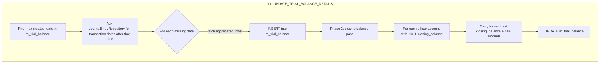
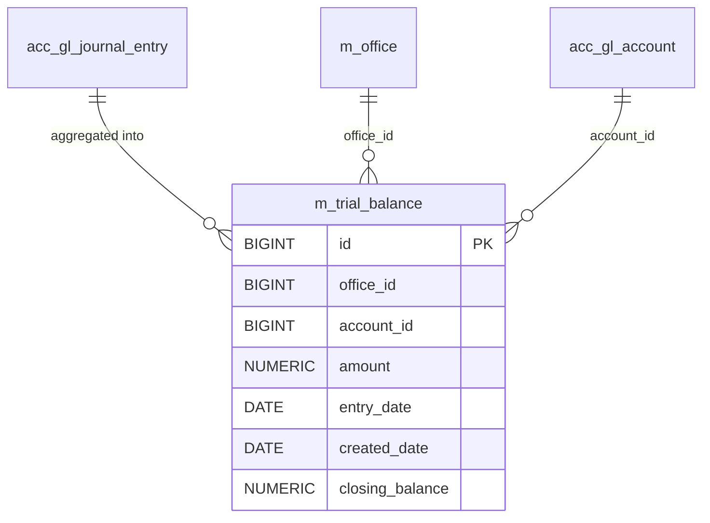

Apache Fineract maintains a denormalised **trial balance** snapshot per
office, GL account and business date so that period-end reporting does not
have to re-aggregate the entire `acc_gl_journal_entry` table. The snapshot is
kept current by a scheduled Spring Batch job — `UPDATE_TRIAL_BALANCE_DETAILS`
— that diff-fills gaps in `m_trial_balance` and rolls forward the closing
balance column.

## Module layout

The whole feature lives inside `fineract-accounting`:

```text
fineract-accounting/src/main/java/org/apache/fineract/accounting/
├── glaccount/
│   ├── domain/
│   │   ├── TrialBalance.java
│   │   ├── TrialBalanceRepository.java
│   │   └── TrialBalanceRepositoryWrapper.java
│   └── jobs/updatetrialbalancedetails/
│       ├── UpdateTrialBalanceDetailsConfig.java
│       └── UpdateTrialBalanceDetailsTasklet.java
└── trialbalance/exception/
    └── TrialBalanceNotFoundException.java
```

The job name itself is registered in
`fineract-core/src/main/java/org/apache/fineract/infrastructure/jobs/service/JobName.java`:

```java
UPDATE_TRIAL_BALANCE_DETAILS("Update Trial Balance Details"),
```

## The `m_trial_balance` table

`TrialBalance` is a flat JPA entity — one row per office / GL account /
business date — that the job populates from journal entries
(`fineract-accounting/src/main/java/org/apache/fineract/accounting/glaccount/domain/TrialBalance.java`):

```java
@Entity
@Table(name = "m_trial_balance")
@Getter @Setter @NoArgsConstructor
@Accessors(chain = true)
public class TrialBalance extends AbstractPersistableCustom<Long> {

    @Column(name = "office_id",      nullable = false) private Long officeId;
    @Column(name = "account_id",     nullable = false) private Long glAccountId;
    @Column(name = "amount",         nullable = false) private BigDecimal amount;
    @Column(name = "entry_date",     nullable = false) private LocalDate entryDate;
    @Column(name = "created_date",   nullable = true)  private LocalDate transactionDate;
    @Column(name = "closing_balance",nullable = false) private BigDecimal closingBalance;
}
```

| Column            | Meaning |
| ----------------- | ------- |
| `office_id`       | Branch / office aggregating the entries. |
| `account_id`      | The GL account from `acc_gl_account`. |
| `amount`          | Net movement for that office+account on `entry_date` (debit positive, credit negative — same sign convention as the source journal entries). |
| `entry_date`      | Business date that the entries were *for*. |
| `created_date`    | Stored in the entity as `transactionDate`; the date the journal entry was actually written. |
| `closing_balance` | Running balance after `amount` is applied. Populated lazily, in a second pass. |

## The `UPDATE_TRIAL_BALANCE_DETAILS` job

The job is configured the same way as every other Fineract Spring Batch
job — a `@Configuration` defining a `Step` that wraps the tasklet — and
registered under the canonical name in `JobName`. The tasklet is the
interesting part. The full `execute()` flow from
`fineract-accounting/src/main/java/org/apache/fineract/accounting/glaccount/jobs/updatetrialbalancedetails/UpdateTrialBalanceDetailsTasklet.java`:

```java
@Override
public RepeatStatus execute(StepContribution contribution, ChunkContext chunkContext) {
    final JdbcTemplate jdbcTemplate = new JdbcTemplate(
            dataSourceServiceFactory.determineDataSourceService().retrieveDataSource());

    processTrialBalanceGaps(jdbcTemplate);
    updateClosingBalances(jdbcTemplate);

    return RepeatStatus.FINISHED;
}
```

Two distinct phases run back-to-back: gap-fill, then closing-balance
roll-forward.



### Phase 1 — gap fill

```java
private void processTrialBalanceGaps(JdbcTemplate jdbcTemplate) {
    LocalDate maxCreatedDate = trialBalanceRepository.findMaxCreatedDate();
    LocalDate baselineDate = maxCreatedDate != null
            ? maxCreatedDate
            : LocalDate.of(2010, 1, 1);
    List<LocalDate> tbGaps = journalEntryRepository.findTransactionDatesAfter(baselineDate);
    for (LocalDate tbGap : tbGaps) {
        if (DateUtils.getExactDifferenceInDays(tbGap, DateUtils.getBusinessLocalDate()) < 1) {
            continue;
        }
        insertTrialBalanceForDate(tbGap);
    }
}
```

Key behaviours:

- **Watermark.** `trialBalanceRepository.findMaxCreatedDate()` is the
  job's bookmark. On a fresh install it has never run, so the baseline
  defaults to `2010-01-01`.
- **Skip today.** Rows for the *current* business date are deliberately
  not aggregated — the COB has not finished posting all of today's
  entries yet, so `DateUtils.getExactDifferenceInDays(tbGap, today) < 1`
  rows are skipped and picked up tomorrow.
- **Aggregation.** `insertTrialBalanceForDate(tbGap)` calls
  `journalEntryRepository.findTrialBalanceLinesForDate(tbGap)` which
  returns the per-office, per-account aggregated debit/credit and the
  most recent transaction date — exactly the six columns of the
  `TrialBalance` entity:

```java
List<TrialBalance> trialBalances = rows.stream().map(row -> {
    TrialBalance tb = new TrialBalance();
    tb.setOfficeId((Long) row[0]);
    tb.setGlAccountId((Long) row[1]);
    tb.setAmount((BigDecimal) row[2]);
    tb.setEntryDate((LocalDate) row[3]);
    tb.setTransactionDate((LocalDate) row[4]);
    tb.setClosingBalance((BigDecimal) row[5]);
    return tb;
}).toList();
trialBalanceRepositoryWrapper.save(trialBalances);
```

At this point new rows have `closing_balance` set to whatever phase 2
hasn't filled in yet — typically `NULL` until the second pass runs.

### Phase 2 — closing-balance roll-forward

```java
private void updateClosingBalances(JdbcTemplate jdbcTemplate) {
    final List<Long> officeIds =
            trialBalanceRepository.findDistinctOfficeIdsWithNullClosingBalance();

    for (Long officeId : officeIds) {
        updateClosingBalancesForOffice(jdbcTemplate, officeId);
    }
}

private void updateClosingBalanceForAccount(JdbcTemplate jdbcTemplate,
        Long officeId, Long accountId) {
    BigDecimal closingBalance = getPreviousClosingBalance(officeId, accountId);
    List<TrialBalance> tbRows =
            trialBalanceRepositoryWrapper.findNewByOfficeAndAccount(officeId, accountId);
    updateTrialBalanceRows(tbRows, closingBalance);
}
```

For every `(office_id, account_id)` pair that still has any
`closing_balance IS NULL` rows, the job:

1. Reads the most recent populated closing balance for the pair via
   `trialBalanceRepository.findLastClosingBalance(officeId, accountId)`,
   defaulting to `BigDecimal.ZERO` on the first run.
2. Iterates the chronologically-ordered new rows
   (`findNewByOfficeAndAccount`) and applies a running addition:

```java
for (TrialBalance row : tbRows) {
    if (closingBalance != null) {
        closingBalance = closingBalance.add(row.getAmount());
    }
    row.setClosingBalance(closingBalance);
}
```

3. JPA dirty-tracking on the managed entities pushes the updates back to
   `m_trial_balance.closing_balance` when the transaction commits.

The split — bulk INSERT first, per-account UPDATE second — keeps
phase 1 cheap and chunkable, while phase 2 reads only the much smaller
set of `(office, account)` keys that actually changed.

## Source tables and joins

The query that backs `findTrialBalanceLinesForDate(date)` (resolved in
`JournalEntryRepository`) walks the journal-entry rows for the date and
aggregates by office/account. Conceptually the SQL is:

```sql
SELECT je.office_id,
       je.account_id,
       SUM(CASE WHEN je.type_enum = 2 THEN  je.amount
                WHEN je.type_enum = 1 THEN -je.amount END) AS amount,
       je.entry_date,
       MAX(je.transaction_date),
       NULL AS closing_balance
  FROM acc_gl_journal_entry je
 WHERE je.entry_date = :date
   AND je.reversed = false
 GROUP BY je.office_id, je.account_id, je.entry_date;
```

(See `acc_gl_journal_entry.type_enum` — `1 = CREDIT`, `2 = DEBIT` — in the
journal-entry domain package next door.)



## Repositories

`TrialBalanceRepository`
(`fineract-accounting/.../glaccount/domain/TrialBalanceRepository.java`)
is the plain Spring Data interface. It exposes the read queries used by
the tasklet (`findMaxCreatedDate`, `findDistinctOfficeIdsWithNullClosingBalance`,
`findDistinctAccountIdsWithNullClosingBalanceByOfficeId`,
`findLastClosingBalance`).

`TrialBalanceRepositoryWrapper`
(`fineract-accounting/.../glaccount/domain/TrialBalanceRepositoryWrapper.java`)
is the service-friendly façade — it provides `save(Iterable)` and
`findNewByOfficeAndAccount(...)` and throws `TrialBalanceNotFoundException`
when a lookup misses.

`TrialBalanceNotFoundException`
(`fineract-accounting/.../trialbalance/exception/TrialBalanceNotFoundException.java`)
extends Fineract's standard `AbstractPlatformResourceNotFoundException`
so it surfaces as a 404 with the `error.msg.trialbalance.id.invalid`
GlobalisationMessageCode.

## Scheduling and operations

The job is a regular Fineract scheduled job — visible in
`/v1/jobs`, runnable on demand via `POST /v1/jobs/{jobId}?command=executeJob`,
and configurable via the standard cron-expression and active/inactive
toggle. Typical cadence is once per day, after the COB job has finalised
the previous business day's postings.

<AccordionGroup>
<Accordion title="First-time bootstrap on a long-lived tenant">
The baseline date hard-coded as `LocalDate.of(2010, 1, 1)` means the
first run on an existing database walks all historical journal-entry
dates back to 2010-01-01. Expect a long first run, then daily
incremental runs that touch only the new dates returned by
`findTransactionDatesAfter(maxCreatedDate)`.
</Accordion>

<Accordion title="Reversing a journal entry after trial balance is built">
Reversal writes a compensating row to `acc_gl_journal_entry`. On the
next tasklet run, that new row appears in `findTrialBalanceLinesForDate`
and produces a new `m_trial_balance` row with the offsetting `amount`.
The previously-stamped `closing_balance` does **not** get rewritten —
only the carry-forward chain from the reversal's `entry_date` onwards.
</Accordion>

<Accordion title="Rebuilding from scratch">
Truncate `m_trial_balance` and rerun the job. The watermark resets to
the 2010-01-01 default and the whole history is rematerialised.
</Accordion>
</AccordionGroup>

## What consumes `m_trial_balance`

- **Trial balance and balance-sheet reports** — the Pentaho/JasperReports
  bundles join `m_trial_balance` to `acc_gl_account` and
  `acc_account_category` to render the regulatory T/B view without
  hammering the journal-entry table.
- **Office-level dashboards** — the most recent `closing_balance` per
  account is the fastest way to render a P&L summary on the head-office
  dashboard.
- **Period-close workflows** — comparing pre- and post-close trial
  balances is the standard cross-check before flipping the
  `closure_id` on `acc_gl_closure`.

## Related domain pages

- `acc_gl_account` and accounting rules — see the GL account
  documentation.
- Journal entries (`acc_gl_journal_entry`) — see the journal-entries
  page for `type_enum`, `reversed`, `office_id` and the posting
  pipeline.
- Office closures and period-end (`acc_gl_closure`) — see the
  closure-management documentation.
