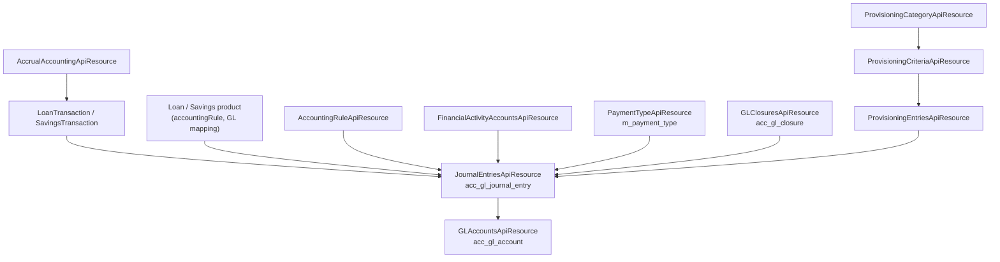

Apache Fineract carries a full double-entry general ledger. Every loan disbursement, repayment, savings deposit, dividend payout and fee waiver eventually produces journal entries against a tenant-specific chart of accounts. The REST API exposes the chart, journals, manual entries, accrual triggers, provisioning, financial-activity GL mappings, and the payment-type catalog. The resources sit in `fineract-accounting/.../api/`, `fineract-provider/.../accounting/.../api/` and `fineract-provider/.../organisation/provisioning/api/`, all mounting under `/fineract-provider/api/v1` — see the [REST API Overview](/api/overview).

## Endpoint summary

| Method | Path | File | Purpose |
| --- | --- | --- | --- |
| GET | `/v1/glaccounts/template` | `GLAccountsApiResource.java` | Code values, currencies and parent GL accounts for the create-account form. |
| GET | `/v1/glaccounts` | `GLAccountsApiResource.java` | Chart of accounts (filter by type, usage, manual-entries-allowed). |
| GET | `/v1/glaccounts/{glAccountId}` | `GLAccountsApiResource.java` | One GL account, including parent and tag values. |
| POST | `/v1/glaccounts` | `GLAccountsApiResource.java` | Create a GL account. |
| PUT | `/v1/glaccounts/{glAccountId}` | `GLAccountsApiResource.java` | Update GL account properties. |
| DELETE | `/v1/glaccounts/{glAccountId}` | `GLAccountsApiResource.java` | Delete (only when unused). |
| GET | `/v1/glaccounts/downloadtemplate` | `GLAccountsApiResource.java` | XLS template for bulk chart import. |
| POST | `/v1/glaccounts/uploadtemplate` | `GLAccountsApiResource.java` | Bulk import a chart of accounts. |
| GET | `/v1/glclosures` | `GLClosuresApiResource.java` | All GL closures (one row per office × period). |
| POST | `/v1/glclosures` | `GLClosuresApiResource.java` | Close a period for an office. |
| PUT | `/v1/glclosures/{glClosureId}` | `GLClosuresApiResource.java` | Edit the comment on a closure. |
| DELETE | `/v1/glclosures/{glClosureId}` | `GLClosuresApiResource.java` | Undo the closure (most recent only). |
| GET | `/v1/journalentries` | `JournalEntriesApiResource.java` | Search journals by office, transactionId, account, date range. |
| GET | `/v1/journalentries/{journalEntryId}` | `JournalEntriesApiResource.java` | One journal entry. |
| POST | `/v1/journalentries` | `JournalEntriesApiResource.java` | Create a manual journal entry. |
| POST | `/v1/journalentries/{transactionId}?command=reverse` | `JournalEntriesApiResource.java` | Reverse a transaction (writes contra entries). |
| GET | `/v1/journalentries/provisioning` | `JournalEntriesApiResource.java` | Journals produced by provisioning runs. |
| GET | `/v1/journalentries/openingbalance` | `JournalEntriesApiResource.java` | Opening balances per office. |
| POST | `/v1/journalentries/uploadtemplate` | `JournalEntriesApiResource.java` | Bulk import journal entries from XLS. |
| GET | `/v1/accountingrules` | `AccountingRuleApiResource.java` | List custom journal-entry rules. |
| POST | `/v1/accountingrules` | `AccountingRuleApiResource.java` | Create an accounting rule. |
| POST | `/v1/runaccruals` | `AccrualAccountingApiResource.java` | Force periodic-accrual processing (normally a job). |
| GET | `/v1/financialactivityaccounts` | `FinancialActivityAccountsApiResource.java` | All financial-activity → GL mappings (asset transfer, cash, etc.). |
| POST | `/v1/financialactivityaccounts` | `FinancialActivityAccountsApiResource.java` | Map a financial activity to a GL account. |
| GET | `/v1/paymenttypes` | `PaymentTypeApiResource.java` | Payment-type catalog (`cash`, `mobile money`, `bank transfer`, …). |
| POST | `/v1/paymenttypes` | `PaymentTypeApiResource.java` | Create a payment type. |
| POST | `/v1/provisioningentries` | `ProvisioningEntriesApiResource.java` | Generate provisioning entries for a date. |
| GET | `/v1/provisioningcategory` | `ProvisioningCategoryApiResource.java` | List provisioning categories. |
| GET | `/v1/provisioningcriteria` | `ProvisioningCriteriaApiResource.java` | Provisioning rules attached to loan products. |
| POST | `/v1/provisioningcriteria` | `ProvisioningCriteriaApiResource.java` | Create provisioning criteria. |

## `GLAccountsApiResource`

File: `fineract-accounting/src/main/java/org/apache/fineract/accounting/glaccount/api/GLAccountsApiResource.java`
Class path: `@Path("/v1/glaccounts")`

The canonical chart-of-accounts resource. Each row in `acc_gl_account` represents an asset, liability, income, expense or equity account; rows are organised in a hierarchical tree via `parent_id`. A header account (`usage=2`) cannot have journal entries posted to it directly — only its detail descendants can.

| Method | Path | Handler |
| --- | --- | --- |
| GET | `/v1/glaccounts/template` | `retrieveNewAccountDetails` |
| GET | `/v1/glaccounts` | `retrieveAllAccounts` |
| GET | `/v1/glaccounts/{glAccountId}` | `retreiveAccount` |
| POST | `/v1/glaccounts` | `createGLAccount` |
| PUT | `/v1/glaccounts/{glAccountId}` | `updateGLAccount` |
| DELETE | `/v1/glaccounts/{glAccountId}` | `deleteGLAccount` |
| GET | `/v1/glaccounts/downloadtemplate` | `getGlAccountsTemplate` |
| POST | `/v1/glaccounts/uploadtemplate` | `postGlAccountsTemplate` |

Notable query parameters on the list endpoint:

- `?manualEntriesAllowed=true` — only detail accounts you can post journals to.
- `?type=1|2|3|4|5` — restrict by account type (asset / liability / equity / income / expense).
- `?usage=1|2` — detail (1) vs header (2).
- `?disabled=false` — exclude inactive accounts.

## `GLClosuresApiResource`

File: `fineract-accounting/src/main/java/org/apache/fineract/accounting/closure/api/GLClosuresApiResource.java`
Class path: `@Path("/v1/glclosures")`

GL closures lock a date for an office: once `(officeId, closingDate)` exists in `acc_gl_closure`, no new journal entry with `entry_date <= closingDate` can be posted for that office. Re-opening means deleting the closure, which is only permitted on the most recent row.

| Method | Path | Handler |
| --- | --- | --- |
| GET | `/v1/glclosures` | `retrieveAllClosures` |
| GET | `/v1/glclosures/{glClosureId}` | `retreiveClosure` |
| POST | `/v1/glclosures` | `createGLClosure` |
| PUT | `/v1/glclosures/{glClosureId}` | `updateGLClosure` |
| DELETE | `/v1/glclosures/{glClosureId}` | `deleteGLClosure` |

The closing is enforced by `JournalEntryWritePlatformServiceJpaRepositoryImpl.validateBusinessRulesForJournalEntries(...)` — every write checks the relevant `GLClosureRepository`.

## `JournalEntriesApiResource`

File: `fineract-provider/src/main/java/org/apache/fineract/accounting/journalentry/api/JournalEntriesApiResource.java`
Class path: `@Path("/v1/journalentries")`

This is the single most important read endpoint for the finance team. It searches `acc_gl_journal_entry` with a rich filter set:

| Query parameter | Use |
| --- | --- |
| `officeId` | Filter to one office. |
| `glAccountId` | Restrict to one GL account. |
| `manualEntriesOnly=true` | Hide system-generated entries. |
| `fromDate` / `toDate` (with `dateFormat`, `locale`) | Date range. |
| `transactionId` | All entries for a single composite transaction. |
| `entityType` / `entityId` | All entries linked to e.g. loan 4711. |
| `runningBalance=true` | Include running balance (more expensive). |

The POST forms support two flavours:

1. **Manual journal entry** — `POST /v1/journalentries` with debit/credit arrays, paymentTypeId, currencyCode, transactionDate.
2. **Reverse a transaction** — `POST /v1/journalentries/{transactionId}?command=reverse` — writes the contra entries against the original `transaction_id` and marks the source `reversed=true`.

The `provisioning` and `openingbalance` paths are read-only short-cuts used by the closure UI.

## `AccountingRuleApiResource`

File: `fineract-accounting/src/main/java/org/apache/fineract/accounting/rule/api/AccountingRuleApiResource.java`
Class path: `@Path("/v1/accountingrules")`

An accounting rule is a saved journal-entry template. Operators select a rule in the manual-journal screen, the platform pre-populates the debit / credit accounts and tags (e.g. fund code, branch dimension), and the operator fills in only the amount and date.

| Method | Path | Handler |
| --- | --- | --- |
| GET | `/v1/accountingrules/template` | `retrieveTemplate` |
| GET | `/v1/accountingrules` | `retrieveAllAccountingRules` |
| GET | `/v1/accountingrules/{accountingRuleId}` | `retreiveAccountingRule` |
| POST | `/v1/accountingrules` | `createAccountingRule` |
| PUT | `/v1/accountingrules/{accountingRuleId}` | `updateAccountingRule` |
| DELETE | `/v1/accountingrules/{accountingRuleId}` | `deleteAccountingRule` |

Rules can be office-scoped (visible only to one office) or organisation-wide.

## `AccrualAccountingApiResource`

File: `fineract-accounting/src/main/java/org/apache/fineract/accounting/accrual/api/AccrualAccountingApiResource.java`
Class path: `@Path("/v1/runaccruals")`

A single POST that triggers the periodic accrual processor for all loans whose products are configured with `accountingRule=3` (accrual-periodic). It runs synchronously and is normally invoked by the `Add accrual transactions` job — see [Configuration & Jobs](/api/configuration-and-jobs).

| Method | Path | Handler |
| --- | --- | --- |
| POST | `/v1/runaccruals` | `executePeriodicAccrualAccounting` |

The payload accepts `tillDate`, `dateFormat`, `locale`. If `tillDate` is omitted the platform uses the business date.

## `FinancialActivityAccountsApiResource`

File: `fineract-accounting/src/main/java/org/apache/fineract/accounting/financialactivityaccount/api/FinancialActivityAccountsApiResource.java`
Class path: `@Path("/v1/financialactivityaccounts")`

Some accounting movements (cash transfers between offices, asset purchase, payable-dividend) cannot be inferred from product configuration; they need a global mapping of "financial activity" → GL account. This resource holds the catalog. Each row is `(financialActivity, glAccountId)`; the financial-activity codes are defined in `FinancialActivity` (`fineract-accounting/.../financialactivityaccount/data/`).

| Method | Path | Handler |
| --- | --- | --- |
| GET | `/v1/financialactivityaccounts/template` | `retrieveTemplate` |
| GET | `/v1/financialactivityaccounts` | `retrieveAll` |
| GET | `/v1/financialactivityaccounts/{mappingId}` | `retreive` |
| POST | `/v1/financialactivityaccounts` | `createGLAccount` |
| PUT | `/v1/financialactivityaccounts/{mappingId}` | `updateGLAccount` |
| DELETE | `/v1/financialactivityaccounts/{mappingId}` | `deleteGLAccount` |

The most commonly mapped activities are:

| Activity | GL account |
| --- | --- |
| ASSET_TRANSFER | Inter-office transfer asset account. |
| LIABILITY_TRANSFER | Inter-office transfer liability account. |
| CASH_AT_MAIN_VAULT | Vault cash. |
| CASH_AT_TELLER | Teller cash drawer. |
| OPENING_BALANCES_TRANSFER_CONTRA | Used by the opening-balance import. |
| PAYABLE_DIVIDENDS | Share-account dividend liability. |

## `PaymentTypeApiResource`

File: `fineract-core/src/main/java/org/apache/fineract/portfolio/paymenttype/api/PaymentTypeApiResource.java`
Class path: `@Path("/v1/paymenttypes")`

The payment-type catalog — rows in `m_payment_type`. Loan products, savings products and accounting rules all refer to payment types by id and the resource hands out the list.

| Method | Path | Handler |
| --- | --- | --- |
| GET | `/v1/paymenttypes` | `getAllPaymentTypes` |
| GET | `/v1/paymenttypes/{paymentTypeId}` | `retrieveOnePaymentType` |
| POST | `/v1/paymenttypes` | `createPaymentType` |
| PUT | `/v1/paymenttypes/{paymentTypeId}` | `updatePaymentType` |
| DELETE | `/v1/paymenttypes/{paymentTypeId}` | `deleteCode` |

Payment types are not just labels — they carry `isCashPayment` and `position` (display order) flags, and they are the join key for product-level `paymentChannelToFundSourceMappings`.

## Provisioning — categories, criteria and entries

The provisioning module produces loan-loss provisioning journal entries based on a delinquency-and-product-driven matrix.

### `ProvisioningEntriesApiResource`

File: `fineract-accounting/src/main/java/org/apache/fineract/accounting/provisioning/api/ProvisioningEntriesApiResource.java`
Class path: `@Path("/v1/provisioningentries")`

A provisioning *entry* is a snapshot — for a given date and (optionally) office it walks every active loan, computes the expected provision based on the active criteria, and produces a row per provisioning category in `m_loan_provisioning_history`. When `createjournalentries=true` it also writes journal entries.

| Method | Path | Handler |
| --- | --- | --- |
| POST | `/v1/provisioningentries` | `createProvisioningEntries` |
| POST | `/v1/provisioningentries/{entryId}?command=createjournalentry\|recreateprovisioningentry` | `modifyProvisioningEntry` |
| GET | `/v1/provisioningentries/{entryId}` | `retrieveProvisioningEntry` |
| GET | `/v1/provisioningentries/entries` | `retrieveProviioningEntries` |
| GET | `/v1/provisioningentries` | `retrieveAllProvisioningEntries` |

### `ProvisioningCategoryApiResource`

File: `fineract-provider/src/main/java/org/apache/fineract/organisation/provisioning/api/ProvisioningCategoryApiResource.java`
Class path: `@Path("/v1/provisioningcategory")`

Defines the **buckets** of provisioning (e.g. `Standard`, `Sub-standard`, `Doubtful`, `Loss`). Each category carries an order so the UI displays them consistently.

| Method | Path | Handler |
| --- | --- | --- |
| GET | `/v1/provisioningcategory` | `retrieveAll` |
| POST | `/v1/provisioningcategory` | `createProvisioningCategory` |
| PUT | `/v1/provisioningcategory/{categoryId}` | `updateProvisioningCategory` |
| DELETE | `/v1/provisioningcategory/{categoryId}` | `deleteProvisioningCategory` |

### `ProvisioningCriteriaApiResource`

File: `fineract-provider/src/main/java/org/apache/fineract/organisation/provisioning/api/ProvisioningCriteriaApiResource.java`
Class path: `@Path("/v1/provisioningcriteria")`

Maps `{loan product, category, days-past-due-range}` → `{provisioning percentage, liability GL, expense GL}`. When a provisioning entry runs it consults the criteria to decide which category each loan belongs in and at what rate to provision.

| Method | Path | Handler |
| --- | --- | --- |
| GET | `/v1/provisioningcriteria/template` | `retrieveTemplate` |
| GET | `/v1/provisioningcriteria` | `retrieveAllProvisioningCriterias` |
| GET | `/v1/provisioningcriteria/{criteriaId}` | `retrieveProvisioningCriteria` |
| POST | `/v1/provisioningcriteria` | `createProvisioningCriteria` |
| PUT | `/v1/provisioningcriteria/{criteriaId}` | `updateProvisioningCriteria` |
| DELETE | `/v1/provisioningcriteria/{criteriaId}` | `deleteProvisioningCriteria` |

A criterion row carries a JSON `definitions` array — each entry being `{ categoryId, minAge, maxAge, provisioningPercentage, liabilityAccount, expenseAccount }`.

## How the resources fit together



## Permissions

| Permission | Endpoints |
| --- | --- |
| `READ_GLACCOUNT`, `CREATE_GLACCOUNT`, `UPDATE_GLACCOUNT`, `DELETE_GLACCOUNT` | `GLAccountsApiResource`. |
| `READ_GLCLOSURE`, `CREATE_GLCLOSURE`, `UPDATE_GLCLOSURE`, `DELETE_GLCLOSURE` | `GLClosuresApiResource`. |
| `READ_JOURNALENTRY`, `CREATE_JOURNALENTRY`, `REVERSE_JOURNALENTRY`, `UPDATE_OPENING_BALANCE_OF_OFFICE` | `JournalEntriesApiResource`. |
| `READ_ACCOUNTINGRULE`, `CREATE_ACCOUNTINGRULE`, `UPDATE_ACCOUNTINGRULE`, `DELETE_ACCOUNTINGRULE` | `AccountingRuleApiResource`. |
| `EXECUTE_PERIODIC_ACCRUAL_ACCOUNTING` | `AccrualAccountingApiResource`. |
| `READ_FINANCIALACTIVITYACCOUNT`, `CREATE_FINANCIALACTIVITYACCOUNT`, `UPDATE_FINANCIALACTIVITYACCOUNT`, `DELETE_FINANCIALACTIVITYACCOUNT` | `FinancialActivityAccountsApiResource`. |
| `READ_PAYMENTTYPE`, `CREATE_PAYMENTTYPE`, `UPDATE_PAYMENTTYPE`, `DELETE_PAYMENTTYPE` | `PaymentTypeApiResource`. |
| `READ_PROVISIONENTRIES`, `CREATE_PROVISIONJOURNALENTRIES`, `RECREATE_PROVISIONENTRIES` | `ProvisioningEntriesApiResource`. |
| `READ_PROVISIONCATEGORY`, `CREATE_PROVISIONCATEGORY`, `UPDATE_PROVISIONCATEGORY`, `DELETE_PROVISIONCATEGORY` | `ProvisioningCategoryApiResource`. |
| `READ_PROVISIONCRITERIA`, `CREATE_PROVISIONCRITERIA`, `UPDATE_PROVISIONCRITERIA`, `DELETE_PROVISIONCRITERIA` | `ProvisioningCriteriaApiResource`. |

## Worked example — manual journal entry

```bash
TENANT='Fineract-Platform-TenantId: default'
HDR='Content-Type: application/json'

# Post a $500 cash movement: debit GL 21 (Cash at vault), credit GL 14 (Loan portfolio)
curl -k -u admin:password -H "$TENANT" -H "$HDR" \
  -X POST https://localhost:8443/fineract-provider/api/v1/journalentries \
  -d '{
    "officeId": 1,
    "transactionDate": "01 April 2024",
    "currencyCode": "USD",
    "paymentTypeId": 1,
    "comments": "Manual adjustment - cash recovered",
    "credits": [ { "glAccountId": 14, "amount": 500 } ],
    "debits":  [ { "glAccountId": 21, "amount": 500 } ],
    "dateFormat": "dd MMMM yyyy", "locale": "en"
  }'
# → { "transactionId": "J12345", "officeId": 1 }

# Reverse it
curl -k -u admin:password -H "$TENANT" -H "$HDR" \
  -X POST 'https://localhost:8443/fineract-provider/api/v1/journalentries/J12345?command=reverse' \
  -d '{ "comments": "Operator error", "transactionDate": "01 April 2024",
        "dateFormat": "dd MMMM yyyy", "locale": "en" }'
```

## Worked example — provisioning run

```bash
# Run provisioning for today and post the matching journal entries
curl -k -u admin:password -H "$TENANT" -H "$HDR" \
  -X POST https://localhost:8443/fineract-provider/api/v1/provisioningentries \
  -d '{
    "date": "30 April 2024",
    "createjournalentries": true,
    "dateFormat": "dd MMMM yyyy", "locale": "en"
  }'
# → { "resourceId": 17 }   # the new provisioning-entry id

# Re-create it (e.g. after fixing a criterion)
curl -k -u admin:password -H "$TENANT" -H "$HDR" \
  -X POST 'https://localhost:8443/fineract-provider/api/v1/provisioningentries/17?command=recreateprovisioningentry' \
  -d '{}'
```

## Worked example — period closure

```bash
# Lock March 2024 for Head Office
curl -k -u admin:password -H "$TENANT" -H "$HDR" \
  -X POST https://localhost:8443/fineract-provider/api/v1/glclosures \
  -d '{ "officeId": 1, "closingDate": "31 March 2024", "comments": "March 2024 close",
        "dateFormat": "dd MMMM yyyy", "locale": "en" }'

# Any subsequent journal entry against office 1 with date <= 31 March 2024 will fail
```

## Related domain documents

- `accounting/` — JPA entities for the GL, journal entry rules, and the accounting processors.
- [Loan Products](/api/loan-products) — `paymentChannelToFundSourceMappings`, `feeToIncomeAccountMappings`, `penaltyToIncomeAccountMappings`.
- [Savings & Deposits](/api/savings-and-deposits) — savings product accounting mappings, share-dividend payouts.
- [Configuration & Jobs](/api/configuration-and-jobs) — the scheduled jobs that drive accrual, provisioning and posting-interest runs.
