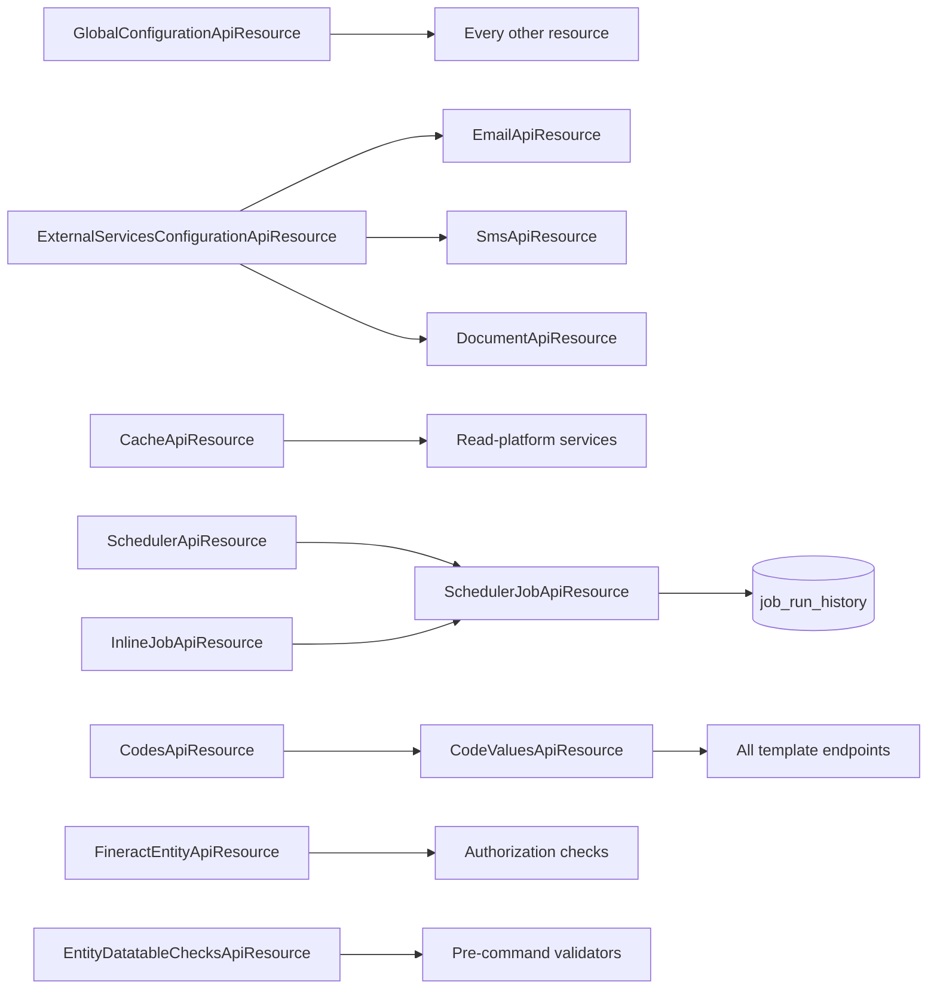

This page covers the **runtime knobs**: the feature flags ("global configurations"), external-service credentials (SMS, S3, SMTP), the in-memory cache implementation, the Quartz-backed scheduler, individual scheduled jobs, the inline-job execution endpoint, the code-value catalog that drives every drop-down in the UI, the cross-entity mapping rules (`m_entity_to_entity_mapping`), and the datatable-check matrix that prevents stage transitions until tenant-defined rows exist.

All endpoints live under `/fineract-provider/api/v1` — see the [REST API Overview](/api/overview).

## Endpoint summary

| Method | Path | File | Purpose |
| --- | --- | --- | --- |
| GET | `/v1/configurations` | `GlobalConfigurationApiResource.java` | All global configuration rows. |
| GET | `/v1/configurations/{configId}` | `GlobalConfigurationApiResource.java` | One configuration by id. |
| GET | `/v1/configurations/name/{name}` | `GlobalConfigurationApiResource.java` | One configuration by name. |
| PUT | `/v1/configurations/{configId}` | `GlobalConfigurationApiResource.java` | Enable / disable / set the value. |
| PUT | `/v1/configurations/name/{configName}` | `GlobalConfigurationApiResource.java` | Same by name. |
| GET | `/v1/externalservice/{servicename}` | `ExternalServicesConfigurationApiResource.java` | Read external-service properties (SMTP, S3, SMS provider). |
| PUT | `/v1/externalservice/{servicename}` | `ExternalServicesConfigurationApiResource.java` | Update external-service properties. |
| GET | `/v1/caches` | `CacheApiResource.java` | The current cache implementation. |
| PUT | `/v1/caches` | `CacheApiResource.java` | Switch cache between `no_cache` and `single_node`. |
| GET | `/v1/scheduler` | `SchedulerApiResource.java` | Scheduler status (`active` / `inactive`). |
| POST | `/v1/scheduler?command=start\|stop` | `SchedulerApiResource.java` | Start or stop the scheduler. |
| GET | `/v1/jobs` | `SchedulerJobApiResource.java` | All scheduled jobs. |
| GET | `/v1/jobs/{jobId}` | `SchedulerJobApiResource.java` | One job. |
| GET | `/v1/jobs/sn/{shortName}` | `SchedulerJobApiResource.java` | One job by short name. |
| GET | `/v1/jobs/{jobId}/runhistory` | `SchedulerJobApiResource.java` | Per-execution audit. |
| POST | `/v1/jobs/{jobId}?command=executeJob` | `SchedulerJobApiResource.java` | Trigger job manually. |
| PUT | `/v1/jobs/{jobId}` | `SchedulerJobApiResource.java` | Edit cron, displayName, active flag. |
| POST | `/v1/jobs/{jobName}/inline` | `InlineJobApiResource.java` | Run a job inline (synchronous, blocking). |
| GET | `/v1/codes` | `CodesApiResource.java` | All codes. |
| GET | `/v1/codes/{codeId}` | `CodesApiResource.java` | One code. |
| GET | `/v1/codes/name/{codeName}` | `CodesApiResource.java` | One code by name. |
| POST | `/v1/codes` | `CodesApiResource.java` | Create a user-defined code. |
| GET | `/v1/codes/{codeId}/codevalues` | `CodeValuesApiResource.java` | Values inside a code. |
| POST | `/v1/codes/{codeId}/codevalues` | `CodeValuesApiResource.java` | Add a code value. |
| PUT | `/v1/codes/{codeId}/codevalues/{codeValueId}` | `CodeValuesApiResource.java` | Update a code value. |
| GET | `/v1/entitytoentitymapping` | `FineractEntityApiResource.java` | All entity-to-entity mappings. |
| POST | `/v1/entitytoentitymapping/{relId}` | `FineractEntityApiResource.java` | Add a mapping for a relation. |
| PUT | `/v1/entitytoentitymapping/{mapId}` | `FineractEntityApiResource.java` | Update a mapping. |
| GET | `/v1/entityDatatableChecks` | `EntityDatatableChecksApiResource.java` | All configured datatable checks. |
| POST | `/v1/entityDatatableChecks` | `EntityDatatableChecksApiResource.java` | Add a check (e.g. require KYC datatable row before approval). |

## `GlobalConfigurationApiResource`

File: `fineract-provider/src/main/java/org/apache/fineract/infrastructure/configuration/api/GlobalConfigurationApiResource.java`
Class path: `@Path("/v1/configurations")`

Rows in `c_configuration` are the platform's feature-flag store. Examples (canonical names you'll see in production):

- `maker-checker` — turns the maker-checker workflow on/off globally.
- `amazon-S3` — switches document storage to S3.
- `force-password-reset-days` — forces password rotation after N days.
- `enable-business-date` — toggles the `BusinessDate` system clock override.
- `enable-account-number-preferences` — global override for `AccountNumberFormat`.

The resource lets you read by id or by name and update both ways:

| Method | Path | Handler |
| --- | --- | --- |
| GET | `/v1/configurations` | `retrieveConfiguration` |
| GET | `/v1/configurations/{configId}` | `retrieveOne` |
| GET | `/v1/configurations/name/{name}` | `retrieveOneByName` |
| PUT | `/v1/configurations/{configId}` | `updateConfiguration` |
| PUT | `/v1/configurations/name/{configName}` | `updateConfigurationByName` |

Configurations can hold a string (`stringValue`), a number (`value`), a date (`dateValue`) and a boolean (`enabled`). The validator in `GlobalConfigurationWritePlatformService` enforces which is meaningful per name.

## `ExternalServicesConfigurationApiResource`

File: `fineract-provider/src/main/java/org/apache/fineract/infrastructure/configuration/api/ExternalServicesConfigurationApiResource.java`
Class path: `@Path("/v1/externalservice")`

Three named services are read and written here: `S3`, `SMTP` and `SMS`. Each gets a string of key/value pairs in `c_external_service_properties`. The PUT replaces the values you send; unmentioned keys are left untouched.

| Method | Path | Handler |
| --- | --- | --- |
| GET | `/v1/externalservice/{servicename}` | `retrieveOne` |
| PUT | `/v1/externalservice/{servicename}` | `updateExternalServiceProperties` |

Typical payload to set SMTP:

```json
{
  "username": "noreply@example.com",
  "password": "•••",
  "host": "smtp.example.com",
  "port": "587",
  "useTLS": "true",
  "fromEmail": "noreply@example.com",
  "fromName": "Loans Team"
}
```

## `CacheApiResource`

File: `fineract-core/src/main/java/org/apache/fineract/infrastructure/cache/api/CacheApiResource.java`
Class path: `@Path("/v1/caches")`

A tiny resource to swap the configured `CacheManager` at runtime. Two values are supported: `no_cache` and `single_node`. There is no `distributed` option in the OSS distribution.

| Method | Path | Handler |
| --- | --- | --- |
| GET | `/v1/caches` | `retrieveAll` |
| PUT | `/v1/caches` | `switchCache` |

## `SchedulerApiResource`

File: `fineract-provider/src/main/java/org/apache/fineract/infrastructure/jobs/api/SchedulerApiResource.java`
Class path: `@Path("/v1/scheduler")`

The top-level switch for the Quartz scheduler. The POST is a dispatcher (`?command=start` or `?command=stop`).

| Method | Path | Handler |
| --- | --- | --- |
| GET | `/v1/scheduler` | `retrieveStatus` |
| POST | `/v1/scheduler?command=…` | `changeSchedulerStatus` |

When the scheduler is stopped, all triggers are paused; reads remain available. The job-execution audit table `job_run_history` keeps the last status for each job.

## `SchedulerJobApiResource`

File: `fineract-provider/src/main/java/org/apache/fineract/infrastructure/jobs/api/SchedulerJobApiResource.java`
Class path: `@Path("/v1/jobs")`

Lists and manipulates individual jobs (the rows in `job`). Each job is identified by id or by its `shortName` (e.g. `LDC` for `Loan Delinquency Classification`). The same operations are exposed under both addressing modes.

| Method | Path | Handler |
| --- | --- | --- |
| GET | `/v1/jobs` | `retrieveAll` |
| GET | `/v1/jobs/{jobId}` | `retrieveOne` |
| GET | `/v1/jobs/sn/{shortName}` | `retrieveByShortName` |
| GET | `/v1/jobs/{jobId}/runhistory` | `retrieveHistory` |
| GET | `/v1/jobs/sn/{shortName}/runhistory` | `retrieveHistoryByShortName` |
| POST | `/v1/jobs/{jobId}?command=executeJob` | `executeJob` |
| POST | `/v1/jobs/sn/{shortName}?command=executeJob` | `executeJobByShortName` |
| PUT | `/v1/jobs/{jobId}` | `updateJobDetail` |
| PUT | `/v1/jobs/sn/{shortName}` | `updateJobDetailByShortName` |

The update payload accepts:

- `cronExpression` — Quartz expression.
- `displayName` — UI label.
- `active` — boolean, soft-disables without removing the row.

The list of bundled jobs (`Update loan summary`, `Update loan arrears ageing`, `Apply annual fee for savings`, `Loan COB`, `Add accrual transactions`, etc.) lives under `jobs/` in this wiki.

## `InlineJobApiResource`

File: `fineract-provider/src/main/java/org/apache/fineract/infrastructure/jobs/api/InlineJobApiResource.java`
Class path: `@Path("/v1/jobs")`

One endpoint, intentionally separated from the regular scheduler endpoint so it can carry its own permission name (`EXECUTE_INLINEJOB`).

| Method | Path | Handler |
| --- | --- | --- |
| POST | `/v1/jobs/{jobName}/inline` | `executeInlineJob` |

The call runs the job synchronously, in the calling thread. This is the integration-test path used by `fineract-provider/src/test/...` and by maintenance scripts that need a deterministic result.

## `CodesApiResource` & `CodeValuesApiResource`

Files:
- `fineract-provider/src/main/java/org/apache/fineract/infrastructure/codes/api/CodesApiResource.java`
- `fineract-provider/src/main/java/org/apache/fineract/infrastructure/codes/api/CodeValuesApiResource.java`

`@Path("/v1/codes")` for both — Jersey separates them by sub-path.

Codes are the platform's enumeration store. A *code* has a `name` (`ClientType`, `Country`, `Occupation`) and an arbitrary list of *code values* (`Salaried`, `Self-employed`, …). Every drop-down the UI renders for an enum-like field is backed by a `(codeName, codeValueId)` lookup.

### Codes (`CodesApiResource`)

| Method | Path | Handler |
| --- | --- | --- |
| GET | `/v1/codes` | `retrieveCodes` |
| GET | `/v1/codes/{codeId}` | `retrieveCode` |
| GET | `/v1/codes/name/{codeName}` | `retrieveCodeByName` |
| POST | `/v1/codes` | `createCode` |
| PUT | `/v1/codes/{codeId}` | `updateCode` |
| DELETE | `/v1/codes/{codeId}` | `deleteCode` |

System codes (`is_system_defined=true`, e.g. `LoanCollateralProperty`) cannot be deleted.

### Code values (`CodeValuesApiResource`)

| Method | Path | Handler |
| --- | --- | --- |
| GET | `/v1/codes/{codeId}/codevalues` | `retrieveAllCodeValues` |
| GET | `/v1/codes/{codeId}/codevalues/{codeValueId}` | `retrieveCodeValue` |
| POST | `/v1/codes/{codeId}/codevalues` | `createCodeValue` |
| PUT | `/v1/codes/{codeId}/codevalues/{codeValueId}` | `updateCodeValue` |
| DELETE | `/v1/codes/{codeId}/codevalues/{codeValueId}` | `deleteCodeValue` |

Same operations are exposed by-name under `/v1/codes/name/{codeName}/codevalues/...`.

## `FineractEntityApiResource`

File: `fineract-provider/src/main/java/org/apache/fineract/infrastructure/entityaccess/api/FineractEntityApiResource.java`
Class path: `@Path("/v1/entitytoentitymapping")`

The entity-to-entity mapping subsystem lets you express "Office A is allowed to assign Office B's clients", "Loan Officer X is allowed to handle this fund", and similar relational restrictions. Each relation has an id (the `relId` path-parameter) and a set of mappings `{ fromId, toId, startDate, endDate }`.

| Method | Path | Handler |
| --- | --- | --- |
| GET | `/v1/entitytoentitymapping` | `retrieveAll` |
| GET | `/v1/entitytoentitymapping/{mapId}` | `retrieveOne` |
| GET | `/v1/entitytoentitymapping/{mapId}/{fromId}/{toId}` | `getEntityToEntityMappings` |
| POST | `/v1/entitytoentitymapping/{relId}` | `createMap` |
| PUT | `/v1/entitytoentitymapping/{mapId}` | `updateMap` |
| DELETE | `/v1/entitytoentitymapping/{mapId}` | `delete` |

The relation catalog is read-only and ships in `m_entity_relation`. Mappings are stored in `m_entity_to_entity_mapping`.

## `EntityDatatableChecksApiResource`

File: `fineract-provider/src/main/java/org/apache/fineract/infrastructure/dataqueries/api/EntityDatatableChecksApiResource.java`
Class path: `@Path("/v1/entityDatatableChecks")`

Datatable checks are the platform's way of saying "before a client can be activated, datatable `client_kyc` must have a row for them". The check matrix is `(entity, status, datatable, productId?)`; the validator runs before every relevant command.

| Method | Path | Handler |
| --- | --- | --- |
| GET | `/v1/entityDatatableChecks` | `retrieveAll` |
| GET | `/v1/entityDatatableChecks/template` | `getTemplate` |
| POST | `/v1/entityDatatableChecks` | `createEntityDatatableCheck` |
| DELETE | `/v1/entityDatatableChecks/{entityDatatableCheckId}` | `deleteDatatable` |

Supported entities are listed in `EntityTables` (`fineract-provider/.../infrastructure/dataqueries/data/`); supported statuses follow `StatusEnum` per entity.

## How these resources relate



## Notable global configurations

The seeded rows in `c_configuration` carry stable names that integrations rely on. The most commonly read or toggled:

| Name | Default | Effect |
| --- | --- | --- |
| `maker-checker` | off | Globally enable the maker-checker workflow. Per-permission opt-in via `PermissionsApiResource`. |
| `amazon-S3` | off | Switch document storage from filesystem to S3. Uses the `S3` external-service properties. |
| `enable-business-date` | off | Allow `BusinessDateApiResource` to override the system clock. |
| `enable-cob-bulk-event` | on | Emit a single bulk event per COB partition instead of per loan. |
| `enable-account-number-preferences` | off | Apply `AccountNumberFormat` rules at entity creation. |
| `enable-payment-hub-integration` | off | Hand off transactions to Mojaloop / payment hub. |
| `force-password-reset-days` | 0 | Force a password rotation after N days. |
| `min-clients-in-group` / `max-clients-in-group` | 5 / 5 | Group size enforcement. |
| `loan-overdue-days-for-arrears` | 0 | Days before a missed installment becomes "in arrears". |
| `loan-reschedule-is-compound-interest` | off | Compounding behaviour on rescheduling. |
| `enable-address` | off | Show the address tab on clients. |
| `meetings-mandatory-for-jlg-loans` | off | JLG (joint-liability group) loans require an active meeting. |
| `is-cob-date-adjusted` | off | Tweak how `LastClosedBusinessDate` interacts with weekends. |
| `interest-charged-from-date-as-disbursement-date` | off | Force first-installment-interest accrual to start from the disbursement date. |

The full list and their seed values live in `fineract-provider/src/main/resources/db/changelog/tenant/` Liquibase changelogs.

## Permissions

| Permission | Endpoints |
| --- | --- |
| `READ_CONFIGURATION`, `UPDATE_CONFIGURATION`, `UPDATE_CONFIGURATION_CHECKER` | `GlobalConfigurationApiResource`. |
| `READ_EXTERNALSERVICE`, `UPDATE_EXTERNALSERVICE` | `ExternalServicesConfigurationApiResource`. |
| `READ_CACHE`, `UPDATE_CACHE` | `CacheApiResource`. |
| `READ_SCHEDULER`, `UPDATE_SCHEDULER` | `SchedulerApiResource`. |
| `READ_JOB`, `UPDATE_JOB`, `EXECUTEJOB` | `SchedulerJobApiResource`. |
| `EXECUTE_INLINEJOB` | `InlineJobApiResource`. |
| `READ_CODE`, `CREATE_CODE`, `UPDATE_CODE`, `DELETE_CODE` | `CodesApiResource`. |
| `READ_CODEVALUE`, `CREATE_CODEVALUE`, `UPDATE_CODEVALUE`, `DELETE_CODEVALUE` | `CodeValuesApiResource`. |
| `READ_ENTITYMAPPING`, `CREATE_ENTITYMAPPING`, `UPDATE_ENTITYMAPPING`, `DELETE_ENTITYMAPPING` | `FineractEntityApiResource`. |
| `READ_DATATABLE_CHECK`, `CREATE_DATATABLE_CHECK`, `DELETE_DATATABLE_CHECK` | `EntityDatatableChecksApiResource`. |

## Worked example — enable maker-checker and force one permission to require approval

```bash
TENANT='Fineract-Platform-TenantId: default'
HDR='Content-Type: application/json'

# 1. Turn the global feature flag on
curl -k -u admin:password -H "$TENANT" -H "$HDR" \
  -X PUT 'https://localhost:8443/fineract-provider/api/v1/configurations/name/maker-checker' \
  -d '{ "enabled": true }'

# 2. Require checker approval for DISBURSE_LOAN
curl -k -u admin:password -H "$TENANT" -H "$HDR" \
  -X PUT https://localhost:8443/fineract-provider/api/v1/permissions \
  -d '{ "permissions": { "DISBURSE_LOAN": true } }'

# 3. Verify
curl -k -u admin:password -H "$TENANT" \
  https://localhost:8443/fineract-provider/api/v1/permissions | \
  jq '.[] | select(.code=="DISBURSE_LOAN")'
```

## Worked example — schedule a new code-driven drop-down

```bash
# 1. Create a user-defined code
curl -k -u admin:password -H "$TENANT" -H "$HDR" \
  -X POST https://localhost:8443/fineract-provider/api/v1/codes \
  -d '{ "name": "ClientChannelOfAcquisition", "systemDefined": false }'
# → { "resourceId": 84 }

# 2. Populate code values
for V in "Branch walk-in" "Mobile sales agent" "Referral" "Online application"; do
  curl -k -u admin:password -H "$TENANT" -H "$HDR" \
    -X POST https://localhost:8443/fineract-provider/api/v1/codes/84/codevalues \
    -d "{ \"name\": \"$V\", \"position\": 0 }"
done

# 3. Reference the code from a custom datatable column
#    (CREATE_TYPE 'Code Lookup' with codeName='ClientChannelOfAcquisition'
#     on POST /v1/datatables, see Reports & Datatables)
```

## Related domain documents

- `configuration/` — Liquibase changelogs that seed `c_configuration` and `c_external_service`.
- `jobs/` — the catalog of bundled jobs and their semantics.
- `core/` — the `JobBean` and `JobConfig` Spring Batch wiring.
- `reporting/` — datatable definitions consumed by `EntityDatatableChecksApiResource`.
- [Security & Users](/api/security-and-users) — permissions like `EXECUTE_INLINEJOB`, `UPDATE_GLOBALCONFIGURATION`.
