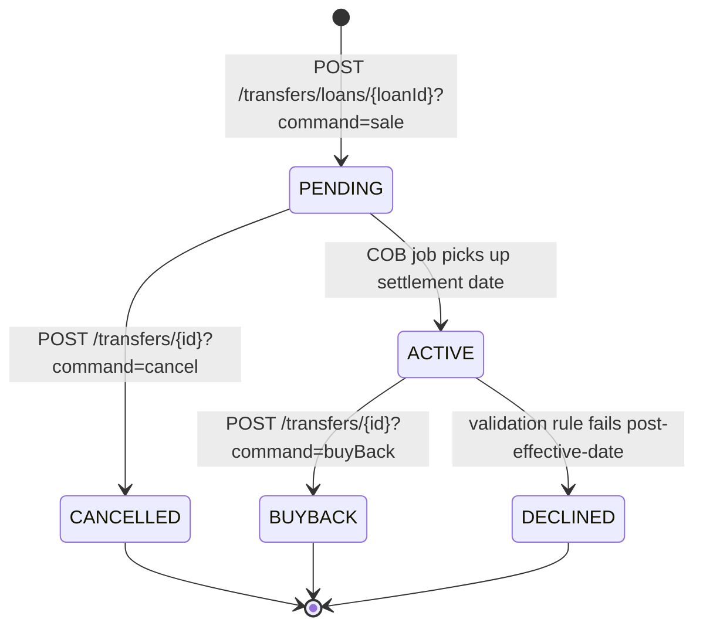

The investor and external-events surface lets Apache Fineract participate in larger refinancing and capital-markets stacks. The `fineract-investor` module models third parties that **own** loans on the platform's books: an investor buys a portfolio of loans, the platform records the transfer, recalculates ownership for accounting and reporting, and emits a stream of business events the buyer (or a downstream warehouse) can consume. The matching event-configuration resource lives in `fineract-core` and tells the platform which of the many business events to publish.

All endpoints live under `/fineract-provider/api/v1` — see the [REST API Overview](/api/overview).

## Endpoint summary

| Method | Path | File | Purpose |
| --- | --- | --- | --- |
| POST | `/v1/external-asset-owners` | `ExternalAssetOwnersApiResource.java` | Create an external asset owner (investor). |
| GET | `/v1/external-asset-owners` | `ExternalAssetOwnersApiResource.java` | List owners. |
| POST | `/v1/external-asset-owners/search` | `ExternalAssetOwnersApiResource.java` | Free-text search across owners. |
| POST | `/v1/external-asset-owners/transfers/loans/{loanId}` | `ExternalAssetOwnersApiResource.java` | Open a transfer request for one loan. |
| POST | `/v1/external-asset-owners/transfers/loans/external-id/{loanExternalId}` | `ExternalAssetOwnersApiResource.java` | Same, addressed by external loan id. |
| POST | `/v1/external-asset-owners/transfers/{id}?command=…` | `ExternalAssetOwnersApiResource.java` | Drive the transfer state machine — `cancel`, `sale`, `intermediarySale`, `buyBack`. |
| POST | `/v1/external-asset-owners/transfers/external-id/{externalId}?command=…` | `ExternalAssetOwnersApiResource.java` | Same by external transfer id. |
| GET | `/v1/external-asset-owners/transfers` | `ExternalAssetOwnersApiResource.java` | List transfers (by status, owner, loan). |
| GET | `/v1/external-asset-owners/transfers/active-transfer?loanId=…` | `ExternalAssetOwnersApiResource.java` | Currently-active transfer for a loan. |
| GET | `/v1/external-asset-owners/transfers/{transferId}/journal-entries` | `ExternalAssetOwnersApiResource.java` | Journal entries booked by the transfer. |
| GET | `/v1/external-asset-owners/owners/external-id/{ownerExternalId}/journal-entries` | `ExternalAssetOwnersApiResource.java` | All journal entries for an owner. |
| GET | `/v1/external-asset-owners/loan-product/{loanProductId}/attributes` | `ExternalAssetOwnerLoanProductAttributesApiResource.java` | Owner attributes per loan product. |
| POST | `/v1/external-asset-owners/loan-product/{loanProductId}/attributes` | `ExternalAssetOwnerLoanProductAttributesApiResource.java` | Set transfer-eligibility attributes for a product. |
| PUT | `/v1/external-asset-owners/loan-product/{loanProductId}/attributes/{id}` | `ExternalAssetOwnerLoanProductAttributesApiResource.java` | Update an attribute. |
| GET | `/v1/externalevents/configuration` | `ExternalEventConfigurationApiResource.java` | List business events and their on/off flags. |
| PUT | `/v1/externalevents/configuration` | `ExternalEventConfigurationApiResource.java` | Enable / disable events in bulk. |

## `ExternalAssetOwnersApiResource`

File: `fineract-investor/src/main/java/org/apache/fineract/investor/api/ExternalAssetOwnersApiResource.java`
Class path: `@Path("/v1/external-asset-owners")`

The resource owns three sub-domains: **owners** (the investors), **transfers** (the per-loan ownership move) and **journal entries** (a convenience read into the GL postings these movements produce).

### Owners

| Method | Path | Handler |
| --- | --- | --- |
| POST | `/v1/external-asset-owners` | `createExternalAssetOwner` |
| GET | `/v1/external-asset-owners` | `retrieveExternalAssetOwners` |
| POST | `/v1/external-asset-owners/search` | `searchInvestorData` |

Each owner row carries an `external_id`, name, optional address, and metadata. The numeric primary key is purposely *never* used in cross-system integrations; everything is keyed by `external_id`.

### Transfers

A transfer is a state machine: `PENDING` → `ACTIVE` (owner takes possession) → `BUYBACK_PENDING` → `BUYBACK` (institution buys the loan back) or `CANCELLED` / `DECLINED`. Each transition writes a row to `m_external_asset_owner_transfer_journal_entry` with the booking the move produces.

| Method | Path | Handler | Purpose |
| --- | --- | --- | --- |
| POST | `/v1/external-asset-owners/transfers/loans/{loanId}` | `transferRequestWithLoanId` | Sell loan to owner (or schedule buyback). |
| POST | `/v1/external-asset-owners/transfers/loans/external-id/{loanExternalId}` | `transferRequestWithLoanExternalId` | Same by external loan id. |
| POST | `/v1/external-asset-owners/transfers/{id}?command=…` | `transferRequestWithId` | Dispatch by command — `cancel`, `sale`, `intermediarySale`, `buyBack` (the dispatcher's full registry lives in `COMMAND_HANDLER_REGISTRY`). |
| POST | `/v1/external-asset-owners/transfers/external-id/{externalId}?command=…` | `transferRequestWithId` | Same by external transfer id. |
| GET | `/v1/external-asset-owners/transfers` | `getTransfers` | Search transfers. |
| GET | `/v1/external-asset-owners/transfers/active-transfer` | `getActiveTransfer` | Currently-active transfer for `?loanId=` or `?externalLoanId=`. |

Posting a transfer JSON looks roughly like:

```json
{
  "ownerExternalId": "INV-0042",
  "transferExternalId": "TRF-2024-04-001",
  "settlementDate": "01 April 2024",
  "purchasePriceRatio": "1.00",
  "dateFormat": "dd MMMM yyyy",
  "locale": "en"
}
```

A `purchasePriceRatio` below `1.00` represents a discount; above `1.00`, a premium. The platform books the premium/discount against the GL accounts mapped through `FinancialActivityAccountsApiResource` (see [Accounting](/api/accounting)).

### Journal entries

Two reads expose how transfers affect the GL:

| Method | Path | Handler |
| --- | --- | --- |
| GET | `/v1/external-asset-owners/transfers/{transferId}/journal-entries` | `getJournalEntriesOfTransfer` |
| GET | `/v1/external-asset-owners/owners/external-id/{ownerExternalId}/journal-entries` | `getJournalEntriesOfOwner` |

These return projections of `acc_gl_journal_entry` filtered to the rows produced by the transfer pipeline. The underlying resource for ad-hoc journal queries is `JournalEntriesApiResource`.

## `ExternalAssetOwnerLoanProductAttributesApiResource`

File: `fineract-investor/src/main/java/org/apache/fineract/investor/api/ExternalAssetOwnerLoanProductAttributesApiResource.java`
Class path: `@Path("/v1/external-asset-owners/loan-product")`

Per-product configuration that decides which loans are *eligible* to be sold to which owners. Each attribute row is `{ loanProductId, attributeKey, attributeValue }`. Common keys include eligibility flags, max-DPD before a sold loan must be repurchased, and the default settlement window.

| Method | Path | Handler |
| --- | --- | --- |
| GET | `/v1/external-asset-owners/loan-product/{loanProductId}/attributes` | `getExternalAssetOwnerLoanProductAttributes` |
| POST | `/v1/external-asset-owners/loan-product/{loanProductId}/attributes` | `postExternalAssetOwnerLoanProductAttribute` |
| PUT | `/v1/external-asset-owners/loan-product/{loanProductId}/attributes/{id}` | `updateLoanProductAttribute` |

The transfer pipeline reads these attributes when validating a new transfer request and rejects ineligible combinations with a `validation.msg.…` error.

## `ExternalEventConfigurationApiResource`

File: `fineract-core/src/main/java/org/apache/fineract/infrastructure/event/external/api/ExternalEventConfigurationApiResource.java`
Class path: `@Path("/v1/externalevents/configuration")`

Apache Fineract publishes a stream of business events — loan disbursements, repayments, charge applications, savings deposits, dividend payouts, COB completions, external-asset transfers — to a configured sink (the channel is selected by Spring profile: `messaging-rabbitmq`, `messaging-kafka`, `messaging-activemq`, or the in-process `MessageGatewayConfiguration`).

This resource exposes the **catalog** of event types and lets you enable / disable each one without redeploying. The configuration is stored in `m_external_event_configuration`.

| Method | Path | Handler |
| --- | --- | --- |
| GET | `/v1/externalevents/configuration` | `getExternalEventConfigurations` |
| PUT | `/v1/externalevents/configuration` | `updateExternalEventConfigurations` |

The PUT payload is a key/boolean map:

```json
{
  "externalEventConfigurations": {
    "LoanApprovedBusinessEvent":         true,
    "LoanDisbursalBusinessEvent":        true,
    "LoanTransactionMakeRepaymentPostBusinessEvent": true,
    "LoanProductCreateBusinessEvent":    false,
    "ClientActivateBusinessEvent":       true,
    "SavingsDepositBusinessEvent":       true,
    "ExternalAssetOwnerTransferBusinessEvent": true,
    "LoanAccountDelinquencyPauseChangedBusinessEvent": true
  }
}
```

Events that are turned off are still emitted on the internal Spring event bus (the platform itself depends on some of them) but are *not* serialised to the external sink. The full list of event types lives in `fineract-core/src/main/java/org/apache/fineract/infrastructure/event/business/domain/` — every `*BusinessEvent` class corresponds to a row in `m_external_event_configuration`.

## How the investor pipeline works

```mermaid
flowchart LR
  Eligibility[ExternalAssetOwnerLoanProductAttributesApiResource]
  Owner[POST /v1/external-asset-owners<br/>create owner]
  Transfer[POST /v1/external-asset-owners/transfers/loans/{loanId}]
  COBJob["COB job<br/>External asset transfer<br/>(jobs/)"]
  Active["Transfer moves to ACTIVE"]
  JE[GL postings via JournalEntriesApiResource]
  Event["ExternalAssetOwnerTransferBusinessEvent"]
  Sink["External sink (Kafka/RabbitMQ/ActiveMQ)<br/>gated by ExternalEventConfigurationApiResource"]
  Buyback["POST /v1/external-asset-owners/transfers/{id}?command=buyBack<br/>buyback flow"]
  Eligibility --> Transfer
  Owner --> Transfer
  Transfer --> COBJob --> Active --> JE
  Active --> Event --> Sink
  Active --> Buyback
```

The settlement and buyback bookings rely on dedicated rows in `FinancialActivityAccountsApiResource` (mappings such as `ASSET_OWNER_TRANSFER`, `ASSET_OWNER_TRANSFER_INCOME_FROM_PREMIUM`, `ASSET_OWNER_TRANSFER_EXPENSE_FROM_DISCOUNT`).

## Transfer state machine

A transfer row in `m_external_asset_owner_transfer` walks through the following states:



- **PENDING** — created by the API, settlement date is in the future.
- **ACTIVE** — the COB job has run on or after the settlement date and the loan now belongs to the external owner.
- **BUYBACK** — the institution has purchased the loan back from the owner.
- **CANCELLED** / **DECLINED** — terminal failure states.

Status transitions are driven by the `External asset owner transfer` job (`fineract-investor/.../service/`); see `jobs/` for the schedule.

## Journal-entry side effects

Each state transition books a specific pattern:

| Transition | Debit | Credit |
| --- | --- | --- |
| PENDING → ACTIVE (sale at par) | External-owner asset account (loan now off institution's books) | Loan portfolio account |
| PENDING → ACTIVE (sale at discount) | External-owner asset account + discount-expense account | Loan portfolio account |
| PENDING → ACTIVE (sale at premium) | External-owner asset account | Loan portfolio account + premium-income account |
| ACTIVE → BUYBACK | Loan portfolio account (loan returns) | External-owner asset account |

The premium-income, discount-expense and external-owner asset accounts are resolved through `FinancialActivityAccountsApiResource` (see [Accounting](/api/accounting)). If any of those mappings is missing, the transfer activation fails with a clear `validation.msg.financial.activity.mapping.…` error.

## External business events

The investor pipeline produces several `*BusinessEvent` types — every state transition emits one and every cash flow that ends up on a transferred loan emits another. The ones to look for in the `m_external_event` rows:

| Event | When |
| --- | --- |
| `ExternalAssetOwnerTransferBusinessEvent` | Pending or active transfer state change. |
| `LoanOwnershipTransferBusinessEvent` | Loan flips from institution to owner (or back). |
| `LoanAccountSnapshotBusinessEvent` | Loan financial state at settlement, for owner-side reconciliation. |
| `LoanRepaymentTransactionPostBusinessEvent` | Each repayment on a transferred loan (the owner gets the cash). |

The full catalog is `fineract-core/src/main/java/org/apache/fineract/infrastructure/event/business/domain/loan/owner/`. Use `ExternalEventConfigurationApiResource` to enable or disable each one.

## Worked example

```bash
# 1. Create the investor
curl -k -u admin:password \
  -H 'Fineract-Platform-TenantId: default' \
  -H 'Content-Type: application/json' \
  -X POST 'https://localhost:8443/fineract-provider/api/v1/external-asset-owners' \
  -d '{ "externalId": "INV-0042", "name": "Acme Capital Fund LP" }'

# 2. Set eligibility attributes on a loan product
curl -k -u admin:password \
  -H 'Fineract-Platform-TenantId: default' \
  -H 'Content-Type: application/json' \
  -X POST 'https://localhost:8443/fineract-provider/api/v1/external-asset-owners/loan-product/7/attributes' \
  -d '{ "attributeKey": "eligibleForSale", "attributeValue": "true" }'

# 3. Sell loan 911 to the investor at a 2% discount
curl -k -u admin:password \
  -H 'Fineract-Platform-TenantId: default' \
  -H 'Content-Type: application/json' \
  -X POST 'https://localhost:8443/fineract-provider/api/v1/external-asset-owners/transfers/loans/911?command=sale' \
  -d '{
    "ownerExternalId": "INV-0042",
    "transferExternalId": "TRF-2024-04-001",
    "settlementDate": "01 April 2024",
    "purchasePriceRatio": "0.98",
    "dateFormat": "dd MMMM yyyy",
    "locale": "en"
  }'

# 4. After COB has activated the transfer, inspect the journal entries
curl -k -u admin:password \
  -H 'Fineract-Platform-TenantId: default' \
  'https://localhost:8443/fineract-provider/api/v1/external-asset-owners/transfers/151/journal-entries'

# 5. Later, buy the loan back
curl -k -u admin:password \
  -H 'Fineract-Platform-TenantId: default' \
  -H 'Content-Type: application/json' \
  -X POST 'https://localhost:8443/fineract-provider/api/v1/external-asset-owners/transfers/151?command=buyBack' \
  -d '{ "settlementDate": "30 September 2024", "dateFormat": "dd MMMM yyyy", "locale": "en" }'
```

## Operational notes

- The transfer endpoints are **idempotent on `transferExternalId`** — re-posting the same external id returns the existing pending transfer rather than creating a duplicate. This matters when the caller's retry policy is aggressive.
- The `purchasePriceRatio` is a *decimal* (string representation accepted). The platform multiplies by the loan's outstanding principal at settlement to determine the cash leg.
- Once `ACTIVE`, the platform **continues to accrue interest, post charges and update delinquency** on the loan; what changes is who receives the cash on each repayment. The owner-side cash flow is exposed through the `*JournalEntries` endpoints and the matching external events.
- `LoansPointInTimeApiResource` (see [Loans](/api/loans)) is the canonical way for the owner to reconcile their book to the institution's view as of a given date.

## Permissions

| Permission | Endpoints |
| --- | --- |
| `READ_EXTERNALASSETOWNER`, `CREATE_EXTERNALASSETOWNER` | `ExternalAssetOwnersApiResource` owner endpoints. |
| `READ_EXTERNALASSETOWNERTRANSFER`, `CREATE_EXTERNALASSETOWNERTRANSFER`, `UPDATE_EXTERNALASSETOWNERTRANSFER` | Transfer endpoints. |
| `READ_EXTERNALASSETOWNERLOANPRODUCTATTRIBUTES`, `CREATE_EXTERNALASSETOWNERLOANPRODUCTATTRIBUTES`, `UPDATE_EXTERNALASSETOWNERLOANPRODUCTATTRIBUTES` | `ExternalAssetOwnerLoanProductAttributesApiResource`. |
| `READ_EXTERNALEVENTCONFIGURATION`, `UPDATE_EXTERNALEVENTCONFIGURATION` | `ExternalEventConfigurationApiResource`. |

The maker-checker configuration applies to the write permissions in the same way as any other domain — see [Security & Users](/api/security-and-users).

## Schema reference

The investor domain lives in `fineract-investor/src/main/java/org/apache/fineract/investor/domain/`:

- `ExternalAssetOwner` (table `m_external_asset_owner`) — investors, keyed by `external_id`.
- `ExternalAssetOwnerTransfer` (table `m_external_asset_owner_transfer`) — one row per transfer, with `status_id` driving the state machine.
- `ExternalAssetOwnerTransferJournalEntry` (table `m_external_asset_owner_transfer_journal_entry`) — link rows from `acc_gl_journal_entry` back to the transfer that produced them.
- `ExternalAssetOwnerLoanProductAttributes` (table `m_external_asset_owner_loan_product_attributes`) — eligibility flags per `(loanProductId, attributeKey)`.

The event-configuration domain is `fineract-core/src/main/java/org/apache/fineract/infrastructure/event/external/`:

- `ExternalEventConfiguration` (table `m_external_event_configuration`) — `(type, enabled)`.
- `ExternalEvent` (table `m_external_event`) — the persisted event queue read by the sink workers.
- `MessageGatewayConfiguration` — Spring `@Configuration` selecting between the in-process, RabbitMQ, Kafka and ActiveMQ producers.

## Search payload

`POST /v1/external-asset-owners/search` accepts a structured predicate:

```json
{
  "request": {
    "columnFilters": [
      { "column": "external_id", "filters": [
          { "operator": "LIKE", "values": ["INV-%"] }
      ]},
      { "column": "name", "filters": [
          { "operator": "LIKE", "values": ["%Capital%"] }
      ]}
    ],
    "resultsAreaColumnList": ["id", "external_id", "name"],
    "paging": { "pageSize": 50, "pageNo": 0 },
    "sortOrder": [ { "column": "external_id", "direction": "ASC" } ]
  }
}
```

The endpoint is intentionally distinct from the plain `GET` list — it sits behind `READ_EXTERNALASSETOWNER` and is meant for the back-office search UI.

## Related domain documents

- `investor/` — entity model for owners, transfers and product attributes.
- `events/` — the business-event publishing infrastructure and channel selectors.
- [Accounting](/api/accounting) — the GL accounts that the transfer pipeline books against.
- [Loan Products](/api/loan-products) — the products whose attributes drive transfer eligibility.
- `jobs/` — the COB job that activates transfers and moves them through the state machine.
- [Loans](/api/loans) — `LoansPointInTimeApiResource` for owner-side reconciliation.
- [Internal-Only](/api/internal-only) — `InternalExternalEventsApiResource` to inspect what the pipeline has emitted.
