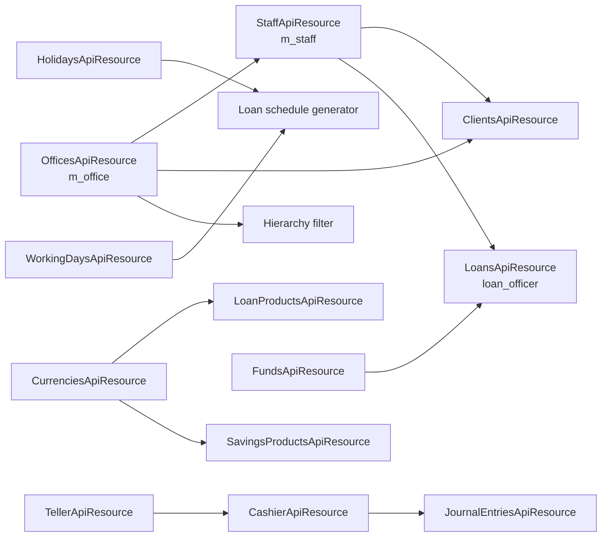

Apache Fineract groups every party-and-place master under the **organisation** umbrella: branch offices, the staff working in them, the currencies the tenant deals in, the working-days and holiday calendar that drives every schedule, the funds the institution raises, and the teller / cashier infrastructure that turns physical cash drawers into accounting events. The REST API for these masters is small but ubiquitous — almost every other resource takes an `officeId`, `staffId` or `currencyCode` as a parameter.

All endpoints sit under `/fineract-provider/api/v1` — see the [REST API Overview](/api/overview) for headers and JSON conventions.

## Endpoint summary

| Method | Path | File | Purpose |
| --- | --- | --- | --- |
| GET | `/v1/offices` | `OfficesApiResource.java` | List offices (paged, with parent hierarchy). |
| GET | `/v1/offices/template` | `OfficesApiResource.java` | Parent-office options and code values. |
| GET | `/v1/offices/{officeId}` | `OfficesApiResource.java` | One office. |
| POST | `/v1/offices` | `OfficesApiResource.java` | Create an office. |
| PUT | `/v1/offices/{officeId}` | `OfficesApiResource.java` | Update mutable fields. |
| GET | `/v1/offices/external-id/{externalId}` | `OfficesApiResource.java` | One office by external id. |
| POST | `/v1/offices/uploadtemplate` | `OfficesApiResource.java` | Bulk import office hierarchy. |
| GET | `/v1/staff` | `StaffApiResource.java` | List staff. |
| GET | `/v1/staff/{staffId}` | `StaffApiResource.java` | One staff member. |
| POST | `/v1/staff` | `StaffApiResource.java` | Create staff. |
| PUT | `/v1/staff/{staffId}` | `StaffApiResource.java` | Update staff. |
| GET | `/v1/staff/downloadtemplate` | `StaffApiResource.java` | XLS template. |
| POST | `/v1/staff/uploadtemplate` | `StaffApiResource.java` | XLS bulk import. |
| GET | `/v1/holidays` | `HolidaysApiResource.java` | List holidays (filter by office, date range). |
| GET | `/v1/holidays/{holidayId}` | `HolidaysApiResource.java` | One holiday. |
| POST | `/v1/holidays` | `HolidaysApiResource.java` | Create a holiday. |
| POST | `/v1/holidays/{holidayId}?command=activate\|delete` | `HolidaysApiResource.java` | Activate or soft-delete a holiday. |
| GET | `/v1/holidays/template` | `HolidaysApiResource.java` | Repayment-rescheduling type options. |
| GET | `/v1/workingdays` | `WorkingDaysApiResource.java` | The single working-days configuration. |
| PUT | `/v1/workingdays` | `WorkingDaysApiResource.java` | Update RRULE / repayment rescheduling type. |
| GET | `/v1/currencies` | `CurrenciesApiResource.java` | All currencies allowed for the tenant. |
| PUT | `/v1/currencies` | `CurrenciesApiResource.java` | Replace the list of allowed currencies. |
| GET | `/v1/funds` | `FundsApiResource.java` | All funds the institution holds. |
| POST | `/v1/funds` | `FundsApiResource.java` | Create a fund. |
| GET | `/v1/tellers` | `TellerApiResource.java` | All tellers. |
| GET | `/v1/tellers/{tellerId}` | `TellerApiResource.java` | One teller. |
| POST | `/v1/tellers` | `TellerApiResource.java` | Create a teller. |
| GET | `/v1/tellers/{tellerId}/cashiers` | `TellerApiResource.java` | All cashier-allocations for a teller. |
| POST | `/v1/tellers/{tellerId}/cashiers` | `TellerApiResource.java` | Allocate a staff member as cashier. |
| POST | `/v1/tellers/{tellerId}/cashiers/{cashierId}/allocate` | `TellerApiResource.java` | Allocate cash to a cashier (writes journal entries). |
| POST | `/v1/tellers/{tellerId}/cashiers/{cashierId}/settle` | `TellerApiResource.java` | Settle a cashier's drawer. |
| GET | `/v1/tellers/{tellerId}/cashiers/{cashierId}/transactions` | `TellerApiResource.java` | Cashier transaction history. |
| GET | `/v1/cashiers` | `CashierApiResource.java` | Global cashier list (across tellers). |
| GET | `/v1/cashiersjournal` | `TellerJournalApiResource.java` | Journal lines that originated from cashier transactions. |

## `OfficesApiResource`

File: `fineract-provider/src/main/java/org/apache/fineract/organisation/office/api/OfficesApiResource.java`
Class path: `@Path("/v1/offices")`

Offices form a tree — every tenant starts with a Head Office row at depth 0 and creates branches below it. Reports that aggregate "by office" use the `hierarchy` text column for prefix matching: `.0.1.7.` means this office sits beneath the Head Office (id `1`) at the second level.

| Method | Path | Handler |
| --- | --- | --- |
| GET | `/v1/offices` | `retrieveOffices` |
| GET | `/v1/offices/template` | `retrieveOfficeTemplate` |
| POST | `/v1/offices` | `createOffice` |
| GET | `/v1/offices/{officeId}` | `retrieveOffice` |
| PUT | `/v1/offices/{officeId}` | `updateOffice` |
| GET | `/v1/offices/external-id/{externalId}` | `retrieveOfficeByExternalId` |
| PUT | `/v1/offices/external-id/{externalId}` | `updateOfficeWithExternalId` |
| GET | `/v1/offices/downloadtemplate` | `getOfficeTemplate` |
| POST | `/v1/offices/uploadtemplate` | `postOfficeTemplate` |

The list endpoint honours `?includeAllOffices=true` for the org-wide drop-down. `OfficeTransactionsApiResource` (sibling file) records inter-office transfers — those are not lifecycle endpoints and are documented in the source.

## `StaffApiResource`

File: `fineract-provider/src/main/java/org/apache/fineract/organisation/staff/api/StaffApiResource.java`
Class path: `@Path("/v1/staff")`

Staff records hold the loan-officer and cashier identities (`m_staff`). They are distinct from system users — staff are the people the platform tracks for assignment and reporting; users are the people who authenticate. A single staff row can be linked to a user via `m_staff.user_id`.

| Method | Path | Handler |
| --- | --- | --- |
| GET | `/v1/staff` | `retrieveAll` |
| GET | `/v1/staff/{staffId}` | `retrieveOne` |
| POST | `/v1/staff` | `createStaff` |
| PUT | `/v1/staff/{staffId}` | `updateStaff` |
| GET | `/v1/staff/downloadtemplate` | `getTemplate` |
| POST | `/v1/staff/uploadtemplate` | `postTemplate` |

Query parameters of note:

- `?officeId=…` — scope to one office.
- `?status=active|inactive` — exclude separated staff.
- `?loanOfficersOnly=true` — only those flagged as loan officers (`is_loan_officer`).

## `HolidaysApiResource`

File: `fineract-provider/src/main/java/org/apache/fineract/organisation/holiday/api/HolidaysApiResource.java`
Class path: `@Path("/v1/holidays")`

Holidays are scoped per office and carry a repayment-rescheduling type that tells the schedule generator what to do when a due date falls on the holiday. Statuses are Pending → Active → Deleted; the dispatcher POST handles the transitions.

| Method | Path | Handler |
| --- | --- | --- |
| POST | `/v1/holidays` | `createNewHoliday` |
| POST | `/v1/holidays/{holidayId}?command=activate\|delete` | `handleCommands` |
| GET | `/v1/holidays/{holidayId}` | `retrieveOne` |
| PUT | `/v1/holidays/{holidayId}` | `update` |
| DELETE | `/v1/holidays/{holidayId}` | `delete` |
| GET | `/v1/holidays` | `retrieveAllHolidays` |
| GET | `/v1/holidays/template` | `retrieveRepaymentScheduleUpdationTyeOptions` |

Repayment-rescheduling-type values are documented inline in `RepaymentRescheduleType.java` and surface in the `template` response.

## `WorkingDaysApiResource`

File: `fineract-provider/src/main/java/org/apache/fineract/organisation/workingdays/api/WorkingDaysApiResource.java`
Class path: `@Path("/v1/workingdays")`

There is only ever **one** working-days row per tenant. It holds the iCal RRULE that defines the working week (e.g. `FREQ=WEEKLY;BYDAY=MO,TU,WE,TH,FR`) and a default repayment-rescheduling type for due dates that fall on non-working days.

| Method | Path | Handler |
| --- | --- | --- |
| GET | `/v1/workingdays` | `retrieveAll` |
| PUT | `/v1/workingdays` | `update` |
| GET | `/v1/workingdays/template` | `template` |

Changing the RRULE does **not** rewrite existing schedules — only new installments calculated after the change use the new working week.

## `CurrenciesApiResource`

File: `fineract-core/src/main/java/org/apache/fineract/organisation/monetary/api/CurrenciesApiResource.java`
Class path: `@Path("/v1/currencies")`

Currencies are also tenant-wide. The list is "selected vs all"; the PUT replaces the selected set:

| Method | Path | Handler |
| --- | --- | --- |
| GET | `/v1/currencies` | `retrieveCurrencies` |
| PUT | `/v1/currencies` | `updateCurrencies` |

The PUT body is `{ "currencies": [ "USD", "EUR", "KES" ] }`. Codes are validated against the JDK `Currency` enum and against `m_organisation_currency` which carries the per-tenant display options.

## `FundsApiResource`

File: `fineract-provider/src/main/java/org/apache/fineract/portfolio/fund/api/FundsApiResource.java`
Class path: `@Path("/v1/funds")`

A fund is a tagged source of capital (`Donor A 2024 tranche`, `Internal equity`). Loans can be tagged with `fundId` to enable funding-portfolio reporting. The model is intentionally lightweight — just a code, a name, and the FK columns on the loan side.

| Method | Path | Handler |
| --- | --- | --- |
| GET | `/v1/funds` | `retrieveFunds` |
| POST | `/v1/funds` | `createFund` |
| GET | `/v1/funds/{fundId}` | `retrieveFund` |
| PUT | `/v1/funds/{fundId}` | `updateFund` |

See `portfolio/funds.mdx` for the JPA entity.

## `TellerApiResource`, `CashierApiResource`, `TellerJournalApiResource`

Files:
- `fineract-branch/src/main/java/org/apache/fineract/organisation/teller/api/TellerApiResource.java`
- `fineract-branch/src/main/java/org/apache/fineract/organisation/teller/api/CashierApiResource.java`
- `fineract-branch/src/main/java/org/apache/fineract/organisation/teller/api/TellerJournalApiResource.java`

`@Path("/v1/tellers")`, `@Path("/v1/cashiers")` and `@Path("/v1/cashiersjournal")` respectively.

The teller-cashier sub-module models a physical cash window inside a branch. A **teller** is the window; a **cashier** is a staff member assigned to that window for a shift; cash movements (allocate, settle, deposit, withdraw) flow through the cashier and are recorded as cashier transactions which then post to the GL.

### Teller

| Method | Path | Handler | Notes |
| --- | --- | --- | --- |
| GET | `/v1/tellers` | `getTellerData` | All tellers. |
| GET | `/v1/tellers/{tellerId}` | `findTeller` | One teller. |
| POST | `/v1/tellers` | `createTeller` | Create. |
| PUT | `/v1/tellers/{tellerId}` | `updateTeller` | Update. |
| DELETE | `/v1/tellers/{tellerId}` | `deleteTeller` | Delete (only when no transactions). |
| GET | `/v1/tellers/{tellerId}/cashiers` | `getCashierData` | Cashier-allocations on a teller. |
| GET | `/v1/tellers/{tellerId}/cashiers/{cashierId}` | `findCashierData` | One cashier allocation. |
| GET | `/v1/tellers/{tellerId}/cashiers/template` | `getCashierTemplate` | Staff & date options for a new allocation. |
| POST | `/v1/tellers/{tellerId}/cashiers` | `createCashier` | Allocate. |
| PUT | `/v1/tellers/{tellerId}/cashiers/{cashierId}` | `updateCashier` | Reassign. |
| DELETE | `/v1/tellers/{tellerId}/cashiers/{cashierId}` | `deleteCashier` | End the allocation. |
| POST | `/v1/tellers/{tellerId}/cashiers/{cashierId}/allocate` | `allocateCashToCashier` | Give cash to a cashier (debit vault, credit cashier-cash GL). |
| POST | `/v1/tellers/{tellerId}/cashiers/{cashierId}/settle` | `settleCashFromCashier` | Take cash back. |
| GET | `/v1/tellers/{tellerId}/cashiers/{cashierId}/transactions` | `getTransactionsForCashier` | Cashier's history. |
| GET | `/v1/tellers/{tellerId}/cashiers/{cashierId}/summaryandtransactions` | `getTransactionsWithSummaryForCashier` | History plus totals. |
| GET | `/v1/tellers/{tellerId}/cashiers/{cashierId}/transactions/template` | `getCashierTxnTemplate` | Allowed action options. |
| GET | `/v1/tellers/{tellerId}/transactions` | `getTransactionData` | All transactions on the teller. |
| GET | `/v1/tellers/{tellerId}/transactions/{transactionId}` | `findTransactionData` | One. |
| GET | `/v1/tellers/{tellerId}/journals` | `getJournalData` | Journals that came from this teller. |

### Cashier global view

| Method | Path | Handler |
| --- | --- | --- |
| GET | `/v1/cashiers` | `getCashierData` |

### Teller journal cross-cut

| Method | Path | Handler |
| --- | --- | --- |
| GET | `/v1/cashiersjournal` | `getJournalData` |

The cash-allocation and settlement endpoints rely on `FinancialActivityAccountsApiResource` mappings for the vault-cash and cashier-cash GL accounts — they fail loudly if those mappings are missing. See [Accounting](/api/accounting).

## How office, staff and loans interconnect



## Permissions

| Permission | Endpoint |
| --- | --- |
| `READ_OFFICE`, `CREATE_OFFICE`, `UPDATE_OFFICE` | `OfficesApiResource`. |
| `READ_STAFF`, `CREATE_STAFF`, `UPDATE_STAFF` | `StaffApiResource`. |
| `READ_HOLIDAY`, `CREATE_HOLIDAY`, `ACTIVATE_HOLIDAY`, `UPDATE_HOLIDAY`, `DELETE_HOLIDAY` | `HolidaysApiResource`. |
| `READ_WORKINGDAYS`, `UPDATE_WORKINGDAYS` | `WorkingDaysApiResource`. |
| `READ_CURRENCY`, `UPDATE_CURRENCY` | `CurrenciesApiResource`. |
| `READ_FUND`, `CREATE_FUND`, `UPDATE_FUND` | `FundsApiResource`. |
| `READ_TELLER`, `CREATE_TELLER`, `UPDATE_TELLER`, `DELETE_TELLER`, `ALLOCATECASHIER_TELLER`, `SETTLECASHIER_TELLER` | `TellerApiResource`. |
| `READ_CASHIER` | `CashierApiResource`, `TellerJournalApiResource`. |

## Common parameters

The list endpoints share these:

| Parameter | Purpose |
| --- | --- |
| `?includeAllOffices=true` | Return inactive offices alongside active ones. |
| `?status=…` (staff) | `active`, `inactive`. |
| `?officeId=…` | Office-hierarchy scope (also accepted by holidays / tellers / cashiers / funds). |
| `?fromDate=…&toDate=…&dateFormat=&locale=` | Date-range filter on holidays. |
| `?currencyCode=…` | Restrict funds-by-currency. |

## Worked example — branch, staff, holiday, fund

```bash
TENANT='Fineract-Platform-TenantId: default'
HDR='Content-Type: application/json'

# Open a branch under Head Office (id=1)
curl -k -u admin:password -H "$TENANT" -H "$HDR" \
  -X POST https://localhost:8443/fineract-provider/api/v1/offices \
  -d '{ "name": "Mombasa Branch", "parentId": 1, "openingDate": "01 April 2024",
        "dateFormat": "dd MMMM yyyy", "locale": "en" }'
# → { "officeId": 7 }

# Hire a loan officer in the new branch
curl -k -u admin:password -H "$TENANT" -H "$HDR" \
  -X POST https://localhost:8443/fineract-provider/api/v1/staff \
  -d '{ "officeId": 7, "firstname": "Alex", "lastname": "Otieno",
        "isLoanOfficer": true, "isActive": true, "joiningDate": "01 April 2024",
        "dateFormat": "dd MMMM yyyy", "locale": "en" }'

# Register a public holiday for the new branch
curl -k -u admin:password -H "$TENANT" -H "$HDR" \
  -X POST https://localhost:8443/fineract-provider/api/v1/holidays \
  -d '{ "name": "Madaraka Day", "fromDate": "01 June 2024", "toDate": "01 June 2024",
        "repaymentsRescheduledTo": "02 June 2024",
        "offices": [ { "officeId": 7 } ],
        "dateFormat": "dd MMMM yyyy", "locale": "en" }'

# Add a fund
curl -k -u admin:password -H "$TENANT" -H "$HDR" \
  -X POST https://localhost:8443/fineract-provider/api/v1/funds \
  -d '{ "name": "Donor A 2024 tranche" }'
```

## Teller / Cashier action codes

`POST /v1/tellers/{tellerId}/cashiers/{cashierId}/allocate` and the matching `/settle` endpoint accept a JSON body with a `txnType` discriminator (`101`=cash allocation, `102`=cash settlement) plus amount, currency, date and notes. The underlying domain class is `CashierTransaction` (`fineract-branch/.../organisation/teller/domain/`); the cashier transaction enum is exposed through the `getCashierTxnTemplate` GET so the UI can render the matching form.

Allocations and settlements always book through the financial-activity GL accounts mapped under `FinancialActivityAccountsApiResource` — at minimum `CASH_AT_MAIN_VAULT` and `CASH_AT_TELLER`. If those mappings are missing the allocation fails with `validation.msg.financial.activity.mapping.cash.at.teller.missing`.

## Schema reference

- `m_office` — offices, including `hierarchy` text column for prefix-search.
- `m_office_transaction` — inter-office transfers (`OfficeTransactionsApiResource`, sibling to `OfficesApiResource`).
- `m_staff` — staff, links to `m_appuser.staff_id` and `m_loan.loan_officer_id`.
- `m_holiday` — holidays; `m_holiday_office` many-to-many to scope per branch.
- `m_working_days` — single row, RRULE string + repayment-rescheduling type.
- `m_organisation_currency` — selected currencies and per-tenant display options.
- `m_fund` — funds.
- `m_tellers` — physical cash windows.
- `m_cashiers` — cashier assignments to tellers, with active date range.
- `m_cashier_transactions` — every cash allocation / settlement / deposit / withdrawal that flows through a cashier.

## Related domain documents

- `organisation/` — entity model for offices, staff, holidays and working days.
- `portfolio/funds.mdx` — fund entity and how it links to loans.
- [Accounting](/api/accounting) — `FinancialActivityAccountsApiResource` for the cashier/vault GL mappings.
- [Configuration & Jobs](/api/configuration-and-jobs) — `BusinessDateApiResource` (`fineract-core/.../businessdate/api/`) and the working-business-date job that interacts with the working-days calendar.
