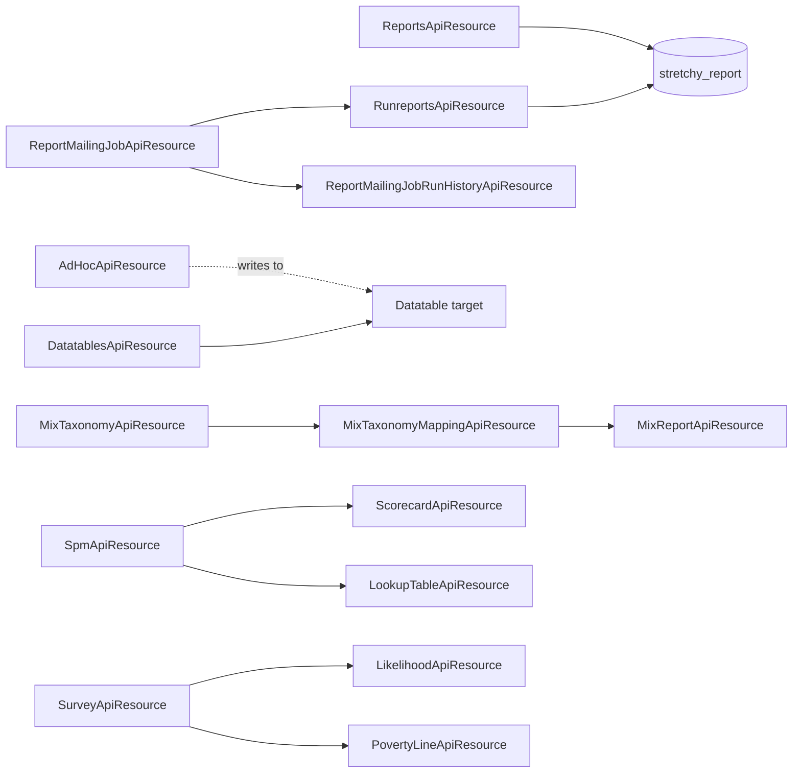

Reporting in Apache Fineract is intentionally schemaless — every report is a SQL or Pentaho definition stored in `stretchy_report`, and the platform exposes the catalog plus an executor. On top of that core sits a family of opinionated reporting features: scheduled report-mailing jobs, the MIX-XBRL submission pipeline used by microfinance regulators, the ad-hoc / staging-data export, Social Performance Management (SPM) surveys and scorecards, the Progress-out-of-Poverty Index (PPI) likelihood / poverty-line tables, and the generic datatable mechanism that lets tenants attach custom columns to any first-class entity.

All endpoints live under `/fineract-provider/api/v1` — see the [REST API Overview](/api/overview).

## Endpoint summary

| Method | Path | File | Purpose |
| --- | --- | --- | --- |
| GET | `/v1/reports` | `ReportsApiResource.java` | List every report definition. |
| GET | `/v1/reports/{id}` | `ReportsApiResource.java` | One report definition. |
| POST | `/v1/reports` | `ReportsApiResource.java` | Create a report. |
| PUT | `/v1/reports/{id}` | `ReportsApiResource.java` | Update a report. |
| DELETE | `/v1/reports/{id}` | `ReportsApiResource.java` | Delete a report. |
| GET | `/v1/runreports/{reportName}` | `RunreportsApiResource.java` | Execute and return results. |
| GET | `/v1/runreports/availableExports/{reportName}` | `RunreportsApiResource.java` | Permitted output formats for one report. |
| GET | `/v1/datatables` | `DatatablesApiResource.java` | List all datatables. |
| GET | `/v1/datatables/{datatable}` | `DatatablesApiResource.java` | Datatable column definition. |
| POST | `/v1/datatables` | `DatatablesApiResource.java` | Create a datatable. |
| POST | `/v1/datatables/register/{datatable}/{apptable}` | `DatatablesApiResource.java` | Attach a datatable to an apptable. |
| POST | `/v1/datatables/{datatable}/{apptableId}` | `DatatablesApiResource.java` | Insert a row. |
| GET | `/v1/datatables/{datatable}/{apptableId}` | `DatatablesApiResource.java` | Read rows for the apptable id. |
| PUT | `/v1/datatables/{datatable}/{apptableId}` | `DatatablesApiResource.java` | Update one-to-one row. |
| DELETE | `/v1/datatables/{datatable}/{apptableId}` | `DatatablesApiResource.java` | Delete rows. |
| GET | `/v1/datatables/{datatable}/query` | `DatatablesApiResource.java` | Filtered read. |
| POST | `/v1/datatables/{datatable}/query` | `DatatablesApiResource.java` | Advanced JSON-predicate query. |
| GET | `/v1/reportmailingjobs` | `ReportMailingJobApiResource.java` | Scheduled report-email jobs. |
| POST | `/v1/reportmailingjobs` | `ReportMailingJobApiResource.java` | Create a scheduled mailing. |
| GET | `/v1/reportmailingjobrunhistory` | `ReportMailingJobRunHistoryApiResource.java` | Per-run audit. |
| GET | `/v1/mixtaxonomy` | `MixTaxonomyApiResource.java` | XBRL taxonomy terms. |
| GET | `/v1/mixmapping` | `MixTaxonomyMappingApiResource.java` | GL-account → taxonomy mapping. |
| GET | `/v1/mixreport` | `MixReportApiResource.java` | Render the MIX XBRL submission. |
| GET | `/v1/adhocquery` | `AdHocApiResource.java` | Ad-hoc query definitions. |
| POST | `/v1/adhocquery` | `AdHocApiResource.java` | Create an ad-hoc query. |
| GET | `/v1/surveys` | `SpmApiResource.java` | SPM surveys. |
| POST | `/v1/surveys` | `SpmApiResource.java` | Create / publish a survey. |
| GET | `/v1/surveys/scorecards/{surveyId}` | `ScorecardApiResource.java` | Survey scorecards. |
| GET | `/v1/survey/{surveyName}` | `SurveyApiResource.java` | One PPI survey definition. |
| POST | `/v1/survey/{surveyName}/{apptableId}` | `SurveyApiResource.java` | Submit a survey response. |
| GET | `/v1/likelihood/{ppiName}` | `LikelihoodApiResource.java` | PPI likelihood table. |
| GET | `/v1/povertyLine/{ppiName}` | `PovertyLineApiResource.java` | PPI poverty-line table. |
| GET | `/v1/surveys/{surveyId}/lookuptables` | `LookupTableApiResource.java` | Lookup tables on an SPM survey. |

## `ReportsApiResource`

File: `fineract-provider/src/main/java/org/apache/fineract/infrastructure/dataqueries/api/ReportsApiResource.java`
Class path: `@Path("/v1/reports")`

CRUD over `stretchy_report`. Each report carries a `report_type` (`Table`, `Chart`, `Pentaho`, `SMS`, `JasperReport`), a `report_category`, the SQL or Pentaho XML, and a parameter list (`stretchy_report_parameter`) that the runner uses to build the prompt UI.

| Method | Path | Handler |
| --- | --- | --- |
| GET | `/v1/reports` | `retrieveReportList` |
| GET | `/v1/reports/{id}` | `retrieveReport` |
| GET | `/v1/reports/template` | `retrieveOfficeTemplate` |
| POST | `/v1/reports` | `createReport` |
| PUT | `/v1/reports/{id}` | `updateReport` |
| DELETE | `/v1/reports/{id}` | `deleteReport` |

## `RunreportsApiResource`

File: `fineract-provider/src/main/java/org/apache/fineract/infrastructure/dataqueries/api/RunreportsApiResource.java`
Class path: `@Path("/v1/runreports")`

The execution endpoint. The runner picks the right backend (SQL vs Pentaho) based on `report_type`, substitutes named parameters from the query string, and streams the result. The accept header / `?exportCSV=true` / `?exportPdf=true` flags decide whether the response is JSON, CSV or PDF.

| Method | Path | Handler |
| --- | --- | --- |
| GET | `/v1/runreports/{reportName}` | `runReport` |
| GET | `/v1/runreports/availableExports/{reportName}` | `retrieveAllAvailableExports` |

A typical call:

```
GET /v1/runreports/Client%20Listing?R_officeId=1&R_loanOfficerId=-1&exportCSV=true
```

The `R_` prefix on the params is the convention for `stretchy_report_parameter` substitution.

## `DatatablesApiResource`

File: `fineract-provider/src/main/java/org/apache/fineract/infrastructure/dataqueries/api/DatatablesApiResource.java`
Class path: `@Path("/v1/datatables")`

Datatables are the platform's vertical-customisation story: tenants can extend any first-class entity (Client, Loan, Group, Office, Savings, ProductLoan, Center) with additional columns without touching the schema migration pipeline.

The resource covers:

| Method | Path | Handler | Purpose |
| --- | --- | --- | --- |
| GET | `/v1/datatables` | `getDatatables` | List all datatables and their attached apptable. |
| POST | `/v1/datatables` | `createDatatable` | Create a datatable (DDL). |
| PUT | `/v1/datatables/{datatableName}` | `updateDatatable` | Add / drop columns (DDL). |
| DELETE | `/v1/datatables/{datatableName}` | `deleteDatatable` | Drop the table. |
| POST | `/v1/datatables/register/{datatable}/{apptable}` | `registerDatatable` | Attach to an existing apptable, optionally to a specific product (loan/savings). |
| POST | `/v1/datatables/deregister/{datatable}` | `deregisterDatatable` | Detach. |
| GET | `/v1/datatables/{datatable}` | `getDatatable` | Column definitions. |
| GET | `/v1/datatables/{datatable}/query` | `queryValues` | URL-param filter. |
| POST | `/v1/datatables/{datatable}/query` | `advancedQuery` | JSON-predicate filter. |
| GET | `/v1/datatables/{datatable}/{apptableId}` | `getDatatable` | Read one-to-one or one-to-many rows for an apptable id. |
| GET | `/v1/datatables/{datatable}/{apptableId}/{datatableId}` | `getDatatableManyEntry` | Read one row in a many table. |
| POST | `/v1/datatables/{datatable}/{apptableId}` | `createDatatableEntry` | Insert. |
| PUT | `/v1/datatables/{datatable}/{apptableId}` | `updateDatatableEntryOnetoOne` | Update one-to-one. |
| PUT | `/v1/datatables/{datatable}/{apptableId}/{datatableId}` | `updateDatatableEntryOneToMany` | Update one-to-many. |
| DELETE | `/v1/datatables/{datatable}/{apptableId}` | `deleteDatatableEntries` | Delete all rows for an apptable id. |
| DELETE | `/v1/datatables/{datatable}/{apptableId}/{datatableId}` | `deleteDatatableEntry` | Delete one row in a many table. |

The matching check matrix (require rows before a lifecycle command) is on `EntityDatatableChecksApiResource` — see [Configuration & Jobs](/api/configuration-and-jobs).

## Report mailing

### `ReportMailingJobApiResource`

File: `fineract-provider/src/main/java/org/apache/fineract/infrastructure/reportmailingjob/api/ReportMailingJobApiResource.java`
Class path: `@Path("/v1/reportmailingjobs")` (resolved at runtime from `ReportMailingJobConstants.REPORT_MAILING_JOB_RESOURCE_NAME`).

A scheduled execution of a report whose output (CSV / PDF) is emailed to a recipient list. Each job carries its own cron, an email distribution list, the report id and the parameter map. The dispatcher job that runs them lives under `jobs/`.

| Method | Path | Handler |
| --- | --- | --- |
| GET | `/v1/reportmailingjobs/template` | `retrieveReportMailingJobTemplate` |
| GET | `/v1/reportmailingjobs` | `retrieveAllReportMailingJobs` |
| GET | `/v1/reportmailingjobs/{entityId}` | `retrieveReportMailingJob` |
| POST | `/v1/reportmailingjobs` | `createReportMailingJob` |
| PUT | `/v1/reportmailingjobs/{entityId}` | `updateReportMailingJob` |
| DELETE | `/v1/reportmailingjobs/{entityId}` | `deleteReportMailingJob` |

### `ReportMailingJobRunHistoryApiResource`

File: `fineract-provider/src/main/java/org/apache/fineract/infrastructure/reportmailingjob/api/ReportMailingJobRunHistoryApiResource.java`
Class path: `@Path("/v1/reportmailingjobrunhistory")`.

A single read endpoint that lists the per-execution audit rows (`m_report_mailing_job_run_history`).

| Method | Path | Handler |
| --- | --- | --- |
| GET | `/v1/reportmailingjobrunhistory?mailingJobId=…` | `retrieveAllByReportMailingJobId` |

## MIX taxonomy and report

### `MixTaxonomyApiResource`

File: `fineract-mix/src/main/java/org/apache/fineract/mix/api/MixTaxonomyApiResource.java`
Class path: `@Path("/v1/mixtaxonomy")`.

Lists the seeded MIX-XBRL terms.

| Method | Path | Handler |
| --- | --- | --- |
| GET | `/v1/mixtaxonomy` | `retrieveAll` |

### `MixTaxonomyMappingApiResource`

File: `fineract-mix/src/main/java/org/apache/fineract/mix/api/MixTaxonomyMappingApiResource.java`
Class path: `@Path("/v1/mixmapping")`.

Read and update the per-tenant mapping from internal GL accounts to MIX taxonomy terms.

| Method | Path | Handler |
| --- | --- | --- |
| GET | `/v1/mixmapping` | `retrieveTaxonomyMapping` |
| PUT | `/v1/mixmapping` | `updateTaxonomyMapping` |

### `MixReportApiResource`

File: `fineract-mix/src/main/java/org/apache/fineract/mix/api/MixReportApiResource.java`
Class path: `@Path("/v1/mixreport")`.

Renders the XBRL instance document for a reporting period.

| Method | Path | Handler |
| --- | --- | --- |
| GET | `/v1/mixreport?startDate=…&endDate=…&currency=…` | `retrieveXBRLReport` |

## `AdHocApiResource`

File: `fineract-provider/src/main/java/org/apache/fineract/adhocquery/api/AdHocApiResource.java`
Class path: `@Path("/v1/adhocquery")`.

Ad-hoc queries are stored SQL definitions that run on a schedule and write their results into a tenant-defined staging table. They are the lightweight ETL primitive of the platform.

| Method | Path | Handler |
| --- | --- | --- |
| GET | `/v1/adhocquery` | `retrieveAll` |
| GET | `/v1/adhocquery/template` | `template` |
| POST | `/v1/adhocquery` | `createAdHocQuery` |
| GET | `/v1/adhocquery/{adHocId}` | `retrieveAdHocQuery` |
| PUT | `/v1/adhocquery/{adHocId}` | `update` |
| DELETE | `/v1/adhocquery/{adHocId}` | `deleteAdHocQuery` |

Execution is triggered by the `Execute Adhoc Queries` job.

## Social Performance Management (SPM)

`SpmApiResource`, `ScorecardApiResource` and `LookupTableApiResource` together implement the SPM survey tooling.

### `SpmApiResource`

File: `fineract-provider/src/main/java/org/apache/fineract/spm/api/SpmApiResource.java`
Class path: `@Path("/v1/surveys")`.

Surveys are JSON definitions stored in `m_survey`. Each carries a name, version, country code, validity window and a list of questions / response choices.

| Method | Path | Handler |
| --- | --- | --- |
| GET | `/v1/surveys` | `fetchAllSurveys` |
| GET | `/v1/surveys/{id}` | `findSurvey` |
| POST | `/v1/surveys` | `createSurvey` |
| PUT | `/v1/surveys/{id}` | `editSurvey` |
| POST | `/v1/surveys/{id}?command=activate\|deactivate` | `activateOrDeactivateSurvey` |

### `ScorecardApiResource`

File: `fineract-provider/src/main/java/org/apache/fineract/spm/api/ScorecardApiResource.java`
Class path: `@Path("/v1/surveys/scorecards")`.

A *scorecard* is a single completed instance of a survey for a particular client. The resource exposes both creation and retrieval — by survey, by survey+client, or by client across all surveys.

| Method | Path | Handler |
| --- | --- | --- |
| GET | `/v1/surveys/scorecards/{surveyId}` | `findBySurvey` |
| POST | `/v1/surveys/scorecards/{surveyId}` | `createScorecard` |
| GET | `/v1/surveys/scorecards/{surveyId}/clients/{clientId}` | `findBySurveyAndClient` |
| GET | `/v1/surveys/scorecards/clients/{clientId}` | `findByClient` |

### `LookupTableApiResource`

File: `fineract-provider/src/main/java/org/apache/fineract/spm/api/LookupTableApiResource.java`
Class path: `@Path("/v1/surveys/{surveyId}/lookuptables")`.

Surveys reference lookup tables (e.g. region → urban / rural) when computing aggregate scores.

| Method | Path | Handler |
| --- | --- | --- |
| GET | `/v1/surveys/{surveyId}/lookuptables` | `fetchLookupTables` |
| GET | `/v1/surveys/{surveyId}/lookuptables/{key}` | `findLookupTable` |
| POST | `/v1/surveys/{surveyId}/lookuptables` | `createLookupTable` |

## PPI / Poverty-line — `SurveyApiResource`, `LikelihoodApiResource`, `PovertyLineApiResource`

These three resources implement the Progress-out-of-Poverty Index (PPI) — a 10-question demographic survey that estimates household poverty likelihood.

### `SurveyApiResource`

File: `fineract-provider/src/main/java/org/apache/fineract/infrastructure/survey/api/SurveyApiResource.java`
Class path: `@Path("/v1/survey")`.

Stores PPI question / answer definitions in datatables. The result of a survey response is a single row written into a `survey_*` datatable per client.

| Method | Path | Handler |
| --- | --- | --- |
| GET | `/v1/survey` | `retrieveSurveys` |
| GET | `/v1/survey/{surveyName}` | `retrieveSurvey` |
| POST | `/v1/survey/{surveyName}/{apptableId}` | `createDatatableEntry` |
| GET | `/v1/survey/{surveyName}/{clientId}` | `getClientSurveyOverview` |
| GET | `/v1/survey/{surveyName}/{clientId}/{entryId}` | `getSurveyEntry` |
| PUT | `/v1/survey/register/{surveyName}/{apptable}` | `register` |
| DELETE | `/v1/survey/{surveyName}/{clientId}/{fulfilledId}` | `deleteDatatableEntries` |

### `LikelihoodApiResource`

File: `fineract-provider/src/main/java/org/apache/fineract/infrastructure/survey/api/LikelihoodApiResource.java`
Class path: `@Path("/v1/likelihood")`.

| Method | Path | Handler |
| --- | --- | --- |
| GET | `/v1/likelihood/{ppiName}` | `retrieveAll` |
| GET | `/v1/likelihood/{ppiName}/{likelihoodId}` | `retrieve` |
| PUT | `/v1/likelihood/{ppiName}/{likelihoodId}` | `update` |

### `PovertyLineApiResource`

File: `fineract-provider/src/main/java/org/apache/fineract/infrastructure/survey/api/PovertyLineApiResource.java`
Class path: `@Path("/v1/povertyLine")`.

| Method | Path | Handler |
| --- | --- | --- |
| GET | `/v1/povertyLine/{ppiName}` | `retrieveAll` |
| GET | `/v1/povertyLine/{ppiName}/{likelihoodId}` | `retrieveAll` |

## How they relate



## Related domain documents

- `reporting/` — `stretchy_report` schema and the Pentaho integration.
- `spm/` — survey + scorecard JPA mappings.
- `survey/` — PPI datatables and the SP4 / SP5 calculator.
- [Configuration & Jobs](/api/configuration-and-jobs) — `EntityDatatableChecksApiResource` for required-datatable enforcement.
- [Accounting](/api/accounting) — GL accounts referenced by `MixTaxonomyMappingApiResource`.
