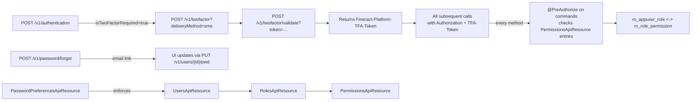

Apache Fineract ships with a complete user-administration and authentication stack. Users authenticate either with HTTP Basic or with OAuth2 / JWT (opt-in via the `oauth` Spring profile). Once authenticated, every action is gated by a fine-grained permission attached to a role. Two-factor authentication is built in as an optional, configuration-driven flow. The REST API for this domain is small but ubiquitous — every other resource in the platform reads `context.authenticatedUser()` to find the caller.

All endpoints sit under `/fineract-provider/api/v1` — see the [REST API Overview](/api/overview).

## Endpoint summary

| Method | Path | File | Purpose |
| --- | --- | --- | --- |
| POST | `/v1/authentication` | `AuthenticationApiResource.java` | Validate credentials, return user data and auth key. |
| GET | `/v1/userdetails` | `UserDetailsApiResource.java` | Echo the authenticated user's profile and permissions. |
| GET | `/v1/users` | `UsersApiResource.java` | List system users. |
| GET | `/v1/users/template` | `UsersApiResource.java` | Office, staff and role options for the new-user form. |
| GET | `/v1/users/{userId}` | `UsersApiResource.java` | One user. |
| POST | `/v1/users` | `UsersApiResource.java` | Create a user. |
| PUT | `/v1/users/{userId}` | `UsersApiResource.java` | Update user (roles, office, staff link, flags). |
| POST | `/v1/users/{userId}/pwd` | `UsersApiResource.java` | Force-change a user's password (admin reset). |
| DELETE | `/v1/users/{userId}` | `UsersApiResource.java` | Delete a user. |
| GET | `/v1/roles` | `RolesApiResource.java` | List roles. |
| GET | `/v1/roles/{roleId}` | `RolesApiResource.java` | One role. |
| POST | `/v1/roles` | `RolesApiResource.java` | Create a role. |
| POST | `/v1/roles/{roleId}?command=disable\|enable` | `RolesApiResource.java` | Enable / disable a role. |
| PUT | `/v1/roles/{roleId}` | `RolesApiResource.java` | Rename / re-describe a role. |
| GET | `/v1/roles/{roleId}/permissions` | `RolesApiResource.java` | Role-permission matrix. |
| PUT | `/v1/roles/{roleId}/permissions` | `RolesApiResource.java` | Replace the role-permission set. |
| DELETE | `/v1/roles/{roleId}` | `RolesApiResource.java` | Delete a role (when no user holds it). |
| GET | `/v1/permissions` | `PermissionsApiResource.java` | All permissions in the system. |
| PUT | `/v1/permissions` | `PermissionsApiResource.java` | Toggle maker-checker requirement per permission. |
| POST | `/v1/password/forgot` | `ForgotPasswordApiResource.java` | Trigger the forgot-password email. |
| GET | `/v1/passwordpreferences/template` | `PasswordPreferencesApiResource.java` | Available password policies. |
| GET | `/v1/passwordpreferences` | `PasswordPreferencesApiResource.java` | The current password policy. |
| PUT | `/v1/passwordpreferences` | `PasswordPreferencesApiResource.java` | Pick a password policy. |
| GET | `/v1/twofactor` | `TwoFactorApiResource.java` | OTP delivery methods available to the caller. |
| POST | `/v1/twofactor?deliveryMethod=…` | `TwoFactorApiResource.java` | Request an OTP via a specific channel. |
| POST | `/v1/twofactor/validate?token=…` | `TwoFactorApiResource.java` | Validate the OTP. |
| GET | `/v1/twofactor/configure` | `TwoFactorConfigurationApiResource.java` | Two-factor admin configuration. |
| PUT | `/v1/twofactor/configure` | `TwoFactorConfigurationApiResource.java` | Update OTP-length, expiry, SMS/email providers. |

## `AuthenticationApiResource`

File: `fineract-security/src/main/java/org/apache/fineract/infrastructure/security/api/AuthenticationApiResource.java`
Class path: `@Path("/v1/authentication")`

A single endpoint, but the linchpin of every Fineract integration. The call accepts username and password as **query parameters** (not a body — historical compatibility with the legacy web client). It honours the global configuration `BASICAUTH_VALIDATE_CREDENTIALS`: when on, calling this endpoint verifies credentials and returns a base64 `authenticationKey` that the client uses on subsequent Basic-Auth requests.

| Method | Path | Handler |
| --- | --- | --- |
| POST | `/v1/authentication` | `authenticate` |

Response (`AuthenticationApiResource.AuthenticatedUserData`):

```json
{
  "username": "mifos",
  "userId": 1,
  "base64EncodedAuthenticationKey": "bWlmb3M6cGFzc3dvcmQ=",
  "authenticated": true,
  "officeId": 1,
  "officeName": "Head Office",
  "roles": [ { "id": 1, "name": "Super user", "description": "" } ],
  "permissions": [ "ALL_FUNCTIONS" ],
  "isTwoFactorAuthenticationRequired": false
}
```

If two-factor is required the response omits the auth key until the OTP step completes.

## `UserDetailsApiResource`

File: `fineract-security/src/main/java/org/apache/fineract/infrastructure/security/api/UserDetailsApiResource.java`
Class path: `@Path("/v1/userdetails")`

A read-only echo of the caller's identity, designed for OAuth2 / JWT flows where the access token's claims do not embed the full role/permission set. The web client calls it after login to populate the menu.

| Method | Path | Handler |
| --- | --- | --- |
| GET | `/v1/userdetails` | `fetchAuthenticatedUserData` |

## `UsersApiResource`

File: `fineract-provider/src/main/java/org/apache/fineract/useradministration/api/UsersApiResource.java`
Class path: `@Path("/v1/users")`

The user-administration endpoint. Users in `m_appuser` carry:

- `username`, `password` (BCrypt), `email`, `firstname`, `lastname`.
- An `office_id` that bounds what they can see (office hierarchy).
- An optional `staff_id` linking back to the `m_staff` row.
- Boolean flags: `nonexpired`, `nonlocked`, `nonexpired_credentials`, `enabled`, `password_never_expires`, `is_self_service_user`.
- A roles set via `m_appuser_role`.

| Method | Path | Handler |
| --- | --- | --- |
| GET | `/v1/users` | `retrieveAll` |
| GET | `/v1/users/{userId}` | `retrieveOne` |
| GET | `/v1/users/template` | `template` |
| POST | `/v1/users` | `create` |
| PUT | `/v1/users/{userId}` | `update` |
| POST | `/v1/users/{userId}/pwd` | `changePassword` |
| DELETE | `/v1/users/{userId}` | `delete` |
| GET | `/v1/users/downloadtemplate` | `getUserTemplate` |
| POST | `/v1/users/uploadtemplate` | `postUsersTemplate` |

When a user creates / updates another user, the platform sends a `m_email_message` row if `sendPasswordToEmail=true`.

## `RolesApiResource`

File: `fineract-provider/src/main/java/org/apache/fineract/useradministration/api/RolesApiResource.java`
Class path: `@Path("/v1/roles")`

Roles aggregate permissions. The role-permission matrix is exposed through a dedicated sub-endpoint, and `?command=disable|enable` toggles the role's `is_disabled` flag without losing the assignments.

| Method | Path | Handler |
| --- | --- | --- |
| GET | `/v1/roles` | `retrieveAllRoles` |
| POST | `/v1/roles` | `createRole` |
| GET | `/v1/roles/{roleId}` | `retrieveRole` |
| POST | `/v1/roles/{roleId}?command=disable\|enable` | `actionsOnRoles` |
| PUT | `/v1/roles/{roleId}` | `updateRole` |
| GET | `/v1/roles/{roleId}/permissions` | `retrieveRolePermissions` |
| PUT | `/v1/roles/{roleId}/permissions` | `updateRolePermissions` |
| DELETE | `/v1/roles/{roleId}` | `deleteRole` |

The `PUT /permissions` body is `{ "permissions": { "CREATE_LOAN": true, "DISBURSE_LOAN": false, … } }`. Any permission omitted from the body keeps its current value.

## `PermissionsApiResource`

File: `fineract-provider/src/main/java/org/apache/fineract/useradministration/api/PermissionsApiResource.java`
Class path: `@Path("/v1/permissions")`

Permissions are seeded by Liquibase into `m_permission`; they cannot be created at runtime. What the resource exposes is the *maker-checker* toggle per permission — i.e. whether an action requires checker approval. The PUT body looks like:

```json
{ "permissions": { "CREATE_CLIENT": true, "DISBURSE_LOAN": true } }
```

| Method | Path | Handler |
| --- | --- | --- |
| GET | `/v1/permissions` | `retrieveAllPermissions` |
| PUT | `/v1/permissions` | `updatePermissionsDetails` |

The global `maker-checker` configuration must be enabled for these per-permission toggles to take effect — see `GlobalConfigurationApiResource` in [Configuration & Jobs](/api/configuration-and-jobs).

## `ForgotPasswordApiResource`

File: `fineract-provider/src/main/java/org/apache/fineract/useradministration/api/ForgotPasswordApiResource.java`
Class path: `@Path("/v1/password")`

A single anonymous endpoint that triggers the forgot-password email. The platform looks the username up, generates a single-use token (`m_appuser_password_reset_token`) and emails the reset link via the SMTP configuration.

| Method | Path | Handler |
| --- | --- | --- |
| POST | `/v1/password/forgot` | `forgotPassword` |

## `PasswordPreferencesApiResource`

File: `fineract-provider/src/main/java/org/apache/fineract/useradministration/api/PasswordPreferencesApiResource.java`
Class path: `@Path("/v1/passwordpreferences")`

Password policies are pre-defined (`Simple`, `Medium`, `Strong`, `Strong with three change`, `Very strong`) in the seed data; this resource exposes the *currently selected* one and lets you switch.

| Method | Path | Handler |
| --- | --- | --- |
| GET | `/v1/passwordpreferences` | `retrieve` |
| PUT | `/v1/passwordpreferences` | `update` |
| GET | `/v1/passwordpreferences/template` | `template` |

The selected policy is enforced at user-create, user-update, and user-changePassword time by `PasswordValidationPolicyRepository`.

## Two-factor authentication

Two resources — `TwoFactorApiResource` for the **flow** and `TwoFactorConfigurationApiResource` for the **admin settings**.

### `TwoFactorApiResource`

File: `fineract-security/src/main/java/org/apache/fineract/infrastructure/security/api/TwoFactorApiResource.java`
Class path: `@Path("/v1/twofactor")`

| Method | Path | Handler | Purpose |
| --- | --- | --- | --- |
| GET | `/v1/twofactor` | `getOTPDeliveryMethods` | Channels available to the caller (`SMS`, `EMAIL`, `PASSWORD` fallback). |
| POST | `/v1/twofactor?deliveryMethod=…` | `requestToken` | Send an OTP via the chosen channel. |
| POST | `/v1/twofactor/validate?token=…` | `validate` | Validate the OTP, return a `Fineract-Platform-TFA-Token` good for the configured TTL. |
| POST | `/v1/twofactor/invalidate` | `updateConfiguration` | Force-invalidate the active TFA token. |

The TFA token is cached server-side (in `OTPRequest` repositories) and bound to the user's session.

### `TwoFactorConfigurationApiResource`

File: `fineract-security/src/main/java/org/apache/fineract/infrastructure/security/api/TwoFactorConfigurationApiResource.java`
Class path: `@Path("/v1/twofactor/configure")`

| Method | Path | Handler |
| --- | --- | --- |
| GET | `/v1/twofactor/configure` | `retrieveAll` |
| PUT | `/v1/twofactor/configure` | `updateConfiguration` |

The configuration covers OTP length, OTP TTL, TFA-token TTL, SMS provider, email subject and body templates, and which channel is the default.

## How they fit together



## Permissions catalog reference

Permission names follow a `ACTION_ENTITY` convention. Examples:

- `CREATE_CLIENT`, `UPDATE_CLIENT`, `DELETE_CLIENT`, `ACTIVATE_CLIENT`, `CLOSE_CLIENT`.
- `CREATE_LOAN`, `APPROVE_LOAN`, `DISBURSE_LOAN`, `REJECT_LOAN`, `WAIVEINTERESTPORTION_LOAN`.
- `CREATE_SAVINGSACCOUNT`, `APPROVE_SAVINGSACCOUNT`, `DEPOSIT_SAVINGSACCOUNT`.
- `READ_REPORT`, `RUNREPORT_REPORT`.
- `ALL_FUNCTIONS` — superuser; bypasses every permission check.
- `ALL_FUNCTIONS_READ` — read-only superuser.

Each maker-checker-eligible permission has a `CHECKER_<ACTION>_<ENTITY>` twin used by `MakercheckersApiResource` to approve queued commands.

## Worked example — onboard a new loan officer

```bash
TENANT='Fineract-Platform-TenantId: default'
HDR='Content-Type: application/json'

# 1. Find the role id for Loan Officer
curl -k -u admin:password -H "$TENANT" \
  https://localhost:8443/fineract-provider/api/v1/roles | jq '.[] | select(.name=="Loan Officer")'

# 2. Create the user, link to staff row 12 in office 7
curl -k -u admin:password -H "$TENANT" -H "$HDR" \
  -X POST https://localhost:8443/fineract-provider/api/v1/users \
  -d '{
    "username": "aotieno", "firstname": "Alex", "lastname": "Otieno",
    "email": "alex.otieno@example.com",
    "officeId": 7, "staffId": 12,
    "roles": [ 3 ],
    "sendPasswordToEmail": true,
    "passwordNeverExpires": false
  }'

# 3. Reset the password (admin reset)
curl -k -u admin:password -H "$TENANT" -H "$HDR" \
  -X POST https://localhost:8443/fineract-provider/api/v1/users/42/pwd \
  -d '{ "password": "Temp#2024", "repeatPassword": "Temp#2024" }'
```

## Worked example — two-factor flow

```bash
# 1. Authenticate (returns isTwoFactorAuthenticationRequired=true)
curl -k -u alex:Temp#2024 -H "$TENANT" \
  -X POST 'https://localhost:8443/fineract-provider/api/v1/authentication'

# 2. List available delivery methods
curl -k -u alex:Temp#2024 -H "$TENANT" \
  https://localhost:8443/fineract-provider/api/v1/twofactor

# 3. Request OTP via SMS
curl -k -u alex:Temp#2024 -H "$TENANT" \
  -X POST 'https://localhost:8443/fineract-provider/api/v1/twofactor?deliveryMethod=sms&extendedToken=false'

# 4. Validate the OTP (token from the response of step 3)
curl -k -u alex:Temp#2024 -H "$TENANT" \
  -X POST 'https://localhost:8443/fineract-provider/api/v1/twofactor/validate?token=123456'
# → { "token": "eyJ…", "validFrom": …, "validTo": … }

# 5. Use the token on subsequent calls
curl -k -u alex:Temp#2024 -H "$TENANT" \
  -H 'Fineract-Platform-TFA-Token: eyJ…' \
  https://localhost:8443/fineract-provider/api/v1/userdetails
```

## Self-service users

Setting `isSelfServiceUser=true` on the user create payload restricts the account to the self-service portal — the user can only see and act on their own customer record. The `m_selfservice_user_client_mapping` row links the user to its client(s). All endpoints in this section that take a `userId` understand the self-service flag and refuse cross-client access for those users.

## Password tokens and reset flow

`POST /v1/password/forgot` writes a row in `m_appuser_password_reset_token` with a one-time token, then emails the link to the user's recorded email. The legacy web client uses the link to call `POST /v1/users/{userId}/pwd` with the token; new integrations should embed the password-set call inside the self-service portal.

The active password policy (see `PasswordPreferencesApiResource`) is consulted at every password mutation — it enforces minimum length, character classes, and prior-N-passwords prohibition where applicable.

## Related domain documents

- `security/` — JPA entities for users, roles, permissions, password tokens.
- [Configuration & Jobs](/api/configuration-and-jobs) — `maker-checker` and external-service (SMTP/SMS) configuration.
- `command/` — the maker-checker store (`m_portfolio_command_source`) that every privileged write writes through.
- `organisation/` — offices and staff that users are tied to.
