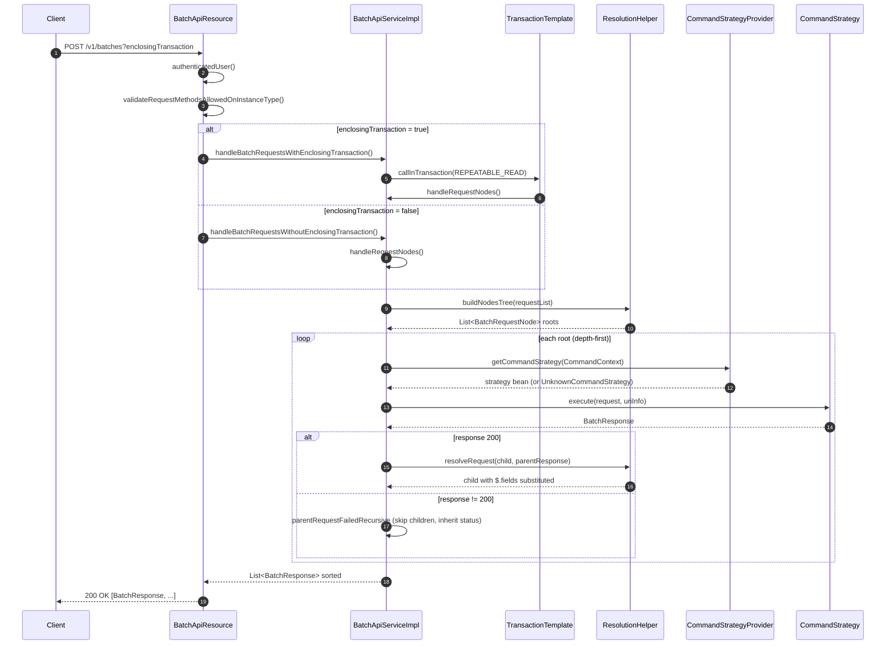

The Apache Fineract Batch API has one HTTP entry point. Every batched call —
client onboarding, loan lifecycle, charge collection, datatable maintenance —
goes through
[`BatchApiResource`](https://github.com/apache/fineract/blob/develop/fineract-core/src/main/java/org/apache/fineract/batch/api/BatchApiResource.java)
at `POST /v1/batches`. This page is the reference for that resource: the JAX-RS
contract, the request and response shapes, how `$.field` references are
resolved, how transactional mode rolls things back, and the body-size limit on
the related inline-COB endpoint.

For background and use cases, see the [Batch API overview](/batch/overview).
For the catalogue of handlers each sub-request can hit, see
[Internal command handlers](/batch/internal-command-handlers).

## File map

| File path | Module | Role |
| --- | --- | --- |
| `fineract-core/src/main/java/org/apache/fineract/batch/api/BatchApiResource.java` | core | JAX-RS resource at `POST /v1/batches` |
| `fineract-core/src/main/java/org/apache/fineract/batch/api/BatchApiResourceSwagger.java` | core | OpenAPI schema models |
| `fineract-core/src/main/java/org/apache/fineract/batch/domain/BatchRequest.java` | core | Sub-request DTO |
| `fineract-core/src/main/java/org/apache/fineract/batch/domain/BatchResponse.java` | core | Sub-response DTO |
| `fineract-core/src/main/java/org/apache/fineract/batch/domain/Header.java` | core | Name/value header pair |
| `fineract-core/src/main/java/org/apache/fineract/batch/serialization/BatchRequestJsonHelper.java` | core | Gson list deserializer |
| `fineract-core/src/main/java/org/apache/fineract/batch/service/BatchApiService.java` | core | Service interface |
| `fineract-core/src/main/java/org/apache/fineract/batch/service/BatchApiServiceImpl.java` | core | Dispatch, transactional wrapper, retry |
| `fineract-core/src/main/java/org/apache/fineract/batch/service/ResolutionHelper.java` | core | Dependency tree + `$.field` resolver |

## The JAX-RS binding

`BatchApiResource` is a Spring `@Component` annotated with `@Path("/v1/batches")`.
It consumes and produces `application/json`, exposes a single `POST` method,
and depends on three collaborators wired by constructor injection:

```java fineract-core/src/main/java/org/apache/fineract/batch/api/BatchApiResource.java
@Path("/v1/batches")
@Component
@Tag(name = "Batch API", description = """...""")
@RequiredArgsConstructor
public class BatchApiResource {

    private final PlatformSecurityContext context;
    private final BatchApiService service;
    private final FineractProperties fineractProperties;
```

| Collaborator | Used for |
| --- | --- |
| `PlatformSecurityContext` | `authenticatedUser()` — establishes the tenant user before dispatch |
| `BatchApiService` | Two execution modes: with or without enclosing transaction |
| `FineractProperties` | Read-only mode check; access to body-size limits |

### The single endpoint

```java fineract-core/src/main/java/org/apache/fineract/batch/api/BatchApiResource.java
@POST
@Consumes({ MediaType.APPLICATION_JSON })
@Produces({ MediaType.APPLICATION_JSON })
@Operation(summary = "Batch requests in a single transaction", description = """...""")
@RequestBody(required = true, content = @Content(array = @ArraySchema(
        schema = @Schema(implementation = BatchRequest.class, description = "request body"))))
@ApiResponse(responseCode = "200", description = "Success",
        content = @Content(array = @ArraySchema(schema = @Schema(implementation = BatchResponse.class))))
public List<BatchResponse> handleBatchRequests(
        @DefaultValue("false") @QueryParam("enclosingTransaction")
        @Parameter(description = "enclosingTransaction", required = false) final boolean enclosingTransaction,
        @Parameter(hidden = true) List<BatchRequest> requestList, @Context UriInfo uriInfo) {
    this.context.authenticatedUser();
    validateRequestMethodsAllowedOnInstanceType(requestList);
    return enclosingTransaction
            ? service.handleBatchRequestsWithEnclosingTransaction(requestList, uriInfo)
            : service.handleBatchRequestsWithoutEnclosingTransaction(requestList, uriInfo);
}
```

The method's responsibilities, in order:

1. **Authenticate** the caller via `PlatformSecurityContext.authenticatedUser()`.
   This is the standard Spring Security path used by every other resource — the
   batch resource is just a thin proxy.
2. **Validate against instance type** — if the instance is read-only, reject any
   non-`GET` sub-request immediately.
3. **Dispatch** to the service either inside a transaction (per the
   `enclosingTransaction` query parameter) or without one.
4. **Return** the consolidated `List<BatchResponse>` that JAX-RS will serialize
   back as a JSON array.

`uriInfo` is forwarded into every sub-request so that handlers reusing the
existing `*ApiResource` beans see the same query parameter context they would
get from a real HTTP call.

## Request parameters

| Parameter | Where | Type | Default | Description |
| --- | --- | --- | --- | --- |
| `enclosingTransaction` | `?enclosingTransaction=` query | boolean | `false` | When `true`, the whole batch runs in one Spring `TransactionTemplate` at `REPEATABLE_READ` isolation. Any failure marks the transaction rollback-only. |
| request body | HTTP body | `List<BatchRequest>` | — | JSON array of sub-requests. Deserialized by `BatchRequestJsonHelper`. |
| `UriInfo` | injected | JAX-RS context | — | Forwarded to each handler so the existing `*ApiResource` beans get the right query string. |

### `BatchRequest` body shape

[`BatchRequest`](https://github.com/apache/fineract/blob/develop/fineract-core/src/main/java/org/apache/fineract/batch/domain/BatchRequest.java)
is a small Lombok value object:

```java fineract-core/src/main/java/org/apache/fineract/batch/domain/BatchRequest.java
@NoArgsConstructor
@Data
@Accessors(chain = true)
public class BatchRequest {

    private Long requestId;
    private String relativeUrl;
    private String method;
    private Set<Header> headers;
    private Long reference;
    private String body;
}
```

| Field | Type | Required | Notes |
| --- | --- | --- | --- |
| `requestId` | `Long` | yes | Caller-assigned identifier. Used as the dependency key. Echoed into the matching `BatchResponse`. |
| `relativeUrl` | `String` | yes | URL after the API base, with or without the `v1/` prefix. May contain `$.field` placeholders. |
| `method` | `String` | yes | `GET`, `POST`, `PUT` or `DELETE`. |
| `headers` | `Set<Header>` | no | Pushed into `BatchRequestContextHolder` before each handler runs. |
| `reference` | `Long` | no | When set, the `requestId` of the parent sub-request — execution is deferred until the parent succeeds. |
| `body` | `String` | no | Raw JSON body. May contain `"$.field"` substitutions. |

### `BatchResponse` shape

[`BatchResponse`](https://github.com/apache/fineract/blob/develop/fineract-core/src/main/java/org/apache/fineract/batch/domain/BatchResponse.java)
mirrors the request:

```java fineract-core/src/main/java/org/apache/fineract/batch/domain/BatchResponse.java
@NoArgsConstructor
@Data
@Accessors(chain = true)
public class BatchResponse {

    private Long requestId;
    private Integer statusCode;
    private Set<Header> headers;
    private String body;
}
```

| Field | Type | Notes |
| --- | --- | --- |
| `requestId` | `Long` | Echoed from the request. The response array is sorted by this field before being returned. |
| `statusCode` | `Integer` | The HTTP status the underlying handler would have returned. `200` on success; skipped children inherit the parent's failure status; `500` (`SC_INTERNAL_SERVER_ERROR`) is used when `buildErrorResponse` cannot derive one from `ErrorInfo`. |
| `headers` | `Set<Header>` | The request's headers, plus any headers from `ErrorInfo` on failure. |
| `body` | `String` | Raw JSON body returned by the handler — or a server-generated error message. |

### `Header` pair

```java fineract-core/src/main/java/org/apache/fineract/batch/domain/Header.java
@NoArgsConstructor
@AllArgsConstructor
@Data
@Accessors(chain = true)
public class Header {

    private String name;
    private String value;
}
```

Headers carry tenant routing, locale, idempotency keys and Fineract-specific
context like the COB bypass flag. `BatchApiServiceImpl.executeRequest`
converts them to a map and stores them in
`BatchRequestContextHolder.setRequestAttributes(...)` before invoking the
strategy, so downstream code sees them exactly as it would on a normal REST
call.

## Deserialization

The request body comes off the wire as a JSON array. The Jersey/JAX-RS
runtime materialises it into `List<BatchRequest>` and passes it to
`handleBatchRequests`; for code paths that need to re-parse the string,
[`BatchRequestJsonHelper`](https://github.com/apache/fineract/blob/develop/fineract-core/src/main/java/org/apache/fineract/batch/serialization/BatchRequestJsonHelper.java)
extends Fineract's Gson-based `FromJsonHelper`:

```java fineract-core/src/main/java/org/apache/fineract/batch/serialization/BatchRequestJsonHelper.java
@Component
public class BatchRequestJsonHelper extends FromJsonHelper {

    public List<BatchRequest> extractList(final String json) {
        final Type listType = new TypeToken<List<BatchRequest>>() {}.getType();
        return super.getGsonConverter().fromJson(json, listType);
    }
}
```

The inbound array is parsed once at the JAX-RS boundary, while the
per-request `body` field stays a `String` until a handler (or the JsonPath
resolver) needs to look inside it. That avoids re-serializing deeply nested
loan-application bodies and lets each handler choose its own parser.

## Validation: read-only mode

The resource enforces the instance type before any handler runs:

```java fineract-core/src/main/java/org/apache/fineract/batch/api/BatchApiResource.java
private void validateRequestMethodsAllowedOnInstanceType(final List<BatchRequest> requestList) {
    if (fineractProperties.getMode().isReadOnlyMode()) {
        final Optional<BatchRequest> nonGetRequest = requestList.stream()
                .filter(batchRequest -> !HttpMethod.GET.equals(batchRequest.getMethod())).findFirst();
        if (nonGetRequest.isPresent()) {
            throw new InvalidInstanceTypeMethodException(nonGetRequest.get().getMethod());
        }
    }
}
```

This makes the batch endpoint safe to expose on a read-replica Fineract
instance: an accidental mix of `GET` and `POST` sub-requests fails up front
instead of silently writing to the wrong node.

## Dispatch flow

The resource hands the request list to
[`BatchApiServiceImpl`](https://github.com/apache/fineract/blob/develop/fineract-core/src/main/java/org/apache/fineract/batch/service/BatchApiServiceImpl.java).
The service builds the dependency tree, resolves references just before each
child runs, and dispatches via
[`CommandStrategyProvider`](https://github.com/apache/fineract/blob/develop/fineract-core/src/main/java/org/apache/fineract/batch/command/CommandStrategyProvider.java).



The service interface is small:

```java fineract-core/src/main/java/org/apache/fineract/batch/service/BatchApiServiceImpl.java
@Override
public List<BatchResponse> handleBatchRequestsWithoutEnclosingTransaction(
        final List<BatchRequest> requestList, UriInfo uriInfo) {
    return handleBatchRequests(requestList, uriInfo, false);
}

@Override
public List<BatchResponse> handleBatchRequestsWithEnclosingTransaction(
        final List<BatchRequest> requestList, final UriInfo uriInfo) {
    return handleBatchRequests(requestList, uriInfo, true);
}
```

Internally both call `handleBatchRequests` and use
`BatchRequestContextHolder.setIsEnclosingTransaction(...)` so that downstream
code (filters, idempotency, JPA flushing) can ask whether it is running in
batch transactional mode.

## Reference resolution: `$.field`

`ResolutionHelper` is the only place that understands `$.field` syntax. It is
called by `BatchApiServiceImpl.callRequestRecursive` after the parent runs and
before the child is dispatched:

```java fineract-core/src/main/java/org/apache/fineract/batch/service/BatchApiServiceImpl.java
requestNode.getChildNodes().forEach(childNode -> {
    BatchRequest childRequest = childNode.getRequest();
    BatchRequest resolvedChildRequest;
    try {
        resolvedChildRequest = this.resolutionHelper.resolveRequest(childRequest, response);
        callRequestRecursive(resolvedChildRequest, childNode, responseList, uriInfo);
    } catch (JsonPathException jpex) {
        responseList.add(buildOrThrowErrorResponse(jpex, childRequest));
    }
});
```

The resolver wraps the parent response with Jayway JsonPath's `ReadContext` and
walks the child's body:

```java fineract-core/src/main/java/org/apache/fineract/batch/service/ResolutionHelper.java
public BatchRequest resolveRequest(final BatchRequest request, final BatchResponse parentResponse) {

    final ReadContext responseCtx = JsonPath.parse(parentResponse.getBody());
    String requestBody = request.getBody();
    if (requestBody != null) {
        final JsonObject jsonRequestBody = this.fromJsonHelper.parse(requestBody).getAsJsonObject();
        JsonObject jsonResultBody = new JsonObject();
        for (Map.Entry<String, JsonElement> element : jsonRequestBody.entrySet()) {
            final String key = element.getKey();
            final JsonElement value = resolveDependentVariables(element.getValue(), requestBody, responseCtx);
            jsonResultBody.add(key, value);
        }
        request.setBody(jsonResultBody.toString());
    }
    // Also check the relativeUrl for any dependency resolution
    String relativeUrl = request.getRelativeUrl();
    if (relativeUrl.contains("$.")) {
        ...
    }
}
```

Three places get rewritten:

<Steps>
  <Step title="Top-level body fields">
    `{"clientId": "$.clientId"}` becomes `{"clientId": 123}` by running
    `JsonPath.read(parentBody, "$.clientId")`.
  </Step>
  <Step title="Nested body fields">
    `resolveDependentVariables` recurses through nested objects and arrays so
    that `$.` placeholders deep inside a complex loan-application body are
    resolved before the child runs.
  </Step>
  <Step title="`relativeUrl` placeholders">
    `v1/loans/$.loanId?command=approve` is rewritten to
    `v1/loans/42?command=approve` before being matched against the regex
    routing table in `CommandStrategyProvider`.
  </Step>
</Steps>

If the placeholder cannot be resolved (the parent response did not contain
that field) `JsonPath` throws `JsonPathException`. The service catches it,
synthesises an error `BatchResponse`, and — in transactional mode — marks
the transaction rollback-only.

### Invalid `reference`

[`ResolutionHelper.buildNodesTree`](https://github.com/apache/fineract/blob/develop/fineract-core/src/main/java/org/apache/fineract/batch/service/ResolutionHelper.java)
rejects sub-requests whose `reference` does not match any earlier
`requestId`:

```java fineract-core/src/main/java/org/apache/fineract/batch/service/ResolutionHelper.java
if (request.getReference() == null) {
    final BatchRequestNode node = new BatchRequestNode(request);
    rootNodes.add(node);
} else {
    if (!addDependingRequest(request, rootNodes)) {
        throw new BatchReferenceInvalidException(request.getReference());
    }
}
```

The service catches `BatchReferenceInvalidException`, returns a single error
response, and does not execute any sub-request.

## Transactional mode

When `enclosingTransaction=true`, `callInTransaction` opens a
`TransactionTemplate` at `REPEATABLE_READ`, registers the transaction
with `BatchRequestContextHolder`, and wraps the supplier with a Resilience4j
`Retry`:

```java fineract-core/src/main/java/org/apache/fineract/batch/service/BatchApiServiceImpl.java
Retry retry = retryConfigurationAssembler.getRetryConfigurationForBatchApiWithEnclosingTransaction();
List<BatchResponse> responseList = new ArrayList<>();
Supplier<List<BatchResponse>> batchSupplier = () -> {
    responseList.clear();
    try {
        TransactionTemplate transactionTemplate = new TransactionTemplate(transactionManager);
        transactionTemplate.setIsolationLevel(TransactionDefinition.ISOLATION_REPEATABLE_READ);
        if (transactionManager instanceof ExtendedJpaTransactionManager extendedJpaTransactionManager) {
            transactionTemplate.setReadOnly(extendedJpaTransactionManager.isReadOnlyConnection());
        }
        transactionConfigurator.accept(transactionTemplate);
        return transactionTemplate.execute(status -> {
            BatchRequestContextHolder.setEnclosingTransaction(status);
            responseList.addAll(request.get());
            return responseList;
        });
    } finally {
        BatchRequestContextHolder.resetTransaction();
    }
};
```

On a transient transaction failure (`TransactionSystemException`,
`NonTransientDataAccessException`) the retry policy re-runs the whole batch.
On a deliberate failure inside a sub-request, `buildOrThrowErrorResponse`
marks the transaction rollback-only and throws `BatchExecutionException`:

```java fineract-core/src/main/java/org/apache/fineract/batch/service/BatchApiServiceImpl.java
private BatchResponse buildOrThrowErrorResponse(RuntimeException ex, BatchRequest request) {
    BatchResponse response = buildErrorResponse(ex, request);
    if (response.getStatusCode() != SC_OK && BatchRequestContextHolder.isEnclosingTransaction()) {
        BatchRequestContextHolder.getTransaction().ifPresent(TransactionExecution::setRollbackOnly);
        throw new BatchExecutionException(request, ex);
    }
    return response;
}
```

`buildErrorResponses` then builds **one** consolidated response that includes
the original error body, sandwiched into a wrapper message:

```java fineract-core/src/main/java/org/apache/fineract/batch/service/BatchApiServiceImpl.java
body = "Transaction is being rolled back. First erroneous request: \n" + new Gson().toJson(response);
```

That is why a transactional batch that fails returns a list of length 1, not
N: the partial results would be misleading after a rollback.

<Note>
  In **non-transactional** mode each root sub-request commits independently and
  the response list contains an entry for every input — but children of a
  failing parent are still skipped, with a synthetic response carrying the
  parent's failure status code and a body of
  `"Parent request with id N was erroneous!"`, produced by
  `parentRequestFailedRecursive`.
</Note>

## JPA flushing inside a transactional batch

When the batch runs inside one transaction, JPA's deferred flush would let
later sub-requests read stale entity state. `BatchApiServiceImpl.executeRequest`
forces a flush between sub-requests:

```java fineract-core/src/main/java/org/apache/fineract/batch/service/BatchApiServiceImpl.java
if (BatchRequestContextHolder.isEnclosingTransaction()
        && BatchRequestContextHolder.getEnclosingTransaction().stream().anyMatch(ts -> !ts.isReadOnly())) {
    entityManager.flush();
}
BatchCallHandler callHandler = new BatchCallHandler(this.batchFilters, commandStrategy::execute);
final BatchResponse rootResponse = callHandler.serviceCall(request, uriInfo);
```

The flush ensures that when sub-request 2 reads the client created by
sub-request 1, it sees the row even though the transaction has not yet
committed.

## Filters and preprocessors

Before dispatch, the service runs the request through
`List<BatchRequestPreprocessor>` collected from the Spring context:

```java fineract-core/src/main/java/org/apache/fineract/batch/service/BatchApiServiceImpl.java
Either<RuntimeException, BatchRequest> preprocessorResult = runPreprocessors(request);
if (preprocessorResult.isLeft()) {
    return buildOrThrowErrorResponse(preprocessorResult.getLeft(), request);
} else {
    request = preprocessorResult.get();
}
```

It also wraps the handler call in `BatchCallHandler` so registered
`BatchFilter` beans can layer cross-cutting concerns (logging, audit,
idempotency) around the strategy's `execute` call.

## Body size limit (`fineract.api.body-item-size-limit.inline-loan-cob`)

The Batch API does not itself cap the number of sub-requests, but Fineract
ships one related, configurable cap that applies to the **inline loan COB**
runner — a sibling API that accepts a list of loan IDs to push through
close-of-business:

```properties fineract-provider/src/main/resources/application.properties
fineract.api.body-item-size-limit.inline-loan-cob=${FINERACT_API_REQUEST_BODY_SIZE_LIMIT_INLINE_COB:1000}
```

The property is bound by
[`FineractProperties.FineractBodyItemSizeLimitProperties`](https://github.com/apache/fineract/blob/develop/fineract-core/src/main/java/org/apache/fineract/infrastructure/core/config/FineractProperties.java):

```java fineract-core/src/main/java/org/apache/fineract/infrastructure/core/config/FineractProperties.java
private FineractBodyItemSizeLimitProperties bodyItemSizeLimit;

public static class FineractBodyItemSizeLimitProperties {

    private int inlineLoanCob;
}
```

And enforced by
[`InlineCommonLockableCOBExecutorService.validateLoanIdsListSize`](https://github.com/apache/fineract/blob/develop/fineract-provider/src/main/java/org/apache/fineract/cob/service/InlineCommonLockableCOBExecutorService.java):

```java fineract-provider/src/main/java/org/apache/fineract/cob/service/InlineCommonLockableCOBExecutorService.java
private void validateLoanIdsListSize(List<Long> loanIds) {
    int inlineLoanCobRequestItemLimit = fineractProperties.getApi().getBodyItemSizeLimit().getInlineLoanCob();
    if (loanIds.size() > inlineLoanCobRequestItemLimit) {
        String userMessage = "Size of the loan IDs list cannot be over " + inlineLoanCobRequestItemLimit;
        throw new PlatformRequestBodyItemLimitValidationException(userMessage);
    }
}
```

For pure `/v1/batches` traffic this property has no direct effect, but it is
the closest configurable limit Fineract exposes on batch-style payloads.
Operators sizing capacity for `/v1/batches` should still treat batches in the
low hundreds as the safe upper bound — the per-batch transaction at
`REPEATABLE_READ` and the JsonPath resolver are not free.

<Tip>
  Override the limit per environment via the
  `FINERACT_API_REQUEST_BODY_SIZE_LIMIT_INLINE_COB` environment variable. The
  default of `1000` is generous for daily COB but should be tuned downward on
  read-replicas or upward only after measuring P99 latency.
</Tip>

## OpenAPI surface

`BatchApiResourceSwagger` declares the request and response models used by the
generated OpenAPI document:

- `BatchApiResourceSwagger.BatchRequestSwagger` mirrors `BatchRequest` for the
  documented schema.
- `BatchApiResourceSwagger.BatchResponseSwagger` does the same for
  `BatchResponse`.

The `@Tag` description on `BatchApiResource` is the long-form prose the
generated Swagger UI shows under the *Batch API* heading, and the
`@Operation` on `handleBatchRequests` describes the transactional behaviour
for the operation page.

## Where to go next

<CardGroup cols={2}>
  <Card title="Batch API overview" icon="map" href="/batch/overview">
    Concepts, dispatch sequence, transactional vs non-transactional mode and
    use cases.
  </Card>
  <Card title="Internal command handlers" icon="list-check" href="/batch/internal-command-handlers">
    Every concrete `CommandStrategy` under `batch/command/internal/` with its
    method, URL pattern and upstream API resource.
  </Card>
</CardGroup>
