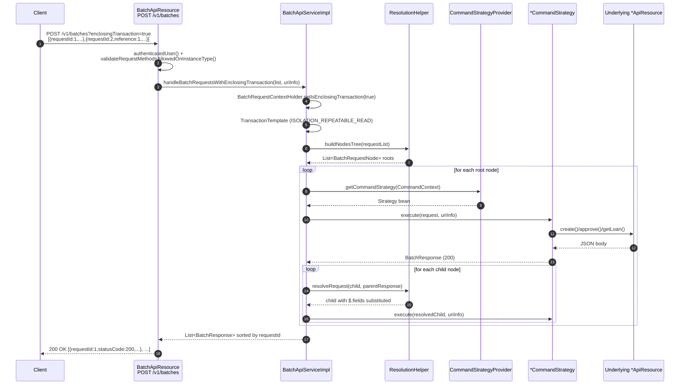

Apache Fineract exposes a single **Batch API** endpoint at `POST /v1/batches`
that lets a client pack many logical HTTP sub-requests — create a client,
apply a loan, approve it, disburse it — into one outer HTTP call. The server
unpacks the list, dispatches each sub-request to the same command handlers
the regular REST resources use, optionally substitutes values from earlier
sub-responses with [JsonPath](https://github.com/json-path/JsonPath)
expressions, and returns one consolidated response array. The whole flow can
be wrapped in a single database transaction so that any failure rolls back
every sibling write.

This page is the orientation map. The two companion pages dig into the
[REST resource that accepts the payload](/batch/batch-api-resource) and the
[catalogue of internal command handlers](/batch/internal-command-handlers)
that actually do the work.

## Why a Batch API exists

A typical client-onboarding flow needs at least four round-trips against the
classic REST surface:

1. `POST /v1/clients` to create the client.
2. `POST /v1/clients/{clientId}?command=activate` to activate them.
3. `POST /v1/loans` to apply for a loan against the new client.
4. `POST /v1/loans/{loanId}?command=approve` to approve it.

Each call pays the cost of HTTP framing, authentication, and a separate
servlet thread. Worse, the second and fourth calls need IDs returned by the
first and third — so the client has to parse the JSON, pull the `clientId`
or `loanId` out, then build the next URL itself.

The Batch API folds all four into one POST:

- The client sends an **array** of sub-requests, each tagged with a
  `requestId`.
- Sub-requests that depend on earlier ones declare a `reference` (the
  `requestId` of the parent) and use `"$.field"` placeholders to pull values
  out of the parent's response body or URL.
- The server executes the dependency tree, resolves the placeholders just
  before it dispatches each sub-request, and returns one response array
  sorted by `requestId`.
- Optionally, `?enclosingTransaction=true` wraps every sub-request in a
  single Spring `TransactionTemplate` so the whole batch is atomic — a
  failure anywhere triggers a rollback of all the writes.

The Tag annotation on
[`BatchApiResource`](https://github.com/apache/fineract/blob/develop/fineract-core/src/main/java/org/apache/fineract/batch/api/BatchApiResource.java)
spells out the contract:

```java fineract-core/src/main/java/org/apache/fineract/batch/api/BatchApiResource.java
@Tag(name = "Batch API", description = """
        The Apache Fineract Batch API enables a consumer to access significant
        amounts of data in a single call or to make changes to several objects
        at once. Batching allows a consumer to pass instructions for several
        operations in a single HTTP request. A consumer can also specify
        dependencies between related operations. Once all operations have been
        completed, a consolidated response will be passed back and the HTTP
        connection will be closed.
        ...""")
```

## Where the code lives

The Batch API is split across two Gradle modules. The wire contract — the
JAX-RS resource, the request and response value objects, and the dispatch
service — sit in `fineract-core`. The individual sub-request handlers, which
need to call into portfolio, savings, loan and datatable APIs, live in
`fineract-provider`.

| File path | Module | Purpose |
| --- | --- | --- |
| `fineract-core/src/main/java/org/apache/fineract/batch/api/BatchApiResource.java` | core | JAX-RS resource at `POST /v1/batches` |
| `fineract-core/src/main/java/org/apache/fineract/batch/domain/BatchRequest.java` | core | DTO for one sub-request |
| `fineract-core/src/main/java/org/apache/fineract/batch/domain/BatchResponse.java` | core | DTO for one sub-response |
| `fineract-core/src/main/java/org/apache/fineract/batch/domain/Header.java` | core | Name/value pair carried on each sub-request and sub-response |
| `fineract-core/src/main/java/org/apache/fineract/batch/serialization/BatchRequestJsonHelper.java` | core | Gson-backed list deserializer |
| `fineract-core/src/main/java/org/apache/fineract/batch/service/BatchApiService.java` | core | Service interface |
| `fineract-core/src/main/java/org/apache/fineract/batch/service/BatchApiServiceImpl.java` | core | Dispatch, transactionality, retries |
| `fineract-core/src/main/java/org/apache/fineract/batch/service/ResolutionHelper.java` | core | Dependency tree + `$.field` resolution |
| `fineract-core/src/main/java/org/apache/fineract/batch/command/CommandStrategy.java` | core | Sub-request handler SPI |
| `fineract-core/src/main/java/org/apache/fineract/batch/command/CommandStrategyProvider.java` | core | Regex route table |
| `fineract-provider/src/main/java/org/apache/fineract/batch/command/internal/` | provider | All concrete handlers (50+ classes) |

## The wire shape

A batch payload is a JSON array. Each element looks like a miniature HTTP
request, modelled by
[`BatchRequest`](https://github.com/apache/fineract/blob/develop/fineract-core/src/main/java/org/apache/fineract/batch/domain/BatchRequest.java):

```java fineract-core/src/main/java/org/apache/fineract/batch/domain/BatchRequest.java
@NoArgsConstructor
@Data
@Accessors(chain = true)
public class BatchRequest {

    private Long requestId;
    private String relativeUrl;
    private String method;
    private Set<Header> headers;
    private Long reference;
    private String body;
}
```

- `requestId` — caller-supplied identifier used to declare dependencies and
  to correlate responses.
- `relativeUrl` — the portion of the URL after `/fineract-provider/api/`,
  for example `v1/clients` or `loans/$.loanId?command=approve`. The Batch
  API normalises both `v1/clients` and plain `clients` to keep older
  clients working.
- `method` — `GET`, `POST`, `PUT` or `DELETE`.
- `headers` — optional list of name/value pairs. They are pushed into
  `BatchRequestContextHolder.setRequestAttributes(...)` before the handler
  runs so downstream code (locale, tenant, idempotency keys) sees the same
  headers as a normal REST call.
- `reference` — when set, the `requestId` of the parent sub-request. The
  dispatcher will not execute this sub-request until the parent succeeds,
  and will run it against the parent's response for `$.field` resolution.
- `body` — JSON string forwarded as-is to the handler.

The response mirrors the request via
[`BatchResponse`](https://github.com/apache/fineract/blob/develop/fineract-core/src/main/java/org/apache/fineract/batch/domain/BatchResponse.java):

```java fineract-core/src/main/java/org/apache/fineract/batch/domain/BatchResponse.java
@NoArgsConstructor
@Data
@Accessors(chain = true)
public class BatchResponse {

    private Long requestId;
    private Integer statusCode;
    private Set<Header> headers;
    private String body;
}
```

## Anatomy of a chained batch

The canonical demo is a four-step onboarding chain that creates a client,
activates them, applies a loan, and approves it. The sub-requests use
`reference` to chain into a parent-child tree and `$.field` placeholders to
pull `clientId` and `loanId` from earlier responses.

```json
[
  {
    "requestId": 1,
    "relativeUrl": "v1/clients",
    "method": "POST",
    "body": "{\"officeId\":1,\"firstname\":\"Anu\",\"lastname\":\"Demo\",\"active\":false,\"locale\":\"en\",\"dateFormat\":\"dd MMMM yyyy\",\"submittedOnDate\":\"15 October 2024\"}"
  },
  {
    "requestId": 2,
    "relativeUrl": "v1/clients/$.clientId?command=activate",
    "method": "POST",
    "reference": 1,
    "body": "{\"locale\":\"en\",\"dateFormat\":\"dd MMMM yyyy\",\"activationDate\":\"15 October 2024\"}"
  },
  {
    "requestId": 3,
    "relativeUrl": "v1/loans",
    "method": "POST",
    "reference": 2,
    "body": "{\"clientId\":\"$.clientId\",\"productId\":1,\"principal\":\"5000\",\"loanType\":\"individual\", ...}"
  },
  {
    "requestId": 4,
    "relativeUrl": "v1/loans/$.loanId?command=approve",
    "method": "POST",
    "reference": 3,
    "body": "{\"approvedOnDate\":\"15 October 2024\",\"approvedLoanAmount\":\"5000\",\"locale\":\"en\",\"dateFormat\":\"dd MMMM yyyy\"}"
  }
]
```

The dependency tree built by
[`ResolutionHelper.buildNodesTree`](https://github.com/apache/fineract/blob/develop/fineract-core/src/main/java/org/apache/fineract/batch/service/ResolutionHelper.java)
is a single linear chain: `1 → 2 → 3 → 4`. The dispatcher walks the chain
depth-first; if any node returns a non-200 status, the remaining children
are skipped and a synthetic `409 Conflict` response is emitted in their
place.

## Dispatch sequence

The transactional path runs the whole tree inside one Spring
`TransactionTemplate`, retrying on optimistic-lock failures. The
non-transactional path commits each root sub-request independently.



The orchestrator code is in
[`BatchApiServiceImpl.callRequestRecursive`](https://github.com/apache/fineract/blob/develop/fineract-core/src/main/java/org/apache/fineract/batch/service/BatchApiServiceImpl.java):

```java fineract-core/src/main/java/org/apache/fineract/batch/service/BatchApiServiceImpl.java
private void callRequestRecursive(BatchRequest request, BatchRequestNode requestNode,
        List<BatchResponse> responseList, UriInfo uriInfo) {
    // run current node
    BatchResponse response = executeRequest(request, uriInfo);
    responseList.add(response);
    if (response.getStatusCode() != null && response.getStatusCode() == SC_OK) {
        // run child nodes
        requestNode.getChildNodes().forEach(childNode -> {
            BatchRequest childRequest = childNode.getRequest();
            BatchRequest resolvedChildRequest;
            try {
                resolvedChildRequest = this.resolutionHelper.resolveRequest(childRequest, response);
                callRequestRecursive(resolvedChildRequest, childNode, responseList, uriInfo);
            } catch (JsonPathException jpex) {
                responseList.add(buildOrThrowErrorResponse(jpex, childRequest));
            }
        });
    } else {
        responseList.addAll(parentRequestFailedRecursive(request, requestNode, response, null));
    }
}
```

## Transactional vs non-transactional mode

The `enclosingTransaction` query parameter flips between two execution
strategies, both implemented in the same service:

<Tabs>
  <Tab title="enclosingTransaction=false (default)">
    Each root sub-request commits independently. A failure in sub-request 3
    does not roll back the writes from 1 and 2. Children of a failing parent
    are still short-circuited — they receive a `409` body of
    `"Parent request with id N was erroneous!"` — but every other root
    branch runs.

    ```java fineract-core/src/main/java/org/apache/fineract/batch/service/BatchApiServiceImpl.java
    @Override
    public List<BatchResponse> handleBatchRequestsWithoutEnclosingTransaction(
            final List<BatchRequest> requestList, UriInfo uriInfo) {
        return handleBatchRequests(requestList, uriInfo, false);
    }
    ```
  </Tab>
  <Tab title="enclosingTransaction=true">
    The full tree runs inside one Spring `TransactionTemplate` at
    `ISOLATION_REPEATABLE_READ`. Any failure marks the transaction
    rollback-only and the service returns a single synthesised response
    describing the first failing sub-request. `RetryConfigurationAssembler`
    re-runs the whole batch on transient
    `ConcurrencyFailureException`/`TransactionSystemException` errors.

    ```java fineract-core/src/main/java/org/apache/fineract/batch/service/BatchApiServiceImpl.java
    TransactionTemplate transactionTemplate = new TransactionTemplate(transactionManager);
    transactionTemplate.setIsolationLevel(TransactionDefinition.ISOLATION_REPEATABLE_READ);
    if (transactionManager instanceof ExtendedJpaTransactionManager extendedJpaTransactionManager) {
        transactionTemplate.setReadOnly(extendedJpaTransactionManager.isReadOnlyConnection());
    }
    ```
  </Tab>
</Tabs>

The
[`BatchApiResource.handleBatchRequests`](https://github.com/apache/fineract/blob/develop/fineract-core/src/main/java/org/apache/fineract/batch/api/BatchApiResource.java)
method just toggles the two:

```java fineract-core/src/main/java/org/apache/fineract/batch/api/BatchApiResource.java
return enclosingTransaction
    ? service.handleBatchRequestsWithEnclosingTransaction(requestList, uriInfo)
    : service.handleBatchRequestsWithoutEnclosingTransaction(requestList, uriInfo);
```

<Warning>
  Transactional mode runs at REPEATABLE\_READ isolation against the configured
  datasource. If the JDBC driver downgrades the level (for example MySQL on
  some configurations) the dispatcher relies on
  `RetryConfigurationAssembler.getRetryConfigurationForBatchApiWithEnclosingTransaction()`
  to retry on `ConcurrencyFailureException`. Tune the retry policy if your
  batches contend on hot rows.
</Warning>

## `$.field` reference resolution

Children are resolved by
[`ResolutionHelper.resolveRequest`](https://github.com/apache/fineract/blob/develop/fineract-core/src/main/java/org/apache/fineract/batch/service/ResolutionHelper.java)
using [Jayway JsonPath](https://github.com/json-path/JsonPath). The parent
response body is wrapped in a `ReadContext`, and any string in the child's
body or `relativeUrl` that starts with `$.` is treated as a JsonPath query.

The resolver supports three substitution sites:

1. **Body values** — a top-level field whose value is `"$.clientId"` is
   replaced with the actual `clientId` pulled from the parent JSON.
2. **Nested body values** — `resolveDependentVariables` recurses into
   nested JSON objects and arrays.
3. **URL placeholders** — `relativeUrl` is scanned for `$.` tokens. They are
   resolved before the dispatcher hands the URL to the strategy provider,
   so the routing regex sees the substituted numeric ID.

When the parent JSON does not contain a referenced field, JsonPath throws
`JsonPathException` and the resolver synthesises a `BatchResponse` with the
error.

## Dependency tree, not a flat list

`reference` is not limited to direct parents. The
[`BatchApiResource` Tag description](https://github.com/apache/fineract/blob/develop/fineract-core/src/main/java/org/apache/fineract/batch/api/BatchApiResource.java)
calls this out explicitly: *"Batch API is able to handle deeply nested
dependent requests as well [as] nested parameters. As shown in the example,
requests are dependent on each other as, 1\<--2\<--6, i.e a nested
dependency, where request '6' is not directly dependent on request '1' but
still it is one of the nested child of request '1'."*

[`ResolutionHelper.buildNodesTree`](https://github.com/apache/fineract/blob/develop/fineract-core/src/main/java/org/apache/fineract/batch/service/ResolutionHelper.java)
builds an N-ary tree:

```java fineract-core/src/main/java/org/apache/fineract/batch/service/ResolutionHelper.java
public List<BatchRequestNode> buildNodesTree(final List<BatchRequest> requests) {
    final List<BatchRequestNode> rootNodes = new ArrayList<>();
    for (BatchRequest request : requests) {
        if (request.getReference() == null) {
            final BatchRequestNode node = new BatchRequestNode(request);
            rootNodes.add(node);
        } else {
            if (!addDependingRequest(request, rootNodes)) {
                throw new BatchReferenceInvalidException(request.getReference());
            }
        }
    }
    return rootNodes;
}
```

A sub-request that references a non-existent `requestId` is rejected up
front with
`BatchReferenceInvalidException` — that error is converted to a single
`BatchResponse` and the whole call returns without executing anything.

## Common use cases

<CardGroup cols={2}>
  <Card title="Client onboarding pipeline" icon="user-plus">
    Create a client, activate them, attach an identifier, open a savings
    account, and apply for a loan — all in one POST with three `reference`
    chains.
  </Card>
  <Card title="Loan lifecycle in one call" icon="hand-holding-dollar">
    Apply, approve, and disburse a loan against an existing client in one
    transaction, so a half-approved loan can never escape on partial
    failure.
  </Card>
  <Card title="Mass charge collection" icon="receipt">
    Fan out `GET v1/loans/{id}/charges` for many loans and stream the
    consolidated array back to the back-office tool without N HTTP
    round-trips.
  </Card>
  <Card title="Bulk datatable maintenance" icon="table">
    Mix `POST`, `PUT` and `DELETE` against the same datatable so a single
    sync job from an upstream CRM rolls back as a unit.
  </Card>
  <Card title="Account-to-account transfers" icon="arrow-right-arrow-left">
    Make a deposit, then create a transfer that references the deposit
    transaction's account number via `$.fromAccountId`.
  </Card>
  <Card title="Reschedule + approve" icon="calendar-days">
    Submit a reschedule request and approve it in one batch, so a rejected
    approval cleanly rolls back the underlying request.
  </Card>
</CardGroup>

## Body size limit for inline loan COB

Batches are also used to drive the **Inline Loan COB** (close-of-business)
executor, which accepts a list of loan IDs to advance through the COB
pipeline. To prevent an operator from running an unbounded COB inside a
synchronous HTTP call, the size of that loan-ID list is capped by the
`fineract.api.body-item-size-limit.inline-loan-cob` property. The default
ships at `1000`:

```properties fineract-provider/src/main/resources/application.properties
fineract.api.body-item-size-limit.inline-loan-cob=${FINERACT_API_REQUEST_BODY_SIZE_LIMIT_INLINE_COB:1000}
```

The limit is enforced by
[`InlineCommonLockableCOBExecutorService.validateLoanIdsListSize`](https://github.com/apache/fineract/blob/develop/fineract-provider/src/main/java/org/apache/fineract/cob/service/InlineCommonLockableCOBExecutorService.java):

```java fineract-provider/src/main/java/org/apache/fineract/cob/service/InlineCommonLockableCOBExecutorService.java
private void validateLoanIdsListSize(List<Long> loanIds) {
    int inlineLoanCobRequestItemLimit = fineractProperties.getApi().getBodyItemSizeLimit().getInlineLoanCob();
    if (loanIds.size() > inlineLoanCobRequestItemLimit) {
        String userMessage = "Size of the loan IDs list cannot be over " + inlineLoanCobRequestItemLimit;
        throw new PlatformRequestBodyItemLimitValidationException(userMessage);
    }
}
```

The Batch API itself does not impose a hard count on sub-requests, but the
per-batch transaction at `REPEATABLE_READ` and the JsonPath resolver are
not free — keep batches in the low hundreds for predictable latency.

## What read-only mode does to a batch

[`BatchApiResource.validateRequestMethodsAllowedOnInstanceType`](https://github.com/apache/fineract/blob/develop/fineract-core/src/main/java/org/apache/fineract/batch/api/BatchApiResource.java)
scans the request list before dispatch. If the instance is running in
read-only mode (`FineractProperties.Mode.isReadOnlyMode()`), the first
non-`GET` sub-request raises an `InvalidInstanceTypeMethodException` and the
whole batch is rejected:

```java fineract-core/src/main/java/org/apache/fineract/batch/api/BatchApiResource.java
private void validateRequestMethodsAllowedOnInstanceType(final List<BatchRequest> requestList) {
    if (fineractProperties.getMode().isReadOnlyMode()) {
        final Optional<BatchRequest> nonGetRequest = requestList.stream()
                .filter(batchRequest -> !HttpMethod.GET.equals(batchRequest.getMethod())).findFirst();
        if (nonGetRequest.isPresent()) {
            throw new InvalidInstanceTypeMethodException(nonGetRequest.get().getMethod());
        }
    }
}
```

That makes read-replica clusters safe to expose at `/v1/batches` for
reporting workloads without risk of accidental writes.

## Where to go next

<CardGroup cols={2}>
  <Card title="BatchApiResource & dispatcher" icon="route" href="/batch/batch-api-resource">
    Path bindings, query parameters, the request and response shape, and
    how `$.field` references are resolved end-to-end.
  </Card>
  <Card title="Command handler catalogue" icon="list-check" href="/batch/internal-command-handlers">
    Every concrete `CommandStrategy` under
    `batch/command/internal/` with its sub-request method, URL pattern and
    upstream API resource.
  </Card>
</CardGroup>
