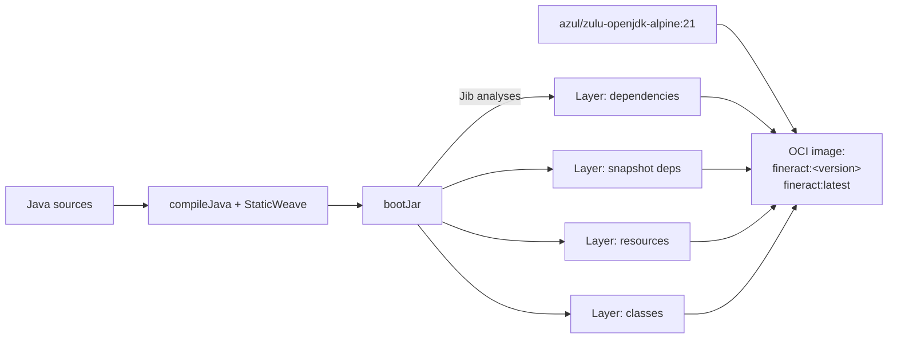
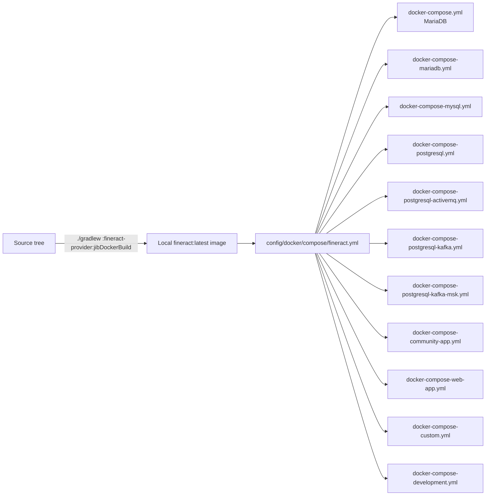

Apache Fineract does not ship a hand-written `Dockerfile`. Instead, the `fineract-provider` Spring Boot application is packaged into an **OCI image** by **Google Jib**, the resulting image is consumed by a family of **docker-compose** flavours at the repository root that combine it with the supported databases, message brokers, and Mifos UI front-ends, and the same image is referenced from the manifests under `kubernetes/`. This page walks through the Jib configuration, the layering it produces, and every `docker-compose-*.yml` flavour you can use to build, test, and deploy Fineract.

## How the image is built

Image building is configured per-module in `fineract-provider/build.gradle`. The root build declares `id 'com.google.cloud.tools.jib' version '3.4.5' apply false` so any subproject can opt in; `fineract-provider` does:

```groovy
// fineract-provider/build.gradle
apply plugin: 'com.google.cloud.tools.jib'
```

The Jib configuration block:

```groovy
jib {
    from {
        image = 'azul/zulu-openjdk-alpine:21'
        platforms {
            platform {
                architecture = System.getProperty("os.arch").equals("aarch64") ? "arm64" : "amd64"
                os = 'linux'
            }
        }
    }

    to {
        image = 'fineract'
        tags = ["${project.version}", 'latest']
    }

    container {
        creationTime = 'USE_CURRENT_TIMESTAMP'
        mainClass = 'org.apache.fineract.ServerApplication'
        extraClasspath = ['/app/plugins/*']
        args = [
            '-Duser.home=/tmp',
            '-Dfile.encoding=UTF-8',
            '-Duser.timezone=UTC',
            '-Djava.security.egd=file:/dev/./urandom'
        ]
        ports = ['8080/tcp', '8443/tcp']
        labels = [maintainer: 'Aleksandar Vidakovic <aleks@apache.org>']
        user = 'nobody:nogroup'
    }

    allowInsecureRegistries = true

    dependencies {
        implementation 'org.mariadb.jdbc:mariadb-java-client'
        implementation 'org.postgresql:postgresql'
    }
}

tasks.jib.dependsOn(bootJar, resolve, generateGitProperties)
tasks.jibDockerBuild.dependsOn(bootJar, resolve, generateGitProperties)
```

Key points:

- **Base image** — `azul/zulu-openjdk-alpine:21`. Alpine keeps the image small; Zulu's `headful` builds avoid the missing-fontconfig issues that hit some report features on `headless` JDKs.
- **Multi-arch** — the host's architecture is autodetected, so an Apple Silicon developer builds an `arm64` image and an Intel CI runner builds `amd64`. Cross-arch publishing requires running both targets separately.
- **Tags** — every build pushes both `${project.version}` (Git-versioning produces e.g. `1.13.1-SNAPSHOT`) and `latest`.
- **Multi-stage by construction** — Jib does not need a Dockerfile or a builder stage. It receives the already-assembled Spring Boot fat JAR from `bootJar` and projects it into **separate layers** (dependencies, snapshot dependencies, resources, classes) so that a typical code change only invalidates the smallest layer.
- **Extra classpath `/app/plugins/*`** — lets operators drop additional JARs into the running container without rebuilding the image.
- **Non-root user** — the container runs as `nobody:nogroup` for least-privilege execution.
- **JDBC drivers** — MariaDB and PostgreSQL drivers are baked into the image (the MySQL driver is licensed differently and must be supplied through `/app/plugins/`).

### The two Jib tasks

| Task | Effect |
| --- | --- |
| `./gradlew :fineract-provider:jib` | Builds the image and pushes it to the configured registry. |
| `./gradlew :fineract-provider:jibDockerBuild` | Builds the image into the **local Docker daemon** (no registry required). |

`jib` and `jibDockerBuild` both depend on `bootJar`, `resolve` (resolves the Swagger annotations), and `generateGitProperties` (so `git.commit.id` ends up in `/actuator/info`).

### "Multi-stage build" without a Dockerfile

Although there is no literal `FROM ... AS builder` stage, Jib produces the same outcome:



The "builder" stage runs **on the Gradle JVM**, not inside Docker; only the assembled layers are written to the image, so neither the Gradle daemon nor the JDK ends up in the final artefact.

### The `custom:docker` flavour

`settings.gradle` includes `:custom:docker`, a separate subproject that produces a custom image bundling every module discovered under `custom/<company>/<category>/<module>/`. This is what `docker-compose-custom.yml` references.

## The compose flavours

All compose files live at the repository root, and every flavour reuses the modular fragments in `config/docker/compose/*.yml` and the env files in `config/docker/env/*.env`:

```text
config/docker/
├── compose/
│   ├── activemq.yml
│   ├── fineract-custom.yml
│   ├── fineract.yml
│   ├── logging-loki.yml
│   ├── mariadb.yml
│   ├── observability.yml
│   └── postgresql.yml
└── env/
    ├── activemq.env
    ├── aws.env
    ├── cloudwatch.env
    ├── debug.env
    ├── fineract-common.env
    ├── fineract-manager.env
    ├── fineract-mariadb.env
    ├── fineract-postgresql.env
    ├── fineract-worker.env
    ├── fineract.env
    ├── kafka-client-msk.env
    ├── kafka-client.env
    ├── kafka-server.env
    ├── mariadb.env
    ├── mysql.env
    ├── oltp.env
    ├── postgresql.env
    ├── prometheus.env
    └── tracing.env
```

`config/docker/compose/fineract.yml` is the shared service definition every compose flavour `extends`:

```yaml
services:
  fineract:
    image: fineract:latest
    user: "${FINERACT_USER}:${FINERACT_GROUP}"
    volumes:
      - ${PWD}/config/docker/logback/logback-override.xml:/app/logback-override.xml
      - ${PWD}/config/docker/aws/etc/credentials:/etc/aws/credentials:ro
      - ${PWD}/build/fineract/logs:/var/logs/fineract:rw
    healthcheck:
      test: ['CMD', 'sh', '-c', 'echo -e "Checking for the availability of Fineract server deployment"; while ! nc -z "localhost" 8443; do sleep 1; printf "-"; done; echo -e " >> Fineract server has started";']
      timeout: 1s
      retries: 60
```

The image tag `fineract:latest` is exactly the one produced by `./gradlew :fineract-provider:jibDockerBuild`.

### Database-only flavours

| File | What it deploys | Use |
| --- | --- | --- |
| `docker-compose.yml` | MariaDB + Fineract (8443 + 5000) | Default one-shot dev run. |
| `docker-compose-mariadb.yml` | MariaDB 12.2 + Fineract | Stand-alone MariaDB stack with port 3306 exposed. |
| `docker-compose-mysql.yml` | MySQL 8 + Fineract | MySQL stack with the MySQL JDBC driver injected via env vars. |
| `docker-compose-postgresql.yml` | PostgreSQL + Fineract | PostgreSQL stack reusing the modular `postgresql.yml`. |

All three of these chain to the same Jib-built image; only the env files and `extends`-target services differ. For example:

```yaml
# docker-compose.yml
services:
  db:
    extends: { file: ./config/docker/compose/mariadb.yml, service: mariadb }
  fineract:
    extends: { file: ./config/docker/compose/fineract.yml, service: fineract }
    ports: ["8443:8443", "5000:5000"]
    depends_on:
      db:
        condition: service_healthy
    env_file:
      - ./config/docker/env/fineract.env
      - ./config/docker/env/fineract-common.env
      - ./config/docker/env/fineract-mariadb.env
```

### Messaging flavours

| File | Adds | Use |
| --- | --- | --- |
| `docker-compose-postgresql-activemq.yml` | ActiveMQ Classic broker | External-events pipeline over JMS to ActiveMQ. |
| `docker-compose-postgresql-test-activemq.yml` | ActiveMQ + test profile | Used by CI to drive E2E messaging assertions. |
| `docker-compose-postgresql-kafka.yml` | A self-hosted `apache/kafka:4.1.1-rc2` broker + a **`fineract-manager`** and replicated **`fineract-worker`** | Manager-worker COB topology backed by Kafka. |
| `docker-compose-postgresql-kafka-msk.yml` | Wires the same manager/worker pair to **AWS MSK** through `kafka-client-msk.env` | Multi-AZ AWS-hosted broker. |

The Kafka flavour shows off the manager/worker split:

```yaml
# docker-compose-postgresql-kafka.yml (excerpt)
services:
  kafka:
    image: "apache/kafka:4.1.1-rc2"
    ports: ["9092:9092"]
    env_file: [./config/docker/env/kafka-server.env]

  db:
    extends: { file: ./config/docker/compose/postgresql.yml, service: postgresql }

  fineract-manager:
    extends: { file: ./config/docker/compose/fineract.yml, service: fineract }
    ports: ["8443:8443"]
    depends_on:
      db:    { condition: service_healthy }
      kafka: { condition: service_started }
    env_file:
      - ./config/docker/env/fineract-manager.env
      - ./config/docker/env/fineract-common.env
      - ./config/docker/env/fineract-postgresql.env
      - ./config/docker/env/kafka-client.env

  fineract-worker:
    extends: { file: ./config/docker/compose/fineract.yml, service: fineract }
    deploy: { mode: replicated, replicas: 2 }
    ports: ["8444-8445:8443"]
    ...
```

### Frontend / UI flavours

| File | Front-end | Backend port | Frontend port |
| --- | --- | --- | --- |
| `docker-compose-community-app.yml` | `openmf/community-app:latest` (AngularJS Mifos Community App) | 8443 | 9090 |
| `docker-compose-web-app.yml` | `openmf/web-app:master` (modern Angular Mifos Web App) | 8443 | 4200 |

These add a UI service on top of the database+Fineract stack so that a single `docker compose up` brings up both the API and a browseable front-end pointed at it.

### Custom and development flavours

| File | What it does |
| --- | --- |
| `docker-compose-custom.yml` | Uses the `custom:docker` image built from the `custom/` extension modules; convenient for downstream distributions. |
| `docker-compose-development.yml` | Bolts on a Loki/Grafana logging stack (see `x-logging:` block) and Prometheus / OTEL sidecars from `observability.yml`. Use for local performance and observability work. |

The development flavour pins a Loki-driver logging config:

```yaml
x-logging: &default-logging
  driver: loki
  options:
    loki-url: 'http://localhost:3100/api/prom/push'
    loki-pipeline-stages: |
      - multiline: { firstline: '^\d{4}-\d{2}-\d{2} ...', max_wait_time: 3s }
```

## End-to-end picture



## Running the stack

A typical local development session:

```bash
# 1. Build the image
./gradlew :fineract-provider:jibDockerBuild

# 2. Bring up MariaDB + Fineract
docker compose -f docker-compose.yml up -d

# 3. Browse Swagger
xdg-open https://localhost:8443/fineract-provider/swagger-ui/index.html

# 4. Bring it down
docker compose -f docker-compose.yml down -v
```

To switch to PostgreSQL + Kafka instead:

```bash
docker compose -f docker-compose-postgresql-kafka.yml up -d
```

To run with the Mifos Web App UI:

```bash
docker compose -f docker-compose-web-app.yml up -d
# then open http://localhost:4200 (UI) — it talks to https://localhost:8443 (API)
```

## Environment variables you'll touch

Each `.env` file under `config/docker/env/` carries a focused slice of configuration. The most often-overridden ones:

- `fineract.env` — Spring profile, `FINERACT_NODE_ID`, public hostname.
- `fineract-common.env` — JVM `JAVA_TOOL_OPTIONS`, default tenant identifier (`default`).
- `fineract-mariadb.env` / `fineract-postgresql.env` — Hikari pool sizing, JDBC URL, credentials.
- `fineract-manager.env` / `fineract-worker.env` — set `FINERACT_PARTITIONED_JOB_PARTITION_MANAGER_NODE` and worker identifiers for the COB manager/worker topology.
- `kafka-client.env`, `kafka-client-msk.env`, `kafka-server.env` — broker addresses, security protocol, IAM/SASL config.
- `activemq.env` — broker URL, credentials, persistence settings.

## Building a release image for another registry

To publish the same image to a registry like GHCR or Docker Hub:

```bash
./gradlew :fineract-provider:jib \
    -Djib.to.image=ghcr.io/yourorg/fineract \
    -Djib.to.tags=1.13.1,latest \
    -Djib.to.auth.username=$REGISTRY_USER \
    -Djib.to.auth.password=$REGISTRY_PASS
```

Because Jib's `allowInsecureRegistries = true`, the build will also push to a private registry running plain HTTP.

## Operational details inside the running container

Once the container is running you can confirm the layout:

```bash
docker exec -it <fineract-container> sh
# Application layout (created by Jib):
ls /app           # classes/  libs/  resources/  jib-classpath-file  jib-main-class-file
ls /app/plugins/  # empty by default; mount your JAR plugins here
ps -ef            # PID 1 is `java ... org.apache.fineract.ServerApplication`
```

`/var/logs/fineract` and `/tmp` are mounted from the host in the default compose flavour to make log rotation and ephemeral writes friendly to the read-only Alpine root filesystem.

## Why Jib over a Dockerfile

- **Reproducible** — no apt-get/apk caches in the image, no timing-dependent layer order.
- **Fast** — no `docker build` daemon, no rebuild of the JDK on every change, layered fat-JAR caching cuts CI image-build time to seconds.
- **Multi-arch** — flip a Gradle system property and you publish for `arm64`.
- **No Docker required at build time** — `jib` pushes straight to the registry; only `jibDockerBuild` needs a local Docker daemon.

## Beyond Compose: Kubernetes

The same `fineract:latest` image referenced by every compose flavour is also the one assumed by the Kubernetes manifests under `kubernetes/` (`apache/fineract:latest` for the published image, `fineract:latest` for a locally-built image). See [Kubernetes manifests](/build/kubernetes-manifests) for the deployment, service, configmap, and secret layout.
