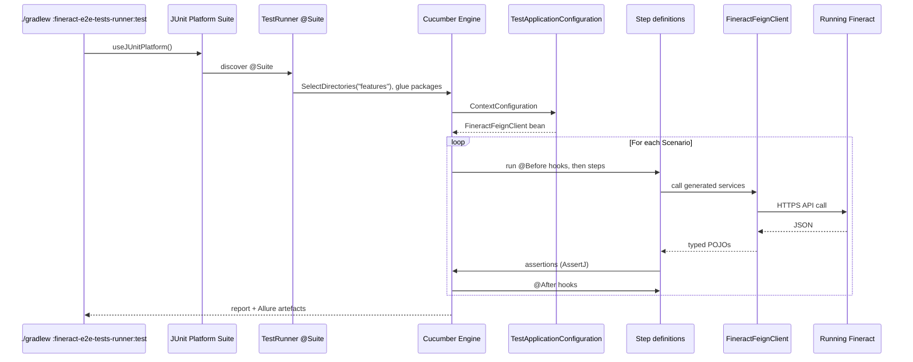

Apache Fineract carries one of the largest open-source Cucumber suites in the financial-services space: **101 Gherkin feature files** describing every behaviour from "Loan creation functionality in Fineract" to "Working Capital — Period Payment Rate", driven by **49 Java step-definition classes**, hooked into Allure for reporting, and executed as a single JUnit Platform Suite that talks to a live Fineract server via the Feign-based `fineract-client-feign` SDK. This page documents how the two modules — `fineract-e2e-tests-core` (the step definitions and infrastructure) and `fineract-e2e-tests-runner` (the suite + the `.feature` files) — build, what they test, and how to drive them from Gradle.

## The two modules

```text
fineract-e2e-tests-core/                            # Step definitions, helpers, Feign config
├── build.gradle
└── src/test/java/org/apache/fineract/test/
    ├── api/                                        # FineractClientConfiguration, ApiProperties
    ├── config/                                     # Spring TestApplicationConfiguration, DB config
    ├── data/                                       # Enums + data builders (60+ enum classes)
    ├── factory/                                    # Domain factories
    ├── helper/                                     # High-level test helpers
    ├── messaging/                                  # ActiveMQ external-events listeners
    └── stepdef/                                    # 49 Cucumber step-definition classes
        ├── AbstractStepDef.java
        ├── account/AccountTransferStepDef.java
        ├── assetexternalization/AssetExternalizationStepDef.java
        ├── common/                                 # ClientStepDef, BusinessDateStepDef, …
        ├── datatable/DatatablesStepDef.java
        ├── hook/                                   # 4 Cucumber lifecycle hooks
        ├── loan/                                   # 30+ loan step-defs
        ├── reporting/ReportingStepDef.java
        └── saving/SavingsAccountStepDef.java

fineract-e2e-tests-runner/                          # JUnit Platform Suite + .feature files
├── build.gradle
└── src/test/
    ├── java/org/apache/fineract/test/
    │   └── TestRunner.java                         # The single @Suite class
    └── resources/features/
        ├── 0_COB.feature
        ├── AccountTransfer.feature
        ├── BatchApi.feature
        ├── Client.feature
        ├── Loan-Part1.feature .. Loan-Part4.feature
        ├── LoanRepayment-Part1.feature .. Part4.feature
        ├── … 101 *.feature files total …
        └── WorkingCapital_COB.feature
```

The two-module split keeps the runtime artefacts small (the runner only carries the runner class and the features) and lets the step definitions evolve in a single `:fineract-e2e-tests-core:compileTestJava` step that the runner reuses through `testImplementation(project(':fineract-e2e-tests-core').sourceSets.test.output)`.

## The runner: `TestRunner.java`

The runner is one class — every other detail comes from JUnit Platform Suite annotations and a `cucumber { ... }` Gradle DSL block.

```java
// fineract-e2e-tests-runner/src/test/java/org/apache/fineract/test/TestRunner.java
package org.apache.fineract.test;

import static io.cucumber.junit.platform.engine.Constants.GLUE_PROPERTY_NAME;
import static io.cucumber.junit.platform.engine.Constants.PLUGIN_PROPERTY_NAME;

import org.junit.platform.suite.api.ConfigurationParameter;
import org.junit.platform.suite.api.ExcludeTags;
import org.junit.platform.suite.api.IncludeEngines;
import org.junit.platform.suite.api.SelectDirectories;
import org.junit.platform.suite.api.SelectPackages;
import org.junit.platform.suite.api.Suite;

@Suite
@IncludeEngines("cucumber")
@SelectPackages("org.apache.fineract.test")
@SelectDirectories("src/test/resources/features")
@ExcludeTags("Skip")
@ConfigurationParameter(key = PLUGIN_PROPERTY_NAME, value = "pretty")
@ConfigurationParameter(key = GLUE_PROPERTY_NAME, value =
    "org.apache.fineract.test.stepdef, " +
    "org.apache.fineract.test.stepdef.common, " +
    "org.apache.fineract.test.stepdef.hook, " +
    "org.apache.fineract.test.stepdef.loan, " +
    "org.apache.fineract.test.stepdef.saving, " +
    "org.apache.fineract.test.config")
public class TestRunner {}
```

The annotations encode the entire wiring:

- **`@IncludeEngines("cucumber")`** — JUnit Platform delegates to the Cucumber JUnit Platform Engine.
- **`@SelectDirectories("src/test/resources/features")`** — pick up every `*.feature` in that tree.
- **`@ExcludeTags("Skip")`** — feature scenarios tagged `@Skip` are not executed.
- **`@ConfigurationParameter(GLUE_PROPERTY_NAME, …)`** — the list of packages that contain step definitions and Spring `@Configuration` beans. Note that `config` is in the glue list so that Cucumber-Spring picks up `TestApplicationConfiguration`.

## The Gradle wiring

`fineract-e2e-tests-runner/build.gradle` is short and informative. Highlights:

```groovy
plugins {
    id 'se.thinkcode.cucumber-runner' version '0.0.11'
    id 'io.qameta.allure' version '3.0.2'
}

dependencies {
    testImplementation(project(':fineract-avro-schemas'))
    testImplementation(project(':fineract-client-feign'))
    testImplementation(project(':fineract-e2e-tests-core').sourceSets.test.output)

    testImplementation 'org.springframework:spring-context'
    testImplementation 'com.squareup.retrofit2:retrofit:2.11.0'
    testImplementation 'org.apache.activemq:activemq-client:6.1.6'
    testImplementation 'org.junit.platform:junit-platform-suite:1.11.4'
    testImplementation 'io.cucumber:cucumber-java:7.20.1'
    testImplementation 'io.cucumber:cucumber-junit:7.20.1'
    testImplementation 'io.cucumber:cucumber-spring:7.20.1'
    testImplementation 'io.cucumber:cucumber-junit-platform-engine:7.20.1'
    testImplementation 'io.qameta.allure:allure-cucumber7-jvm:2.29.1'
    testImplementation 'org.assertj:assertj-core:3.26.3'
    testImplementation 'org.awaitility:awaitility:4.2.2'
    testImplementation 'org.springframework:spring-jdbc'
    testImplementation 'org.postgresql:postgresql'
    testImplementation 'org.mariadb.jdbc:mariadb-java-client'
    ...
}

tasks.named('test') {
    useJUnitPlatform()
    systemProperty("cucumber.junit-platform.naming-strategy", "long")
}

tasks.named('cucumber').get().finalizedBy 'allureReport'
tasks.named('cucumber').get().dependsOn 'spotlessCheck'

cucumber {
    if (project.hasProperty("cucumber.features")) {
        featurePath = project.getProperty("cucumber.features")
    } else {
        featurePath = "src/test/resources/features";
    }
    tags = 'not @Skip'
    if (project.hasProperty("cucumber.tags")) {
        tags = [project.getProperty("cucumber.tags")]
    }
    if (project.hasProperty("cucumber.name")) {
        name = project.getProperty("cucumber.name")
    }
    plugin = ['pretty', 'io.qameta.allure.cucumber7jvm.AllureCucumber7Jvm']
}

allure { version = '2.17.3' }
```

Take-aways:

- **Two ways to run** — either through JUnit Platform (`./gradlew :fineract-e2e-tests-runner:test`) which executes the `TestRunner` suite, or through the dedicated `cucumber` Gradle task contributed by `se.thinkcode.cucumber-runner`.
- **Feign, not RestAssured** — the runner depends on `fineract-client-feign` and uses its generated services. See [Fineract client SDKs](/build/fineract-client-sdks) for how that SDK is built from the OpenAPI spec.
- **Allure reports** — `io.qameta.allure:allure-cucumber7-jvm` plus the `io.qameta.allure` Gradle plugin produce a browseable Allure report. The `cucumber` task is finalised by `allureReport`.
- **`spotlessCheck` first** — feature files are formatted; the run won't start until style is clean.
- **Filtering** — `-Pcucumber.features=...`, `-Pcucumber.tags=...`, `-Pcucumber.name=...` give CLI-level control.

## What the 101 features cover

The features are organised by topic. The "Part1 / Part2 / …" suffix is how the suite is sharded across CI runners — `scripts/split-features.sh` decides which feature lands where:

### Cross-cutting / platform

- `0_COB.feature` — Close-of-Business job behaviour (loan state machine, COB catch-up, delinquency arrears).
- `InlineCOB.feature` — Inline COB that runs synchronously inside a transaction.
- `BusinessDate.feature` — `WorkingDate`/`COB` business-date manipulation API.
- `Configuration.feature` — Global configuration toggles.
- `BatchApi.feature` — Batch API request batching and ordering.
- `Datatables.feature` — Datatable CRUD against custom entities.
- `Reporting.feature` — Reporting subsystem (Pentaho / SQL reports).
- `Client.feature`, `Currency.feature` — Core CRUD on clients and currencies.

### Loan domain (split into many parts)

- `Loan-Part1.feature` … `Loan-Part4.feature` — Loan creation, approval, disbursement, basic lifecycle.
- `LoanProduct.feature` — Loan product configuration.
- `LoanOrigination.feature` — Loan origination workflow.
- `LoanRepayment-Part1.feature` … `Part4.feature` — Multiple repayment scenarios.
- `LoanRepaymentSchedule.feature` — Repayment schedule generation.
- `LoanInterestRateChange.feature`, `LoanInterestPause.feature`, `LoanInterestPaymentWaiver.feature` — Interest flow.
- `LoanDelinquency-Part1/2.feature` — Delinquency tracking.
- `LoanDownPayment-Part1/2.feature` — Down payment behaviour.
- `LoanChargeOff-Part1` … `Part4.feature` — Charge-off semantics.
- `LoanChargeback-Part1` … `Part3.feature` — Chargebacks.
- `LoanChargesCumulativeLoan.feature`, `LoanChargesDisbursement.feature`, `LoanChargesInstallmentFee.feature`, `LoanChargesProgressiveLoan.feature`, `LoanChargesTrancheDisbursement.feature` — Charge variants.
- `LoanReAging-Part1` … `Part3.feature`, `LoanReAgingAccruals.feature`, `LoanReAgingEqualAmortization-Part1` … `Part3.feature`, `LoanReAgingPreview.feature` — Re-aging.
- `LoanReAmortization-Part1/2.feature`, `LoanReAmortizationAccruals.feature`, `LoanReAmortizationPreview.feature` — Re-amortisation.
- `LoanAccrualActivity-Part1/2.feature`, `LoanAccrualTransaction.feature` — Accruals.
- `LoanCapitalizedIncome-Part1/2.feature` — Capitalised income.
- `LoanBuyDownFees.feature`, `LoanCBR.feature`, `LoanPayoutRefund.feature`, `LoanMerchantIssuedRefund.feature` — Specialised flows.
- `LoanContractTermination.feature`, `LoanReschedule.feature`, `LoanWriteOff.feature`, `LoanMigration.feature`, `LoanRegressionSafety.feature` — Lifecycle endings.
- `LoanUpdateApprovedAmount.feature`, `LoanUpdateAvailableDisbursementAmount.feature`, `LoanOverrideFileds.feature`, `LoanDelayedScheduleCaptures-Part1/2.feature` — Mutations after approval.
- `EMICalculation-Part1` … `Part4.feature` — EMI maths.

### Savings, Account transfer, Asset externalisation

- `SavingsAccount.feature` — Savings CRUD and transactions.
- `AccountTransfer.feature` — Account-to-account transfers.
- `AssetExternalization-Part1/2.feature` — Asset externalisation flow (investor side).

### Working Capital loan (its own large family)

- `WorkingCapital_COB.feature`, `WorkingCapitalLoanAccount.feature`, `WorkingCapitalLoanProduct.feature`, `WorkingCapitalLoanProductAdvancedAccounting.feature`, `WorkingCapitalLoanRepayment.feature`, `WorkingCapitalLoanRepaymentAccountingEntries.feature`, `WorkingCapitalLoanCreditBalanceRefund.feature`, `WorkingCapitalLoanGoodwillCredit.feature`, `WorkingCapitalLoanActionTemplates.feature`, `WorkingCapitalAmortizationSchedule.feature`, `WorkingCapitalDelinquency.feature`, `WorkingCapitalDelinquencyConfiguration.feature`, `WorkingCapitalDelinquencyPause.feature`, `WorkingCapitalDelinquencyReschedule.feature`, `WorkingCapitalDiscount.feature`, `WorkingCapitalBreachConfiguration.feature`, `WorkingCapitalBreachEvaluation.feature`, `WorkingCapitalBreachSchedule.feature`, `WorkingCapitalNearBreachConfiguration.feature`, `WorkingCapitalNearBreachEvaluation.feature`, `WorkingCapitalPeriodPaymentRate.feature`, `WorkingCapitalDatatables.feature`.

A representative scenario from `Loan-Part1.feature`:

```gherkin
@LoanFeature
Feature: Loan - Part1

  @TestRailId:C16 @Smoke
  Scenario: Loan creation functionality in Fineract
    When Admin sets the business date to the actual date
    When Admin creates a client with random data
    When Admin creates a new Loan

  @TestRailId:C42
  Scenario: As a user I would like to see that the loan is not created
            if the loan submission date is after the business date
    When Admin sets the business date to "25 June 2022"
    When Admin creates a client with random data
    Then Admin fails to create a new customised Loan
         submitted on date: "1 July 2022", with Principal: "5000",
         a loanTermFrequency: 24 months, and numberOfRepayments: 24
```

Note the `@TestRailId:Cnnn` tag — every scenario carries a TestRail identifier so results can be uploaded by the `TestRailLifecycleHook` (see hooks below). The `@Smoke` tag is what CI uses for fast-feedback runs.

## The step definitions

49 classes under `fineract-e2e-tests-core/src/test/java/org/apache/fineract/test/stepdef/`. They are organised by subject:

| Package | Classes |
| --- | --- |
| `stepdef/` | `AbstractStepDef.java` (base class with shared `@Autowired` Feign services) |
| `stepdef/common/` | `BatchApiStepDef`, `BusinessDateStepDef`, `BusinessStepConfigurationStepDef`, `ClientStepDef`, `CurrencyStepDef`, `EventStepDef`, `GlobalConfigurationStepDef`, `JournalEntriesStepDef`, `OfficeStepDef`, `SchedulerStepDef`, `UserStepDef`, `WorkingCapitalLoanCobStepDef` |
| `stepdef/account/` | `AccountTransferStepDef` |
| `stepdef/assetexternalization/` | `AssetExternalizationStepDef` |
| `stepdef/datatable/` | `DatatablesStepDef` |
| `stepdef/loan/` | `ChargeStepDef`, `InlineCOBStepDef`, `LoanCOBStepDef`, `LoanCapitalizedIncomeStepDef`, `LoanChargeAdjustmentStepDef`, `LoanChargeBackStepDef`, `LoanChargeStepDef`, `LoanDelinquencyStepDef`, `LoanInterestPauseStepDef`, `LoanOriginationStepDef`, `LoanOverrideFieldsStepDef`, `LoanReAgingStepDef`, `LoanReAmortizationStepDef`, `LoanRepaymentStepDef`, `LoanReprocessStepDef`, `LoanRescheduleStepDef`, `LoanStepDef`, `WorkingCapitalAmortizationScheduleStepDef`, `WorkingCapitalBreachConfigStepDef`, `WorkingCapitalBreachScheduleStepDef`, `WorkingCapitalDelinquencyConfigStepDef`, `WorkingCapitalDelinquencyRescheduleStepDef`, `WorkingCapitalDelinquencyStepDef`, `WorkingCapitalLoanAccountStepDef`, `WorkingCapitalLoanActionTemplateStepDef`, `WorkingCapitalNearBreachConfigStepDef`, `WorkingCapitalStepDef` |
| `stepdef/saving/` | `SavingsAccountStepDef` |
| `stepdef/reporting/` | `ReportingStepDef` |
| `stepdef/hook/` | `InitializingHook`, `MessagingHook`, `TestContextLifecycleHook`, `TestRailLifecycleHook` |

The four **hook** classes carry Cucumber's `@Before` / `@After` lifecycle:

- **`InitializingHook`** — sets up the per-scenario context (random `UUID`, timezone, default tenant).
- **`MessagingHook`** — starts and stops the ActiveMQ listener that captures external events emitted by Fineract during the scenario.
- **`TestContextLifecycleHook`** — clears the Spring `TestContext` cache between scenarios so the application context does not bleed.
- **`TestRailLifecycleHook`** — uploads results to TestRail keyed off the `@TestRailId:Cnnn` tag.

## Connecting to Fineract

`fineract-e2e-tests-core/src/test/java/org/apache/fineract/test/api/FineractClientConfiguration.java` is the Spring configuration that creates the **Feign client** used by every step definition:

```java
@Configuration
@RequiredArgsConstructor
public class FineractClientConfiguration {
    private final ApiProperties apiProperties;

    @Bean
    public FineractFeignClient fineractFeignClient() {
        String baseUrl = apiProperties.getBaseUrl();
        String username = apiProperties.getUsername();
        String password = apiProperties.getPassword();
        String tenantId = apiProperties.getTenantId();
        long readTimeout = apiProperties.getReadTimeout();
        String apiBaseUrl = baseUrl + "/fineract-provider/api/";
        boolean debugEnabled = Boolean.parseBoolean(System.getProperty("fineract.feign.debug", "false"));

        return FineractFeignClient.builder()
            .baseUrl(apiBaseUrl)
            .credentials(username, password)
            .tenantId(tenantId)
            .disableSslVerification(true)
            .debug(debugEnabled)
            .connectTimeout(60, TimeUnit.SECONDS)
            .readTimeout((int) readTimeout, TimeUnit.SECONDS)
            .build();
    }
}
```

Settings come from `ApiProperties` (`apiProperties.baseUrl`, `apiProperties.username`, …) which read environment variables and `fineract-test-application.properties` on the classpath.

The Spring context for the suite is bootstrapped by `TestApplicationConfiguration`:

```java
@Configuration
@ComponentScan(value = "org.apache.fineract.test",
    excludeFilters = @ComponentScan.Filter(type = FilterType.REGEX,
                     pattern = "org\\.apache\\.fineract\\.test\\.initializer.*"))
@PropertySource("classpath:fineract-test-application.properties")
public class TestApplicationConfiguration {}
```

`cucumber-spring` ties Cucumber's scenario scope into Spring's `@Scope("cucumber-glue")` so beans are recreated per scenario.

## How the pieces interact



## Running the suite

A few invocations:

```bash
# Full suite (against an already-running Fineract on apiProperties.baseUrl)
./gradlew :fineract-e2e-tests-runner:test

# Single feature
./gradlew :fineract-e2e-tests-runner:cucumber -Pcucumber.features=src/test/resources/features/Loan-Part1.feature

# Tag filter (smoke only)
./gradlew :fineract-e2e-tests-runner:cucumber -Pcucumber.tags="@Smoke"

# Named scenario
./gradlew :fineract-e2e-tests-runner:cucumber -Pcucumber.name="Loan creation functionality in Fineract"

# With Feign debug logs
./gradlew :fineract-e2e-tests-runner:test -Dfineract.feign.debug=true

# CI sharding
scripts/split-features.sh 4 1     # split into 4 shards, run shard 1
```

The suite expects Fineract to be reachable at the URL in `ApiProperties.baseUrl`; CI runs it against either a `docker-compose-postgresql.yml` stack or a Kubernetes deployment.

## Reports

- `fineract-e2e-tests-runner/build/reports/tests/test/index.html` — JUnit HTML.
- `fineract-e2e-tests-runner/build/reports/allure-report/index.html` — Allure HTML (generated by `allureReport` finalising the `cucumber` task).
- `fineract-e2e-tests-runner/build/allure-results/` — raw Allure result JSON for upload to a server.

The Allure report shows scenarios grouped by `@TestRailId`, with timings, the rendered Gherkin, and per-step Feign request/response bodies if `fineract.feign.debug=true` was set.

## Writing a new scenario

1. **Pick the right feature file** (or create a new one with the right `@FeatureName` tag) under `src/test/resources/features/`.
2. **Drop a TestRail id** — `@TestRailId:Cnnn` — for traceability.
3. **Compose steps** from the existing vocabulary. Run `./gradlew :fineract-e2e-tests-runner:cucumber -Pcucumber.tags="@Skip"` first; Cucumber will print a list of undefined steps and their suggested snippets.
4. **If a new step is needed**, add it to the appropriate `StepDef` class in `fineract-e2e-tests-core/.../stepdef/`. Pull the Feign service in through `@Autowired` and let AssertJ handle assertions.
5. **Spotless** — `./gradlew :fineract-e2e-tests-runner:spotlessApply` formats both Gherkin and Java.
6. **Run locally** — start a Fineract stack (`docker compose -f docker-compose-postgresql.yml up -d`) then `./gradlew :fineract-e2e-tests-runner:cucumber -Pcucumber.features=...`.

## When to write a Cucumber scenario vs. an integration test

| Need | Choose |
| --- | --- |
| Validate a REST contract (request/response shape, validation, status codes) | Integration test |
| Describe a user-facing behaviour with multiple endpoints chained together | Cucumber feature |
| Lock down a regression as part of a release | Cucumber + `@TestRailId` |
| Test a single class or method | Unit test |
| Test authentication / 2FA flows | OAuth2 / 2FA harnesses |

The E2E suite is the canonical place to encode "an admin can disburse a loan, watch a COB job run, and observe the delinquency bucket update" — the kind of behaviour that spans clients, loans, accounting, COB, and external events all in one scenario.
