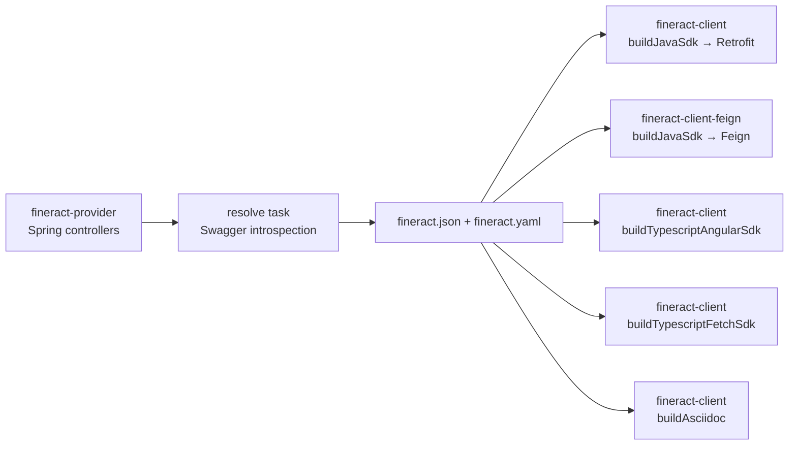
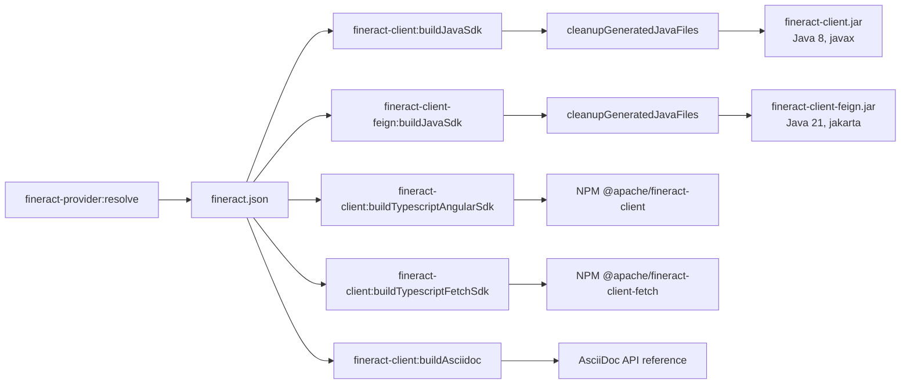

Apache Fineract ships **two first-class Java client SDKs** that talk to the platform's REST API, both generated from the same single source of truth — the OpenAPI document produced by `fineract-provider`. The older, longer-lived **`fineract-client`** is a Retrofit2-based SDK that has driven the integration-tests suite for years. The newer **`fineract-client-feign`** is an OpenFeign + Apache HttpClient 5 SDK that the E2E Cucumber tests and the on-going integration-tests migration use. Both are full Gradle modules under the root build, generated by the same `org.openapi.generator` plugin, and published as Maven artefacts.

The same modules also produce a **TypeScript Angular** SDK, a **TypeScript Fetch** SDK, and an **AsciiDoc** rendering of the API — all driven by additional `org.openapitools.generator.gradle.plugin.tasks.GenerateTask` registrations alongside the Java generators.

This page covers how the spec gets created, how each SDK is generated and shaped, and how to use both clients from your own code.

## Where the OpenAPI spec comes from

The spec is **not** hand-edited. It is computed at build time by Swagger's Jakarta-aware `resolve` task in `fineract-provider`, which introspects the Spring controllers and JAX-RS resources, applies a custom `OperationIdReader` to keep method names stable, and writes the result to `fineract-provider/build/resources/main/static/fineract.json`. That path is exposed to the rest of the build as the `swaggerFile` extra property in the root `build.gradle`:

```groovy
// build.gradle
ext['swaggerFile'] = "$rootDir/fineract-provider/build/resources/main/static/fineract.json".toString()
```

And the `resolve` task itself:

```groovy
// fineract-provider/build.gradle
apply plugin: 'io.swagger.core.v3.swagger-gradle-plugin'

tasks.register('prepareInputYaml') {
    outputs.file("${buildDir}/tmp/swagger/fineract-input.yaml")
    doLast {
        copy {
            from file("${projectDir}/config/swagger/fineract-input.yaml.template")
            into file("${buildDir}/tmp/swagger")
            rename { 'fineract-input.yaml' }
            filter(ReplaceTokens, tokens: [VERSION: "${project.version}".toString()])
        }
    }
}

resolve {
    outputFileName = 'fineract'
    outputFormat   = 'JSONANDYAML'
    prettyPrint    = false
    classpath      = sourceSets.main.runtimeClasspath
    buildClasspath = classpath
    outputDir      = file("${buildDir}/resources/main/static")
    openApiFile    = file("${buildDir}/tmp/swagger/fineract-input.yaml")
    readerClass    = 'org.apache.fineract.infrastructure.openapi.FineractOperationIdReader'
    sortOutput     = true
    dependsOn(prepareInputYaml, classes)
}
```

The output (`fineract.json` and `fineract.yaml`) is also the document Fineract serves at runtime through `/fineract-provider/swagger-ui/index.html`.

Both SDK modules declare `dependsOn(':fineract-provider:resolve')` on every generator task, so the spec is always regenerated from compiled controllers before any client code is produced.



## `fineract-client` — the Retrofit2 SDK

`fineract-client/build.gradle` applies `org.openapi.generator` and configures **four** generator tasks: `buildJavaSdk`, `buildTypescriptAngularSdk`, `buildTypescriptFetchSdk`, and `buildAsciidoc`. The Java generator is the one consumed by most callers today.

### `buildJavaSdk` — Retrofit2

```groovy
// fineract-client/build.gradle
apply plugin: 'org.openapi.generator'

task buildJavaSdk(type: org.openapitools.generator.gradle.plugin.tasks.GenerateTask) {
    generatorName     = 'java'
    inputSpec         = "file:///$swaggerFile"
    outputDir         = "$buildDir/generated/temp-java".toString()
    templateDir       = "$projectDir/src/main/resources/templates/java"
    groupId           = 'org.apache.fineract'
    apiPackage        = 'org.apache.fineract.client.services'
    invokerPackage    = 'org.apache.fineract.client'
    modelPackage      = 'org.apache.fineract.client.models'
    configOptions = [
        dateLibrary             : 'java8',
        useRxJava2              : 'false',
        library                 : 'retrofit2',
        hideGenerationTimestamp : 'true',
        containerDefaultToNull  : 'true',
        oauth2Implementation    : 'none'
    ]
    generateModelTests = false
    generateApiTests   = false
    ignoreFileOverride = "$projectDir/.openapi-generator-ignore"
    dependsOn(':fineract-provider:resolve')
}
```

Key choices:

- **`library = 'retrofit2'`** — the generator emits a per-tag service interface with Retrofit annotations (`@GET`, `@POST`, `@Path`, `@Body`, `@Multipart`), returning `Call<T>` (or `Observable<T>` in the RxJava builds — disabled here).
- **`dateLibrary = 'java8'`** — uses `java.time.LocalDate` / `OffsetDateTime` instead of `java.util.Date`.
- **`hideGenerationTimestamp = 'true'`** — the generator does not stamp every file with a fresh timestamp, so re-running the task without an OpenAPI change produces no diff.
- **`containerDefaultToNull = 'true'`** — generated collections default to `null` rather than empty collections, matching Fineract's request semantics.
- **`oauth2Implementation = 'none'`** — the OAuth2 helper classes that the OpenAPI Generator emits by default conflict with Fineract's own auth model (basic-auth + tenant header), so they are stripped out.
- **Custom Mustache template** — `templateDir` points at `src/main/resources/templates/java/api.mustache`, which lets the project re-shape the generated `services` API without forking the generator.

### The post-processing step

After `buildJavaSdk` writes raw output into `build/generated/temp-java`, a custom `cleanupGeneratedJavaFiles` task strips the generator's Oltu OAuth helper and rewrites a couple of leftover commas before copying the result into `build/generated/java`:

```groovy
task cleanupGeneratedJavaFiles {
    def tempDir   = file("$buildDir/generated/temp-java")
    def targetDir = file("$buildDir/generated/java")
    ...
    doFirst {
        if (tempDir.exists()) {
            delete fileTree(tempDir) {
                include "src/main/java/org/apache/fineract/client/auth/OAuthOkHttpClient.java"
            }
        }
        ...
    }
    doLast {
        if (tempDir.exists()) {
            copy {
                from tempDir
                into targetDir
                filter { line ->
                    line.replaceAll("import org\\.joda\\.time\\.\\*;", "")
                        .replaceAll(", \\)", ")")
                        .replaceAll(", , @HeaderMap", ", @HeaderMap")
                        .replaceAll("\\(, ", "(")
                }
                duplicatesStrategy = DuplicatesStrategy.EXCLUDE
            }
        }
    }
    dependsOn("buildJavaSdk")
}
```

The `compileJava` task is then wired to depend on `buildJavaSdk`, `buildTypescriptAngularSdk`, `buildAsciidoc`, `cleanupGeneratedJavaFiles`, `licenseFormatMain`, and `spotlessMiscApply` so a single `./gradlew :fineract-client:build` produces every artefact in one go.

### Hand-written extras

Alongside the generated services, the module ships a small set of hand-maintained helpers under `fineract-client/src/main/java/org/apache/fineract/client/`:

- **`util/FineractClient.java`** — a `Builder`-style entry point that constructs an `OkHttpClient`, configures `HttpBasicAuth` + `ApiKeyAuth`, sets up a trust-all `SSLContext`/`HostnameVerifier` for self-signed certificates, and exposes every generated service:
  ```java
  package org.apache.fineract.client.util;
  ...
  import org.apache.fineract.client.auth.ApiKeyAuth;
  import org.apache.fineract.client.auth.HttpBasicAuth;
  import org.apache.fineract.client.services.AccountNumberFormatApi;
  import org.apache.fineract.client.services.AccountTransfersApi;
  ```
- **`util/Calls.java`** / **`util/CallFailedRuntimeException.java`** — turn a Retrofit `Call<T>` into a synchronous result or a typed exception when the API returns 4xx/5xx.
- **`util/Parts.java`** — multipart upload helpers.
- **`util/JSON.java`** — re-configures the Gson instance with Fineract-specific adapters.
- **`util/adapter/ExternalIdAdapter.java`** — serialises the `ExternalId` value type.
- **`services/DocumentsApiFixed.java`**, **`services/ImagesApi.java`**, **`services/RunReportsApi.java`** — overrides for endpoints where the generator emits ambiguous signatures or wrong multipart shapes.

### Java 8 compatibility

The module is pinned to source compatibility 1.8 (Spring Boot 3 itself requires 17+):

```groovy
java {
    // keep this at Java 8, not 17; see https://issues.apache.org/jira/browse/FINERACT-1214
    sourceCompatibility = JavaVersion.VERSION_1_8
    targetCompatibility = JavaVersion.VERSION_1_8
}
```

That keeps the SDK usable from downstream apps on legacy stacks.

### Dependencies (`fineract-client/dependencies.gradle`)

```groovy
dependencies {
    // OpenAPI Generator only handles javax annotations, not jakarta ones
    implementation 'jakarta.annotation:jakarta.annotation-api:1.3.5'

    implementation(
        'io.swagger.core.v3:swagger-annotations-jakarta',
        'com.squareup.retrofit2:retrofit',
        'com.squareup.retrofit2:adapter-java8',
        'com.squareup.retrofit2:adapter-rxjava2',
        'com.squareup.retrofit2:converter-scalars',
        'com.squareup.retrofit2:converter-gson',
        'io.gsonfire:gson-fire',
        'com.google.code.findbugs:jsr305',
        'com.github.spotbugs:spotbugs-annotations',
        'com.squareup.okhttp3:okhttp',
        'com.squareup.okhttp3:logging-interceptor',
    )

    testImplementation 'org.assertj:assertj-core'
}
```

### Using `fineract-client`

```java
FineractClient client = FineractClient.builder()
    .baseURL("https://localhost:8443/fineract-provider/api/")
    .basicAuth("mifos", "password")
    .tenant("default")
    .insecure(true)        // self-signed cert in dev
    .build();

ClientsApi clientsApi = client.clients;
PageClientData page = Calls.ok(clientsApi.retrieveAll21(null, null, null, null, null, null, null, null, null));
log.info("Found {} clients", page.getTotalFilteredRecords());
```

`Calls.ok(...)` wraps the Retrofit call: it executes synchronously, asserts a 2xx, and either returns the typed body or throws `CallFailedRuntimeException`.

### The TypeScript and AsciiDoc generators

Two more tasks in the same module produce non-Java artefacts from the same `fineract.json`:

```groovy
task buildTypescriptAngularSdk(type: GenerateTask) {
    generatorName = 'typescript-angular'
    inputSpec     = "file:///$swaggerFile"
    outputDir     = "$buildDir/generated/typescript".toString()
    configOptions = [
        apiModulePrefix     : 'apacheFineractClient',
        configurationPrefix : 'apacheFineractClient',
        ngVersion           : '12.0.0',
        npmName             : '@apache/fineract-client',
        npmRepository       : "${npmRepository}"   // https://npm.pkg.github.com
    ]
    dependsOn(':fineract-provider:resolve')
}

task buildTypescriptFetchSdk(type: GenerateTask) {
    generatorName = 'typescript-fetch'
    outputDir     = "$buildDir/generated/typescript-fetch".toString()
    configOptions = [
        npmName             : '@apache/fineract-client-fetch',
        npmVersion          : '1.12.0-SNAPSHOT',
        typescriptThreePlus : 'true',
        supportsES6         : 'true',
        withInterfaces      : 'true'
    ]
    dependsOn(':fineract-provider:resolve')
}

task buildAsciidoc(type: GenerateTask) {
    generatorName = 'asciidoc'
    outputDir     = "$buildDir/generated/asciidoc".toString()
    configOptions = [
        appName        : 'Apache Fineract REST API',
        appDescription : '''Apache Fineract is a secure, multi-tenanted microfinance platform. ...''',
        infoEmail      : 'dev@fineract.apache.org',
        infoUrl        : 'https://fineract.apache.org',
        licenseInfo    : 'Apache 2.0',
        licenseUrl     : 'http://www.apache.org/licenses/LICENSE-2.0.html',
        useMethodAndPath : 'true'
    ]
    dependsOn(':fineract-provider:resolve')
}
```

The Angular SDK is what the Mifos web frontends import as `@apache/fineract-client`; the Fetch SDK is `@apache/fineract-client-fetch`. Both target `https://npm.pkg.github.com` for publication. The AsciiDoc generator produces the documentation source consumed by `fineract-doc`.

## `fineract-client-feign` — the Feign SDK

`fineract-client-feign/build.gradle` registers a single Java generator task with `library = 'feign'`:

```groovy
// fineract-client-feign/build.gradle
apply plugin: 'org.openapi.generator'

tasks.register('buildJavaSdk', GenerateTask) {
    generatorName  = 'java'
    library        = 'feign'
    inputSpec      = "file:///$swaggerFile"
    outputDir      = "$buildDir/generated/temp-java".toString()
    templateDir    = "$projectDir/src/main/resources/templates/java"
    groupId        = 'org.apache.fineract'
    apiPackage     = 'org.apache.fineract.client.feign.services'
    invokerPackage = 'org.apache.fineract.client.feign'
    modelPackage   = 'org.apache.fineract.client.models'
    configOptions = [
        dateLibrary              : 'java8',
        library                  : 'feign',
        feignVersion             : '13.6',
        feignApacheHttpClient    : 'true',
        useFeign13               : 'true',
        useFeignApacheHttpClient : 'true',
        hideGenerationTimestamp  : 'true',
        containerDefaultToNull   : 'true',
        oauth2Implementation     : 'none',
        useJakartaEe             : 'true'
    ]
    dependsOn(':fineract-provider:resolve')
}
```

Key differences from the Retrofit module:

- **`useJakartaEe = 'true'`** — emit `jakarta.*` annotations instead of `javax.*`. The newer SDK targets modern stacks.
- **`useFeignApacheHttpClient` + `feign-hc5`** — use Apache HttpClient 5 underneath Feign for connection pooling and HTTP/2.
- **Same `oauth2Implementation = 'none'`** — Fineract's auth is wired through Feign `RequestInterceptor`s instead.
- **Same `cleanupGeneratedJavaFiles`** — drops the leftover generator artefacts, but for this SDK the post-processing is simpler (no Oltu file to strip).

### Hand-written shell

The Feign SDK ships a more opinionated facade than the Retrofit one. Files under `fineract-client-feign/src/main/java/`:

- **`feign/FineractFeignClient.java`** — the equivalent of `FineractClient`. Builder-style, holds references to every generated `*Api` interface (~150 of them, covering everything from `AccountTransfersApi` to `WorkingCapitalLoansApi`).
- **`feign/FineractFeignClientConfig.java`** — Feign `Builder` configuration: decoder, encoder, error decoder, retryer, logger, options.
- **`feign/BasicAuthRequestInterceptor.java`** — sets the `Authorization: Basic ...` header.
- **`feign/TenantIdRequestInterceptor.java`** — sets the `Fineract-Platform-TenantId` header on every request.
- **`feign/FineractErrorDecoder.java`** — turns non-2xx responses into typed `FeignException`s carrying the Fineract error envelope.
- **`feign/FineractMultipartEncoder.java`** — handles `multipart/form-data` uploads (documents, images, bulk-import).
- **`feign/ObjectMapperFactory.java`** — Jackson configuration with `jackson-datatype-jsr310` for `java.time` and `jackson-datatype-jdk8` for `Optional`.
- **`feign/support/ApiResponseDecoder.java`** — adapts Fineract's response envelopes.
- **`feign/util/FeignCalls.java`**, **`feign/util/CallFailedRuntimeException.java`** — the Feign equivalents of `Calls`/`CallFailedRuntimeException`.
- **`feign/services/DocumentsApiFixed.java`**, **`feign/services/ImagesApi.java`**, **`feign/services/RunReportsApi.java`**, **`feign/services/InternalWorkingCapitalLoansApi.java`** — overrides for endpoints that need a hand-tuned signature.
- **`client/adapter/ExternalIdAdapter.java`** — `ExternalId` serialiser.
- **`client/util/FeignParts.java`** — multipart part helpers.

### Dependencies (`fineract-client-feign/dependencies.gradle`)

```groovy
dependencies {
    implementation(
        'io.github.openfeign:feign-core:13.6',
        'io.github.openfeign:feign-jackson:13.6',
        'io.github.openfeign:feign-slf4j:13.6',
        'io.github.openfeign:feign-hc5:13.6',
        'io.github.openfeign:feign-okhttp:13.6',
        'io.github.openfeign.form:feign-form:3.8.0',
        'org.apache.httpcomponents.client5:httpclient5:5.2.1',
        'com.squareup.okhttp3:okhttp:4.12.0',
        'com.fasterxml.jackson.core:jackson-databind',
        'com.fasterxml.jackson.datatype:jackson-datatype-jsr310',
        'com.fasterxml.jackson.datatype:jackson-datatype-jdk8',
        'jakarta.annotation:jakarta.annotation-api:3.0.0',
        'io.swagger.core.v3:swagger-annotations-jakarta:2.2.15',
        'org.apache.commons:commons-lang3:3.12.0',
        'org.projectlombok:lombok'
    )

    testImplementation(
        'org.junit.jupiter:junit-jupiter-api:5.11.3',
        'org.junit.jupiter:junit-jupiter-engine:5.11.3',
        'org.mockito:mockito-core:5.14.2',
        'org.assertj:assertj-core:3.26.3',
        'org.wiremock:wiremock-standalone'
    )
}
```

### Using `fineract-client-feign`

```java
FineractFeignClient fineract = FineractFeignClient.builder()
    .baseUrl("https://localhost:8443/fineract-provider/api/")
    .credentials("mifos", "password")
    .tenantId("default")
    .disableSslVerification(true)
    .debug(false)
    .connectTimeout(60, TimeUnit.SECONDS)
    .readTimeout(60, TimeUnit.SECONDS)
    .build();

// ClientApi, LoansApi, SavingsAccountApi, … are all methods on the facade
ClientApi clients = fineract.clientApi();
PageClientData page = clients.retrieveAll21(...);
```

This is the exact pattern used in the E2E Cucumber tests — see [E2E Cucumber tests](/build/e2e-cucumber-tests) for the Spring configuration that wires the `FineractFeignClient` bean.

### Spring-Boot-friendly configuration

`FineractFeignClient.builder()` exposes the same knobs the integration-tests will need during their migration:

| Builder method | Effect |
| --- | --- |
| `.baseUrl(String)` | Root of the API (`https://host/fineract-provider/api/`). |
| `.credentials(String, String)` | Installs `BasicAuthRequestInterceptor`. |
| `.tenantId(String)` | Installs `TenantIdRequestInterceptor` for `Fineract-Platform-TenantId`. |
| `.disableSslVerification(boolean)` | Disable cert checks for dev/test. |
| `.debug(boolean)` | Switch `feign-slf4j` logging to `FULL` (logs request/response body). |
| `.connectTimeout(long, TimeUnit)` / `.readTimeout(int, TimeUnit)` | Standard HTTP timeouts. |

## Picking the right SDK

| Question | `fineract-client` (Retrofit) | `fineract-client-feign` (Feign + HC5) |
| --- | --- | --- |
| Returns | `Call<T>` (use `Calls.ok(...)`) | Direct typed return |
| Annotations | `javax.*` | `jakarta.*` |
| HTTP engine | OkHttp 4 | Apache HttpClient 5 / OkHttp |
| JSON | Gson + gson-fire | Jackson 2 + jsr310 + jdk8 |
| Multipart | `Parts` helper | `FeignParts` + `FineractMultipartEncoder` |
| Best for | Legacy callers on Java 8/11, existing RestAssured integration tests | New code, Spring Boot 3 stacks, the E2E test suite |
| Status | Stable, in maintenance | The forward-looking SDK; migration target |

The Fineract integration-tests `README.md` explicitly says:

> We are currently migrating integration tests from RestAssured to the Feign-based Fineract client.

New code should prefer `fineract-client-feign`. Existing code using `fineract-client` stays supported.

## Putting it together



## Building the SDKs

```bash
# Java
./gradlew :fineract-client:buildJavaSdk
./gradlew :fineract-client:build
./gradlew :fineract-client-feign:buildJavaSdk
./gradlew :fineract-client-feign:build

# TypeScript
./gradlew :fineract-client:buildTypescriptAngularSdk
./gradlew :fineract-client:buildTypescriptFetchSdk

# AsciiDoc
./gradlew :fineract-client:buildAsciidoc

# Regenerate the spec only
./gradlew :fineract-provider:resolve
```

After `:fineract-provider:resolve`, the OpenAPI spec lives at:

```text
fineract-provider/build/resources/main/static/fineract.json
fineract-provider/build/resources/main/static/fineract.yaml
```

## Customising the generated output

Three knobs to reach for, in order of escalating commitment:

1. **`.openapi-generator-ignore`** in each module — drop files you do not want the generator to emit.
2. **`templateDir`** — both modules ship a `src/main/resources/templates/java/` directory with a custom `api.mustache`. Tweak it to change how the generator shapes service interfaces.
3. **Hand-written `*Api`/`*ApiFixed` classes** — when a single endpoint needs surgical control, copy the generated interface into the source tree under the module's `services/` package, fix the signature, and add the file to `.openapi-generator-ignore`. The four `*Fixed`/`*Api` overrides (`DocumentsApiFixed`, `ImagesApi`, `RunReportsApi`, `InternalWorkingCapitalLoansApi`) are exactly that pattern.

## Publishing

Both modules are listed in `fineractPublishProjects` in the root `build.gradle`, so they participate in Maven publication (the `release` task graph wired up by the `buildSrc/` plugin — see [Gradle modules and buildSrc](/build/gradle-modules-and-buildSrc)). The Maven coordinates are:

- `org.apache.fineract:fineract-client:<version>` — Retrofit SDK.
- `org.apache.fineract:fineract-client-feign:<version>` — Feign SDK.
- NPM `@apache/fineract-client` — TypeScript Angular SDK.
- NPM `@apache/fineract-client-fetch` — TypeScript Fetch SDK.

The intent is to publish the Java artefacts to Maven Central; until then they are available from Apache snapshot repositories and GitHub Packages.

## Summary

- One **source of truth**: `fineract-provider`'s `resolve` task produces `fineract.json`.
- Two **Java SDK modules** (`fineract-client`, `fineract-client-feign`) generate code from it through the **OpenAPI Generator Gradle plugin** with two different libraries (`retrofit2`, `feign`), plus two **TypeScript** SDKs and one **AsciiDoc** rendering.
- Both Java modules ship a small hand-written shell on top of the generated code (auth interceptors, error decoder, multipart helpers, a few `*ApiFixed` overrides).
- Both run through Spotless / Checkstyle / SpotBugs / license-header / RAT alongside the rest of the build; their generated code is JaCoCo-excluded so coverage numbers reflect only the hand-written shell.
- For new code, prefer `fineract-client-feign`; for existing code, `fineract-client` stays supported.
