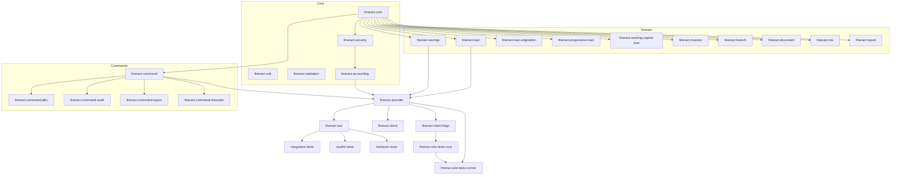

Apache Fineract is built as a **single Gradle multi-project**. Every module — every loan calculator, every command-bus adapter, every test harness, every generated client — is a subproject pulled in from the root `settings.gradle`, and every common build/test/deploy convention is centralised in the root `build.gradle`. This page enumerates the modules, explains how the root build configures them uniformly, and describes the custom Gradle plugin compiled out of the sibling `buildSrc/` project.

## Where the modules come from

The authoritative module list is the `include` statements in `/settings.gradle`. The file also pulls in plugins, enables Develocity (build scans against `https://develocity.apache.org`), turns on the local build cache, and dynamically discovers extension modules under `custom/`.

```groovy
// settings.gradle (excerpt)
plugins {
    id 'com.gradle.develocity' version '3.18.2'
    id 'com.gradle.common-custom-user-data-gradle-plugin' version '2.0.2'
}

def isCI = System.getenv('JENKINS_URL') != null
develocity {
    projectId = "fineract"
    server = "https://develocity.apache.org"
    buildScan {
        uploadInBackground = !isCI
        publishing.onlyIf { it.authenticated }
        ...
    }
}

buildCache { local { enabled = true } }

rootProject.name = 'fineract'
```

After `rootProject.name`, the file `include`s every fixed module, followed by a small `eachDir` walker that discovers anything matching the pattern `custom/<company>/<category>/<module>`:

```groovy
file("${rootDir}/custom").eachDir { companyDir ->
    if ('build' != companyDir.name && 'docker' != companyDir.name) {
        file("${rootDir}/custom/${companyDir.name}").eachDir { categoryDir ->
            if ('build' != categoryDir.name) {
                file("${rootDir}/custom/${companyDir.name}/${categoryDir.name}").eachDir { moduleDir ->
                    if ('build' != moduleDir.name) {
                        include ":custom:${companyDir.name}:${categoryDir.name}:${moduleDir.name}"
                    }
                }
            }
        }
    }
}
```

The fixed include list is reproduced below with a short purpose statement for each module.

## The module catalogue

### Core platform

| Module | Purpose |
| --- | --- |
| `fineract-core` | The shared domain library: tenant/serialization/error infrastructure, base entities, JPA helpers used across all other modules. |
| `fineract-security` | Authentication, authorisation, RBAC services, basic-auth filter, OAuth2 resource-server hooks. |
| `fineract-cob` | Close-of-Business job framework (Spring Batch driven). |
| `fineract-validation` | Cross-cutting Bean Validation rules and DTO validators. |
| `fineract-accounting` | Chart-of-accounts, GL accounts, journal entries, accounting rules. |
| `fineract-branch` | Branch / office hierarchy. |
| `fineract-document` | Document storage abstraction. |
| `fineract-investor` | Investor-side of asset externalisation. |
| `fineract-rates`, `fineract-charge`, `fineract-tax` | Pricing components. |
| `fineract-loan-origination` | Loan application workflow. |
| `fineract-loan`, `fineract-savings` | Loan-product and savings-product domains. |
| `fineract-progressive-loan`, `fineract-progressive-loan-embeddable-schedule-generator` | Progressive-loan product and its standalone schedule generator. |
| `fineract-working-capital-loan` | Working-capital loan product. |
| `fineract-report` | Pentaho / SQL reporting bridge. |
| `fineract-mix` | XBRL "MIX" reporting. |

### Command bus

| Module | Purpose |
| --- | --- |
| `fineract-command` | Command-bus core abstraction. |
| `fineract-command-test` | Command-bus test utilities. |
| `fineract-command-jdbc` | JDBC persistence for command-source/audit. |
| `fineract-command-audit` | Audit log of commands. |
| `fineract-command-async` | Async command execution. |
| `fineract-command-disruptor` | LMAX-Disruptor based command pipeline. |

### Runtime

| Module | Purpose |
| --- | --- |
| `fineract-provider` | The Spring Boot application — wires every domain module, exposes the REST API, drives schema migration, owns `bootRun` / `bootJar` / `jib`. |
| `fineract-war` | WAR packaging of the same application, used by Cargo-based integration tests. |

### Test harnesses

| Module | Purpose |
| --- | --- |
| `integration-tests` | RestAssured/JUnit 5 integration tests; boots Cargo + Tomcat 10x with the WAR. |
| `oauth2-tests` | Selenium + JUnit 5 tests for the OAuth2 resource-server flow. |
| `twofactor-tests` | Cargo-based tests for the 2FA login flow. |
| `fineract-e2e-tests-core` | Cucumber step definitions, data builders, Feign client configuration. |
| `fineract-e2e-tests-runner` | JUnit Platform Suite + Cucumber `.feature` files (101 features). |

### Client SDKs

| Module | Purpose |
| --- | --- |
| `fineract-client` | Retrofit2-based Java client generated from the OpenAPI spec served by `fineract-provider`. |
| `fineract-client-feign` | Feign + Jakarta-EE-based Java client generated from the same OpenAPI spec. |
| `fineract-avro-schemas` | Avro schemas for the external-events envelope. |

### Documentation and packaging extras

| Module | Purpose |
| --- | --- |
| `fineract-doc` | AsciiDoctor sources for project documentation. |
| `custom:docker` | Builds the "custom" Docker image that bundles every discovered `custom/<company>/<category>/<module>`. |



## Module groupings inside `build.gradle`

The root `build.gradle` keeps three carefully maintained lists in its `buildscript { ext { ... } }` block. They are used downstream to apply conventions only where they make sense:

```groovy
fineractJavaProjects = subprojects.findAll{
    [ 'fineract-core', 'fineract-security', 'fineract-cob', 'fineract-validation',
      'fineract-command', 'fineract-command-test', 'fineract-command-jdbc',
      'fineract-command-audit', 'fineract-command-async', 'fineract-command-disruptor',
      'fineract-accounting', 'fineract-provider', 'fineract-branch',
      'fineract-document', 'fineract-investor', 'fineract-charge', 'fineract-rates',
      'fineract-tax', 'fineract-loan-origination', 'fineract-loan',
      'fineract-savings', 'fineract-report', 'fineract-mix',
      'integration-tests', 'twofactor-tests', 'oauth2-tests',
      'fineract-client', 'fineract-client-feign', 'fineract-avro-schemas',
      'fineract-e2e-tests-core', 'fineract-e2e-tests-runner',
      'fineract-progressive-loan',
      'fineract-progressive-loan-embeddable-schedule-generator',
      'fineract-working-capital-loan'
    ].contains(it.name)
}
```

`fineractPublishProjects` is similar but excludes the test harnesses, `fineract-war`, and the runner — only **library** modules and the two SDKs are published as Maven artefacts.

`fineractCustomProjects` starts empty and is filled in by the dynamic `custom/` discovery in `settings.gradle`.

## Conventions applied to every module

Conventions are baked into the root `build.gradle` (there is no separate `convention-plugin/` directory). They are applied in three layers — `subprojects { ... }`, `allprojects { ... }`, and `configure(project.fineractJavaProjects) { ... }` — each layer narrower than the previous:

```groovy
// build.gradle (excerpts)

// Layer 1: every subproject, including custom ones — picks up static weaving
subprojects { subproject ->
    apply from: rootProject.file('static-weaving.gradle')
}

// Layer 2: every project, root + sub — group, repos, and the style/quality
//          plugins that don't need the `java` plugin to be present
allprojects {
    group = 'org.apache.fineract'
    repositories { mavenCentral() }

    apply plugin: 'com.adarshr.test-logger'
    apply plugin: 'com.diffplug.spotless'
    apply plugin: 'com.github.hierynomus.license'
    apply plugin: 'net.ltgt.errorprone'
    apply plugin: 'org.nosphere.apache.rat'
    apply plugin: 'com.github.jk1.dependency-license-report'
}

// Layer 3: only the modules listed in `fineractJavaProjects` — the JVM stack
configure(project.fineractJavaProjects) {
    apply plugin: 'java'
    apply plugin: 'idea'
    apply plugin: 'eclipse'
    apply plugin: 'checkstyle'
    apply plugin: 'jacoco'
    apply plugin: 'com.github.spotbugs'
    apply plugin: 'com.github.andygoossens.modernizer'

    java {
        toolchain { languageVersion = JavaLanguageVersion.of(21) }
        withSourcesJar()
        withJavadocJar()
    }

    check { dependsOn(rat, licenseMain, licenseTest) }
}
```

The root build also imports the BOM file once at the top through `apply from: "${rootDir}/buildSrc/src/main/groovy/org.apache.fineract.dependencies.gradle"`, which is how every module gets the same Spring Boot / Jackson / OkHttp / OpenTelemetry versions.

The build also globally tightens error-prone with a list of `error(...)` rules (`DefaultCharset`, `StringSplitter`, `MutablePublicArray`, `EqualsGetClass`, `FutureReturnValueIgnored`) and disables a small set of checks that conflict with Lombok or generated code.

A global dependency substitution forces `org.lz4:lz4-java` to `at.yawk.lz4:lz4-java:1.10.1` to mitigate CVE-2025-12183:

```groovy
configurations.configureEach {
    resolutionStrategy {
        dependencySubstitution {
            substitute module('org.lz4:lz4-java') using module('at.yawk.lz4:lz4-java:1.10.1')
        }
    }
}
```

`commons-logging` is excluded from every `implementation` configuration because Spring Boot brings `jcl-over-slf4j` instead.

## How modules differ

Despite the strong "everything looks the same" defaults, each module overlays its own `build.gradle` with module-specific behaviour. A few notable examples:

- **`fineract-provider/build.gradle`** applies `org.springframework.boot`, `com.google.cloud.tools.jib`, the OpenAPI Swagger plugin, `com.gorylenko.gradle-git-properties`, and the cucumber runner. It defines the `jib` block (see [Docker images and Compose](/build/docker-images-and-compose)) and a `migrateDatabase` task that drives Liquibase.
- **`fineract-war/build.gradle`** applies the `war` plugin to repackage `fineract-provider` as a deployable WAR.
- **`fineract-client/build.gradle`** and **`fineract-client-feign/build.gradle`** apply `org.openapi.generator`, declare `buildJavaSdk` (Retrofit/Feign), `buildTypescriptAngularSdk`, `buildTypescriptFetchSdk`, and `buildAsciidoc` tasks, and pin themselves to Java 8 source compatibility for downstream consumer reach (`FINERACT-1214`).
- **`integration-tests/build.gradle`**, **`oauth2-tests/build.gradle`**, **`twofactor-tests/build.gradle`** apply `com.bmuschko.cargo` and configure Tomcat 10x deployment with `https://localhost:8443`.
- **`fineract-e2e-tests-runner/build.gradle`** applies `se.thinkcode.cucumber-runner` and `io.qameta.allure`.
- **`fineract-avro-schemas/build.gradle`** applies `com.github.davidmc24.gradle.plugin.avro-base`.

## `buildSrc/` — the Fineract release plugin

The repository ships a sibling `buildSrc/` Gradle project. Gradle automatically compiles it before evaluating the main build, and any plugins or tasks it declares become available without further configuration.

```text
buildSrc/
├── build.gradle
└── src/main/
    ├── groovy/
    │   ├── org.apache.fineract.dependencies.gradle      # version BOMs (applied via `apply from`)
    │   ├── org.apache.fineract.release.gradle           # release task graph (applied via `apply from`)
    │   └── org/apache/fineract/gradle/
    │       ├── FineractPlugin.groovy                    # the plugin entry point
    │       ├── FineractPluginExtension.groovy
    │       └── service/
    │           ├── ConfluenceService.groovy
    │           ├── EmailService.groovy
    │           ├── GitService.groovy
    │           ├── GpgService.groovy
    │           ├── JiraService.groovy
    │           ├── SubversionService.groovy
    │           └── TemplateService.groovy
    └── resources/
        ├── META-INF/gradle-plugins/org.apache.fineract.gradle.properties
        ├── confluence/                                  # FreeMarker templates for release notes
        ├── email/                                       # FreeMarker templates for ASF mailing-list announcements
        ├── git/                                         # FreeMarker for tag messages
        ├── instructions/                                # step-by-step Markdown instructions
        ├── jira/                                        # FreeMarker for changelogs
        └── vote/                                        # historical VOTE results (1.8.0, 1.12.1, 1.13.0, template)
```

### `buildSrc/build.gradle`

Compiles the plugin and pulls in all the libraries it needs:

```groovy
plugins {
    id 'io.spring.dependency-management' version '1.1.7'
    id 'groovy'
    id 'java-gradle-plugin'
    id 'groovy-gradle-plugin'
}

apply from: "${projectDir}/src/main/groovy/org.apache.fineract.dependencies.gradle"

dependencies {
    implementation 'com.sun.activation:jakarta.activation'
    implementation 'com.sun.mail:jakarta.mail'
    implementation 'org.freemarker:freemarker'
    implementation('com.tmatesoft.svnkit:svnkit') { exclude group: 'net.i2p.crypto', module: 'eddsa' }
    implementation 'org.bouncycastle:bcprov-jdk18on'
    implementation 'org.bouncycastle:bcutil-jdk18on'
    implementation 'org.bouncycastle:bcpg-jdk18on'
    implementation 'org.eclipse.jgit:org.eclipse.jgit'
    implementation 'org.eclipse.jgit:org.eclipse.jgit.gpg.bc'
    implementation 'org.eclipse.jgit:org.eclipse.jgit.ssh.apache'
    implementation 'com.vdurmont:semver4j'
    implementation 'org.beryx:text-io'
    implementation 'commons-io:commons-io'
    implementation 'com.squareup.okhttp3:okhttp'
    implementation 'com.squareup.okhttp3:logging-interceptor'
    implementation 'com.squareup.retrofit2:retrofit'
    implementation 'com.squareup.retrofit2:converter-jackson'
    implementation 'com.fasterxml.jackson.core:jackson-databind'
}
```

These dependencies tell the story of what the plugin does:

- **Jira / Confluence** REST clients (Retrofit + Jackson + OkHttp) for changelog and release-note generation.
- **JGit** for tag/branch automation on `git.apache.org`.
- **SVNKit** for publishing votes and artefacts to the ASF `dist.apache.org` Subversion repository.
- **BouncyCastle + JGit GPG-BC** for signing release artefacts and validating tag signatures.
- **Jakarta Mail / Activation** for the announcement mails sent to `dev@fineract.apache.org`.
- **FreeMarker** to render every templated artefact (subject/body of announcement mail, Confluence page, JIRA changelog, etc.).
- **TextIO** drives the interactive command-line wizard a release manager walks through.

### The plugin entry point

`buildSrc/src/main/resources/META-INF/gradle-plugins/org.apache.fineract.gradle.properties` registers the plugin with Gradle:

```properties
implementation-class=org.apache.fineract.gradle.FineractPlugin
```

`FineractPlugin.groovy` creates an extension named `fineract`, wires up the seven services (Jira/Confluence/SVN/Email/Gpg/Template/Git), and registers the release-step tasks that read templates from `src/main/resources/instructions/step*.txt.ftl`:

```groovy
class FineractPlugin implements Plugin<Project> {
    private JiraService jiraService
    private ConfluenceService confluenceService
    private SubversionService subversionService
    private EmailService emailService
    private GpgService gpgService
    private TemplateService templateService
    private GitService gitService

    void apply(Project project) {
        def extension = project.extensions.create("fineract", FineractPluginExtension, project)
        ...
    }
}
```

### `org.apache.fineract.release.gradle`

The root build pulls in the release task graph through:

```groovy
// build.gradle
apply from: "${rootDir}/buildSrc/src/main/groovy/org.apache.fineract.release.gradle"
```

Each numbered step has a corresponding FreeMarker instructions template (`step2.txt.ftl`, `step4.txt.ftl`, … `step15.txt.ftl`) that the release manager sees on their terminal, and a corresponding email/subject template (`release.step01.headsup.subject.ftl`, `release.step01.headsup.message.ftl`, `release.step03.branch.subject.ftl`, `release.step03.branch.message.ftl`).

### `org.apache.fineract.dependencies.gradle`

This file is applied both from `buildSrc/build.gradle` and from the root `build.gradle` (inside `subprojects { … }`). It imports a stack of Maven BOMs through Spring's `io.spring.dependency-management` plugin so that every module pins the same version of OkHttp, SLF4J, Micrometer, Spring Boot, Spring Cloud AWS, OpenTelemetry, and others:

```groovy
dependencyManagement {
    imports {
        mavenBom 'com.squareup.okhttp3:okhttp-bom:4.12.0'
        mavenBom 'org.slf4j:slf4j-bom:2.0.17'
        mavenBom 'io.micrometer:micrometer-bom:1.13.6'
        mavenBom 'org.springframework.boot:spring-boot-dependencies:3.5.13'
        mavenBom 'io.awspring.cloud:spring-cloud-aws-dependencies:3.2.1'
        mavenBom 'io.opentelemetry:opentelemetry-bom:1.44.1'
        ...
    }
}
```

Centralising versions here is what lets every module's `build.gradle` declare `implementation 'org.springframework:spring-jdbc'` without a version string.

## Running module-specific tasks

A few patterns you'll use daily:

```bash
# A single module
./gradlew :fineract-loan:test
./gradlew :fineract-provider:bootRun

# Module-specific quality tasks
./gradlew :fineract-loan:spotlessCheck
./gradlew :fineract-loan:checkstyleMain
./gradlew :fineract-loan:spotbugsMain
./gradlew :fineract-loan:jacocoTestReport

# Inspect what a task does
./gradlew :fineract-provider:taskinfo --task bootRun     # via the org.barfuin.gradle.taskinfo plugin

# See every module
./gradlew projects
```

The `org.barfuin.gradle.taskinfo` plugin (declared in the root plugins block) is particularly useful when chasing down which conventions kick in for a given task.

## Adding a new module

To add a new domain module — say `fineract-credit-bureau`:

1. Create `fineract-credit-bureau/build.gradle` with module-specific dependencies (and, if it ships JPA entities, a `src/main/resources/jpa/static-weaving/module/fineract-credit-bureau/persistence.xml`).
2. Add the include line to `settings.gradle`:
   ```groovy
   include ':fineract-credit-bureau'
   ```
3. Add the module name to both `fineractJavaProjects` and (if it is a published library) `fineractPublishProjects` in the root `build.gradle`.
4. Wire the module into `fineract-provider/dependencies.gradle` so the Spring Boot app picks it up.

The Spotless, Checkstyle, SpotBugs, JaCoCo, license-header, RAT, error-prone, Modernizer, and static-weaving conventions will then apply automatically.

## Adding a custom module

For downstream distributions that need to ship proprietary modules alongside Fineract, drop them under `custom/<company>/<category>/<module>/` and the `eachDir` walker in `settings.gradle` will register them as `:custom:<company>:<category>:<module>` without any manual edits. The `custom:docker` module produces a Docker image that bundles every such module — see [Docker images and Compose](/build/docker-images-and-compose) for the `docker-compose-custom.yml` flow.
