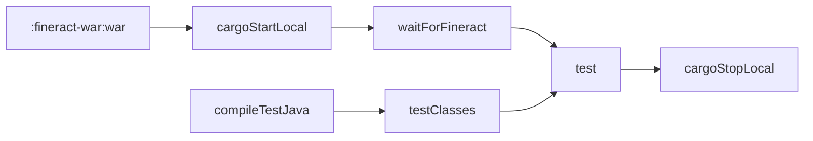
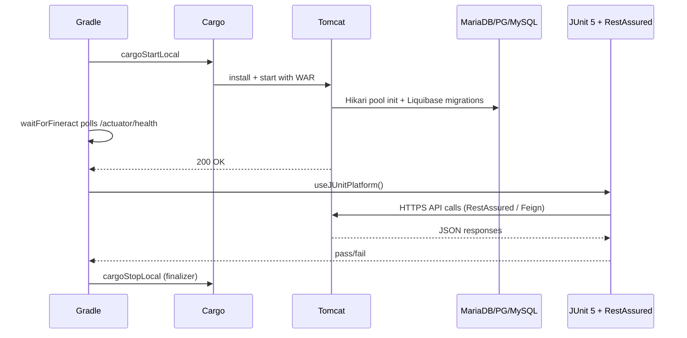

The `integration-tests` Gradle module is where Apache Fineract's end-of-build sanity check lives: a JUnit 5 + RestAssured test suite that runs against a freshly-built `fineract-provider.war` deployed into an embedded Tomcat 10x server. The module owns 470+ `*.java` files covering the REST surface — clients, loans, savings, accounting, batch API, accruals, charges, repayment scheduling, COB jobs, scheduler, audit, hooks, notifications, and so on — and is what CI runs to certify that a candidate release talks to a real database, a real Spring Boot startup, and a real HTTPS endpoint without hand-holding.

This page walks through how the module is wired together: how Gradle deploys the WAR through the **bmuschko Cargo** plugin, how the `waitForFineract` task gates the test phase, how the tests authenticate and talk to Fineract through RestAssured, and how environment variables let the same tests run against an externally-provisioned cluster.

## Where the code lives

```text
integration-tests/
├── build.gradle           # Cargo + JUnit Platform wiring
├── dependencies.gradle    # RestAssured, Spring Boot test, junit-jupiter, ...
├── README.md              # Environment-variable cheatsheet
└── src/test/
    ├── java/
    │   └── org/apache/fineract/integrationtests/
    │       ├── ActuatorIntegrationTest.java
    │       ├── AccountTransferTest.java
    │       ├── AccountingScenarioIntegrationTest.java
    │       ├── AccrualsOnLoanClosureTest.java
    │       ├── AdvancedPaymentAllocationLoanRepaymentScheduleTest.java
    │       ├── ApiDocsTest.java
    │       ├── AuditIntegrationTest.java
    │       ├── AuthenticationIntegrationTest.java
    │       ├── BatchApiTest.java
    │       ├── BatchLoanIntegrationTest.java
    │       ├── BusinessConfigurationApiTest.java
    │       ├── ChargesTest.java
    │       ├── ClientLoanIntegrationTest.java
    │       ├── ClientSavingsIntegrationTest.java
    │       ├── ... 450+ more ...
    │       ├── common/                  # ClientHelper, Utils, RequestSpecBuilder helpers
    │       │   ├── accounting/
    │       │   ├── loans/               # LoanTransactionHelper, LoanProductTestBuilder, …
    │       │   ├── organisation/
    │       │   └── ConfigProperties.java
    │       ├── bulkimport/
    │       ├── client/
    │       └── useradministration/
    └── resources/
```

There are **470 Java source files** in the module today — every public REST endpoint of `fineract-provider` has at least one Test class against it, and the larger domains (loans, savings, accounting) have dozens.

## The Cargo-driven lifecycle

The module **does not** run `bootRun`. It applies the `com.bmuschko.cargo` plugin and asks Cargo to spin up Tomcat 10x, deploy the WAR, run tests, and shut Tomcat down — all from one Gradle invocation:

```groovy
// integration-tests/build.gradle
description = 'Fineract Integration Tests'

apply plugin: 'com.bmuschko.cargo'

configurations { tomcat ; driver }

dependencies {
    driver 'com.mysql:mysql-connector-j'
    testImplementation 'org.springframework.boot:spring-boot-starter-test'
    testImplementation 'org.junit.jupiter:junit-jupiter-api'
}

cargo {
    containerId "tomcat10x"

    deployable {
        file = file("$rootDir/fineract-war/build/libs/fineract-provider.war")
        context = 'fineract-provider'
    }

    local {
        logLevel = 'low'
        outputFile = file("$buildDir/cargo/integration-tests-output.log")
        installer {
            installConfiguration = configurations.tomcat
            downloadDir = file("$buildDir/download")
            extractDir = file("$buildDir/tomcat-integration-tests")
        }
        startStopTimeout = 1200000
        sharedClasspath = configurations.driver
        ...
    }
}

cargoRunLocal.dependsOn ':fineract-war:war'
cargoStartLocal.dependsOn ':fineract-war:war'
```

Three Gradle configurations carry the moving parts:

- **`tomcat`** — declared in `dependencies.gradle`; this is where the Tomcat 10x distribution archive is pulled from. The Cargo `installer` block downloads it on first run, caches it under `build/download/`, and extracts it under `build/tomcat-integration-tests/`.
- **`driver`** — carries `com.mysql:mysql-connector-j` (and only this). Because the MySQL driver is GPL-licensed it cannot be bundled into the WAR; instead it is added as Tomcat's `sharedClasspath` so the deployed app can see it when `dbType=mysql`.
- **`testImplementation`** — Spring Boot test starters and JUnit 5.

### Database flavours

The module supports MariaDB (default), MySQL, and PostgreSQL through a `-PdbType=` Gradle property. The `containerProperties` block in `cargo.local { ... }` translates that property into the right Hikari JVM args:

```groovy
if (project.hasProperty('dbType')) {
    if ('postgresql'.equalsIgnoreCase(dbType)) {
        jvmArgs += '-Dspring.datasource.hikari.driverClassName=org.postgresql.Driver ' +
                   '-Dspring.datasource.hikari.jdbcUrl=jdbc:postgresql://localhost:5432/fineract_tenants ' +
                   '-Dspring.datasource.hikari.username=root -Dspring.datasource.hikari.password=postgres ' +
                   '-Dfineract.tenant.host=localhost -Dfineract.tenant.port=5432 ' +
                   '-Dfineract.tenant.username=root -Dfineract.tenant.password=postgres'
    } else if ('mysql'.equalsIgnoreCase(dbType)) {
        jvmArgs += '-Dspring.datasource.hikari.driverClassName=com.mysql.cj.jdbc.Driver ...'
    } else {
        throw new GradleException('Provided dbType is not supported')
    }
} else {
    // default: MariaDB
    jvmArgs += '-Dspring.datasource.hikari.driverClassName=org.mariadb.jdbc.Driver ' +
               '-Dspring.datasource.hikari.jdbcUrl=jdbc:mariadb://localhost:3306/fineract_tenants ' +
               '-Dspring.datasource.hikari.username=root -Dspring.datasource.hikari.password=mysql ...'
}
jvmArgs += ' -Dspring.profiles.active=test -Dfineract.events.external.enabled=true'
property 'cargo.start.jvmargs', jvmArgs
```

The `spring.profiles.active=test` profile picks up the Fineract-specific test configuration in the WAR. `fineract.events.external.enabled=true` turns on the external-events pipeline so event-publishing tests have something to assert against.

### HTTPS on 8443

The Cargo properties also enable HTTPS using the test keystore that ships in the WAR:

```groovy
property 'cargo.tomcat.connector.keystoreFile', file("$rootDir/fineract-provider/src/main/resources/keystore.jks")
property 'cargo.tomcat.connector.keystorePass', 'openmf'
property 'cargo.tomcat.connector.keystoreType', 'JKS'
property 'cargo.tomcat.httpSecure', true
property 'cargo.tomcat.connector.sslProtocol', 'TLS'
property 'cargo.tomcat.connector.clientAuth', false
property 'cargo.protocol', 'https'
property 'cargo.servlet.port', 8443
```

So the deployed app is reachable at `https://localhost:8443/fineract-provider/`.

### Optional debugger attach

If you pass `-PlocalDebug`, the Tomcat JVM is launched with JDWP listening on `*:9000`:

```groovy
if (project.hasProperty('localDebug')) {
    jvmArgs += ' -agentlib:jdwp=transport=dt_socket,server=y,address=*:9000,suspend=n -Xmx2G -Duser.timezone=Asia/Kolkata '
}
```

Attach IntelliJ / VS Code to `localhost:9000` to step through the application while the test is running.

## The `waitForFineract` gate

Booting Tomcat is asynchronous, so the build registers a dedicated task that polls `/fineract-provider/actuator/health` until the application responds 200 OK or a timeout (default 600 s, overridable with `-PwaitForFineractTimeoutSeconds`):

```groovy
tasks.register('waitForFineract') {
    doLast {
        int timeoutSeconds = (project.findProperty('waitForFineractTimeoutSeconds') ?: '600') as int
        int waited = 0
        int interval = 5
        ...
        URL url = new URL("https://localhost:8443/fineract-provider/actuator/health")
        println "Waiting for Fineract startup (timeout: ${timeoutSeconds}s)..."

        while (waited < timeoutSeconds) {
            try {
                HttpURLConnection connection = (HttpURLConnection) url.openConnection()
                connection.setConnectTimeout(2000)
                connection.setReadTimeout(2000)
                connection.setRequestMethod("GET")
                int responseCode = connection.getResponseCode()
                if (responseCode == 200) { println "Fineract is up!" ; return }
            } catch (Exception ignored) { }
            sleep(interval * 1000)
            waited += interval
            println "Still waiting..."
        }
        throw new GradleException("Fineract did not start within ${timeoutSeconds} seconds")
    }
}
```

It disables certificate validation (the test keystore is self-signed) and short-circuits as soon as the actuator returns 200.

The `test` task is then wired to depend on `cargoStartLocal` and `waitForFineract`, and is finalised by `cargoStopLocal`:

```groovy
tasks.named('test').configure {
    if (!project.hasProperty('cargoDisabled')) {
        dependsOn cargoStartLocal, waitForFineract
        finalizedBy cargoStopLocal
    }
}

if (!project.hasProperty('cargoDisabled')) {
    cargoStartLocal.mustRunAfter testClasses
    waitForFineract.mustRunAfter cargoStartLocal
}
```

## The full task graph



When the suite runs in CI:

1. Build the WAR (`:fineract-war:war`).
2. Compile the tests.
3. Start Tomcat with the WAR deployed.
4. Wait for `/actuator/health`.
5. Run JUnit 5 / RestAssured tests.
6. Stop Tomcat (always, even on test failure).

## Running the tests

A few patterns:

```bash
# Default MariaDB (needs MariaDB on localhost:3306, user root / password mysql)
./gradlew :integration-tests:test

# PostgreSQL
./gradlew :integration-tests:test -PdbType=postgresql

# Run against an already-running Fineract instance (skip Cargo)
./gradlew :integration-tests:test -PcargoDisabled

# Filter a single test class
./gradlew :integration-tests:test --tests "org.apache.fineract.integrationtests.ClientLoanIntegrationTest"

# Attach a debugger to Tomcat
./gradlew :integration-tests:test -PlocalDebug
```

The `cargoDisabled` flag is what lets the same JUnit suite run inside Docker-Compose-based CI: a `docker-compose-postgresql.yml` stack is brought up first, then `./gradlew :integration-tests:test -PcargoDisabled -PdbType=postgresql` is fired, and the tests connect to the externally-hosted Fineract.

## RestAssured-based tests

Tests are written against [RestAssured](https://rest-assured.io). The `common` package centralises authentication, JSON specs, and base URI configuration:

```java
// integration-tests/src/test/java/org/apache/fineract/integrationtests/common/Utils.java (excerpt)
public static final String TENANT_PARAM_NAME = "tenantIdentifier";
public static final String DEFAULT_TENANT = ConfigProperties.Backend.TENANT;
public static final String TENANT_IDENTIFIER = TENANT_PARAM_NAME + '=' + DEFAULT_TENANT;
private static final String LOGIN_URL = "/fineract-provider/api/v1/authentication?" + TENANT_IDENTIFIER;
public static final String TENANT_TIME_ZONE = "Asia/Kolkata";

public static void initializeRESTAssured() {
    RestAssured.baseURI = ConfigProperties.Backend.PROTOCOL + "://" + ConfigProperties.Backend.HOST;
    ...
}
```

A typical test wires up a request and response spec and reuses `LoanTransactionHelper`, `ClientHelper`, `AccountHelper`, etc. — high-level helpers in `integration-tests/src/test/java/org/apache/fineract/integrationtests/common/` — to keep the actual `@Test` methods focused on business assertions rather than transport details. The `AuthenticationIntegrationTest` is a good entry point to see the pattern:

```java
@Slf4j
@ExtendWith(LoanTestLifecycleExtension.class)
public class AuthenticationIntegrationTest {

    private ResponseSpecification responseSpec;
    private RequestSpecification requestSpec;
    private LoanTransactionHelper loanTransactionHelper;

    @BeforeEach
    public void setup() {
        Utils.initializeRESTAssured();
        setupAuthenticatedRequestSpec();
        ...
    }

    @Test
    public void testLoginEndpoint() {
        ...
    }
}
```

## Environment variables (override defaults)

`README.md` documents the defaults:

```text
BACKEND_PROTOCOL=https
BACKEND_HOST=localhost
BACKEND_PORT=8443
BACKEND_USERNAME=mifos
BACKEND_PASSWORD=password
BACKEND_TENANT=default
```

These are read by `ConfigProperties.Backend.*` and used to construct the RestAssured base URI. To run the tests against another instance:

```bash
BACKEND_PROTOCOL=http BACKEND_HOST=staging.example.com BACKEND_PORT=80 \
BACKEND_USERNAME=demo BACKEND_PASSWORD=********* BACKEND_TENANT=demo \
./gradlew :integration-tests:test -PcargoDisabled
```

## Migration to the Feign client

A long-running migration is moving tests off RestAssured and onto the **Feign-based `fineract-client-feign` SDK**. The `README.md` notes:

> We are currently migrating integration tests from RestAssured to the Feign-based Fineract client. For detailed instructions and patterns, see the Test Migration Guide.

New tests are encouraged to inject the Feign-generated services rather than hand-rolling RestAssured calls. See [Fineract client SDKs](/build/fineract-client-sdks) for how the Feign client is generated, and the in-repo `integration-tests/TEST_MIGRATION_GUIDE.md` for migration patterns.

## How a typical run plays out



The Cargo log is written to `build/cargo/integration-tests-output.log`; if a startup fails, that file plus `build/tomcat-integration-tests/.../logs/catalina.out` is the first place to look.

## Caching and incremental builds

The module configures the test sources to land in stable, cacheable output directories:

```groovy
sourceSets {
    test {
        output.resourcesDir = layout.buildDirectory.dir('resources/test').get().asFile
        java.destinationDirectory = layout.buildDirectory.dir('classes/java/test').get().asFile
    }
}

tasks.named('compileTestJava') {
    outputs.cacheIf { true }
}
```

`compileTestJava` is also explicitly declared to depend on `:fineract-provider:generateGitProperties`, `:fineract-provider:processResources`, and `:fineract-provider:resolve` so the WAR carries a fresh `git.properties` file every time the test suite is rebuilt.

## CI sharding

For headline CI runs, the helper script `scripts/split-tests.sh` is invoked to split the integration suite into N shards so multiple GitHub Actions runners can execute disjoint subsets in parallel. The split is purely class-name based; each shard runs through the same `./gradlew :integration-tests:test --tests <pattern>` invocation.

## Failure triage

Order of evidence to consult when a build goes red:

1. **Test report** — `integration-tests/build/reports/tests/test/index.html`. A failing `@Test` usually pinpoints the endpoint.
2. **Cargo output** — `integration-tests/build/cargo/integration-tests-output.log`. Use this if `waitForFineract` times out.
3. **Tomcat logs** — `integration-tests/build/tomcat-integration-tests/.../logs/catalina.out` for the application's stack trace.
4. **Database** — if the failure is `LiquibaseException`, the database needs to be reset. A common shortcut is to drop and re-create `fineract_tenants` and `fineract_default`.

## When to use the integration-tests module

Pick the right tool for the job:

- **Unit tests** (per-module) — fast, no DB, fine-grained.
- **Integration tests** (this module) — REST surface tests, real DB, real Spring context. ~5–20 minutes locally.
- **E2E Cucumber** — behaviour-level scenarios with feature files. See [E2E Cucumber tests](/build/e2e-cucumber-tests).
- **OAuth2 / 2FA** — security-flow-specific Cargo-driven harnesses. See [OAuth2 and Two-Factor tests](/build/oauth2-and-twofactor-tests).

Use the integration-tests module for any change that affects the REST contract — request/response shapes, validation, idempotency, transactional semantics, the batch API, or the actuator surface. Use E2E Cucumber for end-user scenarios spanning multiple endpoints.
