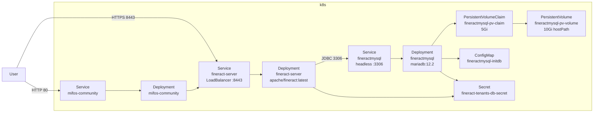

Apache Fineract ships a small set of plain Kubernetes manifests at `kubernetes/` that let you build, test, and deploy the platform onto any conforming cluster — minikube, kind, k3s, EKS, GKE, AKS, or bare-metal. The manifests are deliberately framework-free: no Helm chart, no Kustomize overlays, no operators. Each file is a self-contained, ASF-licensed YAML descriptor you can read, copy, and tweak.

This page is a tour of the directory, explaining what each file does, how the pieces fit together, and how to use the two bundled shell helpers (`kubectl-startup.sh` and `kubectl-shutdown.sh`) to bring up a complete Fineract environment in one command.

## Directory layout

```text
kubernetes/
├── fineract-server-deployment.yml          # Service + Deployment for the fineract-server pod
├── fineractmysql-deployment.yml            # PV + PVC + Service + Deployment for MariaDB (named "fineractmysql")
├── fineractmysql-configmap.yml             # ConfigMap with the init.sql that creates fineract_tenants/fineract_default
├── fineract-mifoscommunity-deployment.yml  # ConfigMap + Service + Deployment for the Mifos community UI
├── kubectl-startup.sh                      # End-to-end bring-up script
└── kubectl-shutdown.sh                     # End-to-end tear-down script
```

The image referenced by the application Deployment is `apache/fineract:latest` (the published image) — you can swap it for a locally Jib-built `fineract:latest` by editing the `image:` field, or load your own image into the cluster's registry. See [Docker images and Compose](/build/docker-images-and-compose) for how that image is built.

## The big picture



Three deployments (database, server, UI), one secret (database credentials), one configmap (database init script), one persistent volume + claim.

## `fineract-server-deployment.yml`

This single file contains two objects: a `LoadBalancer` Service publishing port `8443/TCP` to the outside world, and a Deployment running the application.

```yaml
apiVersion: v1
kind: Service
metadata:
  labels: { app: fineract-server }
  name: fineract-server
spec:
  ports:
  - protocol: TCP
    port: 8443
    targetPort: 8443
  selector:
    app: fineract-server
    tier: backend
  type: LoadBalancer

---

apiVersion: apps/v1
kind: Deployment
metadata:
  name: fineract-server
  labels: { app: fineract-server }
spec:
  selector: { matchLabels: { app: fineract-server, tier: backend } }
  strategy: { type: Recreate }
  template:
    metadata: { labels: { app: fineract-server, tier: backend } }
    spec:
      initContainers:
        - name: init-mydb
          image: busybox:1.28
          command: ['sh', '-c', 'echo -e "Checking for the availability of MYSQL server deployment"; while ! nc -z "fineractmysql" 3306; do sleep 1; printf "-"; done; echo -e " >> MYSQL server has started";']
      containers:
      - name: fineract-server
        image: apache/fineract:latest
        resources:
          limits:   { cpu: "1000m", memory: "2Gi" }
          requests: { cpu: "200m",  memory: "1Gi" }
        livenessProbe:
          httpGet:
            path: /fineract-provider/actuator/health/liveness
            port: 8443
            scheme: HTTPS
          initialDelaySeconds: 90
          periodSeconds: 10
          failureThreshold: 3
        readinessProbe:
          httpGet:
            path: /fineract-provider/actuator/health/readiness
            port: 8443
            scheme: HTTPS
          initialDelaySeconds: 60
          periodSeconds: 10
          failureThreshold: 3
        env:
        - name: FINERACT_NODE_ID
          value: '1'
        - name: FINERACT_HIKARI_DRIVER_CLASS_NAME
          value: org.mariadb.jdbc.Driver
        - name: FINERACT_HIKARI_JDBC_URL
          value: jdbc:mariadb://fineractmysql:3306/fineract_tenants
        - name: FINERACT_HIKARI_USERNAME
          valueFrom: { secretKeyRef: { name: fineract-tenants-db-secret, key: username } }
        - name: FINERACT_HIKARI_PASSWORD
          valueFrom: { secretKeyRef: { name: fineract-tenants-db-secret, key: password } }
        - name: FINERACT_DEFAULT_TENANTDB_HOSTNAME
          value: fineractmysql
        - name: FINERACT_DEFAULT_TENANTDB_PORT
          value: '3306'
        - name: FINERACT_DEFAULT_TENANTDB_UID
          valueFrom: { secretKeyRef: { name: fineract-tenants-db-secret, key: username } }
        - name: FINERACT_DEFAULT_TENANTDB_PWD
          valueFrom: { secretKeyRef: { name: fineract-tenants-db-secret, key: password } }
        - name: FINERACT_DEFAULT_TENANTDB_CONN_PARAMS
          value: ''
        - name: FINERACT_SERVER_PORT
          value: "8443"
        - name: JAVA_TOOL_OPTIONS
          value: '-Xmx1G -XX:MaxMetaspaceSize=256m'
        ports:
        - containerPort: 8443
          name: fineract-server
```

Three things to call out:

- **`initContainer` waits for MariaDB** — a tiny `busybox:1.28` pod hammers `nc -z fineractmysql 3306` until the DB is up. The Deployment `Recreate` strategy means the pod restarts cleanly after a config change.
- **HTTPS health endpoints on 8443** — `/fineract-provider/actuator/health/liveness` and `/.../readiness` use the same TLS port as the API. `initialDelaySeconds: 90` leaves room for Liquibase migrations on first boot.
- **Tenant configuration via environment variables, not a config file** — Fineract's standard `FINERACT_*` env vars are mapped directly. Tenant credentials are pulled from the `fineract-tenants-db-secret` Secret; the hostnames and ports are hard-coded to point at the in-cluster `fineractmysql` Service. This keeps the manifest immutable: only the secret needs rotation.

The `LoadBalancer` Service type works out-of-the-box on minikube (`minikube service fineract-server --url --https`) and on any cloud provider that ships a controller; on a bare-metal cluster you can flip it to `NodePort` or `ClusterIP` + Ingress.

## `fineractmysql-deployment.yml`

This is the data plane. It defines, in order:

1. A `PersistentVolume` (`fineractmysql-pv-volume`) of 10 GiB, `hostPath: /mnt/data`, storage class `manual`. This is suitable for minikube and CI; on a real cluster, drop the PV and let your CSI driver provision storage dynamically from the PVC.
2. A `PersistentVolumeClaim` (`fineractmysql-pv-claim`) of 5 GiB, also using `manual`.
3. A **headless Service** (`fineractmysql`, `clusterIP: None`) on port 3306 — that DNS name is what the application points at via `FINERACT_HIKARI_JDBC_URL=jdbc:mariadb://fineractmysql:3306/fineract_tenants`.
4. A `Deployment` running `mariadb:12.2` with:
   - `args: ['--innodb-snapshot-isolation=OFF']` — required for Fineract's repeated-read isolation expectations.
   - Resource requests of 1 CPU / 1 GiB, limits of 2 CPU / 5 GiB.
   - `MARIADB_ROOT_PASSWORD` sourced from `fineract-tenants-db-secret`.
   - Exec-probe liveness and readiness checks (`mariadb -uroot -p... -e 'SELECT 1'`).
   - Two volume mounts: `fineractmysql-initdb` (the ConfigMap) at `/docker-entrypoint-initdb.d/` and `fineractmysql-persistent-storage` (the PVC) at `/var/lib/mysql/`.

The Recreate strategy is appropriate here too — running two MariaDB pods against the same hostPath PV would corrupt the DB.

## `fineractmysql-configmap.yml`

The smallest, most important manifest: the seed SQL.

```yaml
apiVersion: v1
kind: ConfigMap
metadata:
  name: fineractmysql-initdb
  labels: { app: fineract-server }
data:
  init.sql: |
    # create databases
    CREATE DATABASE IF NOT EXISTS `fineract_tenants`;
    CREATE DATABASE IF NOT EXISTS `fineract_default`;

    # create root user and grant rights
    GRANT ALL ON *.* TO 'root'@'%';
```

This file is what bootstraps the **`fineract_tenants` registry database** and the default tenant DB (`fineract_default`). MariaDB's official image executes any `*.sql` under `/docker-entrypoint-initdb.d/` on first boot, so as long as the PV is empty, this SQL fires exactly once and creates the schemas Fineract expects. Once the PV holds data, the file is ignored on subsequent boots.

If you want to add a second tenant out of the box, drop another `CREATE DATABASE` line and add a row to `fineract_tenants.tenants` via your own `tenants.sql` file, mounted next to this one.

## `fineract-mifoscommunity-deployment.yml`

Optional frontend. It contains:

- A ConfigMap (`web-app-config`) carrying `environment.json` (pointed at `/fineract-provider`) and an `nginx.conf` that reverse-proxies `/fineract-provider/` to the in-cluster `https://fineract-server:8443` Service with `proxy_ssl_verify off`.
- A Service exposing the UI.
- A Deployment running the Mifos Community / Web App image.

This is what the startup script labels `mifos-community`. Skip this file if you only need the API.

## The secret

The deployment manifests do **not** ship the secret directly — instead, `kubectl-startup.sh` creates it on the fly with a random password:

```bash
kubectl create secret generic fineract-tenants-db-secret \
  --from-literal=username=root \
  --from-literal=password=$(head /dev/urandom | LC_CTYPE=C tr -dc A-Za-z0-9 | head -c 16) \
  2>/dev/null || echo "Secret already exists, skipping..."
```

The 16-character random password is captured into the cluster the first time you run the script; subsequent runs leave the existing secret untouched. Both the application Deployment and the MariaDB Deployment reference the same secret, so they always agree on the credentials.

For production, replace this on-the-fly generation with a Sealed Secret, an External Secrets Operator definition, or a managed secret from your cloud provider — and reference the credentials in the same `fineract-tenants-db-secret` name so the manifests don't need to change.

## `kubectl-startup.sh` — bring everything up

The script chains `kubectl apply` and `kubectl wait` calls into an idempotent one-shot installer:

1. Create the `fineract-tenants-db-secret` (if absent).
2. `kubectl apply -f fineractmysql-configmap.yml`.
3. `kubectl apply -f fineractmysql-deployment.yml`, then wait for `tier=fineractmysql` pods to be Ready (timeout 5 min).
4. `kubectl apply -f fineract-server-deployment.yml`, then wait for `app=fineract-server` pods (timeout 5 min).
5. `kubectl apply -f fineract-mifoscommunity-deployment.yml`, then wait for `app=mifos-community` pods (timeout 5 min).
6. Print access hints:
   ```
   To access the Mifos web application:
     minikube service mifos-community
   To access the Fineract API directly:
     minikube service fineract-server --url --https
   Default credentials:
     Username: mifos
     Password: password
   ```

Run it from inside `kubernetes/`:

```bash
cd kubernetes/
./kubectl-startup.sh
```

## `kubectl-shutdown.sh` — tear everything down

The companion script reverses the order, removing the Deployments and Services, then optionally deleting the PVC/PV/secret so a subsequent `kubectl-startup.sh` boots a fresh database. Read it before running on a shared cluster — it does delete the PVC, which destroys data.

## Customising for production

A few practical tweaks once you move from minikube to a real cluster:

| Change | Why |
| --- | --- |
| Replace the manual `PersistentVolume` with `storageClassName: gp3` / `premium-rwo` and let dynamic provisioning take over | Avoid hostPath PVs entirely. |
| Replace MariaDB with a managed service (Amazon RDS for MariaDB, Cloud SQL for MySQL, …) | Production-grade backup / HA. |
| Drop `fineractmysql-deployment.yml` and `fineractmysql-configmap.yml`, point `FINERACT_HIKARI_JDBC_URL` at the managed endpoint | Same secret name keeps the app manifest unchanged. |
| Switch the Service to `ClusterIP` and add an Ingress with a real TLS certificate | Avoid relying on the self-signed cert baked into the image. |
| Tune `JAVA_TOOL_OPTIONS` to your node size — `-Xmx2G -XX:MaxRAMPercentage=60` is a sensible starting point | Default `-Xmx1G` is conservative. |
| Increase replicas of `fineract-server` once you have a shared / managed DB | The app is stateless. |
| Front the deployment with a `HorizontalPodAutoscaler` on CPU + memory | Auto-scale under load. |
| Add a `PodDisruptionBudget` (e.g. `minAvailable: 1`) and an `Anti-Affinity` rule | Survive node drains. |
| Move secrets to an `ExternalSecret` (External Secrets Operator) or `SealedSecret` (Bitnami) | Don't generate credentials in a shell script. |
| Apply the `kubernetes/` manifests as base, layer environment-specific overrides with Kustomize | Avoid hand-editing the YAML per environment. |
| Mount a custom `logback-override.xml` via ConfigMap at `/app/logback-override.xml` | Same hook used by the compose flavours. |

## Verifying the deployment

After `kubectl-startup.sh` finishes:

```bash
kubectl get pods -o wide
kubectl logs deployment/fineract-server
kubectl logs deployment/fineractmysql
kubectl get svc

# Smoke-test the API
curl -sk -u mifos:password \
     -H "Fineract-Platform-TenantId: default" \
     https://$(minikube ip):$(kubectl get svc fineract-server -o jsonpath='{.spec.ports[0].nodePort}')/fineract-provider/api/v1/clients
```

The endpoint should return a paged JSON envelope — the empty default tenant ships with no clients.

## Beyond raw YAML

Apache Fineract intentionally does not maintain a Helm chart or an Operator in this repository — operators looking for those typically use third-party charts (e.g. the Mifos `mifosx-helm-chart`) or build their own. The manifests here are best read as **a reference deployment** that documents:

- which environment variables matter (`FINERACT_HIKARI_*`, `FINERACT_DEFAULT_TENANTDB_*`),
- which probes Fineract exposes (`/fineract-provider/actuator/health/liveness`, `.../readiness`),
- and the assumed dependency graph (DB before app, app before UI, single Secret for DB credentials).

Take what you need from this directory, drop it into your own GitOps repo, and tweak it for your environment.

## Local development with minikube

The fastest way to exercise these manifests end-to-end is minikube. The full happy-path looks like this:

```bash
# 1. Build the local image
./gradlew :fineract-provider:jibDockerBuild

# 2. Make it visible to minikube
minikube image load fineract:latest
# (or run `eval $(minikube docker-env)` before the gradle command)

# 3. Patch fineract-server-deployment.yml temporarily to use fineract:latest
#    (instead of apache/fineract:latest) and bring everything up
cd kubernetes/
./kubectl-startup.sh

# 4. Open the UI
minikube service mifos-community

# 5. Tail the API logs
kubectl logs -f deployment/fineract-server

# 6. Tear down
./kubectl-shutdown.sh
```

Because `kubectl-startup.sh` is idempotent, running it a second time after editing a manifest only re-applies what changed; the secret and config map survive.

## Environment-variable reference

The Deployment exposes the most-tuned subset of Fineract's configuration as plain env vars. The table below is the contract the manifest commits to — any of these names will be picked up by `fineract-provider` whether they come from a literal `value:`, a `valueFrom: secretKeyRef`, or a `valueFrom: configMapKeyRef`:

| Variable | Meaning |
| --- | --- |
| `FINERACT_NODE_ID` | Numeric node identifier (`'1'` in the default manifest). |
| `FINERACT_SERVER_PORT` | HTTPS port the embedded Tomcat listens on (`8443`). |
| `FINERACT_HIKARI_DRIVER_CLASS_NAME` | JDBC driver class. |
| `FINERACT_HIKARI_JDBC_URL` | JDBC URL for the **tenants registry** database. |
| `FINERACT_HIKARI_USERNAME` / `FINERACT_HIKARI_PASSWORD` | Tenants-registry credentials (from `fineract-tenants-db-secret`). |
| `FINERACT_DEFAULT_TENANTDB_HOSTNAME` / `..._PORT` | Default-tenant database host/port. |
| `FINERACT_DEFAULT_TENANTDB_UID` / `..._PWD` | Default-tenant credentials (from the same secret). |
| `FINERACT_DEFAULT_TENANTDB_CONN_PARAMS` | Extra JDBC connection parameters appended to the URL (`?useSSL=true` etc.). |
| `JAVA_TOOL_OPTIONS` | JVM args (`-Xmx1G -XX:MaxMetaspaceSize=256m`). |

If you add an Ingress, a separate `FINERACT_*` variable for the public hostname, or a new tenant, this is the table to extend.

## Summary

The `kubernetes/` directory is a **minimum-viable, production-style** deployment of Apache Fineract. Four manifests (DB, app, UI, init script) plus two shell helpers spin up a complete environment in one command, hand secrets through a Kubernetes Secret, seed the tenants and default databases from a ConfigMap, and probe the application via HTTPS actuator endpoints. Use it on minikube/k3s for learning, fork it as the base of your own GitOps deployment, or strip the in-cluster MariaDB and point Fineract at a managed database for production.

