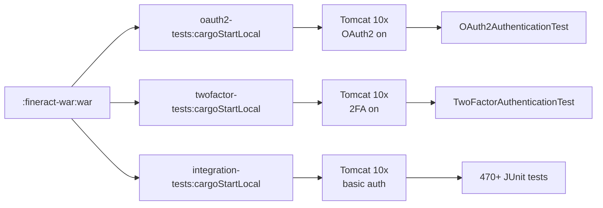
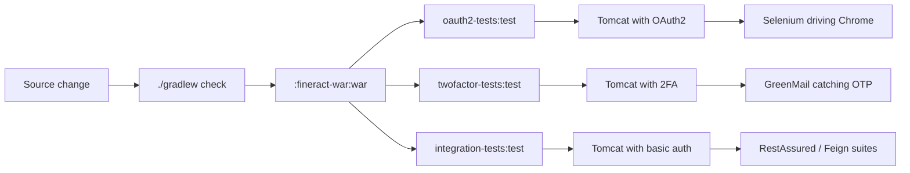

Apache Fineract ships two single-purpose Gradle modules whose only job is to build, deploy, and test the authentication flows that the main `integration-tests` module deliberately skips: **`oauth2-tests`** verifies the OAuth2 resource-server flow with a real browser via Selenium, and **`twofactor-tests`** verifies the basic-auth + email-OTP two-factor flow with a real SMTP server. Both modules deploy the same `fineract-provider.war` through the `bmuschko` Cargo plugin into Tomcat 10x, but each starts Tomcat with a **different set of `fineract.security.*` flags** so that exactly one authentication mode is active per run.

This page covers how the two modules are wired into the multi-project build, the Cargo properties that flip security modes, and the harness each test class uses to exercise the flow.

## Why dedicated modules

Fineract's security stack is mutually exclusive at runtime — basic auth, OAuth2 resource-server, and two-factor are all controlled by three Spring properties:

```text
-Dfineract.security.basicauth.enabled=...
-Dfineract.security.oauth2.enabled=...
-Dfineract.security.2fa.enabled=...
```

The default `integration-tests` module runs basic auth on, OAuth2 off, 2FA off. That keeps the bulk of the API surface easy to test, but it leaves a gap: neither the OAuth2 nor the 2FA filter chain is exercised end-to-end. Splitting them into their own modules has three benefits:

- **Bootstrap independence** — each module spins up its **own** Tomcat with **its own** JVM flags. There is no risk of profile bleed.
- **Optional dependencies** — Selenium (oauth2-tests) and GreenMail (twofactor-tests) live in only one of the two modules.
- **CI parallelism** — `:oauth2-tests:test`, `:twofactor-tests:test`, and `:integration-tests:test` can run in parallel on three different CI shards.

## Module layout

Both modules look almost identical because they share the Cargo / Tomcat scaffolding with `integration-tests`. The interesting differences are the security flags and the test dependencies.

```text
oauth2-tests/
├── build.gradle            # Cargo + Selenium-Java + WebDriverManager
├── dependencies.gradle
└── src/test/java/org/apache/fineract/oauth2tests/
    └── OAuth2AuthenticationTest.java

twofactor-tests/
├── build.gradle            # Cargo + GreenMail
├── dependencies.gradle
└── src/test/java/org/apache/fineract/twofactortests/
    └── TwoFactorAuthenticationTest.java
```

Each module has a single JUnit 5 test class. The intention is not to mirror the integration-tests catalogue — the goal is to validate one flow correctly end-to-end.

## The shared scaffolding

Both `build.gradle` files apply the same Cargo plugin with the same WAR, the same Tomcat 10x container, the same self-signed HTTPS keystore, and the same `waitForFineract` style of polling. The only differences are which security flags are set on the JVM command line and which extra `testImplementation` dependencies are pulled in.

The general shape (excerpt from `oauth2-tests/build.gradle`):

```groovy
description = 'Fineract Integration Tests for OAuth2'

apply plugin: 'com.bmuschko.cargo'

configurations { tomcat ; driver }

apply from: 'dependencies.gradle'

configurations { driver }
dependencies {
    driver 'com.mysql:mysql-connector-j'
    testImplementation 'org.seleniumhq.selenium:selenium-java:4.21.0'
    testImplementation 'io.github.bonigarcia:webdrivermanager:6.3.3'
    testImplementation 'org.junit.jupiter:junit-jupiter:5.10.0'
}

cargo {
    containerId "tomcat10x"

    deployable {
        file = file("$rootDir/fineract-war/build/libs/fineract-provider.war")
        context = 'fineract-provider'
    }

    local {
        outputFile = file("$buildDir/cargo/oauth2-tests-output.log")
        installer { ... }
        startStopTimeout = 240000
        sharedClasspath = configurations.driver
        containerProperties {
            def jvmArgs = '--add-exports=... --add-opens=... ' +
                          '-Dfineract.security.basicauth.enabled=false ' +
                          '-Dfineract.security.oauth2.enabled=true ' +
                          '-Dfineract.security.2fa.enabled=false '
            ...
            property 'cargo.start.jvmargs', jvmArgs
            property 'cargo.tomcat.connector.keystoreFile', file("$rootDir/fineract-provider/src/main/resources/keystore.jks")
            property 'cargo.tomcat.connector.keystorePass', 'openmf'
            property 'cargo.tomcat.connector.keystoreType', 'JKS'
            property 'cargo.tomcat.httpSecure', true
            property 'cargo.tomcat.connector.sslProtocol', 'TLS'
            property 'cargo.tomcat.connector.clientAuth', false
            property 'cargo.protocol', 'https'
            property 'cargo.servlet.port', 8443
        }
    }
}
```

For `twofactor-tests/build.gradle` the security flags flip the other way:

```groovy
def jvmArgs = '... ' +
              '-Dfineract.security.basicauth.enabled=true ' +
              '-Dfineract.security.oauth2.enabled=false ' +
              '-Dfineract.security.2fa.enabled=true '
```

The two flags-tables side by side:

| Property | `integration-tests` | `oauth2-tests` | `twofactor-tests` |
| --- | --- | --- | --- |
| `fineract.security.basicauth.enabled` | (default) | `false` | `true` |
| `fineract.security.oauth2.enabled` | (default) | **`true`** | `false` |
| `fineract.security.2fa.enabled` | (default) | `false` | **`true`** |

Both modules support the `-PdbType=` Gradle property and produce the same MariaDB / MySQL / PostgreSQL JDBC URLs as the integration-tests module.



## `oauth2-tests` — OAuth2 resource-server with Selenium

The single test class is `oauth2-tests/src/test/java/org/apache/fineract/oauth2tests/OAuth2AuthenticationTest.java`. It uses:

- **Selenium** (`org.seleniumhq.selenium:selenium-java:4.21.0`) + **WebDriverManager** (`io.github.bonigarcia:webdrivermanager:6.3.3`) to drive Chrome through the authorisation-code flow.
- **RestAssured** (`given()`, `expect()`, `body()`) for the REST calls that follow the access-token retrieval.
- **`com.sun.net.httpserver.HttpServer`** to spin up an in-process stub of the OAuth2 callback URL, so the test does not need a real reverse proxy.

The pre-test setup:

```java
public class OAuth2AuthenticationTest {

    private ResponseSpecification responseSpec;
    private ResponseSpecification responseSpec401;
    private RequestSpecification requestSpec;
    private RequestSpecification requestFormSpec;

    public static final String TENANT_PARAM_NAME = "tenantIdentifier";
    public static final String DEFAULT_TENANT = "default";
    public static final String TENANT_IDENTIFIER = TENANT_PARAM_NAME + '=' + DEFAULT_TENANT;
    private static final String HEALTH_URL = "/fineract-provider/actuator/health";

    @BeforeEach
    public void setup() throws InterruptedException {
        initializeRestAssured();

        this.requestSpec = new RequestSpecBuilder().setContentType(ContentType.JSON).build();

        // Login with basic authentication
        awaitSpringBootActuatorHealthyUp();

        this.requestSpec = new RequestSpecBuilder().setContentType(ContentType.JSON).build();
        this.requestFormSpec = new RequestSpecBuilder().setContentType(ContentType.URLENC).build();
        this.responseSpec = new ResponseSpecBuilder().expectStatusCode(200).build();
        this.responseSpec401 = new ResponseSpecBuilder().expectStatusCode(401).build();
    }
    ...
}
```

`awaitSpringBootActuatorHealthyUp()` polls `/fineract-provider/actuator/health` and is the same trick used by the integration-tests `waitForFineract` Gradle task — Cargo returns control as soon as Tomcat is up, but the Fineract Spring Boot application can still be running Liquibase. The test waits for the actuator to return 200.

`@Test` methods then:

1. Use Selenium to navigate to the OAuth2 authorisation URL.
2. Drive the username/password form (`By.name("username")` + `By.name("password")`).
3. Capture the redirected `code` parameter inside the in-process `HttpServer`.
4. Exchange the code for a token at `/fineract-provider/api/oauth/token` using RestAssured with form-encoded data.
5. Call a protected endpoint (e.g. `/fineract-provider/api/v1/users`) with the bearer token and assert 200.
6. Repeat with no token or an expired token and assert 401.

Because the test depends on a real browser, the Cargo `startStopTimeout` is higher than for plain RestAssured tests (240 s) — the first run also has to wait for WebDriverManager to download a matching ChromeDriver binary.

### Running it

```bash
# Default MariaDB
./gradlew :oauth2-tests:test

# Against PostgreSQL
./gradlew :oauth2-tests:test -PdbType=postgresql

# Headless (set in test code by passing chrome arguments)
./gradlew :oauth2-tests:test -Dwdm.chromeDriverVersion=stable
```

CI runs use a headless Chrome image; locally the test pops a Chrome window unless `ChromeOptions` is told otherwise.

## `twofactor-tests` — Two-factor authentication with GreenMail

The companion test class is `twofactor-tests/src/test/java/org/apache/fineract/twofactortests/TwoFactorAuthenticationTest.java`. It uses:

- **RestAssured** for every HTTP call.
- **GreenMail** (`com.icegreen:greenmail-junit5`) as an in-process SMTP server that captures the OTP email Fineract sends to the user.

The set-up registers GreenMail through a JUnit 5 extension:

```java
public class TwoFactorAuthenticationTest {

    @RegisterExtension
    static GreenMailExtension greenMail = new GreenMailExtension(ServerSetupTest.SMTP)
            .withConfiguration(GreenMailConfiguration.aConfig()
                .withUser("support@cloudmicrofinance.com", "support81"))
            .withPerMethodLifecycle(true);

    @BeforeEach
    public void setup() throws InterruptedException {
        initializeRestAssured();
        this.requestSpec = new RequestSpecBuilder().setContentType(ContentType.JSON).build();
        awaitSpringBootActuatorHealthyUp();
        String json = RestAssured.given()
            .contentType(ContentType.JSON)
            .body("{\"username\":\"mifos\", \"password\":\"password\"}")
            .expect().log().ifError()
            .when().post(LOGIN_URL).asString();
        assertFalse(StringUtils.isBlank(json));
        ...
    }
}
```

The test plays out the 2FA flow:

1. Submit basic-auth credentials to `/fineract-provider/api/v1/authentication`.
2. Receive a `basicAuthenticationKey` and a list of available delivery methods.
3. Request an OTP to be sent over email.
4. Pull the message from the GreenMail mailbox.
5. Match the OTP with `java.util.regex.Pattern`.
6. Submit the OTP back to Fineract and receive a `twoFactorAccessToken`.
7. Call a protected endpoint with the two-factor token in the `Fineract-Platform-TFA-Token` header and assert 200.
8. Repeat without a token and assert 401 / 403.

Fineract is configured to deliver the OTP email through GreenMail by wiring `mail.smtp.host=localhost`, `mail.smtp.port=3025`, and `mail.smtp.user=support@cloudmicrofinance.com` in the test profile.

### Running it

```bash
./gradlew :twofactor-tests:test
./gradlew :twofactor-tests:test -PdbType=postgresql
```

## How they slot into the build

All three Cargo-based modules share the same task graph. The only difference is which configuration is applied:



Each module writes its Cargo log under `build/cargo/<module>-tests-output.log` and its Tomcat install under `build/tomcat-<module>-tests/` so the three runs never collide on the file system.

## Why these flows aren't in `integration-tests`

Because the JVM flags are mutually exclusive, you can't hot-swap auth modes inside the same Tomcat without restarting it. Splitting the suites avoids:

- The need to teach `integration-tests` how to take Tomcat down and bring it back up between scenarios.
- Cross-contamination between basic-auth, OAuth2 and 2FA filters in the Spring Security chain.
- Pulling Selenium / Chrome / GreenMail into the dependencies of every integration test, lengthening every CI run.

The dedicated modules pay the cost (one Tomcat boot each) and keep the integration-tests suite focused on REST behaviour rather than identity.

## CI sequencing

A typical Apache Fineract CI pipeline runs:

```text
build                              → :fineract-war:war
├── integration-tests-shard-1      → :integration-tests:test --tests Shard1*
├── integration-tests-shard-2      → :integration-tests:test --tests Shard2*
├── integration-tests-shard-3      → :integration-tests:test --tests Shard3*
├── integration-tests-shard-N      → ...
├── oauth2-tests                   → :oauth2-tests:test
├── twofactor-tests                → :twofactor-tests:test
└── e2e-cucumber                   → :fineract-e2e-tests-runner:test
```

The OAuth2 and 2FA shards are kept short on purpose (one test class each) so they finish well within the CI budget while still gating every PR on the security flows.

## Customising the OAuth2 / 2FA configuration

For local debugging, the two `cargo.containerProperties` blocks expose the same `-PlocalDebug` switch the integration tests use:

```bash
./gradlew :oauth2-tests:test -PlocalDebug
# Tomcat will listen on JDWP port 9000
```

If you want to point the OAuth2 tests at a real identity provider rather than the in-process stub server, override the `fineract.security.oauth2.*` properties at `cargo.start.jvmargs` time by editing the local `build.gradle` or by exporting `GRADLE_OPTS` with the right `-D` values before invoking Gradle.

For the 2FA tests, swap GreenMail for an in-cluster SMTP server by changing the JVM args to point at it and removing the `@RegisterExtension` block.

## Failure triage

Same playbook as integration tests:

1. **Test report** — `<module>/build/reports/tests/test/index.html`.
2. **Cargo log** — `<module>/build/cargo/<module>-tests-output.log`.
3. **Tomcat log** — `<module>/build/tomcat-<module>-tests/.../logs/catalina.out`.
4. For OAuth2: ChromeDriver logs (`build/test-results/test/`).
5. For 2FA: GreenMail captured-mail dump (printed by the test on failure).

## Summary

- `oauth2-tests` and `twofactor-tests` are **separate Gradle modules** included from `settings.gradle` next to `integration-tests`.
- They share the **`com.bmuschko.cargo` + Tomcat 10x + HTTPS 8443** scaffolding with the integration-tests module, only diverging on the **`-Dfineract.security.*` JVM flags** that select the authentication mode.
- `oauth2-tests` uses **Selenium + WebDriverManager + a stub `HttpServer`** to drive the authorisation-code flow.
- `twofactor-tests` uses **GreenMail** to capture the OTP email and complete the two-factor login.
- Both run in parallel with the main integration-tests shards in CI, so a single `./gradlew check` certifies that **every** authentication mode still works end-to-end.
