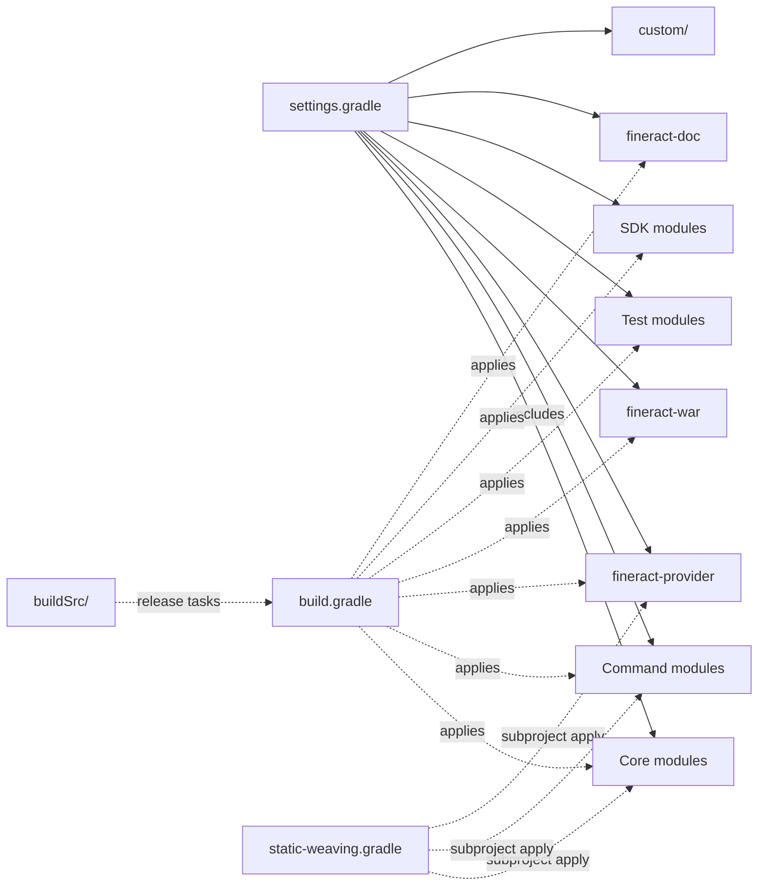

Apache Fineract is built, tested, and deployed through a single **multi-project Gradle build** rooted at the top of the repository. The build configures Java 21 toolchains across more than thirty subprojects, applies a uniform stack of quality plugins (Spotless, Checkstyle, SpotBugs, JaCoCo, error-prone, Modernizer, Apache RAT, license-gradle), wires up EclipseLink static weaving for JPA entities, generates two flavours of OpenAPI client SDK, produces a Spring Boot bootable JAR, and finally bakes that JAR into a container image via Google Jib for Docker and Kubernetes deployment.

This page is the single entry point to the rest of the **Build** section. It covers the high-level layout, the tasks you will run most days, the quality gates that fire on every `check`, and the conventions you need to know before you contribute or operate Fineract.

## Toolchain and prerequisites

The build is intentionally hermetic — once you have a JDK 21 and the Gradle wrapper, no other tooling is mandatory.

| Component | Version | Source |
| --- | --- | --- |
| Java toolchain | 21 | `build.gradle` → `java { toolchain { languageVersion = JavaLanguageVersion.of(21) } }` |
| Gradle | 8.14.3 | `gradle/wrapper/gradle-wrapper.properties` (`distributionUrl=...gradle-8.14.3-bin.zip`) |
| Spring Boot | 3.5.13 | `build.gradle` plugins block |
| EclipseLink | 4.0.6 | `build.gradle` buildscript classpath |
| JaCoCo | 0.8.12 | `build.gradle` → `jacocoVersion` |
| Checkstyle | 11.0.0 + sevntu-checks 1.44.1 | `build.gradle` (all-projects `dependencies { checkstyle ... }`) |
| SpotBugs Gradle plugin | 6.0.26 | `build.gradle` plugins block |
| Spotless | 6.25.0 | `build.gradle` plugins block |
| OpenAPI Generator | 7.8.0 | `build.gradle` plugins block |
| Jib | 3.4.5 | `build.gradle` plugins block, applied in `fineract-provider/build.gradle` |

Build JVM args (in `gradle.properties`) include `-Xmx8g` and a long list of `--add-exports` / `--add-opens` flags required by EclipseLink, error-prone, and the JPA stack under JDK 17+. Build caching, parallel execution, and the VFS watcher are enabled by default:

```properties
# gradle.properties
org.gradle.jvmargs=-Xmx8g --add-exports jdk.compiler/com.sun.tools.javac.api=ALL-UNNAMED ...
org.gradle.caching=true
org.gradle.parallel=true
org.gradle.daemon.idletimeout=10800000
org.gradle.vfs.watch=true
```

The root `settings.gradle` also enables **Gradle Develocity** scans against `https://develocity.apache.org` (project ID `fineract`) and a local build cache.

## Repository layout

The build is composed of several families of subprojects. The full include list lives in `settings.gradle`; the families are:

- **Core domain modules** — `fineract-core`, `fineract-security`, `fineract-cob`, `fineract-validation`, `fineract-accounting`, `fineract-branch`, `fineract-document`, `fineract-investor`, `fineract-rates`, `fineract-charge`, `fineract-tax`, `fineract-loan-origination`, `fineract-loan`, `fineract-savings`, `fineract-report`, `fineract-mix`, plus the progressive- and working-capital-loan modules.
- **Command bus modules** — `fineract-command`, `fineract-command-test`, `fineract-command-jdbc`, `fineract-command-audit`, `fineract-command-async`, `fineract-command-disruptor`.
- **The runtime** — `fineract-provider` (Spring Boot application) and `fineract-war` (WAR packaging used by `cargo`-based test modules).
- **Test modules** — `integration-tests`, `twofactor-tests`, `oauth2-tests`, `fineract-e2e-tests-core`, `fineract-e2e-tests-runner`.
- **SDK / client modules** — `fineract-client` (Retrofit), `fineract-client-feign` (Feign), `fineract-avro-schemas`.
- **Documentation** — `fineract-doc`.
- **Custom plugins** — `custom:docker` plus any company/category/module discovered dynamically by `settings.gradle` under `custom/`.

The build also picks up `buildSrc/` (a sibling Gradle project that compiles a Groovy plugin used for release tooling) and the standalone scripts in `gradle/`, `scripts/`, and the root `static-weaving.gradle`.



## The everyday tasks

Run all Gradle tasks through the wrapper (`./gradlew` on Linux/macOS, `gradlew.bat` on Windows). The most important top-level tasks are:

### `build`

The standard Gradle lifecycle: it compiles every subproject, runs its unit tests, executes the `check` aggregator (which depends on `rat`, `licenseMain`, `licenseTest`, Checkstyle, SpotBugs, Spotless, Modernizer, etc.), and assembles all artifacts. Because `org.gradle.parallel=true`, leaf modules build concurrently.

```bash
./gradlew clean build
```

### `test`

Per-module unit tests are JUnit 5 based (`useJUnitPlatform()` is set on the `test` task in test modules). Top-level `test` runs across every Java project. The `com.adarshr.test-logger` plugin (applied in the root `build.gradle`) prettifies test output.

```bash
./gradlew test
./gradlew :fineract-loan:test
./gradlew test --tests "org.apache.fineract.loan.*"
```

### `integrationTest`

The `integration-tests`, `oauth2-tests`, and `twofactor-tests` modules use the **bmuschko `cargo` Gradle plugin** to deploy `fineract-war/build/libs/fineract-provider.war` into a fresh embedded Tomcat 10x server, wait for `/fineract-provider/actuator/health` to respond on `https://localhost:8443`, run RestAssured tests against it, then stop the container. The default `test` task in those modules pulls in `cargoStartLocal`, the custom `waitForFineract` task, and is finalised by `cargoStopLocal`:

```groovy
// integration-tests/build.gradle
tasks.named('test').configure {
    if (!project.hasProperty('cargoDisabled')) {
        dependsOn cargoStartLocal, waitForFineract
        finalizedBy cargoStopLocal
    }
}
```

Examples:

```bash
./gradlew :integration-tests:test
./gradlew :integration-tests:test -PdbType=postgresql
./gradlew :integration-tests:test -PcargoDisabled            # use an externally running Fineract
./gradlew :twofactor-tests:test
./gradlew :oauth2-tests:test
```

### `bootRun`

`fineract-provider` applies the Spring Boot Gradle plugin. `bootRun` launches the application against the active database (MariaDB by default) and binds HTTPS on 8443 using the test keystore in `fineract-provider/src/main/resources/keystore.jks`:

```bash
./gradlew :fineract-provider:bootRun
```

The root `build.gradle` documents this in its `description` block:

```groovy
description = '''\
Run as:
gradle clean bootRun'''
```

### `bootJar`, `bootWar`, `war`

`fineract-provider:bootJar` produces the Spring Boot fat JAR consumed by Jib. `fineract-war:war` builds the deployable WAR used by Cargo-based integration tests.

### `jib` / `jibDockerBuild` (the "docker" task)

`fineract-provider/build.gradle` applies `com.google.cloud.tools.jib` and configures it to base on `azul/zulu-openjdk-alpine:21`, push to a local image named `fineract` with tags `${project.version}` and `latest`, and embed the MariaDB and PostgreSQL JDBC drivers:

```groovy
jib {
    from { image = 'azul/zulu-openjdk-alpine:21' ; ... }
    to   { image = 'fineract' ; tags = ["${project.version}", 'latest'] }
    container {
        mainClass = 'org.apache.fineract.ServerApplication'
        ports = ['8080/tcp', '8443/tcp']
        user = 'nobody:nogroup'
    }
}
tasks.jib.dependsOn(bootJar, resolve, generateGitProperties)
tasks.jibDockerBuild.dependsOn(bootJar, resolve, generateGitProperties)
```

Build the OCI image locally:

```bash
./gradlew :fineract-provider:jibDockerBuild
```

This is the image referenced from every `docker-compose-*.yml` flavour and from the Kubernetes manifests under `kubernetes/`.

## The quality gates

Every subproject inherits the root `build.gradle` configuration that wires the following plugins into the `check` lifecycle.

### Spotless

`com.diffplug.spotless` is applied to every project. It formats Java with the bundled Eclipse formatter (`config/fineractdev-formatter.xml`), enforces alphabetical import order, removes unused imports, sorts modifier keywords, formats Gradle Groovy via greclipse, and runs `misc` formatting (Markdown, YAML, XML, JSON, SQL, properties). Failures appear as build errors:

```bash
./gradlew spotlessCheck    # fail on style drift
./gradlew spotlessApply    # auto-format
```

### Checkstyle

```groovy
dependencies {
    checkstyle 'com.puppycrawl.tools:checkstyle:11.0.0'
    checkstyle 'com.github.sevntu-checkstyle:sevntu-checks:1.44.1'
}
```

`*.avsc` files (Avro schemas in `fineract-avro-schemas`) and the `custom:acme:` showcase modules are excluded.

### SpotBugs

`com.github.spotbugs` version 6.0.26 runs against `main` and `test` sources of every Java module, with an exclude filter at `config/spotbugs/exclude.xml` and an SLF4J bug-pattern plugin (`jp.skypencil.findbugs.slf4j:bug-pattern:1.5.0`). For JDK 21 compatibility the build forces `org.ow2.asm:9.5` in the `spotbugs` configuration.

### JaCoCo

JaCoCo 0.8.12 produces HTML and XML reports per module:

```groovy
jacoco { toolVersion = jacocoVersion ; reportsDirectory = file("$buildDir/reports/jacoco") }
jacocoTestReport {
    reports {
        html.required = true ; xml.required = true
        html.outputLocation = layout.buildDirectory.dir('code-coverage')
    }
}
```

The XML report is consumed by the Sonar plugin (`id 'org.sonarqube' version '6.0.1.5171'`), which is configured from GitHub Actions.

### error-prone

`net.ltgt.errorprone` 4.1.0 is applied to every `JavaCompile` task. A handful of checks are upgraded to **error** (`DefaultCharset`, `StringSplitter`, `MutablePublicArray`, `EqualsGetClass`, `FutureReturnValueIgnored`) and a smaller list is disabled where Lombok or generated code would create false positives.

### Modernizer, Apache RAT, License-gradle

`com.github.andygoossens.modernizer` flags outdated Java APIs. `org.nosphere.apache.rat` (`rat` task) checks every file has an ASF licence header, and `com.github.hierynomus.license` (`licenseMain` / `licenseTest`) re-applies the header from `APACHE_LICENSETEXT.md` when needed. All three feed into `check`:

```groovy
check { dependsOn(rat, licenseMain, licenseTest) }
```

### Dependency / vulnerability checks

While the project does not include `org.owasp.dependencycheck` directly, two security-oriented mechanisms run as part of the build:

- `com.github.jk1.dependency-license-report` 2.9 generates per-module dependency licence inventories.
- `org.cyclonedx.bom` 3.1.0 produces a CycloneDX **Software Bill of Materials** for release artefacts.
- `dependencySubstitution` in the root build forces `org.lz4:lz4-java` to be replaced with `at.yawk.lz4:lz4-java:1.10.1` to mitigate **CVE-2025-12183**.

```groovy
allprojects {
    configurations.configureEach {
        resolutionStrategy {
            dependencySubstitution {
                substitute module('org.lz4:lz4-java') using module('at.yawk.lz4:lz4-java:1.10.1')
            }
        }
    }
}
```

### Develocity build scans

The settings file enables a Develocity build scan against `https://develocity.apache.org` for every build, with IP obfuscation. Background upload is disabled on CI (detected through `JENKINS_URL`).

## Pre-commit checks

Before pushing a change the project expects you to run, at minimum:

```bash
./gradlew spotlessApply           # auto-fix style
./gradlew check                   # spotlessCheck + checkstyle + spotbugs + rat + license + tests
```

Heavier validations developers commonly run locally:

```bash
./gradlew :fineract-provider:bootRun                # smoke-run the server
./gradlew :integration-tests:test -PcargoDisabled   # integration tests against running server
./gradlew :fineract-client:buildJavaSdk             # regenerate Retrofit SDK after OpenAPI changes
./gradlew :fineract-provider:jibDockerBuild         # rebuild the container image
```

A small set of helper shell scripts live in `scripts/`:

- `scripts/check-liquibase-ddl-safety.sh` — guard against unsafe DDL in Liquibase changesets.
- `scripts/jpa-scanner-grouped.sh` — diagnose JPA entity coverage by static-weaving group.
- `scripts/split-features.sh`, `scripts/split-tests.sh` — split E2E features and integration tests across CI shards.
- `scripts/verify-signed-commits.sh` — verify GPG signatures on a commit range.

## Static weaving

EclipseLink **static weaving** is configured globally and applied to every module that ships a `persistence.xml` under `src/main/resources/jpa/static-weaving/module/<module-name>/`. The root build does:

```groovy
// build.gradle
subprojects { subproject ->
    apply from: rootProject.file('static-weaving.gradle')
}
```

See [Static Weaving](/build/static-weaving) for the full mechanism, including the `compileJava.doLast` step that runs `org.eclipse.persistence.tools.weaving.jpa.StaticWeave` over the compiled classes directory.

## Containerisation and deployment

`./gradlew :fineract-provider:jibDockerBuild` produces a local `fineract:latest` image; the various **docker-compose** flavours and the manifests under `kubernetes/` consume it. The compose flavours cover every supported database (MariaDB, MySQL, PostgreSQL), every messaging backend (ActiveMQ, Kafka, Kafka-MSK), the development stack (with Loki/Grafana logging), and the bundled web frontends:

```text
docker-compose.yml                              # default: MariaDB
docker-compose-mariadb.yml
docker-compose-mysql.yml
docker-compose-postgresql.yml
docker-compose-postgresql-activemq.yml
docker-compose-postgresql-kafka.yml
docker-compose-postgresql-kafka-msk.yml
docker-compose-postgresql-test-activemq.yml
docker-compose-community-app.yml                # bundles Mifos Community App UI
docker-compose-web-app.yml                      # bundles Mifos Web App UI
docker-compose-custom.yml                       # built from custom/docker module
docker-compose-development.yml                  # dev observability stack
```

See [Docker images and Compose](/build/docker-images-and-compose) and [Kubernetes manifests](/build/kubernetes-manifests) for details.

## Versioning and reproducibility

`me.qoomon.git-versioning` 6.4.4 stamps every JAR/WAR with a Git-derived version:

- `release/x.y.z` and `maintenance/x.y` branches → `x.y.z`
- A matching `x.y.z` tag → that exact version
- Any other commit → `${major}.${minor.next}.0-SNAPSHOT`

The Spring Boot `spring-boot-version` and Git properties (`com.gorylenko.gradle-git-properties`) are embedded into `META-INF`, surfaced through `/actuator/info`. Build caching plus parallel execution mean that an incremental local rebuild after a one-line change typically finishes in seconds.

## What's in the rest of this section

- [Gradle modules and buildSrc](/build/gradle-modules-and-buildSrc) — every module the root build pulls in, plus the `buildSrc/` plugin that powers `release` tasks.
- [Static weaving](/build/static-weaving) — how EclipseLink instruments JPA entities at build time.
- [Docker images and Compose](/build/docker-images-and-compose) — Jib configuration and every `docker-compose-*.yml` flavour.
- [Kubernetes manifests](/build/kubernetes-manifests) — the raw YAML under `kubernetes/`.
- [Integration tests](/build/integration-tests) — the `integration-tests` module and how it boots Cargo + Tomcat.
- [E2E Cucumber tests](/build/e2e-cucumber-tests) — `fineract-e2e-tests-core` step definitions and the `fineract-e2e-tests-runner` JUnit Platform suite.
- [OAuth2 and Two-Factor tests](/build/oauth2-and-twofactor-tests) — the dedicated security test modules.
- [Fineract client SDKs](/build/fineract-client-sdks) — generation of the Retrofit (`fineract-client`) and Feign (`fineract-client-feign`) clients from the OpenAPI spec.
