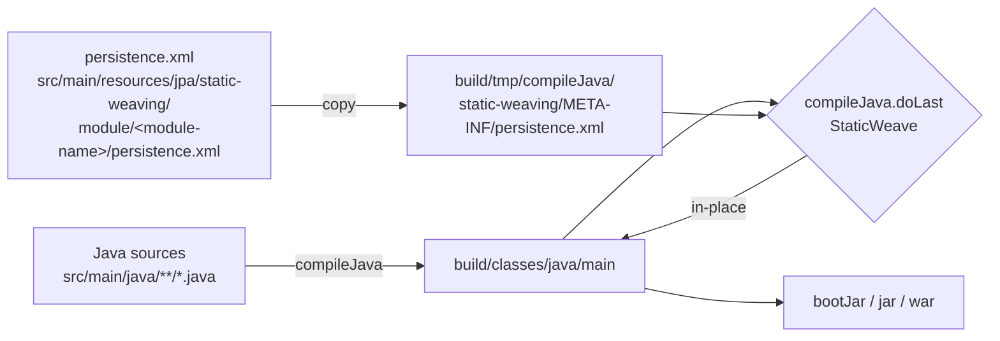
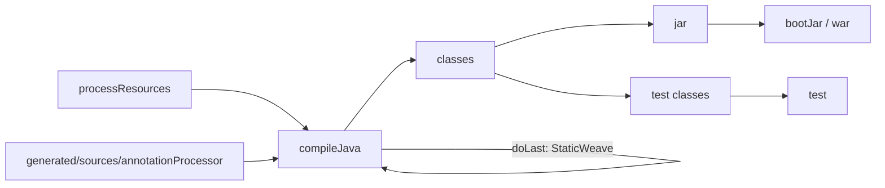

Apache Fineract uses **EclipseLink static weaving** to enhance its JPA entity classes at build time. Static weaving rewrites the compiled `.class` files of `@Entity` types to add change-tracking, lazy-loading, fetch-group, and persistence-unit hooks directly into the bytecode — work that would otherwise happen at application startup. Done at build time, it slashes cold-start latency, makes test runs cheaper, and removes the agent-based runtime weaving that otherwise has to be threaded through every test/build/deploy harness.

This page documents the single Gradle script that drives the process (`static-weaving.gradle`), how it discovers JPA-bearing modules through their per-module `persistence.xml`, and which Fineract subprojects currently opt in.

## Why static weaving?

EclipseLink (the JPA implementation Fineract uses, declared as a Spring Boot dependency-management override) supports three weaving modes:

| Mode | When it runs | How it is enabled |
| --- | --- | --- |
| **No weaving** | n/a | Some features (lazy `@OneToOne`, attribute change tracking, fetch groups) silently degrade. |
| **Dynamic weaving** | At runtime, during the first load of each entity class | EclipseLink installs a `ClassFileTransformer` via a Java agent or via Spring's `LoadTimeWeaver`. |
| **Static weaving** | At build time, after `compileJava`, before packaging | The `org.eclipse.persistence.tools.weaving.jpa.StaticWeave` tool walks the compiled classes directory and rewrites entity bytecode in place. |

Static weaving is the most operationally simple option:

- No Java agent on the JVM command line.
- No `LoadTimeWeaver` and no class-loader gymnastics.
- Identical bytecode in dev, CI, and production.
- Faster startup — every entity is already woven when the persistence unit is built.

The trade-off is that the build needs to know which modules contain JPA entities and where to find a `persistence.xml` that lists them. Fineract makes that opt-in explicit by requiring each module to ship its own descriptor under a well-known path.

## The script

The whole mechanism lives in one Groovy script at the repository root:

```text
/static-weaving.gradle
```

It is applied to **every** subproject from the root build:

```groovy
// build.gradle
subprojects { subproject ->
    apply from: rootProject.file('static-weaving.gradle')
}
```

The script defers everything to `project.afterEvaluate { ... }` so it can see whether the `java` plugin and a JPA descriptor are actually present, then conditionally hooks a `doLast` action onto `compileJava`:

```groovy
// static-weaving.gradle (full content)
project.afterEvaluate {
    // Only configure if this is a Java project
    if (!project.plugins.hasPlugin('java')) {
        logger.info("ℹ Skipping static weaving configuration for non-Java project: ${project.name}")
        return
    }

    // Check if the module contains JPA entities
    def persistenceXmlFile = file("src/main/resources/jpa/static-weaving/module/${project.name}/persistence.xml")
    def hasJpaEntities = persistenceXmlFile.exists()

    if (hasJpaEntities) {
        logger.info("Configuring EclipseLink static weaving for ${project.name}")

        compileJava.doLast {
            def source = sourceSets.main.java.classesDirectory.get()

            File weavingRoot = new File(temporaryDir, "static-weaving")
            File metaInf = new File(weavingRoot, "META-INF")
            metaInf.mkdirs()

            copy {
                from persistenceXmlFile.toPath()
                into metaInf.toPath()
                duplicatesStrategy = DuplicatesStrategy.EXCLUDE
            }

            javaexec {
                description = 'Performs EclipseLink static weaving of entity classes'
                mainClass.set("org.eclipse.persistence.tools.weaving.jpa.StaticWeave")
                classpath = project.sourceSets.main.runtimeClasspath
                args = [
                    "-persistenceinfo",
                    weavingRoot.absolutePath,
                    source,
                    source
                ]
            }
        }

        logger.info("✓ EclipseLink static weaving configured for ${project.name}")
    } else {
        logger.info("ℹ No JPA entities found in ${project.name}, skipping static weaving configuration")
    }
}
```

Three points worth highlighting:

1. **`afterEvaluate`** — guarantees the `java` plugin has been applied (the root build does that in `allprojects { … }`) and that any custom `sourceSets` configuration has settled before the script inspects `sourceSets.main`.
2. **Descriptor discovery** — the script does **not** scan code for `@Entity`. Opt-in is purely by the presence of `src/main/resources/jpa/static-weaving/module/<module-name>/persistence.xml`. That makes the decision explicit, fast, and reproducible.
3. **In-place weaving** — the `args` list `[..., source, source]` instructs `StaticWeave` to read from and write back to the same `build/classes/java/main` directory. There is no intermediate output; the original compiled classes are replaced by woven ones.

## What gets executed

When the script fires, it runs the EclipseLink `StaticWeave` CLI in a separate JVM with the module's own `runtimeClasspath`:

```bash
java -cp <runtimeClasspath> org.eclipse.persistence.tools.weaving.jpa.StaticWeave \
     -persistenceinfo <build/tmp/compileJava/static-weaving> \
     <build/classes/java/main> \
     <build/classes/java/main>
```

EclipseLink reads `META-INF/persistence.xml` from the directory passed via `-persistenceinfo`, resolves every entity class declared in that descriptor, loads the corresponding `.class` files from the source directory, applies its bytecode transformations, and writes the result to the destination directory. Because source and destination are the same, the result is a transparent transformation of the module's main classes directory.



## How a module opts in

The build automatically applies static weaving to a module the moment that module ships a descriptor at:

```text
<module>/src/main/resources/jpa/static-weaving/module/<module>/persistence.xml
```

The double `<module>` in the path is intentional — it means a generic JAR consumer never accidentally inherits Fineract's persistence unit, because the discriminator is the producing module's own name. A typical descriptor (per the EclipseLink format) looks like:

```xml
<persistence xmlns="https://jakarta.ee/xml/ns/persistence" version="3.0">
  <persistence-unit name="fineract-loan-static-weaving">
    <provider>org.eclipse.persistence.jpa.PersistenceProvider</provider>
    <exclude-unlisted-classes>true</exclude-unlisted-classes>
    <class>org.apache.fineract.portfolio.loanaccount.domain.Loan</class>
    <class>...every entity class belonging to the module...</class>
    <properties>
      <property name="eclipselink.weaving" value="static"/>
    </properties>
  </persistence-unit>
</persistence>
```

The descriptor's only job at build time is to enumerate the entity classes EclipseLink should rewrite; the descriptor used at runtime by Spring Boot is a separate one bundled by `fineract-provider`.

`STATIC_WEAVING.md` in the repo root summarises the contract for contributors adding a new domain module:

> 1. Add JPA entities to `src/main/java`.
> 2. Ensure there's a `persistence.xml` file in `src/main/resources/jpa/static-weaving/module/[module-name]/`.
> 3. The build will automatically detect and apply static weaving.

## Which modules apply it

Because `static-weaving.gradle` is applied to every subproject and acts only when the descriptor is present, the "list of modules that opt in" is effectively "every Java subproject that owns JPA entities". In Fineract that is the domain layer:

- `fineract-core`
- `fineract-security`
- `fineract-accounting`
- `fineract-branch`
- `fineract-document`
- `fineract-investor`
- `fineract-rates`
- `fineract-charge`
- `fineract-tax`
- `fineract-loan-origination`
- `fineract-loan`
- `fineract-savings`
- `fineract-report`
- `fineract-mix`
- `fineract-cob`
- `fineract-progressive-loan`
- `fineract-working-capital-loan`
- `fineract-command-jdbc` / `fineract-command-audit` (command-bus persistence)

Modules that contain **no JPA entities** see only the `ℹ No JPA entities found in <module>, skipping static weaving configuration` log line and incur no cost. Examples are:

- `fineract-validation`, `fineract-command`, `fineract-command-async`, `fineract-command-disruptor`, `fineract-command-test` — pure logic / utility modules.
- `fineract-client`, `fineract-client-feign` — generated client SDKs.
- `fineract-avro-schemas`, `fineract-doc` — schema and documentation only.
- `integration-tests`, `oauth2-tests`, `twofactor-tests`, `fineract-e2e-tests-core`, `fineract-e2e-tests-runner` — test harnesses that talk to a deployed server.
- `fineract-progressive-loan-embeddable-schedule-generator` — a calculator JAR with no entities.
- `fineract-war` — repackaging only.

`fineract-provider` itself does not need a `persistence.xml` for the weaver because all the woven entities arrive via the domain JARs it depends on; it owns its own runtime persistence-unit descriptor for Spring Boot.

## What weaving actually changes

EclipseLink's static weaver augments entity bytecode in several ways:

- **Attribute change tracking** — generates field-by-field change detection so the persistence context can flush only what actually changed.
- **Lazy `@OneToOne` and `@Basic(fetch = LAZY)`** — without weaving these silently fall back to eager fetching.
- **Fetch groups** — partial-entity fetch is impossible without woven indirection.
- **Internal `PersistenceWeaved*` markers** — let EclipseLink avoid re-weaving at runtime and detect missing weaving.

After running the script you can confirm the result by decompiling any entity in `build/classes/java/main` and seeing the synthetic `_persistence_*` fields and methods (`_persistence_listener`, `_persistence_primaryKey`, `_persistence_set`, etc.) that the weaver injects.

## Cache and incremental-build behaviour

Because the script hooks `compileJava.doLast`, the weaving step is **tied to Java compilation**:

- A clean compile triggers weaving exactly once.
- If sources are unchanged, Gradle's incremental compiler skips `compileJava` entirely and weaving is not re-run.
- The Gradle build cache (`org.gradle.caching=true` in `gradle.properties`) caches the compiled classes; cache hits also implicitly cache the woven classes, so a CI machine that pulls a `compileJava` cache entry pulls the already-woven bytecode.

If you ever need to force a rebuild — for instance when adding a new entity to an existing module — the surest path is:

```bash
./gradlew :fineract-loan:clean :fineract-loan:compileJava
```

## Working with weaved code in tests

Unit tests in the module that owns the entities compile against the woven classes through the standard `testRuntimeClasspath`, so the synthetic `_persistence_*` symbols are visible. The integration-test harnesses (`integration-tests`, `oauth2-tests`, `twofactor-tests`) do not weave anything themselves — they depend on the WAR / fat JAR that already contains the woven domain JARs.

## Troubleshooting

The single-file design makes failures easy to track down.

| Symptom | Likely cause | Fix |
| --- | --- | --- |
| Build log says "ℹ No JPA entities found in `<module>`" for a module that does have entities | The `persistence.xml` is at the wrong path or has a typo in the directory name. | Move it to `<module>/src/main/resources/jpa/static-weaving/module/<module>/persistence.xml`. |
| `org.eclipse.persistence.tools.weaving.jpa.StaticWeave` throws `ClassNotFoundException` | The descriptor references an entity FQN that does not exist or is not on `runtimeClasspath`. | Re-check the `<class>` list in `persistence.xml` against the actual package/class names. |
| `IllegalArgumentException: ... not an entity class` | The descriptor lists a regular POJO. | Add `@Entity` or drop the line from the descriptor. |
| Runtime startup logs `weaving disabled` | The application's runtime `persistence.xml` is missing `<property name="eclipselink.weaving" value="static"/>`. | Update the runtime descriptor, not the build-time one. |
| `LazyInitializationException`-like failures at runtime in fields that used to be lazy | The module was added but its descriptor is missing — only the *fields* are still lazy in the source, but the bytecode was never woven. | Add the descriptor and re-build. |

`STATIC_WEAVING.md` summarises the same checklist:

> 1. Check that the `persistence.xml` file exists in the correct location.
> 2. Verify that the output directories are being created correctly.
> 3. Check the build logs for any weaving-related errors.

## Interaction with other build steps

Static weaving sits **before** the artefact-assembly tasks. The plugin graph in a typical domain module is:



Because `doLast` runs as part of `compileJava`, downstream tasks (`classes`, `jar`, `bootJar`, `war`, `jib`, `test`) all consume the **already-woven** output without further configuration.

## Why not the EclipseLink Gradle plugin?

There are off-the-shelf community plugins that do the same job — Fineract avoids them deliberately:

- The bespoke script is **one file** under ASF licence, with no external maintainer to chase if it goes stale on a new JDK.
- The opt-in mechanism (a per-module `persistence.xml` at a fixed path) is auditable from a `git grep`.
- The classpath is whatever `sourceSets.main.runtimeClasspath` resolves to, so EclipseLink is always taken from the same BOM (`org.springframework.boot:spring-boot-dependencies:3.5.13`) that the runtime uses, ruling out version skew.

## Adding weaving to a brand-new module

When you create a fresh domain module — say `fineract-credit-bureau` — and want its `@Entity` classes to be statically woven, the checklist is short:

1. **Create the module**, add it to `settings.gradle`, and add the module name to `fineractJavaProjects` in the root `build.gradle` (so the root `subprojects { apply from: rootProject.file('static-weaving.gradle') }` block applies to it).
2. **Author entities** under `src/main/java/...`.
3. **Author a `persistence.xml`** at `src/main/resources/jpa/static-weaving/module/fineract-credit-bureau/persistence.xml`. Enumerate every entity class in `<class>...</class>` elements, set `<exclude-unlisted-classes>true</exclude-unlisted-classes>`, and include the `eclipselink.weaving=static` property.
4. **Run `./gradlew :fineract-credit-bureau:clean compileJava --info`** and confirm the log line `Configuring EclipseLink static weaving for fineract-credit-bureau` appears, followed by EclipseLink's `INFO: ... weaving ... <FQN>` messages.
5. **Wire the module into the runtime persistence unit** owned by `fineract-provider` so the woven classes are also picked up at startup.

The runtime persistence unit (used by Spring Boot through `LocalContainerEntityManagerFactoryBean`) is a separate descriptor from the build-time one — the build-time descriptor only ever lives in the producing module and is only ever read by the weaver.

## Verifying weaving on a working module

A quick sanity check after a clean build:

```bash
./gradlew :fineract-loan:clean :fineract-loan:compileJava --info | grep -i weav
```

You should see lines such as:

```text
Configuring EclipseLink static weaving for fineract-loan
✓ EclipseLink static weaving configured for fineract-loan
[EL Info]: weaver - ...domain.Loan
[EL Info]: weaver - ...domain.LoanRepaymentScheduleInstallment
...
```

Disassembling a woven class confirms the injected symbols:

```bash
javap -p build/classes/java/main/org/apache/fineract/portfolio/loanaccount/domain/Loan.class | head -40
# expect to see _persistence_*_vh, _persistence_set, _persistence_get, _persistence_listener fields/methods
```

## Build-time cost

EclipseLink's `StaticWeave` is forked into a fresh JVM via `javaexec { ... }` once per module that has a descriptor. For Fineract's domain JARs the cost is typically a few seconds per module on cold cache — well below the JVM warm-up cost of dynamic weaving every startup. With `org.gradle.parallel=true` and `org.gradle.caching=true` enabled in `gradle.properties`, weaving for unmodified modules is a cache hit and adds zero seconds to the build. CI runs benefit even more because the build cache shares cleanly across runners.

## Summary

Static weaving in Fineract is configured by **one Gradle script** (`static-weaving.gradle`), applied to **every** subproject, and **opted into** by dropping a `persistence.xml` at `src/main/resources/jpa/static-weaving/module/<module-name>/persistence.xml`. When that file is present, the build runs `org.eclipse.persistence.tools.weaving.jpa.StaticWeave` against the module's compiled classes directory as the last step of `compileJava`, in place. Domain modules like `fineract-loan`, `fineract-savings`, `fineract-accounting`, and `fineract-core` are the typical opt-ins; modules without entities (tests, clients, schemas, calculators) skip the step automatically. The result is faster Spring Boot startup, no Java agent on the runtime JVM, and one less knob to manage between dev, CI, and production.
