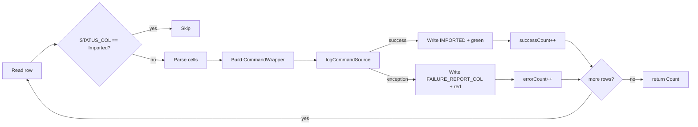

Apache Fineract treats every Excel upload as a *re-play* of the same commands a user would have typed into the regular REST API. The classes that do the replaying live in `fineract-provider/src/main/java/org/apache/fineract/infrastructure/bulkimport/importhandler/`. Each handler:

1. Looks up its sheet by name (e.g. `ClientPerson`, `Loans`, `AddJournalEntries`).
2. Iterates rows, skipping those whose `STATUS_COL` cell is already set to `IMPORTED`.
3. Reads the typed cell values into a portfolio DTO using a shared `ImportHandlerUtils`.
4. Builds a `CommandWrapper` via `CommandWrapperBuilder` and hands it to `PortfolioCommandSourceWritePlatformService.logCommandSource(...)`.
5. Writes the outcome (`IMPORTED` or the failure message) back into the row before moving on.

A common interface keeps all handlers swappable behind the same dispatcher:

```java
// fineract-provider/src/main/java/org/apache/fineract/infrastructure/bulkimport/importhandler/ImportHandler.java
package org.apache.fineract.infrastructure.bulkimport.importhandler;

import org.apache.fineract.infrastructure.bulkimport.data.Count;
import org.apache.poi.ss.usermodel.Workbook;

public interface ImportHandler {

    Count process(Workbook workbook, String locale, String dateFormat);
}
```

The return is a [`Count`](/bulkimport/overview#data-types) of successes and errors that is stamped onto the `ImportDocument` row.

## Catalogue

Every handler is `@Service`-registered, has package-private `readExcelFile` / `importEntity` methods, and is picked up from `BulkImportEventListener.onApplicationEvent(...)` based on the `GlobalEntityType` value carried on the published `BulkImportEvent`. The listener looks the bean up by name through `ApplicationContext.getBean("<handlerName>", ImportHandler.class)`:

| `GlobalEntityType`                | Handler class                                                                              | Sheet read                          |
| --------------------------------- | ------------------------------------------------------------------------------------------ | ----------------------------------- |
| `CLIENTS_PERSON` (`clients.person`)  | `importhandler/client/ClientPersonImportHandler.java`                                   | `ClientPerson`                      |
| `CLIENTS_ENTITY` (`clients.entity`)  | `importhandler/client/ClientEntityImportHandler.java`                                   | `ClientEntity`                      |
| `OFFICES` (`offices`)             | `importhandler/office/OfficeImportHandler.java`                                            | `Offices`                           |
| `STAFF` (`staff`)                 | `importhandler/staff/StaffImportHandler.java`                                              | `Staff`                             |
| `USERS` (`users`)                 | `importhandler/users/UserImportHandler.java`                                               | `Users`                             |
| `CENTERS` (`centers`)             | `importhandler/center/CenterImportHandler.java`                                            | `Centers`                           |
| `GROUPS` (`groups`)               | `importhandler/group/GroupImportHandler.java`                                              | `Groups`                            |
| `LOANS` (`loans`)                 | `importhandler/loan/LoanImportHandler.java`                                                | `Loans`                             |
| `LOAN_TRANSACTIONS` (`loantransactions`) | `importhandler/loanrepayment/LoanRepaymentImportHandler.java`                       | `LoanRepayment`                     |
| `GUARANTORS` (`guarantors`)       | `importhandler/guarantor/GuarantorImportHandler.java`                                      | `guarantor`                         |
| `SAVINGS_ACCOUNT` (`savingsaccount`) | `importhandler/savings/SavingsImportHandler.java`                                       | `SavingsAccounts`                   |
| `SAVINGS_TRANSACTIONS` (`savingstransactions`) | `importhandler/savings/SavingsTransactionImportHandler.java`                  | `SavingsTransaction`                |
| `FIXED_DEPOSIT_ACCOUNTS` (`fixeddepositaccounts`) | `importhandler/fixeddeposits/FixedDepositImportHandler.java`               | `FixedDeposit`                      |
| `FIXED_DEPOSIT_TRANSACTIONS` (`fixeddeposittransactions`) | `importhandler/fixeddeposits/FixedDepositTransactionImportHandler.java` | `FixedDepositTransactions` |
| `RECURRING_DEPOSIT_ACCOUNTS` (`recurringdeposits`) | `importhandler/recurringdeposit/RecurringDepositImportHandler.java`       | `RecurringDeposit`                  |
| `RECURRING_DEPOSIT_ACCOUNTS_TRANSACTIONS` (`recurringdepositstransactions`) | `importhandler/recurringdeposit/RecurringDepositTransactionImportHandler.java` | `SavingsTransaction` (shared sheet name) |
| `SHARE_ACCOUNTS` (`shareaccounts`) | `importhandler/sharedaccount/SharedAccountImportHandler.java`                             | `SharedAccounts`                    |
| `CHART_OF_ACCOUNTS` (`chartofaccounts`) | `importhandler/chartofaccounts/ChartOfAccountsImportHandler.java`                    | `ChartOfAccounts`                   |
| `GL_JOURNAL_ENTRIES` (`gljournalentries`) | `importhandler/journalentry/JournalEntriesImportHandler.java`                      | `AddJournalEntries`                 |

The sub-package `importhandler/helper/` holds Gson custom serializers that several handlers share when building the JSON command body — see [Helpers](#helpers).

## Anatomy of a handler

`ClientPersonImportHandler` is the canonical example. It extends `ImportHandler`, gets two collaborators wired by the constructor, then proceeds in two phases — read, then replay:

```java
// fineract-provider/src/main/java/org/apache/fineract/infrastructure/bulkimport/importhandler/client/ClientPersonImportHandler.java
@Service
@AllArgsConstructor
public class ClientPersonImportHandler implements ImportHandler {

    public static final String SEPARATOR = "-";
    private static final Logger LOG = LoggerFactory.getLogger(ClientPersonImportHandler.class);
    private final PortfolioCommandSourceWritePlatformService commandsSourceWritePlatformService;
    private final ExternalIdFactory externalIdFactory;

    @Override
    public Count process(final Workbook workbook, final String locale, final String dateFormat) {
        List<ClientData> clients = readExcelFile(workbook, locale, dateFormat);
        return importEntity(workbook, clients, dateFormat, locale);
    }

    public List<ClientData> readExcelFile(final Workbook workbook, final String locale, final String dateFormat) {
        List<ClientData> clients = new ArrayList<>();
        Sheet clientSheet = workbook.getSheet(TemplatePopulateImportConstants.CLIENT_PERSON_SHEET_NAME);
        Integer noOfEntries = ImportHandlerUtils.getNumberOfRows(clientSheet, 0);
        for (int rowIndex = 1; rowIndex <= noOfEntries; rowIndex++) {
            Row row = clientSheet.getRow(rowIndex);
            if (ImportHandlerUtils.isNotImported(row, ClientPersonConstants.STATUS_COL)) {
                clients.add(readClient(workbook, row, locale, dateFormat));
            }
        }
        return clients;
    }
    // ...
}
```

The `readClient` method below this (omitted here for brevity, see the source) reads each cell from the constants in `ClientPersonConstants`, looks up office/staff codes against the named-ranges that the populator left in `Extras`, validates the row, and builds a `ClientData` DTO.

The replay phase (`importEntity`) loops over the parsed DTOs and dispatches one command per row:

1. Serialise the DTO to JSON with a Gson instance that registers the date and external-id serializers from `importhandler/helper/`.
2. Build a `CommandWrapper` with `CommandWrapperBuilder().createClient().withJson(...)`.
3. Call `commandsSourceWritePlatformService.logCommandSource(commandRequest)`.
4. Catch any thrown `PlatformApiDataValidationException` / `RuntimeException`, write the failure message into the `FAILURE_REPORT_COL` cell, and increment the error counter.
5. On success, mark `STATUS_COL` as `IMPORTED` and increment the success counter.

`Count.instance(successCount, errorCount)` is the final return.

## Per-handler details

<CardGroup cols={2}>
  <Card title="ClientPersonImportHandler" icon="user">
    Reads the `ClientPerson` sheet. Dispatches `CommandWrapperBuilder.createClient()` per row. Allows multiple address rows, external ids generated via `ExternalIdFactory`.
  </Card>
  <Card title="ClientEntityImportHandler" icon="building">
    Reads the `ClientEntity` sheet for legal-entity (corporate) clients. Maps incorporation date and main business focus into the same client command pipeline.
  </Card>
  <Card title="OfficeImportHandler" icon="building-flag">
    Resolves the parent office by name from the `Extras` lookup sheet and emits `createOffice` commands. Captures opening date with the workbook's `dateFormat`.
  </Card>
  <Card title="StaffImportHandler" icon="user-tie">
    Builds `createStaff` commands. Joining-date and office assignment use `Extras` named ranges populated by `PersonnelSheetPopulator`.
  </Card>
  <Card title="UserImportHandler" icon="key">
    Reads roles from the `Roles` sheet (populated by `RoleSheetPopulator`) and posts `createUser` commands.
  </Card>
  <Card title="CenterImportHandler" icon="circle-nodes">
    Imports collection centers — uses the office lookup, posts `createCenter`, and optionally activates immediately if the active flag is set.
  </Card>
  <Card title="GroupImportHandler" icon="users">
    Reads the `Groups` sheet, resolves clients to attach by name, and emits `createGroup` commands.
  </Card>
  <Card title="LoanImportHandler" icon="hand-holding-dollar">
    The largest handler — reads loan product, charges, principal/term, repayment frequency, and emits `createLoan` per row. May also approve and disburse depending on the supplied status, sorting by `LoanComparatorByStatusActive`.
  </Card>
  <Card title="LoanRepaymentImportHandler" icon="money-bill-transfer">
    Reads the `LoanRepayment` sheet and emits `loanRepayment` transaction commands against existing loan ids.
  </Card>
  <Card title="GuarantorImportHandler" icon="handshake">
    Posts `createGuarantor` per row against the `guarantor` sheet, supports both customer and external guarantor types.
  </Card>
  <Card title="SavingsImportHandler" icon="piggy-bank">
    Reads the `SavingsAccounts` sheet, emits `submitSavingsAccount` and optionally `activateSavingsAccount` per row.
  </Card>
  <Card title="SavingsTransactionImportHandler" icon="arrow-right-arrow-left">
    Imports deposits and withdrawals against existing savings accounts. Uses the `SavingsAccountTransactionEnumValueSerialiser` helper to map the type column to the right transaction command.
  </Card>
  <Card title="FixedDepositImportHandler" icon="vault">
    Reads `FixedDeposit` sheet, posts `submitFixedDepositAccount` commands. Activation date and deposit period are picked from product templates.
  </Card>
  <Card title="FixedDepositTransactionImportHandler" icon="clock-rotate-left">
    Posts pre-mature closure / deposit / withdrawal commands against existing fixed deposit accounts.
  </Card>
  <Card title="RecurringDepositImportHandler" icon="calendar-day">
    Posts `submitRecurringDepositAccount` from the `RecurringDeposit` sheet.
  </Card>
  <Card title="RecurringDepositTransactionImportHandler" icon="rotate">
    Posts deposit / withdrawal commands against existing recurring deposit accounts.
  </Card>
  <Card title="SharedAccountImportHandler" icon="chart-pie">
    Reads `SharedAccounts`, emits `submitShareAccount` commands.
  </Card>
  <Card title="ChartOfAccountsImportHandler" icon="folder-tree">
    Reads `ChartOfAccounts`, posts `createGLAccount` commands respecting parent / account-type lookups.
  </Card>
  <Card title="JournalEntriesImportHandler" icon="book">
    Reads `AddJournalEntries` sheet — debits and credits across multiple rows that share a transaction date — and posts `createJournalEntry` commands batched per transaction.
  </Card>
</CardGroup>

## Status columns

Every entity-specific `*Constants.java` file declares two reserved columns:

```java
public static final int STATUS_COL = ...;            // written back: "Imported" / "Error"
public static final int FAILURE_REPORT_COL = ...;    // written back: human-readable error
```

`ImportHandlerUtils.isNotImported(row, STATUS_COL)` is what allows operators to **re-upload** a partially-imported workbook — rows already marked `Imported` are skipped on the second pass. The status text is also color-coded via `IndexedColors` so the output template highlights successes in green and failures in red.

## Helpers

`importhandler/helper/` carries a set of small Gson `JsonSerializer` adapters that the handlers reuse when assembling the command JSON body — they exist because portfolio commands historically expect *resource ids* in the JSON, not nested DTOs:

| Helper class                                  | Purpose                                                                                  |
| --------------------------------------------- | ---------------------------------------------------------------------------------------- |
| `DateSerializer.java`                         | Writes `LocalDate` values in the workbook's `dateFormat`.                                |
| `CurrencyDateCodeSerializer.java`             | Emits the currency code string for `CurrencyData`.                                       |
| `ClientIdSerializer.java`                     | Emits `client.id` when a full `ClientData` object is passed in.                          |
| `GroupIdSerializer.java`                      | Same idea for `GroupGeneralData`.                                                        |
| `CodeValueDataIdSerializer.java`              | Emits `id` for `CodeValueData` lookups (gender, language, …).                            |
| `EnumOptionDataIdSerializer.java`             | Emits the numeric id for `EnumOptionData`.                                               |
| `EnumOptionDataValueSerializer.java`          | Emits the `value` string for `EnumOptionData` (used by charges / loan term frequencies). |
| `SavingsAccountTransactionEnumValueSerialiser.java` | Translates the workbook transaction type cell into a savings-transaction command path. |

`ImportHandlerUtils` rounds out the toolkit with row-iteration, date-parsing, and cell-formatting helpers that are shared by every handler.

## Failure mode

When a row commits to a downstream command but the command throws — e.g. the office name in the row does not exist, or the loan principal is below the product minimum — the import handler wraps the call in a try/catch, extracts the user-friendly message, writes it into `FAILURE_REPORT_COL`, marks the row as failed, and proceeds to the next row. The end-of-run `Count` reflects the tally, and the operator can fix the offending rows in Excel and re-upload.



<Note>
The handlers use `PortfolioCommandSourceWritePlatformService.logCommandSource(...)`, not a direct service call. This means every imported row goes through the same maker-checker, audit, and idempotency machinery as a UI-driven create — including command sourcing into `m_portfolio_command_source` so the import is reproducible.
</Note>

## Adding a new handler

If you need to support a new entity type:

<Steps>
  <Step title="Extend GlobalEntityType">
    Add a constant in `fineract-core/.../GlobalEntityType.java` with a unique numeric id and string code.
  </Step>
  <Step title="Add column constants">
    Create `infrastructure/bulkimport/constants/<Entity>Constants.java` listing every cell index plus `STATUS_COL` and `FAILURE_REPORT_COL`.
  </Step>
  <Step title="Add a sheet name">
    Append the sheet constant to `TemplatePopulateImportConstants.java` so populator and handler agree.
  </Step>
  <Step title="Write the populator">
    Implement `WorkbookPopulator` in `populator/<entity>/` to seed dropdowns and the data sheet header.
  </Step>
  <Step title="Write the handler">
    Implement `ImportHandler` in `importhandler/<entity>/`. Read the sheet, build commands, replay through `PortfolioCommandSourceWritePlatformService`, write status columns.
  </Step>
  <Step title="Wire the dispatch">
    Extend the `if/else` chain in `BulkImportWorkbookPopulatorServiceImpl.getTemplate(...)` (download) and `BulkImportWorkbookServiceImpl.importWorkbook(...)` (upload string-to-enum resolution) for the new entity name, then add a `case <ENUM> -> applicationContext.getBean("<handlerBeanName>", ImportHandler.class)` branch to the `switch` in `BulkImportEventListener.onApplicationEvent(...)` so the listener can route the event to the new handler.
  </Step>
</Steps>

## Re-uploading a partial workbook

Because handlers always check `STATUS_COL` before they touch a row, the operator workflow for fixing a partially-broken import is:

<Steps>
  <Step title="Download the output workbook">
    `GET /v1/imports/downloadOutputTemplate?importDocumentId=...` returns the original upload annotated with `IMPORTED` / `ERROR` flags and per-row failure messages.
  </Step>
  <Step title="Fix the failing rows">
    Edit only the rows whose `STATUS_COL` is not `IMPORTED` — the others will be skipped on the re-upload.
  </Step>
  <Step title="Clear the failure column">
    Wipe the `FAILURE_REPORT_COL` for the rows you fixed so the next run will overwrite it cleanly.
  </Step>
  <Step title="Re-upload via the entity endpoint">
    `POST /v1/clients/uploadtemplate` (or the matching entity-specific endpoint). The handler re-runs `process(...)`, skips the already-imported rows via `ImportHandlerUtils.isNotImported(row, STATUS_COL)`, and only attempts the fixed rows.
  </Step>
  <Step title="Verify the new totals">
    `GET /v1/imports?entityType=clients.person` returns the updated success / error counts on the same `importDocumentId`.
  </Step>
</Steps>

## Concurrency considerations

<Note>
Handlers run **single-threaded** per `BulkImportEvent`. `BulkImportEventListener` implements `ApplicationListener<BulkImportEvent>`, and Spring's default `SimpleApplicationEventMulticaster` dispatches events synchronously on the publishing thread — there is no `@Async` or `TaskExecutor` configured in the bulk-import package. As a result the original HTTP upload thread runs the handler to completion before responding. Rows within one workbook are processed sequentially, which matters when one row depends on another (a client referenced as a co-borrower must be created before the loan row that references them) — the operator must order rows accordingly.
</Note>

Two practical implications:

- Cross-row references inside a workbook resolve by **name lookup** at handler time, not row index. The `ClientPersonImportHandler` matches `Office Name` against the live offices read from the database, not against the office sheet inside the workbook.
- Because handlers go through `PortfolioCommandSourceWritePlatformService.logCommandSource(...)`, every successful row spawns a row in `m_portfolio_command_source` with a unique idempotency key. Replaying the same workbook twice does not duplicate clients — the second run's commands deduplicate against the audit table.

## Performance notes

For very large workbooks, a few common patterns help:

- Pre-populate any auxiliary `Extras` data once and reuse across uploads — the populator service already paginates client and staff lookups via `SearchParameters`.
- Split a workbook by office and process the chunks as separate concurrent uploads from different HTTP clients; because each upload runs synchronously on its own HTTP thread, parallelism comes from issuing multiple uploads in parallel rather than from any internal queue.
- Use `external_id` columns where available so re-uploads after a database refresh stay idempotent.

## See also

<CardGroup cols={2}>
  <Card title="Bulk import overview" href="/bulkimport/overview">
    End-to-end flow, REST resource, and `GlobalEntityType` registry.
  </Card>
  <Card title="Workbook populators" href="/bulkimport/populators">
    The other half of the picture — building the template Excel file with dropdowns.
  </Card>
</CardGroup>

<Tip>
When you re-implement an existing handler with custom business logic, keep the same Spring bean name as the stock handler — the dispatch in `BulkImportEventListener` uses `applicationContext.getBean("loanImportHandler", ImportHandler.class)` (and equivalents), so swapping the implementation behind the same bean name is the cleanest extension point. Avoid `@Primary` here: the listener looks up by *name*, not by type, so `@Primary` on a differently-named bean does not redirect the dispatch.
</Tip>
