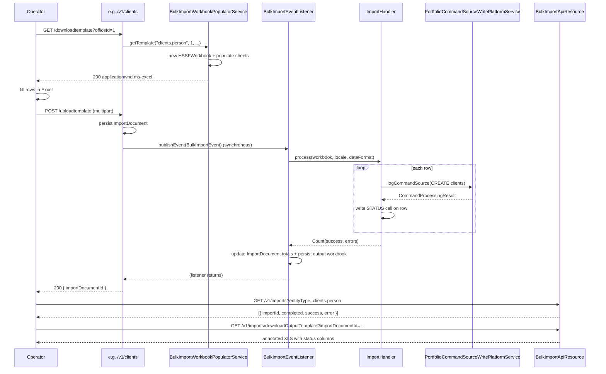

Apache Fineract supports onboarding large amounts of reference data through **Excel workbooks**. Operators download a populated `.xls` template for the entity they care about (clients, loans, journal entries, …), fill in the data rows, upload the file back, and the platform replays the rows as if a user had typed them through the regular REST API. The end-to-end machinery lives under `fineract-provider/src/main/java/org/apache/fineract/infrastructure/bulkimport/` and the `GlobalEntityType` registry sits in `fineract-core`.

The package splits cleanly into four pieces:

- **Workbook populators** generate the downloadable template — they pre-fill office, staff, currency, and product dropdowns so the operator picks from valid values.
- **Import handlers** consume an uploaded workbook, parse the rows back into command objects, and replay them via `PortfolioCommandSourceWritePlatformService`.
- The **`BulkImportApiResource`** REST resource exposes `GET /v1/imports?entityType=<code>` to list previous imports and a download endpoint for the annotated output workbook of a previous import.
- An **import document** is tracked in the database (`ImportDocument` + `ImportDocumentRepository`) so each upload has an audit row with success / error counts.

<Note>
Two query-string spellings exist side-by-side and matter when reading the code. `GET /v1/imports?entityType=...` expects the **lowercase code** (e.g. `loans`, `clients.person`) because `BulkImportApiResource` resolves it through `GlobalEntityType.fromCode(...)`. The download- and upload-template endpoints on the entity resources (e.g. `LoansApiResource`) pass `GlobalEntityType.LOANS.toString()`, which returns the **enum name** (e.g. `LOANS`, `CLIENTS_PERSON`) — `GlobalEntityType.toString()` is overridden to return `name()`. The dispatch chain inside `BulkImportWorkbookServiceImpl` and `BulkImportWorkbookPopulatorServiceImpl` therefore compares against the uppercase enum name, not the lowercase code.
</Note>

## Package layout

```text
fineract-provider/src/main/java/org/apache/fineract/infrastructure/bulkimport/
├── api/
│   └── BulkImportApiResource.java         ← /v1/imports
├── constants/                             ← column-index constants per sheet
│   ├── ClientPersonConstants.java
│   ├── ClientEntityConstants.java
│   ├── LoanConstants.java
│   ├── OfficeConstants.java
│   ├── StaffConstants.java
│   ├── TemplatePopulateImportConstants.java  ← sheet names, widths, common cells
│   └── ...
├── data/
│   ├── BulkImportEvent.java               ← Spring event for async dispatch
│   ├── Count.java                         ← success / error counts
│   └── ImportFormatType.java              ← XLS / XLSX / ODS
├── domain/
│   ├── ImportDocument.java                ← @Entity m_import_document
│   └── ImportDocumentRepository.java
├── exceptions/
│   └── ImportTypeNotFoundException.java
├── importhandler/                         ← parse + replay handlers (per entity)
│   ├── ImportHandler.java                 ← interface
│   ├── ImportHandlerUtils.java
│   ├── client/, loan/, office/, staff/, ...
│   └── helper/                            ← Gson serializers shared by handlers
├── mapping/                               ← Excel ↔ JSON column mapping helpers
├── populator/                             ← generate downloadable templates
│   ├── WorkbookPopulator.java             ← interface
│   ├── AbstractWorkbookPopulator.java     ← cell write helpers
│   ├── client/, loan/, office/, staff/, ...
│   └── comparator/LoanComparatorByStatusActive.java
└── service/
    ├── BulkImportWorkbookPopulatorServiceImpl.java
    ├── BulkImportWorkbookServiceImpl.java
    └── BulkImportEventListener.java       ← async @EventListener consumer
```

The supporting `GlobalEntityType` enum that decides *which* populator and handler to pick lives in `fineract-core/src/main/java/org/apache/fineract/infrastructure/bulkimport/data/GlobalEntityType.java`.

## Supported entity types

`GlobalEntityType` enumerates every importable type. Each value carries an integer id and a string code; `BulkImportApiResource` matches on the code via `?entityType=<code>`.

```java
public enum GlobalEntityType {

    INVALID(0, "invalid"),
    CLIENTS_PERSON(1, "clients.person"),
    CLIENTS_ENTITY(2, "clients.entity"),
    GROUPS(3, "groups"),
    CENTERS(4, "centers"),
    OFFICES(5, "offices"),
    STAFF(6, "staff"),
    USERS(7, "users"),
    SMS(8, "sms"),
    DOCUMENTS(9, "documents"),
    TEMPLATES(10, "templates"),
    NOTES(11, "templates"),
    CALENDAR(12, "calendar"),
    MEETINGS(13, "meetings"),
    HOLIDAYS(14, "holidays"),
    LOANS(15, "loans"),
    LOAN_PRODUCTS(16, "loancharges"),
    LOAN_TRANSACTIONS(18, "loantransactions"),
    GUARANTORS(19, "guarantors"),
    COLLATERALS(20, "collaterals"),
    FUNDS(21, "funds"),
    CURRENCY(22, "currencies"),
    SAVINGS_ACCOUNT(23, "savingsaccount"),
    SAVINGS_CHARGES(24, "savingscharges"),
    SAVINGS_TRANSACTIONS(25, "savingstransactions"),
    SAVINGS_PRODUCTS(26, "savingsproducts"),
    GL_JOURNAL_ENTRIES(27, "gljournalentries"),
    CODE_VALUE(28, "codevalue"),
    CODE(29, "code"),
    CHART_OF_ACCOUNTS(30, "chartofaccounts"),
    FIXED_DEPOSIT_ACCOUNTS(31, "fixeddepositaccounts"),
    FIXED_DEPOSIT_TRANSACTIONS(32, "fixeddeposittransactions"),
    SHARE_ACCOUNTS(33, "shareaccounts"),
    RECURRING_DEPOSIT_ACCOUNTS(34, "recurringdeposits"),
    RECURRING_DEPOSIT_ACCOUNTS_TRANSACTIONS(35, "recurringdepositstransactions"),
    CLIENT(36, "client");
    // ...
}
```

The codes used over the wire are exactly the string column above. Not every value has a populator and handler — `CALENDAR`, `MEETINGS`, `NOTES`, `FUNDS`, `CURRENCY`, `CODE`, `CODE_VALUE`, `DOCUMENTS`, `COLLATERALS`, `LOAN_PRODUCTS`, `SAVINGS_CHARGES`, `SAVINGS_PRODUCTS`, `TEMPLATES`, and `SMS` are reserved slots that have no populator / handler wired today. Note also that `NOTES(11, "templates")` and `TEMPLATES(10, "templates")` share the same code string, so `fromCode("templates")` returns whichever value ended up in the lookup map last. The entity types that **do** have a sheet populator and an import handler today are:

<CardGroup cols={2}>
  <Card title="Organisation" icon="building">
    `offices`, `staff`, `users`, `chartofaccounts`
  </Card>
  <Card title="Portfolio" icon="folder-tree">
    `clients.person`, `clients.entity`, `groups`, `centers`, `loans`, `loantransactions`, `guarantors`
  </Card>
  <Card title="Savings products" icon="piggy-bank">
    `savingsaccount`, `savingstransactions`, `fixeddepositaccounts`, `fixeddeposittransactions`, `recurringdeposits`, `recurringdepositstransactions`, `shareaccounts`
  </Card>
  <Card title="Accounting" icon="calculator">
    `gljournalentries`
  </Card>
</CardGroup>

The download / upload dispatch in `BulkImportWorkbookPopulatorServiceImpl.getTemplate(...)` and `BulkImportWorkbookServiceImpl.importWorkbook(...)` is a long `if (entityType.equalsIgnoreCase(GlobalEntityType.X.toString()))` chain — `importWorkbook` only translates the entity-name string into a `GlobalEntityType` enum value and then publishes a `BulkImportEvent`. The actual handler selection happens in `BulkImportEventListener` via a `switch` expression on the enum. See [Import handlers](/bulkimport/import-handlers) and [Populators](/bulkimport/populators) for the per-entity classes.

## The REST resource

`fineract-provider/src/main/java/org/apache/fineract/infrastructure/bulkimport/api/BulkImportApiResource.java` exposes the user-facing endpoints at `/v1/imports`:

| Method | Path                                                  | Purpose                                                                |
| ------ | ----------------------------------------------------- | ---------------------------------------------------------------------- |
| `GET`  | `/v1/imports?entityType=<code>`                       | List previous import documents for the entity type, including `Count`. |
| `GET`  | `/v1/imports/getOutputTemplateLocation?importDocumentId=...` | Return the stored S3/disk location of a previous upload's annotated output workbook. |
| `GET`  | `/v1/imports/downloadOutputTemplate?importDocumentId=...`    | Stream the annotated output workbook back to the caller (XLS). |

The `retrieveImportDocuments` method handles the `clients.person` / `clients.entity` quirk — the `?entityType=client` short-code collects both sub-types in a single call:

```java
@GET
@Produces({ MediaType.APPLICATION_JSON })
public String retrieveImportDocuments(@Context final UriInfo uriInfo, @QueryParam("entityType") final String entityType) {
    Collection<ImportData> importData = new ArrayList<>();

    if (entityType.equals(GlobalEntityType.CLIENT.getCode())) {
        final var importForClientEntity = this.bulkImportWorkbookService.getImports(GlobalEntityType.CLIENTS_ENTITY);
        final var importForClientPerson = this.bulkImportWorkbookService.getImports(GlobalEntityType.CLIENTS_PERSON);

        if (importForClientEntity != null) {
            importData.addAll(importForClientEntity);
        }

        if (importForClientPerson != null) {
            importData.addAll(importForClientPerson);
        }
    } else {
        final GlobalEntityType type = GlobalEntityType.fromCode(entityType);

        if (type == null) {
            throw new ImportTypeNotFoundException(entityType);
        }

        importData = this.bulkImportWorkbookService.getImports(type);
    }
    // ...
}
```

<Note>
This REST resource only **downloads previous output workbooks and lists imports**. The actual upload + download-of-template endpoints live on the individual entity resources — for example `POST /v1/clients/uploadtemplate`, `GET /v1/clients/downloadtemplate`, `GET /v1/loans/downloadtemplate`. Each of those endpoints delegates to `BulkImportWorkbookService.importWorkbook` and `BulkImportWorkbookPopulatorService.getTemplate` respectively.
</Note>

## Output template streaming

`getOutputTemplate` retrieves the document attached to a previous import, then re-streams it as `application/vnd.ms-excel`. The annotated output workbook is the original upload plus per-row status cells that the import handler wrote during processing:

```java
@GET
@Path("downloadOutputTemplate")
@Produces("application/vnd.ms-excel")
public Response getOutputTemplate(@QueryParam("importDocumentId") final Long importDocumentId) {
    final var importData = bulkImportWorkbookService.getImport(importDocumentId);
    if (importData == null) {
        throw new DocumentNotFoundException("IMPORT", importDocumentId, -1L);
    }
    final var doc = documentReadPlatformService.retrieveDocument(importData.getDocumentId());
    if (doc == null) {
        throw new DocumentNotFoundException("IMPORT", importDocumentId, importData.getDocumentId());
    }
    final var content = documentReadPlatformService.retrieveDocumentContent(doc.getParentEntityType(), doc.getParentEntityId(),
            doc.getId());
    final var streamResponseData = StreamResponseUtil.StreamResponseData.builder().type(content.getContentType())
            .fileName(content.getFileName()).stream(content.getStream()).dispositionType(DISPOSITION_TYPE_ATTACHMENT).build();

    return StreamResponseUtil.ok(streamResponseData);
}
```

## The end-to-end lifecycle



## Data types

The handful of small DTOs that all of the populators and handlers share are worth knowing:

```java
// fineract-provider/src/main/java/org/apache/fineract/infrastructure/bulkimport/data/Count.java
public final class Count {
    private Integer successCount;
    private Integer errorCount;

    public static Count instance(final Integer successCount, final Integer errorCount) {
        return new Count(successCount, errorCount);
    }
    // getters ...
}
```

`Count` is the return value of every `ImportHandler.process(...)` call and gets persisted onto the `ImportDocument` row so the operator can see how many records imported cleanly.

```java
// fineract-provider/src/main/java/org/apache/fineract/infrastructure/bulkimport/data/ImportFormatType.java
public enum ImportFormatType {
    XLSX("application/vnd.openxmlformats-officedocument.spreadsheetml.sheet"),
    XLS("application/vnd.ms-excel"),
    ODS("application/vnd.oasis.opendocument.spreadsheet");

    public static ImportFormatType of(String name) {
        for (ImportFormatType type : ImportFormatType.values()) {
            if (type.name().equalsIgnoreCase(name)) {
                return type;
            }
        }
        throw new GeneralPlatformDomainRuleException("error.msg.invalid.file.extension", "Uploaded file extension is not recognized.");
    }
}
```

The populator service always writes `HSSFWorkbook` (`.xls`), and the upload side currently restricts itself to the same format too. `BulkImportWorkbookServiceImpl.importWorkbook(...)` uses Apache Tika to detect the file type and rejects anything whose detected type does not contain `msoffice` or `application/vnd.ms-excel`, then constructs an `HSSFWorkbook` from the bytes. `ImportFormatType` is declared but not currently referenced from the upload pipeline, so XLSX / ODS uploads are not accepted today — re-save the template back to `.xls` before uploading.

## Sheet naming convention

Sheet names are defined as constants in `TemplatePopulateImportConstants` so populators and handlers agree:

```java
public static final String OFFICE_SHEET_NAME = "Offices";
public static final String CENTER_SHEET_NAME = "Centers";
public static final String STAFF_SHEET_NAME = "Staff";
public static final String GROUP_SHEET_NAME = "Groups";
public static final String CHARGE_SHEET_NAME = "Charges";
public static final String CHART_OF_ACCOUNTS_SHEET_NAME = "ChartOfAccounts";
public static final String CLIENT_ENTITY_SHEET_NAME = "ClientEntity";
public static final String CLIENT_PERSON_SHEET_NAME = "ClientPerson";
public static final String CLIENT_SHEET_NAME = "Clients";
public static final String FIXED_DEPOSIT_SHEET_NAME = "FixedDeposit";
public static final String FIXED_DEPOSIT_TRANSACTION_SHEET_NAME = "FixedDepositTransactions";
public static final String PRODUCT_SHEET_NAME = "Products";
public static final String GUARANTOR_SHEET_NAME = "guarantor";
public static final String EXTRAS_SHEET_NAME = "Extras";
public static final String GL_ACCOUNTS_SHEET_NAME = "GlAccounts";
public static final String SAVINGS_ACCOUNTS_SHEET_NAME = "SavingsAccounts";
public static final String SHARED_PRODUCTS_SHEET_NAME = "SharedProducts";
public static final String JOURNAL_ENTRY_SHEET_NAME = "AddJournalEntries";
public static final String LOANS_SHEET_NAME = "Loans";
public static final String LOAN_REPAYMENT_SHEET_NAME = "LoanRepayment";
public static final String RECURRING_DEPOSIT_SHEET_NAME = "RecurringDeposit";
public static final String SAVINGS_TRANSACTION_SHEET_NAME = "SavingsTransaction";
public static final String SHARED_ACCOUNTS_SHEET_NAME = "SharedAccounts";
public static final String EMPLOYEE_SHEET_NAME = "Employee";
public static final String ROLES_SHEET_NAME = "Roles";
public static final String USER_SHEET_NAME = "Users";
```

A workbook for `clients.person` actually contains *multiple* sheets — the main `ClientPerson` data sheet plus auxiliary sheets like `Offices`, `Staff`, and `Extras` that the populator uses as named-range lookup sources for dropdowns. The import handler ignores those auxiliary sheets and only iterates rows of the main sheet.

## Column conventions

Each entity has a per-column constants file in `constants/`. Example from `ClientPersonConstants.java`:

- `FIRST_NAME_COL`, `LAST_NAME_COL`, `MIDDLE_NAME_COL`, `OFFICE_NAME_COL`, `STAFF_NAME_COL`, ...
- `STATUS_COL` — written back by the import handler with `IMPORTED` / `ERROR`
- `FAILURE_REPORT_COL` — populated with the rejection message when a row fails

The `ImportHandlerUtils` utility class reads cells via `getCellValueAsString`, normalises Excel date numbers, and exposes `isNotImported(row, STATUS_COL)` so handlers skip rows that were already processed in a previous run.

## Errors and rejections

When a row fails — bad office name, missing currency, validation rejection from a downstream command handler — the import handler **catches** the exception, writes the message into the `FAILURE_REPORT_COL` cell, increments the error count, and continues. Only the *file* upload itself can fail outright; row-level errors are reported via the output template.

The platform-level error for an unknown entity type is `ImportTypeNotFoundException` in `bulkimport/exceptions/`, which is mapped to HTTP 400.

## Event-driven processing

`BulkImportEventListener` implements `ApplicationListener<BulkImportEvent>` (in `service/BulkImportEventListener.java`); the entity resource calls `BulkImportWorkbookServiceImpl.publishEvent(...)` after persisting the workbook bytes, which fires a `BulkImportEvent` through `ApplicationContext.publishEvent(...)`. The listener resolves the right `ImportHandler` bean by `GlobalEntityType` via a `switch` expression — for example `case LOANS -> applicationContext.getBean("loanImportHandler", ImportHandler.class)` — and invokes `process(workbook, locale, dateFormat)`. Once the handler returns its `Count`, the listener updates the `ImportDocument` totals and persists the annotated output workbook through `DocumentWritePlatformService`.

<Note>
Spring's default `ApplicationEventMulticaster` dispatches events **synchronously** on the publishing thread, and the bulk-import package does not configure `@Async` or a custom multicaster. As a result, `POST /v1/<entity>/uploadtemplate` blocks the HTTP thread until every row has been processed and the output workbook has been written. Tune client / proxy timeouts accordingly for very large uploads — there is no background queue here.
</Note>

<Tip>
Because every row goes through `PortfolioCommandSourceWritePlatformService.logCommandSource(...)`, each imported row gets its own command audit trail in `m_portfolio_command_source`. Bulk import is therefore fully reproducible — replaying the same command stream from the audit table produces the same end state.
</Tip>

## Where to go next

<CardGroup cols={2}>
  <Card title="Import handlers" href="/bulkimport/import-handlers">
    Per-entity classes that parse Excel rows and replay them as portfolio commands. Includes a full handler / entity-type table.
  </Card>
  <Card title="Workbook populators" href="/bulkimport/populators">
    Per-entity classes that build the downloadable template with named-range dropdowns and validation.
  </Card>
</CardGroup>
