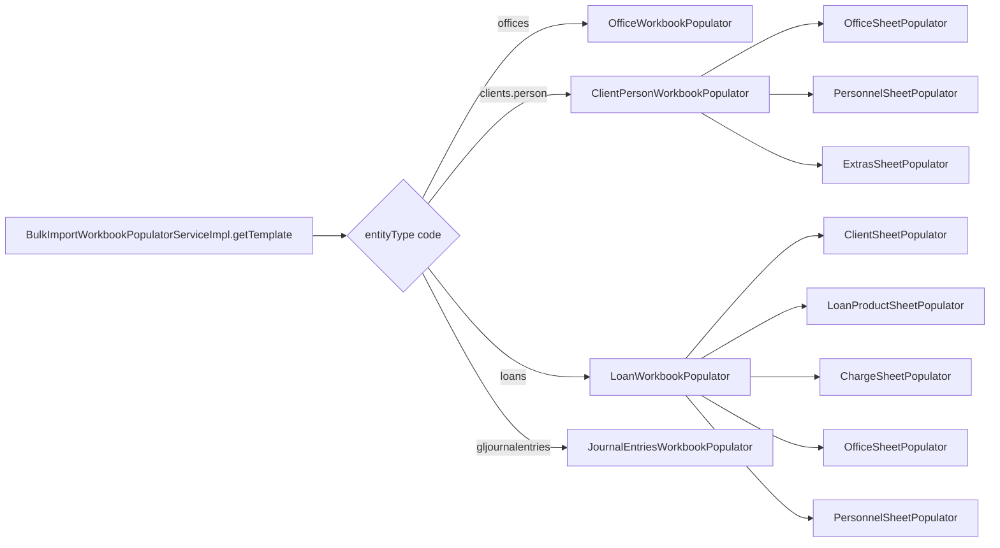
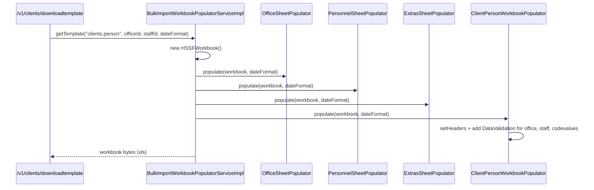

The other half of the Apache Fineract bulk import story is the **populators** — classes that build the Excel workbook an operator downloads before filling in rows. Every populator lives under `fineract-provider/src/main/java/org/apache/fineract/infrastructure/bulkimport/populator/`. They share a single interface, write to an Apache POI `Workbook`, and wire dropdowns to *named ranges* of valid values pulled from the live database — so an operator typing into a `Loans` workbook can only pick offices and clients that actually exist.

## The interface

```java
// fineract-provider/src/main/java/org/apache/fineract/infrastructure/bulkimport/populator/WorkbookPopulator.java
package org.apache.fineract.infrastructure.bulkimport.populator;

import org.apache.poi.ss.usermodel.Workbook;

public interface WorkbookPopulator {

    void populate(Workbook workbook, String dateFormat);
}
```

`BulkImportWorkbookPopulatorServiceImpl.getTemplate(entityType, officeId, staffId, dateFormat)` looks up the right populator based on `GlobalEntityType.toString()` (one big `if`/`else` chain), constructs a fresh `HSSFWorkbook`, hands it to `populate(...)`, and streams the bytes back as `application/vnd.ms-excel`.

## Two-layer split

Populators are grouped into two categories — and that distinction matters when reading the code:

<CardGroup cols={2}>
  <Card title="Top-level reference sheet populators" icon="layer-group">
    Build auxiliary lookup sheets (`Offices`, `Staff`, `Charges`, `Products`, `Extras`) that other populators reference via named ranges. They live directly under `populator/`.
  </Card>
  <Card title="Per-entity workbook populators" icon="file-excel">
    Build the main data sheet for a specific entity (e.g. `LoanWorkbookPopulator` → `Loans` sheet). They live in `populator/<entity>/` sub-packages and orchestrate the top-level populators they need.
  </Card>
</CardGroup>

A `LoanWorkbookPopulator.populate(...)` call internally invokes `ClientSheetPopulator`, `LoanProductSheetPopulator`, `OfficeSheetPopulator`, `PersonnelSheetPopulator`, `FundSheetPopulator`-style helpers, and `ChargeSheetPopulator` so that the resulting workbook has a usable set of dropdown sources.

## The abstract base

`AbstractWorkbookPopulator` (in `populator/AbstractWorkbookPopulator.java`) exposes cell-write primitives and a regex used to scrub names that would break Excel named ranges:

```java
public abstract class AbstractWorkbookPopulator implements WorkbookPopulator {

    private static final Logger LOG = LoggerFactory.getLogger(AbstractWorkbookPopulator.class);
    private static final Pattern NAME_REGEX = Pattern.compile("[ @#&()<>,;.:$£€§°\\\\/=!\\?\\-\\+\\*\"\\[\\]]");

    protected void writeInt(int colIndex, Row row, int value) {
        row.createCell(colIndex).setCellValue(value);
    }

    protected void writeLong(int colIndex, Row row, long value) {
        row.createCell(colIndex).setCellValue((double) value);
    }

    protected void writeString(int colIndex, Row row, String value) {
        row.createCell(colIndex).setCellValue(value);
    }

    protected void writeBoolean(int colIndex, Row row, Boolean value) {
        row.createCell(colIndex).setCellValue(value);
    }

    protected void writeDouble(int colIndex, Row row, double value) {
        row.createCell(colIndex).setCellValue(value);
    }

    protected void writeFormula(int colIndex, Row row, String formula) {
        row.createCell(colIndex).setCellFormula(formula);
    }

    protected void writeDate(int colIndex, Row row, String value, CellStyle dateCellStyle, String dateFormat) {
        // parse three accepted date layouts and write as a proper Excel date cell
    }
}
```

The date branch accepts `yyyy-M-d`, `d/M/yyyy`, and `d MMMM yyyy` and writes a proper typed date cell so downstream Excel formulas treat it correctly. The `NAME_REGEX` is used by subclass populators to sanitise names like `"Head Office (HQ)"` into `Head_Office_HQ` before they are used as defined-name identifiers (Excel does not allow spaces or punctuation in named ranges).

## Reference populators

These build the auxiliary sheets — they exist so the per-entity populators have something to point their dropdowns at:

| Populator                                                  | Sheet (`TemplatePopulateImportConstants` constant)       | Purpose                                                                                            |
| ---------------------------------------------------------- | -------------------------------------------------------- | -------------------------------------------------------------------------------------------------- |
| `populator/OfficeSheetPopulator.java`                      | `Offices` (`OFFICE_SHEET_NAME`)                          | Lists all offices for the office dropdown; provides `OfficeNameToOfficeId` lookup helper.          |
| `populator/PersonnelSheetPopulator.java`                   | `Staff`  (`STAFF_SHEET_NAME`)                            | Lists staff per office for the loan-officer dropdown.                                              |
| `populator/ClientSheetPopulator.java`                      | `Clients` (`CLIENT_SHEET_NAME`)                          | Lists clients per office, used by loans / savings / shares.                                        |
| `populator/CenterSheetPopulator.java`                      | `Centers` (`CENTER_SHEET_NAME`)                          | Lists centers per office, used by group / center workflows.                                        |
| `populator/GroupSheetPopulator.java`                       | `Groups` (`GROUP_SHEET_NAME`)                            | Lists groups per office, used by group loans / savings.                                            |
| `populator/ChargeSheetPopulator.java`                      | `Charges` (`CHARGE_SHEET_NAME`)                          | Lists product charges by currency.                                                                 |
| `populator/LoanProductSheetPopulator.java`                 | `Products` (`PRODUCT_SHEET_NAME`)                        | Loan products plus their parameter defaults (term frequencies, interest method, …).                |
| `populator/SavingsProductSheetPopulator.java`              | `Products`                                               | Savings products (overlays the same sheet name in savings workbooks).                              |
| `populator/SavingsAccountSheetPopulator.java`              | `SavingsAccounts` (`SAVINGS_ACCOUNTS_SHEET_NAME`)        | Existing savings accounts — used as lookup source for savings-transaction imports.                 |
| `populator/FixedDepositProductSheetPopulator.java`         | `Products`                                               | Fixed deposit products with default term and interest.                                             |
| `populator/RecurringDepositProductSheetPopulator.java`     | `Products`                                               | Recurring deposit products.                                                                        |
| `populator/SharedProductsSheetPopulator.java`              | `SharedProducts` (`SHARED_PRODUCTS_SHEET_NAME`)          | Share products with par value, lock-in period, etc.                                                |
| `populator/GlAccountSheetPopulator.java`                   | `GlAccounts` (`GL_ACCOUNTS_SHEET_NAME`)                  | Active GL accounts grouped by classification for journal entry / chart of accounts imports.        |
| `populator/RoleSheetPopulator.java`                        | `Roles` (`ROLES_SHEET_NAME`)                             | User roles for the user import dropdown.                                                           |
| `populator/ExtrasSheetPopulator.java`                      | `Extras` (`EXTRAS_SHEET_NAME`)                           | Currencies, funds, payment types — anything that does not warrant a dedicated sheet.               |
| `populator/comparator/LoanComparatorByStatusActive.java`   | n/a                                                      | `Comparator<LoanAccountData>` used by the loan populator to sort loans so active rows appear first. |

These populators implement `populate(...)` but are usually not called from the dispatch chain directly — they are nested inside the per-entity populators below. They also expose helper methods (e.g. `OfficeSheetPopulator.getOfficeNameToBeginEndIndexesOfStaff()`) that the per-entity populators consume to build cross-sheet `OFFSET(...)` dropdown formulas.

## Per-entity workbook populators

These are the populators the dispatch chain picks based on the requested `GlobalEntityType`. Each produces a workbook with one **main data sheet** plus the reference sheets it needs:

<CardGroup cols={2}>
  <Card title="ClientPersonWorkbookPopulator" icon="user">
    `populator/client/ClientPersonWorkbookPopulator.java` — `ClientPerson` sheet. Bundles `OfficeSheetPopulator`, `PersonnelSheetPopulator`, plus `Extras` for code values (gender, language, marital status). Header row matches `ClientPersonConstants.*`.
  </Card>
  <Card title="ClientEntityWorkbookPopulator" icon="building">
    `populator/client/ClientEntityWorkbookPopulator.java` — `ClientEntity` sheet. Corporate-client variant with incorporation date and business-focus dropdown.
  </Card>
  <Card title="OfficeWorkbookPopulator" icon="building-flag">
    `populator/office/OfficeWorkbookPopulator.java` — `Offices` sheet for new offices; embeds the existing office list as the parent-office dropdown source.
  </Card>
  <Card title="StaffWorkbookPopulator" icon="user-tie">
    `populator/staff/StaffWorkbookPopulator.java` — `Staff` sheet plus an `Offices` lookup so the operator can only assign staff to a real office.
  </Card>
  <Card title="UserWorkbookPopulator" icon="key">
    `populator/users/UserWorkbookPopulator.java` — `Users` sheet with `Roles` and `Staff` sheets as lookup sources.
  </Card>
  <Card title="CentersWorkbookPopulator" icon="circle-nodes">
    `populator/centers/CentersWorkbookPopulator.java` — `Centers` sheet with `Offices` and `Staff` as references for the office / responsible-staff dropdowns.
  </Card>
  <Card title="GroupsWorkbookPopulator" icon="users">
    `populator/group/GroupsWorkbookPopulator.java` — `Groups` sheet plus `Offices`, `Staff`, and `Centers` to populate the group-attribution dropdowns.
  </Card>
  <Card title="LoanWorkbookPopulator" icon="hand-holding-dollar">
    `populator/loan/LoanWorkbookPopulator.java` — `Loans` sheet with `Clients`, `Products`, `Charges`, `Offices`, and `Staff`. Pre-fills product-specific defaults via formula cells.
  </Card>
  <Card title="LoanRepaymentWorkbookPopulator" icon="money-bill-transfer">
    `populator/loanrepayment/LoanRepaymentWorkbookPopulator.java` — `LoanRepayment` sheet that lists existing loans (via `LoanComparatorByStatusActive`) so transactions can only be applied to real accounts.
  </Card>
  <Card title="GuarantorWorkbookPopulator" icon="handshake">
    `populator/guarantor/GuarantorWorkbookPopulator.java` — `guarantor` sheet with `Clients` reference plus an `Extras` block for guarantor-type code values.
  </Card>
  <Card title="SavingsWorkbookPopulator" icon="piggy-bank">
    `populator/savings/SavingsWorkbookPopulator.java` — `SavingsAccounts` sheet referencing `Clients`, `Products` (savings), and `Extras`.
  </Card>
  <Card title="SavingsTransactionsWorkbookPopulator" icon="arrow-right-arrow-left">
    `populator/savings/SavingsTransactionsWorkbookPopulator.java` — `SavingsTransaction` sheet referencing the `SavingsAccounts` lookup.
  </Card>
  <Card title="FixedDepositWorkbookPopulator" icon="vault">
    `populator/fixeddeposits/FixedDepositWorkbookPopulator.java` — `FixedDeposit` sheet referencing `Clients` and `Products`.
  </Card>
  <Card title="FixedDepositTransactionWorkbookPopulator" icon="clock-rotate-left">
    `populator/fixeddeposits/FixedDepositTransactionWorkbookPopulator.java` — `FixedDepositTransactions` sheet for activations / withdrawals against existing accounts.
  </Card>
  <Card title="RecurringDepositWorkbookPopulator" icon="calendar-day">
    `populator/recurringdeposit/RecurringDepositWorkbookPopulator.java` — `RecurringDeposit` sheet.
  </Card>
  <Card title="RecurringDepositTransactionWorkbookPopulator" icon="rotate">
    `populator/recurringdeposit/RecurringDepositTransactionWorkbookPopulator.java` — recurring deposit transactions.
  </Card>
  <Card title="SharedAccountWorkBookPopulator" icon="chart-pie">
    `populator/shareaccount/SharedAccountWorkBookPopulator.java` — `SharedAccounts` sheet with `Clients` and `SharedProducts` lookups.
  </Card>
  <Card title="ChargeWorkbookPopulator" icon="receipt">
    `populator/charge/ChargeWorkbookPopulator.java` — populates the `Charges` sheet used by loan / savings imports.
  </Card>
  <Card title="ChartOfAccountsWorkbook" icon="folder-tree">
    `populator/chartofaccounts/ChartOfAccountsWorkbook.java` — `ChartOfAccounts` sheet with `GlAccounts` reference for parent-account dropdown.
  </Card>
  <Card title="JournalEntriesWorkbookPopulator" icon="book">
    `populator/journalentry/JournalEntriesWorkbookPopulator.java` — `AddJournalEntries` sheet referencing `Offices`, `GlAccounts`, and `Extras` for currency and payment types.
  </Card>
</CardGroup>

## Dispatch — how a populator is picked

The matching live in `BulkImportWorkbookPopulatorServiceImpl.getTemplate(...)`. Each `else if` resolves an entity-type code from `GlobalEntityType` and constructs the matching populator with the read services it needs:

```java
} else if (entityType.trim().equalsIgnoreCase(GlobalEntityType.CENTERS.toString())) {
    // build CentersWorkbookPopulator with office + staff data
} else if (entityType.trim().equalsIgnoreCase(GlobalEntityType.GROUPS.toString())) {
    // build GroupsWorkbookPopulator
} else if (entityType.trim().equalsIgnoreCase(GlobalEntityType.LOANS.toString())) {
    // build LoanWorkbookPopulator with clients/products/charges/...
} else if (entityType.trim().equalsIgnoreCase(GlobalEntityType.LOAN_TRANSACTIONS.toString())) {
    // build LoanRepaymentWorkbookPopulator
} else if (entityType.trim().equalsIgnoreCase(GlobalEntityType.GL_JOURNAL_ENTRIES.toString())) {
    // build JournalEntriesWorkbookPopulator
} else if (entityType.trim().equalsIgnoreCase(GlobalEntityType.GUARANTORS.toString())) {
    // build GuarantorWorkbookPopulator
} else if (entityType.trim().equalsIgnoreCase(GlobalEntityType.OFFICES.toString())) {
    // build OfficeWorkbookPopulator
} else if (entityType.trim().equalsIgnoreCase(GlobalEntityType.CHART_OF_ACCOUNTS.toString())) {
    // build ChartOfAccountsWorkbook
}
// ... more cases for STAFF, SHARE_ACCOUNTS, SAVINGS_ACCOUNT,
//     SAVINGS_TRANSACTIONS, RECURRING_DEPOSIT_ACCOUNTS,
//     RECURRING_DEPOSIT_ACCOUNTS_TRANSACTIONS,
//     FIXED_DEPOSIT_ACCOUNTS, FIXED_DEPOSIT_TRANSACTIONS, USERS
```

The service injects every `*ReadPlatformService` it could possibly need at construction time (offices, staff, clients, products, charges, codes, …) so any populator branch has the data it needs without round-tripping to other beans during populate.

## How dropdowns work

The trick to keeping operators on the rails is **Excel named ranges plus `OFFSET()` dropdowns**. Roughly:

<Steps>
  <Step title="Write the reference sheet">
    `OfficeSheetPopulator.populate(...)` writes one office name per row in the `Offices` sheet and creates a defined name (`Name.NAME_OFFICE_NAME`) pointing at the office column.
  </Step>
  <Step title="Group rows by parent">
    `PersonnelSheetPopulator.populate(...)` groups staff by office and records `(beginRow, endRow)` per office in a Java map.
  </Step>
  <Step title="Add a defined name per parent">
    For each office, the populator creates an office-specific defined name (e.g. `Staff_HeadOffice`) that ranges over the matching staff rows in the `Staff` sheet.
  </Step>
  <Step title="Add data validation on the main sheet">
    In the main data sheet, the populator adds a list-style `DataValidation` against the office defined name, and a dependent `OFFSET(INDIRECT(officeCell), 0, 0, ...)` formula for the staff dropdown.
  </Step>
  <Step title="Format date cells">
    Date columns get a `CellStyle` matching `dateFormat`, so Excel renders them as proper dates that import handlers can parse back.
  </Step>
</Steps>

The result is that opening the downloaded `.xls` in Excel or LibreOffice shows a real validated form — pick an office, the staff dropdown filters automatically, products show only those denominated in the chosen currency, and so on.



## Validation feedback loops

Validation is also baked into the cells themselves — `DataValidationConstraint`s reject free-text, dates outside the workbook's `dateFormat`, and numeric values outside product-specific bounds. This means an operator catches most errors while typing, before they upload. The remaining row-level rejections happen on the way back through the import handlers, with messages written into the `FAILURE_REPORT_COL` column of the output workbook.

<Tip>
The populator service stamps `application/vnd.ms-excel` (`.xls`) headers because it uses `HSSFWorkbook`. The import side, however, accepts XLS, XLSX, and ODS via `ImportFormatType.of(...)` — so an operator can re-save the template in newer Excel formats without breaking the round trip.
</Tip>

## Per-entity flow at a glance



## Adding a new populator

<Steps>
  <Step title="Pick / add a sheet name">
    Either reuse an existing sheet name constant in `TemplatePopulateImportConstants` or add a new one.
  </Step>
  <Step title="Implement the populator">
    Extend `AbstractWorkbookPopulator`, override `populate(Workbook, String)`, write a header row using `writeString`, then write data rows from the injected read-platform services. Use `NAME_REGEX` to sanitise any names that will be used as Excel defined-name identifiers.
  </Step>
  <Step title="Wire dropdowns">
    For each cross-sheet reference, create a defined `Name` pointing at the right cell range, then add a `DataValidation` against that name on the main data sheet.
  </Step>
  <Step title="Add the dispatch case">
    Append an `else if (entityType.equalsIgnoreCase(GlobalEntityType.X.toString()))` branch to `BulkImportWorkbookPopulatorServiceImpl.getTemplate(...)` that instantiates the populator with the read services it needs.
  </Step>
  <Step title="Match it with an import handler">
    See [Import handlers](/bulkimport/import-handlers) for the matching consumer-side wiring.
  </Step>
</Steps>

## See also

<CardGroup cols={2}>
  <Card title="Bulk import overview" href="/bulkimport/overview">
    The end-to-end picture, REST resource, and `GlobalEntityType` registry.
  </Card>
  <Card title="Import handlers" href="/bulkimport/import-handlers">
    The other half of the picture — consuming uploaded workbooks and replaying commands.
  </Card>
</CardGroup>
