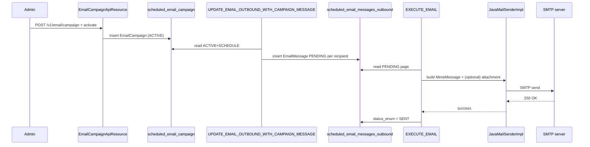

Apache Fineract's email campaigns let operations staff blast a templated
message — optionally with an attached report — to any audience returned
by a Fineract report. Campaign metadata lives in
`scheduled_email_campaign`, messages queue in `scheduled_email_messages_outbound`,
JavaMail does the actual SMTP send, and two scheduled jobs move work
between the campaign engine and the SMTP layer.

## Module layout

```text
fineract-provider/src/main/java/org/apache/fineract/infrastructure/campaigns/email/
├── EmailApiConstants.java
├── ScheduledEmailConstants.java
├── api/
│   ├── EmailApiResource.java                 # /v1/email
│   ├── EmailCampaignApiResource.java         # /v1/email/campaign
│   └── EmailConfigurationApiResource.java    # /v1/email/configuration
├── data/
│   ├── EmailCampaignData.java
│   ├── EmailCampaignValidator.java
│   ├── EmailCampaignTimeLine.java
│   └── EmailMessageWithAttachmentData.java
├── domain/
│   ├── EmailCampaign.java
│   ├── EmailCampaignRepository.java
│   ├── EmailCampaignStatus.java
│   ├── EmailCampaignType.java
│   ├── EmailMessage.java
│   ├── EmailMessageRepository.java
│   ├── EmailMessageStatusType.java
│   └── ScheduledEmailAttachmentFileFormat.java
├── exception/
└── service/
    ├── EmailCampaignDomainService(Impl).java
    ├── EmailCampaignReadPlatformService(Impl).java
    ├── EmailCampaignWritePlatformService(Impl).java
    ├── EmailConfigurationReadPlatformService(Impl).java
    ├── EmailConfigurationWritePlatformService(Impl).java
    ├── EmailMessageJobEmailService(Impl).java
    ├── EmailReadPlatformService(Impl).java
    └── EmailWritePlatformService(JpaRepositoryImpl).java
```

## The `EmailCampaign` entity

From
`fineract-provider/src/main/java/org/apache/fineract/infrastructure/campaigns/email/domain/EmailCampaign.java`:

```java
@Entity
@Table(name = "scheduled_email_campaign")
public class EmailCampaign extends AbstractPersistableCustom<Long> {

    @Column(name = "campaign_name", nullable = false)
    private String campaignName;

    @Column(name = "campaign_type", nullable = false)
    private Integer campaignType;

    @ManyToOne @JoinColumn(name = "business_rule_id", nullable = false)
    private Report businessRuleId;

    @Column(name = "param_value")               private String paramValue;
    @Column(name = "status_enum", nullable=false) private Integer status;
    @Column(name = "email_subject", nullable=false) private String emailSubject;
    @Column(name = "email_message", nullable=false) private String emailMessage;

    @Column(name = "email_attachment_file_format")
    private String emailAttachmentFileFormat;

    @ManyToOne @JoinColumn(name = "stretchy_report_id")
    private Report stretchyReport;

    @Column(name = "stretchy_report_param_map", nullable = true)
    private String stretchyReportParamMap;

    @Column(name = "closedon_date", nullable = true)
    // ... recurrence, submittedonDate, approvedonDate, ...
}
```

Field highlights:

| Field | Purpose |
| ----- | ------- |
| `businessRuleId` | Stretchy report that returns the recipient list (email address + template parameters). |
| `paramValue` | Default parameter values for the recipient report. |
| `emailSubject` / `emailMessage` | Templates with `{{...}}` placeholders. |
| `stretchyReport` + `stretchyReportParamMap` | Optional report to render as an attachment (PDF, XLS, CSV, controlled by `ScheduledEmailAttachmentFileFormat`). |
| `status` | Enum (`EmailCampaignStatus`) — PENDING, ACTIVE, CLOSED. |
| `recurrence` | Cron expression for scheduled triggers. |

## The `EmailMessage` entity

`EmailMessage`
(`fineract-provider/src/main/java/org/apache/fineract/infrastructure/campaigns/email/domain/EmailMessage.java`)
is the outbound queue row, structurally analogous to `SmsMessage`:
it carries the rendered subject + body, the recipient address, the
campaign FK, the status enum (`EmailMessageStatusType` — `INVALID(0)`,
`PENDING(100)`, `SENT(200)`, `DELIVERED(300)`, `FAILED(400)`), and the
timestamps the read services use to surface "pending" / "sent" /
"failed" listings.

The table is `scheduled_email_messages_outbound`.

## REST surface

### `/v1/email/campaign` — campaign CRUD

From
`fineract-provider/src/main/java/org/apache/fineract/infrastructure/campaigns/email/api/EmailCampaignApiResource.java`:

```java
@Path("/v1/email/campaign")
```

| Method | Path | Purpose |
| ------ | ---- | ------- |
| GET    | `/v1/email/campaign` | List campaigns |
| GET    | `/v1/email/campaign/{id}` | Retrieve one |
| POST   | `/v1/email/campaign` | Create |
| PUT    | `/v1/email/campaign/{id}` | Update |
| POST   | `/v1/email/campaign/{id}?command=activate` (also `close`, `reactivate`) | Lifecycle |
| POST   | `/v1/email/campaign/preview` | Dry-run the template against sample data |
| GET    | `/v1/email/campaign/template` | UI lookup data |
| GET    | `/v1/email/campaign/template/{id}` | Retrieve one template |
| DELETE | `/v1/email/campaign/{id}` | Delete (only when `CLOSED`) |

### `/v1/email` — outbound queue

From
`fineract-provider/src/main/java/org/apache/fineract/infrastructure/campaigns/email/api/EmailApiResource.java`:

```java
@Path("/v1/email")
```

| Method | Path | Purpose |
| ------ | ---- | ------- |
| GET    | `/v1/email` | List all outbound messages |
| GET    | `/v1/email/pendingEmail` | Pending only |
| GET    | `/v1/email/sentEmail` | Sent only |
| GET    | `/v1/email/failedEmail` | Failed only |
| GET    | `/v1/email/messageByStatus` | Paginated by status |
| GET    | `/v1/email/{resourceId}` | Retrieve one |
| POST   | `/v1/email` | Manually enqueue a message |
| PUT    | `/v1/email/{resourceId}` | Update (typically a re-target) |
| DELETE | `/v1/email/{resourceId}` | Remove a queued message |

### `/v1/email/configuration` — SMTP settings

From
`fineract-provider/src/main/java/org/apache/fineract/infrastructure/campaigns/email/api/EmailConfigurationApiResource.java`:

```java
@Path("/v1/email/configuration")
```

A small endpoint surfacing the SMTP credentials. The values live in
`c_external_service_properties` joined to a `c_external_service` row
whose name is `SMTP_Email_Account` (see
`ExternalServicesConstants.SMTP_SERVICE_NAME`). The property keys are:

| Property key | Meaning |
| ------------ | ------- |
| `username`   | SMTP username |
| `password`   | SMTP password |
| `host`       | SMTP host |
| `port`       | SMTP port |
| `useTLS`     | Whether to enable STARTTLS |
| `fromEmail`  | Default `From:` address |
| `fromName`   | Default `From:` display name |

`EmailConfigurationWritePlatformServiceImpl` persists changes; the
`EmailMessageJobEmailServiceImpl` reads them at send time via
`ExternalServicesPropertiesReadPlatformService.getSMTPCredentials()`,
so a hot configuration change is picked up on the next job tick
without a restart.

## JavaMail wiring

The actual send is delegated to **JavaMail**, not to a third-party HTTP
gateway. `EmailMessageJobEmailServiceImpl`
(`fineract-provider/.../campaigns/email/service/EmailMessageJobEmailServiceImpl.java`)
is the single class that:

1. Reads the SMTP configuration via
   `ExternalServicesPropertiesReadPlatformService.getSMTPCredentials()`
   — which returns an `SMTPCredentialsData` populated from the
   `SMTP_Email_Account` external service row.
2. Builds a `JavaMailSenderImpl` on the fly (host, port, username,
   password, STARTTLS, `mail.smtp.ssl.trust`).
3. Creates a `MimeMessage` via `MimeMessageHelper`, attaches any files
   produced by the stretchy report (PDF/XLS/CSV), sets
   `from`/`to`/`subject`/`text` and calls `javaMailSenderImpl.send(...)`.
4. Catches `MessagingException`; the `ExecuteEmailTasklet` flips the
   row to `SENT` on success or `FAILED` with the exception message.

The mail send happens entirely inside the campaigns module — there is
no separate `infrastructure/email/` gateway folder, unlike SMS.

## The two email jobs

```java
UPDATE_EMAIL_OUTBOUND_WITH_CAMPAIGN_MESSAGE("Update Email Outbound with campaign message"),
EXECUTE_EMAIL("Execute Email"),
```

(`fineract-core/src/main/java/org/apache/fineract/infrastructure/jobs/service/JobName.java`)

### 1. `UPDATE_EMAIL_OUTBOUND_WITH_CAMPAIGN_MESSAGE`

`fineract-provider/.../campaigns/jobs/updateemailoutboundwithcampaignmessage/UpdateEmailOutboundWithCampaignMessageTasklet.java`.

Mirror of the SMS gap-fill job:

1. Iterates `ACTIVE` campaigns with `SCHEDULE` trigger.
2. Runs each campaign's `businessRuleId` report to fetch the recipient
   set + template parameters.
3. Renders subject and body.
4. Persists one `EmailMessage` per recipient with status `PENDING`.

If a campaign is misconfigured — for example, a report parameter
cannot be coerced to a number — the tasklet throws an
`EmailParamMappingException` (the package ships a dedicated exception
for exactly that case).

### 2. `EXECUTE_EMAIL`

`fineract-provider/.../campaigns/jobs/executeemail/ExecuteEmailTasklet.java`.

Sends every `PENDING` `EmailMessage`. The tasklet header (truncated):

```java
public class ExecuteEmailTasklet implements Tasklet {

    // ... injects:
    private final EmailCampaignRepository         emailCampaignRepository;
    private final EmailMessageRepository          emailMessageRepository;
    private final EmailMessageJobEmailService     emailMessageJobEmailService;
    private final ReadReportingService            readReportingService;
    private final LoanRepository                  loanRepository;
    private final FineractProperties              fineractProperties;
    // ...
}
```

Per pending message, it:

1. If the campaign has an attachment configured, runs the stretchy
   report via `ReadReportingService`, writes the bytes to a temp
   `File`, builds an `EmailMessageWithAttachmentData`.
2. Calls `EmailMessageJobEmailServiceImpl.sendEmailWithAttachment(...)`.
3. Updates `status_enum` to `SENT` (with `submittedon_date`) or
   `FAILED` (with the captured error).
4. Optionally references the originating `Client` / `Loan` aggregates
   if the template referenced them — that's why the tasklet imports
   `LoanRepository` and `Client`.

`IPv4Helper` is also referenced — when a deployment is on a private
network with no public DNS, the helper drives a fall-back behaviour so
the job still attempts (and fails predictably) instead of hanging.

## End-to-end flow



## Status enums

`EmailCampaignStatus`
(`infrastructure/campaigns/email/domain/EmailCampaignStatus.java`):
`PENDING (100)`, `ACTIVE (300)`, `CLOSED (600)` — same scheme as the
SMS side.

`EmailMessageStatusType`: `INVALID(0)`, `PENDING(100)`, `SENT(200)`,
`DELIVERED(300)`, `FAILED(400)`.

`EmailCampaignType`
(`infrastructure/campaigns/email/domain/EmailCampaignType.java`):
`DIRECT(1)`, `SCHEDULE(2)`, `TRIGGERED(3)` — mirrors the SMS-side
trigger split but lives in its own enum.

`ScheduledEmailAttachmentFileFormat`
(`infrastructure/campaigns/email/domain/ScheduledEmailAttachmentFileFormat.java`):
`INVALID(0)`, `XLS(1)`, `PDF(2)`, `CSV(3)` — what the stretchy report
should render as.

## Common operations

<AccordionGroup>
<Accordion title="Send a monthly statement to every active client">
Create an email campaign whose `businessRuleId` returns one row per
active client (email + name + loan id), and whose `stretchyReport`
renders that loan's statement as PDF. Trigger `SCHEDULE` with a
monthly cron. `UPDATE_EMAIL_OUTBOUND_WITH_CAMPAIGN_MESSAGE` enqueues
the rows; `EXECUTE_EMAIL` renders and sends them.
</Accordion>

<Accordion title="Roll out an SMTP change without restarting">
PUT new credentials to `/v1/email/configuration`. The next call to
`EmailMessageJobEmailServiceImpl.sendEmail*` reads the updated row and
rebuilds the `JavaMailSenderImpl`.
</Accordion>

<Accordion title="Resend a failed message">
`PUT /v1/email/{id}` only updates the message body (the
`UPDATE_REQUEST_DATA_PARAMETERS` set in `EmailApiConstants` is just
`emailMessage`). To re-attempt delivery, reset `status_enum` to `100`
(`PENDING`) directly in `scheduled_email_messages_outbound`; the next
`EXECUTE_EMAIL` tick picks it up. `GET /v1/email/failedEmail` is the
easiest way to find candidates.
</Accordion>

<Accordion title="Validate templates before activating">
`POST /v1/email/campaign/preview` runs the report against sample
parameters and returns the rendered subject + body for the first row,
without writing to `scheduled_email_messages_outbound`.
</Accordion>

<Accordion title="Limit attachment size">
`ExecuteEmailTasklet` writes attachments to a temp file before
sending. Disk usage scales with concurrent campaign size; cron the
SMTP job to fan out, or shrink the attachment format (PDF → CSV).
</Accordion>
</AccordionGroup>

## Related reading

- **Campaigns Overview** — module map.
- **SMS Campaigns and Gateway** — the SMS-side equivalent and the
  three SMS jobs.
- **Scheduler and Helpers** — the `jobs/` and `helper/` packages that
  glue the campaign engines to the gateways.
