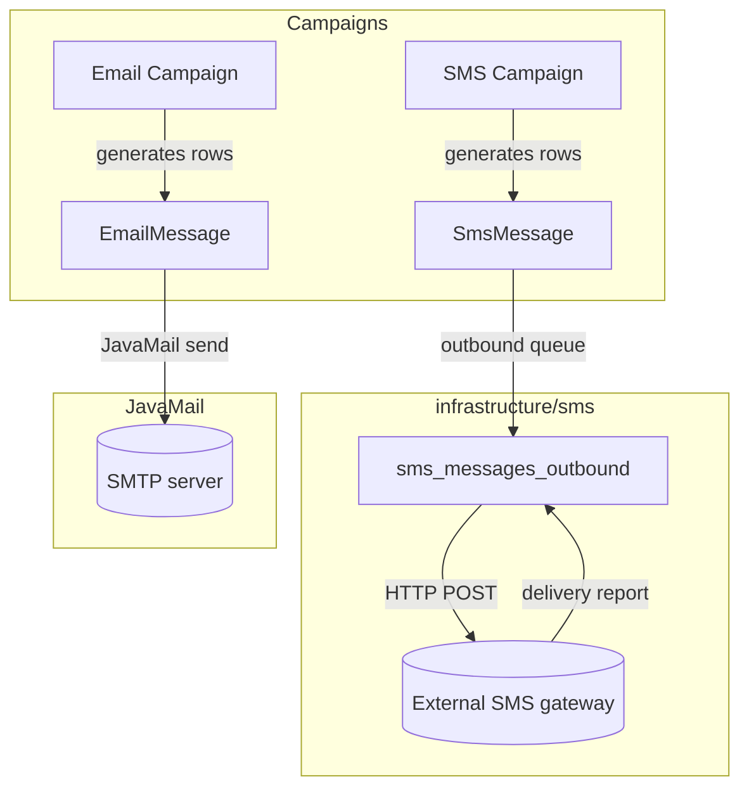
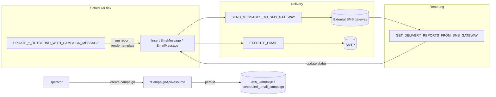

Apache Fineract ships a **campaigns** module that lets operations staff
run scheduled or triggered SMS and email blasts off arbitrary report
data (account balances, due dates, KYC reminders). It composes a
small set of cooperating packages: an SMS campaign engine, an email
campaign engine, a shared scheduler/helper layer, and the underlying
**SMS gateway** module that actually pushes bytes out of the platform.

Understanding the split between *campaigns* (what to send, to whom,
when) and the *SMS gateway* (how messages are queued and delivered) is
the first step to operating either feature in production.

## Module map

```text
fineract-provider/src/main/java/org/apache/fineract/infrastructure/
├── campaigns/
│   ├── constants/CampaignType.java
│   ├── email/                  # Email campaign engine
│   │   ├── api/                #   EmailCampaignApiResource, EmailApiResource, EmailConfigurationApiResource
│   │   ├── data/
│   │   ├── domain/             #   EmailCampaign, EmailMessage, EmailCampaignStatus
│   │   ├── service/            #   Campaign domain/read/write services + JavaMail wiring
│   │   └── exception/
│   ├── sms/                    # SMS campaign engine
│   │   ├── api/SmsCampaignApiResource.java
│   │   ├── constants/          #   SmsCampaignConstants, SmsCampaignStatus, SmsCampaignTriggerType
│   │   ├── data/
│   │   ├── domain/             #   SmsCampaign, SmsCampaignRepository
│   │   ├── service/
│   │   └── exception/
│   ├── helper/SmsConfigUtils.java
│   └── jobs/                   # Quartz / Spring Batch tasklets — see scheduler page
│       ├── sendmessagetosmsgateway/
│       ├── getdeliveryreportsfromsmsgateway/
│       ├── updatesmsoutboundwithcampaignmessage/
│       ├── updateemailoutboundwithcampaignmessage/
│       ├── executeemail/
│       └── executereportmailingjobs/
└── sms/                        # Lower-level SMS gateway / message store
    ├── api/SmsApiResource.java
    ├── domain/SmsMessage.java
    ├── data/
    └── service/
```

## Two layers, two concerns

The campaigns module is built on top of the gateway, not next to it.



**Campaigns** (`infrastructure/campaigns/`) own scheduling, eligibility
queries (a campaign is bound to a `m_report` row that returns the
recipients), templating and overall state. They produce
`SmsMessage` and `EmailMessage` rows.

**SMS gateway** (`infrastructure/sms/`) owns the outbound message queue
itself (`sms_messages_outbound`), the HTTP integration to the external
provider, retry semantics and delivery-report ingestion. It is reusable
from anywhere in the platform — savings deposits, loan repayments,
overdue reminders, all of them call `SmsMessageRepository.save(...)`
to enqueue a message even when no campaign is involved.

The relationship is one-way: campaigns push messages into the gateway,
not the other way round. The gateway has no knowledge of campaigns.

## Where each piece lives

### SMS campaign engine

- Entity: `SmsCampaign`
  (`fineract-provider/src/main/java/org/apache/fineract/infrastructure/campaigns/sms/domain/SmsCampaign.java`)
  — mapped to `sms_campaign`. Tracks name, body template, trigger type
  (`DIRECT`, `SCHEDULE`, `TRIGGERED`), status, schedule cron, and the
  driving report.
- REST: `SmsCampaignApiResource`
  (`fineract-provider/.../campaigns/sms/api/SmsCampaignApiResource.java`)
  rooted at `/v1/smscampaigns`.
- Validation: `SmsCampaignValidator` in
  `.../campaigns/sms/serialization/`.

### Email campaign engine

- Entity: `EmailCampaign`
  (`fineract-provider/src/main/java/org/apache/fineract/infrastructure/campaigns/email/domain/EmailCampaign.java`)
  — mapped to `scheduled_email_campaign`. Tracks subject, body,
  optional attachment file format, the `business_rule_id` report that
  returns recipients and the optional `stretchy_report_id` that
  produces an attachment.
- REST: `EmailCampaignApiResource`
  (`/v1/email/campaign`) plus the read-side `EmailApiResource`
  (`/v1/email`) and the SMTP config endpoint `EmailConfigurationApiResource`
  (`/v1/email/configuration`).

### Outbound SMS gateway

- Entity: `SmsMessage`
  (`fineract-provider/src/main/java/org/apache/fineract/infrastructure/sms/domain/SmsMessage.java`)
  — mapped to `sms_messages_outbound`. Carries status (`PENDING`,
  `SENT`, `DELIVERED`, `FAILED`), optional `externalId` (the
  provider's tracking ID) and FK references to group / client / staff.
- REST: `SmsApiResource`
  (`fineract-provider/src/main/java/org/apache/fineract/infrastructure/sms/api/SmsApiResource.java`)
  rooted at `/v1/sms`. Used to inspect or override individual messages
  (retrieve, list by status, update, delete).

### Outbound email gateway

- Entity: `EmailMessage`
  (`fineract-provider/src/main/java/org/apache/fineract/infrastructure/campaigns/email/domain/EmailMessage.java`).
- The email gateway is folded into the campaigns module — JavaMail is
  invoked directly from `EmailMessageJobEmailServiceImpl` rather than
  living in a separate top-level package.

### Scheduling and helpers

- Jobs: `infrastructure/campaigns/jobs/<jobname>/` — one folder per
  Quartz job containing a `*Config` (Spring Batch `Step`) and a
  `*Tasklet` (the actual work).
- Helpers: `infrastructure/campaigns/helper/SmsConfigUtils.java` —
  builds the HTTP URI / headers used to talk to the external SMS
  gateway, pulling credentials from
  `ExternalServicesPropertiesReadPlatformService`.

The dedicated **Scheduler and Helpers** page documents these in detail.

## Campaign types

`infrastructure/campaigns/constants/CampaignType.java`:

```java
public enum CampaignType {
    INVALID     (0, "campaignType.invalid"),
    SMS         (1, "campaignType.sms"),
    NOTIFICATION(2, "campaignType.notification");
}
```

> Note: the enum is shared by the SMS campaign engine; **email**
> campaigns store their own type discriminator in
> `scheduled_email_campaign.campaign_type` rather than reusing this
> enum, reflecting that the email engine was added later.

## Triggers

SMS campaigns can run in one of three modes
(`infrastructure/campaigns/sms/constants/SmsCampaignTriggerType.java`):

- **`DIRECT`** — staff click "Send Now" through `POST /v1/smscampaigns/{id}?command=activate`.
- **`SCHEDULE`** — a cron-style recurrence runs on the
  `UPDATE_SMS_OUTBOUND_WITH_CAMPAIGN_MESSAGE` job's next tick.
- **`TRIGGERED`** — a domain event (loan disbursement, savings
  deposit, etc.) calls the SMS campaign domain service synchronously.

Email campaigns use the same conceptual split via
`EmailCampaignStatus` and the `ExecuteEmail` tasklet.

## API surface at a glance

| HTTP path | Owner | Purpose |
| --------- | ----- | ------- |
| `/v1/smscampaigns` | `SmsCampaignApiResource` | CRUD on `sms_campaign` rows |
| `/v1/sms` | `SmsApiResource` | Inspect / override the `sms_messages_outbound` queue |
| `/v1/email/campaign` | `EmailCampaignApiResource` | CRUD on `scheduled_email_campaign` rows |
| `/v1/email` | `EmailApiResource` | Inspect the email outbound queue |
| `/v1/email/configuration` | `EmailConfigurationApiResource` | SMTP host / port / from-address config |

## Lifecycle in one picture



## Jobs catalogue

All registered under `JobName`
(`fineract-core/src/main/java/org/apache/fineract/infrastructure/jobs/service/JobName.java`):

```java
UPDATE_SMS_OUTBOUND_WITH_CAMPAIGN_MESSAGE("Update SMS Outbound with Campaign Message"),
SEND_MESSAGES_TO_SMS_GATEWAY("Send Messages to SMS Gateway"),
GET_DELIVERY_REPORTS_FROM_SMS_GATEWAY("Get Delivery Reports from SMS Gateway"),
UPDATE_EMAIL_OUTBOUND_WITH_CAMPAIGN_MESSAGE("Update Email Outbound with campaign message"),
EXECUTE_EMAIL("Execute Email"),
```

Each name maps one-to-one to a folder under
`infrastructure/campaigns/jobs/<jobname>/`. The Scheduler and Helpers
page walks through their tasklets in detail.

## When to use what

<AccordionGroup>
<Accordion title="One-off blast to all clients with overdue loans">
Create an SMS campaign of trigger type `DIRECT`, point it at a report
that returns mobile numbers of overdue accounts, then call
`POST /v1/smscampaigns/{id}?command=activate`. The campaign engine
inserts rows into `sms_messages_outbound`, and the gateway jobs take
over from there.
</Accordion>

<Accordion title="Daily savings-balance reminder by email">
Create an email campaign of trigger type `SCHEDULE` with a daily
recurrence. The `UPDATE_EMAIL_OUTBOUND_WITH_CAMPAIGN_MESSAGE` job
runs the report on tick, enqueues `email_messages_outbound` rows,
and `EXECUTE_EMAIL` sends them.
</Accordion>

<Accordion title="Transactional SMS receipt on every deposit">
Don't use a campaign — use the gateway directly. The savings
write-service inserts an `SmsMessage` per deposit; the standard
`SEND_MESSAGES_TO_SMS_GATEWAY` job ships it out. The campaign engine
is only needed for *bulk* eligibility queries.
</Accordion>

<Accordion title="Inspect why a specific SMS never delivered">
`GET /v1/sms/{id}` returns the row from `sms_messages_outbound`
including its status, `externalId` (the provider tracking ID) and
any error message captured by the delivery-report job.
</Accordion>
</AccordionGroup>

## Related reading

- **SMS Campaigns and Gateway** — entity model, status transitions,
  REST surface and the three SMS jobs.
- **Email Campaigns and Configuration** — entity model, JavaMail
  wiring and the two email jobs.
- **Scheduler and Helpers** — the `jobs/`, `helper/` and `constants/`
  packages that glue everything together.
