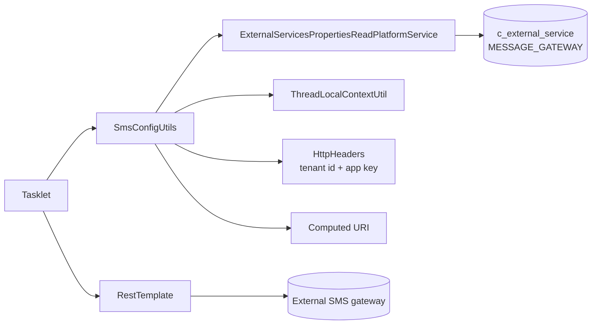
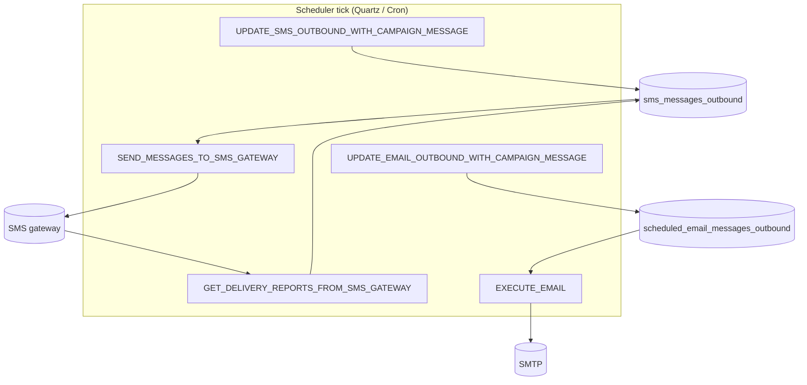

The Apache Fineract **campaigns** module ships five Spring Batch jobs,
one HTTP helper and a small set of constant packages that together
form the runtime engine behind every SMS and email campaign. This page
walks through each of them with file paths, so on-call operators can
locate the relevant tasklet without grepping.

## Directory map

```text
fineract-provider/src/main/java/org/apache/fineract/infrastructure/campaigns/
├── constants/
│   └── CampaignType.java
├── helper/
│   └── SmsConfigUtils.java
└── jobs/
    ├── executeemail/
    │   ├── ExecuteEmailConfig.java
    │   └── ExecuteEmailTasklet.java
    ├── executereportmailingjobs/
    ├── getdeliveryreportsfromsmsgateway/
    ├── sendmessagetosmsgateway/
    │   ├── SendMessageToSmsGatewayConfig.java
    │   └── SendMessageToSmsGatewayTasklet.java
    ├── updateemailoutboundwithcampaignmessage/
    │   ├── EmailParamMappingException.java
    │   ├── UpdateEmailOutboundWithCampaignMessageConfig.java
    │   └── UpdateEmailOutboundWithCampaignMessageTasklet.java
    └── updatesmsoutboundwithcampaignmessage/
```

Per-channel constants live closer to their owners:

```text
.../campaigns/sms/constants/
    SmsCampaignConstants.java
    SmsCampaignStatus.java
    SmsCampaignTriggerType.java
    SmsCampaignEnumerations.java

.../campaigns/email/
    EmailApiConstants.java
    ScheduledEmailConstants.java
```

## Constants — `infrastructure/campaigns/constants/`

### `CampaignType`

```java
public enum CampaignType {
    INVALID     (0, "campaignType.invalid"),
    SMS         (1, "campaignType.sms"),
    NOTIFICATION(2, "campaignType.notification");

    private final Integer value;
    private final String code;
}
```

Lives in `infrastructure/campaigns/constants/`. Email campaigns
manage their own type discriminator (`scheduled_email_campaign.campaign_type`)
because they were added later and never reused this enum.

### SMS-side constants

`infrastructure/campaigns/sms/constants/SmsCampaignConstants.java` is a
public final class with the parameter names used by the JSON commands
(campaign name, message, business rule id, recurrence, status) and
the HTTP header names the SMS jobs pass to the external gateway —
`FINERACT_PLATFORM_TENANT_ID`, `FINERACT_TENANT_APP_KEY`, etc. The
status, trigger and enumeration sibling classes
(`SmsCampaignStatus`, `SmsCampaignTriggerType`,
`SmsCampaignEnumerations`) translate enum codes into
`EnumOptionData` values for the API.

### Email-side constants

`EmailApiConstants` defines the parameter names for the
`/v1/email/campaign` JSON DTOs. `ScheduledEmailConstants` carries the
internal lookup strings used by the campaign engine (`email_subject`,
`email_message`, `emailAttachmentFileFormat`, etc.) so the same
literal isn't repeated in 30 places.

## Helpers — `infrastructure/campaigns/helper/`

### `SmsConfigUtils`

`fineract-provider/src/main/java/org/apache/fineract/infrastructure/campaigns/helper/SmsConfigUtils.java`
is the *only* helper in the package — it is the glue between the
external SMS gateway (configured per-tenant under the
`MESSAGE_GATEWAY` row of `c_external_service` + its
`c_external_service_properties`) and any tasklet that needs to talk
HTTP to it.

```java
@Component
public class SmsConfigUtils {

    @Autowired
    private ExternalServicesPropertiesReadPlatformService propertiesReadPlatformService;

    public Map<String, Object> getMessageGateWayRequestURI(
            final String apiEndPoint, String apiQueueResourceDatas) {

        Map<String, Object> httpRequestdetails = new HashMap<>();
        MessageGatewayConfigurationData messageGatewayConfigurationData =
                this.propertiesReadPlatformService.getSMSGateway();
        final FineractPlatformTenant tenant = ThreadLocalContextUtil.getTenant();

        HttpHeaders headers = new HttpHeaders();
        headers.setContentType(MediaType.APPLICATION_JSON);
        headers.add(SmsCampaignConstants.FINERACT_PLATFORM_TENANT_ID,
                    tenant.getTenantIdentifier());
        headers.add(SmsCampaignConstants.FINERACT_TENANT_APP_KEY,
                    messageGatewayConfigurationData.tenantAppKey());

        StringBuilder pathBuilder = new StringBuilder();
        String endPoint = messageGatewayConfigurationData.endPoint() == null
                       || messageGatewayConfigurationData.endPoint().equals("/")
                ? ""
                : messageGatewayConfigurationData.endPoint();
        // ...
        UriBuilder builder = UriBuilder.fromPath(pathBuilder.toString())
                .host(messageGatewayConfigurationData.hostName())
                .scheme("http")
                .port(messageGatewayConfigurationData.portNumber());
        // ...
    }
}
```

What it does:

- Reads the per-tenant gateway configuration — `host_name`,
  `port_number`, `end_point`, `tenant_app_key` — from the
  `MESSAGE_GATEWAY` external service.
- Builds the final URI for the supplied `apiEndPoint`
  (`message`, `delivery-reports`, etc.).
- Constructs an `HttpEntity` carrying the JSON body and the headers
  the gateway requires for authentication.
- Returns both in a `Map<String, Object>` keyed by `"uri"` and
  `"entity"` — the tasklets pull them straight out and pass them to
  `RestTemplate`.



## Jobs — `infrastructure/campaigns/jobs/`

Every job folder contains the standard pair Fineract uses:

- `*Config.java` — a `@Configuration` declaring the Spring Batch
  `Step` (and thus the `Job`) backed by the tasklet, registered under
  the canonical `JobName`.
- `*Tasklet.java` — the actual implementation of
  `org.springframework.batch.core.step.tasklet.Tasklet`.

The five jobs in the package, with their `JobName` registration
(`fineract-core/src/main/java/org/apache/fineract/infrastructure/jobs/service/JobName.java`):

```java
UPDATE_SMS_OUTBOUND_WITH_CAMPAIGN_MESSAGE("Update SMS Outbound with Campaign Message"),
SEND_MESSAGES_TO_SMS_GATEWAY            ("Send Messages to SMS Gateway"),
GET_DELIVERY_REPORTS_FROM_SMS_GATEWAY   ("Get Delivery Reports from SMS Gateway"),
UPDATE_EMAIL_OUTBOUND_WITH_CAMPAIGN_MESSAGE("Update Email Outbound with campaign message"),
EXECUTE_EMAIL                           ("Execute Email"),
```

### 1. `updatesmsoutboundwithcampaignmessage/`

Walks `ACTIVE` campaigns with `triggerType = SCHEDULE`, runs each
campaign's bound `m_stretchy_report` to fetch the audience, renders
the template, and inserts `SmsMessage` rows. The end state of the job
is a bunch of new `PENDING` rows in `sms_messages_outbound`. From here
on, the rest of the pipeline is identical whether the row came from a
campaign or from a domain event.

### 2. `sendmessagetosmsgateway/`

The tasklet
(`fineract-provider/src/main/java/org/apache/fineract/infrastructure/campaigns/jobs/sendmessagetosmsgateway/SendMessageToSmsGatewayTasklet.java`)
is the workhorse:

```java
@RequiredArgsConstructor
public class SendMessageToSmsGatewayTasklet implements Tasklet,
        ApplicationListener<ContextClosedEvent> {

    // ... NotificationSenderService, SmsConfigUtils, SmsMessageRepository
}
```

Per tick:

1. Reads a `Pageable` window of `PENDING` `SmsMessage` rows.
2. Calls `SmsConfigUtils.getMessageGateWayRequestURI("send", body)`.
3. POSTs the page via `RestTemplate.exchange(...)` with
   `ParameterizedTypeReference` so the response of provider tracking
   IDs is typed.
4. Flips each row to `SENT`, persists the provider's external id.
5. On `ConnectionFailureException`, leaves rows `PENDING` for the
   next tick — natural retry without dead-letter logic.

The `ApplicationListener<ContextClosedEvent>` lets the tasklet flush
in-flight work on shutdown.

### 3. `getdeliveryreportsfromsmsgateway/`

Asks the provider for delivery receipts on every `SENT` row, then
sets the terminal state — `DELIVERED` or `FAILED` with an error
message — by id. Same `SmsConfigUtils`-driven HTTP wiring, different
endpoint and verb.

### 4. `updateemailoutboundwithcampaignmessage/`

Symmetric with the SMS gap-fill job, but for the email side.
`UpdateEmailOutboundWithCampaignMessageTasklet` enqueues
`EmailMessage` rows. The folder also carries a dedicated
`EmailParamMappingException` — raised when a template parameter
cannot be coerced from the report's column type to the template's
expected placeholder type.

### 5. `executeemail/`

`fineract-provider/.../campaigns/jobs/executeemail/ExecuteEmailTasklet.java`
is the SMTP-side worker:

```java
public class ExecuteEmailTasklet implements Tasklet {
    // injects EmailCampaignRepository, EmailMessageRepository,
    //         EmailMessageJobEmailService, ReadReportingService,
    //         LoanRepository, FineractProperties ...
}
```

Per pending message:

1. If the campaign defines an attachment, runs the stretchy report
   via `ReadReportingService`, writes the bytes to a temp file, builds
   an `EmailMessageWithAttachmentData`.
2. Calls into `EmailMessageJobEmailService` (which owns the JavaMail
   `JavaMailSenderImpl`).
3. Updates the message to `SENT` (or `FAILED` with the captured
   exception message).

`IPv4Helper` is also referenced for environments without public DNS
so the job fails predictably instead of hanging.

### 6. `executereportmailingjobs/` (sibling feature)

The sister folder under the same `jobs/` parent runs the
*report-mailing-job* feature — a different, older facility for mailing
reports out of Fineract on a schedule. It is not part of the
campaigns pipeline proper but lives here because it shares the SMTP
configuration and the report-rendering pipeline.

## Spring Batch wiring at a glance

Each `*Config` produces a Step / Job in essentially the same shape.
For example, the email send config registers the
`EXECUTE_EMAIL` job that wraps `ExecuteEmailTasklet` and uses the
shared transaction manager so message-status updates participate in
the same transaction as the SMTP send result.



## Operating the jobs

All five jobs are registered as ordinary Fineract scheduled jobs.

- **List**: `GET /v1/jobs`.
- **Run on demand**: `POST /v1/jobs/{id}?command=executeJob`.
- **Edit cron / active flag**: `PUT /v1/jobs/{id}/jobdetail`.

Typical configuration:

| Job | Suggested cron | Notes |
| --- | -------------- | ----- |
| `UPDATE_SMS_OUTBOUND_WITH_CAMPAIGN_MESSAGE` | Every 15 minutes | Cheap; gives newly-due campaigns a chance to enqueue. |
| `SEND_MESSAGES_TO_SMS_GATEWAY` | Every 1–5 minutes | The actual throughput knob — page size × cron rate. |
| `GET_DELIVERY_REPORTS_FROM_SMS_GATEWAY` | Every 30 minutes | Sliding window of `SENT` rows. |
| `UPDATE_EMAIL_OUTBOUND_WITH_CAMPAIGN_MESSAGE` | Hourly / daily | Aligned with the cadence of your email campaigns. |
| `EXECUTE_EMAIL` | Every 10 minutes | SMTP is much slower than SMS HTTP — keep this generous. |

## Operational tips

<AccordionGroup>
<Accordion title="Validate the SMS gateway URL once">
On install, point an HTTP debugger at the URI computed by
`SmsConfigUtils.getMessageGateWayRequestURI("send", ...)` to verify
the host/port/path align with what the provider expects.
</Accordion>

<Accordion title="Dead-letter a poison message">
If a row in `sms_messages_outbound` keeps failing the provider,
`DELETE /v1/sms/{id}` removes it. The campaign engine will not
re-enqueue an already-processed row.
</Accordion>

<Accordion title="Audit which job last touched a row">
`SmsMessage` and `EmailMessage` carry `submittedon_date` /
`delivered_on_date` columns. Cross-reference with the
`/v1/jobs/.../runhistory` endpoint for a full audit trail.
</Accordion>

<Accordion title="Pause everything quickly">
Set the active flag to `false` on the relevant jobs via the
`/v1/jobs` API. Pending rows stay where they are; no in-flight
HTTP is interrupted.
</Accordion>
</AccordionGroup>

## Related reading

- **Campaigns Overview** — module map and decision matrix.
- **SMS Campaigns and Gateway** — full entity model and REST surface.
- **Email Campaigns and Configuration** — entity model, JavaMail
  wiring and SMTP configuration.
