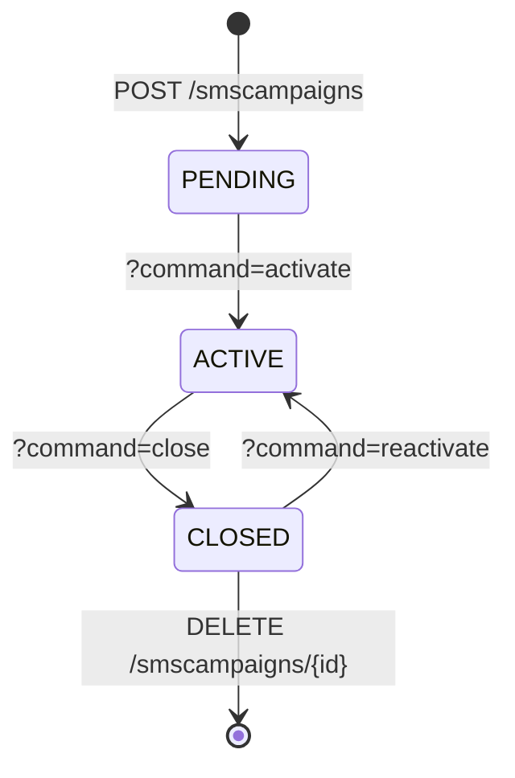
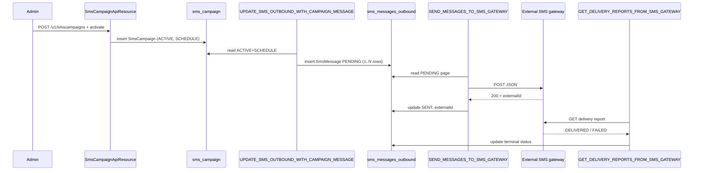

The SMS feature in Apache Fineract is two layers stitched together: a
**campaigns engine** that knows about target reports, schedules and
templates, and an **outbound gateway** that owns the per-message queue
and talks HTTP to an external SMS provider. Three scheduled jobs move
work between them; two REST resources expose them to operators.

This page documents the entities, endpoints and jobs of both layers.

## Module layout

```text
fineract-provider/src/main/java/org/apache/fineract/infrastructure/
├── campaigns/sms/                   # Campaign engine
│   ├── api/SmsCampaignApiResource.java
│   ├── constants/
│   │   ├── SmsCampaignConstants.java
│   │   ├── SmsCampaignStatus.java
│   │   └── SmsCampaignTriggerType.java
│   ├── data/
│   ├── domain/
│   │   ├── SmsCampaign.java
│   │   └── SmsCampaignRepository.java
│   ├── exception/
│   ├── handler/
│   ├── mapper/
│   ├── serialization/SmsCampaignValidator.java
│   └── service/
└── sms/                             # Outbound queue / gateway
    ├── SmsApiConstants.java
    ├── api/SmsApiResource.java
    ├── data/SmsMessageApiQueueResourceData.java
    ├── domain/
    │   ├── SmsMessage.java
    │   ├── SmsMessageRepository.java
    │   └── SmsMessageStatusType.java
    └── service/
```

## Campaign entity — `SmsCampaign`

`SmsCampaign`
(`fineract-provider/src/main/java/org/apache/fineract/infrastructure/campaigns/sms/domain/SmsCampaign.java`)
is mapped to `sms_campaign`:

```java
@Entity
@Table(name = "sms_campaign",
       uniqueConstraints = { @UniqueConstraint(columnNames = { "campaign_name" },
                                                name = "campaign_name_UNIQUE") })
public class SmsCampaign extends AbstractPersistableCustom<Long> {
    // campaign_name, message, trigger_type, status_enum,
    // business_rule_id (report), recurrence, paramValue,
    // approvedonDate, closedonDate, submittedonDate, ...
}
```

Notable fields:

- **`message`** — the message template. Parameter substitution happens
  at execution time using values from the bound report — `{{firstname}}`,
  `{{loanAccountNumber}}` and so on.
- **`businessRuleId`** — FK to `m_stretchy_report`. Running this report
  returns the recipient list (mobile number + template parameters).
- **`triggerType`** — one of `DIRECT`, `SCHEDULE`, `TRIGGERED`
  (see `SmsCampaignTriggerType`).
- **`status`** — `PENDING`, `ACTIVE`, `CLOSED`
  (see `SmsCampaignStatus`).
- **`recurrence`** — cron-style expression used by the `SCHEDULE`
  trigger.

The status machine is driven by `CommandProcessingResult` operations
(`activate`, `close`, `reactivate`) from the REST resource.



## Outbound message entity — `SmsMessage`

`SmsMessage`
(`fineract-provider/src/main/java/org/apache/fineract/infrastructure/sms/domain/SmsMessage.java`)
is mapped to `sms_messages_outbound`:

```java
@Entity
@Table(name = "sms_messages_outbound")
public class SmsMessage extends AbstractPersistableCustom<Long> {

    @Column(name = "external_id")
    private String externalId;

    @ManyToOne @JoinColumn(name = "group_id")  private Group  group;
    @ManyToOne @JoinColumn(name = "client_id") private Client client;
    // staff, mobile_no, message, status_enum, source_address,
    // delivered_on_date, submittedon_date, campaign_name, ...
}
```

The row is the single source of truth for "an SMS Fineract intends to
send" — whether the campaign engine inserted it or a domain event
did. The status enum (`SmsMessageStatusType`) goes through
`PENDING → SENT → DELIVERED` (or `FAILED`) over the life of the message.

## REST surface

### `/v1/smscampaigns` — campaign CRUD

From
`fineract-provider/src/main/java/org/apache/fineract/infrastructure/campaigns/sms/api/SmsCampaignApiResource.java`:

```java
@Path("/v1/smscampaigns")
```

| Method | Path | Operation |
| ------ | ---- | --------- |
| GET    | `/v1/smscampaigns` | List campaigns |
| GET    | `/v1/smscampaigns/template` | Lookup data for the new-campaign UI |
| POST   | `/v1/smscampaigns` | Create a campaign |
| GET    | `/v1/smscampaigns/{id}` | Retrieve one |
| PUT    | `/v1/smscampaigns/{id}` | Update |
| POST   | `/v1/smscampaigns/{id}?command=...` | Lifecycle: `activate`, `close`, `reactivate` |
| POST   | `/v1/smscampaigns/preview` | Dry-run the template against sample data |
| DELETE | `/v1/smscampaigns/{id}` | Delete (only when `CLOSED`) |

### `/v1/sms` — outbound queue

From
`fineract-provider/src/main/java/org/apache/fineract/infrastructure/sms/api/SmsApiResource.java`:

```java
@Path("/v1/sms")
```

| Method | Path | Purpose |
| ------ | ---- | ------- |
| GET    | `/v1/sms` | Page over messages |
| POST   | `/v1/sms` | Manually enqueue a message |
| GET    | `/v1/sms/{resourceId}` | Retrieve one |
| GET    | `/v1/sms/{campaignId}/messageByStatus` | Per-campaign status drill-down |
| PUT    | `/v1/sms/{resourceId}` | Update (typically a re-target before send) |
| DELETE | `/v1/sms/{resourceId}` | Remove a queued message |

The lower-level resource is what operators use to investigate a
specific delivery failure or to back-fill a row for a manual send.

## The three SMS jobs

Registered in
`fineract-core/src/main/java/org/apache/fineract/infrastructure/jobs/service/JobName.java`:

```java
UPDATE_SMS_OUTBOUND_WITH_CAMPAIGN_MESSAGE("Update SMS Outbound with Campaign Message"),
SEND_MESSAGES_TO_SMS_GATEWAY("Send Messages to SMS Gateway"),
GET_DELIVERY_REPORTS_FROM_SMS_GATEWAY("Get Delivery Reports from SMS Gateway"),
```

Each job has its own `.../campaigns/jobs/<jobname>/*Config.java` + `*Tasklet.java`.

### 1. `UPDATE_SMS_OUTBOUND_WITH_CAMPAIGN_MESSAGE`

Folder:
`fineract-provider/.../campaigns/jobs/updatesmsoutboundwithcampaignmessage/`.

Walks every `ACTIVE` campaign with `triggerType=SCHEDULE`, asks the
campaign's bound report for the recipient set, renders the template
once per recipient, and inserts `SmsMessage` rows in `PENDING` state.
This is the bridge between the campaign engine and the gateway: after
this job runs, the rest of the pipeline doesn't care whether a row
came from a campaign or from a domain event.

### 2. `SEND_MESSAGES_TO_SMS_GATEWAY`

`fineract-provider/src/main/java/org/apache/fineract/infrastructure/campaigns/jobs/sendmessagetosmsgateway/SendMessageToSmsGatewayTasklet.java`
is the workhorse. It:

1. Reads a page of `PENDING` `SmsMessage` rows via
   `SmsMessageRepository`.
2. Builds the HTTP request via `SmsConfigUtils.getMessageGateWayRequestURI(...)`
   (see the helpers page).
3. POSTs a JSON array of `SmsMessageApiQueueResourceData` to the
   external gateway.
4. On success, flips `status_enum` to `SENT` and captures the provider's
   `externalId` for later cross-reference.
5. On HTTP/IO error, raises `ConnectionFailureException`
   (`infrastructure/campaigns/sms/exception/ConnectionFailureException.java`),
   leaving the row in `PENDING` for the next tick.

Tasklet header for reference:

```java
@Slf4j
@RequiredArgsConstructor
public class SendMessageToSmsGatewayTasklet implements Tasklet,
        ApplicationListener<ContextClosedEvent> {
    // injects SmsConfigUtils, SmsMessageRepository, NotificationSenderService...
}
```

### 3. `GET_DELIVERY_REPORTS_FROM_SMS_GATEWAY`

Folder:
`fineract-provider/.../campaigns/jobs/getdeliveryreportsfromsmsgateway/`.

Asks the provider for delivery receipts on every recently-`SENT`
message, then updates the corresponding `SmsMessage`:

- `DELIVERED` when the provider confirms terminal success.
- `FAILED` with a human-readable error message column when the
  provider reports the carrier rejected the SMS.

## End-to-end flow



## Gateway HTTP wiring

`SmsConfigUtils`
(`fineract-provider/src/main/java/org/apache/fineract/infrastructure/campaigns/helper/SmsConfigUtils.java`)
is the helper that turns an `apiEndPoint` into a URL and a set of
headers, using the configuration stored under
`c_external_service` (read by `ExternalServicesPropertiesReadPlatformService`):

```java
HttpHeaders headers = new HttpHeaders();
headers.setContentType(MediaType.APPLICATION_JSON);
headers.add(SmsCampaignConstants.FINERACT_PLATFORM_TENANT_ID,  tenant.getTenantIdentifier());
headers.add(SmsCampaignConstants.FINERACT_TENANT_APP_KEY,      messageGatewayConfigurationData.tenantAppKey());
```

The tenant-id and tenant-app-key headers identify Fineract to the
gateway service so a single deployment can multiplex multiple
tenants over one gateway.

## Status enums

`SmsCampaignStatus`:

| Value | Constant |
| ----- | -------- |
| 100   | `PENDING` |
| 300   | `ACTIVE` |
| 600   | `CLOSED` |

`SmsCampaignTriggerType`:

| Value | Constant |
| ----- | -------- |
| 1     | `DIRECT` |
| 2     | `SCHEDULE` |
| 3     | `TRIGGERED` |

`SmsMessageStatusType` covers `PENDING`, `WAITING_FOR_REPORT`, `SENT`,
`DELIVERED`, `FAILED`, `INVALID`.

## Common operations

<AccordionGroup>
<Accordion title="Preview before activating">
`POST /v1/smscampaigns/preview` runs the report with sample
parameters and returns the first N rendered messages without
enqueueing. Useful to sanity-check `{{...}}` placeholders.
</Accordion>

<Accordion title="Retry a failed send">
Patch the row via `PUT /v1/sms/{id}` to set `status_enum` back to
`PENDING`; the next tick of `SEND_MESSAGES_TO_SMS_GATEWAY` picks it up.
</Accordion>

<Accordion title="Throttle the outbound rate">
The `SEND_MESSAGES_TO_SMS_GATEWAY` tasklet processes pages of
`PENDING` rows per tick — control the rate by tuning the job's
cron expression and the page size.
</Accordion>

<Accordion title="Investigate a non-delivered SMS">
`GET /v1/sms/{id}` shows the `externalId` and any error string captured
by the delivery-report job. The provider's dashboard, queried by
that ID, gives the carrier-level diagnostic.
</Accordion>
</AccordionGroup>

## Related reading

- **Campaigns Overview** — module map and decision matrix.
- **Email Campaigns and Configuration** — the email-side equivalent.
- **Scheduler and Helpers** — `jobs/`, `helper/SmsConfigUtils.java`,
  and the constants packages in detail.
