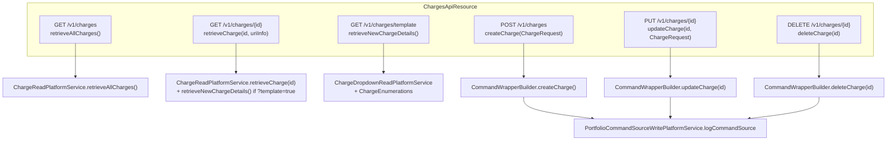

This page drills into how the **Charge** catalogue is actually coded in Apache Fineract. The previous page ([Charges overview](/charges/overview)) explained *what* a charge is; this one is the entity, the enums, the REST resource, and the command-handler triple, with file paths so a coding agent can jump straight to source. Everything is under `fineract-charge/src/main/java/org/apache/fineract/portfolio/charge/`, except `ChargeTimeType` which lives in `fineract-core/src/main/java/org/apache/fineract/portfolio/charge/domain/ChargeTimeType.java` so that `fineract-loan`, `fineract-savings` and `fineract-investor` can depend on it without pulling `fineract-charge`.

## The `Charge` entity

`fineract-charge/src/main/java/org/apache/fineract/portfolio/charge/domain/Charge.java`

```java
@Entity
@Table(name = "m_charge", uniqueConstraints = { @UniqueConstraint(columnNames = { "name" }, name = "name") })
public class Charge extends AbstractPersistableCustom<Long> {
    @Column(name = "name", length = 100)                    private String name;
    @Column(name = "amount", scale = 6, precision = 19, nullable = false)
                                                            private BigDecimal amount;
    @Column(name = "currency_code", length = 3)             private String currencyCode;
    @Column(name = "charge_applies_to_enum", nullable = false)
                                                            private Integer chargeAppliesTo;
    @Column(name = "charge_time_enum", nullable = false)    private Integer chargeTimeType;
    @Column(name = "charge_calculation_enum")               private Integer chargeCalculation;
    @Column(name = "charge_payment_mode_enum")              private Integer chargePaymentMode;
    @Column(name = "fee_on_day")                            private Integer feeOnDay;
    @Column(name = "fee_interval")                          private Integer feeInterval;
    @Column(name = "fee_on_month")                          private Integer feeOnMonth;
    @Column(name = "is_penalty", nullable = false)          private boolean penalty;
    @Column(name = "is_active", nullable = false)           private boolean active;
    @Column(name = "is_deleted", nullable = false)          private boolean deleted = false;
    @Column(name = "min_cap", scale = 6, precision = 19)    private BigDecimal minCap;
    @Column(name = "max_cap", scale = 6, precision = 19)    private BigDecimal maxCap;
    @Column(name = "fee_frequency", nullable = true)        private Integer feeFrequency;
    @Column(name = "is_free_withdrawal", nullable = false)  private boolean enableFreeWithdrawal;
    @Column(name = "free_withdrawal_charge_frequency")      private Integer freeWithdrawalFrequency;
    @Column(name = "restart_frequency")                     private Integer restartFrequency;
    @Column(name = "restart_frequency_enum")                private Integer restartFrequencyEnum;
    @Column(name = "is_payment_type", nullable = false)     private boolean enablePaymentType;
    @ManyToOne @JoinColumn(name = "payment_type_id", nullable = false)
                                                            private PaymentType paymentType;
    @ManyToOne(fetch = FetchType.LAZY)
    @JoinColumn(name = "income_or_liability_account_id")    private GLAccount account;
    @ManyToOne @JoinColumn(name = "tax_group_id")           private TaxGroup taxGroup;
}
```

Key shape facts:

- It extends `AbstractPersistableCustom<Long>` (from `fineract-core`), so id is `Long` and audit fields come from there.
- `amount` is reused for *both* the flat money amount **and** the percentage figure, depending on `chargeCalculation`. There is no separate `percentage` column.
- `feeOnDay` + `feeOnMonth` together encode a `MonthDay` for annual / monthly fees; the factory `Charge.fromJson(...)` reads them via `command.extractMonthDayNamed("feeOnMonthDay")`.
- `is_deleted` makes deletion soft; `ChargeWritePlatformService.deleteCharge(...)` flips the flag rather than removing the row, because joined `m_loan_charge` / `m_savings_account_charge` rows can still reference it.
- The `paymentType` join is marked `nullable = false` in the entity annotation but in practice the column is nullable in the schema — `enablePaymentType=false` is the common case.

### `Charge.fromJson(...)` — the canonical factory

```java
public static Charge fromJson(final JsonCommand command, final GLAccount account, final TaxGroup taxGroup,
        final PaymentType paymentType) {
    final String name        = command.stringValueOfParameterNamed("name");
    final BigDecimal amount  = command.bigDecimalValueOfParameterNamed("amount");
    final String currencyCode = command.stringValueOfParameterNamed("currencyCode");

    final ChargeAppliesTo chargeAppliesTo = ChargeAppliesTo.fromInt(
        command.integerValueOfParameterNamed("chargeAppliesTo"));
    final ChargeTimeType chargeTimeType   = ChargeTimeType.fromInt(
        command.integerValueOfParameterNamed(CHARGE_TIME_PARAM_NAME));
    final ChargeCalculationType chargeCalculationType = ChargeCalculationType.fromInt(
        command.integerValueOfParameterNamed(CHARGE_CALCULATION_TYPE_PARAM_NAME));
    final Integer chargePaymentMode = command.integerValueOfParameterNamed("chargePaymentMode");
    final ChargePaymentMode paymentMode = chargePaymentMode == null ? null : ChargePaymentMode.fromInt(chargePaymentMode);

    final boolean penalty   = command.booleanPrimitiveValueOfParameterNamed("penalty");
    final boolean active    = command.booleanPrimitiveValueOfParameterNamed("active");
    final MonthDay feeOnMonthDay = command.extractMonthDayNamed(FEE_ON_MONTH_DAY_PARAM_NAME);
    final Integer feeInterval    = command.integerValueOfParameterNamed(FEE_INTERVAL_PARAM_NAME);
    final BigDecimal minCap = command.bigDecimalValueOfParameterNamed("minCap");
    final BigDecimal maxCap = command.bigDecimalValueOfParameterNamed("maxCap");
    final Integer feeFrequency = command.integerValueOfParameterNamed(FEE_FREQUENCY_PARAM_NAME);

    boolean enableFreeWithdrawalCharge = command.booleanPrimitiveValueOfParameterNamed("enableFreeWithdrawalCharge");
    boolean enablePaymentType          = command.booleanPrimitiveValueOfParameterNamed("enablePaymentType");

    Integer freeWithdrawalFrequency = null;
    Integer restartCountFrequency   = null;
    PeriodFrequencyType countFrequencyType = null;
    if (enableFreeWithdrawalCharge) {
        freeWithdrawalFrequency = command.integerValueOfParameterNamed("freeWithdrawalFrequency");
        restartCountFrequency   = command.integerValueOfParameterNamed("restartCountFrequency");
        countFrequencyType      = PeriodFrequencyType.fromInt(
            command.integerValueOfParameterNamed("countFrequencyType"));
    }
    return new Charge(name, amount, currencyCode, chargeAppliesTo, chargeTimeType, chargeCalculationType,
        penalty, active, paymentMode, feeOnMonthDay, feeInterval, minCap, maxCap, feeFrequency,
        enableFreeWithdrawalCharge, freeWithdrawalFrequency, restartCountFrequency, countFrequencyType,
        account, taxGroup, enablePaymentType, paymentType);
}
```

The constructor immediately runs `DataValidatorBuilder` invariants for savings-only charges, throwing `PlatformApiDataValidationException` if a percentage is used with anything other than withdrawal or no-activity. It also rejects the `DISBURSEMENT + penalty` combination via `ChargeDueAtDisbursementCannotBePenaltyException`.

### `Charge.update(...)`

`Charge.update(JsonCommand)` returns a `Map<String,Object>` of actual changes (the convention across Fineract write paths — only changed fields are emitted into the audit row and the `changes` block of `CommandProcessingResult`). It refuses to change `taxGroupId` once set:

```java
if (command.isChangeInLongParameterNamed(ChargesApiConstants.taxGroupIdParamName, getTaxGroupId())) {
    final Long newValue = command.longValueOfParameterNamed(ChargesApiConstants.taxGroupIdParamName);
    actualChanges.put(ChargesApiConstants.taxGroupIdParamName, newValue);
    if (taxGroup != null) {
        baseDataValidator.reset().parameter(ChargesApiConstants.taxGroupIdParamName)
            .failWithCode("modification.not.supported");
    }
}
```

Similarly, `chargeAppliesTo` is immutable after creation: `Charge.toData()` / `update()` and `ChargeDefinitionCommandFromApiJsonDeserializer.validateForUpdate(...)` strip it out of the allowed update-parameter set.

## The four enums

### `ChargeAppliesTo`

`fineract-charge/src/main/java/org/apache/fineract/portfolio/charge/domain/ChargeAppliesTo.java`

| Code | Name | Where used |
|------|------|-----------|
| `0` | `INVALID` | sentinel |
| `1` | `LOAN` | `LoanProduct`, `LoanAccount`, `LoanCharge` |
| `2` | `SAVINGS` | `SavingsProduct`, `SavingsAccount`, `SavingsAccountCharge` |
| `3` | `CLIENT` | `Client`, `ClientCharge` |
| `4` | `SHARES` | `ShareProduct`, `ShareAccount`, `ShareAccountCharge` |

Helpers: `isLoanCharge()`, `isSavingsCharge()`, `isClientCharge()`, `isSharesCharge()`. `validValues()` returns the four real codes (excluding `INVALID`) for the API template endpoint.

### `ChargeTimeType`

`fineract-core/src/main/java/org/apache/fineract/portfolio/charge/domain/ChargeTimeType.java`

| Code | Name | Applies to |
|------|------|-----------|
| `1` | `DISBURSEMENT` | Loan only |
| `2` | `SPECIFIED_DUE_DATE` | Loan, Savings, Client |
| `3` | `SAVINGS_ACTIVATION` | Savings only |
| `4` | `SAVINGS_CLOSURE` | Savings only |
| `5` | `WITHDRAWAL_FEE` | Savings only |
| `6` | `ANNUAL_FEE` | Savings only |
| `7` | `MONTHLY_FEE` | Savings only |
| `8` | `INSTALMENT_FEE` | Loan only |
| `9` | `OVERDUE_INSTALLMENT` | Loan only (penalty-only) |
| `10` | `OVERDRAFT_FEE` | Savings only |
| `11` | `WEEKLY_FEE` | Savings only |
| `12` | `TRANCHE_DISBURSEMENT` | Loan only |
| `13` | `SHAREACCOUNT_ACTIVATION` | Shares only |
| `14` | `SHARE_PURCHASE` | Shares only |
| `15` | `SHARE_REDEEM` | Shares only |
| `16` | `SAVINGS_NOACTIVITY_FEE` | Savings only |

The static methods `validLoanValues()`, `validLoanChargeValues()`, `validSavingsValues()`, `validClientValues()`, `validShareValues()` are used by the JSON deserializer to gate which `chargeTimeType` codes are accepted for each `chargeAppliesTo`.

### `ChargeCalculationType`

`fineract-charge/src/main/java/org/apache/fineract/portfolio/charge/domain/ChargeCalculationType.java`

| Code | Name | Meaning |
|------|------|---------|
| `1` | `FLAT` | `amount` is money in the charge currency |
| `2` | `PERCENT_OF_AMOUNT` | `amount` is a percentage of principal / savings balance |
| `3` | `PERCENT_OF_AMOUNT_AND_INTEREST` | percentage of (principal + interest); loan only |
| `4` | `PERCENT_OF_INTEREST` | percentage of interest; loan only |
| `5` | `PERCENT_OF_DISBURSEMENT_AMOUNT` | percentage of the disbursement; loan only |

Selectors used by the validator and by `Charge`:

```java
public boolean isPercentageBased() {
    return isPercentageOfAmount() || isPercentageOfAmountAndInterest()
        || isPercentageOfInterest() || isPercentageOfDisbursementAmount();
}
public boolean hasInterest() {
    return isPercentageOfInterest() || isPercentageOfAmountAndInterest();
}
public boolean isAllowedSavingsChargeCalculationType() { return isFlat() || isPercentageOfAmount(); }
public boolean isAllowedClientChargeCalculationType()  { return isFlat(); }
```

### `ChargePaymentMode`

`fineract-charge/src/main/java/org/apache/fineract/portfolio/charge/domain/ChargePaymentMode.java`

| Code | Name | Meaning |
|------|------|---------|
| `0` | `REGULAR` | Settled by debiting the account balance or by cash receipt |
| `1` | `ACCOUNT_TRANSFER` | Settled by raising a `StandingInstruction` / `AccountTransfer` from another savings account |

`isPaymentModeAccountTransfer()` is the only test consumed downstream — when true, the loan/savings module wires the charge collection through `fineract-provider/.../portfolio/account/`.

## The REST API: `/v1/charges`

`fineract-charge/src/main/java/org/apache/fineract/portfolio/charge/api/ChargesApiResource.java`



### Endpoint reference

| Method | Path | Permission check | Operation |
|--------|------|------------------|-----------|
| `GET` | `/v1/charges` | `validateHasReadPermission("CHARGE")` | List all (no pagination) |
| `GET` | `/v1/charges/{id}` | `validateHasReadPermission("CHARGE")` | Single charge; if `?template=true`, merges with `retrieveNewChargeDetails()` via `ChargeData.withTemplate(charge, templateData)` |
| `GET` | `/v1/charges/template` | `validateHasReadPermission("CHARGE")` | Template only — the dropdown options needed by the create form |
| `POST` | `/v1/charges` | enforced by command (`CHARGE/CREATE`) | Create — body is `ChargeRequest` |
| `PUT` | `/v1/charges/{id}` | enforced by command (`CHARGE/UPDATE`) | Update — body is `ChargeRequest` |
| `DELETE` | `/v1/charges/{id}` | enforced by command (`CHARGE/DELETE`) | Soft-delete (sets `is_deleted=1`) |

All write paths share the same Jersey idiom:

```java
final CommandWrapper commandRequest = new CommandWrapperBuilder().createCharge()
    .withJson(toApiJsonSerializer.serialize(chargeRequest)).build();
return commandsSourceWritePlatformService.logCommandSource(commandRequest);
```

— the `CommandWrapperBuilder` factory methods (`createCharge()`, `updateCharge(id)`, `deleteCharge(id)`) emit `CommandWrapper` rows whose `entity` is `"CHARGE"` and `action` is one of `"CREATE" / "UPDATE" / "DELETE"`. `PortfolioCommandSourceWritePlatformService` then looks the handler up via `CommandHandlerProvider` and dispatches.

### `ChargeRequest` body

`fineract-charge/src/main/java/org/apache/fineract/portfolio/charge/request/ChargeRequest.java`

```java
@Data @NoArgsConstructor @Accessors(chain = true)
public class ChargeRequest implements Serializable {
    private Integer    chargeAppliesTo;
    private String     name;
    private String     currencyCode;
    private Integer    chargeTimeType;
    private Integer    chargeCalculationType;
    private Double     amount;
    private Boolean    active;
    private Boolean    penalty;
    private Integer    chargePaymentMode;
    private String     monthDayFormat;
    private String     locale;
    private String     feeOnMonthDay;
    private String     feeInterval;
    private String     feeFrequency;
    private Long       paymentTypeId;
    private Boolean    enablePaymentType;
    private BigDecimal minCap;
    private BigDecimal maxCap;
    private Long       taxGroupId;
}
```

Note: `amount` is `Double`, but the entity stores `BigDecimal` (scale 6, precision 19). The deserializer converts via `command.bigDecimalValueOfParameterNamed("amount")` after locale-aware parsing.

The other parameters that are *not* in `ChargeRequest` but accepted by the deserializer are the free-withdrawal triple (`enableFreeWithdrawalCharge`, `freeWithdrawalFrequency`, `restartCountFrequency`, `countFrequencyType`) and `incomeAccountId`. The complete set is the `SUPPORTED_PARAMETERS` `Set<String>` in `ChargeDefinitionCommandFromApiJsonDeserializer`.

## Command handlers

Three classes, all in `fineract-charge/src/main/java/org/apache/fineract/portfolio/charge/handler/`:

### `CreateChargeDefinitionCommandHandler`

```java
@RequiredArgsConstructor
@Service
@CommandType(entity = "CHARGE", action = "CREATE")
public class CreateChargeDefinitionCommandHandler implements NewCommandSourceHandler {
    private final ChargeWritePlatformService clientWritePlatformService;

    @Transactional
    @Override
    public CommandProcessingResult processCommand(final JsonCommand command) {
        return this.clientWritePlatformService.createCharge(command);
    }
}
```

### `UpdateChargeDefinitionCommandHandler`

```java
@CommandType(entity = "CHARGE", action = "UPDATE")
public class UpdateChargeDefinitionCommandHandler implements NewCommandSourceHandler {
    @Override @Transactional
    public CommandProcessingResult processCommand(final JsonCommand command) {
        return this.clientWritePlatformService.updateCharge(command.entityId(), command);
    }
}
```

### `DeleteChargeDefinitionCommandHandler`

```java
@CommandType(entity = "CHARGE", action = "DELETE")
public class DeleteChargeDefinitionCommandHandler implements NewCommandSourceHandler {
    @Override @Transactional
    public CommandProcessingResult processCommand(final JsonCommand command) {
        return this.clientWritePlatformService.deleteCharge(command.entityId());
    }
}
```

Each handler is a thin `@Transactional` delegate. The actual work is in `ChargeWritePlatformService` (interface in `service/`, impl wired in `fineract-provider`). The `@CommandType` annotation is read at startup by `CommandHandlerProvider` (in `fineract-command`), which builds a `Map<CommandType, NewCommandSourceHandler>` keyed on the `(entity, action)` pair.

## The JSON deserializer

`fineract-charge/src/main/java/org/apache/fineract/portfolio/charge/serialization/ChargeDefinitionCommandFromApiJsonDeserializer.java`

This class is invoked by `ChargeWritePlatformService.createCharge(...)` / `updateCharge(...)` **before** entity construction. It performs four jobs:

1. **Schema check** — `fromApiJsonHelper.checkForUnsupportedParameters(typeOfMap, json, SUPPORTED_PARAMETERS)` rejects unknown JSON keys.
2. **Type / required-field validation** — uses `DataValidatorBuilder` on each named parameter (`name` non-blank ≤ 100, `amount` > 0, `currencyCode` 3 chars, `chargeAppliesTo` in `ChargeAppliesTo.validValues()`, etc.).
3. **Cross-field combination check** — at create time the deserializer expands the per-`chargeAppliesTo` valid sets (`ChargeTimeType.validLoanValues()`, `validSavingsValues()`, `validClientValues()`, `validShareValues()`) and ensures the submitted `chargeTimeType` is in the matching subset.
4. **Annual / monthly anchoring** — if `chargeTimeType` is `ANNUAL_FEE(6)` or `MONTHLY_FEE(7)`, `feeOnMonthDay` is required and parsed via `monthDayFormat` + `locale`.

The exhaustive parameter list (excerpt from the constants block):

```java
public static final String NAME                  = "name";
public static final String AMOUNT                = "amount";
public static final String LOCALE                = "locale";
public static final String CURRENCY_CODE         = "currencyCode";
public static final String PENALTY               = "penalty";
public static final String CHARGE_CALCULATION_TYPE = "chargeCalculationType";
public static final String CHARGE_TIME_TYPE      = "chargeTimeType";
public static final String CHARGE_APPLIES_TO     = "chargeAppliesTo";
public static final String ACTIVE                = "active";
public static final String CHARGE_PAYMENT_MODE   = "chargePaymentMode";
public static final String FEE_ON_MONTH_DAY      = "feeOnMonthDay";
public static final String FEE_INTERVAL          = "feeInterval";
public static final String MONTH_DAY_FORMAT      = "monthDayFormat";
public static final String MIN_CAP               = "minCap";
public static final String MAX_CAP               = "maxCap";
public static final String FEE_FREQUENCY         = "feeFrequency";
public static final String ENABLE_FREE_WITHDRAWAL_CHARGE = "enableFreeWithdrawalCharge";
public static final String FREE_WITHDRAWAL_FREQUENCY     = "freeWithdrawalFrequency";
public static final String RESTART_COUNT_FREQUENCY       = "restartCountFrequency";
public static final String COUNT_FREQUENCY_TYPE          = "countFrequencyType";
public static final String ENABLE_PAYMENT_TYPE   = "enablePaymentType";
public static final String PAYMENT_TYPE_ID       = "paymentTypeId";
```

## End-to-end create example

```http
POST /fineract-provider/api/v1/charges
Content-Type: application/json

{
  "name": "Late payment penalty",
  "chargeAppliesTo": 1,
  "currencyCode": "USD",
  "chargeTimeType": 9,
  "chargeCalculationType": 2,
  "amount": 2.0,
  "active": true,
  "penalty": true,
  "minCap": 5.00,
  "maxCap": 50.00,
  "taxGroupId": 7,
  "locale": "en"
}
```

What happens:

1. Jersey routes to `ChargesApiResource.createCharge(ChargeRequest)`.
2. `CommandWrapperBuilder.createCharge()` wraps the body, `actionName="CREATE"`, `entityName="CHARGE"`.
3. `PortfolioCommandSourceWritePlatformService.logCommandSource(...)` persists a `CommandSource` row (audit) and synchronously calls `CreateChargeDefinitionCommandHandler.processCommand(JsonCommand)`.
4. The handler calls `ChargeWritePlatformService.createCharge(JsonCommand)`, which:
   1. Calls `ChargeDefinitionCommandFromApiJsonDeserializer.validateForCreate(json)` — runs the schema, type and combination checks.
   2. Looks up the optional GLAccount (`incomeAccountId`), TaxGroup (`taxGroupId`), PaymentType (`paymentTypeId`).
   3. Invokes `Charge.fromJson(command, account, taxGroup, paymentType)`.
   4. `chargeRepository.saveAndFlush(charge)`.
   5. Wraps id in `CommandProcessingResult` and returns to the audit layer.
5. The JSON `{ "resourceId": 42 }` is returned to the client.

Failure cases the path enforces:

- `name` not unique → DB constraint `name`; mapped to `PlatformDataIntegrityException`.
- `chargeAppliesTo=1, chargeTimeType=3` (loan + savings activation) → caught in the deserializer's combination check.
- `chargeAppliesTo=1, chargeTimeType=1, penalty=true` → `ChargeDueAtDisbursementCannotBePenaltyException`.
- `chargeAppliesTo=1, chargeTimeType=9, penalty=false` → `ChargeMustBePenaltyException`.
- `chargeAppliesTo=3, chargeCalculationType=2` (client + percent of amount) → `ChargeCannotBeAppliedToException`.

## Read path: `ChargeReadPlatformService`

`fineract-charge/.../service/ChargeReadPlatformService.java` is JDBC-backed. The implementation (in `fineract-provider`) builds the `ChargeData` row mapper directly in SQL — *no* JPA fetch is used on the read side, because the wire format flattens enums via `ChargeEnumerations` into the `EnumOptionData{id,code,value}` shape that the API serializer consumes.

`ChargeData` (in `fineract-charge/.../data/`) holds:

- scalar fields mirroring `m_charge`,
- four `EnumOptionData`s for `chargeTimeType`, `chargeAppliesTo`, `chargeCalculationType`, `chargePaymentMode`,
- `feeOnMonthDay: MonthDay`, formatted with the request locale,
- `incomeOrLiabilityAccount: GLAccountData` snapshot,
- `taxGroup: TaxGroupData` snapshot,
- the dropdown lists (only populated by `retrieveNewChargeDetails()` or when `?template=true`).

`ChargeEnumerations.chargeTimeType(Integer)` is the canonical place to convert an int back to `EnumOptionData`:

```java
public static EnumOptionData chargeTimeType(final Integer id) {
    return chargeTimeType(ChargeTimeType.fromInt(id));
}
```

— there are matching helpers for `chargeAppliesTo`, `chargeCalculation`, `chargePaymentMode`, and `feeFrequencyType` (which delegates to `PeriodFrequencyType.fromInt`).

## Summary

- The catalogue is a single `m_charge` row per definition; loan/savings/client/share modules each copy the relevant snapshot when an attachment is created.
- `ChargeAppliesTo × ChargeTimeType × ChargeCalculationType` is a strict matrix enforced both at the deserializer and at `Charge.fromJson(...)` construction; illegal cells raise typed exceptions in the `exception/` package.
- `ChargesApiResource` is JAX-RS thin; all writes go through `CommandWrapper` → `CommandHandlerProvider` → `CreateChargeDefinitionCommandHandler` / `UpdateChargeDefinitionCommandHandler` / `DeleteChargeDefinitionCommandHandler` → `ChargeWritePlatformService`.
- The tax linkage is one `@ManyToOne TaxGroup` reference; once set, the charge cannot be re-pointed at a different group — read on in [Tax Component and Group](/tax/tax-component-and-group) for what that means at posting time.
