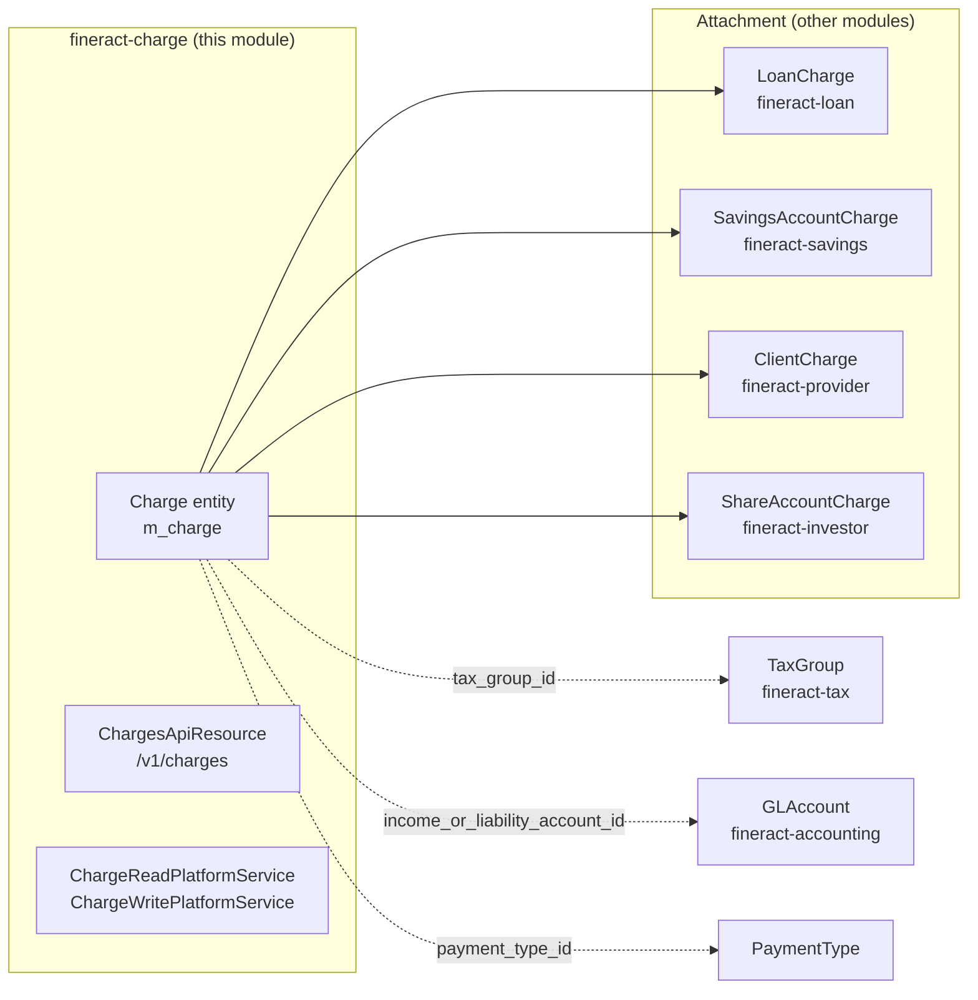
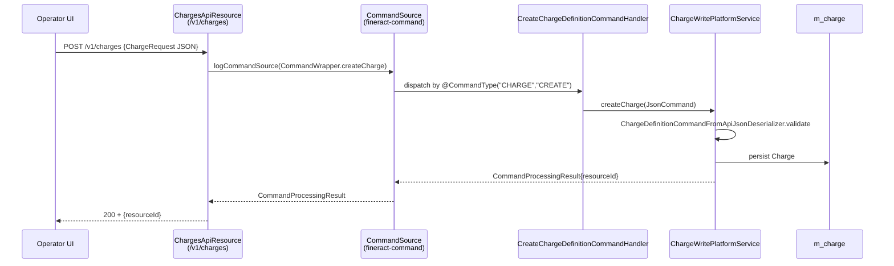
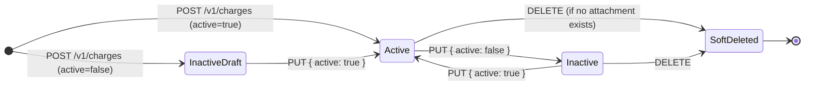
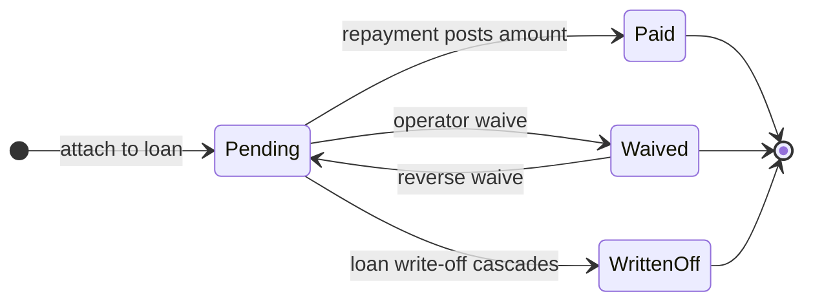
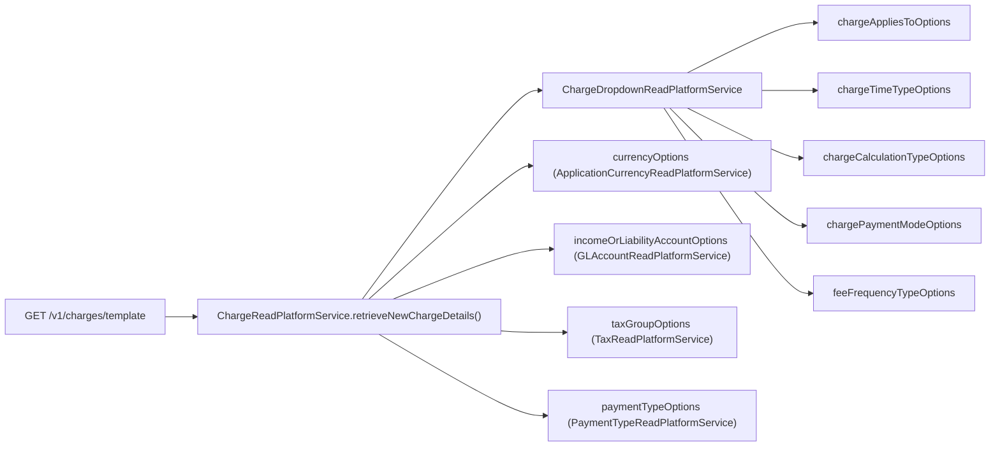

A **Charge** in Apache Fineract is the platform's single, unified abstraction for *any* extra cost attached to a financial product: origination fees, annual service fees, monthly maintenance fees, withdrawal fees, late-payment penalties, overdue installment penalties, share-purchase fees, and so on. The [`fineract-charge`](https://github.com/apache/fineract/tree/develop/fineract-charge) Gradle module owns the definition (the *catalogue* of reusable fee templates), while the actual *attachment* of a charge to a concrete loan, savings, client or share account lives in the respective portfolio modules (`fineract-loan`, `fineract-savings`, etc.). This page is the map of what `fineract-charge` provides; the next page ([Charge Domain and API](/charges/charge-domain-and-api)) drills into the `Charge` entity and the REST resource that backs `/v1/charges`.

The module's Tag description, declared on `ChargesApiResource`, states the intent directly:

> Its typical for MFIs to add extra costs for their financial products. These are typically Fees or Penalties. A Charge on fineract platform is what we use to model both Fees and Penalties. At present we support defining charges for use with Client accounts and both loan and saving products.
> — `fineract-charge/src/main/java/org/apache/fineract/portfolio/charge/api/ChargesApiResource.java`

## Where it sits



A `Charge` row is reusable: one definition can be attached to many product templates and many account instances. Each attachment captures the **amount as it was at the moment of attachment**, so later edits to the catalogue do not retroactively rewrite past loan schedules — this is enforced by `Charge.update(...)` rejecting certain parameter changes once the charge is referenced.

## Package layout

The module lives entirely under `fineract-charge/src/main/java/org/apache/fineract/portfolio/charge/`:

| Subpackage | Purpose |
|------------|---------|
| `api/` | `ChargesApiResource` (`/v1/charges`), `ChargesApiConstants` parameter names, Swagger DTOs |
| `domain/` | `Charge` JPA entity, the four enum value objects (`ChargeAppliesTo`, `ChargeCalculationType`, `ChargePaymentMode`, plus `ChargeTimeType` from `fineract-core`), and the `ChargeRepository`/`ChargeRepositoryWrapper` pair |
| `exception/` | 16 typed exceptions: not-found, can-not-be-applied, can-not-be-deleted, can-not-be-updated, due-at-disbursement-can-not-be-penalty, is-not-active, must-be-penalty, plus loan-charge and share-charge specific ones |
| `handler/` | The three command handlers wired to `CHARGE/CREATE`, `CHARGE/UPDATE`, `CHARGE/DELETE` via `@CommandType` |
| `request/` | `ChargeRequest` — Lombok-`@Data` DTO mirroring the create/update JSON body |
| `serialization/` | `ChargeDefinitionCommandFromApiJsonDeserializer` — validates the JSON command against allowed parameters |
| `service/` | Read/write platform services, dropdown service for the template endpoint, and `ChargeEnumerations` that turns int enum codes into `EnumOptionData` |

Note that `ChargeTimeType` is defined in `fineract-core/src/main/java/org/apache/fineract/portfolio/charge/domain/ChargeTimeType.java`, not in this module, because loan/savings/share modules need to depend on it without taking a dependency on `fineract-charge`.

## What a Charge actually models

A `Charge` is a tuple of:

1. **Identity** — `name` (unique constraint `name` on table `m_charge`), `currencyCode`, `active`/`deleted` flags.
2. **What it applies to** — `chargeAppliesTo` enum: `LOAN(1)`, `SAVINGS(2)`, `CLIENT(3)`, `SHARES(4)`.
3. **When it fires** — `chargeTimeType` enum: disbursement, specified due date, savings activation/closure, withdrawal, annual, monthly, weekly, instalment fee, overdue instalment, overdraft, tranche disbursement, share activation/purchase/redeem, savings no-activity. (See [Charge Domain and API](/charges/charge-domain-and-api) for the full table.)
4. **How the amount is computed** — `chargeCalculation` enum: `FLAT(1)`, `PERCENT_OF_AMOUNT(2)`, `PERCENT_OF_AMOUNT_AND_INTEREST(3)`, `PERCENT_OF_INTEREST(4)`, `PERCENT_OF_DISBURSEMENT_AMOUNT(5)`, plus the literal `amount` and optional `minCap`/`maxCap`.
5. **How it is paid** — `chargePaymentMode` enum: `REGULAR(0)` (debit from the account/cash) or `ACCOUNT_TRANSFER(1)` (settle via an inter-account transfer).
6. **Recurrence & schedule** — `feeOnDay`/`feeOnMonth` for annual/monthly anchoring, `feeInterval`, `feeFrequency` (uses `PeriodFrequencyType` from `fineract-core/.../portfolio/common/domain/`), plus `restartFrequency` for free-withdrawal windows.
7. **Fee or penalty?** — `penalty` boolean. Penalties post to a different accounting bucket and have stricter rules (a penalty cannot be due at disbursement — see `ChargeDueAtDisbursementCannotBePenaltyException`).
8. **Free-withdrawal counter** — `enableFreeWithdrawal` and `freeWithdrawalFrequency` for the "N free withdrawals per period" pattern.
9. **Accounting wiring** — `account` (`@ManyToOne GLAccount` on `income_or_liability_account_id`). For income-type charges this is the income GL; for liabilities (e.g. some withdrawal fees) it is the liability GL.
10. **Tax** — optional `taxGroup` (`@ManyToOne TaxGroup`) that decomposes the gross fee into VAT/GST/etc. components. See the [Tax overview](/tax/overview).
11. **Payment-type binding** — optional `paymentType` (`@ManyToOne PaymentType`) and `enablePaymentType` flag, used to fire a charge only on a specific payment channel (e.g. "ATM withdrawal fee" but not "branch withdrawal fee").

The full schema is the `m_charge` table; the entity is `fineract-charge/src/main/java/org/apache/fineract/portfolio/charge/domain/Charge.java`.

## Time vs. amount vs. balance-percent — the three calculation families

The `ChargeCalculationType` and `ChargeTimeType` enums together describe a 2-D matrix of what a charge can be. Three families dominate:

<CardGroup cols={3}>
  <Card title="Flat (time-triggered)" icon="dollar-sign">
    A fixed money amount fires at a specific event. Examples: USD 5 monthly fee, USD 25 specified-due-date fee, USD 10 share-activation fee. Calculation type `FLAT(1)`.

    Required-vs-allowed rules are enforced by `ChargeCalculationType.isAllowed*` helpers — e.g. client charges must be `FLAT`, share-account activation charges must be `FLAT`.
  </Card>
  <Card title="Percent of amount" icon="percent">
    A percentage of an account-derived figure. Loan charges support `PERCENT_OF_AMOUNT(2)` (principal), `PERCENT_OF_AMOUNT_AND_INTEREST(3)`, `PERCENT_OF_INTEREST(4)`, `PERCENT_OF_DISBURSEMENT_AMOUNT(5)`. Savings supports only `PERCENT_OF_AMOUNT`.

    `Charge.amount` holds the percentage (e.g. `2.5` for 2.5%). `minCap`/`maxCap` bracket the resulting money amount.
  </Card>
  <Card title="Balance / recurring" icon="rotate">
    Recurring fees keyed off a balance or a calendar — annual fee, monthly fee, weekly fee, overdraft fee, savings-no-activity fee. The `feeOnDay`/`feeOnMonth` pair anchors the annual/monthly fee to a `MonthDay`; `feeInterval` and `feeFrequency` describe sub-monthly recurrence.
  </Card>
</CardGroup>

The validity table is hard-coded in `ChargeCalculationType` and `ChargeTimeType`:

| Charge applies to | Valid `chargeCalculationType` values | Valid `chargeTimeType` values |
|-------------------|--------------------------------------|-------------------------------|
| `LOAN(1)` | `FLAT`, `PERCENT_OF_AMOUNT`, `PERCENT_OF_AMOUNT_AND_INTEREST`, `PERCENT_OF_INTEREST`, `PERCENT_OF_DISBURSEMENT_AMOUNT` | `DISBURSEMENT(1)`, `SPECIFIED_DUE_DATE(2)`, `INSTALMENT_FEE(8)`, `OVERDUE_INSTALLMENT(9)`, `TRANCHE_DISBURSEMENT(12)` |
| `SAVINGS(2)` | `FLAT`, `PERCENT_OF_AMOUNT` | `SPECIFIED_DUE_DATE(2)`, `SAVINGS_ACTIVATION(3)`, `SAVINGS_CLOSURE(4)`, `WITHDRAWAL_FEE(5)`, `ANNUAL_FEE(6)`, `MONTHLY_FEE(7)`, `OVERDRAFT_FEE(10)`, `WEEKLY_FEE(11)`, `SAVINGS_NOACTIVITY_FEE(16)` |
| `CLIENT(3)` | `FLAT` only | `SPECIFIED_DUE_DATE(2)` |
| `SHARES(4)` | `FLAT`, `PERCENT_OF_AMOUNT` (purchase/redeem); `FLAT` only for activation | `SHAREACCOUNT_ACTIVATION(13)`, `SHARE_PURCHASE(14)`, `SHARE_REDEEM(15)` |

Source: `ChargeCalculationType.validValuesForLoan()`, `validValuesForSavings()`, `validValuesForClients()`, `validValuesForShares()`, `validValuesForShareAccountActivation()`, `validValuesForTrancheDisbursement()` and the matching `ChargeTimeType.validLoanValues()` / `validSavingsValues()` methods.

## How a Charge is consumed



Once persisted, the catalogue row is referenced from:

- **Loan products** (`m_product_loan_charge` join, `LoanProduct.charges`): the product template lists the charges that *can* (or, when `is_mandatory`, *must*) be added to any loan derived from the product.
- **Loan accounts** (`m_loan_charge`, `LoanCharge` in `fineract-loan`): the snapshot of the charge at the moment it was attached to a specific loan. `LoanCharge` *copies* the percentage, the amount, the `chargeTimeType` and `chargeCalculation`, so later changes to the catalogue do not rewrite history.
- **Savings products / accounts** (`m_savings_product_charge`, `m_savings_account_charge`).
- **Share products / accounts** (`m_share_product_charge`, `m_share_account_charge`).
- **Clients directly** (`m_client_charge`).

The reverse navigation (which loans use this charge?) is *not* exposed by the entity — it is intentionally one-directional, with reference checks done at delete time by `ChargeWritePlatformService.deleteCharge(...)` raising `ChargeCannotBeDeletedException` if any join row references the id.

## Exception catalogue

The `exception/` package is a useful reading list because each class documents one validation rule:

- `ChargeNotFoundException` — id unknown.
- `ChargeCannotBeAppliedToException` — calculation/time combination is illegal for the chosen `chargeAppliesTo`.
- `ChargeCannotBeDeletedException` / `ChargeCannotBeUpdatedException` — the charge is referenced or fields are immutable after first reference (e.g. `chargeAppliesTo`, `currencyCode`, `taxGroupId`).
- `ChargeDueAtDisbursementCannotBePenaltyException` — `chargeTimeType == DISBURSEMENT` + `penalty == true` is rejected.
- `ChargeMustBePenaltyException` — used by `OVERDUE_INSTALLMENT` which is penalty-only.
- `ChargeIsNotActiveException` — cannot attach a deactivated charge.
- `LoanChargeCannotBeAddedException`, `LoanChargeCannotBeDeletedException`, `LoanChargeCannotBePayedException`, `LoanChargeCannotBeUpdatedException`, `LoanChargeCannotBeWaivedException`, `LoanChargeWaiveCannotBeReversedException`, `LoanChargeNotFoundException`, `LoanChargeWithoutMandatoryFieldException` — these belong to the `LoanCharge` (attachment) lifecycle and are raised from `fineract-loan` services but live here because they reference the catalogue entity in their messages.
- `ShareAccountChargeWithoutMandatoryFieldException` — symmetric rule for shares.

All exceptions extend the platform's `AbstractPlatformResourceNotFoundException` / `AbstractPlatformDomainRuleException` hierarchy from `fineract-core`, so they map deterministically to 404 / 403 / 400 in `org.apache.fineract.infrastructure.core.exceptionmapper`.

## Wiring summary

- **Spring discovery**: `ChargesApiResource` is `@Component` + JAX-RS `@Path("/v1/charges")`; it is auto-registered by the Jersey configuration in `fineract-provider/.../infrastructure/core/jersey/`.
- **Command handlers**: each `@CommandType(entity="CHARGE", action=...)` is picked up by `CommandHandlerProvider` in `fineract-command`; the routing happens at `PortfolioCommandSourceWritePlatformService.logCommandSource(...)` → `SynchronousCommandProcessingService.processAndLogCommand(...)`.
- **Read path**: `ChargeReadPlatformService` is JDBC-backed (`JdbcTemplate` + `RowMapper`) and returns the `ChargeData` API DTO directly. The template endpoint composes options (`chargeAppliesTo`, `chargeTimeType`, `chargeCalculation`, `chargePaymentMode`, `feeFrequency`, GL account dropdown, tax-group dropdown) via `ChargeDropdownReadPlatformService` and `ChargeEnumerations`.
- **Tax decomposition**: when an attachment posts to ledgers (in `fineract-loan` / `fineract-savings`), it consults `Charge.taxGroup` and invokes `TaxUtils.splitTax(...)` (see [Tax Component and Group](/tax/tax-component-and-group)) to break the gross amount into `TaxComponent` debit/credit entries.

## What's *not* in `fineract-charge`

To keep the dependency graph clean, the following live elsewhere:

- `LoanCharge`, `LoanInstallmentCharge`, `LoanTrancheDisbursementCharge` — `fineract-loan/.../portfolio/loanaccount/domain/`.
- `SavingsAccountCharge`, `SavingsAccountChargePaidBy` — `fineract-savings/.../portfolio/savings/domain/`.
- `ClientCharge`, `ClientTransaction` — `fineract-provider/.../portfolio/client/domain/`.
- `ShareAccountCharge` — `fineract-investor/.../portfolio/shareaccounts/domain/`.
- The `ChargeTimeType` enum itself — `fineract-core/.../portfolio/charge/domain/ChargeTimeType.java`, so loan/savings/share modules can import it without a circular dep on the charge module.
- Accounting postings — `fineract-accounting`, driven by `ProductToGLAccountMapping` rows that reference both `Charge.id` and the income/liability GL.

## Lifecycle of a charge — catalogue and attachment

The catalogue (`m_charge`) and attachment lifecycles are deliberately decoupled. Two distinct state diagrams:



The attachment lifecycle (`LoanCharge`, `SavingsAccountCharge`, etc.) is owned by the consuming module and is orthogonal. A typical loan-charge journey looks like:



Each transition on the right-hand diagram is gated by typed exceptions (`LoanChargeCannotBePayedException`, `LoanChargeCannotBeWaivedException`, `LoanChargeWaiveCannotBeReversedException`, `LoanChargeCannotBeDeletedException`). These live in `fineract-charge/.../exception/` rather than `fineract-loan/` because they reference the catalogue entity in their messages.

## Read-path and write-path services

The `service/` package separates concerns cleanly:

| File | Role |
|------|------|
| `ChargeReadPlatformService.java` (interface) | All queries against `m_charge`. Implementation lives in `fineract-provider` and is JDBC-backed (`JdbcTemplate`); it composes `ChargeData` directly off SQL row mappers, **never** loading the JPA entity for reads. |
| `ChargeWritePlatformService.java` (interface) | The three mutation paths used by command handlers: `createCharge(JsonCommand)`, `updateCharge(Long chargeId, JsonCommand)`, `deleteCharge(Long chargeId)`. The implementation also lives in `fineract-provider`; it owns the JSON validation call, the optional GLAccount/TaxGroup/PaymentType lookups, and the `chargeRepository.saveAndFlush(...)` call. |
| `ChargeDropdownReadPlatformService.java` | Specialised read service used only by the template endpoint. Returns the four `List<EnumOptionData>` dropdowns (`chargeAppliesTo`, `chargeTimeType`, `chargeCalculationType`, `chargePaymentMode`) plus the `feeFrequencyType` list. |
| `ChargeEnumerations.java` | Static `EnumOptionData` factory — the canonical place to convert an int charge enum back to its `{id, code, value}` DTO shape consumed by the API serializer. |

The "read = JDBC, write = JPA" split is the standard Apache Fineract pattern. Reads are flattened (no lazy associations to chase) and fast; writes go through the entity to keep invariants and audit metadata coherent.

## Template endpoint: `GET /v1/charges/template`

The template endpoint is its own thing worth calling out because every operator-facing UI hits it on form load:



The returned `ChargeData` has all scalar fields null but its option lists populated. Combined with `GET /v1/charges/{id}?template=true` (which merges the single-charge data *with* the template lists), this is the contract that the legacy and Mifos X UIs rely on for the edit screens.

## Soft-delete and the `m_loan_charge` snapshot pattern

`Charge.deleted` is the field that the DELETE command flips:

```java
@Column(name = "is_deleted", nullable = false)
private boolean deleted = false;
```

`ChargeWritePlatformService.deleteCharge(Long)` first checks whether the row is referenced by any of the four attachment join tables. If yes, it raises `ChargeCannotBeDeletedException`. If no, it sets `deleted = true` (and typically `active = false`) and persists. The row stays in `m_charge` forever — there is no garbage-collection job.

This matters because **the snapshot pattern** in the attachment tables makes it possible to safely retain the catalogue row. A `LoanCharge` (in `fineract-loan/.../portfolio/loanaccount/domain/LoanCharge.java`) copies, at attachment time, the values that determine its math: `amount`, `amountOrPercentage`, `amountPaid`, `amountWaived`, `amountWrittenOff`, `chargeTimeType`, `chargeCalculation`, `chargePaymentMode`, `taxGroup`, `dueDate`. So even if the catalogue row is later soft-deleted or its percentage changes, the existing loan continues to compute its installments off the locked-in numbers. The reverse — *new* loans cannot attach to a deleted charge — is enforced by `ChargeIsNotActiveException`.

## Repository wrapper

A small but important class: `fineract-charge/.../domain/ChargeRepositoryWrapper.java`. The pattern (used everywhere in Fineract) is that `ChargeRepository` extends Spring Data's `JpaRepository<Charge, Long>` and is *only* used by the wrapper. The wrapper layers the "not-found" exception behaviour on top:

```java
public Charge findOneWithNotFoundDetection(final Long id) {
    return this.repository.findById(id).orElseThrow(() -> new ChargeNotFoundException(id));
}
```

So every service that needs a `Charge` by id calls `chargeRepositoryWrapper.findOneWithNotFoundDetection(id)` and gets either a managed entity or a typed exception with no try/catch. There is no need to inject the raw `JpaRepository` outside the wrapper.

## Permissions

The catalogue uses `RESOURCE_NAME_FOR_PERMISSIONS = "CHARGE"` (declared at the top of `ChargesApiResource`). At the Jersey layer the read methods explicitly call `context.authenticatedUser().validateHasReadPermission(RESOURCE_NAME_FOR_PERMISSIONS)`. The write methods don't — but they don't need to, because the `PortfolioCommandSourceWritePlatformService` audit layer checks the matching `*_CHARGE` permission on the authenticated user before the handler runs. The action permissions are:

- `READ_CHARGE` — list, retrieve, template
- `CREATE_CHARGE` — POST
- `UPDATE_CHARGE` — PUT
- `DELETE_CHARGE` — DELETE

A second tier of checker permissions (`CREATE_CHARGE_CHECKER`, `UPDATE_CHARGE_CHECKER`, `DELETE_CHARGE_CHECKER`) gates the maker-checker workflow when the catalogue mutation is queued for a second-pair-of-eyes approval. The maker-checker plumbing is in `fineract-command`; this module only ever sees the resolved command.

## Liquibase changelog footprint

The `m_charge` schema is created and migrated by changesets under `fineract-provider/src/main/resources/db/changelog/tenant/`. Notable historical entries:

- Initial table creation: early 2014 changesets that established `m_charge` with `is_penalty`, `is_active`, `is_deleted`.
- `chargeAppliesTo`, `chargeTimeType`, `chargeCalculation` enum columns added incrementally with `NOT NULL` constraints and default values for backfill.
- Tax integration: `tax_group_id FK m_tax_group(id)` added when `fineract-tax` was introduced.
- Free-withdrawal columns (`is_free_withdrawal`, `free_withdrawal_charge_frequency`, `restart_frequency`, `restart_frequency_enum`) added later for the savings free-withdrawal model.
- Payment-type columns (`is_payment_type`, `payment_type_id FK m_payment_type(id)`) added with the payment-channel-specific fee feature.

If you're chasing a column's origin, the convention is to `grep` the changelog directory for the column name — Liquibase changesets are XML, one file per logical migration, all named `<feature>.xml`.

Attachment permissions are owned by the consuming modules: `CREATE_LOANCHARGE`, `UPDATE_LOANCHARGE`, `WAIVE_LOANCHARGE`, `PAY_LOANCHARGE`, and the symmetric set for savings and shares.

## Where to read next

<CardGroup cols={2}>
  <Card title="Charge domain & API" icon="code" href="/charges/charge-domain-and-api">
    The `Charge` JPA entity field-by-field, the four enums and their valid combinations, the REST endpoints on `/v1/charges`, and the three command handlers.
  </Card>
  <Card title="Tax overview" icon="receipt" href="/tax/overview">
    How `TaxGroup` plugs into `Charge.taxGroup` to decompose a gross fee into VAT/GST components.
  </Card>
  <Card title="Floating rates" icon="chart-line" href="/rates/floating-rates">
    The other percentage-bearing curve in the platform — but for interest indexes, not for fees.
  </Card>
  <Card title="Rate API & handlers" icon="percent" href="/rates/rate-api-and-handlers">
    A different `Rate` entity — flat percentage adjustments for loans, complementary to the `Charge` story.
  </Card>
</CardGroup>
