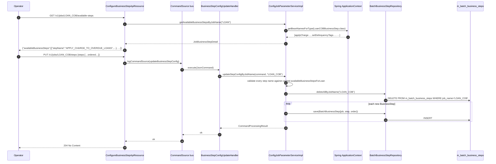

The Close-of-Business (COB) engine in Apache Fineract is built around one extension point: **the business step**. A business step is a small, idempotent unit of per-account end-of-day work — "apply overdue charge", "classify delinquency", "post accruals" — written as a plain Spring `@Component`. The COB engine knows nothing about loans or savings specifically; it knows how to look up every bean that implements an asset-specific sub-interface of `COBBusinessStep<T>`, sort them by the tenant's configured `step_order`, and call them in order against one account at a time.

This page deep-dives the asset-agnostic framework that makes that possible: the interface, the registry, the configuration entity, the REST surface, the exceptions, and the per-tenant ordering model.

## The `COBBusinessStep` interface

The whole system pivots on one tiny interface:

```java fineract-cob/src/main/java/org/apache/fineract/cob/COBBusinessStep.java
package org.apache.fineract.cob;

import org.apache.fineract.infrastructure.core.domain.AbstractPersistableCustom;

public interface COBBusinessStep<T extends AbstractPersistableCustom<Long>> {

    T execute(T input);

    String getEnumStyledName();

    String getHumanReadableName();
}
```

Three methods, all of them load-bearing:

| Method | Role |
| --- | --- |
| `T execute(T input)` | Take one account aggregate (a `Loan`, a `SavingsAccount`, a `WorkingCapitalLoan`) and mutate it according to this step. Return the same instance so the next step in the chain can keep operating on it. |
| `String getEnumStyledName()` | The stable, machine-readable identifier of the step, e.g. `"APPLY_CHARGE_TO_OVERDUE_LOANS"`. This is what gets stored in `m_batch_business_steps.step_name`. **Never change the value** once a step has shipped — tenants will have rows referring to it. |
| `String getHumanReadableName()` | A free-form English label, used by the UI / Swagger / `/v1/jobs/{jobName}/available-steps` to describe the step to operators. |

The `T extends AbstractPersistableCustom<Long>` bound is the link to Fineract's JPA layer (see `core/infrastructure-core`): every aggregate that COB processes is a Long-IDed JPA entity. That makes the engine generic without any reflection — Spring's typed bean lookup (`beanFactory.getBeanNamesForType(Class<T>)`) does the type filtering.

### Per-asset sub-interfaces

Each asset module narrows the generic with its own one-line sub-interface:

```java fineract-loan/src/main/java/org/apache/fineract/cob/loan/LoanCOBBusinessStep.java
package org.apache.fineract.cob.loan;
public interface LoanCOBBusinessStep extends COBBusinessStep<Loan> {}
```

```java fineract-savings/src/main/java/org/apache/fineract/cob/savings/SavingsCOBBusinessStep.java
package org.apache.fineract.cob.savings;
public interface SavingsCOBBusinessStep extends COBBusinessStep<SavingsAccount> {}
```

```java fineract-working-capital-loan/.../businessstep/WorkingCapitalLoanCOBBusinessStep.java
package org.apache.fineract.cob.workingcapitalloan.businessstep;
public abstract class WorkingCapitalLoanCOBBusinessStep implements COBBusinessStep<WorkingCapitalLoan> {}
```

This is what lets `COBBusinessStepServiceImpl.getCOBBusinessSteps(LoanCOBBusinessStep.class, "LOAN_COB")` ask Spring for "every bean that implements `LoanCOBBusinessStep`" and get back exactly the loan steps — no scanning the entire `ApplicationContext`. Working-capital uses an `abstract class` instead of an interface for the same purpose; the marker semantics are identical.

## The `BatchBusinessStep` configuration entity

The ordered list of steps that should actually run is **not** in code — it's a per-tenant table:

```java fineract-cob/src/main/java/org/apache/fineract/cob/domain/BatchBusinessStep.java
@Entity
@Table(name = "m_batch_business_steps")
@NoArgsConstructor
@Getter
@Setter
public class BatchBusinessStep extends AbstractPersistableCustom<Long> {

    @Column(name = "job_name",   nullable = false) private String jobName;
    @Column(name = "step_name",  nullable = false) private String stepName;
    @Column(name = "step_order", nullable = false) private Long stepOrder;
}
```

Three columns:

- `job_name` — the COB job this step belongs to (`"LOAN_COB"`, `"WC_LOAN_COB"`, etc.).
- `step_name` — the `getEnumStyledName()` value of a registered step.
- `step_order` — a `Long` that defines the relative execution order. The framework treats `step_order` as a sort key; tenants typically use `1, 2, 3, …` but the column is a `Long` so they can insert between two existing steps with `1, 1.5, 2, 3` style numbering.

The repository contract is small:

```java fineract-cob/src/main/java/org/apache/fineract/cob/domain/BatchBusinessStepRepository.java
public interface BatchBusinessStepRepository
        extends JpaRepository<BatchBusinessStep, Long>, JpaSpecificationExecutor<BatchBusinessStep> {

    List<BatchBusinessStep> findAllByJobName(String jobName);

    @Query("SELECT DISTINCT bbs.jobName FROM BatchBusinessStep bbs")
    List<String> findConfiguredJobNames();

    void deleteAllByJobName(String jobName);
}
```

`deleteAllByJobName` is used by the PUT endpoint: replacing the configured order is a destructive overwrite, not a merge.

## The registry pattern: `COBBusinessStepService`

`COBBusinessStepService` is the asset-agnostic "go run the steps" service. The contract:

```java fineract-cob/src/main/java/org/apache/fineract/cob/COBBusinessStepService.java
public interface COBBusinessStepService {

    <T extends COBBusinessStep<S>, S extends AbstractPersistableCustom<Long>>
        S run(TreeMap<Long, String> executionMap, S item);

    @NonNull
    <T extends COBBusinessStep<S>, S extends AbstractPersistableCustom<Long>>
        Set<BusinessStepNameAndOrder> getCOBBusinessSteps(Class<T> businessStepClass, String cobJobName);
}
```

Two operations, one for the planning phase and one for the execution phase:

### `getCOBBusinessSteps(class, jobName)` — planning

Called once **at partition time** (by `CommonPartitioner` — see `core/spring-batch` for the partitioning model) to figure out which steps will run and in what order. The implementation:

1. Fetches every `BatchBusinessStep` row for that job name from the DB.
2. Asks Spring `beanFactory.getBeanNamesForType(businessStepClass)` for every bean implementing the asset sub-interface (e.g. `LoanCOBBusinessStep`).
3. For each bean, checks whether the DB has a config row whose `step_name` matches the bean's `getEnumStyledName()`. If yes, pairs the Spring bean name with the configured `step_order` and adds it to the result set.

```java fineract-cob/src/main/java/org/apache/fineract/cob/COBBusinessStepServiceImpl.java
public <T extends COBBusinessStep<S>, S extends AbstractPersistableCustom<Long>>
        Set<BusinessStepNameAndOrder> getCOBBusinessSteps(Class<T> businessStepClass, String cobJobName) {
    List<BatchBusinessStep> cobStepConfigs = batchBusinessStepRepository.findAllByJobName(cobJobName);
    List<String> businessSteps = Arrays.stream(beanFactory.getBeanNamesForType(businessStepClass)).toList();
    Set<BusinessStepNameAndOrder> executionMap = new HashSet<>();
    for (String businessStep : businessSteps) {
        COBBusinessStep<S> businessStepBean = (COBBusinessStep<S>) applicationContext.getBean(businessStep);
        Optional<BatchBusinessStep> businessStepConfig = cobStepConfigs.stream()
                .filter(stepConfig -> businessStepBean.getEnumStyledName().equals(stepConfig.getStepName()))
                .findFirst();
        businessStepConfig.ifPresent(b -> executionMap.add(new BusinessStepNameAndOrder(businessStep, b.getStepOrder())));
    }
    return executionMap;
}
```

The result is a `Set<BusinessStepNameAndOrder>` where each element pairs the **Spring bean name** (not the enum-styled name) with the `step_order`. That's the payload that gets serialized into Spring Batch's per-partition `ExecutionContext` under the `COBConstant.BUSINESS_STEPS` key.

### `run(executionMap, item)` — execution

When a worker pulls an item off its channel, it has already built a `TreeMap<Long, String>` from the `BusinessStepNameAndOrder` set — keyed by `step_order`, mapping to the Spring bean name. The `TreeMap` guarantees iteration in numeric `step_order` ascending order. Then:

```java fineract-cob/src/main/java/org/apache/fineract/cob/COBBusinessStepServiceImpl.java
public <T extends COBBusinessStep<S>, S extends AbstractPersistableCustom<Long>>
        S run(TreeMap<Long, String> executionMap, S item) {
    if (executionMap == null || executionMap.isEmpty()) {
        throw new BusinessStepException("Execution map is empty! COB Business step execution skipped!");
    }
    boolean bulkEventEnabled = configurationDomainService.isCOBBulkEventEnabled();
    try {
        if (bulkEventEnabled) {
            businessEventNotifierService.startExternalEventRecording();
        }
        for (String businessStep : executionMap.values()) {
            try {
                ThreadLocalContextUtil.setActionContext(ActionContext.COB);
                COBBusinessStep<S> businessStepBean = (COBBusinessStep<S>) applicationContext.getBean(businessStep);
                item = reloaderService.reload(item);
                item = businessStepBean.execute(item);
            } catch (Exception e) {
                throw new BusinessStepException("Error happened during business step execution", e);
            } finally {
                ThreadLocalContextUtil.setActionContext(ActionContext.COB);
            }
        }
        if (bulkEventEnabled) {
            businessEventNotifierService.stopExternalEventRecording();
        }
    } catch (Exception e) {
        if (bulkEventEnabled) {
            businessEventNotifierService.resetEventRecording();
        }
        throw e;
    }
    return item;
}
```

Three things to notice:

1. **`ActionContext.COB`** is set before every step. Many platform services check `ThreadLocalContextUtil.getActionContext()` to skip work that doesn't make sense in COB (e.g. user notifications, command audit) or to gate behaviour. The `finally` block guarantees the context is restored even if a step accidentally mutates it.
2. **`reloaderService.reload(item)`** is called between every two steps. This is critical: the item travelled through the previous step's transaction boundary; by the time the next step starts, the persistence context may be different. `ReloaderService` re-loads the same Long ID and returns the managed entity.
3. **Bulk event recording.** If the tenant has `isCOBBulkEventEnabled()` set, `BusinessEventNotifierService.startExternalEventRecording()` buffers every business event emitted by every step into one bulk event flushed at the end of the chain (see `command/maker-checker-and-audits` for how that interacts with the command bus). On error, `resetEventRecording()` discards the buffer so no half-state escapes.

## Data classes used by the framework

These are pure DTOs but they show up everywhere in the engine, so it's worth knowing them.

```text fineract-cob/src/main/java/org/apache/fineract/cob/data/
BusinessStep.java                 ← { String stepName, Long order }            — request/response shape
BusinessStepDetail.java           ← { String stepName, String stepDescription} — "available-steps" response
BusinessStepNameAndOrder.java     ← { String stepName, Long stepOrder }        — Spring bean name + order
JobBusinessStepConfigData.java    ← { String jobName, List<BusinessStep> }     — GET /steps response
JobBusinessStepDetail.java        ← { String jobName, List<BusinessStepDetail>}— GET /available-steps response
ConfiguredJobNamesDTO.java        ← { List<String> jobNames }                  — GET /names response
```

```text fineract-provider/src/main/java/org/apache/fineract/cob/data/request/
BusinessStepRequest.java          ← request body for PUT /v1/jobs/{jobName}/steps
```

## The configuration REST API

`ConfigureBusinessStepApiResource` (under `/v1/jobs`) is how operators see and change which steps run. It is a thin wrapper around `ConfigJobParameterService`:

```java fineract-provider/src/main/java/org/apache/fineract/cob/api/ConfigureBusinessStepApiResource.java
@Path("/v1/jobs")
@Component
@Tag(name = "Business Step Configuration")
@RequiredArgsConstructor
public class ConfigureBusinessStepApiResource {

    @GET @Path("/names")
    public ConfiguredJobNamesDTO retrieveAllConfiguredBusinessJobs() {
        return new ConfiguredJobNamesDTO(configJobParameterService.getAllConfiguredJobNames());
    }

    @GET @Path("{jobName}/steps")
    public JobBusinessStepConfigData retrieveAllConfiguredBusinessStep(@PathParam("jobName") String jobName) {
        return configJobParameterService.getBusinessStepConfigByJobName(jobName);
    }

    @PUT @Path("{jobName}/steps")
    public Response updateJobBusinessStepConfig(@PathParam("jobName") String jobName, BusinessStepRequest req) {
        CommandWrapper cmd = new CommandWrapperBuilder().updateBusinessStepConfig(jobName)
                .withJson(toApiJsonSerializer.serialize(req)).build();
        commandWritePlatformService.logCommandSource(cmd);
        return Response.status(Response.Status.NO_CONTENT).build();
    }

    @GET @Path("{jobName}/available-steps")
    public JobBusinessStepDetail retrieveAllAvailableBusinessStep(@PathParam("jobName") String jobName) {
        return configJobParameterService.getAvailableBusinessStepsByJobName(jobName);
    }
}
```

The endpoints:

| Method | Path | Purpose |
| --- | --- | --- |
| `GET` | `/v1/jobs/names` | All `job_name` values that currently have at least one configured step. Uses `BatchBusinessStepRepository.findConfiguredJobNames()`. |
| `GET` | `/v1/jobs/{jobName}/steps` | The current ordered configuration for `jobName`. |
| `PUT` | `/v1/jobs/{jobName}/steps` | Replace the whole configured step list for `jobName`. Goes through the **command bus** (see `command/overview`) for maker-checker. |
| `GET` | `/v1/jobs/{jobName}/available-steps` | Every `LoanCOBBusinessStep` Spring bean currently registered, regardless of whether it's configured. Use this to discover what you can add. |

Note that `PUT` does not directly hit the DB. It logs a `CommandSource` (see `command/command-implementation`). The actual mutation happens in `BusinessStepConfigUpdateHandler`, a command handler:

```text fineract-cob/src/main/java/org/apache/fineract/cob/service/BusinessStepConfigUpdateHandler.java
```

That hand-off makes step-order changes auditable and (if maker-checker is on for the action) approvable.

## `BusinessStepCategory` and discovery

When a `PUT` request comes in for `jobName=LOAN_COB`, how does the framework know which sub-interface of `COBBusinessStep` to look up beans for? It uses the `BusinessStepCategory` enum and a small `BusinessStepCategoryService`:

```java fineract-cob/src/main/java/org/apache/fineract/cob/service/BusinessStepCategory.java
public enum BusinessStepCategory {
    LOAN("LOAN");
    // …
    public static BusinessStepCategory getCategoryName(String categoryName) {
        return Arrays.stream(values()).filter(c -> categoryName.equals(c.name)).findAny()
            .orElseThrow(() -> new IllegalArgumentException("Category not found by name: " + categoryName));
    }
}
```

```java fineract-cob/src/main/java/org/apache/fineract/cob/service/BusinessStepCategoryService.java
public interface BusinessStepCategoryService {
    Class<? extends COBBusinessStep> getBusinessStepByCategory(String category);
}
```

The provider-module implementation `LoanBusinessStepCategoryServiceImpl` maps `"LOAN"` → `LoanCOBBusinessStep.class`. `ConfigJobParameterServiceImpl.afterPropertiesSet()` eagerly caches the loan available-steps at startup so PUT validation can run synchronously:

```java fineract-cob/src/main/java/org/apache/fineract/cob/service/ConfigJobParameterServiceImpl.java
@Override
public void afterPropertiesSet() throws Exception {
    availableBusinessStepsForLoan = getAvailableBusinessStepsByJobName(BusinessStepCategory.LOAN.name());
}
```

The update path validates the requested step names against this cached set and throws `BusinessStepException("… Business steps are not configurable for this job.")` if any unknown step shows up.

## End-to-end configuration sequence



## End-to-end execution sequence

```mermaid
sequenceDiagram
    autonumber
    participant P as CommonPartitioner (manager)
    participant SVC as COBBusinessStepService
    participant DB as m_batch_business_steps
    participant W as Worker (LoanItemProcessor)
    participant CTX as ApplicationContext
    participant RS as ReloaderService
    participant EV as BusinessEventNotifierService

    P->>SVC: getCOBBusinessSteps(LoanCOBBusinessStep.class, "LOAN_COB")
    SVC->>DB: findAllByJobName("LOAN_COB")
    DB-->>SVC: [{stepName:APPLY_…,order:1}, {stepName:LOAN_DELINQUENCY_CLASSIFICATION,order:2}, …]
    SVC-->>P: Set&lt;BusinessStepNameAndOrder&gt; (bean-name + order)
    P->>P: put set into partition ExecutionContext as "businessSteps"
    Note over W: worker receives partition, reads loans in [minId,maxId]
    loop each Loan
        W->>SVC: run(TreeMap&lt;order, beanName&gt;, loan)
        SVC->>EV: startExternalEventRecording() (if bulk enabled)
        loop ordered steps
            SVC->>CTX: getBean(beanName)
            CTX-->>SVC: bean
            SVC->>RS: reload(loan)
            RS-->>SVC: managed loan
            SVC->>bean: execute(loan)
            bean-->>SVC: loan
        end
        SVC->>EV: stopExternalEventRecording()
        SVC-->>W: loan
    end
```

## Exceptions

The framework defines a small exception family in `fineract-cob/.../exceptions/`:

| Exception | When thrown |
| --- | --- |
| `BusinessStepException` | Generic runtime failure inside the chain; wraps the cause. Also thrown when the execution map is empty. |
| `BusinessStepNotBelongsToJobException` | Used by validation paths when a step name doesn't apply to the requested job (the PUT path uses a more descriptive `BusinessStepException` instead, but the type exists for finer-grained handling). |
| `CustomJobParameterNotFoundException` | Raised by `CustomJobParameterResolver` when a job parameter the manager expects (e.g. `BusinessDate`, `IS_CATCH_UP`) is missing. |
| `LockCannotBeAppliedException` | Thrown by `ApplyCommonLockTasklet` when the per-account lock can't be obtained after retries — covered in `cob/loan-account-lock`. |
| `LockedReadException` | Thrown by the item reader when an account is already locked by someone else; intercepted by the listener so the chunk can skip it cleanly. |
| `AccountLockCannotBeOverruledException` | Raised when an inline-COB request hits a non-overrulable lock. |

`BusinessStepException` and `BusinessStepNotBelongsToJobException` are plain `RuntimeException` subclasses; the others extend either `RuntimeException` or checked `Exception`, depending on whether they're recoverable.

## Cross-cutting helpers in `common/` and `resolver/`

A handful of shared classes round out the framework:

```text fineract-cob/src/main/java/org/apache/fineract/cob/common/
CommonPartitioner.java              ← abstract per-asset partitioner; calls getCOBBusinessSteps + writes the ExecutionContext
CustomJobParameterResolver.java     ← reads custom params (BusinessDate, IS_CATCH_UP) from CustomJobParameter rows
ResetContextTasklet.java            ← tasklet that resets ThreadLocalContextUtil at flow end
```

```text fineract-cob/src/main/java/org/apache/fineract/cob/resolver/
BusinessDateResolver.java           ← LocalDate.parse(stepExecution.getExecutionContext().get("BusinessDate"))
CatchUpFlagResolver.java            ← Boolean.parseBoolean(… "IS_CATCH_UP")
```

`CommonPartitioner` is the abstract base every asset subclasses (e.g. `LoanCOBPartitioner`, `WorkingCapitalLoanCOBPartitioner`). It is responsible for:

```java fineract-cob/src/main/java/org/apache/fineract/cob/common/CommonPartitioner.java
public Map<String, ExecutionContext> getPartitions(int partitionSize, Set<BusinessStepNameAndOrder> cobBusinessSteps) {
    if (cobBusinessSteps.isEmpty()) {
        stopJobExecution();    // nothing to do — stop the job
        return Map.of();
    }
    LocalDate businessDate = BusinessDateResolver.resolve(stepExecution);
    boolean isCatchUp = CatchUpFlagResolver.resolve(stepExecution);
    List<COBPartition> partitions = new ArrayList<>(
        retrieveIdService.retrieveLoanCOBPartitions(numberOfDays, businessDate, isCatchUp, partitionSize));
    if (partitions.isEmpty()) { partitions.add(new COBPartition(0L, 0L, 1L, 0L)); }  // empty sentinel
    return partitions.stream().collect(Collectors.toMap(
        l -> COBConstant.PARTITION_PREFIX + l.getPageNo(),
        l -> createExecutionContextForPartition(cobBusinessSteps, l, businessDate, isCatchUp)));
}
```

So the planning flow is: resolve `BusinessDate` and `IS_CATCH_UP` from the step execution → ask the asset-specific `RetrieveIdService` for the list of `[minId..maxId]` partitions for that day → for each partition, build an `ExecutionContext` containing the steps to run + the partition's id range + the business date + the catch-up flag. Workers then pick those `ExecutionContext`s off the message channel.

`CustomJobParameterResolver` is what the manager step `resolveCustomJobParametersStep` uses to copy the launched job's `CUSTOM_JOB_PARAMETER_ID` (a row in `m_job_custom_parameter`) into named keys on the execution context — that's how the scheduler/REST caller passes `BusinessDate` and `IS_CATCH_UP` into the run.

## Constants

Everything the engine writes into the execution context uses string keys from `COBConstant`:

```java fineract-cob/src/main/java/org/apache/fineract/cob/COBConstant.java
public class COBConstant {
    public static final String BUSINESS_STEPS              = "businessSteps";
    public static final String BUSINESS_DATE_PARAMETER_NAME = "BusinessDate";
    public static final String IS_CATCH_UP_PARAMETER_NAME   = "IS_CATCH_UP";
    public static final String COB_CUSTOM_JOB_PARAMETER_KEY = "CUSTOM_JOB_PARAMETER_ID";
    public static final String INLINE_IDS_PARAMETER_NAME    = "LoanIds";
    public static final String COB_PARAMETER                = "loanCobParameter";
    public static final Long   NUMBER_OF_DAYS_BEHIND        = 1L;
    public static final String PARTITION_KEY                = "partition";
    public static final String PARTITION_PREFIX             = "partition_";
}
```

Each asset extends it with its own constants — see `LoanCOBConstant` and `WorkingCapitalLoanCOBConstant`.

## Authoring a new business step

The full recipe for shipping a new step:

1. **Pick the right sub-interface.** A loan step implements `LoanCOBBusinessStep`; a working-capital step extends `WorkingCapitalLoanCOBBusinessStep`; a savings step would implement `SavingsCOBBusinessStep`.
2. **Annotate `@Component`** so Spring picks it up. The bean name is its lowercased class name by default; the engine references beans by that name, so don't override it with `@Component("…")` unless you intend to.
3. **Pick a stable `getEnumStyledName()`** — `UPPER_SNAKE_CASE`, prefixed by domain if needed (e.g. `LOAN_DELINQUENCY_CLASSIFICATION`, `WC_BREACH_SCHEDULE`).
4. **Implement `execute(T input)`** — mutate the aggregate, persist what needs persisting, emit business events via `BusinessEventNotifierService.notify…`. Return the same instance.
5. **Idempotency.** Because catch-up may replay a step for the same loan/day, write steps so that running them twice for the same (loan, businessDate) yields the same result.
6. **Add it to the order.** It will show up in `GET /v1/jobs/LOAN_COB/available-steps` immediately. Add it to the configured list via `PUT /v1/jobs/LOAN_COB/steps`.

The `acme/loan/cob/AcmeNoopBusinessStep` under `custom/` is a worked example showing how a downstream distribution can plug in extra steps without forking core.

With the framework understood, the next pages enumerate every concrete step that ships with Apache Fineract — starting with `cob/loan-cob`.
