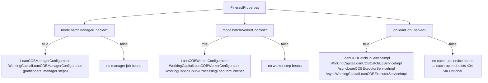
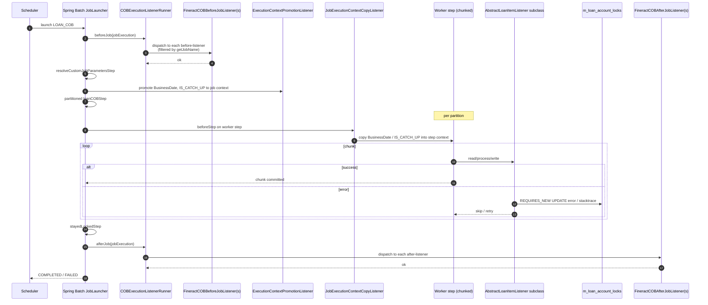
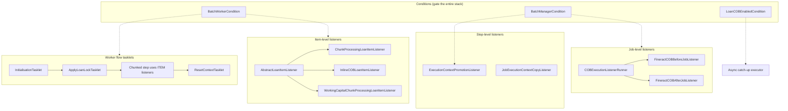

The Close-of-Business (COB) engine in Apache Fineract is wired with two cross-cutting concerns: **which beans should exist in this JVM** (controlled by Spring `Condition` classes evaluated against `FineractProperties`) and **how does the engine observe the job's lifecycle** (controlled by Spring Batch listener hooks). This page deep-dives both: every `Condition` that gates a COB bean, every listener that runs before/around/after the COB pipeline, and how they compose so that the same codebase can serve manager-only nodes, worker-only nodes, monolithic single nodes, and tenants who simply have COB disabled.

## Spring conditions: who creates which beans?

Spring's `@Conditional(SomeCondition.class)` annotation lets a `@Configuration` or `@Bean` opt out of being created based on a runtime predicate. The COB engine uses three conditions, all subclassing `PropertiesCondition`:

```java fineract-core/src/main/java/org/apache/fineract/infrastructure/core/condition/PropertiesCondition.java
public abstract class PropertiesCondition implements Condition {

    @Override
    public boolean matches(ConditionContext context, AnnotatedTypeMetadata metadata) {
        FineractProperties properties = SpringPropertiesFactory.get(context.getEnvironment(), FineractProperties.class);
        return matches(properties);
    }

    protected abstract boolean matches(FineractProperties properties);
}
```

The base class takes a one-off binding of `application.properties` to the strongly-typed `FineractProperties` POJO (see `runtime/spring-boot-configuration`) and delegates the actual predicate to a `protected abstract boolean matches(FineractProperties)`. This is the same pattern used elsewhere in the platform for instance-mode / multi-tenancy gating (see `runtime/instance-mode`).

### `BatchManagerCondition`

```java fineract-cob/src/main/java/org/apache/fineract/cob/conditions/BatchManagerCondition.java
public class BatchManagerCondition extends PropertiesCondition {
    @Override
    protected boolean matches(FineractProperties properties) {
        return properties.getMode().isBatchManagerEnabled();
    }
}
```

True when the deployment is configured as a Spring Batch **manager** node — i.e. the node that partitions COB work and dispatches partition messages onto `outboundRequests`. The property is `fineract.mode.batch-manager-enabled=true`.

This gates the entire manager-side configuration:

- `LoanCOBManagerConfiguration` — builds the partitioned `LOAN_COB` job, the partitioner step, the stayed-locked step, the custom-job-parameter resolver.
- `WorkingCapitalLoanCOBManagerConfiguration` — same for `WORKING_CAPITAL_LOAN_COB_JOB`.

If `batch-manager-enabled=false`, none of those `@Bean`s exist in this JVM — there is no `loanCOBJob` to launch from this node.

### `BatchWorkerCondition`

```java fineract-cob/src/main/java/org/apache/fineract/cob/conditions/BatchWorkerCondition.java
public class BatchWorkerCondition extends PropertiesCondition {
    @Override
    protected boolean matches(FineractProperties properties) {
        return properties.getMode().isBatchWorkerEnabled();
    }
}
```

True when this JVM is a Spring Batch **worker** node — the node that consumes partition messages off `inboundRequests`, applies the lock, runs the per-loan chain and writes back. The property is `fineract.mode.batch-worker-enabled=true`.

This gates everything on the worker side:

- `LoanCOBWorkerConfiguration` — wires the chunked step (reader + processor + writer + listener), the apply-lock tasklet, the reset-context tasklet, the `cobTaskExecutor` thread pool.
- `WorkingCapitalLoanCOBWorkerConfiguration` — same for WC.
- `WorkingCapitalChunkProcessingLoanItemListener` — itself annotated with `@Conditional(BatchWorkerCondition.class)`:

  ```java fineract-provider/src/main/java/org/apache/fineract/cob/listener/WorkingCapitalChunkProcessingLoanItemListener.java
  @Component
  @Conditional(BatchWorkerCondition.class)
  public class WorkingCapitalChunkProcessingLoanItemListener
          extends AbstractLoanItemListener<WorkingCapitalLoanAccountLock, WorkingCapitalLoan> {
      // …
      @Override protected LockOwner getLockOwner() { return LockOwner.LOAN_COB_CHUNK_PROCESSING; }
  }
  ```

### Manager / worker matrix

The two flags compose:

| `batch-manager-enabled` | `batch-worker-enabled` | Effect |
| --- | --- | --- |
| `true`  | `true`  | **Monolith.** Same JVM runs both halves. The manager dispatches partitions on `outboundRequests` and the worker (same node) picks them up off `inboundRequests`. Default for single-node deployments. |
| `true`  | `false` | **Manager-only.** Dispatches partitions to remote workers; doesn't itself execute the chunk step. |
| `false` | `true`  | **Worker-only.** Receives partitions; never schedules a `LOAN_COB` job. |
| `false` | `false` | **COB-disabled node.** No COB beans exist. Use for nodes that only serve REST. |

This is the same instance-mode story as for the rest of the Fineract scheduler (`core/jobs-framework`, `runtime/instance-mode`); the COB engine just consumes it via these two conditions.

### `LoanCOBEnabledCondition`

```java fineract-provider/src/main/java/org/apache/fineract/cob/conditions/LoanCOBEnabledCondition.java
public class LoanCOBEnabledCondition extends PropertiesCondition {
    @Override
    protected boolean matches(FineractProperties properties) {
        return properties.getJob().isLoanCobEnabled();
    }
}
```

This is the **feature-flag** for loan COB as a whole. It is separate from the manager/worker split because some deployments want the rest of the loan stack but no COB at all (e.g. read-only reporting node). The property is `fineract.job.loan-cob-enabled=true`.

It gates:

- `LoanCOBCatchUpServiceImpl` — without it, `LoanCOBCatchUpApiResource.loanCOBCatchUpServiceOp` is empty and the resource throws `JobIsNotFoundOrNotEnabledException`.
- `WorkingCapitalLoanCOBCatchUpServiceImpl` — same flag controls both (working capital piggy-backs on `loan-cob-enabled`).
- `AsyncLoanCOBExecutorServiceImpl` and `AsyncWorkingCapitalLoanCOBExecutorServiceImpl` — the async executors that drive the catch-up day-by-day loop.

In other words: turning off `loan-cob-enabled` does not just hide the API endpoints — it also stops the async catch-up executor from being constructed, so the entire catch-up subsystem evaporates cleanly.

### Compositional view



## Spring Batch listeners

The COB engine listens at three different scopes:

1. **Job-level lifecycle** — "before/after the entire `LOAN_COB` job".
2. **Step-level lifecycle** — "before/after a step inside the job".
3. **Item-level lifecycle** — "this individual loan's read/process/write skipped or errored".

Different listener interfaces serve each scope.

### Job-level: `FineractCOBBeforeJobListener` and `FineractCOBAfterJobListener`

These are tiny `interface`s defined in `fineract-cob`:

```java fineract-cob/src/main/java/org/apache/fineract/cob/listener/FineractCOBBeforeJobListener.java
public interface FineractCOBBeforeJobListener {
    void beforeJob(JobExecution jobExecution);
    String getJobName();
}
```

```java fineract-cob/src/main/java/org/apache/fineract/cob/listener/FineractCOBAfterJobListener.java
public interface FineractCOBAfterJobListener {
    void afterJob(JobExecution jobExecution);
    String getJobName();
}
```

Two operations: a callback and a self-identifying `getJobName()` so the engine can filter listeners by which job they belong to. Any Spring bean implementing these gets discovered automatically — there is no registration boilerplate.

### `COBExecutionListenerRunner` — the discovery/dispatcher

The runner is a Spring Batch `JobExecutionListener` adapter that **looks up** every `FineractCOBBefore/AfterJobListener` bean in the context and dispatches the job-level lifecycle to the ones whose `getJobName()` matches:

```java fineract-cob/src/main/java/org/apache/fineract/cob/listener/COBExecutionListenerRunner.java
public class COBExecutionListenerRunner implements JobExecutionListener {

    private final List<FineractCOBBeforeJobListener> beforeJobListeners = new ArrayList<>();
    private final List<FineractCOBAfterJobListener>  afterJobListeners  = new ArrayList<>();

    @SuppressFBWarnings({"CT_CONSTRUCTOR_THROW"})
    public COBExecutionListenerRunner(ApplicationContext applicationContext, String jobName) {
        addBeforeListeners(applicationContext, jobName);
        addAfterListeners(applicationContext, jobName);
    }

    @Override
    public void beforeJob(JobExecution jobExecution) {
        beforeJobListeners.forEach(l -> l.beforeJob(jobExecution));
    }

    @Override
    public void afterJob(JobExecution jobExecution) {
        afterJobListeners.forEach(l -> l.afterJob(jobExecution));
    }

    private void addBeforeListeners(ApplicationContext applicationContext, String jobName) {
        List<String> names = Arrays.stream(applicationContext.getBeanNamesForType(FineractCOBBeforeJobListener.class)).toList();
        for (String name : names) {
            FineractCOBBeforeJobListener listener = (FineractCOBBeforeJobListener) applicationContext.getBean(name);
            if (jobName.equals(listener.getJobName())) beforeJobListeners.add(listener);
        }
    }

    private void addAfterListeners(ApplicationContext applicationContext, String jobName) {
        // … symmetric for afterJob
    }
}
```

The runner is instantiated in the manager `@Configuration` when the job is built:

```java fineract-provider/src/main/java/org/apache/fineract/cob/loan/LoanCOBManagerConfiguration.java
@Bean(name = "loanCOBJob")
public Job loanCOBJob(LoanCOBPartitioner partitioner) {
    return new JobBuilder(JobName.LOAN_COB.name(), jobRepository)
            .listener(new COBExecutionListenerRunner(applicationContext, JobName.LOAN_COB.name()))
            .start(resolveCustomJobParametersStep())
            .next(loanCOBStep(partitioner))
            .next(stayedLockedStep())
            .incrementer(new RunIdIncrementer())
            .build();
}
```

This is the extension point distributions and downstream modules use to plug job-scoped hooks: implement `FineractCOBBeforeJobListener` (or after), make it a `@Component`, and have it return `"LOAN_COB"` from `getJobName()`. No glue code needed.

Typical use cases:

- Snapshot a "starting COB date" metric to Micrometer at `beforeJob` and compare it at `afterJob` for SLA dashboards.
- Push a "COB started for tenant X" notification at `beforeJob` and "COB completed in N seconds" at `afterJob`.
- Pre-warm caches before the job partitions.
- Trigger external workflows on job completion.

### Step-level: `JobExecutionContextCopyListener`

When the manager step ends and Spring Batch transitions to the next step (e.g. from `resolveCustomJobParametersStep` to the partitioned `loanCOBStep`), the step execution context starts fresh. Some keys — notably `BusinessDate` and `IS_CATCH_UP` — need to **survive** that transition.

```java fineract-cob/src/main/java/org/apache/fineract/cob/listener/JobExecutionContextCopyListener.java
@Slf4j
public class JobExecutionContextCopyListener implements StepExecutionListener {

    private final List<String> stepExecutionKeys;

    public JobExecutionContextCopyListener(List<String> stepExecutionKeys) {
        this.stepExecutionKeys = stepExecutionKeys;
    }

    @Override
    public void beforeStep(final StepExecution stepExecution) {
        log.debug("Before step: copying job execution context to step [{}]", stepExecution.getStepName());

        ExecutionContext stepExecutionContext = stepExecution.getExecutionContext();
        ExecutionContext jobExecutionContext  = stepExecution.getJobExecution().getExecutionContext();

        jobExecutionContext.entrySet().forEach(entry -> {
            if (stepExecutionKeys.contains(entry.getKey())
                    && BooleanUtils.isFalse(stepExecutionContext.containsKey(entry.getKey()))) {
                stepExecutionContext.put(entry.getKey(), entry.getValue());
            }
        });
    }
}
```

For every step it runs `beforeStep` on, it copies the named keys from the parent job execution context into the step execution context, but only if they aren't already there. The whitelist of keys to copy is passed in at construction time. In practice it's used by composing with Spring Batch's `ExecutionContextPromotionListener` — see `LoanCOBManagerConfiguration.customJobParametersPromotionListener()`:

```java
@Bean
public ExecutionContextPromotionListener customJobParametersPromotionListener() {
    ExecutionContextPromotionListener listener = new ExecutionContextPromotionListener();
    listener.setKeys(new String[] {
        LoanCOBConstant.BUSINESS_DATE_PARAMETER_NAME,
        LoanCOBConstant.IS_CATCH_UP_PARAMETER_NAME });
    return listener;
}
```

That `ExecutionContextPromotionListener` "promotes" the values from step → job context at the end of the resolve-custom-parameters step; downstream steps then see `BusinessDate` and `IS_CATCH_UP` waiting for them in the job execution context. The `JobExecutionContextCopyListener` is the complementary side that copies them back down to per-step contexts so partition workers can read them off `stepExecution.getJobExecution().getExecutionContext()`.

### Item-level: `AbstractLoanItemListener`

The per-item lifecycle is where most COB instrumentation lives. Spring Batch fires per-item callbacks when a reader/processor/writer skips or errors. `AbstractLoanItemListener<T extends AccountLock, S extends AbstractPersistableCustom<Long>>` provides default implementations of every hook:

```java fineract-cob/src/main/java/org/apache/fineract/cob/listener/AbstractLoanItemListener.java
@Slf4j
@RequiredArgsConstructor
public abstract class AbstractLoanItemListener<T extends AccountLock, S extends AbstractPersistableCustom<Long>> {

    private final LockingService<T> loanLockingService;
    private final TransactionTemplate transactionTemplate;

    @OnReadError
    public void onReadError(Exception e) {
        if (e instanceof LockedReadException ee) {
            updateAccountLockWithError(List.of(ee.getId()), "Loan (id: %d) reading is failed", e);
        } else {
            log.error("Could not handle read error", e);
        }
    }

    @OnProcessError
    public void onProcessError(@NonNull S item, Exception e) {
        updateAccountLockWithError(List.of(item.getId()), "Loan (id: %d) processing is failed", e);
    }

    @OnWriteError
    public void onWriteError(Exception e, @NonNull Chunk<? extends S> items) {
        List<Long> loanIds = items.getItems().stream().map(AbstractPersistableCustom::getId).toList();
        updateAccountLockWithError(loanIds, "Loan (id: %d) writing is failed", e);
    }

    @OnSkipInRead    public void onSkipInRead(@NonNull Throwable e)         { log.warn("Skipping was triggered during read!"); }
    @OnSkipInProcess public void onSkipInProcess(S item, @NonNull Throwable e) { log.warn("Skipping was triggered during processing of Loan (id={})", item.getId()); }
    @OnSkipInWrite   public void onSkipInWrite(S item, @NonNull Throwable e)   { log.warn("Skipping was triggered during writing of Loan (id={})", item.getId()); }

    private void updateAccountLockWithError(List<Long> loanIds, String msg, Throwable e) {
        transactionTemplate.setPropagationBehavior(PROPAGATION_REQUIRES_NEW);
        transactionTemplate.execute(new TransactionCallbackWithoutResult() {
            protected void doInTransactionWithoutResult(@NonNull TransactionStatus status) {
                for (Long loanId : loanIds) {
                    T loanAccountLock = loanLockingService.findByLoanIdAndLockOwner(loanId, getLockOwner());
                    if (loanAccountLock != null) {
                        loanAccountLock.setError(String.format(msg, loanId), ThrowableSerialization.serialize(e));
                    }
                }
            }
        });
    }

    protected abstract LockOwner getLockOwner();
}
```

Notice three design choices:

1. **`@OnReadError` / `@OnProcessError` / `@OnWriteError`** are Spring Batch annotation-style hooks; the framework invokes them by reflection when the corresponding lifecycle event fires. There is no `implements ItemProcessListener<…>` ceremony.
2. **Errors are persisted in a `PROPAGATION_REQUIRES_NEW` transaction.** The outer chunk transaction is rolling back; the failure has to survive that rollback so the operator can later see `m_loan_account_locks.error` for the loan. A fresh, independent transaction is the only way.
3. **`getLockOwner()` is abstract.** It tells the listener which `LockOwner` to filter on when reading the lock row to set `error`. This is what lets the same abstract base service both chunk and inline pipelines.

### The three concrete item listeners

Each pipeline has a one-line subclass picking its owner:

```java fineract-provider/src/main/java/org/apache/fineract/cob/listener/ChunkProcessingLoanItemListener.java
public class ChunkProcessingLoanItemListener extends AbstractLoanItemListener<LoanAccountLock, Loan> {
    public ChunkProcessingLoanItemListener(LockingService<LoanAccountLock> lockingService, TransactionTemplate t) {
        super(lockingService, t);
    }
    @Override protected LockOwner getLockOwner() { return LockOwner.LOAN_COB_CHUNK_PROCESSING; }
}
```

```java fineract-provider/src/main/java/org/apache/fineract/cob/listener/InlineCOBLoanItemListener.java
public class InlineCOBLoanItemListener extends AbstractLoanItemListener<LoanAccountLock, Loan> {
    public InlineCOBLoanItemListener(LockingService<LoanAccountLock> lockingService, TransactionTemplate t) {
        super(lockingService, t);
    }
    @Override protected LockOwner getLockOwner() { return LockOwner.LOAN_INLINE_COB_PROCESSING; }
}
```

```java fineract-provider/src/main/java/org/apache/fineract/cob/listener/WorkingCapitalChunkProcessingLoanItemListener.java
@Component
@Conditional(BatchWorkerCondition.class)
public class WorkingCapitalChunkProcessingLoanItemListener
        extends AbstractLoanItemListener<WorkingCapitalLoanAccountLock, WorkingCapitalLoan> {

    public WorkingCapitalChunkProcessingLoanItemListener(
            LockingService<WorkingCapitalLoanAccountLock> wcLockingService, TransactionTemplate t) {
        super(wcLockingService, t);
    }
    @Override protected LockOwner getLockOwner() { return LockOwner.LOAN_COB_CHUNK_PROCESSING; }
}
```

Two subtle observations:

- The two **loan** listeners are constructed by hand in their configuration class (`LoanCOBWorkerConfiguration` builds the chunk one via `@Bean loanItemListener()`; `LoanInlineCOBConfig` builds the inline one). They are not `@Component`s.
- The **working-capital chunk** listener is a `@Component` gated by `@Conditional(BatchWorkerCondition.class)` — it can self-register because there is no inline-vs-chunk ambiguity at the bean level for WC.

## The boundary tasklets

Two helper tasklets bracket the worker step's flow and re-set the thread-local context. They aren't listeners in the strict Spring Batch sense, but they're part of the same lifecycle story.

### `InitialisationTasklet`

```java fineract-provider/src/main/java/org/apache/fineract/cob/common/InitialisationTasklet.java
@Slf4j
@RequiredArgsConstructor
public class InitialisationTasklet implements Tasklet {

    private final AppUserRepositoryWrapper userRepository;

    @Override
    public RepeatStatus execute(@NonNull StepContribution contribution, @NonNull ChunkContext chunkContext) throws Exception {
        HashMap<BusinessDateType, LocalDate> businessDates = ThreadLocalContextUtil.getBusinessDates();
        AppUser user = userRepository.fetchSystemUser();
        UsernamePasswordAuthenticationToken auth =
            new UsernamePasswordAuthenticationToken(user, user.getPassword(), user.getAuthorities());
        SecurityContextHolder.getContext().setAuthentication(auth);
        ThreadLocalContextUtil.setActionContext(ActionContext.COB);

        String businessDateString = Objects.requireNonNull((String) chunkContext.getStepContext().getStepExecution()
            .getJobExecution().getExecutionContext().get(LoanCOBConstant.BUSINESS_DATE_PARAMETER_NAME));
        LocalDate businessDate = LocalDate.parse(businessDateString, DateTimeFormatter.ISO_DATE);
        // … set ThreadLocalContextUtil.setBusinessDate(BUSINESS_DATE, businessDate) etc.
        return RepeatStatus.FINISHED;
    }
}
```

This runs as the **first** step in every partition's worker flow. It:

1. Fetches the system `AppUser` (the audit user under whose name COB writes will be attributed).
2. Installs it as the Spring Security authentication on the current thread.
3. Sets `ActionContext.COB` on `ThreadLocalContextUtil` — services downstream gate behaviour off this (e.g. skip user notifications when running under COB).
4. Reads the `BusinessDate` parameter from the job execution context and seeds it into `ThreadLocalContextUtil.getBusinessDates()` so every `DateUtils.getBusinessDate(...)` call in the chain sees the date being processed, not "today".

### `ResetContextTasklet`

```java fineract-cob/src/main/java/org/apache/fineract/cob/common/ResetContextTasklet.java
@Slf4j
@RequiredArgsConstructor
public class ResetContextTasklet implements Tasklet {
    @Override
    public RepeatStatus execute(@NonNull StepContribution contribution, @NonNull ChunkContext chunkContext) throws Exception {
        ThreadLocalContextUtil.setActionContext(ActionContext.DEFAULT);
        return RepeatStatus.FINISHED;
    }
}
```

The **last** step in every partition's worker flow. It restores `ActionContext` to `DEFAULT` — important because worker threads come from a `ThreadPoolTaskExecutor` and will be re-used for other work. Without this, a worker thread that just finished a COB partition could leak `ActionContext.COB` into an unrelated piece of code that happens to grab the same thread later.

## End-to-end listener flow for one job run



## Putting it together



## Why this matters for extensibility

The listener pattern is what lets the Apache Fineract COB engine be extended **without modifying core**:

- Want to emit Prometheus metrics on every COB run? Implement `FineractCOBBeforeJobListener` + `FineractCOBAfterJobListener` returning `JobName.LOAN_COB.name()` and ship them in your distribution. The runner picks them up automatically.
- Want to fail a downstream integration when a loan's COB fails? Override or augment `ChunkProcessingLoanItemListener.onProcessError` in a subclass, register it as the chunk listener instead of the default in your `LoanCOBWorkerConfiguration` extension.
- Want to disable COB on read-only nodes? Set `fineract.job.loan-cob-enabled=false`; the catch-up service evaporates, the resource throws `JobIsNotFoundOrNotEnabledException` on POST, and the partitioner doesn't bother computing anything.
- Want a manager-only orchestrator? Set `fineract.mode.batch-manager-enabled=true` and `fineract.mode.batch-worker-enabled=false`; partitions still go onto `outboundRequests` to be consumed by remote workers.

This separation of concerns — **conditions decide what exists, listeners decide what happens** — is the same pattern used throughout the rest of the platform (see `runtime/instance-mode` and `core/jobs-framework`), so consistency is preserved end-to-end.

## Summary

The COB engine wires three Spring `Condition`s and a small constellation of Spring Batch listener interfaces:

- **`BatchManagerCondition`** / **`BatchWorkerCondition`** — split the manager and worker halves of the partitioned `LOAN_COB` and `WORKING_CAPITAL_LOAN_COB_JOB` jobs across nodes. Both annotate the configuration classes that build their respective `@Bean`s.
- **`LoanCOBEnabledCondition`** — master switch for the loan and working-capital catch-up subsystems (services + async executors).
- **`FineractCOBBeforeJobListener` / `FineractCOBAfterJobListener`** — open extension points; any bean implementing them with a matching `getJobName()` is dispatched to by `COBExecutionListenerRunner`.
- **`JobExecutionContextCopyListener`** — copies named keys from job → step execution context, so values like `BusinessDate` and `IS_CATCH_UP` flow through the partition workers correctly.
- **`AbstractLoanItemListener`** — the per-item error sink that captures read/process/write failures and writes them onto `m_loan_account_locks.error` in a `REQUIRES_NEW` transaction.
- **`ChunkProcessingLoanItemListener` / `InlineCOBLoanItemListener` / `WorkingCapitalChunkProcessingLoanItemListener`** — one-line subclasses pinning the `LockOwner` for chunk-vs-inline and loan-vs-WC pipelines.
- **`InitialisationTasklet` / `ResetContextTasklet`** — bracket the worker flow to set/reset `ActionContext.COB`, audit user and business date on each partition's worker thread.

This is the last layer of the COB engine: the safety nets and the extension surface around the per-asset business-step chain. Combined with the framework (`cob/business-step-framework`), the asset-specific pipelines (`cob/loan-cob`, `cob/working-capital-loan-cob`, `cob/savings-cob`), the lock model (`cob/loan-account-lock`) and the catch-up surface (`cob/internal-and-catchup-apis`), it completes Apache Fineract's end-of-day story.
