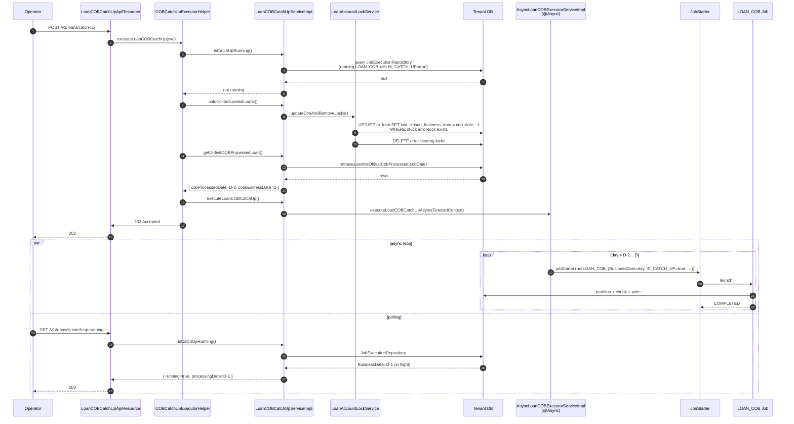

When an Apache Fineract tenant has been offline for two days, its `COB_DATE` is two days behind the `BUSINESS_DATE`. Loans that haven't seen a write during that gap have a stale `last_closed_business_date`. The COB engine cannot let that drift accumulate forever — interest accruals, delinquency tags and arrears aging would all be wrong. **Catch-up** is the controlled way to walk the gap one day at a time by re-running the appropriate COB job (`LOAN_COB` / `WORKING_CAPITAL_LOAN_COB_JOB`) for each missed day. This page deep-dives the catch-up API surface and the test-only internal endpoints used to inspect partitioner output and plant locks during integration tests.

## What "catch-up" means

There are three observable states a tenant can be in for a given asset:

| Predicate | State | What to do |
| --- | --- | --- |
| `oldestCOBProcessedDate == cobBusinessDate` | Healthy — no asset is behind. | Nothing. The catch-up endpoint returns `200 OK`. |
| `oldestCOBProcessedDate < cobBusinessDate` and no catch-up is currently running | At least one asset is behind. | Start an async catch-up that runs the COB job once per missed day. Returns `202 Accepted`. |
| Catch-up is already in flight | An async run is still executing. | Returns `400 Bad Request` and exposes the date currently being processed. |

The `oldestCOBProcessedDate` is the minimum of `last_closed_business_date` across all non-closed loans of the asset type. If a tenant has 1,000 loans and just one of them is behind, catch-up still re-runs every missed day for the **whole tenant** — but for each day, only the loans actually behind get partitioned (`isCatchUp = true` in `RetrieveIdService.retrieveLoanCOBPartitions`).

## The public catch-up endpoints

### `LoanCOBCatchUpApiResource`

```java fineract-provider/src/main/java/org/apache/fineract/cob/api/LoanCOBCatchUpApiResource.java
@Path("/v1/loans")
@Component
@Tag(name = "Loan COB Catch Up")
@RequiredArgsConstructor
public class LoanCOBCatchUpApiResource {

    private final Optional<LoanCOBCatchUpServiceImpl> loanCOBCatchUpServiceOp;

    @GET @Path("oldest-cob-closed")
    public OldestCOBProcessedLoanDTO getOldestCOBProcessedLoan() {
        return loanCOBCatchUpServiceOp.map(COBCatchUpService::getOldestCOBProcessedLoan)
            .orElseThrow(() -> new JobIsNotFoundOrNotEnabledException(JobName.LOAN_COB.name()));
    }

    @POST @Path("catch-up")
    public Response executeLoanCOBCatchUp() {
        return loanCOBCatchUpServiceOp.map(COBCatchUpExecutorHelper::executeLoanCOBCatchUp)
            .orElseThrow(() -> new JobIsNotFoundOrNotEnabledException(JobName.LOAN_COB.name()));
    }

    @GET @Path("is-catch-up-running")
    public IsCatchUpRunningDTO isCatchUpRunning() {
        return loanCOBCatchUpServiceOp.map(COBCatchUpService::isCatchUpRunning)
            .orElseGet(() -> new IsCatchUpRunningDTO(false, null));
    }
}
```

Three endpoints under `/v1/loans`:

| Method | Path | Returns | Status codes |
| --- | --- | --- | --- |
| `GET` | `/v1/loans/oldest-cob-closed` | `OldestCOBProcessedLoanDTO { loanIds, cobProcessedDate, cobBusinessDate }` | 200 if loan COB is enabled, otherwise throws `JobIsNotFoundOrNotEnabledException`. |
| `POST` | `/v1/loans/catch-up` | (no body) | `200` if all loans up to date; `202` if catch-up started; `400` if one is already running. |
| `GET` | `/v1/loans/is-catch-up-running` | `IsCatchUpRunningDTO { isCatchUpRunning, processingDate }` | 200 always; `processingDate` is `null` if not running. |

Notice the field on the resource is `Optional<LoanCOBCatchUpServiceImpl>`. The implementation bean is gated by `@Conditional(LoanCOBEnabledCondition.class)` (deep-dived in `cob/conditions-and-listeners`), so if `fineract.job.loan-cob-enabled=false`, the bean is absent and the `Optional` is empty. The resource then throws a structured "job not enabled" error rather than 500'ing.

The two DTOs:

```java fineract-cob/src/main/java/org/apache/fineract/cob/data/OldestCOBProcessedLoanDTO.java
public class OldestCOBProcessedLoanDTO {
    private List<Long> loanIds;          // loans currently at the oldest last_closed_business_date
    private LocalDate cobProcessedDate;  // the oldest such date
    private LocalDate cobBusinessDate;   // tenant's current COB_DATE
}
```

```java fineract-cob/src/main/java/org/apache/fineract/cob/data/IsCatchUpRunningDTO.java
public class IsCatchUpRunningDTO {
    private boolean isCatchUpRunning;
    private LocalDate processingDate;    // the business date currently being processed by the running catch-up
}
```

### `WorkingCapitalLoanCOBCatchUpApiResource`

The working-capital sibling is structurally identical but mounted under `/v1/working-capital-loans`:

```java fineract-provider/src/main/java/org/apache/fineract/cob/api/WorkingCapitalLoanCOBCatchUpApiResource.java
@Path("/v1/working-capital-loans")
@Tag(name = "Working Capital Loan COB Catch Up")
public class WorkingCapitalLoanCOBCatchUpApiResource {

    private final Optional<WorkingCapitalLoanCOBCatchUpServiceImpl> loanCOBCatchUpServiceOp;

    @GET  @Path("oldest-cob-closed")     public OldestCOBProcessedLoanDTO getOldestCOBProcessedLoan() { … }
    @POST @Path("catch-up")               public Response executeLoanCOBCatchUp() { … }
    @GET  @Path("is-catch-up-running")    public IsCatchUpRunningDTO isCatchUpRunning() { … }
}
```

Same three endpoints, different paths, different impl bean. Both implementations extend the shared `CommonCOBCatchUpService<T extends AccountLock>` so their behaviour is uniform.

## `COBCatchUpExecutorHelper` — the POST flow logic

The decision tree for "should I actually start catch-up?" lives in one small helper:

```java fineract-provider/src/main/java/org/apache/fineract/cob/api/COBCatchUpExecutorHelper.java
public final class COBCatchUpExecutorHelper {

    private COBCatchUpExecutorHelper() {}

    public static Response executeLoanCOBCatchUp(COBCatchUpService loanCOBCatchUpService) {
        if (loanCOBCatchUpService.isCatchUpRunning().isCatchUpRunning()) {
            return Response.status(Response.Status.BAD_REQUEST).build();      // 400 — already in flight
        }
        loanCOBCatchUpService.unlockHardLockedLoans();
        OldestCOBProcessedLoanDTO oldest = loanCOBCatchUpService.getOldestCOBProcessedLoan();

        if (oldest.getCobProcessedDate().equals(oldest.getCobBusinessDate())) {
            return Response.status(Response.Status.OK).build();                // 200 — nothing to do
        }
        loanCOBCatchUpService.executeLoanCOBCatchUp();                         // fire-and-forget async
        return Response.status(Response.Status.ACCEPTED).build();              // 202 — started
    }
}
```

Three things happen on each POST:

1. **Detect concurrency.** If `is-catch-up-running` says yes, refuse with 400. This is checked by querying the Spring Batch `JobExecutionRepository` for a running `LOAN_COB` execution whose `IS_CATCH_UP` custom parameter is `"true"` — see `CommonCOBCatchUpService.isCatchUpRunning()` below.
2. **Unlock stuck loans.** `unlockHardLockedLoans()` calls `AbstractAccountLockService.updateCobAndRemoveLocks()` — the SQL fixup deep-dived in `cob/loan-account-lock` that bumps `last_closed_business_date` on loans whose previous COB attempts left stuck error-locks, then deletes those locks. Without this, those loans would block the new catch-up.
3. **Compute the gap and dispatch.** If the oldest processed date already equals the current COB date, return 200. Otherwise call `executeLoanCOBCatchUp()` — which is `@Async`-marked — and return 202 immediately.

This is what makes catch-up safe to call from a UI button: the cheap path (no work to do) is synchronous; the expensive path goes onto an async executor and the caller polls `is-catch-up-running` for progress.

## `CommonCOBCatchUpService<T>` — the shared skeleton

Both loan and working-capital catch-up services extend the same abstract base:

```java fineract-provider/src/main/java/org/apache/fineract/cob/service/CommonCOBCatchUpService.java
public abstract class CommonCOBCatchUpService<T extends AccountLock> implements COBCatchUpService {

    private final AsyncCOBExecutorService asyncLoanCOBExecutorService;
    private final JobExecutionRepository jobExecutionRepository;
    private final RetrieveIdService retrieveIdService;
    private final AccountLockService<T> accountLockService;

    @Override
    public void unlockHardLockedLoans() {
        accountLockService.updateCobAndRemoveLocks();
    }

    @Override
    public OldestCOBProcessedLoanDTO getOldestCOBProcessedLoan() {
        List<COBIdAndLastClosedBusinessDate> rows = retrieveIdService.retrieveLoanIdsOldestCobProcessed(
            ThreadLocalContextUtil.getBusinessDateByType(BusinessDateType.COB_DATE));
        OldestCOBProcessedLoanDTO dto = new OldestCOBProcessedLoanDTO();
        dto.setLoanIds(rows.stream().map(COBIdAndLastClosedBusinessDate::getId).toList());
        dto.setCobProcessedDate(rows.stream().map(COBIdAndLastClosedBusinessDate::getLastClosedBusinessDate)
            .findFirst().orElse(ThreadLocalContextUtil.getBusinessDateByType(BusinessDateType.COB_DATE)));
        dto.setCobBusinessDate(ThreadLocalContextUtil.getBusinessDateByType(BusinessDateType.COB_DATE));
        return dto;
    }

    @Override
    public void executeLoanCOBCatchUp() {
        FineractContext context = ThreadLocalContextUtil.getContext();
        asyncLoanCOBExecutorService.executeLoanCOBCatchUpAsync(context);  // async dispatch
    }

    @Override
    public IsCatchUpRunningDTO isCatchUpRunning() {
        LocalDate runningDate = jobExecutionRepository.getBusinessDateOfRunningJobByExecutionParameter(
            getJobName(),
            COBConstant.COB_CUSTOM_JOB_PARAMETER_KEY, COBConstant.IS_CATCH_UP_PARAMETER_NAME, "true",
            COBConstant.BUSINESS_DATE_PARAMETER_NAME);
        return new IsCatchUpRunningDTO(runningDate != null, runningDate);
    }

    public abstract String getJobName();
}
```

Concrete implementations are one-liners:

```java fineract-provider/src/main/java/org/apache/fineract/cob/service/LoanCOBCatchUpServiceImpl.java
@Service
@Conditional(LoanCOBEnabledCondition.class)
public class LoanCOBCatchUpServiceImpl extends CommonCOBCatchUpService<LoanAccountLock> implements LoanCOBCatchUpService {

    public LoanCOBCatchUpServiceImpl(AsyncLoanCOBExecutorService asyncLoanCOBExecutorService,
            JobExecutionRepository jobExecutionRepository,
            RetrieveLoanIdService retrieveIdService, LoanAccountLockService accountLockService) {
        super(asyncLoanCOBExecutorService, jobExecutionRepository, retrieveIdService, accountLockService);
    }

    @Override public String getJobName() { return LoanCOBConstant.JOB_NAME; }   // "LOAN_COB"
}
```

```java fineract-provider/src/main/java/org/apache/fineract/cob/service/WorkingCapitalLoanCOBCatchUpServiceImpl.java
@Service
@Conditional(LoanCOBEnabledCondition.class)
public class WorkingCapitalLoanCOBCatchUpServiceImpl
        extends CommonCOBCatchUpService<WorkingCapitalLoanAccountLock>
        implements WorkingCapitalLoanCOBCatchUpService {

    public WorkingCapitalLoanCOBCatchUpServiceImpl(
            AsyncWorkingCapitalLoanCOBExecutorService asyncLoanCOBExecutorService,
            JobExecutionRepository jobExecutionRepository,
            WorkingCapitalLoanRetrieveIdService retrieveIdService,
            AccountLockService<WorkingCapitalLoanAccountLock> accountLockService) {
        super(asyncLoanCOBExecutorService, jobExecutionRepository, retrieveIdService, accountLockService);
    }

    @Override public String getJobName() { return JobName.WORKING_CAPITAL_LOAN_COB_JOB.name(); }
}
```

The same `@Conditional(LoanCOBEnabledCondition.class)` controls both — the property `fineract.job.loan-cob-enabled` is the master switch for the entire catch-up surface.

## The async executor: day-by-day re-runs

`AsyncCommonCOBExecutorService.executeLoanCOBCatchUpAsync(...)` is the meat of the catch-up loop. It is `@Async`-dispatched onto a dedicated executor and walks the gap one day at a time:

```java fineract-provider/src/main/java/org/apache/fineract/cob/service/AsyncCommonCOBExecutorService.java
@Override
@Async(TaskExecutorConstant.LOAN_COB_CATCH_UP_TASK_EXECUTOR_BEAN_NAME)
public void executeLoanCOBCatchUpAsync(FineractContext context) {
    try {
        ThreadLocalContextUtil.init(context);
        LocalDate cobBusinessDate = ThreadLocalContextUtil.getBusinessDateByType(BusinessDateType.COB_DATE);
        List<COBIdAndLastClosedBusinessDate> rows = retrieveIdService.retrieveLoanIdsOldestCobProcessed(cobBusinessDate);

        LocalDate oldestCOBProcessedDate = !rows.isEmpty()
                ? rows.get(0).getLastClosedBusinessDate()
                : cobBusinessDate;
        if (DateUtils.isBefore(oldestCOBProcessedDate, cobBusinessDate)) {
            executeLoanCOBDayByDayUntilCOBBusinessDate(oldestCOBProcessedDate, cobBusinessDate);
        }
    } catch (NoSuchJobException e) {
        log.error("Job not found: {}", getJobName(), new JobNotFoundException(getJobName(), e));
    } catch (JobInstanceAlreadyCompleteException | JobRestartException | JobParametersInvalidException
            | JobExecutionAlreadyRunningException | JobExecutionException e) {
        log.error("Error executing job", e);
    } finally {
        ThreadLocalContextUtil.reset();
    }
}

private void executeLoanCOBDayByDayUntilCOBBusinessDate(LocalDate oldestCOBProcessedDate, LocalDate cobBusinessDate) throws … {
    Job job = jobLocator.getJob(getJobName());                                          // "LOAN_COB" or "WORKING_CAPITAL_LOAN_COB_JOB"
    ScheduledJobDetail scheduledJobDetail = scheduledJobDetailRepository.findByJobName(getJobHumanReadableName());
    LocalDate executingBusinessDate = oldestCOBProcessedDate.plusDays(1);
    String tenantIdentifier = ThreadLocalContextUtil.getTenant().getTenantIdentifier();

    while (!DateUtils.isAfter(executingBusinessDate, cobBusinessDate)) {
        JobParameterDTO businessDate = new JobParameterDTO(
            COBConstant.BUSINESS_DATE_PARAMETER_NAME, executingBusinessDate.format(DateTimeFormatter.ISO_DATE));
        JobParameterDTO isCatchUp   = new JobParameterDTO(COBConstant.IS_CATCH_UP_PARAMETER_NAME, "true");
        JobParameterDTO tenant      = new JobParameterDTO(SchedulerServiceConstants.TENANT_IDENTIFIER, tenantIdentifier);
        Set<JobParameterDTO> params = new HashSet<>(Set.of(businessDate, isCatchUp, tenant));

        jobStarter.run(job, scheduledJobDetail, params, tenantIdentifier);              // synchronous launch + wait
        executingBusinessDate = executingBusinessDate.plusDays(1);
    }
}
```

Three properties of this loop matter:

- **`@Async` on a dedicated executor.** The Quartz / scheduler thread is not blocked while catch-up runs; the work is dispatched onto the `LOAN_COB_CATCH_UP_TASK_EXECUTOR_BEAN_NAME` task executor declared in `TaskExecutorConstant`.
- **`ThreadLocalContextUtil.init(context)`** — the catch-up thread inherits the originating tenant + auth context that was captured at the moment the POST came in. Without this, every `JdbcTemplate` call inside the COB would target the default tenant.
- **`IS_CATCH_UP = "true"` custom job parameter.** This is what `CatchUpFlagResolver.resolve(stepExecution)` reads in the partitioner. With `isCatchUp = true`, `RetrieveIdService.retrieveLoanCOBPartitions(...)` includes loans behind by **any** number of days, not just one — so partitions correctly include every loan that has missed this specific historical day.

Once `jobStarter.run(...)` returns for one day, the loop moves to the next day and launches a fresh `LOAN_COB` instance with a new `BusinessDate` parameter, repeating until the gap is closed.

## End-to-end catch-up sequence



## Catch-up vs nightly: side-by-side

```mermaid
flowchart LR
    subgraph Nightly["Nightly scheduled run"]
        N1[Quartz fires LOAN_COB]
        N2[BusinessDate=COB_DATE<br/>IS_CATCH_UP=false]
        N3[Partitioner: loans whose<br/>last_closed_business_date = COB_DATE - 1]
        N4[Walk chain → advance COB_DATE]
        N1 --> N2 --> N3 --> N4
    end
    subgraph CatchUp["POST /v1/loans/catch-up"]
        C1[Unlock stuck loans]
        C2[Walk gap day by day]
        C3[For each day D in (oldest .. COB_DATE]:<br/>BusinessDate=D<br/>IS_CATCH_UP=true]
        C4[Partitioner: loans whose<br/>last_closed_business_date &lt; D]
        C5[Walk chain → advance their<br/>last_closed_business_date one day]
        C1 --> C2 --> C3 --> C4 --> C5
    end
```

The two paths share the entire downstream pipeline (partitioner → lock → reader → processor → writer → step chain). Only the `BusinessDate` and `IS_CATCH_UP` job parameters differ.

## The test-only `InternalCOBApiResource`

`InternalCOBApiResource` is what integration tests use to inspect the partitioner and to forcibly age a loan for COB exercises. It is **only registered in the `TEST` profile**:

```java fineract-provider/src/main/java/org/apache/fineract/cob/api/InternalCOBApiResource.java
@Profile(FineractProfiles.TEST)
@Component
@Path("/v1/internal/cob")
@RequiredArgsConstructor
@Tag(name = "Internal COB", description = "Internal COB api for testing purpose")
@Slf4j
public class InternalCOBApiResource implements InitializingBean {

    @Override
    public void afterPropertiesSet() {
        log.warn("DO NOT USE THIS IN PRODUCTION!");
        log.warn("Internal client services mode is enabled");
        log.warn("DO NOT USE THIS IN PRODUCTION!");
    }

    @GET @Produces({MediaType.APPLICATION_JSON})
    @Path("partitions/{partitionSize}")
    public String getCobPartitions(@Context UriInfo uriInfo, @PathParam("partitionSize") int partitionSize) {
        LocalDate businessDate = ThreadLocalContextUtil.getBusinessDateByType(BusinessDateType.BUSINESS_DATE);
        List<COBPartition> loanCOBPartitions = retrieveIdService.retrieveLoanCOBPartitions(
            LoanCOBConstant.NUMBER_OF_DAYS_BEHIND, businessDate, false, partitionSize);
        return toApiJsonSerializerForList.serialize(settings, loanCOBPartitions);
    }

    @POST @Path("fast-forward-cob-date-of-loan/{loanId}")
    public void updateLoanCobLastDate(@PathParam("loanId") long loanId, String jsonBody) {
        JsonElement root = JsonParser.parseString(jsonBody);
        String lastClosedBusinessDate = root.getAsJsonObject().get("lastClosedBusinessDate").getAsString();
        Loan loan = loanRepositoryWrapper.findOneWithNotFoundDetection(loanId);
        LocalDate localDate = LocalDate.parse(lastClosedBusinessDate, dateTimeFormatter);  // "dd MMMM yyyy"
        loan.setLastClosedBusinessDate(localDate);
        loanRepositoryWrapper.save(loan);
    }

    @POST @Path("loan-reprocess/{loanId}")
    @Transactional
    public void loanReprocess(@PathParam("loanId") long loanId) {
        loanScheduleService.regenerateScheduleWithReprocessingTransactions(
            loanRepositoryWrapper.findOneWithNotFoundDetection(loanId));
    }
}
```

The three endpoints under `/v1/internal/cob`:

| Method | Path | Purpose |
| --- | --- | --- |
| `GET` | `/v1/internal/cob/partitions/{partitionSize}` | Return the `COBPartition` list the loan partitioner would emit *right now* for the given chunk size — without actually running the job. Used by tests to assert "did the partitioner correctly include this loan?". |
| `POST` | `/v1/internal/cob/fast-forward-cob-date-of-loan/{loanId}` | Directly mutate `m_loan.last_closed_business_date` to the date given in the JSON body (`{"lastClosedBusinessDate": "07 March 2024"}` — formatted with `"dd MMMM yyyy"`). Lets tests pretend a loan has already had COB run through some historical date. |
| `POST` | `/v1/internal/cob/loan-reprocess/{loanId}` | Force a full schedule regeneration with transaction reprocessing for the loan. Used to reproduce "after a backdated transaction" scenarios. |

The `@InitializingBean` smoke-alarm logging on startup makes accidental exposure obvious in logs. Combined with `@Profile(FineractProfiles.TEST)`, production builds simply do not register the bean — the `/v1/internal/cob` paths return 404.

### `InternalLoanAccountLockApiResource`

The lock-planting test endpoint is a sibling in spirit:

```java fineract-provider/src/main/java/org/apache/fineract/cob/api/InternalLoanAccountLockApiResource.java
@Profile(FineractProfiles.TEST)
@Component
@Path("/v1/internal/loans")
public class InternalLoanAccountLockApiResource implements InitializingBean {

    @POST @Path("{loanId}/place-lock/{lockOwner}")
    public Response placeLockOnLoanAccount(@PathParam("loanId") Long loanId,
            @PathParam("lockOwner") String lockOwner, @RequestBody(required=false) LockRequest request) {
        LoanAccountLock loanAccountLock = new LoanAccountLock(loanId, LockOwner.valueOf(lockOwner),
            ThreadLocalContextUtil.getBusinessDateByType(BusinessDateType.COB_DATE));
        if (StringUtils.isNotBlank(request.getError())) {
            loanAccountLock.setError(request.getError(), request.getError());
        }
        loanAccountLockRepository.save(loanAccountLock);
        return Response.status(Response.Status.ACCEPTED).build();
    }
}
```

`POST /v1/internal/loans/{loanId}/place-lock/{lockOwner}` plants a lock row with the chosen `LockOwner` and (optionally) a pre-set `error` so tests can verify:

- "Does the inline-COB filter respect a `LOAN_COB_CHUNK_PROCESSING` lock?"
- "Does `isLockOverrulable` return true when `error` is set?"
- "Does `updateCobAndRemoveLocks` wipe this lock and advance `last_closed_business_date`?"

It is covered in `cob/loan-account-lock` from the lock-model perspective; this page references it because the **test-only** classification is the same `@Profile(FineractProfiles.TEST)` mechanism as `InternalCOBApiResource`.

## The Swagger schema companion

`LoanCOBCatchUpApiResourceSwagger` is a tiny package-private holder used by the OpenAPI generator to document examples on the response types:

```java fineract-provider/src/main/java/org/apache/fineract/cob/api/LoanCOBCatchUpApiResourceSwagger.java
final class LoanCOBCatchUpApiResourceSwagger {
    private LoanCOBCatchUpApiResourceSwagger() {}

    @Schema(description = "GetOldestCOBProcessedLoanResponse")
    public static final class GetOldestCOBProcessedLoanResponse {
        public List<Long> loanIds;
        @Schema(example = "[2022, 9, 18]") public LocalDate cobProcessedDate;
        @Schema(example = "[2022, 9, 22]") public LocalDate cobBusinessDate;
    }

    @Schema(description = "IsCatchUpRunningResponse")
    public static final class IsCatchUpRunningResponse {
        @Schema(example = "true")                 public boolean isCatchUpRunning;
        @Schema(example = "[2022, 9, 22]")        public LocalDate processingDate;
    }
}
```

The classes themselves aren't directly returned from the JAX-RS methods — the actual return types are `OldestCOBProcessedLoanDTO` and `IsCatchUpRunningDTO`. This holder exists so the OpenAPI doc surface can render rich examples.

## Practical scenarios

### Healthy nightly path

The Quartz scheduler invokes `LOAN_COB` once a day with `IS_CATCH_UP=false`. The partitioner finds loans whose `last_closed_business_date = COB_DATE - 1` (the natural one-day-behind state). The job completes and the `INCREASE_COB_DATE_BY_1_DAY` job then advances `COB_DATE`. Catch-up endpoints stay quiet.

### Two-day blackout

System is down for 48 hours. When it comes back up:

1. `GET /v1/loans/oldest-cob-closed` reports `cobProcessedDate = COB_DATE - 2`.
2. `POST /v1/loans/catch-up` returns `202 Accepted`.
3. Asynchronously, `AsyncLoanCOBExecutorServiceImpl` runs:
   - `LOAN_COB` with `BusinessDate = COB_DATE - 1, IS_CATCH_UP = true`.
   - `LOAN_COB` with `BusinessDate = COB_DATE,     IS_CATCH_UP = true`.
4. Polling `GET /v1/loans/is-catch-up-running` shows the in-flight `processingDate`.
5. When the loop ends, both days are done; the nightly schedule resumes.

### Stuck loan stays behind

`LOAN_COB` failed for one loan on day D-1 with a `LockedReadException`. The lock row is now in error-bearing state. The next day:

1. `POST /v1/loans/catch-up` is called.
2. `unlockHardLockedLoans()` runs `updateCobAndRemoveLocks`: sets that loan's `last_closed_business_date = D - 2` and deletes the error-lock.
3. The async loop launches `LOAN_COB` for `BusinessDate = D - 1` with `IS_CATCH_UP = true`; the partitioner now includes the previously-stuck loan; the chain re-runs.
4. If that succeeds, day-D follows the same pattern.

## Summary

The catch-up API surface is small but does a lot of heavy lifting:

- **Three public endpoints per asset** — `oldest-cob-closed`, `catch-up`, `is-catch-up-running` — exposed by `LoanCOBCatchUpApiResource` and `WorkingCapitalLoanCOBCatchUpApiResource`.
- **One helper** — `COBCatchUpExecutorHelper.executeLoanCOBCatchUp` — that gates the POST behind a not-running check, runs the lock-cleanup, and dispatches to the async executor.
- **Two implementations** of `CommonCOBCatchUpService` — for loans and working-capital loans — both gated by `LoanCOBEnabledCondition`.
- **One async loop** — `AsyncCommonCOBExecutorService.executeLoanCOBCatchUpAsync` — that re-launches the underlying COB job once per missed day with `IS_CATCH_UP=true`.
- **Two test-only inspector endpoints** — `InternalCOBApiResource` (partitions, fast-forward, reprocess) and `InternalLoanAccountLockApiResource` (plant a lock) — gated by `@Profile(FineractProfiles.TEST)` and shouted about loudly at startup.

What ties everything together is `IS_CATCH_UP=true`: a single boolean in the custom job parameters that the partitioner reads via `CatchUpFlagResolver` and uses to broaden the "which loans count?" predicate. With that one flag, the same `LOAN_COB` pipeline can serve both the nightly happy path and the historical re-run.

The last page in this group (`cob/conditions-and-listeners`) deep-dives the Spring `Condition` classes that gate the manager/worker beans and the Spring Batch listeners that capture errors and emit lifecycle events.
