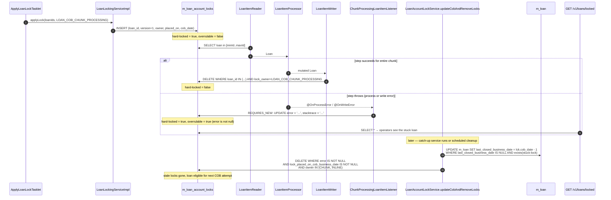
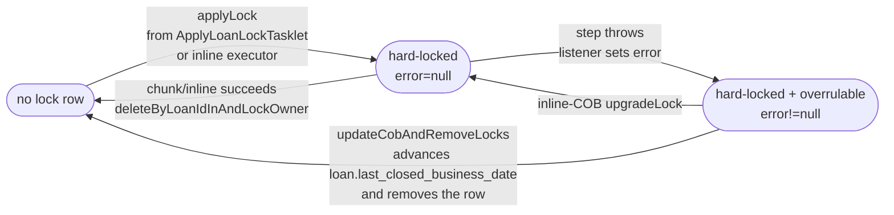

While the COB engine is mid-flight processing loan #42 — applying overdue charges, recomputing delinquency, posting accruals — no concurrent REST write to loan #42 must slip in. If it did, it could end up running against a half-mutated aggregate, or skip the step entirely. Apache Fineract's solution is **per-loan account locks**: a row in `m_loan_account_locks` keyed by `loan_id`, with an owner enum that distinguishes chunk-COB from inline-COB, written before the COB chain starts and deleted after it succeeds. This page deep-dives that model.

## Why locks at all

Three things need to be true for COB correctness:

1. **Exclusion.** While a worker is mutating loan #42, no other COB worker, no inline-COB run, and no user-facing REST call should be allowed to mutate loan #42.
2. **Failure capture.** If a step crashes mid-chain, the loan's state on disk is inconsistent. Subsequent code (and humans) need to know "this loan's COB failed, here is the stack trace, do not pretend it ran".
3. **Catch-up.** A failed lock should not block forever. If COB ran, captured an error on the lock row, and a fix has been applied, the next run (or a periodic cleanup) must be able to advance the loan's `last_closed_business_date` and remove the stale lock.

The lock model satisfies all three: optimistic-versioned rows with an owner, error/stacktrace columns and a `lock_placed_on_cob_business_date` so we can correlate the lock to a specific day's COB.

## The shared `AccountLock` mapped superclass

The shape is defined once and reused by both loans and working-capital loans:

```java fineract-cob/src/main/java/org/apache/fineract/cob/domain/AccountLock.java
@Getter
@Setter
@MappedSuperclass
@NoArgsConstructor
public abstract class AccountLock implements Persistable<Long>, Serializable {

    @Id @Column(name = "loan_id", nullable = false)
    private Long loanId;

    @Version @Column(name = "version")
    private Long version;

    @Enumerated(EnumType.STRING)
    @Column(name = "lock_owner", nullable = false)
    private LockOwner lockOwner;

    @Column(name = "lock_placed_on", nullable = false)
    private OffsetDateTime lockPlacedOn;

    @Column(name = "error")      private String error;
    @Column(name = "stacktrace") private String stacktrace;

    @Column(name = "lock_placed_on_cob_business_date")
    private LocalDate lockPlacedOnCobBusinessDate;

    @Transient
    @Setter(value = AccessLevel.NONE)
    private boolean isNew = true;

    @PrePersist
    @PostLoad
    void markNotNew() { this.isNew = false; }

    @Override public Long getId() { return loanId; }

    public AccountLock(Long loanId, LockOwner lockOwner, LocalDate lockPlacedOnCobBusinessDate) {
        this.loanId = loanId;
        this.lockOwner = lockOwner;
        this.lockPlacedOn = DateUtils.getAuditOffsetDateTime();
        this.lockPlacedOnCobBusinessDate = lockPlacedOnCobBusinessDate;
    }

    public void setError(String errorMessage, String stacktrace) {
        this.error = errorMessage;
        this.stacktrace = stacktrace;
    }

    public void setNewLockOwner(LockOwner newLockOwner) {
        this.lockOwner = newLockOwner;
        this.lockPlacedOn = DateUtils.getAuditOffsetDateTime();
    }
}
```

Columns:

| Column | Purpose |
| --- | --- |
| `loan_id` | Primary key. Same column name even for working-capital `m_wc_loan_account_locks` — the entity name says "loan" because both assets are loans. |
| `version` | JPA `@Version` for optimistic locking. Bumped whenever the lock is "upgraded" (re-owned) via `LockingService.upgradeLock`. |
| `lock_owner` | Enum value telling us which process holds the lock — chunk COB vs. inline COB (vs. their working-capital equivalents). |
| `lock_placed_on` | Wall-clock timestamp (audit offset date-time) — `DateUtils.getAuditOffsetDateTime()`. |
| `error` / `stacktrace` | Filled in by `AbstractLoanItemListener` when a chunked step throws. Presence of `error` is what marks a lock as "stuck and overrulable". |
| `lock_placed_on_cob_business_date` | The tenant's `COB_DATE` at the moment the lock was inserted. Used to identify "stuck" locks from a specific day. |

`Persistable<Long>` and the `isNew` transient flag are an EclipseLink-friendly way to tell JPA whether `persist` or `merge` should be used — important because the entity has a non-generated `@Id`.

## `LoanAccountLock` and `WorkingCapitalLoanAccountLock`

The shared mapped superclass is concretised twice:

```java fineract-provider/src/main/java/org/apache/fineract/cob/domain/LoanAccountLock.java
@Entity
@Table(name = "m_loan_account_locks")
@NoArgsConstructor
public class LoanAccountLock extends AccountLock {
    public LoanAccountLock(Long loanId, LockOwner lockOwner, LocalDate lockPlacedOnCobBusinessDate) {
        super(loanId, lockOwner, lockPlacedOnCobBusinessDate);
    }
}
```

```java fineract-working-capital-loan/src/main/java/org/apache/fineract/cob/domain/WorkingCapitalLoanAccountLock.java
@Entity
@Table(name = "m_wc_loan_account_locks")
@NoArgsConstructor
@Getter
public class WorkingCapitalLoanAccountLock extends AccountLock {
    public WorkingCapitalLoanAccountLock(Long loanId, LockOwner lockOwner, LocalDate lockPlacedOnCobBusinessDate) {
        super(loanId, lockOwner, lockPlacedOnCobBusinessDate);
    }
}
```

Same shape, two tables. Savings has its own analogous entity (see `cob/savings-cob`) but with a `savings_id` PK, so it does **not** extend `AccountLock`.

## `LockOwner`

```java fineract-cob/src/main/java/org/apache/fineract/cob/domain/LockOwner.java
public enum LockOwner {
    LOAN_COB_CHUNK_PROCESSING,    // owned by the partitioned LOAN_COB job
    LOAN_INLINE_COB_PROCESSING;   // owned by an on-demand inline catch-up
}
```

Two owners, with very different lifetimes:

- **`LOAN_COB_CHUNK_PROCESSING`** — placed by `ApplyLoanLockTasklet` at the start of a partition's chunked step, deleted by `LoanItemWriter` after the chunk succeeds (or kept with an `error` if a step in the chain throws).
- **`LOAN_INLINE_COB_PROCESSING`** — placed by `InlineLoanCOBExecutorServiceImpl` when a single-loan inline catch-up is triggered (typically by `LoanCOBApiFilter` before letting an API write through). Cleared on inline success.

Working-capital locks reuse the **same enum** — both owners apply to `m_wc_loan_account_locks` too. The fact that two physical tables share one enum is a deliberate code-economy choice; the `LockingService<T>` generic parameter keeps callers type-safe.

## The contracts

```java fineract-cob/src/main/java/org/apache/fineract/cob/domain/LockingService.java
public interface LockingService<T extends AccountLock> {
    void   upgradeLock(List<Long> accountsToLock, LockOwner lockOwner);
    void   deleteByLoanIdInAndLockOwner(List<Long> loanIds, LockOwner lockOwner);
    List<T> findAllByLoanIdIn(List<Long> loanIds);
    T       findByLoanIdAndLockOwner(Long loanId, LockOwner lockOwner);
    List<T> findAllByLoanIdInAndLockOwner(List<Long> loanIds, LockOwner lockOwner);
    void   applyLock(List<Long> loanIds, LockOwner lockOwner);
}
```

```java fineract-cob/src/main/java/org/apache/fineract/cob/domain/AccountLockRepository.java
@NoRepositoryBean
public interface AccountLockRepository<T extends AccountLock> {
    Optional<T> findByLoanIdAndLockOwner(Long loanId, LockOwner lockOwner);
    void        deleteByLoanIdInAndLockOwner(List<Long> loanIds, LockOwner lockOwner);
    List<T>     findAllByLoanIdIn(List<Long> loanIds);
    boolean     existsByLoanIdAndLockOwner(Long loanId, LockOwner lockOwner);
    boolean     existsByLoanIdAndLockOwnerAndErrorIsNotNull(Long loanId, LockOwner lockOwner);
    List<T>     findAllByLoanIdInAndLockOwner(List<Long> loanIds, LockOwner lockOwner);
    void        removeByLockOwnerInAndErrorIsNotNullAndLockPlacedOnCobBusinessDateIsNotNull(List<LockOwner> lockOwners);
    Page<T>     findAll(Pageable loanAccountLockPage);
    T           saveAndFlush(T entity);
    Optional<T> findById(Long id);
}
```

Two distinct repository methods worth noting:

- `existsByLoanIdAndLockOwnerAndErrorIsNotNull` — "is this loan in a stuck-with-error state for the given owner?" This is the predicate behind `AccountLockService.isLockOverrulable`.
- `removeByLockOwnerInAndErrorIsNotNullAndLockPlacedOnCobBusinessDateIsNotNull` — bulk delete of stuck error-bearing locks for a set of owners. Used by the cleanup path.

The loan-specific repository adds Spring Data method-name derivations on top of this contract:

```java fineract-provider/src/main/java/org/apache/fineract/cob/domain/LoanAccountLockRepository.java
@Repository
public interface LoanAccountLockRepository extends AccountLockRepository<LoanAccountLock>,
        JpaRepository<LoanAccountLock, Long>, JpaSpecificationExecutor<LoanAccountLock> {
    @Override Optional<LoanAccountLock> findByLoanIdAndLockOwner(Long loanId, LockOwner lockOwner);
    @Override void deleteByLoanIdInAndLockOwner(List<Long> loanIds, LockOwner lockOwner);
    // …
}
```

## `AbstractLockingService` — JDBC batch insert/upgrade

The bulk insert and version-bump-on-re-acquire paths use raw `JdbcTemplate` for speed. The abstract base is in `fineract-cob`:

```java fineract-cob/src/main/java/org/apache/fineract/cob/domain/AbstractLockingService.java
public abstract class AbstractLockingService<T extends AccountLock> implements LockingService<T> {

    private final JdbcTemplate jdbcTemplate;
    private final FineractProperties fineractProperties;
    private final AccountLockRepository<T> loanAccountLockRepository;

    protected abstract String getBatchLoanLockUpgrade();
    protected abstract String getBatchLoanLockInsert();

    @Override
    public void applyLock(List<Long> loanIds, LockOwner lockOwner) {
        LocalDate cobBusinessDate = ThreadLocalContextUtil.getBusinessDateByType(BusinessDateType.COB_DATE);
        jdbcTemplate.batchUpdate(getBatchLoanLockInsert(), loanIds, loanIds.size(), (ps, loanId) -> {
            ps.setLong(1, loanId);
            ps.setLong(2, 1);                       // initial version
            ps.setString(3, lockOwner.name());
            ps.setObject(4, DateUtils.getAuditOffsetDateTime());
            ps.setObject(5, cobBusinessDate);
        });
    }

    @Override
    public void upgradeLock(List<Long> accountsToLock, LockOwner lockOwner) {
        jdbcTemplate.batchUpdate(getBatchLoanLockUpgrade(), accountsToLock, getInClauseParameterSizeLimit(),
            (ps, id) -> {
                ps.setString(1, lockOwner.name());
                ps.setObject(2, DateUtils.getAuditOffsetDateTime());
                ps.setLong(3, id);
            });
    }
    // …
}
```

The concrete SQL is in the asset-specific subclasses:

```java fineract-provider/src/main/java/org/apache/fineract/cob/loan/LoanLockingServiceImpl.java
public class LoanLockingServiceImpl extends AbstractLockingService<LoanAccountLock> {

    private static final String BATCH_LOAN_LOCK_INSERT = """
        INSERT INTO m_loan_account_locks (loan_id, version, lock_owner, lock_placed_on, lock_placed_on_cob_business_date)
        VALUES (?,?,?,?,?)
        """;

    private static final String BATCH_LOAN_LOCK_UPGRADE = """
        UPDATE m_loan_account_locks SET version = version + 1, lock_owner = ?, lock_placed_on = ?
        WHERE loan_id = ?
        """;
    // …
}
```

Two operations matter:

1. **`applyLock`** — initial insert when the partitioner starts a chunk. The COB business date stamped here is what later identifies the lock as belonging to a specific day.
2. **`upgradeLock`** — atomically change the owner of an existing lock and bump the version. Used when an inline-COB run wants to take ownership of a lock that was originally placed by the chunk COB (and has an `error`, so it's overrulable).

Batch sizes for the upgrade path are capped by `fineractProperties.getQuery().getInClauseParameterSizeLimit()` — preventing the JDBC driver from blowing up on a 100k IN-clause.

## When a step fails: the listener path

When a Spring Batch step in the chain throws, `AbstractLoanItemListener` captures the failure onto the lock row in a `REQUIRES_NEW` transaction so the per-loan failure survives the chunk's rollback:

```java fineract-cob/src/main/java/org/apache/fineract/cob/listener/AbstractLoanItemListener.java
@OnProcessError
public void onProcessError(@NonNull S item, Exception e) {
    log.warn("Error was triggered during processing of Loan (id={}) due to: {}", item.getId(),
             ThrowableSerialization.serialize(e));
    updateAccountLockWithError(List.of(item.getId()), "Loan (id: %d) processing is failed", e);
}

@OnWriteError
public void onWriteError(Exception e, @NonNull Chunk<? extends S> items) {
    List<Long> loanIds = items.getItems().stream().map(AbstractPersistableCustom::getId).toList();
    updateAccountLockWithError(loanIds, "Loan (id: %d) writing is failed", e);
}

@OnReadError
public void onReadError(Exception e) {
    if (e instanceof LockedReadException ee) {
        updateAccountLockWithError(List.of(ee.getId()), "Loan (id: %d) reading is failed", e);
    }
}

private void updateAccountLockWithError(List<Long> loanIds, String msg, Throwable e) {
    transactionTemplate.setPropagationBehavior(PROPAGATION_REQUIRES_NEW);
    transactionTemplate.execute(new TransactionCallbackWithoutResult() {
        protected void doInTransactionWithoutResult(@NonNull TransactionStatus status) {
            for (Long loanId : loanIds) {
                T loanAccountLock = loanLockingService.findByLoanIdAndLockOwner(loanId, getLockOwner());
                if (loanAccountLock != null) {
                    loanAccountLock.setError(String.format(msg, loanId), ThrowableSerialization.serialize(e));
                }
            }
        }
    });
}
```

The two concrete subclasses pick their owner:

```java fineract-provider/src/main/java/org/apache/fineract/cob/listener/ChunkProcessingLoanItemListener.java
public class ChunkProcessingLoanItemListener extends AbstractLoanItemListener<LoanAccountLock, Loan> {
    @Override protected LockOwner getLockOwner() { return LockOwner.LOAN_COB_CHUNK_PROCESSING; }
}
```

```java fineract-provider/src/main/java/org/apache/fineract/cob/listener/InlineCOBLoanItemListener.java
public class InlineCOBLoanItemListener extends AbstractLoanItemListener<LoanAccountLock, Loan> {
    @Override protected LockOwner getLockOwner() { return LockOwner.LOAN_INLINE_COB_PROCESSING; }
}
```

So the same listener implementation services both chunk and inline pipelines, only the lock-owner narrative changes.

## Hard locks, overrulable locks, and lock service operations

`AbstractAccountLockService<T>` is the shared "what's locked, is it overrulable, clean up the stuck stuff" surface:

```java fineract-cob/src/main/java/org/apache/fineract/cob/service/AbstractAccountLockService.java
public abstract class AbstractAccountLockService<T extends AccountLock> implements AccountLockService<T> {

    @Override
    public List<T> getLockedLoanAccountByPage(int page, int limit) {
        return loanAccountLockRepository.findAll(PageRequest.of(page, limit)).getContent();
    }

    @Override
    public boolean isLoanHardLocked(Long loanId) {
        return loanAccountLockRepository.existsByLoanIdAndLockOwner(loanId, LockOwner.LOAN_COB_CHUNK_PROCESSING)
            || loanAccountLockRepository.existsByLoanIdAndLockOwner(loanId, LockOwner.LOAN_INLINE_COB_PROCESSING);
    }

    @Override
    public boolean isLockOverrulable(Long loanId) {
        return loanAccountLockRepository.existsByLoanIdAndLockOwnerAndErrorIsNotNull(loanId, LockOwner.LOAN_COB_CHUNK_PROCESSING)
            || loanAccountLockRepository.existsByLoanIdAndLockOwnerAndErrorIsNotNull(loanId, LockOwner.LOAN_INLINE_COB_PROCESSING);
    }

    @Override
    @Transactional(propagation = Propagation.REQUIRES_NEW)
    public void updateCobAndRemoveLocks() {
        customLoanAccountLockRepository.updateLoanFromAccountLocks();
        loanAccountLockRepository.removeByLockOwnerInAndErrorIsNotNullAndLockPlacedOnCobBusinessDateIsNotNull(
            List.of(LockOwner.LOAN_COB_CHUNK_PROCESSING, LockOwner.LOAN_INLINE_COB_PROCESSING));
    }
}
```

Two distinct lock states:

- **Hard locked** — any row for the loan with either owner. A hard lock means "someone is mid-COB on this loan; do not touch it".
- **Overrulable** — a hard-locked loan whose lock row has an `error` set. This means COB tried and failed; an inline retry is allowed to overwrite (`upgradeLock`) the lock and re-attempt the work.

`isLoanHardLocked` is what the inline-COB filter consults to decide between "wait/retry" and "kick off inline-COB for this loan now"; `isLockOverrulable` is what the inline path checks before bumping the lock's owner via `LockingService.upgradeLock`.

The concrete loan service is a one-liner:

```java fineract-provider/src/main/java/org/apache/fineract/cob/service/LoanAccountLockService.java
@Service
public class LoanAccountLockService extends AbstractAccountLockService<LoanAccountLock> {
    public LoanAccountLockService(AccountLockRepository<LoanAccountLock> loanAccountLockRepository,
                                  CustomLoanAccountLockRepository<LoanAccountLock> customLoanAccountLockRepository) {
        super(loanAccountLockRepository, customLoanAccountLockRepository);
    }
}
```

## Cleanup: `updateCobAndRemoveLocks`

The most subtle part of the model. When `updateCobAndRemoveLocks()` runs, it does two things atomically (under `REQUIRES_NEW`):

1. `customLoanAccountLockRepository.updateLoanFromAccountLocks()` — set `m_loan.last_closed_business_date` on loans that were never COB'd (have `null` last-closed) but have a stale error-bearing lock from a previous day.
2. Wipe those error-bearing locks from `m_loan_account_locks`.

The SQL behind `updateLoanFromAccountLocks` is:

```java fineract-provider/src/main/java/org/apache/fineract/cob/domain/CustomLoanAccountLockRepositoryImpl.java
@Override
public void updateLoanFromAccountLocks() {
    String sql = "UPDATE m_loan SET last_closed_business_date = (select "
            + databaseSpecificSQLGenerator.subDate("lck.lock_placed_on_cob_business_date", "1", "DAY")
            + """
                                                 from m_loan_account_locks lck
                                                 where lck.loan_id = id
                                                   and lck.lock_placed_on_cob_business_date is not null
                                                   and lck.error is not null
                                                   and lck.lock_owner in ('LOAN_COB_CHUNK_PROCESSING','LOAN_INLINE_COB_PROCESSING'))
                where last_closed_business_date is null and exists (select lck.loan_id
                          from m_loan_account_locks lck where lck.loan_id = id
                            and lck.lock_placed_on_cob_business_date is not null and lck.error is not null
                            and lck.lock_owner in ('LOAN_COB_CHUNK_PROCESSING','LOAN_INLINE_COB_PROCESSING'))
                """;
    entityManager.createNativeQuery(sql).executeUpdate();
    entityManager.flush();
}
```

The `DatabaseSpecificSQLGenerator.subDate(...)` indirection produces the correct dialect-specific date-subtraction syntax (MySQL `DATE_SUB`, PostgreSQL `- INTERVAL '1 DAY'`). The semantics: for a loan that has no `last_closed_business_date` but has an error-bearing lock placed on COB date `D`, set the loan's last-closed date to `D - 1 day`. The next COB run will then try to advance it from there.

This is also what `LoanCOBCatchUpServiceImpl.unlockHardLockedLoans()` calls before starting a catch-up — see `cob/internal-and-catchup-apis`.

## `ApplyLoanLockTasklet`

The lock insertion happens in a dedicated `Tasklet` that runs before the chunked step of every partition:

```java fineract-provider/src/main/java/org/apache/fineract/cob/loan/ApplyLoanLockTasklet.java
public class ApplyLoanLockTasklet extends ApplyCommonLockTasklet<LoanAccountLock> {

    public ApplyLoanLockTasklet(FineractProperties fineractProperties,
            LockingService<LoanAccountLock> loanLockingService,
            RetrieveIdService retrieveIdService, TransactionTemplate transactionTemplate) {
        super(fineractProperties, loanLockingService, retrieveIdService, transactionTemplate);
    }

    @Override public String getCOBParameter() { return COBConstant.COB_PARAMETER; }
    @Override public LockOwner getLockOwner() { return LockOwner.LOAN_COB_CHUNK_PROCESSING; }
}
```

`ApplyCommonLockTasklet` is the abstract base in `fineract-cob`. It:

1. Reads the partition's `COBParameter(minId, maxId)` from the step execution context.
2. Asks `RetrieveIdService.retrieveAllNonClosedLoansByLastClosedBusinessDateAndMinAndMaxLoanId(...)` for the actual list of loan IDs that need processing in this range.
3. Calls `LockingService.applyLock(loanIds, LOAN_COB_CHUNK_PROCESSING)` — the JDBC batch insert.
4. Retries up to 3 times on transient failure; on permanent failure throws `LockCannotBeAppliedException`.

## REST surface for locks

Two endpoints expose locks to the outside world.

### `LoanAccountLockApiResource` — public, read-only

```java fineract-provider/src/main/java/org/apache/fineract/cob/api/LoanAccountLockApiResource.java
@Path("/v1/loans")
@Tag(name = "Loan Account Lock")
public class LoanAccountLockApiResource {

    private final LoanAccountLockService loanAccountLockService;

    @GET @Path("locked")
    public LoanAccountLockResponseDTO retrieveLockedAccounts(
            @QueryParam("page") Integer pageParam, @QueryParam("limit") Integer limitParam) {
        int page  = Objects.requireNonNullElse(pageParam, 0);
        int limit = Objects.requireNonNullElse(limitParam, 50);
        return new LoanAccountLockResponseDTO(page, limit,
            loanAccountLockService.getLockedLoanAccountByPage(page, limit));
    }
}
```

`GET /v1/loans/locked?page={p}&limit={l}` paginates `m_loan_account_locks`. The response is wrapped in a small DTO:

```java fineract-provider/src/main/java/org/apache/fineract/cob/data/LoanAccountLockResponseDTO.java
public class LoanAccountLockResponseDTO implements Serializable {
    private int page;
    private int limit;
    private List<LoanAccountLock> content;
}
```

Operators use this to see "what's currently stuck mid-COB?" and to feed monitoring dashboards. It's a read-only view; no public endpoint releases a lock.

### `InternalLoanAccountLockApiResource` — test-only, write

```java fineract-provider/src/main/java/org/apache/fineract/cob/api/InternalLoanAccountLockApiResource.java
@Profile(FineractProfiles.TEST)
@Component
@Path("/v1/internal/loans")
public class InternalLoanAccountLockApiResource implements InitializingBean {

    private final LoanAccountLockRepository loanAccountLockRepository;

    @Override
    public void afterPropertiesSet() throws Exception {
        log.warn("DO NOT USE THIS IN PRODUCTION!");
        log.warn("Internal client services mode is enabled");
        log.warn("DO NOT USE THIS IN PRODUCTION!");
    }

    @POST @Path("{loanId}/place-lock/{lockOwner}")
    public Response placeLockOnLoanAccount(@PathParam("loanId") Long loanId,
            @PathParam("lockOwner") String lockOwner, @RequestBody(required=false) LockRequest request) {
        LoanAccountLock loanAccountLock = new LoanAccountLock(loanId, LockOwner.valueOf(lockOwner),
            ThreadLocalContextUtil.getBusinessDateByType(BusinessDateType.COB_DATE));
        if (StringUtils.isNotBlank(request.getError())) {
            loanAccountLock.setError(request.getError(), request.getError());
        }
        loanAccountLockRepository.save(loanAccountLock);
        return Response.status(Response.Status.ACCEPTED).build();
    }
}
```

This resource is gated by `@Profile(FineractProfiles.TEST)` — it only exists in test profiles. It exists so integration tests can plant a lock with a chosen owner (and optional error) and then exercise the inline-COB / lock-overrule paths. The `LockRequest` body is a single-field DTO:

```java fineract-provider/src/main/java/org/apache/fineract/cob/api/LockRequest.java
public class LockRequest {
    private String error;
}
```

The `afterPropertiesSet()` logs are the operator's "you're not in prod, right?" smoke alarm. Note this endpoint **inserts** a fresh row — `LoanAccountLock` overrides `isNew` to `true` initially so JPA picks `persist` over `merge`.

## End-to-end lock lifecycle



## State diagram



## Where loan locks block the rest of the platform

Three obvious enforcement points consult these locks:

- **`LoanCOBApiFilter`** (in the loan API tier) — before any loan write makes it to the command bus, the filter calls `LoanAccountLockService.isLoanHardLocked(loanId)`. If locked, it returns a structured error or — for the catch-up cases — kicks off `INLINE_LOAN_COB` for that loan and waits.
- **`LoanItemReader`** — refuses to emit a `Loan` whose row is currently owned by an inline lock that isn't overrulable, throwing `LockedReadException`. The chunk listener catches it and marks the partition skip.
- **`LoanAccountWasAlreadyLockedOrProcessed`** — thrown by inline pre-checks when the requested loan has already had its COB run for the current business date, so the inline call is a no-op:

```java fineract-provider/src/main/java/org/apache/fineract/cob/exceptions/LoanAccountWasAlreadyLockedOrProcessed.java
public class LoanAccountWasAlreadyLockedOrProcessed extends Exception {
    public LoanAccountWasAlreadyLockedOrProcessed(Long loanId) {
        super(String.format("Loan is in already locked state, or has been already processed! loanId: %d", loanId));
    }
}
```

## Stayed-locked events

When a partition completes and any loan is still hard-locked for the current COB date, `StayedLockedLoansTasklet` (deep-dived in `cob/loan-cob`) publishes:

```java fineract-provider/src/main/java/org/apache/fineract/cob/loan/LoanAccountsStayedLockedBusinessEvent.java
public class LoanAccountsStayedLockedBusinessEvent extends AbstractBusinessEvent<LoanAccountsStayedLockedData> {
    private static final String CATEGORY = "Loan COB";
    private static final String TYPE = "LoanAccountsStayedLockedBusinessEvent";
}
```

Carrying a list of `LoanAccountStayedLockedData(id, externalId, accountNo)` so downstream listeners can fan out alerts.

## Summary

The lock model is small but it is the load-bearing piece of COB correctness:

- **One shared schema** via `AccountLock` (loans and WC loans) plus a hand-rolled equivalent for savings.
- **One enum** (`LockOwner`) covering both pipelines for loans + WC; savings has its own (`SavingsLockOwner`).
- **One service trio** — `LockingService<T>` (place/upgrade/delete), `AccountLockRepository<T>` (existence/find), `AbstractAccountLockService<T>` (hard-lock, overrulable, cleanup).
- **Two REST endpoints** — public `GET /v1/loans/locked`, test-only `POST /v1/internal/loans/{id}/place-lock/{owner}`.
- **One bulk SQL fixup** — `CustomLoanAccountLockRepositoryImpl.updateLoanFromAccountLocks` that walks the loans whose stuck locks indicate they were never COB'd and seeds them with `last_closed_business_date = cob_date - 1` so the next run can advance them.

The next page (`cob/internal-and-catchup-apis`) shows how the catch-up service consumes all of this — both to release stuck locks and to march COB forward when a tenant has fallen behind.
