`LOAN_COB` is Apache Fineract's nightly per-loan end-of-day pipeline. It is a Spring Batch job whose worker step iterates over every open loan in `[minId..maxId]` partitions, applies a per-account lock, walks the tenant's configured ordered list of `LoanCOBBusinessStep` beans against each loan, releases the lock, and emits a "stayed locked" business event for any loan whose lock could not be cleared. This page enumerates every step that ships out of the box and the configuration plumbing around them.

## Job identity

The job is declared in the central `JobName` enum (see `core/jobs-framework`):

```java fineract-core/src/main/java/org/apache/fineract/infrastructure/jobs/service/JobName.java
LOAN_COB("Loan COB"), //
```

And anchored by `LoanCOBConstant`:

```java fineract-provider/src/main/java/org/apache/fineract/cob/loan/LoanCOBConstant.java
public final class LoanCOBConstant extends COBConstant {
    public static final String JOB_NAME                  = "LOAN_COB";
    public static final String JOB_HUMAN_READABLE_NAME   = "Loan COB";
    public static final String LOAN_COB_JOB_NAME         = "LOAN_CLOSE_OF_BUSINESS";
    public static final String LOAN_COB_WORKER_STEP      = "loanCOBWorkerStep";
    public static final String INLINE_LOAN_COB_JOB_NAME  = "INLINE_LOAN_COB";
    public static final String LOAN_COB_PARTITIONER_STEP = "Loan COB partition - Step";
}
```

Two related job names appear here: `LOAN_COB` (the scheduled nightly job) and `INLINE_LOAN_COB` (the on-demand "catch this loan up right now before letting a write proceed" job triggered by the `LoanCOBApiFilter`). They share most of the underlying machinery — see `cob/internal-and-catchup-apis` for the inline path.

## Source map

Everything related to Loan COB is split across two Gradle modules:

```text fineract-loan/src/main/java/org/apache/fineract/
cob/loan/LoanCOBBusinessStep.java          ← the marker sub-interface every loan step implements
cob/loan/ContextAwareTaskDecorator.java    ← carries ThreadLocalContextUtil across the COB-Thread pool
cob/service/RetrieveLoanIdService.java     ← marker that extends RetrieveIdService for loans
```

```text fineract-provider/src/main/java/org/apache/fineract/cob/loan/
LoanCOBManagerConfiguration.java                 ← the @Configuration for the manager node (partitioner + tasklets)
LoanCOBWorkerConfiguration.java                  ← worker @Configuration (reader/processor/writer/listeners)
LoanCOBPartitioner.java                          ← subclass of CommonPartitioner — sources loan IDs
LoanCOBConstant.java                             ← job names + step names + parameter keys
LoanInlineCOBConfig.java                         ← @Configuration for the on-demand INLINE_LOAN_COB job
WorkingCapitalLoanInlineCOBConfig.java           ← inline variant for WC loans (sits in this package historically)

LoanItemReader.java                              ← reads Loan rows in [minId..maxId]
LoanItemProcessor.java                           ← runs COBBusinessStepService.run for one loan
LoanItemWriter.java                              ← persists the mutated Loan + clears the lock
AbstractLoanItemReader / Processor / Writer.java ← shared bases for chunk + inline

ApplyLoanLockTasklet.java                        ← inserts locks at the start of every partition
InlineLoanCOBBuildExecutionContextTasklet.java   ← builds the per-loan context for INLINE_LOAN_COB
StayedLockedLoansTasklet.java                    ← final step: query stuck locks → publish business event
ResolveLoanCOBCustomJobParametersTasklet.java    ← reads BusinessDate / IS_CATCH_UP into the context

LoanLockingConfiguration.java                    ← Bean wiring for LockingService<LoanAccountLock>
LoanLockingServiceImpl.java                      ← the JDBC-backed AbstractLockingService impl
RetrieveAllNonClosedIdServiceImpl.java           ← the SQL behind LoanCOBPartitioner

LoanAccountsStayedLockedBusinessEvent.java       ← AbstractBusinessEvent payload type

# all the per-step beans:
AccrualActivityPostingBusinessStep.java
AddPeriodicAccrualEntriesBusinessStep.java
ApplyChargeToOverdueLoansBusinessStep.java
BuyDownFeeAmortizationBusinessStep.java
CapitalizedIncomeAmortizationBusinessStep.java
CheckDueInstallmentsBusinessStep.java
CheckLoanRepaymentDueBusinessStep.java
CheckLoanRepaymentOverdueBusinessStep.java
LoanInterestRecalculationCOBBusinessStep.java
SetLoanDelinquencyTagsBusinessStep.java
UpdateLoanArrearsAgingBusinessStep.java
```

And one more step, contributed by `fineract-investor`:

```text fineract-investor/src/main/java/org/apache/fineract/investor/cob/loan/
LoanAccountOwnerTransferBusinessStep.java        ← EXTERNAL_ASSET_OWNER_TRANSFER
```

## The job graph

`LoanCOBManagerConfiguration` builds the job:

```java fineract-provider/src/main/java/org/apache/fineract/cob/loan/LoanCOBManagerConfiguration.java
@Bean(name = "loanCOBJob")
public Job loanCOBJob(LoanCOBPartitioner partitioner) {
    return new JobBuilder(JobName.LOAN_COB.name(), jobRepository)
            .listener(new COBExecutionListenerRunner(applicationContext, JobName.LOAN_COB.name()))
            .start(resolveCustomJobParametersStep())   // (1) resolve BusinessDate, IS_CATCH_UP
            .next(loanCOBStep(partitioner))             // (2) partition → worker flow
            .next(stayedLockedStep())                   // (3) emit LoanAccountsStayedLockedBusinessEvent
            .incrementer(new RunIdIncrementer())
            .build();
}
```

Three top-level steps:

1. **`resolveCustomJobParametersStep`** — `ResolveLoanCOBCustomJobParametersTasklet` uses `CustomJobParameterResolver` to copy `BusinessDate` and `IS_CATCH_UP` from the launched `CustomJobParameter` row into the job execution context, then `ExecutionContextPromotionListener` promotes them to step contexts.
2. **`loanCOBStep`** — a partitioned step built with `RemotePartitioningManagerStepBuilderFactory`; `LoanCOBPartitioner` computes the `[minLoanId..maxLoanId]` partitions and pushes one `ExecutionContext` per partition onto `outboundRequests`. Workers consume them.
3. **`stayedLockedStep`** — runs `StayedLockedLoansTasklet`, which calls `RetrieveLoanIdService.findAllStayedLockedByCobBusinessDate(cobDate)` and publishes a `LoanAccountsStayedLockedBusinessEvent` if any loans are still locked.

The worker side is in `LoanCOBWorkerConfiguration`, gated by `@Conditional(BatchWorkerCondition.class)`:

```java fineract-provider/src/main/java/org/apache/fineract/cob/loan/LoanCOBWorkerConfiguration.java
@Bean("cobFlow")
public Flow flow(Step initialisationStep, Step applyLockStep, Step loanBusinessStep, Step resetContextStep) {
    return new FlowBuilder<Flow>("cobFlow")
            .start(initialisationStep)   // InitialisationTasklet — set tenant + business date
            .next(applyLockStep)         // ApplyLoanLockTasklet — INSERT loans into m_loan_account_locks
            .next(loanBusinessStep)      // chunked: read → process → write
            .next(resetContextStep)      // ResetContextTasklet — clear ThreadLocalContextUtil
            .build();
}
```

The `loanBusinessStep` is a chunked step whose chunk size, retry limit and thread pool come from `PropertyService` (see `core/spring-batch`):

```java
.<Loan, Loan>chunk(propertyService.getChunkSize(JobName.LOAN_COB.name()), transactionManager)
.reader(cobWorkerItemReader())
.processor(cobWorkerItemProcessor())
.writer(cobWorkerItemWriter())
.faultTolerant()
.retry(Exception.class).retryLimit(propertyService.getRetryLimit(LoanCOBConstant.JOB_NAME))
.skip(Exception.class).skipLimit(propertyService.getChunkSize(LoanCOBConstant.JOB_NAME) + 1)
.listener(loanItemListener())
```

## Partitioning by `loan_id`

`LoanCOBPartitioner` extends `CommonPartitioner` (see `cob/business-step-framework`). It asks `RetrieveLoanIdService.retrieveLoanCOBPartitions(numberOfDays, businessDate, isCatchUp, partitionSize)` for an ordered list of `COBPartition` records:

```java fineract-cob/src/main/java/org/apache/fineract/cob/data/COBPartition.java
public class COBPartition {
    private Long minId;     // smallest loan_id in this partition
    private Long maxId;     // largest loan_id in this partition
    private Long pageNo;    // 1-based partition number
    private Long count;     // how many loans fall in [minId..maxId]
}
```

The SQL behind `retrieveLoanCOBPartitions` lives in `RetrieveAllNonClosedIdServiceImpl` and produces non-overlapping ranges of size `partitionSize` covering every loan that is:

- Not closed (status filtering).
- Whose `last_closed_business_date < businessDate - numberOfDays`, i.e. behind the COB date.

For catch-up runs `isCatchUp = true` adjusts the predicate so partitions include loans that are behind by **any** number of days, not just the latest one. Each partition flows onto the messaging channel `outboundRequests` (a Spring Integration `DirectChannel`) as a Spring Batch `ExecutionContext` containing:

| Key | Value |
| --- | --- |
| `COBConstant.BUSINESS_STEPS` | `Set<BusinessStepNameAndOrder>` — Spring bean names + their `step_order` |
| `COBConstant.COB_PARAMETER` | `COBParameter(minId, maxId)` |
| `COBConstant.PARTITION_KEY` | `"partition_" + pageNo` |
| `COBConstant.BUSINESS_DATE_PARAMETER_NAME` | The day being processed, as ISO string |
| `COBConstant.IS_CATCH_UP_PARAMETER_NAME` | `"true"` / `"false"` |

If `cobBusinessSteps.isEmpty()` (no steps configured), the partitioner calls `jobOperator.stop(jobId)` and the job ends cleanly with nothing to do.

## End-to-end sequence

```mermaid
sequenceDiagram
    autonumber
    participant SCH as Scheduler
    participant MGR as LoanCOBManagerConfiguration
    participant PART as LoanCOBPartitioner
    participant DB as Tenant DB
    participant CH as outboundRequests channel
    participant W as Worker (LoanCOBWorkerConfiguration)
    participant LSV as LoanLockingServiceImpl
    participant RD as LoanItemReader
    participant PROC as LoanItemProcessor
    participant WR as LoanItemWriter
    participant SVC as COBBusinessStepService
    participant TL as StayedLockedLoansTasklet
    participant EV as BusinessEventNotifierService

    SCH->>MGR: launch JobName.LOAN_COB
    MGR->>MGR: resolveCustomJobParametersStep
    Note over MGR: BusinessDate + IS_CATCH_UP promoted to job execution context
    MGR->>PART: getPartitions(partitionSize, steps)
    PART->>SVC: getCOBBusinessSteps(LoanCOBBusinessStep.class,"LOAN_COB")
    SVC->>DB: SELECT * FROM m_batch_business_steps WHERE job_name='LOAN_COB'
    SVC-->>PART: Set&lt;BusinessStepNameAndOrder&gt;
    PART->>DB: retrieveLoanCOBPartitions
    DB-->>PART: List&lt;COBPartition&gt;
    PART->>CH: push ExecutionContext per partition
    loop each partition (parallel)
        CH->>W: deliver partition context
        W->>W: initialisationStep (tenant + date)
        W->>LSV: applyLock(loanIds, LOAN_COB_CHUNK_PROCESSING)
        LSV->>DB: INSERT INTO m_loan_account_locks
        loop each chunk
            W->>RD: read() → next Loan in [minId..maxId]
            RD-->>W: Loan
            W->>PROC: process(loan)
            PROC->>SVC: run(executionMap, loan)
            SVC-->>PROC: loan (mutated)
            PROC-->>W: loan
            W->>WR: write([loans])
            WR->>DB: UPDATE m_loan + DELETE FROM m_loan_account_locks
        end
        W->>W: resetContextStep (clear ThreadLocalContextUtil)
        W-->>MGR: partition done
    end
    MGR->>TL: stayedLockedStep
    TL->>DB: findAllStayedLockedByCobBusinessDate
    DB-->>TL: stuck loans
    TL->>EV: notifyPostBusinessEvent(LoanAccountsStayedLockedBusinessEvent)
    MGR-->>SCH: COMPLETED
```

## Loan flow diagram

```mermaid
flowchart LR
    A[Scheduler triggers LOAN_COB] --> B[ResolveLoanCOBCustomJobParametersTasklet]
    B --> C[LoanCOBPartitioner]
    C -->|loanIds in batches| D[outboundRequests DirectChannel]
    D --> E[Worker: loanCOBWorkerStep]
    E --> F[InitialisationTasklet]
    F --> G[ApplyLoanLockTasklet]
    G --> H[Chunked step: LoanItemReader → LoanItemProcessor → LoanItemWriter]
    H --> I[ResetContextTasklet]
    I --> J{All partitions done?}
    J -->|yes| K[StayedLockedLoansTasklet]
    K --> L[LoanAccountsStayedLockedBusinessEvent → BusinessEventNotifierService]
    L --> M[Job COMPLETED]
```



## The ordered business steps

These are every `@Component implements LoanCOBBusinessStep` that ships in core. Each row shows: the `getEnumStyledName()` value stored in `m_batch_business_steps.step_name`, the `getHumanReadableName()` shown by `GET /v1/jobs/LOAN_COB/available-steps`, and a one-line summary of what `execute(Loan loan)` does.

| Class | `enumStyledName` | `humanReadableName` | What it does |
| --- | --- | --- | --- |
| `ApplyChargeToOverdueLoansBusinessStep` | `APPLY_CHARGE_TO_OVERDUE_LOANS` | "Apply charge to overdue loans" | Reads overdue installments via `LoanReadPlatformService.retrieveAllOverdueInstallmentsForLoan(loan)` and calls `LoanChargeWritePlatformService.applyOverdueChargesForLoan(loan.id, overdue…)` to attach late-fee charges. |
| `CheckDueInstallmentsBusinessStep` | `CHECK_DUE_INSTALLMENTS` | "Check Due Installments" | Walks the loan schedule and flags due/overdue installments for downstream steps. |
| `CheckLoanRepaymentDueBusinessStep` | `CHECK_LOAN_REPAYMENT_DUE` | "Check loan repayment due" | Emits a "repayment due today" business event for installments whose due date equals the COB business date. Hooks/notifications listeners consume this. |
| `CheckLoanRepaymentOverdueBusinessStep` | `CHECK_LOAN_REPAYMENT_OVERDUE` | "Check loan repayment overdue" | Emits "repayment overdue" events for installments past due, again so listeners (SMS, hooks, email) can fan out. |
| `UpdateLoanArrearsAgingBusinessStep` | `UPDATE_LOAN_ARREARS_AGING` | "Update loan arrears aging" | Refreshes the `m_loan_arrears_aging` snapshot rows used by reporting. |
| `SetLoanDelinquencyTagsBusinessStep` | `LOAN_DELINQUENCY_CLASSIFICATION` | "Loan Delinquency Classification" | Looks up the active `DelinquencyBucket` for the loan product, computes the loan's overdue position against the configured ranges, and (re-)applies the corresponding delinquency classification tag — emitting `LoanDelinquencyRangeChangeBusinessEvent` and (when configured) repayment-due / overdue events. Switches the action context briefly to `DEFAULT` to compare business dates correctly. |
| `AddPeriodicAccrualEntriesBusinessStep` | `ADD_PERIODIC_ACCRUAL_ENTRIES` | "Add periodic accrual entries" | Generates new periodic interest / fee / penalty accrual transactions on the loan up to the COB date. |
| `AccrualActivityPostingBusinessStep` | `ACCRUAL_ACTIVITY_POSTING` | "Accrual Activity Posting on Installment Due Date" | On installment due dates, posts the accrual-activity transaction that summarises that period's interest + fee accruals for accounting. |
| `LoanInterestRecalculationCOBBusinessStep` | `LOAN_INTEREST_RECALCULATION` | "Loan Interest Recalculation" | If the product has interest recalculation enabled, regenerates the loan schedule using the recalculation strategy and re-amortises the unpaid future portion. |
| `BuyDownFeeAmortizationBusinessStep` | `BUY_DOWN_FEE_AMORTIZATION` | "Buy Down Fee amortization" | Recognises a slice of the buy-down fee as income for the day. |
| `CapitalizedIncomeAmortizationBusinessStep` | `CAPITALIZED_INCOME_AMORTIZATION` | "Capitalized income amortization" | Recognises a slice of capitalised income (e.g. capitalised disbursement charges) as income for the day. |
| `LoanAccountOwnerTransferBusinessStep` | `EXTERNAL_ASSET_OWNER_TRANSFER` | "Execute external asset owner transfer" | Lives in `fineract-investor`. When a loan has been sold to an external asset owner (see `fineract-investor`'s External Asset Owner subsystem), this step executes the actual transfer of the loan's economic ownership on the effective date. |

Concrete example shape:

```java fineract-provider/src/main/java/org/apache/fineract/cob/loan/ApplyChargeToOverdueLoansBusinessStep.java
@Component
public class ApplyChargeToOverdueLoansBusinessStep implements LoanCOBBusinessStep {

    @Override
    public Loan execute(Loan loan) {
        final Collection<OverdueLoanScheduleData> overdueLoanScheduleDataList =
                loanReadPlatformService.retrieveAllOverdueInstallmentsForLoan(loan);
        if (!overdueLoanScheduleDataList.isEmpty()) {
            loanChargeWritePlatformService.applyOverdueChargesForLoan(loan.getId(), overdueLoanScheduleDataList);
        }
        return loan;
    }

    @Override public String getEnumStyledName()    { return "APPLY_CHARGE_TO_OVERDUE_LOANS"; }
    @Override public String getHumanReadableName() { return "Apply charge to overdue loans"; }
}
```

And the slightly meatier delinquency step:

```java fineract-provider/src/main/java/org/apache/fineract/cob/loan/SetLoanDelinquencyTagsBusinessStep.java
@Override
public Loan execute(Loan loan) {
    if (loan == null) {
        log.debug("Ignoring delinquency tag processing for null loan.");
        return null;
    }
    String externalId = Optional.ofNullable(loan.getExternalId()).map(ExternalId::getValue).orElse(null);
    measure(new Runnable() {
        @Override
        public void run() {
            // Change the Action Context to DEFAULT for Business Date so that we can compare the loan due date
            // to the COB date correctly, then back to COB.
            // … look up delinquency bucket, compute current range, apply tag, fire events
        }
    });
    return loan;
}
```

Note `measure(...)` — many steps wrap their work in a stopwatch helper so per-step timings show up in the logs alongside the chunk-level Spring Batch metrics. That's invaluable when a particular step starts to dominate the COB window.

## Recommended typical step order

The available steps span "compute" (check due/overdue, classify, recalculate interest) and "post" (apply charges, post accruals, transfer ownership). A sensible default order for a vanilla loan product, as you would seed `m_batch_business_steps` for `job_name = 'LOAN_COB'`, is:

```text step_order   step_name
1            APPLY_CHARGE_TO_OVERDUE_LOANS
2            CHECK_DUE_INSTALLMENTS
3            UPDATE_LOAN_ARREARS_AGING
4            ADD_PERIODIC_ACCRUAL_ENTRIES
5            ACCRUAL_ACTIVITY_POSTING
6            LOAN_DELINQUENCY_CLASSIFICATION
7            CHECK_LOAN_REPAYMENT_DUE
8            CHECK_LOAN_REPAYMENT_OVERDUE
9            LOAN_INTEREST_RECALCULATION
10           BUY_DOWN_FEE_AMORTIZATION
11           CAPITALIZED_INCOME_AMORTIZATION
12           EXTERNAL_ASSET_OWNER_TRANSFER
```

The actual order a tenant uses is **always** in `m_batch_business_steps` — there is no fall-back default. Tenants that want to (for example) recompute delinquency before posting accruals can swap rows around. Tenants that want to skip a step entirely can leave it out of the table; the step will appear in `available-steps` but won't run.

## Reader / Processor / Writer

`LoanItemReader`, `LoanItemProcessor` and `LoanItemWriter` are the chunked step's three beans. They live in the `loan/` package and share abstract bases with the inline variants:

```text
AbstractLoanItemReader      → LoanItemReader, InlineCOBLoanItemReader, WorkingCapitalInlineCOBLoanItemReader
AbstractLoanItemProcessor   → LoanItemProcessor, InlineCOBLoanItemProcessor
AbstractLoanItemWriter      → LoanItemWriter, InlineCOBLoanItemWriter
```

- **`LoanItemReader`** is a JPA-paged reader that streams `Loan` entities whose `id` falls in `[COBParameter.minId..maxId]` and whose `last_closed_business_date` is behind the COB date. It throws `LockedReadException` if it finds a row whose lock has been overruled by inline processing — the listener catches that, the chunk skips the row, and the loan stays locked.
- **`LoanItemProcessor`** unpacks the `BUSINESS_STEPS` set from the step execution context, converts it to a `TreeMap<Long, String>`, and delegates to `COBBusinessStepService.run(executionMap, loan)`. The processor is also where `ThreadLocalContextUtil.setActionContext(ActionContext.COB)` is asserted.
- **`LoanItemWriter`** persists the chunk of modified `Loan` entities and (via `LoanLockingServiceImpl.deleteByLoanIdInAndLockOwner`) releases their locks. If anything in the chunk fails, the Spring Batch retry policy lets the chunk be reprocessed; persistent failures end up captured as `LoanAccountLock.error` rows.

`ContextAwareTaskDecorator` (in `fineract-loan`) is wrapped around the `cobTaskExecutor` so that worker threads inherit the partition manager's tenant context — without it, `ThreadLocalContextUtil` would be empty inside the chunk threads and SQL would target the wrong tenant DB.

## Inline COB

`INLINE_LOAN_COB` is the same set of steps, but driven on demand for a small list of `LoanIds`. The `LoanCOBApiFilter` intercepts loan-mutating REST calls, checks `Loan.last_closed_business_date` against the tenant's `COB_DATE`, and if the loan is behind, kicks off `INLINE_LOAN_COB` for that single loan before letting the original write proceed. The configuration is `LoanInlineCOBConfig`; the executor is `InlineLoanCOBExecutorServiceImpl`. Lock ownership is `LockOwner.LOAN_INLINE_COB_PROCESSING` instead of `LOAN_COB_CHUNK_PROCESSING`, so chunk COB and inline COB cannot stomp on each other.

The inline variant is what makes the daily catch-up resilient: even if `LOAN_COB` is days behind, individual loans get caught up on first touch, so the user-facing API never has to wait for a batch window.

## Stayed-locked event

After all partitions complete, `stayedLockedStep` runs `StayedLockedLoansTasklet`:

```java fineract-provider/src/main/java/org/apache/fineract/cob/loan/StayedLockedLoansTasklet.java
@Override
public RepeatStatus execute(StepContribution contribution, ChunkContext chunkContext) throws Exception {
    LoanAccountsStayedLockedData lockedLoanAccounts = buildLoanAccountData();
    if (!lockedLoanAccounts.getLoanAccounts().isEmpty()) {
        businessEventNotifierService.notifyPostBusinessEvent(
            new LoanAccountsStayedLockedBusinessEvent(lockedLoanAccounts));
    }
    return RepeatStatus.FINISHED;
}
```

It queries `RetrieveLoanIdService.findAllStayedLockedByCobBusinessDate(cobBusinessDate)` — which returns every `m_loan_account_locks` row whose `lock_placed_on_cob_business_date` is the current COB date. Anything that's still in that table after the partitions finished means a step failed permanently for that loan; the event lets downstream consumers (alerts, reporting, ops dashboards) notice.

```java fineract-provider/src/main/java/org/apache/fineract/cob/loan/LoanAccountsStayedLockedBusinessEvent.java
public class LoanAccountsStayedLockedBusinessEvent extends AbstractBusinessEvent<LoanAccountsStayedLockedData> {
    private static final String CATEGORY = "Loan COB";
    private static final String TYPE = "LoanAccountsStayedLockedBusinessEvent";
    // …
}
```

## Tuning knobs

`PropertyService` reads tuning parameters from `application.properties` / environment variables. For `LOAN_COB` the relevant ones are:

| Property | Effect |
| --- | --- |
| `fineract.job.loan-cob-enabled` | Master switch evaluated by `LoanCOBEnabledCondition`. When `false`, none of the loan COB beans are created. |
| `fineract.spring-batch.jobs.LOAN_COB.chunk-size` | Chunk size of the worker step. |
| `fineract.spring-batch.jobs.LOAN_COB.retry-limit` | Per-chunk retry count for `Exception`. |
| `fineract.spring-batch.jobs.LOAN_COB.thread-pool.core-pool-size` / `.max-pool-size` / `.queue-capacity` | Worker thread pool sizing (`ThreadPoolTaskExecutor`). When `maxPoolSize == 1`, falls back to `SyncTaskExecutor`. |
| `fineract.spring-batch.jobs.LOAN_COB.poll-interval` | Manager's poll interval for partition completion. |

These map through `PropertyService.getChunkSize(JobName.LOAN_COB.name())` etc. in `LoanCOBWorkerConfiguration`. Single-node deployments typically leave the manager and the worker in the same JVM; large deployments split them with `instance-mode` (see `runtime/instance-mode`).

With `LOAN_COB` mapped end-to-end, the next page (`cob/working-capital-loan-cob`) covers the working-capital sibling, which shares the same partitioner/listener machinery but ships its own much smaller catalogue of steps.
