Close-of-Business (COB) is the end-of-day clock for an Apache Fineract tenant. Every banking core needs a moment where it says "today is over, lock the day's transactions, age the receivables, post the accruals, classify delinquency, advance the calendar." Fineract's `fineract-cob` Gradle module is the engine that does exactly that — and it does so as a configurable pipeline of per-asset "business steps" running on top of Spring Batch, instead of one monolithic nightly script. This page is the map of that engine; the rest of the group drills into each part.

## Why COB exists in Fineract

Fineract distinguishes two clocks per tenant — see `core/business-date`:

- `BUSINESS_DATE` — the date the system believes "today" is for business operations. New transactions, disbursements, repayments and schedule generation are stamped against this date.
- `COB_DATE` — the latest date for which end-of-day processing has actually completed. This is always either equal to `BUSINESS_DATE - 1` (healthy state) or behind it (catch-up needed).

The COB engine's job is to walk the gap between those two dates one day at a time and, for each day, run every per-account business step that has to happen "as of" that day:

- Apply due / overdue charges and late fees.
- Add periodic accrual entries and post accrual activity transactions.
- Re-evaluate delinquency tags / classification.
- Update arrears aging snapshots.
- Recalculate interest where re-calculation is configured.
- Amortize buy-down fees and capitalized income.
- Check repayment due / overdue and emit business events that hooks/listeners can react to.
- Execute external asset-owner transfer when an asset has been sold to an investor (see `fineract-investor`).

When all per-asset steps complete for a day, the `INCREASE_COB_DATE_BY_1_DAY` job advances `COB_DATE`. That enum value lives in:

```text fineract-core/src/main/java/org/apache/fineract/infrastructure/jobs/service/JobName.java
INCREASE_COB_DATE_BY_1_DAY("Increase COB Date by 1 day"), //
LOAN_COB("Loan COB"), //
WORKING_CAPITAL_LOAN_COB_JOB("Working Capital Loan COB"), //
```

## Where COB lives in the repo

```text
fineract-cob/src/main/java/org/apache/fineract/cob/
├── COBBusinessStep.java                ← the central interface every step implements
├── COBBusinessStepService.java         ← orchestrates the configured step chain per account
├── COBBusinessStepServiceImpl.java     ← Spring-bean lookup + ordered execution + bulk events
├── COBConstant.java                    ← shared parameter / context keys
├── common/                             ← CommonPartitioner, CustomJobParameterResolver, ResetContextTasklet
├── conditions/                         ← BatchManagerCondition, BatchWorkerCondition
├── converter/                          ← COBParameterConverter
├── data/                               ← DTOs and execution-context payloads
├── domain/                             ← AccountLock superclass, LockOwner enum, BatchBusinessStep entity
├── exceptions/                         ← BusinessStepException, LockCannotBeAppliedException, LockedReadException…
├── listener/                           ← Spring Batch listeners + COBExecutionListenerRunner
├── processor/                          ← AbstractItemProcessor
├── resolver/                           ← BusinessDateResolver, CatchUpFlagResolver
├── service/                            ← lock service, category service, config service, retrieve-id contract
└── tasklet/                            ← ApplyCommonLockTasklet
```

The base module is asset-agnostic. Asset-specific COB lives in the asset's own Gradle module:

- **Loan COB** — `fineract-loan/.../cob/loan/LoanCOBBusinessStep.java` interface and `fineract-provider/.../cob/loan/*BusinessStep.java` implementations (the bulk of the steps).
- **Working Capital Loan COB** — `fineract-working-capital-loan/.../cob/workingcapitalloan/businessstep/` and the `WorkingCapitalLoanCOB*` configurations.
- **Savings COB** — `fineract-savings/.../cob/savings/SavingsCOBBusinessStep.java`.
- **Investor transfer** — `fineract-investor/.../cob/loan/LoanAccountOwnerTransferBusinessStep.java`.

REST surface, partitioner implementations, internal/test APIs and the catch-up services live in `fineract-provider/.../cob/`:

```text fineract-provider/src/main/java/org/apache/fineract/cob/
├── api/        ← LoanCOBCatchUpApiResource, WorkingCapitalLoanCOBCatchUpApiResource,
│                 InternalCOBApiResource, InternalLoanAccountLockApiResource,
│                 LoanAccountLockApiResource, ConfigureBusinessStepApiResource
├── conditions/ ← LoanCOBEnabledCondition
├── data/       ← LoanAccountLockResponseDTO, LoanAccountsStayedLockedData, BusinessStepRequest, …
├── domain/     ← LoanAccountLock entity + repository
├── exceptions/ ← LoanAccountWasAlreadyLockedOrProcessed
├── listener/   ← ChunkProcessingLoanItemListener, InlineCOBLoanItemListener,
│                 WorkingCapitalChunkProcessingLoanItemListener
├── loan/       ← LoanCOB*Configuration, all *BusinessStep classes, locking, partitioners, readers/writers
├── savings/    ← RetrieveSavingsIdServiceImpl
└── service/    ← LoanCOBCatchUpServiceImpl, CommonCOBCatchUpService, AsyncCOBExecutorService, …
```

## The three COB jobs

Three named jobs in `JobName` make up the COB surface area:

| Enum value | Human name | What it does |
| --- | --- | --- |
| `LOAN_COB` | "Loan COB" | Partitions all open loans by `loan_id`, applies a per-account lock, runs the configured `LoanCOBBusinessStep` chain, releases the lock, emits a "stayed locked" event for stragglers. |
| `WORKING_CAPITAL_LOAN_COB_JOB` | "Working Capital Loan COB" | Same shape as `LOAN_COB`, but the items are `WorkingCapitalLoan` aggregates and the lock table is `m_working_capital_loan_account_locks`. |
| `INCREASE_COB_DATE_BY_1_DAY` | "Increase COB Date by 1 day" | After per-asset jobs succeed, advance the tenant's `COB_DATE` by exactly one day. |

The first two are partitioned Spring Batch jobs (see `core/spring-batch`); the third is a small bookkeeping job. They are wired through `JobName` so the rest of the platform (job scheduler, REST surface, batch-job dashboard) refers to them uniformly.

## High-level pipeline

```mermaid
sequenceDiagram
    autonumber
    participant SCH as Job Scheduler<br/>(fineract-core jobs)
    participant MGR as LoanCOBManagerConfiguration<br/>(manager node)
    participant DB as MySQL / PostgreSQL
    participant W as Worker step<br/>(LoanCOBWorkerConfiguration)
    participant LS as LockingService
    participant BSS as COBBusinessStepService
    participant BST as Each LoanCOBBusinessStep

    SCH->>MGR: launch LOAN_COB
    MGR->>MGR: resolveCustomJobParametersStep<br/>(BusinessDate, IS_CATCH_UP)
    MGR->>DB: RetrieveLoanIdService.retrieveLoanCOBPartitions<br/>(numberOfDays, businessDate, partitionSize)
    DB-->>MGR: List&lt;COBPartition&gt; minId..maxId
    MGR->>W: send one ExecutionContext per partition<br/>(BUSINESS_STEPS set + COB_PARAMETER)
    loop per partition
        W->>LS: applyLock(loanIds, LOAN_COB_CHUNK_PROCESSING)
        LS->>DB: INSERT INTO m_loan_account_locks
        W->>DB: read Loan rows in [minId, maxId]
        loop per loan
            W->>BSS: run(executionMap, loan)
            loop ordered steps from m_batch_business_steps
                BSS->>BST: execute(loan)
                BST-->>BSS: loan (mutated)
            end
            BSS-->>W: loan
        end
        W->>DB: write back loans + delete locks
    end
    MGR->>DB: stayedLockedStep → query stuck locks → emit business event
    MGR-->>SCH: COMPLETED
```

The same flow runs for working-capital loans and for savings; only the entity type, the lock table and the partitioner change.

## Asset-agnostic vs asset-specific

The cleanest way to read the codebase is to recognise the layering:

```mermaid
flowchart TB
    subgraph CORE["fineract-cob (asset-agnostic engine)"]
        IF["COBBusinessStep&lt;T extends AbstractPersistableCustom&lt;Long&gt;&gt;<br/>execute(T input) : T"]
        SVC["COBBusinessStepService<br/>(ordered Spring-bean lookup)"]
        REG["BatchBusinessStep entity<br/>m_batch_business_steps table"]
        LOCK["AccountLock (MappedSuperclass)<br/>+ LockingService&lt;T&gt;"]
        PART["CommonPartitioner<br/>RetrieveIdService"]
        COND["BatchManagerCondition / BatchWorkerCondition"]
        LIS["FineractCOBBeforeJobListener<br/>FineractCOBAfterJobListener<br/>AbstractLoanItemListener"]
    end

    subgraph LOAN["fineract-loan + fineract-provider/cob/loan"]
        L1["LoanCOBBusinessStep interface"]
        L2["ApplyChargeToOverdueLoansBusinessStep<br/>SetLoanDelinquencyTagsBusinessStep<br/>…"]
        L3["LoanAccountLock (m_loan_account_locks)"]
        L4["LoanCOBManagerConfiguration<br/>LoanCOBWorkerConfiguration<br/>LoanCOBPartitioner"]
    end

    subgraph WC["fineract-working-capital-loan"]
        W1["WorkingCapitalLoanCOBBusinessStep abstract class"]
        W2["BreachScheduleBusinessStep<br/>DelinquencyRangeScheduleBusinessStep<br/>WorkingCapitalLoanDelinquencyClassificationBusinessStep"]
        W3["WorkingCapitalLoanAccountLock"]
        W4["WorkingCapitalLoanCOBManagerConfiguration / WorkerConfiguration"]
    end

    subgraph SAV["fineract-savings"]
        S1["SavingsCOBBusinessStep interface"]
        S2["SavingsAccountLock + SavingsLockOwner"]
    end

    IF --> L1
    IF --> W1
    IF --> S1
    LOCK --> L3
    LOCK --> W3
    LOCK --> S2
    PART --> L4
    PART --> W4
    REG --> SVC
    SVC --> L2
    SVC --> W2
```



The contract that ties all of this together — a generic interface declared in `fineract-cob/src/main/java/org/apache/fineract/cob/COBBusinessStep.java` — is small:

```java fineract-cob/src/main/java/org/apache/fineract/cob/COBBusinessStep.java
public interface COBBusinessStep<T extends AbstractPersistableCustom<Long>> {
    T execute(T input);
    String getEnumStyledName();
    String getHumanReadableName();
}
```

That single interface is why the same engine cleanly hosts loan steps that operate on `Loan`, working-capital steps that operate on `WorkingCapitalLoan`, and savings steps that operate on `SavingsAccount`. The deep dive is in `cob/business-step-framework`.

## Multi-tenant and parallelism considerations

Fineract is multi-tenant (see `runtime/multi-tenancy`). COB runs **per tenant** because:

- The `BUSINESS_DATE` and `COB_DATE` are per-tenant values held in `ThreadLocalContextUtil` (see `core/business-date`).
- Lock tables (`m_loan_account_locks`, `m_savings_account_locks`, `m_working_capital_loan_account_locks`) live in the tenant DB.
- The `BatchBusinessStep` configuration table (`m_batch_business_steps`) is per-tenant — different tenants can enable a different ordered subset of steps.

For parallelism, `LoanCOBManagerConfiguration` and `WorkingCapitalLoanCOBManagerConfiguration` use Spring Batch's **remote partitioning** via `RemotePartitioningManagerStepBuilderFactory`. Each partition message contains the `[minLoanId, maxLoanId]` `COBParameter` and the ordered `BUSINESS_STEPS` set; workers pull off the inbound channel and run independently. The manager/worker split is controlled by the two `Condition` classes in `fineract-cob/.../conditions/`, deep-dived in `cob/conditions-and-listeners`:

```java fineract-cob/src/main/java/org/apache/fineract/cob/conditions/BatchManagerCondition.java
public class BatchManagerCondition extends PropertiesCondition {
    @Override
    protected boolean matches(FineractProperties properties) {
        return properties.getMode().isBatchManagerEnabled();
    }
}
```

```java fineract-cob/src/main/java/org/apache/fineract/cob/conditions/BatchWorkerCondition.java
public class BatchWorkerCondition extends PropertiesCondition {
    @Override
    protected boolean matches(FineractProperties properties) {
        return properties.getMode().isBatchWorkerEnabled();
    }
}
```

In a single-node deployment the same JVM is both manager and worker; in scale-out mode the manager pushes partitions to a queue (the `outboundRequests` `DirectChannel` bean) and workers consume from `inboundRequests`. The `LoanCOBEnabledCondition` (in `fineract-provider`) gates whether any of the loan COB beans get created at all, controlled by `fineract.job.loan-cob-enabled`.

## What a single step looks like

Every business step is a Spring `@Component` whose bean name is the step class name and whose `getEnumStyledName()` is the stable identifier stored in the `m_batch_business_steps` configuration table. For example:

```java fineract-provider/src/main/java/org/apache/fineract/cob/loan/ApplyChargeToOverdueLoansBusinessStep.java
@Component
public class ApplyChargeToOverdueLoansBusinessStep implements LoanCOBBusinessStep {
    @Override public String getEnumStyledName()   { return "APPLY_CHARGE_TO_OVERDUE_LOANS"; }
    @Override public String getHumanReadableName(){ return "Apply charge to overdue loans"; }
    // execute(Loan loan) mutates the loan and returns it
}
```

When `COBBusinessStepServiceImpl.run(executionMap, loan)` is invoked for that loan, it walks the `TreeMap<Long, String>` (key = `step_order`, value = bean name) in order, looks up each Spring bean and calls `execute(loan)`. Between every two steps it `reloaderService.reload(item)` — this re-attaches the loan to the current Hibernate session so each step starts with a fresh aggregate. The same impl optionally wraps the whole chain in `businessEventNotifierService.startExternalEventRecording()` / `stopExternalEventRecording()` so all the events emitted during the day's processing of one account can be flushed as a single bulk event (controlled by `ConfigurationDomainService.isCOBBulkEventEnabled()`).

## Per-account locks

While a worker is mid-flight processing loan #42, no API write to loan #42 must slip in. That is the job of `LoanAccountLock`, `SavingsAccountLock` and `WorkingCapitalLoanAccountLock` — rows in per-asset lock tables that the COB pipeline inserts before reading and deletes after writing, with rollback semantics if a step throws. The same lock mechanism is also used by **inline COB** — the on-demand "catch this single loan up before I let you write a transaction to it" path triggered by the `LoanCOBApiFilter` (covered in `command/maker-checker-and-audits`). The `LockOwner` enum distinguishes the two callers:

```java fineract-cob/src/main/java/org/apache/fineract/cob/domain/LockOwner.java
public enum LockOwner {
    LOAN_COB_CHUNK_PROCESSING,    // owned by the nightly LOAN_COB job partitioner
    LOAN_INLINE_COB_PROCESSING;   // owned by an on-demand inline catch-up
}
```

This page only names them; the full lock model — error capture, hard-locked vs overrulable, the cleanup tasklet, the "stayed locked" business event — is in `cob/loan-account-lock`.

## Catch-up: when COB falls behind

If a tenant has been offline for two days, `COB_DATE` is two days behind `BUSINESS_DATE`. The catch-up service runs the `LOAN_COB` job repeatedly, one day at a time, until they converge. The trigger is `POST /v1/loans/catch-up` (exposed by `LoanCOBCatchUpApiResource`) and the worker is `LoanCOBCatchUpServiceImpl` which delegates to `AsyncLoanCOBExecutorServiceImpl`. The catch-up flag is encoded as the `IS_CATCH_UP` custom job parameter and read at partition time by `CatchUpFlagResolver`. Working-capital loans have their own catch-up resource and service mirror. Deep dive in `cob/internal-and-catchup-apis`.

## Configuring the step order

The step list is **not** hard-coded. It lives in the tenant database table `m_batch_business_steps`:

```java fineract-cob/src/main/java/org/apache/fineract/cob/domain/BatchBusinessStep.java
@Entity
@Table(name = "m_batch_business_steps")
public class BatchBusinessStep extends AbstractPersistableCustom<Long> {
    @Column(name = "job_name")   private String jobName;
    @Column(name = "step_name")  private String stepName;
    @Column(name = "step_order") private Long   stepOrder;
}
```

`ConfigureBusinessStepApiResource` exposes:

- `GET /v1/jobs/names` — list all jobs that have any configured step.
- `GET /v1/jobs/{jobName}/steps` — list configured steps, ordered.
- `PUT /v1/jobs/{jobName}/steps` — replace the configured step list (validated against the steps actually available for that job).
- `GET /v1/jobs/{jobName}/available-steps` — list every `LoanCOBBusinessStep` bean currently on the classpath.

That last endpoint is what makes the system extensible: drop a new `@Component implements LoanCOBBusinessStep` on the classpath, restart, and it shows up in `available-steps` waiting to be added to the order. See `cob/business-step-framework` for the full configuration flow.

## How this group is organised

This wiki group covers the COB engine top-down:

1. **Overview (this page)** — Why COB, what jobs exist, how the pieces fit.
2. **`cob/business-step-framework`** — The `COBBusinessStep` interface, the registry pattern via `getBeanNamesForType`, the `BatchBusinessStep` entity, the `ConfigureBusinessStepApiResource`, `BusinessStepCategory`, `BusinessStepConfigUpdateHandler`.
3. **`cob/loan-cob`** — Every `LoanCOBBusinessStep` implementation, the loan-specific partitioner / readers / writers, the `LOAN_COB` job graph.
4. **`cob/working-capital-loan-cob`** — The working-capital sibling: every step under `cob/workingcapitalloan/businessstep/` and the WC partitioner.
5. **`cob/savings-cob`** — Savings COB primitives in `fineract-savings/.../cob/savings/`.
6. **`cob/loan-account-lock`** — `AccountLock` superclass, `LoanAccountLock`, `LockOwner`, `LockingService`, `AccountLockService`, the lock API and the cleanup path.
7. **`cob/internal-and-catchup-apis`** — `LoanCOBCatchUpApiResource`, `WorkingCapitalLoanCOBCatchUpApiResource`, `InternalCOBApiResource`, `InternalLoanAccountLockApiResource` — and how catch-up reprocesses missed days asynchronously.
8. **`cob/conditions-and-listeners`** — The Spring `Condition` classes that gate manager/worker beans, and the Spring Batch listeners (`FineractCOBBeforeJobListener`, `FineractCOBAfterJobListener`, `COBExecutionListenerRunner`, `AbstractLoanItemListener`, `ChunkProcessingLoanItemListener`, `InlineCOBLoanItemListener`, `JobExecutionContextCopyListener`).

## Relationship to the rest of the platform

COB sits on top of, and depends on, several other Fineract subsystems already deep-dived in this wiki:

- **`core/business-date`** — `BusinessDateType.BUSINESS_DATE` and `COB_DATE`. `BusinessDateResolver` (in `cob/resolver/`) reads them off the step execution to know "for which day are we running".
- **`core/jobs-framework`** + **`core/spring-batch`** — the `JobName` enum, `PropertyService` for chunk/poll/thread-pool tuning, the scheduler that triggers `LOAN_COB`.
- **`core/configuration-and-global-config`** — `ConfigurationDomainService.isCOBBulkEventEnabled()` controls bulk vs per-step event emission.
- **`runtime/instance-mode`** — `FineractProperties.Mode.batchManagerEnabled` / `batchWorkerEnabled` flags drive the `BatchManagerCondition` / `BatchWorkerCondition`.
- **`command/maker-checker-and-audits`** — the inline COB filter intercepts loan write commands and triggers `INLINE_LOAN_COB` if a loan is behind on its catch-up.

With the map laid out, the rest of this group walks each subsystem in turn.

## Tenant data tables touched by COB

For completeness, the COB engine reads and writes the following per-tenant tables. Knowing these helps when debugging "why is COB behaving like this for tenant X?":

```text
m_batch_business_steps          ← step name + order per (job_name, step_name)
m_job_custom_parameter          ← BusinessDate / IS_CATCH_UP / TENANT_IDENTIFIER per launch
m_loan_account_locks            ← per-loan COB lock (loan_id PK + lock_owner + error)
m_wc_loan_account_locks         ← same shape for working-capital loans
m_savings_account_locks         ← per-savings lock (savings_id PK + lock_owner)
m_loan.last_closed_business_date← advances by one each successful COB day per loan
m_savings_account.last_closed_business_date  ← same for savings
m_loan_arrears_aging            ← refreshed by UPDATE_LOAN_ARREARS_AGING step
m_delinquency_action            ← written by LOAN_DELINQUENCY_CLASSIFICATION
batch_step_execution / batch_job_execution   ← Spring Batch's bookkeeping
```

Inspecting these tables (especially `m_batch_business_steps` and the per-asset lock tables) is the fastest way to diagnose "why did this step not run?" or "why is this loan still behind?" while the catch-up service or the nightly schedule does its thing.
