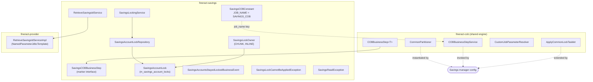

The savings module — `fineract-savings` — participates in Apache Fineract's Close-of-Business (COB) engine using the same primitives as loan and working-capital COB: a typed `COBBusinessStep<SavingsAccount>` sub-interface, a per-account lock table with its own `LockOwner` enum, a `RetrieveSavingsIdService` that supplies `[minId..maxId]` partitions, and a constants class that names the job. This page maps the savings COB scaffolding as it exists in core today and shows how a savings business step would slot in.

## What ships in core

The savings COB package is intentionally a thin layer of scaffolding rather than a turnkey nightly. Core ships:

- The `SavingsCOBBusinessStep` marker interface.
- The `SavingsAccountLock` entity (mapped to `m_savings_account_locks`).
- The `SavingsLockOwner` enum.
- A `SavingsLockingService` contract and the matching `SavingsAccountLockRepository`.
- `SavingsAccountsStayedLockedBusinessEvent` and `SavingsAccountsStayedLockedData` so a "stuck savings account" event can be published.
- A `RetrieveSavingsIdService` for partitioner SQL and stale-lock cleanup.
- The constants in `SavingsCOBConstant` reserving the `SAVINGS_COB` job name and an `INLINE_SAVINGS_COB` inline variant.

It does **not** ship a concrete `SavingsCOBManagerConfiguration` / `SavingsCOBWorkerConfiguration` / business-step beans in the Apache Fineract codebase yet. Distributions that need a savings nightly compose those configurations on top of this scaffolding, the same way `fineract-working-capital-loan` does for working-capital loans (see `cob/working-capital-loan-cob`).

## Source map

```text fineract-savings/src/main/java/org/apache/fineract/cob/savings/
SavingsCOBBusinessStep.java                       ← interface SavingsCOBBusinessStep extends COBBusinessStep<SavingsAccount>
SavingsCOBConstant.java                           ← JOB_NAME = "SAVINGS_COB", etc.

SavingsAccountLock.java                           ← @Entity for m_savings_account_locks
SavingsAccountLockRepository.java                 ← JpaRepository<SavingsAccountLock, Long>
SavingsLockOwner.java                             ← enum { SAVINGS_COB_CHUNK_PROCESSING, SAVINGS_INLINE_COB_PROCESSING }
SavingsLockingService.java                        ← lock contract (parallel to LockingService<LoanAccountLock>)

SavingsAccountsStayedLockedBusinessEvent.java     ← AbstractBusinessEvent<SavingsAccountsStayedLockedData>
SavingsAccountsStayedLockedData.java              ← { List<COBIdAndExternalIdAndAccountNo> savingsAccounts }

SavingsLockCannotBeAppliedException.java          ← thrown by would-be ApplySavingsLockTasklet
SavingsReadException.java                         ← thrown by a savings reader when an account is locked

RetrieveSavingsIdService.java                     ← partitioner contract
```

```text fineract-provider/src/main/java/org/apache/fineract/cob/savings/
RetrieveSavingsIdServiceImpl.java                 ← JdbcTemplate-backed implementation of the partitioner queries
```

## The `SavingsCOBBusinessStep` interface

```java fineract-savings/src/main/java/org/apache/fineract/cob/savings/SavingsCOBBusinessStep.java
package org.apache.fineract.cob.savings;

import org.apache.fineract.cob.COBBusinessStep;
import org.apache.fineract.portfolio.savings.domain.SavingsAccount;

public interface SavingsCOBBusinessStep extends COBBusinessStep<SavingsAccount> {
}
```

That one-liner is identical in shape to `LoanCOBBusinessStep extends COBBusinessStep<Loan>` (see `cob/business-step-framework`). Any `@Component` implementing this interface is automatically picked up by `COBBusinessStepService.getCOBBusinessSteps(SavingsCOBBusinessStep.class, "SAVINGS_COB")` — Spring's typed bean lookup does the filtering, no scanning needed.

A would-be savings step has the same three responsibilities as a loan step:

```java
@Component
public class PostSavingsInterestBusinessStep implements SavingsCOBBusinessStep {
    @Override public SavingsAccount execute(SavingsAccount account) { /* post interest as of COB */ return account; }
    @Override public String getEnumStyledName()    { return "POST_SAVINGS_INTEREST"; }
    @Override public String getHumanReadableName(){ return "Post savings interest"; }
}
```

Typical end-of-day work that would naturally live behind this interface:

- Compound + post interest as of the COB date (`SavingsAccount.postInterest`).
- Detect dormancy and switch sub-status to `Dormant` / `Inactive` (today driven by separate scheduled jobs like `UPDATE_SAVINGS_DORMANT_ACCOUNTS`).
- Charge maintenance / dormancy fees for the day.
- Compute average daily balance snapshots used by reports.
- Emit "balance below minimum" or "account inactive" business events.

Whether to migrate those into per-account COB steps or keep them as separate scheduled jobs is a per-deployment design choice; the scaffolding supports both.

## Constants

```java fineract-savings/src/main/java/org/apache/fineract/cob/savings/SavingsCOBConstant.java
public final class SavingsCOBConstant extends COBConstant {

    public static final String JOB_NAME                  = "SAVINGS_COB";
    public static final String JOB_HUMAN_READABLE_NAME   = "Savings COB";
    public static final String SAVINGS_COB_JOB_NAME      = "SAVINGS_CLOSE_OF_BUSINESS";
    public static final String SAVINGS_COB_PARAMETER     = "savingsCobParameter";
    public static final String SAVINGS_COB_WORKER_STEP   = "savingsCOBWorkerStep";

    public static final String INLINE_SAVINGS_COB_JOB_NAME = "INLINE_SAVINGS_COB";
    public static final String SAVINGS_IDS_PARAMETER_NAME  = "SavingsIds";

    public static final String SAVINGS_COB_PARTITIONER_STEP = "Savings COB partition - Step";
    public static final String PARTITION_KEY                = "partition";
}
```

The naming mirrors `LoanCOBConstant` / `WorkingCapitalLoanCOBConstant` so the rest of the framework needs no special casing.

`SavingsCOBConstant` extends the shared `COBConstant`, inheriting:

```java fineract-cob/src/main/java/org/apache/fineract/cob/COBConstant.java
public static final String BUSINESS_STEPS              = "businessSteps";
public static final String BUSINESS_DATE_PARAMETER_NAME = "BusinessDate";
public static final String IS_CATCH_UP_PARAMETER_NAME   = "IS_CATCH_UP";
public static final String COB_CUSTOM_JOB_PARAMETER_KEY = "CUSTOM_JOB_PARAMETER_ID";
public static final Long   NUMBER_OF_DAYS_BEHIND        = 1L;
public static final String PARTITION_PREFIX             = "partition_";
```

## Lock table and `SavingsLockOwner`

The savings lock model deliberately diverges from the loan model in one small but important way: it does **not** extend `AccountLock`. Loans and working-capital loans share an `AccountLock` mapped superclass whose primary key column is named `loan_id`. Savings accounts use `savings_id`, so the savings entity is hand-rolled:

```java fineract-savings/src/main/java/org/apache/fineract/cob/savings/SavingsAccountLock.java
@Entity
@Table(name = "m_savings_account_locks")
@NoArgsConstructor
@Getter
public class SavingsAccountLock {

    @Id @Column(name = "savings_id", nullable = false)  private Long savingsId;
    @Version @Column(name = "version")                   private Long version;
    @Enumerated(EnumType.STRING) @Column(name = "lock_owner",      nullable = false) private SavingsLockOwner lockOwner;
    @Column(name = "lock_placed_on",                     nullable = false)            private OffsetDateTime lockPlacedOn;
    @Column(name = "error")                                                            private String error;
    @Column(name = "stacktrace")                                                       private String stacktrace;
    @Column(name = "lock_placed_on_cob_business_date")                                 private LocalDate lockPlacedOnCobBusinessDate;

    public SavingsAccountLock(Long savingsId, SavingsLockOwner lockOwner, LocalDate lockPlacedOnCobBusinessDate) {
        this.savingsId = savingsId;
        this.lockOwner = lockOwner;
        this.lockPlacedOn = DateUtils.getAuditOffsetDateTime();
        this.lockPlacedOnCobBusinessDate = lockPlacedOnCobBusinessDate;
    }

    public void setError(String errorMessage, String stacktrace) { … }
    public void setNewLockOwner(SavingsLockOwner newLockOwner)   { … }
}
```

Every column matches the `AccountLock` shape conceptually — version for optimistic locking, lock owner, placed-on timestamp, COB business date the lock was placed for, plus error/stacktrace for capturing failures — only the ID column name changes.

The owner enum is parallel to `LockOwner`:

```java fineract-savings/src/main/java/org/apache/fineract/cob/savings/SavingsLockOwner.java
public enum SavingsLockOwner {
    SAVINGS_COB_CHUNK_PROCESSING,
    SAVINGS_INLINE_COB_PROCESSING;
}
```

This separation is intentional: a savings inline-COB run must never be blocked by a loan COB lock and vice versa, even if both happened to use the same enum constant by accident.

## The repository and locking service

```java fineract-savings/.../SavingsAccountLockRepository.java
public interface SavingsAccountLockRepository
        extends JpaRepository<SavingsAccountLock, Long>, JpaSpecificationExecutor<SavingsAccountLock> {

    Optional<SavingsAccountLock> findBySavingsIdAndLockOwner(Long savingsId, SavingsLockOwner lockOwner);
    void deleteBySavingsIdInAndLockOwner(List<Long> savingsIds, SavingsLockOwner lockOwner);
    List<SavingsAccountLock> findAllBySavingsIdIn(List<Long> savingsIds);
    boolean existsBySavingsIdAndLockOwner(Long savingsId, SavingsLockOwner lockOwner);
    boolean existsBySavingsIdAndLockOwnerAndErrorIsNotNull(Long savingsId, SavingsLockOwner lockOwner);
    List<SavingsAccountLock> findAllBySavingsIdInAndLockOwner(List<Long> savingsIds, SavingsLockOwner lockOwner);

    @Query("""
        delete from SavingsAccountLock lck where lck.lockPlacedOnCobBusinessDate is not null
        and lck.error is not null and lck.lockOwner in (
          org.apache.fineract.cob.savings.SavingsLockOwner.SAVINGS_COB_CHUNK_PROCESSING,
          org.apache.fineract.cob.savings.SavingsLockOwner.SAVINGS_INLINE_COB_PROCESSING)
        """)
    @Modifying(flushAutomatically = true)
    void removeLockByOwner();
}
```

The savings repository's `removeLockByOwner()` is the savings analogue of the loan path's `removeByLockOwnerInAndErrorIsNotNullAndLockPlacedOnCobBusinessDateIsNotNull(...)` — a cleanup helper that wipes failed locks once their errors have been observed by the catch-up service.

The service contract:

```java fineract-savings/.../SavingsLockingService.java
public interface SavingsLockingService {
    void upgradeLock(List<Long> accountsToLock, SavingsLockOwner lockOwner);
    void deleteBySavingsIdInAndLockOwner(List<Long> savingsIds, SavingsLockOwner lockOwner);
    List<SavingsAccountLock> findAllBySavingsIdIn(List<Long> savingsIds);
    SavingsAccountLock findBySavingsIdAndLockOwner(Long savingsId, SavingsLockOwner lockOwner);
    List<SavingsAccountLock> findAllBySavingsIdInAndLockOwner(List<Long> savingsIds, SavingsLockOwner lockOwner);
    void applyLock(List<Long> savingsIds, SavingsLockOwner lockOwner);
}
```

Compare to `LockingService<T extends AccountLock>` — same five operations renamed for the savings ID column. The implementations would use a `JdbcTemplate` for the batch insert and version-bump SQL, exactly as `LoanLockingServiceImpl` and `WorkingCapitalLoanLockingServiceImpl` do.

## Exceptions

```java fineract-savings/.../SavingsLockCannotBeAppliedException.java
// thrown when ApplySavingsLockTasklet fails to insert a lock after retries
```

```java fineract-savings/.../SavingsReadException.java
// thrown by a savings reader when the row it tries to fetch is locked by someone else
```

These mirror the loan-side `LockCannotBeAppliedException` and `LockedReadException` deep-dived in `cob/business-step-framework`. The savings worker chain's `ItemListener` would catch `SavingsReadException` and treat it as a "skip this account, mark its lock with an error" event.

## `RetrieveSavingsIdService`

```java fineract-savings/.../RetrieveSavingsIdService.java
public interface RetrieveSavingsIdService {

    List<COBPartition> retrieveSavingsCOBPartitions(Long numberOfDays, LocalDate businessDate,
                                                    boolean isCatchUp, int partitionSize);

    List<COBIdAndLastClosedBusinessDate> retrieveSavingsIdsBehindDate(LocalDate businessDate, List<Long> savingsIds);

    List<COBIdAndLastClosedBusinessDate> retrieveSavingsIdsBehindDateOrNull(LocalDate businessDate, List<Long> savingsIds);

    List<COBIdAndLastClosedBusinessDate> retrieveSavingsIdsOldestCobProcessed(LocalDate businessDate);

    List<Long> retrieveAllNonClosedSavingsByLastClosedBusinessDateAndMinAndMaxSavingsId(
        COBParameter savingsCOBParameter, boolean isCatchUp);

    List<COBIdAndExternalIdAndAccountNo> findAllStayedLockedByCobBusinessDate(
        @Param("cobBusinessDate") LocalDate cobBusinessDate);
}
```

Compare to `RetrieveIdService` (the shared base used by loans):

- `retrieveSavingsCOBPartitions` mirrors `retrieveLoanCOBPartitions` — same `COBPartition(minId, maxId, pageNo, count)` shape, same `numberOfDays / businessDate / isCatchUp / partitionSize` arguments.
- `retrieveSavingsIdsBehindDate` / `…BehindDateOrNull` — used by inline-COB pre-checks to decide whether an account needs catching up.
- `retrieveSavingsIdsOldestCobProcessed` — feeds the savings catch-up "oldest COB processed" endpoint.
- `findAllStayedLockedByCobBusinessDate` — the source data behind a savings stayed-locked event.

The implementation is in `fineract-provider/.../cob/savings/RetrieveSavingsIdServiceImpl.java`, using `NamedParameterJdbcTemplate` against `m_savings_account` and `m_savings_account_locks`.

## Stayed-locked event

```java fineract-savings/.../SavingsAccountsStayedLockedBusinessEvent.java
public class SavingsAccountsStayedLockedBusinessEvent
        extends AbstractBusinessEvent<SavingsAccountsStayedLockedData> {

    private static final String CATEGORY = "Savings COB";
    private static final String TYPE = "SavingsAccountsStayedLockedBusinessEvent";

    public SavingsAccountsStayedLockedBusinessEvent(SavingsAccountsStayedLockedData value) { super(value); }
    @Override public String getType()         { return TYPE; }
    @Override public String getCategory()     { return CATEGORY; }
    @Override public Long   getAggregateRootId() { return null; }
}
```

```java fineract-savings/.../SavingsAccountsStayedLockedData.java
@Getter
@AllArgsConstructor
public class SavingsAccountsStayedLockedData {
    private List<COBIdAndExternalIdAndAccountNo> savingsAccounts;
}
```

The payload re-uses the shared `COBIdAndExternalIdAndAccountNo` DTO so the event has enough identity to drive downstream alerts and ops dashboards without round-tripping the DB.

## How the savings COB pipeline would look

When a deployment wires concrete configurations on top of this scaffolding, it would mirror the loan flow exactly:

```mermaid
sequenceDiagram
    autonumber
    participant SCH as Scheduler
    participant MGR as SavingsCOBManagerConfiguration<br/>(deployment-supplied)
    participant PART as SavingsCOBPartitioner<br/>(extends CommonPartitioner)
    participant SVC as COBBusinessStepService
    participant DB as Tenant DB
    participant CH as outboundRequests
    participant W as SavingsCOBWorkerConfiguration
    participant LSV as SavingsLockingService impl
    participant TL as StayedLockedSavingsTasklet
    participant EV as BusinessEventNotifierService

    SCH->>MGR: launch SAVINGS_COB
    MGR->>PART: partition(gridSize)
    PART->>SVC: getCOBBusinessSteps(SavingsCOBBusinessStep.class, "SAVINGS_COB")
    SVC->>DB: SELECT * FROM m_batch_business_steps WHERE job_name='SAVINGS_COB'
    SVC-->>PART: Set&lt;BusinessStepNameAndOrder&gt;
    PART->>DB: retrieveSavingsCOBPartitions
    DB-->>PART: List&lt;COBPartition&gt; over m_savings_account
    PART->>CH: push one ExecutionContext per partition
    loop each partition
        CH->>W: deliver
        W->>LSV: applyLock(savingsIds, SAVINGS_COB_CHUNK_PROCESSING)
        LSV->>DB: INSERT INTO m_savings_account_locks
        loop chunk
            W->>DB: read SavingsAccount in [minId..maxId]
            W->>SVC: run(executionMap, savingsAccount)
            SVC-->>W: savingsAccount
            W->>DB: UPDATE m_savings_account + DELETE FROM m_savings_account_locks
        end
    end
    MGR->>TL: stayedLockedStep
    TL->>DB: findAllStayedLockedByCobBusinessDate
    TL->>EV: notifyPostBusinessEvent(SavingsAccountsStayedLockedBusinessEvent)
    MGR-->>SCH: COMPLETED
```

The only deployment-specific pieces are the `@Configuration` classes that build the `Job` + `Step` beans, an `ApplySavingsLockTasklet` extending `ApplyCommonLockTasklet`, and the `SavingsLockingService` implementation that fills in the SQL.

## Component layering



## What about the API surface?

Today the `ConfigureBusinessStepApiResource` (see `cob/business-step-framework`) caches available steps eagerly only for the `LOAN` category:

```java fineract-cob/.../ConfigJobParameterServiceImpl.java
@Override
public void afterPropertiesSet() throws Exception {
    availableBusinessStepsForLoan = getAvailableBusinessStepsByJobName(BusinessStepCategory.LOAN.name());
}
```

So `GET /v1/jobs/SAVINGS_COB/available-steps` will resolve through `BusinessStepCategoryService.getBusinessStepByCategory("SAVINGS_COB")`, which a savings-enabled deployment binds to return `SavingsCOBBusinessStep.class`. Configuration of step order then goes through the same `PUT /v1/jobs/SAVINGS_COB/steps` PUT endpoint, persisting rows with `job_name = 'SAVINGS_COB'` to `m_batch_business_steps`.

If a tenant ships a savings step but has no rows in `m_batch_business_steps` for `SAVINGS_COB`, `CommonPartitioner.getPartitions` returns an empty map and `jobOperator.stop(jobId)` short-circuits the run — exactly the same behaviour as for loans.

## Summary

The savings COB layer is purposely a "kit of parts":

- **Asset coupling** — `SavingsCOBBusinessStep extends COBBusinessStep<SavingsAccount>`.
- **Locking** — `m_savings_account_locks` + `SavingsLockOwner` + `SavingsLockingService`.
- **Partitioner data** — `RetrieveSavingsIdService` (impl in `fineract-provider`).
- **Cleanup** — `SavingsAccountLockRepository.removeLockByOwner()` and `findAllStayedLockedByCobBusinessDate`.
- **Operational signal** — `SavingsAccountsStayedLockedBusinessEvent`.
- **Job identity** — `SavingsCOBConstant.JOB_NAME = "SAVINGS_COB"`, plus `INLINE_SAVINGS_COB` for inline.

Anyone shipping a complete savings COB pipeline composes the missing `@Configuration` classes, an `ApplySavingsLockTasklet`, and a handful of `@Component implements SavingsCOBBusinessStep` beans on top of this scaffolding — and reuses every other framework piece (the registry, the partitioner pattern, the custom job parameters, the listeners, the conditions) unchanged. The deep-dive of the lock infrastructure those steps rely on is in `cob/loan-account-lock`.
