`WORKING_CAPITAL_LOAN_COB_JOB` is the sibling of `LOAN_COB` for working-capital loans. Working-capital loans (a revolving credit facility with draws, breach detection and disbursement-based schedules) live in their own Gradle module — `fineract-working-capital-loan` — and ship with their own COB module, partitioner, lock table and business steps. The wiring is structurally identical to the loan COB pipeline covered in `cob/loan-cob`, but every primitive is namespaced and operates against `WorkingCapitalLoan` aggregates instead of `Loan`. This page maps the working-capital COB module.

## Job identity

```java fineract-core/src/main/java/org/apache/fineract/infrastructure/jobs/service/JobName.java
WORKING_CAPITAL_LOAN_COB_JOB("Working Capital Loan COB"), //
```

```java fineract-working-capital-loan/src/main/java/org/apache/fineract/cob/workingcapitalloan/WorkingCapitalLoanCOBConstant.java
@NoArgsConstructor
public final class WorkingCapitalLoanCOBConstant extends COBConstant {
    public static final String WORKING_CAPITAL_JOB_NAME                = "WC_LOAN_COB";
    public static final String WORKING_CAPITAL_JOB_HUMAN_READABLE_NAME = "Working Capital Loan COB";
    public static final String WORKING_CAPITAL_LOAN_COB_JOB_NAME       = "WORKING_CAPITAL_LOAN_CLOSE_OF_BUSINESS";

    public static final String WORKING_CAPITAL_LOAN_COB_STEP           = "workingCapitalLoanCOBStep";
    public static final String WORKING_CAPITAL_LOAN_COB_BUSINESS_STEP  = "workingCapitalLoanCOBBusinessStep";
    public static final String WORKING_CAPITAL_LOAN_COB_PARTITIONER    = "workingCapitalLoanCOBPartitioner";
    public static final String WORKING_CAPITAL_LOAN_COB_WORKER_STEP    = "workingCapitalLoanCOBWorkerStep";
    public static final String WORKING_CAPITAL_LOAN_COB_FLOW           = "workingCapitalLoanCOBFlow";

    public static final String INLINE_WORKING_CAPITAL_LOAN_COB_JOB_NAME = "INLINE_WORKING_CAPITAL_LOAN_COB";
    public static final String WORKING_CAPITAL_LOAN_IDS_PARAMETER_NAME  = "LoanIds";

    public static final String WORKING_CAPITAL_LOAN_COB_PARTITIONER_STEP = "Working Capital Loan COB partition - Step";
}
```

Note the human-readable enum value (`"Working Capital Loan COB"`) matches the `JobName` label, while the technical job name registered in Spring Batch is `WORKING_CAPITAL_LOAN_COB_JOB.name()` — i.e. `WORKING_CAPITAL_LOAN_COB_JOB`. The string `"WC_LOAN_COB"` is the value tenants must use as the `job_name` key when populating `m_batch_business_steps` to configure working-capital step order.

## Source map

Everything WC-COB-related lives in two places:

```text fineract-working-capital-loan/src/main/java/org/apache/fineract/cob/
domain/
  WorkingCapitalLoanAccountLock.java                  ← @Entity for m_wc_loan_account_locks
  WorkingCapitalAccountLockRepository.java
  CustomWorkingCapitalLoanAccountLockRepositoryImpl.java

workingcapitalloan/
  WorkingCapitalLoanCOBConstant.java                  ← job + step names
  WorkingCapitalLoanCOBManagerConfiguration.java      ← @Configuration for the manager (BatchManagerCondition)
  WorkingCapitalLoanCOBWorkerConfiguration.java       ← worker @Configuration (BatchWorkerCondition)
  WorkingCapitalLoanCOBPartitioner.java               ← CommonPartitioner subclass
  WorkingCapitalLoanCOBCustomJobParametersResolverTasklet.java
  ApplyWorkingCapitalLoanLockTasklet.java             ← inserts WC locks per partition
  WorkingCapitalLoanLockingConfiguration.java         ← LockingService<WorkingCapitalLoanAccountLock> beans
  WorkingCapitalLoanLockingServiceImpl.java           ← JDBC-backed AbstractLockingService
  WorkingCapitalLoanRetrieveIdConfiguration.java
  WorkingCapitalLoanRetrieveIdService.java
  WorkingCapitalLoanRetrieveIdServiceImpl.java
  WorkingCapitalAccountLockServiceImpl.java
  WorkingCapitalLoanCOBWorkerItemReader.java
  WorkingCapitalLoanCOBWorkerItemProcessor.java
  WorkingCapitalLoanCOBWorkerItemWriter.java
  WorkingCapitalLoanCOBWorkerItemListener.java
  AbstractWorkingCapitalLoanCOBWorkerItemProcessor.java
  AbstractWorkingCapitalLoanCOBWorkerItemWriter.java
  InlineWorkingCapitalLoanCOBWorkerItemWriter.java
  InlineWorkingCapitalLoanCOBWorkerItemListener.java
  WorkingCapitalLoanInlineCOBWorkerItemProcessor.java

  businessstep/
    WorkingCapitalLoanCOBBusinessStep.java                          ← abstract base class
    BreachScheduleBusinessStep.java                                 ← WC_BREACH_SCHEDULE
    DelinquencyRangeScheduleBusinessStep.java                       ← WC_DELINQUENCY_RANGE_SCHEDULE
    WorkingCapitalLoanDelinquencyClassificationBusinessStep.java    ← WC_LOAN_DELINQUENCY_CLASSIFICATION
    DummyBusinessStep.java                                          ← DUMMY_BUSINESS_STEP (placeholder/test)
```

The lock-table entity:

```java fineract-working-capital-loan/src/main/java/org/apache/fineract/cob/domain/WorkingCapitalLoanAccountLock.java
@Entity
@Table(name = "m_wc_loan_account_locks")
@Getter
@NoArgsConstructor
public class WorkingCapitalLoanAccountLock extends AccountLock {
    public WorkingCapitalLoanAccountLock(Long loanId, LockOwner lockOwner, LocalDate lockPlacedOnCobBusinessDate) {
        super(loanId, lockOwner, lockPlacedOnCobBusinessDate);
    }
}
```

It re-uses the shared `AccountLock` superclass (whose primary key column is `loan_id` — see `cob/loan-account-lock`) and the shared `LockOwner` enum, just in a different table.

## The job graph

`WorkingCapitalLoanCOBManagerConfiguration` is gated by `BatchManagerCondition`:

```java fineract-working-capital-loan/.../WorkingCapitalLoanCOBManagerConfiguration.java
@Bean(WORKING_CAPITAL_JOB_HUMAN_READABLE_NAME)
public Job workingCapitalLoanCOBJob(WorkingCapitalLoanCOBPartitioner partitioner,
        ExecutionContextPromotionListener customJobParametersPromotionListener) {
    return new JobBuilder(WORKING_CAPITAL_LOAN_COB_JOB.name(), jobRepository)
            .start(resolveCustomJobParametersForWorkingCapitalStep(customJobParametersPromotionListener))
            .next(workingCapitalLoanCOBStep(partitioner))
            .incrementer(new RunIdIncrementer())
            .build();
}
```

Two top-level steps:

1. **`resolveCustomJobParametersForWorkingCapitalStep`** — runs `WorkingCapitalLoanCOBCustomJobParametersResolverTasklet`, which uses the shared `CustomJobParameterResolver` (see `cob/business-step-framework`) to copy `BusinessDate` and `IS_CATCH_UP` from the launched custom-parameter row into the job execution context, then `ExecutionContextPromotionListener` promotes them.
2. **`workingCapitalLoanCOBStep`** — the partitioned step built with `RemotePartitioningManagerStepBuilderFactory`, exactly as `LOAN_COB` does. The poll interval comes from `propertyService.getPollInterval(WORKING_CAPITAL_JOB_NAME)`.

```java
@Bean(WORKING_CAPITAL_LOAN_COB_STEP)
public Step workingCapitalLoanCOBStep(WorkingCapitalLoanCOBPartitioner partitioner) {
    return stepBuilderFactory.get(WORKING_CAPITAL_LOAN_COB_PARTITIONER_STEP)
            .partitioner(WORKING_CAPITAL_LOAN_COB_WORKER_STEP, partitioner)
            .pollInterval(propertyService.getPollInterval(WORKING_CAPITAL_JOB_NAME))
            .outputChannel(outboundRequests).build();
}
```

Compared to `LOAN_COB`, the WC manager job intentionally **omits the final `stayedLockedStep`**. If a working-capital loan is stuck under a lock at the end of a run, the next run's partitioner will simply re-attempt it; there is no dedicated `WorkingCapitalLoanAccountsStayedLockedBusinessEvent` in the current code path. (Inline locks still produce `LoanAccountLock.error` rows on failure via the listener, so the operational signal is not lost.)

## Partitioner

`WorkingCapitalLoanCOBPartitioner` is a thin subclass of the shared `CommonPartitioner`:

```java fineract-working-capital-loan/.../WorkingCapitalLoanCOBPartitioner.java
public class WorkingCapitalLoanCOBPartitioner extends CommonPartitioner implements Partitioner {

    private final COBBusinessStepService cobBusinessStepService;
    private final PropertyService propertyService;

    public WorkingCapitalLoanCOBPartitioner(
            JobOperator jobOperator, StepExecution stepExecution, Long numberOfDays,
            WorkingCapitalLoanRetrieveIdService retrieveIdService,
            COBBusinessStepService cobBusinessStepService, PropertyService propertyService) {
        super(jobOperator, stepExecution, numberOfDays, retrieveIdService);
        // …
    }

    @Override
    @NonNull
    public Map<String, ExecutionContext> partition(int gridSize) {
        Set<BusinessStepNameAndOrder> cobBusinessSteps = cobBusinessStepService.getCOBBusinessSteps(
                WorkingCapitalLoanCOBBusinessStep.class, WORKING_CAPITAL_JOB_NAME);
        return getPartitions(propertyService.getPartitionSize(WORKING_CAPITAL_LOAN_COB_JOB_NAME), cobBusinessSteps);
    }
}
```

Two things to notice:

- The `Class<T>` it passes to `COBBusinessStepService.getCOBBusinessSteps(...)` is `WorkingCapitalLoanCOBBusinessStep.class`. That filters Spring's bean registry down to working-capital steps only — even though the engine itself doesn't know what "working capital" means.
- The `cobJobName` parameter is `WORKING_CAPITAL_JOB_NAME` (`"WC_LOAN_COB"`). That's the key tenants use when configuring step order — distinct from `"LOAN_COB"`. Two completely independent step lists are configurable per tenant.

The underlying ID retrieval is `WorkingCapitalLoanRetrieveIdService`, which extends `RetrieveIdService` with WC-specific SQL. Its `retrieveLoanCOBPartitions(...)` returns `COBPartition(minId, maxId, pageNo, count)` partitions covering working-capital loans whose `last_closed_business_date` is behind the working-capital COB date.

## Worker flow

`WorkingCapitalLoanCOBWorkerConfiguration` (under `@Conditional(BatchWorkerCondition.class)`) builds the worker step out of the same building blocks as the loan worker:

- `WorkingCapitalLoanCOBWorkerItemReader` — JPA-paged reader of `WorkingCapitalLoan` entities in `[minId..maxId]`.
- `WorkingCapitalLoanCOBWorkerItemProcessor` — extracts the `BUSINESS_STEPS` set from the partition context and delegates to `COBBusinessStepService.run(executionMap, wcLoan)`.
- `WorkingCapitalLoanCOBWorkerItemWriter` — persists the chunk and releases its WC locks.
- `WorkingCapitalLoanCOBWorkerItemListener` (extends `AbstractLoanItemListener`) — catches read/process/write errors and writes them onto the corresponding `WorkingCapitalLoanAccountLock` row.

The pre-step tasklet `ApplyWorkingCapitalLoanLockTasklet` extends the shared `ApplyCommonLockTasklet` to insert one `m_wc_loan_account_locks` row per loan in the partition before the chunked step starts reading. SQL used by the JDBC batch insert/upgrade is encoded directly in `WorkingCapitalLoanLockingServiceImpl`:

```java fineract-working-capital-loan/.../WorkingCapitalLoanLockingServiceImpl.java
private static final String BATCH_LOAN_LOCK_INSERT = """
        INSERT INTO m_wc_loan_account_locks (loan_id, version, lock_owner, lock_placed_on, lock_placed_on_cob_business_date)
        VALUES (?,?,?,?,?)
        """;

private static final String BATCH_LOAN_LOCK_UPGRADE = """
        UPDATE m_wc_loan_account_locks SET version = version + 1, lock_owner = ?, lock_placed_on = ?
        WHERE loan_id = ?
        """;
```

The lock-cleanup path is shared with the loan path through `AbstractAccountLockService.updateCobAndRemoveLocks()` — see `cob/loan-account-lock`.

## End-to-end sequence

```mermaid
sequenceDiagram
    autonumber
    participant SCH as Scheduler
    participant MGR as WorkingCapitalLoanCOBManagerConfiguration
    participant PART as WorkingCapitalLoanCOBPartitioner
    participant DB as Tenant DB
    participant CH as outboundRequests channel
    participant W as Worker
    participant LSV as WorkingCapitalLoanLockingServiceImpl
    participant RD as WorkingCapitalLoanCOBWorkerItemReader
    participant PROC as WorkingCapitalLoanCOBWorkerItemProcessor
    participant WR as WorkingCapitalLoanCOBWorkerItemWriter
    participant SVC as COBBusinessStepService

    SCH->>MGR: launch WORKING_CAPITAL_LOAN_COB_JOB
    MGR->>MGR: resolveCustomJobParametersForWorkingCapitalStep
    MGR->>PART: partition(gridSize)
    PART->>SVC: getCOBBusinessSteps(WorkingCapitalLoanCOBBusinessStep.class, "WC_LOAN_COB")
    SVC->>DB: SELECT * FROM m_batch_business_steps WHERE job_name='WC_LOAN_COB'
    SVC-->>PART: Set&lt;BusinessStepNameAndOrder&gt;
    PART->>DB: retrieveLoanCOBPartitions (WC variant)
    DB-->>PART: List&lt;COBPartition&gt; over m_wc_loan
    PART->>CH: push one ExecutionContext per partition
    loop each partition
        CH->>W: deliver partition
        W->>W: ApplyWorkingCapitalLoanLockTasklet
        W->>LSV: applyLock(loanIds, LOAN_COB_CHUNK_PROCESSING)
        LSV->>DB: INSERT INTO m_wc_loan_account_locks
        loop each chunk
            W->>RD: read next WorkingCapitalLoan
            RD-->>W: WorkingCapitalLoan
            W->>PROC: process(wcLoan)
            PROC->>SVC: run(executionMap, wcLoan)
            SVC-->>PROC: wcLoan (mutated)
            W->>WR: write([wcLoans])
            WR->>DB: UPDATE m_wc_loan + DELETE FROM m_wc_loan_account_locks
        end
    end
    MGR-->>SCH: COMPLETED
```

## The working-capital business steps

Working-capital COB ships with three real steps and one no-op:

| Class | `enumStyledName` | `humanReadableName` | What it does |
| --- | --- | --- | --- |
| `BreachScheduleBusinessStep` | `WC_BREACH_SCHEDULE` | "WC Breach Schedule" | Drives `WorkingCapitalLoanBreachScheduleService` to detect schedule breaches (e.g. utilisation, repayment) for disbursed WC loans. Skips if the loan has never been disbursed (`getActualDisbursementDate` is null on every disbursement detail). |
| `DelinquencyRangeScheduleBusinessStep` | `WC_DELINQUENCY_RANGE_SCHEDULE` | "WC Delinquency Range Schedule" | Updates the loan's delinquency-range schedule snapshot used by the WC delinquency reports. Also short-circuits on undisbursed loans. |
| `WorkingCapitalLoanDelinquencyClassificationBusinessStep` | `WC_LOAN_DELINQUENCY_CLASSIFICATION` | "Working Capital Loan Delinquency Classification Business Step" | The WC analogue of the loan `SetLoanDelinquencyTagsBusinessStep`: walks the WC loan's overdue position against the configured delinquency bucket, applies the right delinquency tag, and emits the WC delinquency-range-change event. |
| `DummyBusinessStep` | `DUMMY_BUSINESS_STEP` | "Dummy Business Step" | A no-op placeholder used in integration tests and as a worked example for downstream distributions adding their own steps. Logs and returns the loan untouched. |

Concrete signatures from the source:

```java fineract-working-capital-loan/.../businessstep/BreachScheduleBusinessStep.java
@Component
public class BreachScheduleBusinessStep extends WorkingCapitalLoanCOBBusinessStep {

    @Override
    public WorkingCapitalLoan execute(final WorkingCapitalLoan input) {
        final boolean isDisbursed = input.getDisbursementDetails().stream()
                .map(WorkingCapitalLoanDisbursementDetails::getActualDisbursementDate)
                .anyMatch(Objects::nonNull);
        if (!isDisbursed) {
            log.debug("Skipping breach schedule for WC loan {} - not yet disbursed", input.getId());
            return input;
        }
        // … invoke WorkingCapitalLoanBreachScheduleService
        return input;
    }

    @Override public String getEnumStyledName()    { return "WC_BREACH_SCHEDULE"; }
    @Override public String getHumanReadableName() { return "WC Breach Schedule"; }
}
```

```java fineract-working-capital-loan/.../businessstep/WorkingCapitalLoanDelinquencyClassificationBusinessStep.java
@Override
public WorkingCapitalLoan execute(WorkingCapitalLoan loan) {
    if (loan == null) {
        log.debug("Ignoring Working Capital delinquency tag processing for null loan.");
        return null;
    }
    String externalId = Optional.ofNullable(loan.getExternalId()).map(ExternalId::getValue).orElse(null);
    // … look up bucket, compute range, apply tag, fire event
    return loan;
}
```

Note the abstract base is a class, not an interface, because the working-capital steps share a couple of helper methods (logging, metrics) hoisted up:

```java fineract-working-capital-loan/.../businessstep/WorkingCapitalLoanCOBBusinessStep.java
public abstract class WorkingCapitalLoanCOBBusinessStep implements COBBusinessStep<WorkingCapitalLoan> {}
```

The class-vs-interface distinction is invisible from the framework's perspective: `beanFactory.getBeanNamesForType(WorkingCapitalLoanCOBBusinessStep.class)` returns the same bean names regardless. Future steps in WC COB should extend this class (or implement it directly).

## Configuration via the same REST surface

Working-capital steps surface through the **same** `ConfigureBusinessStepApiResource` (see `cob/business-step-framework`):

- `GET /v1/jobs/WC_LOAN_COB/available-steps` — lists every `WorkingCapitalLoanCOBBusinessStep` bean.
- `GET /v1/jobs/WC_LOAN_COB/steps` — current ordered configuration.
- `PUT /v1/jobs/WC_LOAN_COB/steps` — replace it.

This requires `BusinessStepCategoryService` to know how to map `"WC_LOAN_COB"` to `WorkingCapitalLoanCOBBusinessStep.class`. In the current core code, `ConfigJobParameterServiceImpl.afterPropertiesSet()` only caches the loan category eagerly; the WC category resolution depends on the deployment binding `BusinessStepCategoryService` to a WC-aware implementation. Tenants seeding `m_batch_business_steps` directly via SQL is also a supported path.

A typical default WC seed:

```text job_name     step_order   step_name
WC_LOAN_COB  1            WC_BREACH_SCHEDULE
WC_LOAN_COB  2            WC_DELINQUENCY_RANGE_SCHEDULE
WC_LOAN_COB  3            WC_LOAN_DELINQUENCY_CLASSIFICATION
```

## Inline working-capital COB

The constant `INLINE_WORKING_CAPITAL_LOAN_COB_JOB_NAME = "INLINE_WORKING_CAPITAL_LOAN_COB"` mirrors `INLINE_LOAN_COB`. The wiring lives in `WorkingCapitalLoanInlineCOBConfig` (in the provider module) plus the inline-specific writer / listener / processor under `cob/workingcapitalloan/`:

```text
WorkingCapitalLoanInlineCOBWorkerItemProcessor.java
InlineWorkingCapitalLoanCOBWorkerItemWriter.java
InlineWorkingCapitalLoanCOBWorkerItemListener.java
```

`InlineWorkingCapitalLoanCOBExecutorServiceImpl` (in `fineract-provider/.../cob/service/`) is what an inline filter would call to catch up a single WC loan before letting a write through. The lock owner used by inline is `LockOwner.LOAN_INLINE_COB_PROCESSING` — the same enum values are re-used because the WC lock table uses the same `AccountLock` superclass.

## Tuning

The same `PropertyService` properties as `LOAN_COB` apply, scoped by the WC job name:

```text
fineract.spring-batch.jobs.WORKING_CAPITAL_LOAN_COB_JOB.chunk-size
fineract.spring-batch.jobs.WORKING_CAPITAL_LOAN_COB_JOB.retry-limit
fineract.spring-batch.jobs.WORKING_CAPITAL_LOAN_COB_JOB.thread-pool.core-pool-size
fineract.spring-batch.jobs.WORKING_CAPITAL_LOAN_COB_JOB.thread-pool.max-pool-size
fineract.spring-batch.jobs.WORKING_CAPITAL_LOAN_COB_JOB.poll-interval
```

Note the property key uses the `JobName` enum value (`WORKING_CAPITAL_LOAN_COB_JOB`), not the human-readable string — because `PropertyService.getXxx(jobName)` is keyed off `JobName.name()`.

## Module layering recap

```mermaid
flowchart TB
    subgraph FCOB["fineract-cob (shared engine)"]
        IF["COBBusinessStep&lt;T&gt;"]
        CP["CommonPartitioner"]
        AL["AccountLock + LockingService + AbstractLockingService"]
        APL["ApplyCommonLockTasklet"]
        SVC["COBBusinessStepService"]
        CJ["CustomJobParameterResolver"]
    end

    subgraph FWC["fineract-working-capital-loan"]
        WCB["WorkingCapitalLoanCOBBusinessStep (abstract class)"]
        WCS1["BreachScheduleBusinessStep"]
        WCS2["DelinquencyRangeScheduleBusinessStep"]
        WCS3["WorkingCapitalLoanDelinquencyClassificationBusinessStep"]
        WCS4["DummyBusinessStep"]
        WCP["WorkingCapitalLoanCOBPartitioner"]
        WCL["WorkingCapitalLoanAccountLock<br/>(m_wc_loan_account_locks)"]
        WCMC["WorkingCapitalLoanCOBManagerConfiguration"]
        WCWC["WorkingCapitalLoanCOBWorkerConfiguration"]
        WCLS["WorkingCapitalLoanLockingServiceImpl"]
        WCRD["WorkingCapitalLoanCOBWorkerItemReader/Processor/Writer/Listener"]
        WCT["ApplyWorkingCapitalLoanLockTasklet"]
    end

    IF --> WCB
    WCB --> WCS1
    WCB --> WCS2
    WCB --> WCS3
    WCB --> WCS4
    CP --> WCP
    AL --> WCL
    AL --> WCLS
    APL --> WCT
    SVC -.invoked by.-> WCP
    SVC -.invoked by.-> WCRD
    CJ -.used by.-> WCMC
```



That layering is the whole point of the design: shipping a new asset COB (savings, investor accounts, anything) is a matter of:

1. Sub-typing `COBBusinessStep<MyEntity>` with a marker interface or abstract class.
2. Implementing the steps as `@Component`s.
3. Subclassing `CommonPartitioner` with an asset-specific `RetrieveIdService`.
4. Adding an asset-specific lock entity + repository + `AbstractLockingService` subclass.
5. Writing the manager/worker `@Configuration`s using the same `BatchManagerCondition` / `BatchWorkerCondition` guards.

The next page, `cob/savings-cob`, walks the savings module which currently provides the locking and id-retrieval primitives but has no business steps shipped in core yet — a good example of "scaffolding for a third asset COB".
