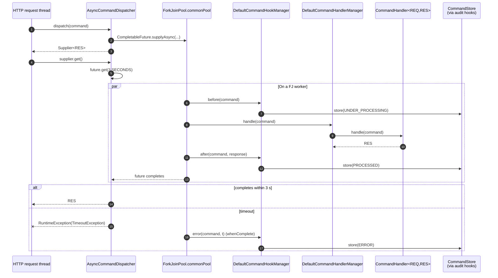

The `fineract-command-async` module is an alternative
[`CommandDispatcher`](https://github.com/apache/fineract/blob/develop/fineract-command/src/main/java/org/apache/fineract/command/core/CommandDispatcher.java)
implementation for Apache Fineract's command bus. It runs the hook chain and
the handler on a `ForkJoinPool.commonPool()` thread via
`CompletableFuture.supplyAsync(...)`, then blocks the caller on
`future.get(timeout)`. This page reads every file under
`fineract-command-async/src/main/java/org/apache/fineract/command/async/` and
explains when (and when not) to turn it on.

<Warning>
  The dispatcher's source file carries an explicit
  `// TODO: WIP - not ready yet for prime time` comment. Use it for
  experiments — the synchronous dispatcher remains the production default.
</Warning>

## Package layout

```
fineract-command-async/src/main/java/org/apache/fineract/command/async/
├── AsyncCommandProperties.java
├── implementation/
│   └── AsyncCommandDispatcher.java
└── starter/
    └── AsyncCommandAutoConfiguration.java
```

And the auto-configuration entry:

```
fineract-command-async/src/main/resources/META-INF/spring/org.springframework.boot.autoconfigure.AutoConfiguration.imports
└── org.apache.fineract.command.async.starter.AsyncCommandAutoConfiguration
```

## `AsyncCommandProperties` — `fineract.command.async.*`

```java
// fineract-command-async/.../command/async/AsyncCommandProperties.java
@ConfigurationProperties(prefix = "fineract.command.async")
public final class AsyncCommandProperties implements Serializable {

    @Builder.Default
    private Boolean enabled = false;

    @Builder.Default
    private Duration timeout = Duration.ofSeconds(3L);
}
```

| Property                       | Default | Purpose                                              |
|--------------------------------|---------|------------------------------------------------------|
| `fineract.command.async.enabled` | `false` | Master switch. When `true`, replaces the synchronous dispatcher. |
| `fineract.command.async.timeout` | `PT3S`  | Configured timeout — **see caveat below**, the dispatcher today still hard-codes 3 s. |

## `AsyncCommandDispatcher` — the whole class

```java
// fineract-command-async/.../command/async/implementation/AsyncCommandDispatcher.java
// TODO: WIP - not ready yet for prime time
@Component
@ConditionalOnProperty(value = "fineract.command.async.enabled", havingValue = "true")
public class AsyncCommandDispatcher implements CommandDispatcher {

    private final CommandHandlerManager handlerManager;
    private final CommandHookManager    hookManager;

    @Override
    public <REQ, RES> Supplier<RES> dispatch(final Command<REQ> command) {
        requireNonNull(command, "Command must not be null");

        CompletableFuture<RES> future = CompletableFuture.supplyAsync(() -> {
            hookManager.before(command);
            RES response = handlerManager.handle(command);
            hookManager.after(command, response);
            return response;
        }).whenComplete((response, t) -> {
            if (t != null) {
                hookManager.error(command, t);
            }
        });

        return () -> {
            try {
                // TODO: make this configurable
                return future.get(3, SECONDS);
            } catch (InterruptedException | ExecutionException | TimeoutException e) {
                throw new RuntimeException(e);
            }
        };
    }
}
```

A handful of design choices worth calling out:

1. **`supplyAsync` with no `Executor`** — runs on `ForkJoinPool.commonPool()`.
   No `TaskExecutor` bean is currently wired; if you want a dedicated pool,
   configure a Spring `ThreadPoolTaskExecutor` and have the dispatcher pass it
   into `supplyAsync(supplier, executor)`. The TODO inside `dispatch(...)`
   acknowledges this.
2. **Same hook pipeline as synchronous** — `before` → `handle` → `after`, with
   `error` driven from `whenComplete`. So `AuditCommandHookBefore/After/Error`
   still persist state transitions through `CommandStore.store(...)`.
3. **3-second wall clock** — hard-coded `future.get(3, SECONDS)`. The
   configurable `timeout` field in `AsyncCommandProperties` is **not yet
   consumed** by the dispatcher. Filed under the `// TODO: make this configurable`
   comment.
4. **Exception wrapping** — every checked exception becomes
   `new RuntimeException(e)`. Callers that need the underlying
   `IdempotentCommandProcessUnderProcessingException` (etc.) have to unwrap
   `getCause()` themselves.
5. **`Supplier<RES>` is still the return type** — same as
   `SynchronousCommandDispatcher`. Code in `fineract-command-test` and the new
   SPI can swap dispatchers without changing their call sites.

## `AsyncCommandAutoConfiguration` — wiring

```java
// fineract-command-async/.../command/async/starter/AsyncCommandAutoConfiguration.java
@AutoConfiguration
@EnableConfigurationProperties(AsyncCommandProperties.class)
@ComponentScan("org.apache.fineract.command.async.implementation")
@ConditionalOnProperty(value = "fineract.command.async.enabled", havingValue = "true")
public class AsyncCommandAutoConfiguration {}
```

- `@ConditionalOnProperty` short-circuits the entire module when the flag is
  off, so the `AsyncCommandDispatcher` bean isn't created and the
  `SynchronousCommandDispatcher` (which is `@ConditionalOnMissingBean`) stays
  in charge.
- `@ComponentScan` only picks up `implementation/` — there are no hooks in
  this module.
- The auto-configuration imports file registers this class with Spring Boot.

## Threading model



Two non-obvious consequences:

- **No security context propagation.** `ForkJoinPool.commonPool()` workers do
  not inherit Spring's `SecurityContextHolder` (which is `ThreadLocal`).
  Handlers that call `context.authenticatedUser(...)` will see no user. The
  `UsernameCommandHook` in `fineract-command/.../hook/` runs **on the worker
  thread**, so it will hit the `DEFAULT_USERNAME = "unknown"` branch.
- **No request-scoped beans.** `RequestContextHolder.getRequestAttributes()`
  inside `ServletHeadersCommandHook` also returns `null` on a worker thread, so
  the IP and `Idempotency-Key` header reads silently produce nulls.

These are the practical reasons the dispatcher is marked WIP. Fixing them
requires either:

1. Capturing the security + request context on the caller thread and copying
   it into the supplier (e.g. via Spring Security's
   `DelegatingSecurityContextRunnable` and Spring's
   `RequestContextHolder.setRequestAttributes(..., true)`).
2. Replacing `supplyAsync` with a Spring `TaskExecutor` configured with a
   `SecurityContextTaskDecorator` and a custom `RequestContextDecorator`.

## Error handling

The `whenComplete` callback is what feeds errors into the hook chain:

```java
.whenComplete((response, t) -> {
    if (t != null) {
        hookManager.error(command, t);
    }
});
```

`t` here is wrapped in a `CompletionException` if the supplier threw, so
`AuditCommandHookError` (in `fineract-command-audit`) ends up persisting:

```java
// AuditCommandHookError.java
command.setError(error.getMessage());  // possibly "java.util.concurrent.CompletionException: …"
store.store(command, null, ERROR);
```

If you care about the original cause showing up in `m_command.error`, set up a
small unwrap before passing to `hookManager.error`.

## When to enable

| Scenario                                  | Recommendation                                         |
|-------------------------------------------|--------------------------------------------------------|
| Production REST traffic                   | Leave `enabled=false`. Use synchronous + idempotency.  |
| Long-running batch handlers               | Don't use this dispatcher — it caps wall-clock at 3 s. |
| Stress test where you want bus parallelism | Enable for the `fineract-command-test` `DummyCommand`. |
| Replacement for Spring `@Async` annotations | This is closer to that role, but security context will not propagate without further work. |

## Comparing with the synchronous dispatcher

| Aspect                  | `SynchronousCommandDispatcher`                  | `AsyncCommandDispatcher`                                  |
|-------------------------|-------------------------------------------------|-----------------------------------------------------------|
| Thread                  | Caller (typically the HTTP worker)              | `ForkJoinPool.commonPool()`                               |
| Hook execution thread   | Caller                                          | Worker — no security / request context                    |
| Failure propagation     | Original exception                              | `RuntimeException` wrapping `ExecutionException`          |
| Configurable timeout    | None (handler-bound)                            | Hard-coded 3 s, ignores `AsyncCommandProperties.timeout`  |
| `@ConditionalOnProperty` | Always on (via `@ConditionalOnMissingBean`)    | `fineract.command.async.enabled=true`                     |
| Activation precedence   | Loses to any other `CommandDispatcher` bean     | Wins when the flag is on                                  |

## A safer wiring recipe

If you want to experiment with this dispatcher in a non-production tenant,
here is the minimal `application-async.yml` that captures the missing pieces
the file's TODOs hint at:

```yaml
fineract:
  command:
    async:
      enabled: true
      timeout: PT5S       # (currently unused by the dispatcher — see TODO)
    hooks:
      timestamp-pre: true
      audit-pre: true     # only useful if you also wire fineract-command-audit + jdbc
      audit-post: true
      audit-error: true
    audit:
      enabled: true
    jdbc:
      enabled: true
```

The combination above gives you the async dispatcher writing every successful
or failed envelope into `m_command` via the JDBC store, while the timestamp
hook still stamps `createdAt`. You can additionally enable
`servlet-header-pre` and `username-pre`, but be aware they will read from a
thread that has no Spring Security context, so they will populate `unknown`.

## File map

| Path                                                                                              | Lines | Purpose                          |
|---------------------------------------------------------------------------------------------------|-------|----------------------------------|
| `fineract-command-async/.../async/AsyncCommandProperties.java`                                    | 45    | `fineract.command.async.*` props |
| `fineract-command-async/.../async/implementation/AsyncCommandDispatcher.java`                     | 70    | The dispatcher                   |
| `fineract-command-async/.../async/starter/AsyncCommandAutoConfiguration.java`                     | 30    | Spring Boot auto-configuration   |
| `fineract-command-async/src/main/resources/META-INF/spring/org.springframework.boot.autoconfigure.AutoConfiguration.imports` | 1 | Registers the auto-config |

## Patterns to lift from this dispatcher

Even if you don't enable the module in production, the file is a compact
reference for three Spring + Reactor-style idioms used elsewhere in
`fineract-command*`:

1. **`Supplier<RES>` as a deferred result.** Both
   `SynchronousCommandDispatcher` and `DisruptorCommandDispatcher` return a
   `Supplier`. The async dispatcher leans into this by handing the caller a
   supplier that wraps `future.get(...)`. The same idiom lets the disruptor
   return `future::join`.
2. **`whenComplete` for symmetric error handling.** Rather than fan out into
   `thenApply` / `exceptionally` chains, the dispatcher uses a single
   `whenComplete` that fires the error hook only when `t != null`. This keeps
   the audit pipeline single-threaded across success and failure paths.
3. **`@ConditionalOnProperty` at both the bean and the auto-configuration**.
   Without both, a stale property change to `enabled=true` could leave
   half-wired beans hanging around (e.g. a configuration properties bean with
   no dispatcher). The duplication is defensive.

## What's next

- [Command Core SPI](/command/command-core) — the `CommandDispatcher` and
  `CommandHookManager` interfaces this module fulfils.
- [Command Implementation](/command/command-implementation) — the synchronous
  dispatcher this one replaces.
- [Command Audit Hooks](/command/command-audit) — hooks that fire on the
  worker thread and write `CommandState` transitions.
- [Disruptor Dispatcher](/command/command-disruptor) — a more sophisticated
  alternative built on the LMAX Disruptor, also marked WIP.
