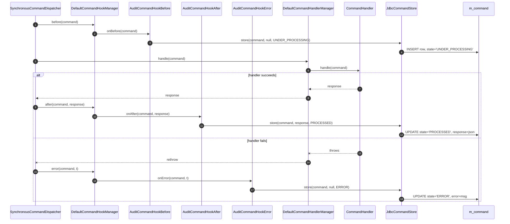
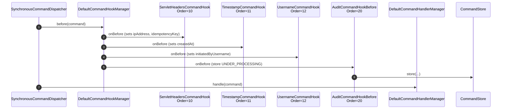

The `fineract-command-audit` module ships three `@Order(20)` Spring components
that hook into Apache Fineract's command bus and persist every state
transition into the `CommandStore`. It is the bridge between the in-process SPI
(`fineract-command/core/`) and the durable log
(`fineract-command-jdbc/store/`). This page documents every file under
`fineract-command-audit/src/main/java/org/apache/fineract/command/audit/` and
shows how it lines up with the older provider-side audit machinery
(`AuditData`, `/v1/audits`).

## Package layout

```
fineract-command-audit/src/main/java/org/apache/fineract/command/audit/
├── AuditCommandConstants.java
├── AuditCommandProperties.java
├── hook/
│   ├── AuditCommandHookAfter.java
│   ├── AuditCommandHookBefore.java
│   └── AuditCommandHookError.java
└── starter/
    └── AuditCommandAutoConfiguration.java
```

Spring Boot picks this up via
`fineract-command-audit/src/main/resources/META-INF/spring/org.springframework.boot.autoconfigure.AutoConfiguration.imports`:

```
org.apache.fineract.command.audit.starter.AuditCommandAutoConfiguration
```

## `AuditCommandProperties`

```java
// fineract-command-audit/.../command/audit/AuditCommandProperties.java
@ConfigurationProperties(prefix = "fineract.command.audit")
public final class AuditCommandProperties implements Serializable {

    @Builder.Default
    private Boolean enabled = false;
}
```

A single master switch (`fineract.command.audit.enabled=true`). The
auto-configuration's `@ConditionalOnProperty` short-circuits the module when
this is off.

## `AuditCommandConstants` — hook order

```java
// fineract-command-audit/.../command/audit/AuditCommandConstants.java
public final class AuditCommandConstants {

    public static final int COMMAND_HOOK_AUDIT_BEFORE = 20;
    public static final int COMMAND_HOOK_AUDIT_AFTER  = 20;
    public static final int COMMAND_HOOK_AUDIT_ERROR  = 20;
}
```

All three audit hooks run at order `20`, after the three built-in
`fineract-command` hooks (`ServletHeaders=10`, `Timestamp=11`, `Username=12`).
The choice of identical priorities is deliberate — they touch different
lifecycle phases so they never compete with each other.

## `AuditCommandHookBefore` — open the audit row

```java
// fineract-command-audit/.../command/audit/hook/AuditCommandHookBefore.java
@Order(COMMAND_HOOK_AUDIT_BEFORE)
@ConditionalOnProperty(value = "fineract.command.hooks.audit-pre", havingValue = "true")
final class AuditCommandHookBefore implements CommandHookBefore<Object> {

    private final CommandStore store;

    @Override
    public void onBefore(Command<Object> command) {
        final var now = Instant.now();

        command.setExecutedByUsername(command.getInitiatedByUsername());
        command.setUpdatedAt(now);
        command.setExecutedAt(now);

        store.store(command, null, UNDER_PROCESSING);
    }
}
```

Three things happen:

1. **Stamp executor.** Initially the executor is the same as the initiator.
   Maker–checker can later override this (see
   [Maker-Checker & Audits](/command/maker-checker-and-audits)).
2. **Stamp times.** `updatedAt` and `executedAt` are set to `Instant.now()`.
3. **Persist `UNDER_PROCESSING`.** `CommandStore.store(...)` writes a row in
   the durable log with the request payload. For
   [`JdbcCommandStore`](/command/command-jdbc-store) this becomes an
   `INSERT INTO m_command (...)` with `state = 'UNDER_PROCESSING'` and
   `request = …json…`.

Activated by `fineract.command.hooks.audit-pre=true`.

## `AuditCommandHookAfter` — mark `PROCESSED`

```java
// fineract-command-audit/.../command/audit/hook/AuditCommandHookAfter.java
@Order(COMMAND_HOOK_AUDIT_AFTER)
@ConditionalOnProperty(value = "fineract.command.hooks.audit-post", havingValue = "true")
final class AuditCommandHookAfter implements CommandHookAfter<Object, Object> {

    private final CommandStore store;

    @Override
    public void onAfter(Command<Object> command, Object response) {
        final var now = Instant.now();

        command.setExecutedByUsername(command.getInitiatedByUsername());
        command.setUpdatedAt(now);
        command.setExecutedAt(now);

        store.store(command, response, PROCESSED);
    }
}
```

Same shape as `AuditCommandHookBefore`, but called with the actual `response`
object and `CommandState.PROCESSED`. The store handles upsert by `commandId`
(set on the `Command<T>` envelope by `JdbcCommandStore.store(...)`).

Activated by `fineract.command.hooks.audit-post=true`.

## `AuditCommandHookError` — mark `ERROR` and write the message

```java
// fineract-command-audit/.../command/audit/hook/AuditCommandHookError.java
@Order(COMMAND_HOOK_AUDIT_ERROR)
@ConditionalOnProperty(value = "fineract.command.hooks.audit-error", havingValue = "true")
final class AuditCommandHookError implements CommandHookError<Object> {

    private final CommandStore store;

    @Override
    public void onError(Command<Object> command, Throwable error) {
        final var now = Instant.now();

        command.setError(error.getMessage());
        command.setUpdatedAt(now);
        command.setExecutedAt(now);

        store.store(command, null, ERROR);
    }
}
```

The error message goes into `Command.error` and ends up in the
`m_command.error` text column.

Activated by `fineract.command.hooks.audit-error=true`.

## `AuditCommandAutoConfiguration`

```java
// fineract-command-audit/.../command/audit/starter/AuditCommandAutoConfiguration.java
@AutoConfiguration
@EnableConfigurationProperties({ CommandProperties.class, AuditCommandProperties.class })
@ComponentScan("org.apache.fineract.command.audit.hook")
@ConditionalOnProperty(value = "fineract.command.audit.enabled", havingValue = "true")
public class AuditCommandAutoConfiguration {}
```

- Master switch: `fineract.command.audit.enabled=true`.
- `@ComponentScan` only picks the three hooks (the constants and properties
  classes don't need scanning).
- The shared `CommandProperties` is also marked
  `@EnableConfigurationProperties` so audit hooks can read it through
  injection (e.g. to know whether the bus is globally `enabled`).

## Activation matrix

The module is layered on top of `fineract-command` — turning the master switch
on does **not** by itself install any hooks. Each hook needs its own flag too:

```properties
# Master switch — installs the auto-configuration
fineract.command.audit.enabled=true

# Per-hook switches — opt in to specific lifecycle events
fineract.command.hooks.audit-pre=true
fineract.command.hooks.audit-post=true
fineract.command.hooks.audit-error=true

# A JDBC backed CommandStore must also be active
fineract.command.jdbc.enabled=true
```

The three audit hooks call into `CommandStore`. With no other module on the
classpath that satisfies that bean, application startup fails. The expected
companion is [`fineract-command-jdbc`](/command/command-jdbc-store).

## Lifecycle diagram



## The provider-side audit endpoint

The new SPI's audit machinery writes to `m_command`. The **older** provider
audit machinery — which still powers the `/v1/audits` REST endpoint —
writes to `m_portfolio_command_source` via
`PortfolioCommandSourceWritePlatformServiceImpl` (see
[Command Implementation](/command/command-implementation)) and reads it back
through `AuditReadPlatformServiceImpl`.

The shape returned by the older endpoint is
`fineract-provider/src/main/java/org/apache/fineract/commands/data/AuditData.java`:

```java
// fineract-provider/.../commands/data/AuditData.java
@AllArgsConstructor
@Getter
public final class AuditData implements Serializable {

    private final Long          id;
    private final String        actionName;
    private final String        entityName;
    private final Long          resourceId;
    private final Long          subresourceId;
    private final String        maker;
    private final ZonedDateTime madeOnDate;
    private final String        checker;
    private final ZonedDateTime checkedOnDate;
    private final String        processingResult;
    @Setter
    private       String        commandAsJson;
    private final String        officeName;
    private final String        groupLevelName;
    private final String        groupName;
    private final String        clientName;
    private final String        loanAccountNo;
    private final String        savingsAccountNo;
    private final Long          clientId;
    private final Long          loanId;
    private final String        url;
    private final String        ip;
}
```

The endpoint that returns it is
`fineract-provider/src/main/java/org/apache/fineract/commands/api/AuditsApiResource.java`:

```java
@Path("/v1/audits")
@Tag(name = "Audits", description = "Every non-read Mifos API request is audited…")
public class AuditsApiResource {

    private static final String RESOURCE_NAME_FOR_PERMISSIONS = "AUDIT";

    @GET
    public String retrieveAuditEntries(@Context final UriInfo uriInfo,
                                       @BeanParam AuditRequest auditRequest,
                                       @QueryParam("offset") final Integer offset,
                                       @QueryParam("limit")  final Integer limit,
                                       @QueryParam("orderBy") final String orderBy,
                                       @QueryParam("sortOrder") final String sortOrder,
                                       @QueryParam("paged") final Boolean paged) {

        context.authenticatedUser().validateHasReadPermission(RESOURCE_NAME_FOR_PERMISSIONS);
        final PaginationParameters parameters = PaginationParameters.builder()
                .paged(Boolean.TRUE.equals(paged)).limit(limit).offset(offset)
                .orderBy(orderBy).sortOrder(sortOrder).build();
        final SQLBuilder extraCriteria = getExtraCriteria(auditRequest);
        final ApiRequestJsonSerializationSettings settings =
                this.apiRequestParameterHelper.process(uriInfo.getQueryParameters());

        return toApiJsonSerializer.serialize(parameters.isPaged()
                ? auditReadPlatformService.retrievePaginatedAuditEntries(extraCriteria, settings.isIncludeJson(), parameters)
                : auditReadPlatformService.retrieveAuditEntries(extraCriteria, settings.isIncludeJson()));
    }

    @GET
    @Path("{auditId}")
    public AuditData retrieveAuditEntry(@PathParam("auditId") final Long auditId) {
        context.authenticatedUser().validateHasReadPermission(RESOURCE_NAME_FOR_PERMISSIONS);
        return auditReadPlatformService.retrieveAuditEntry(auditId);
    }
}
```

Two distinct audit stores currently live side by side:

| Concern                     | Provider stack (`fineract-core` + `fineract-provider`) | Command-audit stack (`fineract-command-audit`)       |
|-----------------------------|--------------------------------------------------------|------------------------------------------------------|
| Table                       | `m_portfolio_command_source`                           | `m_command`                                          |
| Persisted by                | `CommandSourceService.saveInitial / saveResult`         | `AuditCommandHookBefore/After/Error` → `CommandStore` |
| Read API                    | `GET /v1/audits`, `AuditData`                          | None yet — direct DB / `CommandStore` lookups        |
| State enum                  | `CommandProcessingResultType` (int)                    | `CommandState` (string)                              |
| Maker–checker support       | Yes, via `MakercheckersApiResource`                    | Hook-based; no REST endpoint yet                     |
| Webhook event integration   | Yes, `HookEvent` in `SynchronousCommandProcessingService` | None                                              |

The audit endpoint reads from the **provider** table. The audit hooks in this
module persist to the **new** `m_command` table. Today the two evolve in
parallel; eventually the new SPI is expected to subsume the provider stack.

## Hook ordering across modules

Putting it all together with the three built-in hooks from
`fineract-command/.../hook/`:



## What's next

- [Command JDBC Store](/command/command-jdbc-store) — the `CommandStore`
  implementation these hooks call into.
- [Maker-Checker & Audits](/command/maker-checker-and-audits) — how
  `markAsAwaitingApproval()`, `markAsChecked(...)`, and `markAsRejected(...)` on
  `CommandSource` interact with `AuditsApiResource` and
  `MakercheckersApiResource`.
- [Command Core SPI](/command/command-core) — the
  `CommandHookBefore/After/Error` interfaces these hooks implement.
- [Command Implementation](/command/command-implementation) — how the
  synchronous dispatcher drives the hook chain.
