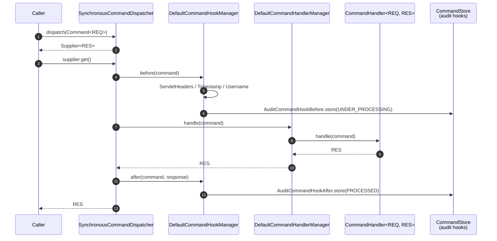
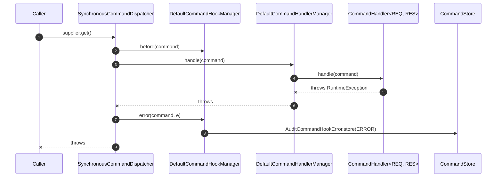

The `fineract-command` Gradle module is the SPI every other `fineract-command-*`
module compiles against. It contains no behaviour — only interfaces, value
objects, properties, three built-in hooks, and three exception types. This page
walks every file in
`fineract-command/src/main/java/org/apache/fineract/command/core/` and
`…/command/hook/`, with the Apache Fineract command bus as context.

## Package layout

```
fineract-command/src/main/java/org/apache/fineract/command/
├── core/
│   ├── Command.java
│   ├── CommandConstants.java
│   ├── CommandDispatcher.java
│   ├── CommandHandler.java
│   ├── CommandHandlerManager.java
│   ├── CommandHookAfter.java
│   ├── CommandHookBefore.java
│   ├── CommandHookError.java
│   ├── CommandHookManager.java
│   ├── CommandProperties.java
│   ├── CommandState.java
│   ├── CommandStore.java
│   └── exception/
│       ├── CommandHandlerNotFoundException.java
│       ├── CommandIllegalArgumentException.java
│       └── CommandPolicyException.java
├── hook/
│   ├── ServletHeadersCommandHook.java
│   ├── TimestampCommandHook.java
│   └── UsernameCommandHook.java
├── implementation/           (covered in Command Implementation)
└── starter/                  (covered in Command Implementation)
```

`fineract-command/src/main/resources/META-INF/spring/org.springframework.boot.autoconfigure.AutoConfiguration.imports`
contains a single line:

```
org.apache.fineract.command.starter.CommandAutoConfiguration
```

That is what plugs the whole module into Spring Boot.

## `Command<T>` — the envelope

```java
// fineract-command/src/main/java/org/apache/fineract/command/core/Command.java
@Data
@FieldNameConstants
public class Command<T> implements Serializable {

    private Long      commandId;
    private String    idempotencyKey;
    private String    ipAddress;

    private Instant   createdAt;
    private Instant   updatedAt;
    private Instant   executedAt;
    private Instant   approvedAt;
    private Instant   rejectedAt;

    private String    initiatedByUsername;
    private String    executedByUsername;
    private String    approvedByUsername;
    private String    rejectedByUsername;

    private String    error;
    private T         payload;
}
```

Two design notes:

- **Generic `payload`** — the dispatcher routes on the runtime class of
  `payload`. The `CommandHandler.matches(...)` default uses
  `com.google.common.reflect.TypeToken` against the handler's own generic
  parameter (`<REQ>`), so a handler declared as
  `CommandHandler<DummyRequest, DummyResponse>` automatically picks any
  `Command<DummyRequest>`.
- **Maker / checker / executor symmetry** — the four `*ByUsername` fields and
  four `*At` timestamps cover the full lifecycle without needing a separate
  approval entity. The audit hooks (`fineract-command-audit`) only have to
  stamp these and call `CommandStore.store(...)`.

## `CommandConstants` — header & ordering constants

```java
// fineract-command/src/main/java/org/apache/fineract/command/core/CommandConstants.java
public final class CommandConstants {
    public static final String COMMAND_JSON_CLASS_ATTRIBUTE  = "@class";
    public static final String COMMAND_HTTP_HEADER_REQUEST_ID = "x-fineract-request-id";
    public static final String COMMAND_HTTP_HEADER_TENANT_ID = "Fineract-Platform-TenantId";
    public static final String COMMAND_HTTP_HEADER_IP        = "IP";
    public static final int    COMMAND_HOOK_ORDER_HEADERS    = 10;
    public static final int    COMMAND_HOOK_ORDER_TIMESTAMP  = 11;
    public static final int    COMMAND_HOOK_ORDER_USERNAME   = 12;
}
```

`COMMAND_JSON_CLASS_ATTRIBUTE` is the secret sauce of `JdbcCommandStore`: when
the request/response is serialised into the `m_command.request` JSONB column,
the writer adds `"@class": "com.foo.Bar"`. The reader looks at that key and
calls `objectMapper.convertValue(json, Class.forName("com.foo.Bar"))` to
reconstruct the typed payload. See
[`CommandJsonMapper`](/command/command-jdbc-store#commandjsonmapper).

## `CommandHandler<REQ, RES>` — write the business logic

```java
// fineract-command/src/main/java/org/apache/fineract/command/core/CommandHandler.java
public interface CommandHandler<REQ, RES> {

    RES handle(Command<REQ> command);

    @SneakyThrows
    default RES fallback(Command<REQ> command, Throwable t) {
        throw t;
    }

    default boolean matches(Command<REQ> command) {
        TypeToken<REQ> handlerType = new TypeToken<>(getClass()) {};
        return handlerType.getRawType().isAssignableFrom(command.getPayload().getClass());
    }
}
```

Three things to notice:

1. **`fallback(...)`** — Resilience4j integration. A handler can annotate
   `handle` with `@Retry(name = "commandDummy", fallbackMethod = "fallback")`
   and Resilience4j will call its `fallback` after exhausting retries. The
   reference example is `fineract-command-test/.../handler/DummyCommandHandler.java`:

   ```java
   @Retry(name = "commandDummy", fallbackMethod = "fallback")
   @Override
   public DummyResponse handle(Command<DummyRequest> command) {
       return dummyService.process(command.getPayload());
   }
   ```

2. **`matches(...)`** uses `TypeToken` from Guava. It only looks at the **first**
   generic parameter, so a handler implementing
   `CommandHandler<DummyRequest, DummyResponse>` matches any `Command<DummyRequest>`
   regardless of `RES`.

3. **No annotation needed** — unlike the older `@CommandType` mechanism used in
   `fineract-core` (see
   [Command Handlers Catalogue](/command/command-handlers-catalog)), the new
   SPI relies on generics + Spring component scanning only.

## `CommandHandlerManager` — pick a handler

```java
// fineract-command/src/main/java/org/apache/fineract/command/core/CommandHandlerManager.java
@FunctionalInterface
public interface CommandHandlerManager {
    <REQ, RES> RES handle(Command<REQ> command);
}
```

The default implementation, `DefaultCommandHandlerManager`, is in the
`implementation/` package and is covered on [Command Implementation](/command/command-implementation).
It iterates all `CommandHandler` beans, picks the first whose `matches(command)`
returns true, and throws `CommandHandlerNotFoundException` otherwise.

## `CommandDispatcher` — invoke the pipeline

```java
// fineract-command/src/main/java/org/apache/fineract/command/core/CommandDispatcher.java
public interface CommandDispatcher {

    <REQ, RES> Supplier<RES> dispatch(Command<REQ> command);
}
```

The return type is `Supplier<RES>`, not `RES`, on purpose:

- For the **synchronous** dispatcher, calling `.get()` runs the pipeline inline.
- For the **async** dispatcher, the supplier blocks on a `CompletableFuture`.
- For the **disruptor** dispatcher, the supplier is `future::join` on a future
  the ring-buffer event handler completes.

This makes "fire-and-forget vs. fire-and-await" a caller choice, not a
dispatcher choice.

## The hook SPI

Three single-method interfaces describe the three lifecycle points. Each is
`@FunctionalInterface` (except the manager, which exposes all three):

```java
// CommandHookBefore.java
public interface CommandHookBefore<REQ> {
    void onBefore(Command<REQ> command);
}

// CommandHookAfter.java
public interface CommandHookAfter<REQ, RES> {
    void onAfter(Command<REQ> command, RES response);
}

// CommandHookError.java
public interface CommandHookError<REQ> {
    void onError(Command<REQ> command, Throwable error);
}
```

A coordinating bean implements:

```java
// CommandHookManager.java
public interface CommandHookManager {
    void before(Command command);
    void after(Command command, Object response);
    void error(Command command, Throwable error);
}
```

`DefaultCommandHookManager` (in `implementation/`) injects
`List<CommandHookBefore>` / `List<CommandHookAfter>` / `List<CommandHookError>`
and calls each in order. Because every hook is a Spring `@Component`, the
`@Order` annotation determines the sequence — that's why `CommandConstants`
exposes `COMMAND_HOOK_ORDER_HEADERS = 10`, `TIMESTAMP = 11`, `USERNAME = 12`,
and `fineract-command-audit` uses `20` for all three audit hooks.

### Built-in hooks (`hook/` package)

Three reference implementations ship in
`fineract-command/src/main/java/org/apache/fineract/command/hook/`. All three
are `@ConditionalOnProperty` so they default to **off**.

#### `ServletHeadersCommandHook` — pull IP + idempotency key from headers

```java
// fineract-command/.../hook/ServletHeadersCommandHook.java
@Order(COMMAND_HOOK_ORDER_HEADERS)
@ConditionalOnProperty(value = "fineract.command.hooks.servlet-header-pre", havingValue = "true")
final class ServletHeadersCommandHook implements CommandHookBefore<Object> {

    private final CommandProperties properties;

    @Override
    public void onBefore(Command<Object> command) {
        if (StringUtils.isEmpty(command.getIpAddress())) {
            command.setIpAddress(getHeader(COMMAND_HTTP_HEADER_IP, false));
        }
        if (StringUtils.isEmpty(command.getIdempotencyKey())) {
            command.setIdempotencyKey(getHeader(properties.getIdemPotencyKeyHeaderName(), false));
        }
    }

    private String getHeader(String name, boolean searchParameter) {
        var attributes = RequestContextHolder.getRequestAttributes();
        if (attributes instanceof ServletRequestAttributes servletAttributes) {
            var value = servletAttributes.getRequest().getHeader(name.toLowerCase());
            if (searchParameter && StringUtils.isEmpty(value)) {
                value = servletAttributes.getRequest().getParameter(name.toLowerCase());
            }
            return value;
        }
        return null;
    }
}
```

The default `Idempotency-Key` header name is configurable through
`CommandProperties.idemPotencyKeyHeaderName` (see below).

#### `TimestampCommandHook` — stamp `createdAt`

```java
@Order(COMMAND_HOOK_ORDER_TIMESTAMP)
@ConditionalOnProperty(value = "fineract.command.hooks.timestamp-pre", havingValue = "true")
final class TimestampCommandHook implements CommandHookBefore<Object> {

    @Override
    public void onBefore(Command<Object> command) {
        if (command.getCreatedAt() == null) {
            command.setCreatedAt(Instant.now());
        }
    }
}
```

#### `UsernameCommandHook` — read `SecurityContextHolder`

```java
@Order(COMMAND_HOOK_ORDER_USERNAME)
@ConditionalOnProperty(value = "fineract.command.hooks.username-pre", havingValue = "true")
final class UsernameCommandHook implements CommandHookBefore<Object> {

    private static final String DEFAULT_USERNAME = "unknown";

    @Override
    public void onBefore(Command<Object> command) {
        if (StringUtils.isEmpty(command.getInitiatedByUsername())) {
            command.setInitiatedByUsername(getUsername());
        }
    }

    private String getUsername() {
        final var context = SecurityContextHolder.getContext();
        if (context != null) {
            final var auth = context.getAuthentication();
            if (auth != null) {
                return auth.getName();
            }
        }
        return DEFAULT_USERNAME;
    }
}
```

Together these three hooks satisfy the same envelope-filling job that
`PortfolioCommandSourceWritePlatformServiceImpl` performs in the older API.

## `CommandState` — lifecycle enum

```java
// fineract-command/src/main/java/org/apache/fineract/command/core/CommandState.java
public enum CommandState {
    INVALID, PROCESSED, AWAITING_APPROVAL, REJECTED, UNDER_PROCESSING, ERROR, UNKNOWN
}
```

Compare with the provider-side enum
`fineract-core/.../commands/domain/CommandProcessingResultType.java`, which uses
integer codes (`PROCESSED = 1`, `AWAITING_APPROVAL = 2`, …) and stores them in
the `m_portfolio_command_source.status` column. The two enums are intentionally
parallel: the new SPI uses string names persisted in `m_command.state`, the old
one uses ints in `m_portfolio_command_source.status`.

## `CommandStore` — persistence SPI

```java
// fineract-command/src/main/java/org/apache/fineract/command/core/CommandStore.java
public interface CommandStore {
    <T> T            getRequestById(Long id);
    <T> T            getResponseById(Long id);
    CommandState     getStateById(Long id);

    <T> T            getRequestByKey(String key);
    <T> T            getResponseByKey(String key);
    CommandState     getStateByKey(String key);

    void store(Command<?> command, Object response, CommandState state);
}
```

`fineract-command` itself does **not** ship an implementation — it's a pure
SPI. Two stores live elsewhere:

- `fineract-command-jdbc/.../store/JdbcCommandStore` (the default once enabled).
- Tests in `fineract-command/src/test` use stub implementations.

The `getRequestByKey` / `getResponseByKey` overloads are how idempotency
replay works: given the same `Idempotency-Key`, return the previously stored
response without re-executing.

## `CommandProperties` — `fineract.command.*`

```java
// fineract-command/src/main/java/org/apache/fineract/command/core/CommandProperties.java
@ConfigurationProperties(prefix = "fineract.command")
public final class CommandProperties implements Serializable {

    @Builder.Default private Boolean enabled = true;
    @Builder.Default private Map<String, Boolean> hooks = new HashMap<>();
    @Builder.Default private String idemPotencyKeyHeaderName = "Idempotency-Key";
}
```

`enabled` is a master kill-switch (defaults to `true`); the per-hook
`fineract.command.hooks.<hook-name>` flags are matched by
`@ConditionalOnProperty` on individual `@Component`s.

## Exception types

Three runtime exceptions live under `core/exception/`:

```java
// CommandHandlerNotFoundException.java
public class CommandHandlerNotFoundException extends RuntimeException {
    public CommandHandlerNotFoundException(Command<?> command) {
        super("Cannot find a matching handler for "
              + (command != null ? command.getClass().getSimpleName() : "UKNOWN")
              + " command");
    }
}

// CommandIllegalArgumentException.java
public class CommandIllegalArgumentException extends RuntimeException {
    public CommandIllegalArgumentException(Command<?> command, String message) {
        super("Illegal argument for " + command.getClass().getSimpleName()
              + " command: " + message);
    }
}

// CommandPolicyException.java
public class CommandPolicyException extends RuntimeException {
    public CommandPolicyException(Command<?> command, String message) {
        super("Policy exception for " + command.getClass().getSimpleName()
              + " command: " + message);
    }
}
```

- `CommandHandlerNotFoundException` is thrown by `DefaultCommandHandlerManager`
  when no `CommandHandler` matches.
- `CommandIllegalArgumentException` and `CommandPolicyException` are reserved
  for handlers to throw; they are not raised by the core itself.

These are intentionally **unchecked** so a handler can throw them from inside a
lambda passed to `Disruptor.publishEvent(...)` or `CompletableFuture.supplyAsync(...)`
without an `@SneakyThrows`.

## The dispatch contract, end to end

A typical synchronous call looks like:



If `handle(...)` throws:



## How this SPI relates to the provider-side API

| Concern             | `fineract-command` core (new SPI)                 | `fineract-core` commands (live API)              |
|---------------------|---------------------------------------------------|--------------------------------------------------|
| Envelope            | `Command<T>` with typed `payload`                 | `CommandWrapper` + `JsonCommand`                 |
| Handler             | `CommandHandler<REQ, RES>` (generics)             | `NewCommandSourceHandler` + `@CommandType`       |
| Dispatcher          | `CommandDispatcher.dispatch(...)` → `Supplier`    | `SynchronousCommandProcessingService`            |
| Storage             | `CommandStore` interface                          | `CommandSourceRepository` (JPA) + `m_portfolio_command_source` |
| Lifecycle states    | `CommandState` enum (strings)                     | `CommandProcessingResultType` (ints)             |
| Permission gate     | none yet                                          | `AppUser.validateHasPermissionTo(...)`           |
| Maker–checker       | hook-based via stored `CommandState`              | `RollbackTransactionNotApprovedException`        |

The two APIs **coexist** in the same JVM. The newer SPI is intentionally
minimal and decoupled so future modules can use it without inheriting the
JPA/JsonCommand machinery, while the live REST surface still goes through the
older provider stack.

## What's next

- [Command Implementation](/command/command-implementation) — the
  `DefaultCommandHandlerManager`, `DefaultCommandHookManager`, and
  `SynchronousCommandDispatcher` in the `implementation/` package, and the
  Spring Boot auto-configuration that wires them up.
- [Command JDBC Store](/command/command-jdbc-store) — the `CommandStore`
  implementation backed by `m_command`.
- [Async Command Dispatcher](/command/command-async) and
  [Disruptor Dispatcher](/command/command-disruptor) — alternative
  `CommandDispatcher` implementations.
