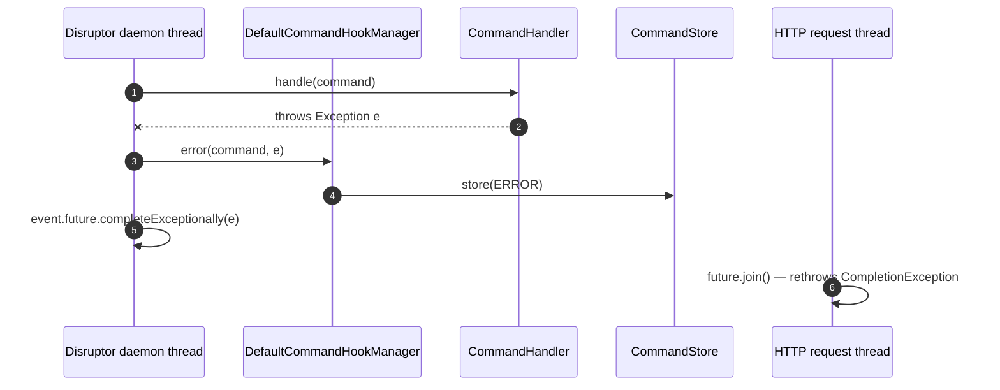

The `fineract-command-disruptor` Gradle module replaces Apache Fineract's
default `CommandDispatcher` with one backed by an
[LMAX Disruptor](https://lmax-exchange.github.io/disruptor/) ring buffer. The
caller thread publishes a `CommandEvent` into the ring and waits on a
`CompletableFuture` that a dedicated daemon thread completes after the
handler runs. This page walks every file under
`fineract-command-disruptor/src/main/java/org/apache/fineract/command/disruptor/`.

<Warning>
  Like the async dispatcher, the disruptor implementation source carries the
  explicit comment `// TODO: WIP - not ready yet for prime time`. It is gated
  off by default. The synchronous dispatcher remains the production path.
</Warning>

## Package layout

```
fineract-command-disruptor/src/main/java/org/apache/fineract/command/disruptor/
├── DisruptorCommandProperties.java
├── implementation/
│   └── DisruptorCommandDispatcher.java
└── starter/
    ├── DisruptorCommandAutoConfiguration.java
    └── DisruptorCommandConfiguration.java
```

Spring Boot picks this up via
`fineract-command-disruptor/src/main/resources/META-INF/spring/org.springframework.boot.autoconfigure.AutoConfiguration.imports`.

## `DisruptorCommandProperties` — `fineract.command.disruptor.*`

```java
// fineract-command-disruptor/.../command/disruptor/DisruptorCommandProperties.java
@ConfigurationProperties(prefix = "fineract.command.disruptor")
public final class DisruptorCommandProperties implements Serializable {

    @Builder.Default
    private Boolean enabled = false;

    @Builder.Default
    private Integer ringBufferSize = 1024;

    @Builder.Default
    private ProducerType producerType = ProducerType.SINGLE;
}
```

| Property                                  | Default  | Notes                                              |
|-------------------------------------------|----------|----------------------------------------------------|
| `fineract.command.disruptor.enabled`        | `false`  | Master switch.                                     |
| `fineract.command.disruptor.ring-buffer-size` | `1024`   | Must be a power of two; LMAX enforces this.        |
| `fineract.command.disruptor.producer-type`  | `SINGLE` | Use `MULTI` if more than one thread can `dispatch`. |

`ProducerType` comes from `com.lmax.disruptor.dsl.ProducerType`. `SINGLE` is
faster but assumes a single producer thread (only one publisher can claim a
slot at a time). REST workloads where multiple HTTP worker threads publish
concurrently need `MULTI`.

## `DisruptorCommandDispatcher` — publish then await

The full file (minus license header) is short enough to read end to end:

```java
// fineract-command-disruptor/.../implementation/DisruptorCommandDispatcher.java
// TODO: WIP - not ready yet for prime time
@Component
@ConditionalOnProperty(value = "fineract.command.disruptor.enabled", havingValue = "true")
public class DisruptorCommandDispatcher implements CommandDispatcher, Closeable {

    private final Disruptor<CommandEvent> disruptor;

    @Override
    public <REQ, RES> Supplier<RES> dispatch(Command<REQ> command) {
        requireNonNull(command, "Command must not be null");

        CommandEvent<REQ, RES> processedEvent = next(command);

        var future = processedEvent.getFuture();
        return future::join;
    }

    @Override
    public void close() throws IOException {
        disruptor.shutdown();
    }

    @EventListener(ApplicationStartedEvent.class)
    void onStartup() {
        disruptor.start();
    }

    @SuppressWarnings({ "unchecked" })
    private <REQ, RES> CommandEvent<REQ, RES> next(Command<REQ> command) {
        var ringBuffer = disruptor.getRingBuffer();

        var sequenceId = ringBuffer.next();

        CommandEvent<REQ, RES> event = ringBuffer.get(sequenceId);
        event.setCommand(command);
        ringBuffer.publish(sequenceId);

        return event;
    }

    @Getter @Setter
    public static class CommandEvent<REQ, RES> {
        private Command<REQ>          command;
        private CompletableFuture<RES> future = new CompletableFuture<>();
    }

    @RequiredArgsConstructor
    public static class CompleteableCommandEventHandler implements EventHandler<CommandEvent> {

        private final CommandHookManager     hookManager;
        private final CommandHandlerManager  handlerManager;

        @Override
        public void onEvent(CommandEvent event, long sequence, boolean endOfBatch) {
            var command = event.getCommand();
            try {
                hookManager.before(command);

                var result = handlerManager.handle(command);

                hookManager.after(command, result);
                event.getFuture().complete(result);
            } catch (Exception e) {
                hookManager.error(command, e);
                event.getFuture().completeExceptionally(e);
            }
        }
    }
}
```

Notes on the publish path:

- **`ringBuffer.next()`** claims the next available slot, blocking only if the
  ring is full (LMAX waits using the configured `WaitStrategy`).
- The same `CommandEvent` instance is **reused** for that slot — LMAX
  allocates the ring at startup. Storing `Command<REQ>` and `CompletableFuture`
  on the event is just slot mutation, not allocation.
- `future::join` is a method reference; `Supplier.get()` becomes `future.join()`
  which blocks the caller until `CompleteableCommandEventHandler.onEvent`
  completes (or completes exceptionally).
- **`@EventListener(ApplicationStartedEvent.class)`** waits for Spring Boot to
  finish bringing the context up before starting the Disruptor — that ensures
  every `CommandHandler` and `CommandHookBefore/After/Error` bean is registered
  on `DefaultCommandHandlerManager` and `DefaultCommandHookManager` before any
  event can be processed.
- **`Closeable`** integration — Spring calls `close()` (it sees the bean is
  `Closeable`) during shutdown to drain the ring.

## `DisruptorCommandConfiguration` — wire the ring

```java
// fineract-command-disruptor/.../starter/DisruptorCommandConfiguration.java
@Configuration
class DisruptorCommandConfiguration {

    @Bean
    @ConditionalOnMissingBean
    WaitStrategy waitStrategy() {
        return new YieldingWaitStrategy();
    }

    @Bean
    Disruptor<?> disruptor(DisruptorCommandProperties properties, WaitStrategy waitStrategy,
                           CommandHookManager hookManager, CommandHandlerManager handlerManager) {
        Disruptor<DisruptorCommandDispatcher.CommandEvent> disruptor = new Disruptor<>(
                DisruptorCommandDispatcher.CommandEvent::new,
                properties.getRingBufferSize(),
                DaemonThreadFactory.INSTANCE,
                properties.getProducerType(),
                waitStrategy);

        disruptor.handleEventsWith(new DisruptorCommandDispatcher.CompleteableCommandEventHandler(hookManager, handlerManager));
        disruptor.setDefaultExceptionHandler(new IgnoreExceptionHandler());

        return disruptor;
    }
}
```

What this gives you:

- **`YieldingWaitStrategy`** — fast, CPU-spinning wait strategy. Good for
  low-latency, bad for shared servers. Swap in `BlockingWaitStrategy` or
  `SleepingWaitStrategy` by exposing your own `WaitStrategy` bean (the
  `@ConditionalOnMissingBean` on `waitStrategy()` will step aside).
- **`DaemonThreadFactory.INSTANCE`** — the consumer thread is a daemon, so it
  never blocks JVM shutdown.
- **`IgnoreExceptionHandler`** as the default LMAX exception handler. Any
  exception escaping `CompleteableCommandEventHandler.onEvent` is **silently
  swallowed** by the disruptor itself. In practice this is fine because the
  event handler explicitly catches every `Exception` and pushes it into the
  `CompletableFuture` via `completeExceptionally(...)`. Anything that escapes
  (e.g. an `Error`) is silently dropped — be aware.

## `DisruptorCommandAutoConfiguration`

```java
// fineract-command-disruptor/.../starter/DisruptorCommandAutoConfiguration.java
@AutoConfiguration
@EnableConfigurationProperties(DisruptorCommandProperties.class)
@ComponentScan("org.apache.fineract.command.disruptor.implementation")
@Import({ DisruptorCommandConfiguration.class })
@ConditionalOnProperty(value = "fineract.command.disruptor.enabled", havingValue = "true")
public class DisruptorCommandAutoConfiguration {}
```

The flag gates the entire chain: no flag → no auto-configuration → no
`Disruptor` bean → no `DisruptorCommandDispatcher`, which means
`SynchronousCommandDispatcher` (with `@ConditionalOnMissingBean`) stays.

## Sequence — publish to ring, consume on worker

```mermaid
sequenceDiagram
    autonumber
    participant Caller as HTTP request thread
    participant Disp as DisruptorCommandDispatcher
    participant RB as RingBuffer (size=1024)
    participant Worker as Disruptor daemon thread
    participant Hooks as DefaultCommandHookManager
    participant Mgr as DefaultCommandHandlerManager
    participant Handler as CommandHandler
    participant Store as CommandStore<br/>(via audit hooks)

    Caller->>Disp: dispatch(command)
    Disp->>RB: ringBuffer.next() — claim slot N
    Disp->>RB: event[N].setCommand(command)
    Disp->>RB: ringBuffer.publish(N)
    Disp-->>Caller: Supplier&lt;RES&gt; (future::join)

    Worker->>RB: poll sequence N (YieldingWaitStrategy)
    RB-->>Worker: event[N]
    Worker->>Hooks: before(command)
    Hooks->>Store: store(UNDER_PROCESSING)
    Worker->>Mgr: handle(command)
    Mgr->>Handler: handle(command)
    Handler-->>Mgr: result
    Mgr-->>Worker: result
    Worker->>Hooks: after(command, result)
    Hooks->>Store: store(PROCESSED)
    Worker->>RB: event[N].future.complete(result)

    Caller->>Disp: supplier.get() / future.join()
    Disp-->>Caller: result
```

If the handler throws:



## When the ring fills up

`ringBuffer.next()` blocks the producer thread when the ring is full, applying
back-pressure to the HTTP worker. The wait strategy chosen at consumer-side
also affects producers when the ring is empty, not when it is full — for
producer-side back-pressure the producer just spins on `next()` until a slot
is available.

If you push a sustained higher rate than the single consumer can drain, every
HTTP thread will stall on `next()`. The fix is one of:

- **Use a bigger ring buffer** (`fineract.command.disruptor.ring-buffer-size`).
- **Make handlers faster** (e.g. avoid blocking JDBC calls — the LMAX consumer
  is single-threaded).
- **Use multiple consumers.** The configuration today wires
  `disruptor.handleEventsWith(single handler)`. You could change it to
  `handleEventsWith(handler1, handler2, …)` for parallel work, but then you
  need each handler to filter by command type so ordering / duplicates work.

## Why is there only one consumer?

`CompleteableCommandEventHandler` is registered via
`disruptor.handleEventsWith(new CompleteableCommandEventHandler(...))` — a
**single** `EventHandler`. LMAX guarantees one logical worker per
`EventHandler`, and the configuration does not chain a second one. This is the
same trade-off LMAX itself makes: single-threaded consumption means no locks,
no contention on `CommandSource`/`CommandStore`, but a hard ceiling on
throughput equal to one CPU core's worth of handler work.

## Comparison with the other dispatchers

| Aspect                       | Synchronous                          | Async (`CompletableFuture`)               | Disruptor                                |
|------------------------------|--------------------------------------|-------------------------------------------|------------------------------------------|
| Execution thread             | Caller                               | `ForkJoinPool.commonPool()`               | Single Disruptor daemon thread           |
| Back-pressure                | None (caller is the executor)        | Pool-bound; unbounded queue               | Ring buffer size — producer blocks       |
| Wait strategy                | n/a                                  | n/a                                       | `YieldingWaitStrategy` by default        |
| Ordering guarantee           | Per-thread                            | None                                      | Strict FIFO per ring                     |
| Security context propagation | Inherits caller                      | Lost on worker thread                     | Lost on Disruptor daemon                 |
| Timeout                      | None                                 | Hard-coded 3 s                            | None — `future.join()` blocks forever    |
| `@ConditionalOnProperty`     | n/a                                  | `fineract.command.async.enabled`          | `fineract.command.disruptor.enabled`    |

## When to enable

`fineract.command.disruptor.enabled=true` makes sense in **isolated** code
paths where you control the call site and the handler set:

- Internal command bus for a batch job that publishes thousands of small
  commands and needs strict ordering.
- A microservice carved out of Fineract whose only public surface is the
  command bus.

It is **not** appropriate for the live REST API right now because:

- The provider stack still routes every write through
  `PortfolioCommandSourceWritePlatformService` → `SynchronousCommandProcessingService`,
  which has no awareness of the new `CommandDispatcher` SPI.
- `SecurityContextHolder` and `RequestContextHolder` do not propagate from the
  HTTP thread to the Disruptor consumer; user/IP/idempotency-key derivation
  inside `ServletHeadersCommandHook` / `UsernameCommandHook` would all return
  null defaults.

## File map

| Path                                                                                                | Lines | Purpose                                       |
|-----------------------------------------------------------------------------------------------------|-------|-----------------------------------------------|
| `…/disruptor/DisruptorCommandProperties.java`                                                       | 50    | `fineract.command.disruptor.*` properties     |
| `…/disruptor/implementation/DisruptorCommandDispatcher.java`                                        | 95    | Producer + consumer + `CommandEvent` POJO     |
| `…/disruptor/starter/DisruptorCommandAutoConfiguration.java`                                        | 35    | Spring Boot auto-config gate                  |
| `…/disruptor/starter/DisruptorCommandConfiguration.java`                                            | 55    | `Disruptor` bean, `WaitStrategy`, handlers    |
| `META-INF/spring/org.springframework.boot.autoconfigure.AutoConfiguration.imports`                   | 1     | Boot registration                             |

## What's next

- [Command Core SPI](/command/command-core) — `CommandDispatcher`,
  `CommandHookManager`, and `CommandHandlerManager` interfaces.
- [Async Command Dispatcher](/command/command-async) — the simpler
  `CompletableFuture` alternative.
- [Command Implementation](/command/command-implementation) — what swaps out
  when this module is enabled.
- [Command Audit Hooks](/command/command-audit) — the hooks that fire on the
  Disruptor consumer thread.
