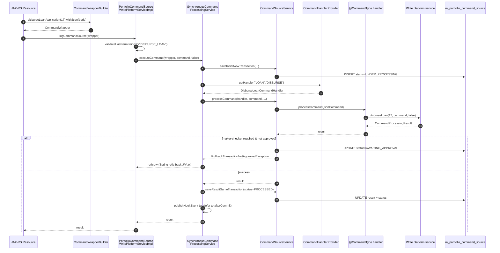

The default dispatcher in Apache Fineract's command bus is **synchronous**: the
HTTP thread runs the handler, persists the `CommandSource` row, and returns the
result before the response goes out. This page reads every file under
`fineract-command/src/main/java/org/apache/fineract/command/implementation/`
and `…/starter/`, then crosses over to
`fineract-core/src/main/java/org/apache/fineract/commands/service/` for the
provider-side `SynchronousCommandProcessingService` that today actually drives
every loan, savings, and accounting write.

## Package layout

```
fineract-command/src/main/java/org/apache/fineract/command/
├── implementation/
│   ├── DefaultCommandHandlerManager.java
│   ├── DefaultCommandHookManager.java
│   └── SynchronousCommandDispatcher.java
└── starter/
    ├── CommandAutoConfiguration.java
    └── CommandConfiguration.java

fineract-core/src/main/java/org/apache/fineract/commands/service/
├── CommandProcessingService.java
├── CommandSourceService.java
├── CommandWrapperBuilder.java
├── IdempotencyKeyGenerator.java
├── IdempotencyKeyResolver.java
├── PortfolioCommandSourceWritePlatformService.java
├── PortfolioCommandSourceWritePlatformServiceImpl.java
└── SynchronousCommandProcessingService.java
```

The two stacks coexist; the new SPI in `fineract-command` provides
`SynchronousCommandDispatcher`, and the older provider stack provides
`SynchronousCommandProcessingService`. Most production writes still go through
the latter.

## `SynchronousCommandDispatcher` — fineract-command default

```java
// fineract-command/.../implementation/SynchronousCommandDispatcher.java
@Component
@ConditionalOnMissingBean(value = CommandDispatcher.class,
                          ignored = SynchronousCommandDispatcher.class)
public class SynchronousCommandDispatcher implements CommandDispatcher {

    private final CommandHandlerManager handlerManager;
    private final CommandHookManager    hookManager;

    @Override
    public <REQ, RES> Supplier<RES> dispatch(final Command<REQ> command) {
        requireNonNull(command, "Command must not be null");

        return () -> {
            try {
                hookManager.before(command);
                RES response = handlerManager.handle(command);
                hookManager.after(command, response);
                return response;
            } catch (Exception e) {
                hookManager.error(command, e);
                throw e;
            }
        };
    }
}
```

Three details:

1. **Lazy execution.** The dispatcher returns a `Supplier<RES>`; nothing runs
   until the caller invokes `.get()`. This is what lets the async and
   disruptor dispatchers swap in transparently.
2. **`@ConditionalOnMissingBean`** — the moment another module exposes a
   `CommandDispatcher` bean (e.g. the disruptor dispatcher when
   `fineract.command.disruptor.enabled=true`), this one steps aside.
3. **Hook ordering.** `before` → `handle` → `after`. If `handle` throws, only
   `error` is invoked; `after` is not.

## `DefaultCommandHandlerManager` — pick the matching `CommandHandler`

```java
// fineract-command/.../implementation/DefaultCommandHandlerManager.java
@Component
@ConditionalOnMissingBean(value = CommandHandlerManager.class,
                          ignored = DefaultCommandHandlerManager.class)
public class DefaultCommandHandlerManager implements CommandHandlerManager {

    private final List<CommandHandler> handlers;

    @Override
    public <REQ, RES> RES handle(Command<REQ> command) {
        CommandHandler<REQ, RES> handler = lookup(command);
        return handler.handle(command);
    }

    private <REQ, RES> CommandHandler<REQ, RES> lookup(Command<REQ> command) {
        if (command == null) {
            throw new CommandHandlerNotFoundException(command);
        }
        return handlers.stream()
                .filter(handler -> handler.matches(command))
                .findFirst()
                .orElseThrow(() -> new CommandHandlerNotFoundException(command));
    }
}
```

Spring's `List<CommandHandler>` injection collects every `CommandHandler` bean
in the application context. `matches(...)` (see
[Command Core SPI](/command/command-core#commandhandlerreq-res-write-the-business-logic))
uses a Guava `TypeToken` to compare the handler's first generic parameter with
the payload's runtime class.

<Warning>
  The TODO inline in this file says `// TODO: make sure there are no duplicate
  handlers`. Today, if two handlers claim the same payload class, the first one
  registered by Spring wins silently. The provider-side
  `CommandHandlerProvider` (see
  [Command Handlers Catalogue](/command/command-handlers-catalog)) uses an
  `entity|action` map and would also overwrite silently.
</Warning>

## `DefaultCommandHookManager` — fan out to hook beans

```java
// fineract-command/.../implementation/DefaultCommandHookManager.java
@Component
@ConditionalOnMissingBean(value = CommandHookManager.class,
                          ignored = DefaultCommandHookManager.class)
public class DefaultCommandHookManager implements CommandHookManager {

    private final List<CommandHookBefore> beforeHooks;
    private final List<CommandHookAfter>  afterHooks;
    private final List<CommandHookError>  errorHooks;

    @Override public void before(Command c)                  { beforeHooks.forEach(h -> h.onBefore(c)); }
    @Override public void after (Command c, Object response) { afterHooks .forEach(h -> h.onAfter(c, response)); }
    @Override public void error (Command c, Throwable error) { errorHooks .forEach(h -> h.onError(c, error)); }
}
```

Spring honours `@Order` on each hook bean, so the registered sequence is:

| Order | Hook                                       | Module                  |
|-------|--------------------------------------------|-------------------------|
| 10    | `ServletHeadersCommandHook` (before only)  | `fineract-command`      |
| 11    | `TimestampCommandHook` (before only)       | `fineract-command`      |
| 12    | `UsernameCommandHook` (before only)        | `fineract-command`      |
| 20    | `AuditCommandHookBefore` / `…After` / `…Error` | `fineract-command-audit` |

## `CommandAutoConfiguration` — Spring Boot wiring

```java
// fineract-command/.../starter/CommandAutoConfiguration.java
@AutoConfiguration
@Import({ CommandConfiguration.class })
public class CommandAutoConfiguration {}

// fineract-command/.../starter/CommandConfiguration.java
@Configuration
@EnableConfigurationProperties(CommandProperties.class)
@ComponentScan("org.apache.fineract.command.core")
@ComponentScan("org.apache.fineract.command.hook")
@ComponentScan("org.apache.fineract.command.implementation")
class CommandConfiguration {}
```

Registered through
`fineract-command/src/main/resources/META-INF/spring/org.springframework.boot.autoconfigure.AutoConfiguration.imports`:

```
org.apache.fineract.command.starter.CommandAutoConfiguration
```

Each downstream module
(`fineract-command-async`, `fineract-command-audit`, `fineract-command-disruptor`,
`fineract-command-jdbc`) ships its own `AutoConfiguration.imports` file naming
its own auto-configuration class. Together they form the Spring Boot
"starter" chain.

---

## The provider-side dispatch — what actually drives Fineract today

The dispatcher class above is the *new* SPI. The *live* one is in
`fineract-core` and is invoked by every JAX-RS resource through
`PortfolioCommandSourceWritePlatformService`.

### Step 1 — REST resource builds the `CommandWrapper`

Resources never construct a `CommandWrapper` by hand. They use the fluent
`CommandWrapperBuilder` (4 000+ lines, one method per command) from
`fineract-core/src/main/java/org/apache/fineract/commands/service/CommandWrapperBuilder.java`:

```java
// fineract-core/.../commands/service/CommandWrapperBuilder.java (excerpt)
public CommandWrapperBuilder loanRepaymentTransaction(final Long loanId) {
    this.actionName = ACTION_REPAYMENT;
    this.entityName = ENTITY_LOAN;
    this.entityId   = null;
    this.loanId     = loanId;
    this.href       = "/loans/" + loanId + "/transactions/template?command=repayment";
    return this;
}

public CommandWrapperBuilder disburseLoanApplication(final Long loanId) { /* … */ }
public CommandWrapperBuilder createLoanApplication()                    { /* … */ }
```

A typical resource snippet (`LoansApiResource`):

```java
CommandWrapper commandRequest = new CommandWrapperBuilder()
        .disburseLoanApplication(loanId)
        .withJson(apiRequestBodyAsJson)
        .build();

CommandProcessingResult result =
        commandsSourceWritePlatformService.logCommandSource(commandRequest);
```

### Step 2 — `PortfolioCommandSourceWritePlatformServiceImpl.logCommandSource`

```java
// fineract-core/.../commands/service/PortfolioCommandSourceWritePlatformServiceImpl.java
@Override
public CommandProcessingResult logCommandSource(final CommandWrapper wrapper) {
    boolean isApprovedByChecker = false;

    if (wrapper.isChangeOfOwnUserDetails(this.context.authenticatedUser(wrapper).getId())) {
        isApprovedByChecker = true;
    } else {
        this.context.authenticatedUser(wrapper)
                    .validateHasPermissionTo(wrapper.getTaskPermissionName());
    }
    validateIsUpdateAllowed();

    final String json = wrapper.getJson();
    final JsonElement parsedCommand = this.fromApiJsonHelper.parse(json);
    JsonCommand command = JsonCommand.from(json, parsedCommand, this.fromApiJsonHelper,
            wrapper.getEntityName(), wrapper.getEntityId(),
            wrapper.getSubentityId(), wrapper.getGroupId(), wrapper.getClientId(),
            wrapper.getLoanId(), wrapper.getSavingsId(), wrapper.getTransactionId(),
            wrapper.getHref(), wrapper.getProductId(), wrapper.getCreditBureauId(),
            wrapper.getOrganisationCreditBureauId(), wrapper.getJobName(),
            wrapper.getLoanExternalId());

    return this.processAndLogCommandService.executeCommand(wrapper, command, isApprovedByChecker);
}
```

The permission code is built by `CommandWrapper`:

```java
this.taskPermissionName = actionName + "_" + entityName;
```

So `disburseLoanApplication(...)` checks `DISBURSE_LOAN`.
`validateIsUpdateAllowed()` defers to
`SchedulerJobRunnerReadService.isUpdatesAllowed()`, blocking writes while
maintenance-mode jobs run.

### Step 3 — `SynchronousCommandProcessingService.executeCommand`

This is where the real choreography happens. The class is in
`fineract-core/src/main/java/org/apache/fineract/commands/service/SynchronousCommandProcessingService.java`
(~410 lines). The orchestration is:

```java
// fineract-core/.../SynchronousCommandProcessingService.java (excerpt)
@Override
public CommandProcessingResult executeCommand(final CommandWrapper wrapper, final JsonCommand command,
        final boolean isApprovedByChecker) {
    return retryWrapper(() -> {
        setIdempotencyKeyStoreFlag(false);

        Long commandId = (Long) fineractRequestContextHolder.getAttribute(COMMAND_SOURCE_ID, null);
        boolean isRetry = commandId != null;
        boolean isEnclosingTransaction = BatchRequestContextHolder.isEnclosingTransaction();

        CommandSource commandSource = null;
        String idempotencyKey;
        if (isRetry) {
            commandSource = commandSourceService.getCommandSource(commandId);
            idempotencyKey = commandSource.getIdempotencyKey();
        } else if ((commandId = command.commandId()) != null) {
            commandSource = commandSourceService.getCommandSource(commandId);
            idempotencyKey = commandSource.getIdempotencyKey();
        } else {
            idempotencyKey = idempotencyKeyResolver.resolve(wrapper);
        }
        exceptionWhenTheRequestAlreadyProcessed(wrapper, idempotencyKey, isRetry);

        AppUser user = context.authenticatedUser(wrapper);
        if (commandSource == null) {
            if (isEnclosingTransaction) {
                commandSource = commandSourceService.getInitialCommandSource(wrapper, command, user, idempotencyKey);
            } else {
                commandSource = commandSourceService.saveInitialNewTransaction(wrapper, command, user, idempotencyKey);
                commandId = commandSource.getId();
            }
        }
        if (commandId != null) {
            storeCommandIdInContext(commandSource);
        }
        setIdempotencyKeyStoreFlag(true);

        return executeCommand(wrapper, command, isApprovedByChecker, commandSource, user, isEnclosingTransaction);
    });
}
```

The inner `executeCommand(...)` actually runs the handler:

```java
result = commandSourceService.processCommand(findCommandHandler(wrapper),
                                             command, commandSource,
                                             user, isApprovedByChecker);
```

### Step 4 — `CommandSourceService.processCommand`

```java
// fineract-core/.../commands/service/CommandSourceService.java
@Transactional
public CommandProcessingResult processCommand(NewCommandSourceHandler handler, JsonCommand command,
        CommandSource commandSource, AppUser user, boolean isApprovedByChecker) {

    final CommandProcessingResult result = handler.processCommand(command);

    String permission = commandSource.getPermissionCode();
    boolean isMakerChecker = configurationDomainService.isMakerCheckerEnabledForTask(permission);
    if (isMakerChecker || result.isRollbackTransaction()) {
        if (isApprovedByChecker || user.isCheckerSuperUser()) {
            commandSource.markAsChecked(user);
        } else {
            if (commandSource.isSanitized()) {
                throw new GeneralPlatformDomainRuleException("error.msg.invalid.sanitization",
                        "Maker-checker command can not be sanitized, please change the permission configuration",
                        permission);
            }
            commandSource.markAsAwaitingApproval();
            throw new RollbackTransactionNotApprovedException(commandSource.getId(),
                                                              commandSource.getResourceId());
        }
    }
    return result;
}
```

If maker–checker is enabled **and** the caller is not the checker, the row is
flipped to `AWAITING_APPROVAL` and `RollbackTransactionNotApprovedException`
forces Spring to roll back the JPA transaction — domain state changes are
undone, but the `CommandSource` row persists (it was inserted in
`REQUIRES_NEW`).

### Step 5 — pick the matching handler via `CommandHandlerProvider`

For a `LOAN`/`DISBURSE` request, the lookup is:

```java
// fineract-core/.../commands/provider/CommandHandlerProvider.java
public NewCommandSourceHandler getHandler(final String entity, final String action) {
    final String key = entity + "|" + action;
    if (!registeredHandlers.containsKey(key)) {
        throw new UnsupportedCommandException(key);
    }
    return (NewCommandSourceHandler) applicationContext.getBean(registeredHandlers.get(key));
}
```

`registeredHandlers` is populated at startup by scanning every Spring bean for
the `@CommandType(entity, action)` annotation:

```java
private void initializeHandlerRegistry() {
    final String[] beans = applicationContext.getBeanNamesForAnnotation(CommandType.class);
    for (final String name : beans) {
        final CommandType type = applicationContext.findAnnotationOnBean(name, CommandType.class);
        if (type != null) {
            registeredHandlers.put(type.entity() + "|" + type.action(), name);
        }
    }
}
```

The provider also routes datatables (`isCreateDatatable`, …) and notes
(`isNoteResource`) directly by bean name, bypassing the annotation map. Those
branches live in `SynchronousCommandProcessingService.findCommandHandler(...)`.

### Step 6 — a concrete handler runs the domain service

```java
// fineract-loan/.../portfolio/loanaccount/handler/DisburseLoanCommandHandler.java
@Service
@RequiredArgsConstructor
@CommandType(entity = "LOAN", action = "DISBURSE")
public class DisburseLoanCommandHandler implements NewCommandSourceHandler {

    private final LoanWritePlatformService writePlatformService;
    private final DataIntegrityErrorHandler dataIntegrityErrorHandler;

    @Transactional
    @Override
    public CommandProcessingResult processCommand(final JsonCommand command) {
        try {
            return this.writePlatformService.disburseLoan(command.entityId(), command, false);
        } catch (final JpaSystemException | DataIntegrityViolationException dve) {
            dataIntegrityErrorHandler.handleDataIntegrityIssues(command, dve.getMostSpecificCause(), dve,
                    "loan.disbursement", "Disbursement");
            return CommandProcessingResult.empty();
        }
    }
}
```

The handler does almost nothing — it unpacks `command.entityId()` and forwards
to `LoanWritePlatformService.disburseLoan(...)`. All business rules live in the
domain service.

### Step 7 — persist the result + hook events

After the handler returns, `SynchronousCommandProcessingService` does three
more things, all in
`fineract-core/.../commands/service/SynchronousCommandProcessingService.java`:

1. **Persist result with retry**:

   ```java
   Retry persistenceRetry = retryConfigurationAssembler.getRetryConfigurationForCommandResultPersistence();
   CommandSource savedCommandSource = persistenceRetry.executeSupplier(() -> {
       CommandSource currentSource = finalCommandSource;
       if (attemptNumber.get() > 1 && commandSource.getId() != null) {
           currentSource = commandSourceService.getCommandSource(finalCommandSource.getId());
       }
       currentSource.setResultStatusCode(SC_OK);
       currentSource.updateForAudit(result);
       currentSource.setResult(toApiResultJsonSerializer.serializeResult(result));
       currentSource.setStatus(PROCESSED);
       return commandSourceService.saveResultSameTransaction(currentSource);
   });
   ```

2. **Bury errors in a fresh transaction**. If the handler throws, the catch
   sets `status = ERROR` and saves in `REQUIRES_NEW` so the main rollback
   doesn't lose the audit trail.

3. **Publish a hook event** (`HookEvent`, see `fineract-provider/.../infrastructure/hooks/`).
   When the call is part of a batch transaction (`isEnclosingTransaction`), the
   event is deferred to `afterCommit` so webhooks don't fire for commands that
   later get rolled back.

   ```java
   if (isEnclosingTransaction && TransactionSynchronizationManager.isSynchronizationActive()) {
       TransactionSynchronizationManager.registerSynchronization(new TransactionSynchronization() {
           @Override public void afterCommit() {
               publishHookEvent(wrapper.entityName(), wrapper.actionName(), command, result);
           }
       });
   } else {
       publishHookEvent(wrapper.entityName(), wrapper.actionName(), command, result);
   }
   ```

## Idempotency replay

`exceptionWhenTheRequestAlreadyProcessed(...)` is the gate:

```java
private void exceptionWhenTheRequestAlreadyProcessed(CommandWrapper wrapper, String idempotencyKey, boolean retry) {
    CommandSource command = commandSourceService.findCommandSource(wrapper, idempotencyKey);
    if (command == null) { return; }
    CommandProcessingResultType status = CommandProcessingResultType.fromInt(command.getStatus());
    switch (status) {
        case UNDER_PROCESSING -> {
            Class<?> last = retryConfigurationAssembler.getLastException();
            if (last == null || IdempotentCommandProcessUnderProcessingException.class.isAssignableFrom(last)) {
                throw new IdempotentCommandProcessUnderProcessingException(wrapper, idempotencyKey);
            }
        }
        case PROCESSED -> throw new IdempotentCommandProcessSucceedException(wrapper, idempotencyKey, command);
        case ERROR -> {
            if (!retry) {
                throw new IdempotentCommandProcessFailedException(wrapper, idempotencyKey, command);
            }
        }
        default -> { }
    }
}
```

`IdempotencyKeyResolver` (in
`fineract-core/.../commands/service/IdempotencyKeyResolver.java`) reads the
`Idempotency-Key` HTTP header; if absent, `IdempotencyKeyGenerator` synthesizes
a UUID.

## End-to-end sequence



## Cross-references between the two stacks

| New SPI (`fineract-command`)              | Provider stack (`fineract-core/commands`)             |
|-------------------------------------------|-------------------------------------------------------|
| `SynchronousCommandDispatcher.dispatch`   | `SynchronousCommandProcessingService.executeCommand`  |
| `DefaultCommandHandlerManager.handle`     | `CommandHandlerProvider.getHandler` + `NewCommandSourceHandler.processCommand` |
| `DefaultCommandHookManager.before/after/error` | `CommandSourceService.saveInitial / saveResult / persist ERROR` + `publishHookEvent` |
| `CommandStore.store(state)`               | `CommandSourceRepository.save(commandSource)`         |
| `Command<T>.payload`                      | `JsonCommand` + raw JSON in `m_portfolio_command_source.command_as_json` |
| `CommandHandlerNotFoundException`         | `UnsupportedCommandException`                         |

## Operational notes

- **Transaction boundaries** — `CommandSourceService.saveInitialNewTransaction`
  is `@Transactional(propagation = REQUIRES_NEW, isolation = REPEATABLE_READ)`
  so the row survives a rollback of the domain transaction. Result saves use
  `REQUIRED` so they commit with the handler.
- **Idempotency** — relies on a unique index named `UNIQUE_PORTFOLIO_COMMAND_SOURCE`.
  When a concurrent caller races on the same `idempotencyKey`,
  `CommandSourceService.saveInitial` catches `JpaSystemException` and re-throws
  `IdempotentCommandProcessUnderProcessingException`.
- **Sanitisation** — `CommandWrapper.sanitizeJsonKeys` and
  `CommandSourceService.sanitizeJson(...)` mask sensitive fields (passwords,
  PII) before the JSON hits the database. The sanitized flag is propagated and
  blocks maker-checker (otherwise the checker couldn't see what they're
  approving).
- **Hook events** vs. **command hooks** — these are two different mechanisms.
  The provider stack publishes `HookEvent` to the webhook subsystem
  (`fineract-provider/.../infrastructure/hooks/`). The new SPI's
  `CommandHookBefore/After/Error` are in-process Spring listeners.

## Where to read more

- [Command Core SPI](/command/command-core) — the interfaces this module implements.
- [Command Audit Hooks](/command/command-audit) — what the order-20 hooks do.
- [Command JDBC Store](/command/command-jdbc-store) — how `CommandStore.store(...)`
  becomes a row in `m_command`.
- [Maker-Checker & Audits](/command/maker-checker-and-audits) — what happens
  after `RollbackTransactionNotApprovedException`.
- [Command Handlers Catalogue](/command/command-handlers-catalog) — every
  `@CommandType` registered in the platform.
