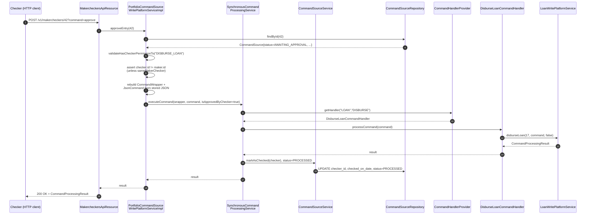
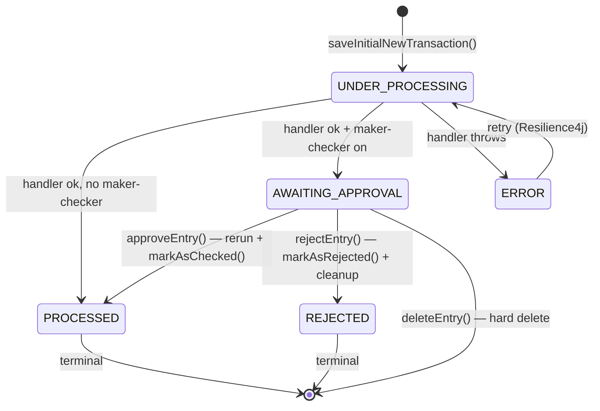

Maker–checker (also called "four-eye" review) is the regulated-finance pattern
where one user creates a transaction and a second user must approve it before
it becomes permanent. Apache Fineract implements this without ever
short-circuiting its command bus — instead, every write goes through the
normal handler, then either commits (no maker–checker) or rolls back to an
`AWAITING_APPROVAL` row that a second user later releases through
`/v1/makercheckers/{id}?command=approve`. This page documents the lifecycle
states, the supporting REST endpoints, and the permissions involved.

## The lifecycle in three states

`CommandSource` rows in `m_portfolio_command_source` carry an integer
`status` column whose values come from
`fineract-core/src/main/java/org/apache/fineract/commands/domain/CommandProcessingResultType.java`:

```java
// fineract-core/.../commands/domain/CommandProcessingResultType.java
public enum CommandProcessingResultType {
    INVALID(0,            "commandProcessingResultType.invalid"),
    PROCESSED(1,          "commandProcessingResultType.processed"),
    AWAITING_APPROVAL(2,  "commandProcessingResultType.awaiting.approval"),
    REJECTED(3,           "commandProcessingResultType.rejected"),
    UNDER_PROCESSING(4,   "commandProcessingResultType.underProcessing"),
    ERROR(5,              "commandProcessingResultType.error");

    public boolean isProcessed()         { return this == PROCESSED; }
    public boolean isAwaitingApproval()  { return this == AWAITING_APPROVAL; }
    public boolean isRejected()          { return this == REJECTED; }
}
```

The three states that matter for maker–checker are `UNDER_PROCESSING`,
`AWAITING_APPROVAL`, and `PROCESSED`. `REJECTED`, `ERROR`, `INVALID` are
terminal.

State transitions live as methods on
`fineract-core/.../commands/domain/CommandSource.java`:

```java
// fineract-core/.../commands/domain/CommandSource.java
public void markAsAwaitingApproval() {
    setStatus(CommandProcessingResultType.AWAITING_APPROVAL);
}
public boolean isAwaitingApproval() { return getStatusEnum().isAwaitingApproval(); }
public boolean isProcessed()        { return getStatusEnum().isProcessed(); }

public void markAsChecked(final AppUser checker) {
    this.checker       = checker;
    this.checkedOnDate = DateUtils.getAuditOffsetDateTime();
    setStatus(CommandProcessingResultType.PROCESSED);
}

public void markAsRejected(final AppUser checker) {
    this.checker       = checker;
    this.checkedOnDate = DateUtils.getAuditOffsetDateTime();
    setStatus(CommandProcessingResultType.REJECTED);
}
```

`maker` and `checker` are `@ManyToOne` relationships to `AppUser`. The
`maker_id` column is `NOT NULL`; `checker_id` is set on
`markAsChecked` or `markAsRejected`.

## When does a command become `AWAITING_APPROVAL`?

The decision is made in
`fineract-core/.../commands/service/CommandSourceService.java`:

```java
// fineract-core/.../commands/service/CommandSourceService.java
@Transactional
public CommandProcessingResult processCommand(NewCommandSourceHandler handler, JsonCommand command,
        CommandSource commandSource, AppUser user, boolean isApprovedByChecker) {

    final CommandProcessingResult result = handler.processCommand(command);

    String permission = commandSource.getPermissionCode();
    boolean isMakerChecker = configurationDomainService.isMakerCheckerEnabledForTask(permission);
    if (isMakerChecker || result.isRollbackTransaction()) {
        if (isApprovedByChecker || user.isCheckerSuperUser()) {
            commandSource.markAsChecked(user);
        } else {
            if (commandSource.isSanitized()) {
                throw new GeneralPlatformDomainRuleException("error.msg.invalid.sanitization",
                        "Maker-checker command can not be sanitized, please change the permission configuration",
                        permission);
            }
            commandSource.markAsAwaitingApproval();
            throw new RollbackTransactionNotApprovedException(commandSource.getId(),
                                                              commandSource.getResourceId());
        }
    }
    return result;
}
```

Two key pieces:

1. **`ConfigurationDomainService.isMakerCheckerEnabledForTask(permissionCode)`**.
   Each task permission (`DISBURSE_LOAN`, `APPROVE_CLIENT`, …) can be flagged
   as maker-checker-required in the `m_permission` table. That flag is what
   this method reads.
2. **`RollbackTransactionNotApprovedException`** — defined in
   `fineract-core/.../commands/exception/RollbackTransactionNotApprovedException.java`:

   ```java
   public class RollbackTransactionNotApprovedException extends RuntimeException {
       private final CommandProcessingResult result;

       public RollbackTransactionNotApprovedException(Long commandId, Long entityId) {
           this.result = new CommandProcessingResultBuilder()
                   .withCommandId(commandId)
                   .withEntityId(entityId)
                   .setRollbackTransaction(true)
                   .build();
       }
   }
   ```

   Because the handler is annotated `@Transactional`, throwing this runtime
   exception triggers a Spring rollback of any domain-side changes
   (loan amount changed, journal entries written, etc.). Meanwhile the
   `CommandSource` row was inserted in a **`REQUIRES_NEW`** transaction by
   `CommandSourceService.saveInitialNewTransaction(...)`, so it survives the
   rollback with `status = AWAITING_APPROVAL`.

This neatly solves two problems at once:

- The handler validation logic ran — if the request was malformed, we'd have
  failed before reaching `markAsAwaitingApproval()`.
- The domain side is clean — nothing is persisted until the checker approves.

## Sequence — maker creates an awaiting-approval row

```mermaid
sequenceDiagram
    autonumber
    participant Maker as Maker (HTTP client)
    participant API as JAX-RS resource (e.g. LoansApiResource)
    participant Portfolio as PortfolioCommandSource<br/>WritePlatformServiceImpl
    participant SCPS as SynchronousCommand<br/>ProcessingService
    participant CSS as CommandSourceService
    participant Repo as CommandSourceRepository
    participant Handler as DisburseLoanCommandHandler
    participant Domain as LoanWritePlatformService

    Maker->>API: POST /v1/loans/17?command=disburse
    API->>Portfolio: logCommandSource(wrapper)
    Portfolio->>Portfolio: validateHasPermissionTo("DISBURSE_LOAN")
    Portfolio->>SCPS: executeCommand(wrapper, command, false)
    SCPS->>CSS: saveInitialNewTransaction(... UNDER_PROCESSING)
    CSS->>Repo: INSERT row, maker_id=current user
    SCPS->>Handler: processCommand(command)
    Handler->>Domain: disburseLoan(...)
    Domain-->>Handler: CommandProcessingResult
    Handler-->>SCPS: result
    SCPS->>CSS: processCommand result (final phase)
    CSS->>CSS: isMakerCheckerEnabledForTask("DISBURSE_LOAN")? → true
    CSS->>Repo: UPDATE status=AWAITING_APPROVAL
    CSS--xSCPS: RollbackTransactionNotApprovedException
    Note over SCPS,Domain: Spring rolls back domain<br/>transaction; CommandSource row<br/>survives (REQUIRES_NEW)
    SCPS-->>Portfolio: rethrow
    Portfolio-->>API: rethrow
    API-->>Maker: 403 / specific error body<br/>(commandId returned in result)
```

The response carries the `commandId` so the UI knows which row to track.

## Checker approves via `/v1/makercheckers/{auditId}`

The REST endpoint lives in
`fineract-provider/src/main/java/org/apache/fineract/commands/api/MakercheckersApiResource.java`:

```java
// fineract-provider/.../commands/api/MakercheckersApiResource.java
@Path("/v1/makercheckers")
@Tag(name = "Maker Checker (or 4-eye) functionality")
public class MakercheckersApiResource {

    private static final String COMMAND_APPROVE = "approve";
    private static final String COMMAND_REJECT  = "reject";

    private final AuditReadPlatformService              readPlatformService;
    private final PortfolioCommandSourceWritePlatformService writePlatformService;

    @GET
    public List<AuditData> retrieveCommands(@Context final UriInfo uriInfo,
                                            @BeanParam MakerCheckerRequest makerCheckerRequest) { /* … */ }

    @GET
    @Path("/searchtemplate")
    public AuditSearchData retrieveAuditSearchTemplate() {
        return readPlatformService.retrieveSearchTemplate("makerchecker");
    }

    @POST
    @Path("{auditId}")
    public CommandProcessingResult approveMakerCheckerEntry(
            @PathParam("auditId") final Long auditId,
            @QueryParam("command")  final String commandParam) {

        CommandProcessingResult result = null;
        if (is(commandParam, COMMAND_APPROVE)) {
            result = writePlatformService.approveEntry(auditId);
        } else if (is(commandParam, COMMAND_REJECT)) {
            final Long id = writePlatformService.rejectEntry(auditId);
            result = CommandProcessingResult.commandOnlyResult(id);
        } else {
            throw new UnrecognizedQueryParamException("command", commandParam);
        }
        return result;
    }

    @DELETE
    @Path("{auditId}")
    public CommandProcessingResult deleteMakerCheckerEntry(@PathParam("auditId") final Long auditId) {
        final Long id = writePlatformService.deleteEntry(auditId);
        return CommandProcessingResult.commandOnlyResult(id);
    }
}
```

Four operations:

| HTTP                              | Service method                                      | Effect                                       |
|-----------------------------------|-----------------------------------------------------|----------------------------------------------|
| `GET /v1/makercheckers`            | `auditReadPlatformService.retrieveAllEntriesToBeChecked(...)` | List awaiting-approval rows in scope |
| `GET /v1/makercheckers/searchtemplate` | `retrieveSearchTemplate("makerchecker")`        | UI helper: actions, entities, users          |
| `POST /v1/makercheckers/{id}?command=approve` | `approveEntry(makerCheckerId)`           | Re-run the command with `isApprovedByChecker=true` |
| `POST /v1/makercheckers/{id}?command=reject`  | `rejectEntry(makerCheckerId)`            | Set `status=REJECTED`, run cleanup services  |
| `DELETE /v1/makercheckers/{id}`    | `deleteEntry(makerCheckerId)`                       | Hard-delete the row                          |

The request parameters used by the `GET` are bound through
`MakerCheckerRequest` (in
`fineract-provider/.../commands/data/request/MakerCheckerRequest.java`):

```java
@QueryParam("actionName")        private String        actionName;
@QueryParam("entityName")        private String        entityName;
@QueryParam("resourceId")        private Long          resourceId;
@QueryParam("makerId")           private Long          makerId;
@QueryParam("makerDateTimeFrom") private ZonedDateTime makerDateTimeFrom;
@QueryParam("makerDateTimeTo")   private ZonedDateTime makerDateTimeTo;
@QueryParam("clientId")          private Long          clientId;
/* … */
```

## `approveEntry(id)` — re-dispatch with the checker's flag

```java
// fineract-core/.../commands/service/PortfolioCommandSourceWritePlatformServiceImpl.java
@Override
public CommandProcessingResult approveEntry(final Long makerCheckerId) {
    final CommandSource commandSourceInput = validateMakerCheckerTransaction(makerCheckerId);
    validateIsUpdateAllowed();

    final CommandWrapper wrapper = CommandWrapper.fromExistingCommand(makerCheckerId,
            commandSourceInput.getActionName(), commandSourceInput.getEntityName(),
            commandSourceInput.getResourceId(), commandSourceInput.getSubResourceId(),
            commandSourceInput.getResourceGetUrl(), commandSourceInput.getProductId(),
            commandSourceInput.getOfficeId(), commandSourceInput.getGroupId(),
            commandSourceInput.getClientId(), commandSourceInput.getLoanId(),
            commandSourceInput.getSavingsId(), commandSourceInput.getTransactionId(),
            commandSourceInput.getCreditBureauId(),
            commandSourceInput.getOrganisationCreditBureauId(),
            commandSourceInput.getIdempotencyKey(), commandSourceInput.getLoanExternalId());

    final JsonElement parsedCommand = this.fromApiJsonHelper.parse(commandSourceInput.getCommandAsJson());
    final JsonCommand command = JsonCommand.fromExistingCommand(makerCheckerId,
            commandSourceInput.getCommandAsJson(), parsedCommand, this.fromApiJsonHelper, /* … */);

    return this.processAndLogCommandService.executeCommand(wrapper, command, /* isApprovedByChecker */ true);
}
```

The approval path rebuilds a `CommandWrapper` and a `JsonCommand` from the
stored `command_as_json` payload, then calls back into
`SynchronousCommandProcessingService.executeCommand(...)` with
`isApprovedByChecker = true`. That flag short-circuits the maker–checker
branch in `CommandSourceService.processCommand`, so the handler executes
normally and the existing row flips to `PROCESSED`.

The pre-flight gate is `validateMakerCheckerTransaction`:

```java
private CommandSource validateMakerCheckerTransaction(final Long makerCheckerId) {
    final CommandSource commandSource = this.commandSourceRepository.findById(makerCheckerId)
            .orElseThrow(() -> new CommandNotFoundException(makerCheckerId));
    if (!commandSource.isAwaitingApproval()) {
        throw new CommandNotAwaitingApprovalException(makerCheckerId);
    }
    AppUser appUser = this.context.authenticatedUser();
    String permissionCode = commandSource.getPermissionCode();
    appUser.validateHasCheckerPermissionTo(permissionCode);
    if (!configurationService.isSameMakerCheckerEnabled() && !appUser.isCheckerSuperUser()) {
        AppUser maker = commandSource.getMaker();
        if (maker == null) {
            throw new UnsupportedCommandException(permissionCode, "Maker user is missing.");
        }
        if (Objects.equals(appUser.getId(), maker.getId())) {
            throw new UnsupportedCommandException(permissionCode, "Can not be checked by the same user.");
        }
    }
    return commandSource;
}
```

Three checks:

1. **Row must be awaiting approval** — `CommandNotAwaitingApprovalException`
   otherwise (from `fineract-core/.../commands/exception/`).
2. **Checker permission** — `AppUser.validateHasCheckerPermissionTo(permissionCode)`
   ensures the user holds e.g. `CHECKER_DISBURSE_LOAN`.
3. **Same-user rule** — unless `isSameMakerCheckerEnabled` is on or the user is
   a checker super-user, the checker cannot be the same person as the maker.

## `rejectEntry(id)` — terminate with cleanup

```java
@Override
public Long rejectEntry(final Long makerCheckerId) {
    final CommandSource commandSourceInput = validateMakerCheckerTransaction(makerCheckerId);
    validateIsUpdateAllowed();
    final AppUser maker = this.context.authenticatedUser();
    commandSourceInput.markAsRejected(maker);
    this.commandSourceRepository.save(commandSourceInput);
    if (cleanupServices != null) {
        for (CleanupService cleanupService : cleanupServices) {
            cleanupService.cleanup(commandSourceInput);
        }
    }
    return makerCheckerId;
}
```

`CleanupService` is an extension point (see
`fineract-provider/.../infrastructure/dataqueries/service/CleanupService.java`)
for clearing up side state that survived the rollback, e.g. uploaded
documents.

## `deleteEntry(id)` — hard delete

```java
@Override @Transactional
public Long deleteEntry(final Long makerCheckerId) {
    validateMakerCheckerTransaction(makerCheckerId);
    validateIsUpdateAllowed();
    this.commandSourceRepository.deleteById(makerCheckerId);
    return makerCheckerId;
}
```

Used to clean up an awaiting-approval row without going through `reject`.

## Sequence — checker approves



## The audit endpoint — read-only history

`fineract-provider/.../commands/api/AuditsApiResource.java` mounts
`/v1/audits`, which serves the same `m_portfolio_command_source` table but
**all states**, not just awaiting approval:

```java
@Path("/v1/audits")
public class AuditsApiResource {

    private static final String RESOURCE_NAME_FOR_PERMISSIONS = "AUDIT";

    @GET
    public String retrieveAuditEntries(@Context final UriInfo uriInfo,
                                       @BeanParam AuditRequest auditRequest, /* paging */) {
        context.authenticatedUser().validateHasReadPermission(RESOURCE_NAME_FOR_PERMISSIONS);
        /* … */
    }

    @GET @Path("{auditId}")
    public AuditData retrieveAuditEntry(@PathParam("auditId") final Long auditId) {
        context.authenticatedUser().validateHasReadPermission(RESOURCE_NAME_FOR_PERMISSIONS);
        return auditReadPlatformService.retrieveAuditEntry(auditId);
    }

    @GET @Path("/searchtemplate")
    public AuditSearchData retrieveAuditSearchTemplate() { /* … */ }
}
```

The DTO returned is
`fineract-provider/src/main/java/org/apache/fineract/commands/data/AuditData.java`:

```java
public final class AuditData implements Serializable {
    private final Long          id;
    private final String        actionName;
    private final String        entityName;
    private final Long          resourceId;
    private final Long          subresourceId;
    private final String        maker;
    private final ZonedDateTime madeOnDate;
    private final String        checker;
    private final ZonedDateTime checkedOnDate;
    private final String        processingResult;
    @Setter
    private       String        commandAsJson;
    private final String        officeName;
    private final String        groupLevelName;
    private final String        groupName;
    private final String        clientName;
    private final String        loanAccountNo;
    private final String        savingsAccountNo;
    private final Long          clientId;
    private final Long          loanId;
    private final String        url;
    private final String        ip;
}
```

`processingResult` is the `CommandProcessingResultType.code` localisation key
(e.g. `"commandProcessingResultType.awaiting.approval"`).

## Permissions and roles

The command bus uses three classes of permissions, all read from
`m_permission`:

| Permission        | Format                | Checked by                                              |
|-------------------|-----------------------|---------------------------------------------------------|
| Task permission   | `<ACTION>_<ENTITY>`   | `validateHasPermissionTo(...)` in `logCommandSource(...)` |
| Checker permission | `CHECKER_<ACTION>_<ENTITY>` | `validateHasCheckerPermissionTo(...)` in `approveEntry(...)` |
| Read permission   | `READ_AUDIT`          | `validateHasReadPermission("AUDIT")` in `AuditsApiResource` |

Built-in role examples:

- A **Maker** role typically holds `DISBURSE_LOAN`, `MAKE_REPAYMENT`, etc.
- A **Checker** role holds the matching `CHECKER_DISBURSE_LOAN`,
  `CHECKER_MAKE_REPAYMENT`, etc. (and usually `READ_AUDIT`).
- `AppUser.isCheckerSuperUser()` returns true for the `Super user` role —
  it can approve any awaiting entry and self-approve.

Two related configuration flags from `ConfigurationDomainService`:

- `isMakerCheckerEnabledForTask(permissionCode)` — per-permission toggle.
- `isSameMakerCheckerEnabled()` — global override allowing the maker to also be
  the checker. Defaults to off.

## Full state diagram



`INVALID` and `UNKNOWN` exist for completeness but are never written by the
default code path; they show up only for migrations from old data.

## Sanitisation interaction

Recall from
`fineract-core/.../commands/service/CommandSourceService.java`:

```java
if (commandSource.isSanitized()) {
    throw new GeneralPlatformDomainRuleException("error.msg.invalid.sanitization", /* … */);
}
```

`CommandWrapper.sanitizeJsonKeys` lets a resource ask the command bus to
**mask sensitive fields** in `command_as_json` before persistence (e.g.
passwords). The sanitisation flag (`m_portfolio_command_source.is_sanitized`)
is incompatible with maker–checker because the checker would have to approve a
command whose payload they can't see. Trying to combine the two throws a
domain-rule exception.

## Operational reading

- **`m_portfolio_command_source.status`** is your primary signal in audit
  dashboards: count by status grouped by `entity_name` and `action_name`.
- **`m_portfolio_command_source.idempotency_key`** is indexed and unique per
  `(action_name, entity_name, idempotency_key)`; useful for replay logs.
- **`m_portfolio_command_source.maker_id`** + `made_on_date_utc` powers
  per-user activity reports.
- The same row tracks `result_status_code` (the HTTP-shaped code returned to
  the client) and `result` (the JSON response body). Both are written by
  `SynchronousCommandProcessingService` in the retry-wrapped result save.

## Cross-references

- [Command Implementation](/command/command-implementation) — full transactional
  walk-through of `SynchronousCommandProcessingService`.
- [Command Handlers Catalogue](/command/command-handlers-catalog) — the
  `@CommandType` entries whose permissions feed the maker–checker matrix.
- [Command Audit Hooks](/command/command-audit) — the new SPI's hooks that
  shadow these state transitions in `m_command`.
